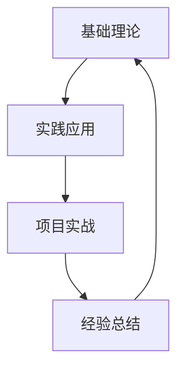

# 技术学习笔记

## 📚 学习方法论

### 费曼学习法

1. **选择概念** - 选择要学习的知识点
2. **教授他人** - 用简单语言解释给别人听
3. **识别差距** - 发现自己理解不够的地方
4. **简化语言** - 用更简单的词语重新组织

### 知识体系构建



## 💡 技术笔记模板

### 新技术学习记录

**技术名称**：[技术名称]
**学习时间**：[开始时间] - [结束时间]
**学习目标**：[具体要达成的目标]

**核心概念**：
- 概念1：解释
- 概念2：解释
- 概念3：解释

**实践项目**：
```bash
# 示例代码或命令
echo "Hello World"
```

**遇到的问题**：
1. 问题描述
   - 解决方案
   - 学到的经验

**总结收获**：
- 关键知识点
- 实用技巧
- 后续学习方向

## 🔧 常用工具笔记

### Git操作备忘

```bash
# 常用Git命令
git status                    # 查看状态
git add .                    # 添加所有文件
git commit -m "message"      # 提交变更
git push origin main         # 推送到远程
git pull origin main         # 拉取远程更新

# 分支操作
git branch                   # 查看分支
git checkout -b feature      # 创建并切换分支
git merge feature           # 合并分支
git branch -d feature       # 删除分支

# 撤销操作
git reset --hard HEAD       # 硬重置到HEAD
git revert <commit-id>      # 撤销某次提交
git stash                   # 暂存当前变更
git stash pop              # 恢复暂存的变更
```

### Docker操作记录

```bash
# 镜像操作
docker images                    # 列出镜像
docker pull ubuntu:20.04       # 拉取镜像
docker rmi image-id            # 删除镜像
docker build -t myapp .        # 构建镜像

# 容器操作
docker ps                      # 查看运行中容器
docker ps -a                   # 查看所有容器
docker run -it ubuntu bash    # 交互式运行容器
docker exec -it container-id bash  # 进入运行中的容器
docker stop container-id      # 停止容器
docker rm container-id        # 删除容器

# 数据卷
docker volume ls              # 列出数据卷
docker volume create myvolume # 创建数据卷
docker run -v myvolume:/data ubuntu  # 挂载数据卷
```

## 📖 读书笔记

### 《Clean Code》要点

#### 命名规范
- **有意义的命名**：变量名要能表达意图
- **避免误导**：不要使用容易混淆的名称
- **做有意义的区分**：避免使用数字系列命名

```go
// 不好的命名
var d int // 经过的时间，以天为单位

// 好的命名
var elapsedTimeInDays int
```

#### 函数设计
- **短小**：函数应该很短小
- **只做一件事**：每个函数只应该做好一件事
- **一个抽象层级**：函数中的语句都要在同一抽象层级上

```python
# 不好的设计
def process_user_data_and_send_email(user_data):
    # 验证数据
    if not user_data.get('email'):
        return False
    
    # 保存到数据库
    save_user_to_db(user_data)
    
    # 发送邮件
    send_welcome_email(user_data['email'])
    
    return True

# 好的设计
def process_user_registration(user_data):
    if not validate_user_data(user_data):
        return False
    
    save_user(user_data)
    send_welcome_email(user_data['email'])
    return True

def validate_user_data(user_data):
    return bool(user_data.get('email'))
```

### 《设计模式》学习记录

#### 单例模式 (Singleton)

**使用场景**：当需要确保一个类只有一个实例时

```python
class Singleton:
    _instance = None
    _initialized = False
    
    def __new__(cls):
        if cls._instance is None:
            cls._instance = super().__new__(cls)
        return cls._instance
    
    def __init__(self):
        if not self._initialized:
            self._initialized = True
            # 初始化代码
```

#### 观察者模式 (Observer)

**使用场景**：当对象间存在一对多依赖关系时

```python
class Subject:
    def __init__(self):
        self._observers = []
    
    def attach(self, observer):
        self._observers.append(observer)
    
    def detach(self, observer):
        self._observers.remove(observer)
    
    def notify(self, message):
        for observer in self._observers:
            observer.update(message)

class Observer:
    def update(self, message):
        print(f"Received: {message}")
```

## 🎯 项目实践总结

### Hugo博客搭建经验

**项目周期**：2天
**技术栈**：Hugo + GitHub Pages + GitHub Actions

**关键收获**：
1. **Hugo Extended版本的重要性**：普通版本不支持SCSS编译
2. **主题选择考虑因素**：文档质量、维护状态、功能丰富度
3. **自动化部署的价值**：GitHub Actions大大简化了部署流程

**踩过的坑**：
1. 使用普通版Hugo导致样式编译失败
2. baseURL配置错误导致GitHub Pages访问异常
3. 中文路径处理问题

**最佳实践总结**：
- 始终使用Extended版本的Hugo
- 本地开发时使用`hugo server --buildDrafts`
- 生产环境构建使用`hugo --minify`
- 合理组织内容目录结构

### 下一个项目规划

**项目目标**：构建个人技术栈管理系统
**技术选型**：
- 后端：Go + Gin框架
- 数据库：PostgreSQL
- 前端：Vue.js 3
- 部署：Docker + Kubernetes

**学习计划**：
1. Week 1-2: Go语言深入学习
2. Week 3-4: Gin框架实战
3. Week 5-6: Vue.js 3组合式API
4. Week 7-8: 项目整合和部署

## 📝 学习资源收集

### 优质技术博客
- [阮一峰的网络日志](https://www.ruanyifeng.com/blog/)
- [廖雪峰的官方网站](https://www.liaoxuefeng.com/)
- [酷壳 – CoolShell](https://coolshell.cn/)

### 在线学习平台
- [极客时间](https://time.geekbang.org/)
- [掘金](https://juejin.cn/)
- [思否](https://segmentfault.com/)

### GitHub优质项目
- [awesome-go](https://github.com/avelino/awesome-go)
- [awesome-python](https://github.com/vinta/awesome-python)
- [developer-roadmap](https://github.com/kamranahmedse/developer-roadmap)

## 🎯 学习目标跟踪

### 2025年技术学习目标

**Q1目标**：
- [x] 掌握Hugo静态网站生成
- [ ] 深入学习Go语言并发编程
- [ ] 完成个人博客系统搭建

**Q2目标**：
- [ ] 学习Kubernetes容器编排
- [ ] 掌握微服务架构设计
- [ ] 完成一个完整的Web应用项目

**学习方法**：
1. 每周技术文章阅读：不少于3篇
2. 实践项目：每月至少完成1个小项目
3. 技术分享：每季度准备1次技术分享
4. 读书计划：每季度读完1本技术书籍

## 📊 知识体系总结

通过持续的学习和实践，已经建立了以下技术知识体系：

**基础技能**：
- 编程语言：Go, Python, JavaScript
- 操作系统：Linux (Ubuntu), Windows WSL2
- 版本控制：Git + GitHub
- 容器技术：Docker基础使用

**Web开发**：
- 静态网站：Hugo, Markdown
- 前端基础：HTML, CSS, JavaScript
- 后端框架：初步接触Gin

**开发工具**：
- 编辑器：VS Code
- 终端：Zsh + Oh My Zsh
- 调试：基本调试技巧

下一阶段将重点深入后端开发和微服务架构。
