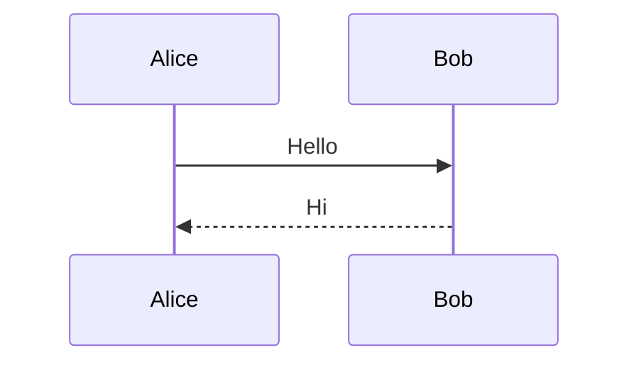

# PlantUML完全离线方案评估

## 📋 问题分析

当前方案虽然编码在客户端完成，但仍然需要从 PlantUML 官方服务器加载图片，**并不是完全离线的方案**。

**问题**：
- ❌ 仍然依赖外部服务器（PlantUML官方服务器）
- ❌ 网络问题会导致渲染失败
- ❌ 无法实现真正的离线渲染

---

## 🔍 完全离线方案评估

### 方案A：WebAssembly版本的PlantUML（推荐 ⭐⭐⭐⭐）

#### 可行性：✅ **高度可行**

#### 技术方案
使用 **plantuml-wasm** 或类似的 WebAssembly 版本，在浏览器中直接渲染：

```javascript
// 使用 plantuml-wasm
import { PlantUML } from 'plantuml-wasm';

const plantuml = new PlantUML();
const svg = await plantuml.render(plantumlCode);
```

#### 优点
- ✅ **完全离线**：不依赖任何外部服务器
- ✅ **纯客户端**：所有渲染在浏览器中完成
- ✅ **GitHub Pages兼容**：纯静态文件，完全支持
- ✅ **性能好**：WebAssembly 性能接近原生

#### 缺点
- ⚠️ **文件大小**：WASM 文件可能较大（5-10MB）
- ⚠️ **浏览器兼容**：需要支持 WebAssembly 的浏览器
- ⚠️ **加载时间**：首次加载需要下载 WASM 文件

#### 实施难度：⭐⭐⭐（较高）
- 需要引入 WebAssembly 文件
- 需要处理异步加载
- 需要处理浏览器兼容性

---

### 方案B：构建时预渲染（最佳实践 ⭐⭐⭐⭐⭐）

#### 可行性：✅ **高度可行**

#### 技术方案
在 **GitHub Actions** 构建时使用 PlantUML 工具生成 SVG/PNG，然后部署静态文件：

```yaml
# .github/workflows/jekyll.yml
- name: Render PlantUML
  run: |
    # 安装 PlantUML
    wget https://github.com/plantuml/plantuml/releases/download/v1.2023.12/plantuml-1.2023.12.jar
    
    # 查找所有 PlantUML 代码块
    find docs -name "*.md" -exec grep -l "```plantuml" {} \; | \
    while read file; do
      # 提取 PlantUML 代码
      # 渲染为 SVG
      # 替换代码块为图片链接
    done
```

#### 优点
- ✅ **完全静态**：所有图表都是静态图片
- ✅ **性能最优**：无需运行时渲染
- ✅ **完全离线**：不依赖任何外部服务
- ✅ **兼容性好**：所有浏览器都支持图片
- ✅ **SEO友好**：图片可以被搜索引擎索引

#### 缺点
- ⚠️ **构建时间**：每次构建需要渲染所有图表
- ⚠️ **维护成本**：修改 PlantUML 代码需要重新构建
- ⚠️ **文件管理**：需要管理生成的图片文件

#### 实施难度：⭐⭐⭐⭐（高）
- 需要配置 GitHub Actions
- 需要编写脚本提取和渲染 PlantUML
- 需要修改 Markdown 文件

---

### 方案C：使用Mermaid替代（简单方案 ⭐⭐⭐）

#### 可行性：✅ **高度可行**

#### 技术方案
将 PlantUML 图表转换为 Mermaid 图表，GitHub Pages 原生支持 Mermaid：

```markdown

```

#### 优点
- ✅ **GitHub原生支持**：无需额外配置
- ✅ **完全离线**：GitHub 自动渲染
- ✅ **简单易用**：语法简单直观

#### 缺点
- ⚠️ **功能限制**：Mermaid 功能不如 PlantUML 强大
- ⚠️ **迁移成本**：需要重写所有 PlantUML 图表
- ⚠️ **图表类型**：某些 PlantUML 图表类型不支持

#### 实施难度：⭐⭐（中等）
- 需要将 PlantUML 转换为 Mermaid
- 需要修改所有文档

---

## 📊 方案对比

| 方案 | 完全离线 | 实施难度 | 性能 | 维护成本 | 推荐度 |
|------|----------|----------|------|----------|--------|
| **WebAssembly** | ✅ | ⭐⭐⭐ | ⭐⭐⭐⭐ | ⭐⭐ | ⭐⭐⭐⭐ |
| **构建时预渲染** | ✅ | ⭐⭐⭐⭐ | ⭐⭐⭐⭐⭐ | ⭐⭐⭐ | ⭐⭐⭐⭐⭐ |
| **Mermaid替代** | ✅ | ⭐⭐ | ⭐⭐⭐⭐ | ⭐⭐ | ⭐⭐⭐ |

---

## 🎯 推荐方案

### 短期方案（快速解决）：WebAssembly版本

**理由**：
1. 可以实现完全离线渲染
2. 不需要修改现有 PlantUML 代码
3. 实施相对简单

**实施步骤**：
1. 引入 `plantuml-wasm` 或类似的 WebAssembly 库
2. 修改渲染脚本，使用 WASM 渲染
3. 处理异步加载和错误处理

### 长期方案（最佳实践）：构建时预渲染

**理由**：
1. 性能最优，用户体验最好
2. 完全静态，SEO友好
3. 不依赖浏览器能力

**实施步骤**：
1. 配置 GitHub Actions
2. 编写 PlantUML 提取和渲染脚本
3. 自动替换代码块为图片

---

## ⚠️ 重要说明

### GitHub Pages 限制

**GitHub Pages 是纯静态托管**，无法运行：
- ❌ 服务器端应用（Java、Python、Node.js等）
- ❌ 数据库
- ❌ 后端服务

**只能使用**：
- ✅ 静态文件（HTML、CSS、JavaScript）
- ✅ 客户端 JavaScript（包括 WebAssembly）
- ✅ 构建时生成的静态文件

### 完全离线方案的要求

要实现**完全离线**的 PlantUML 渲染，必须满足：
1. ✅ 所有渲染在客户端完成（WebAssembly）
2. ✅ 或所有图表在构建时预渲染（静态图片）

**不能依赖**：
- ❌ 任何外部服务器（包括 PlantUML 官方服务器）
- ❌ 任何需要网络请求的服务

---

## 🚀 下一步行动

1. **评估需求**：确定需要渲染的 PlantUML 图表数量和复杂度
2. **选择方案**：
   - 如果图表很多且复杂 → 推荐构建时预渲染
   - 如果图表较少且简单 → 推荐 WebAssembly
3. **实施测试**：在测试环境验证方案可行性
4. **逐步迁移**：逐步替换现有方案

---

## 📚 参考资源

- [PlantUML WebAssembly](https://github.com/plantuml/plantuml-wasm)
- [GitHub Actions 文档](https://docs.github.com/en/actions)
- [Mermaid 文档](https://mermaid.js.org/)
- [PlantUML 官方文档](https://plantuml.com/)

---

**评估日期**：2025-11-10  
**状态**：待实施
