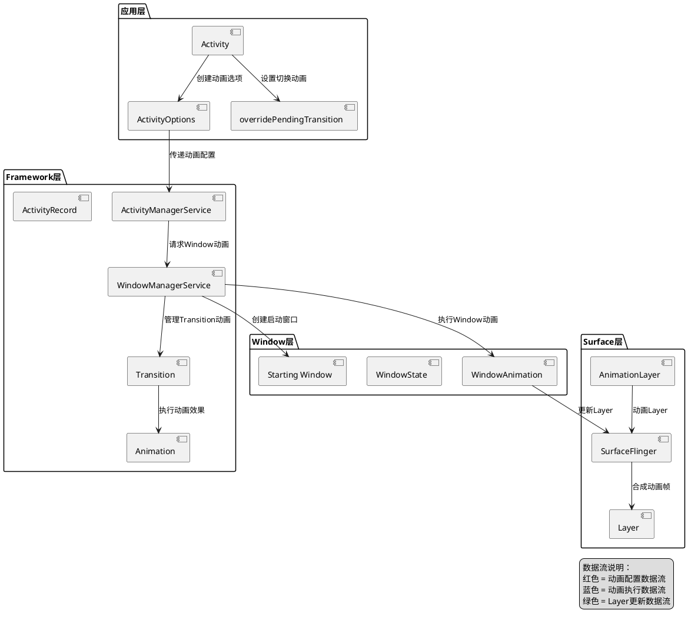
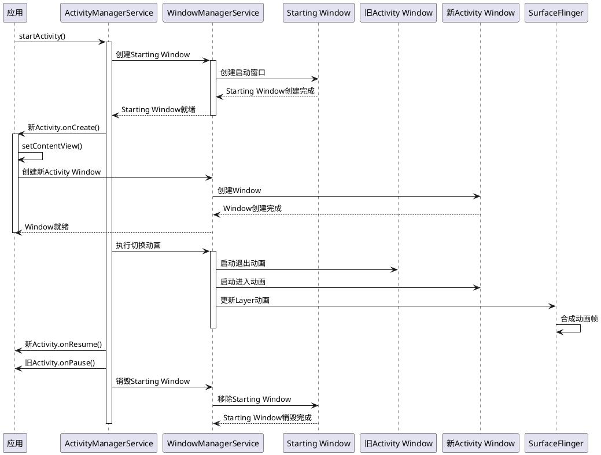
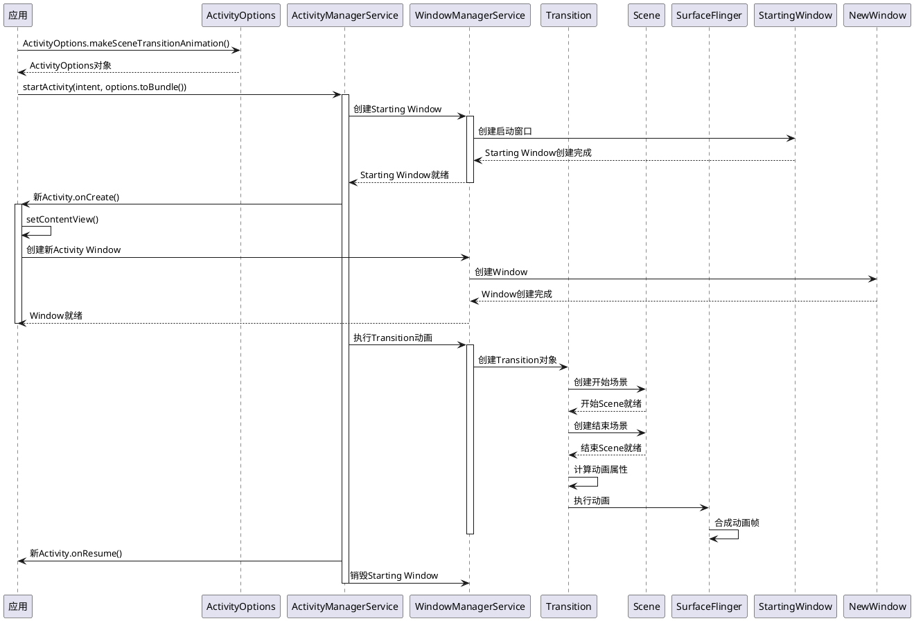
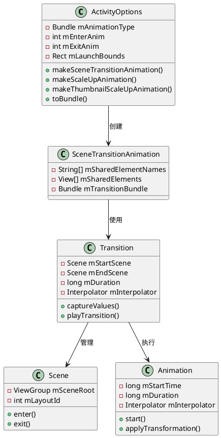
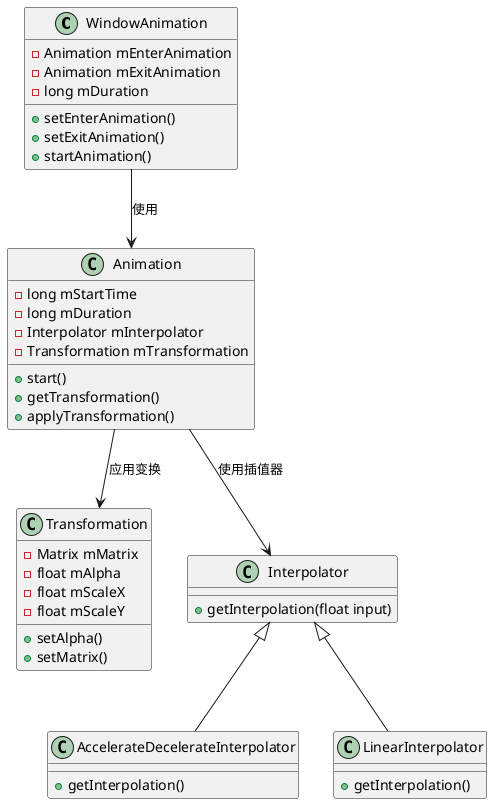
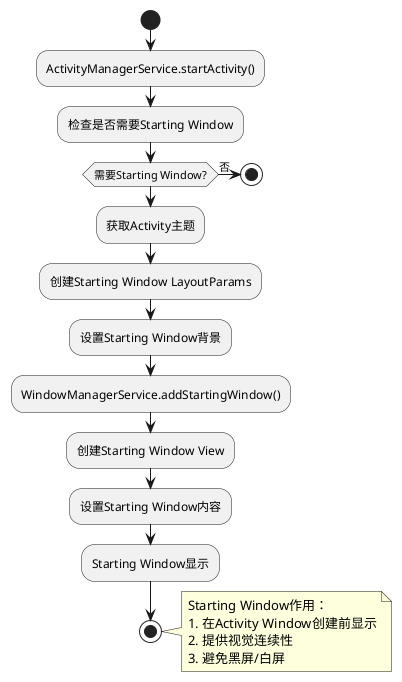
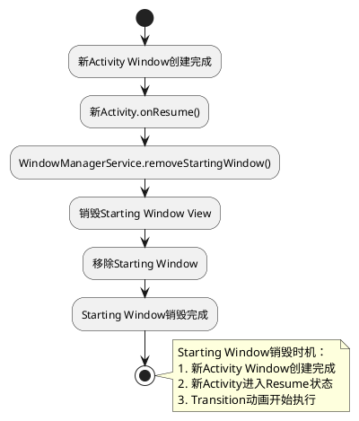
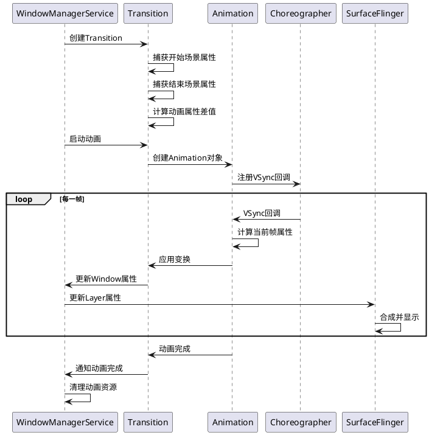
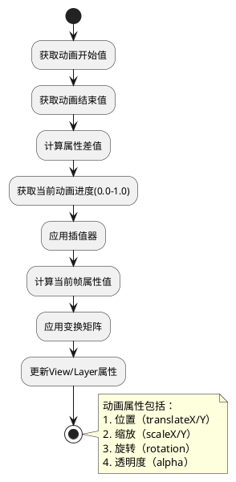

# Android Activity Transition动画实现机制分析

## 1. 概述

Activity Transition动画是Android系统中实现Activity切换视觉效果的核心机制。本文档详细分析Activity Transition动画的实现原理、架构设计、关键流程和优化方案。

## 2. Transition动画架构

### 2.1 整体架构组件图



### 2.2 Transition动画类型

Android支持多种Transition动画类型：

1. **传统动画（overridePendingTransition）**
   - 基于Window动画
   - 简单但功能有限
   - 兼容性好

2. **ActivityOptions动画**
   - 基于Transition框架
   - 功能强大，支持共享元素
   - Android 5.0+支持

3. **共享元素过渡（Shared Element Transition）**
   - 基于Transition框架
   - 支持元素共享动画
   - Android 5.0+支持

## 3. Transition动画执行流程

### 3.1 传统动画执行流程时序图



### 3.2 ActivityOptions动画执行流程时序图



## 4. Transition动画核心类图

### 4.1 ActivityOptions类图



### 4.2 Window动画类图



## 5. Starting Window机制

### 5.1 Starting Window创建流程



### 5.2 Starting Window销毁流程



## 6. Transition动画类型详解

### 6.1 传统Window动画

**实现方式**：
```java
// 设置进入和退出动画
overridePendingTransition(R.anim.slide_in_right, R.anim.slide_out_left);
```

**动画资源文件**：
```xml
<!-- slide_in_right.xml -->
<set xmlns:android="http://schemas.android.com/apk/res/android">
    <translate
        android:fromXDelta="100%p"
        android:toXDelta="0"
        android:duration="300"/>
</set>

<!-- slide_out_left.xml -->
<set xmlns:android="http://schemas.android.com/apk/res/android">
    <translate
        android:fromXDelta="0"
        android:toXDelta="-100%p"
        android:duration="300"/>
</set>
```

**执行流程**：
1. 旧Activity Window执行退出动画
2. 新Activity Window执行进入动画
3. 两个动画同时执行
4. 动画完成后移除Starting Window

### 6.2 ActivityOptions动画

**实现方式**：
```java
// 创建ActivityOptions
ActivityOptions options = ActivityOptions.makeSceneTransitionAnimation(
    this,
    sharedElement,
    "shared_element_name"
);

// 启动Activity
startActivity(intent, options.toBundle());
```

**支持的动画类型**：
1. **makeSceneTransitionAnimation**：共享元素过渡
2. **makeScaleUpAnimation**：缩放动画
3. **makeThumbnailScaleUpAnimation**：缩略图缩放动画
4. **makeCustomAnimation**：自定义动画

### 6.3 共享元素过渡动画

**实现方式**：
```java
// 源Activity
View sharedElement = findViewById(R.id.shared_element);
sharedElement.setTransitionName("shared_element_name");

ActivityOptions options = ActivityOptions.makeSceneTransitionAnimation(
    this,
    sharedElement,
    "shared_element_name"
);
startActivity(intent, options.toBundle());

// 目标Activity
View sharedElement = findViewById(R.id.shared_element);
sharedElement.setTransitionName("shared_element_name");
```

**执行流程**：
1. 捕获共享元素的属性（位置、大小、颜色等）
2. 创建Transition动画
3. 计算共享元素的动画路径
4. 执行共享元素动画
5. 执行其他元素的进入/退出动画

## 7. Transition动画执行机制

### 7.1 动画执行时序图



### 7.2 动画属性计算流程



## 8. Transition动画优化

### 8.1 性能优化要点

1. **减少动画复杂度**
   - 避免复杂的路径动画
   - 减少同时动画的元素数量
   - 使用硬件加速

2. **优化动画时长**
   - 设置合适的动画时长（200-300ms）
   - 避免动画时长过长
   - 使用合适的插值器

3. **优化Starting Window**
   - 使用简单的Starting Window内容
   - 避免复杂的布局
   - 快速创建和销毁

4. **优化Layer管理**
   - 减少Layer创建销毁
   - 复用Layer资源
   - 优化Layer合成

### 8.2 常见问题及解决方案

#### 8.2.1 动画卡顿

**原因**：
- 动画计算耗时
- Layer合成耗时
- VSync丢失

**解决方案**：
- 使用硬件加速
- 优化动画计算
- 减少动画复杂度

#### 8.2.2 动画闪烁

**原因**：
- Starting Window与Activity Window切换异常
- Layer更新时序问题
- VSync同步问题

**解决方案**：
- 优化Starting Window创建时机
- 确保Layer更新同步
- 稳定VSync信号

#### 8.2.3 动画不执行

**原因**：
- ActivityOptions配置错误
- Transition未正确初始化
- Window动画未启用

**解决方案**：
- 检查ActivityOptions配置
- 确保Transition正确初始化
- 启用Window动画

## 9. Transition动画关键日志

### 9.1 Starting Window日志

```bash
# Starting Window创建日志
adb logcat | grep -E "StartingWindow|addStartingWindow|makeVisible"

# 正常输出示例：
# 09-24 19:05:23.456  1000  1234  1234 D WindowManager: addStartingWindow: activity=com.example/.MainActivity
# 09-24 19:05:23.567  1000  1234  1234 D WindowManager: makeVisible: window=StartingWindow{abc123}

# 异常情况：
# - Starting Window未创建：无addStartingWindow日志
# - Starting Window创建失败：addStartingWindow返回错误
```

### 9.2 Transition动画日志

```bash
# Transition动画日志
adb logcat | grep -E "Transition|ActivityOptions|SceneTransition"

# 正常输出示例：
# 09-24 19:05:23.456  1000  1234  1234 D Transition: startTransition: type=SLIDE
# 09-24 19:05:23.567  1000  1234  1234 D Transition: endTransition: duration=300ms

# 异常情况：
# - Transition未启动：无startTransition日志
# - Transition执行失败：Transition error
```

### 9.3 Window动画日志

```bash
# Window动画日志
adb logcat | grep -E "WindowAnimation|overridePendingTransition|Animation.*start"

# 正常输出示例：
# 09-24 19:05:23.456  1000  1234  1234 D WindowAnimation: startAnimation: enterAnim=R.anim.slide_in_right
# 09-24 19:05:23.567  1000  1234  1234 D WindowAnimation: animationComplete: duration=300ms

# 异常情况：
# - 动画未启动：无startAnimation日志
# - 动画执行失败：animation error
```

## 10. Transition动画最佳实践

### 10.1 动画选择建议

1. **简单切换**：使用overridePendingTransition
2. **复杂动画**：使用ActivityOptions
3. **共享元素**：使用Shared Element Transition
4. **自定义动画**：使用ActivityOptions.makeCustomAnimation

### 10.2 动画配置建议

1. **动画时长**：200-300ms
2. **插值器**：AccelerateDecelerateInterpolator
3. **Starting Window**：简单背景，快速创建
4. **硬件加速**：启用硬件加速

### 10.3 性能优化建议

1. 减少动画复杂度
2. 优化Starting Window
3. 使用硬件加速
4. 避免频繁动画切换

## 11. 总结

Activity Transition动画是Android系统实现流畅Activity切换的关键机制。通过Starting Window、Transition框架、Window动画等组件的协同工作，实现了视觉上流畅的Activity切换效果。理解Transition动画的实现机制，有助于优化Activity切换体验，解决黑屏、白屏、闪屏等问题。
