# Android Binder机制详解

## 1. 概述

Binder是Android系统进程间通信（IPC）的核心机制，它提供了高效、安全、透明的跨进程通信能力。Android系统的大部分功能都依赖于Binder机制，包括系统服务调用、Activity启动、ContentProvider访问等。

### 1.1 Binder机制的特点

- **高效性**：采用内存映射（mmap）技术，只需一次数据拷贝
- **安全性**：基于UID/PID的身份验证机制
- **透明性**：对上层应用提供类似本地调用的接口
- **稳定性**：支持死亡通知（DeathRecipient）机制
- **跨语言**：支持Java、C++、Native等多种语言

### 1.2 Binder在Android系统中的应用

```
Android系统架构
├── 应用层（App）
│   └── 通过Binder调用系统服务
├── Framework层
│   ├── ActivityManagerService（AMS）
│   ├── WindowManagerService（WMS）
│   ├── PackageManagerService（PMS）
│   └── 其他系统服务
├── Native层
│   ├── Binder驱动
│   └── Binder库（libbinder）
└── 内核层
    └── Binder驱动（/dev/binder）
```

### 1.3 Binder与传统IPC机制对比

| 特性 | Binder | Socket | 管道 | 共享内存 |
|------|--------|--------|------|----------|
| 性能 | 高（一次拷贝） | 中（两次拷贝） | 低（两次拷贝） | 最高（零拷贝） |
| 安全性 | 高（UID验证） | 低 | 低 | 低 |
| 易用性 | 高（透明调用） | 中 | 低 | 低 |
| 稳定性 | 高（死亡通知） | 中 | 中 | 低 |

## 2. Binder架构设计

### 2.1 整体架构

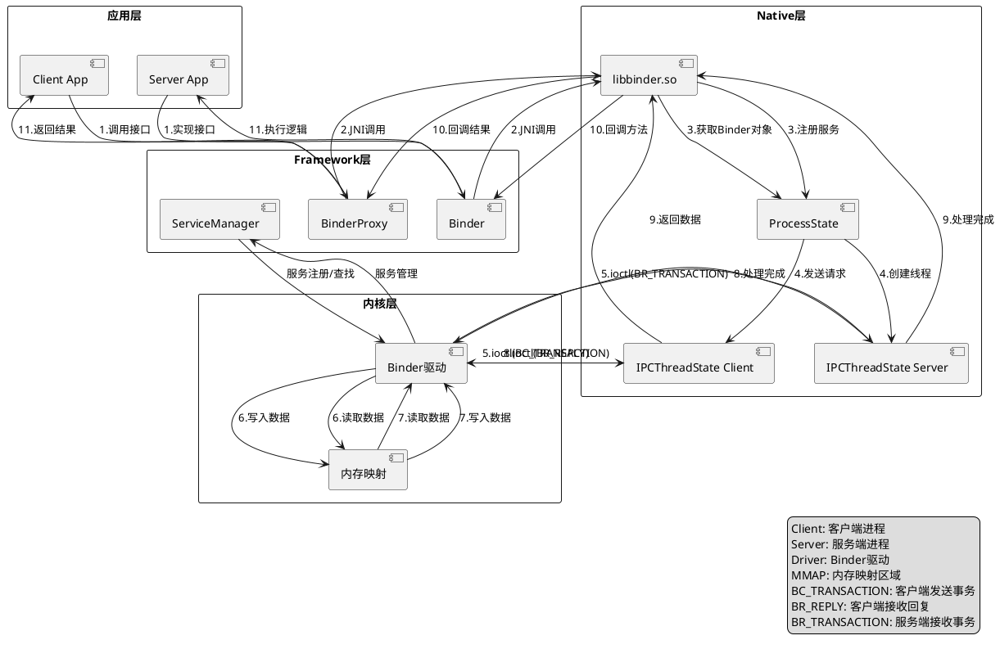
```plantuml
@startuml Binder整体架构
skinparam packageStyle rectangle

package "应用层" {
    [Client App] as Client
    [Server App] as Server
}

package "Framework层" {
    [BinderProxy] as Proxy
    [Binder] as Binder
    [ServiceManager] as SM
}

package "Native层" {
    [libbinder.so] as Lib
    [ProcessState] as PS
    [IPCThreadState Client] as IPC_C
    [IPCThreadState Server] as IPC_S
}

package "内核层" {
    [Binder驱动] as Driver
    [内存映射] as MMAP
}

' Client端流程（左侧）
Client --> Proxy : 1.调用接口
Proxy --> Lib : 2.JNI调用
Lib --> PS : 3.获取Binder对象
PS --> IPC_C : 4.发送请求
IPC_C --> Driver : 5.ioctl(BC_TRANSACTION)
Driver --> MMAP : 6.写入数据
MMAP --> Driver : 7.读取数据
Driver --> IPC_C : 8.ioctl(BR_REPLY)
IPC_C --> Lib : 9.返回数据
Lib --> Proxy : 10.回调结果
Proxy --> Client : 11.返回结果

' Server端流程（右侧）
Server --> Binder : 1.实现接口
Binder --> Lib : 2.JNI调用
Lib --> PS : 3.注册服务
PS --> IPC_S : 4.创建线程
IPC_S --> Driver : 5.ioctl(BR_TRANSACTION)
Driver --> MMAP : 6.读取数据
MMAP --> Driver : 7.写入数据
Driver --> IPC_S : 8.处理完成
IPC_S --> Lib : 9.处理完成
Lib --> Binder : 10.回调方法
Binder --> Server : 11.执行逻辑

' ServiceManager流程（独立）
SM --> Driver : 服务注册/查找
Driver --> SM : 服务管理

legend right
    Client: 客户端进程
    Server: 服务端进程
    Driver: Binder驱动
    MMAP: 内存映射区域
    BC_TRANSACTION: 客户端发送事务
    BR_REPLY: 客户端接收回复
    BR_TRANSACTION: 服务端接收事务
endlegend
```

### 2.2 组件交互图

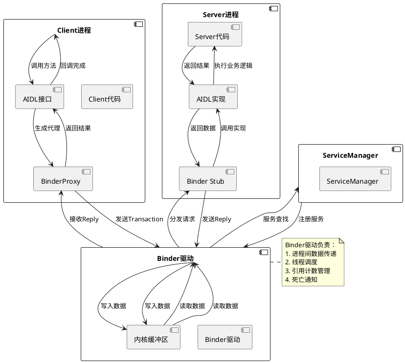
```plantuml
@startuml Binder组件交互图
component "Client进程" as Client {
    [Client代码] as CCode
    [AIDL接口] as AIDL
    [BinderProxy] as Proxy
}

component "Server进程" as Server {
    [Server代码] as SCode
    [AIDL实现] as AIDLImpl
    [Binder Stub] as Stub
}

component "ServiceManager" as SM {
    [ServiceManager] as SMImpl
}

component "Binder驱动" as Driver {
    [Binder驱动] as DriverImpl
    [内核缓冲区] as Buffer
}

Client --> AIDL : 调用方法
AIDL --> Proxy : 生成代理
Proxy --> Driver : 发送Transaction
Driver --> Buffer : 写入数据
Buffer --> Driver : 读取数据
Driver --> Stub : 分发请求
Stub --> AIDLImpl : 调用实现
AIDLImpl --> SCode : 执行业务逻辑
SCode --> AIDLImpl : 返回结果
AIDLImpl --> Stub : 返回数据
Stub --> Driver : 发送Reply
Driver --> Buffer : 写入数据
Buffer --> Driver : 读取数据
Driver --> Proxy : 接收Reply
Proxy --> AIDL : 返回结果
AIDL --> Client : 回调完成

SM --> Driver : 注册服务
Driver --> SM : 服务查找

note right of Driver
    Binder驱动负责：
    1. 进程间数据传递
    2. 线程调度
    3. 引用计数管理
    4. 死亡通知
end note
```

### 2.3 数据流向图

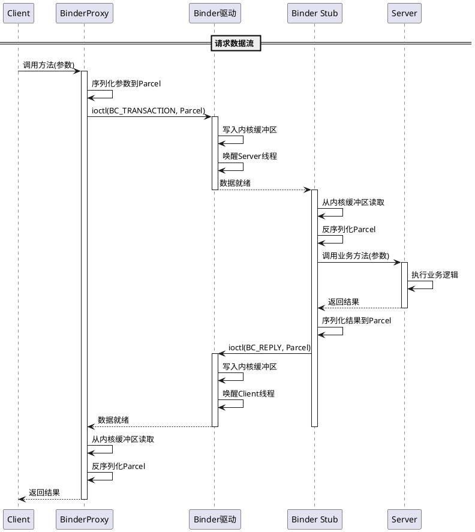
```plantuml
@startuml Binder数据流向
participant "Client" as C
participant "BinderProxy" as P
participant "Binder驱动" as D
participant "Binder Stub" as S
participant "Server" as SV

== 请求数据流 ==
C -> P : 调用方法(参数)
activate P
P -> P : 序列化参数到Parcel
P -> D : ioctl(BC_TRANSACTION, Parcel)
activate D
D -> D : 写入内核缓冲区
D -> D : 唤醒Server线程
D --> S : 数据就绪
deactivate D
activate S
S -> S : 从内核缓冲区读取
S -> S : 反序列化Parcel
S -> SV : 调用业务方法(参数)
activate SV
SV -> SV : 执行业务逻辑
SV --> S : 返回结果
deactivate SV
S -> S : 序列化结果到Parcel
S -> D : ioctl(BC_REPLY, Parcel)
activate D
D -> D : 写入内核缓冲区
D -> D : 唤醒Client线程
D --> P : 数据就绪
deactivate D
deactivate S
P -> P : 从内核缓冲区读取
P -> P : 反序列化Parcel
P --> C : 返回结果
deactivate P
```

## 3. 核心组件

### 3.1 Java层核心类

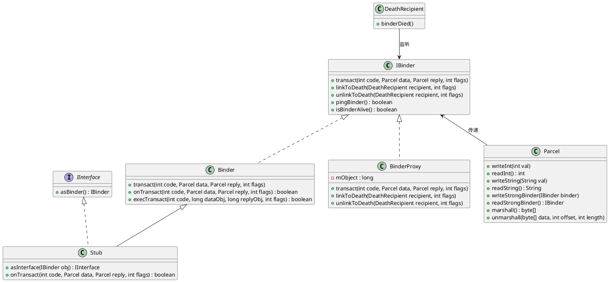
```plantuml
@startuml Binder Java层类图
class IBinder {
    +transact(int code, Parcel data, Parcel reply, int flags)
    +linkToDeath(DeathRecipient recipient, int flags)
    +unlinkToDeath(DeathRecipient recipient, int flags)
    +pingBinder() : boolean
    +isBinderAlive() : boolean
}

class Binder {
    +transact(int code, Parcel data, Parcel reply, int flags)
    +onTransact(int code, Parcel data, Parcel reply, int flags) : boolean
    +execTransact(int code, long dataObj, long replyObj, int flags) : boolean
}

class BinderProxy {
    -mObject : long
    +transact(int code, Parcel data, Parcel reply, int flags)
    +linkToDeath(DeathRecipient recipient, int flags)
    +unlinkToDeath(DeathRecipient recipient, int flags)
}

class Parcel {
    +writeInt(int val)
    +readInt() : int
    +writeString(String val)
    +readString() : String
    +writeStrongBinder(IBinder binder)
    +readStrongBinder() : IBinder
    +marshall() : byte[]
    +unmarshall(byte[] data, int offset, int length)
}

class DeathRecipient {
    +binderDied()
}

interface IInterface {
    +asBinder() : IBinder
}

class Stub {
    +asInterface(IBinder obj) : IInterface
    +onTransact(int code, Parcel data, Parcel reply, int flags) : boolean
}

IBinder <|.. Binder
IBinder <|.. BinderProxy
IInterface <|.. Stub
Binder <|-- Stub
IBinder <-- Parcel : 传递
DeathRecipient --> IBinder : 监听
```

### 3.2 Native层核心类

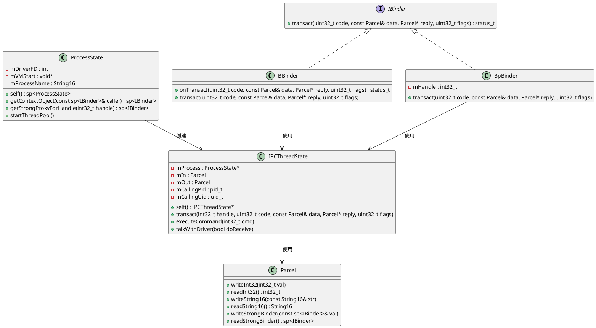
```plantuml
@startuml Binder Native层类图
class ProcessState {
    -mDriverFD : int
    -mVMStart : void*
    -mProcessName : String16
    +self() : sp<ProcessState>
    +getContextObject(const sp<IBinder>& caller) : sp<IBinder>
    +getStrongProxyForHandle(int32_t handle) : sp<IBinder>
    +startThreadPool()
}

class IPCThreadState {
    -mProcess : ProcessState*
    -mIn : Parcel
    -mOut : Parcel
    -mCallingPid : pid_t
    -mCallingUid : uid_t
    +self() : IPCThreadState*
    +transact(int32_t handle, uint32_t code, const Parcel& data, Parcel* reply, uint32_t flags)
    +executeCommand(int32_t cmd)
    +talkWithDriver(bool doReceive)
}

class BBinder {
    +onTransact(uint32_t code, const Parcel& data, Parcel* reply, uint32_t flags) : status_t
    +transact(uint32_t code, const Parcel& data, Parcel* reply, uint32_t flags)
}

class BpBinder {
    -mHandle : int32_t
    +transact(uint32_t code, const Parcel& data, Parcel* reply, uint32_t flags)
}

class Parcel {
    +writeInt32(int32_t val)
    +readInt32() : int32_t
    +writeString16(const String16& str)
    +readString16() : String16
    +writeStrongBinder(const sp<IBinder>& val)
    +readStrongBinder() : sp<IBinder>
}

interface IBinder {
    +transact(uint32_t code, const Parcel& data, Parcel* reply, uint32_t flags) : status_t
}

ProcessState --> IPCThreadState : 创建
IPCThreadState --> Parcel : 使用
IBinder <|.. BBinder
IBinder <|.. BpBinder
BBinder --> IPCThreadState : 使用
BpBinder --> IPCThreadState : 使用
```

### 3.3 Binder驱动数据结构

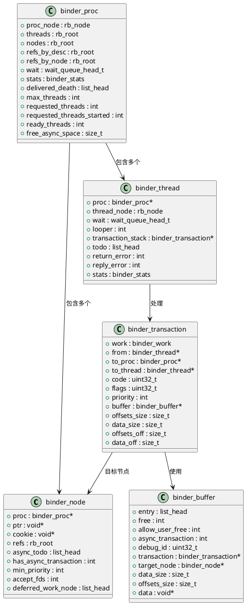
```plantuml
@startuml Binder驱动数据结构
class binder_node {
    +proc : binder_proc*
    +ptr : void*
    +cookie : void*
    +refs : rb_root
    +async_todo : list_head
    +has_async_transaction : int
    +min_priority : int
    +accept_fds : int
    +deferred_work_node : list_head
}

class binder_proc {
    +proc_node : rb_node
    +threads : rb_root
    +nodes : rb_root
    +refs_by_desc : rb_root
    +refs_by_node : rb_root
    +wait : wait_queue_head_t
    +stats : binder_stats
    +delivered_death : list_head
    +max_threads : int
    +requested_threads : int
    +requested_threads_started : int
    +ready_threads : int
    +free_async_space : size_t
}

class binder_thread {
    +proc : binder_proc*
    +thread_node : rb_node
    +wait : wait_queue_head_t
    +looper : int
    +transaction_stack : binder_transaction*
    +todo : list_head
    +return_error : int
    +reply_error : int
    +stats : binder_stats
}

class binder_transaction {
    +work : binder_work
    +from : binder_thread*
    +to_proc : binder_proc*
    +to_thread : binder_thread*
    +code : uint32_t
    +flags : uint32_t
    +priority : int
    +buffer : binder_buffer*
    +offsets_size : size_t
    +data_size : size_t
    +offsets_off : size_t
    +data_off : size_t
}

class binder_buffer {
    +entry : list_head
    +free : int
    +allow_user_free : int
    +async_transaction : int
    +debug_id : uint32_t
    +transaction : binder_transaction*
    +target_node : binder_node*
    +data_size : size_t
    +offsets_size : size_t
    +data : void*
}

binder_proc --> binder_thread : 包含多个
binder_proc --> binder_node : 包含多个
binder_thread --> binder_transaction : 处理
binder_transaction --> binder_buffer : 使用
binder_transaction --> binder_node : 目标节点
```

## 4. Binder通信流程

### 4.1 服务注册流程

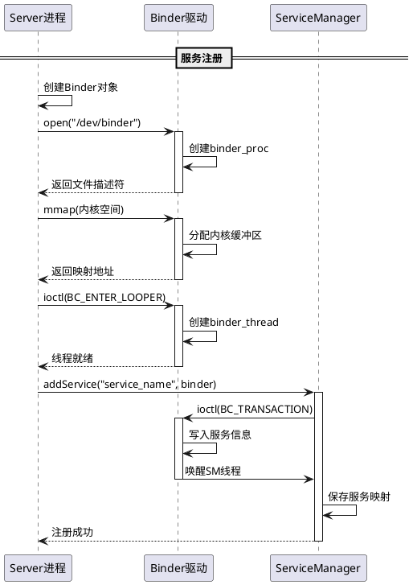
```plantuml
@startuml Binder服务注册流程
participant "Server进程" as Server
participant "Binder驱动" as Driver
participant "ServiceManager" as SM

== 服务注册 ==
Server -> Server : 创建Binder对象
Server -> Driver : open("/dev/binder")
activate Driver
Driver -> Driver : 创建binder_proc
Driver --> Server : 返回文件描述符
deactivate Driver

Server -> Driver : mmap(内核空间)
activate Driver
Driver -> Driver : 分配内核缓冲区
Driver --> Server : 返回映射地址
deactivate Driver

Server -> Driver : ioctl(BC_ENTER_LOOPER)
activate Driver
Driver -> Driver : 创建binder_thread
Driver --> Server : 线程就绪
deactivate Driver

Server -> SM : addService("service_name", binder)
activate SM
SM -> Driver : ioctl(BC_TRANSACTION)
activate Driver
Driver -> Driver : 写入服务信息
Driver -> SM : 唤醒SM线程
deactivate Driver
SM -> SM : 保存服务映射
SM --> Server : 注册成功
deactivate SM
```

### 4.2 服务查找流程

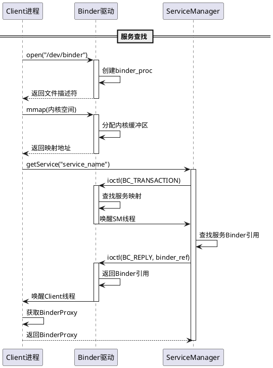
```plantuml
@startuml Binder服务查找流程
participant "Client进程" as Client
participant "Binder驱动" as Driver
participant "ServiceManager" as SM

== 服务查找 ==
Client -> Driver : open("/dev/binder")
activate Driver
Driver -> Driver : 创建binder_proc
Driver --> Client : 返回文件描述符
deactivate Driver

Client -> Driver : mmap(内核空间)
activate Driver
Driver -> Driver : 分配内核缓冲区
Driver --> Client : 返回映射地址
deactivate Driver

Client -> SM : getService("service_name")
activate SM
SM -> Driver : ioctl(BC_TRANSACTION)
activate Driver
Driver -> Driver : 查找服务映射
Driver -> SM : 唤醒SM线程
deactivate Driver
SM -> SM : 查找服务Binder引用
SM -> Driver : ioctl(BC_REPLY, binder_ref)
activate Driver
Driver -> Driver : 返回Binder引用
Driver -> Client : 唤醒Client线程
deactivate Driver
Client -> Client : 获取BinderProxy
Client --> SM : 返回BinderProxy
deactivate SM
```

### 4.3 跨进程调用流程

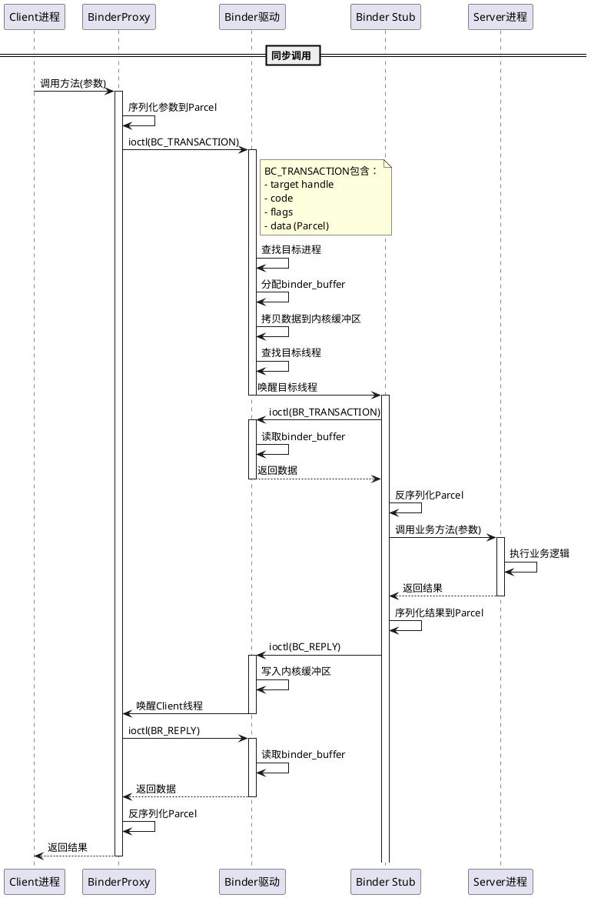
```plantuml
@startuml Binder跨进程调用流程
participant "Client进程" as Client
participant "BinderProxy" as Proxy
participant "Binder驱动" as Driver
participant "Binder Stub" as Stub
participant "Server进程" as Server

== 同步调用 ==
Client -> Proxy : 调用方法(参数)
activate Proxy
Proxy -> Proxy : 序列化参数到Parcel
Proxy -> Driver : ioctl(BC_TRANSACTION)
activate Driver
note right of Driver
    BC_TRANSACTION包含：
    - target handle
    - code
    - flags
    - data (Parcel)
end note
Driver -> Driver : 查找目标进程
Driver -> Driver : 分配binder_buffer
Driver -> Driver : 拷贝数据到内核缓冲区
Driver -> Driver : 查找目标线程
Driver -> Stub : 唤醒目标线程
deactivate Driver
activate Stub
Stub -> Driver : ioctl(BR_TRANSACTION)
activate Driver
Driver -> Driver : 读取binder_buffer
Driver --> Stub : 返回数据
deactivate Driver
Stub -> Stub : 反序列化Parcel
Stub -> Server : 调用业务方法(参数)
activate Server
Server -> Server : 执行业务逻辑
Server --> Stub : 返回结果
deactivate Server
Stub -> Stub : 序列化结果到Parcel
Stub -> Driver : ioctl(BC_REPLY)
activate Driver
Driver -> Driver : 写入内核缓冲区
Driver -> Proxy : 唤醒Client线程
deactivate Driver
Proxy -> Driver : ioctl(BR_REPLY)
activate Driver
Driver -> Driver : 读取binder_buffer
Driver --> Proxy : 返回数据
deactivate Driver
Proxy -> Proxy : 反序列化Parcel
Proxy --> Client : 返回结果
deactivate Proxy
```

### 4.4 异步调用流程

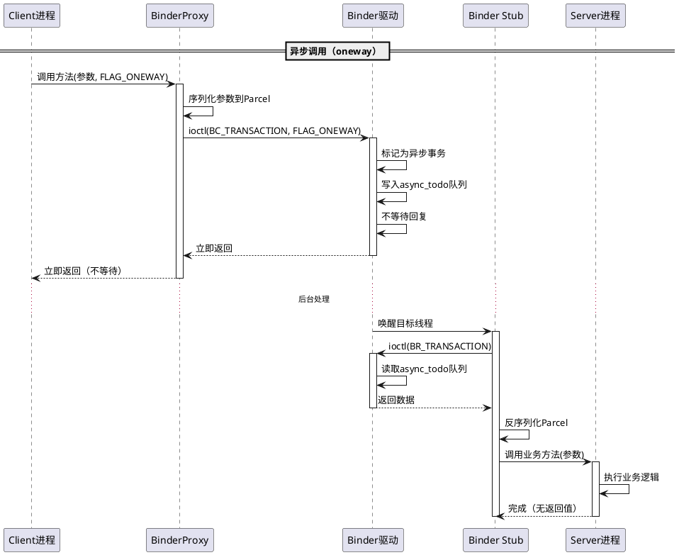
```plantuml
@startuml Binder异步调用流程
participant "Client进程" as Client
participant "BinderProxy" as Proxy
participant "Binder驱动" as Driver
participant "Binder Stub" as Stub
participant "Server进程" as Server

== 异步调用（oneway） ==
Client -> Proxy : 调用方法(参数, FLAG_ONEWAY)
activate Proxy
Proxy -> Proxy : 序列化参数到Parcel
Proxy -> Driver : ioctl(BC_TRANSACTION, FLAG_ONEWAY)
activate Driver
Driver -> Driver : 标记为异步事务
Driver -> Driver : 写入async_todo队列
Driver -> Driver : 不等待回复
Driver --> Proxy : 立即返回
deactivate Driver
Proxy --> Client : 立即返回（不等待）
deactivate Proxy

... 后台处理 ...
Driver -> Stub : 唤醒目标线程
activate Stub
Stub -> Driver : ioctl(BR_TRANSACTION)
activate Driver
Driver -> Driver : 读取async_todo队列
Driver --> Stub : 返回数据
deactivate Driver
Stub -> Stub : 反序列化Parcel
Stub -> Server : 调用业务方法(参数)
activate Server
Server -> Server : 执行业务逻辑
Server --> Stub : 完成（无返回值）
deactivate Server
deactivate Stub
```

## 5. 数据传递机制

### 5.1 Parcel序列化流程

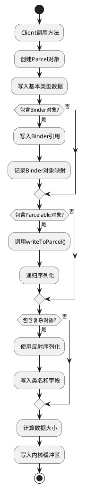
```plantuml
@startuml Parcel序列化流程
start
: Client调用方法;
: 创建Parcel对象;
: 写入基本类型数据;
if (包含Binder对象?) then (是)
    : 写入Binder引用;
    : 记录Binder对象映射;
else (否)
endif
if (包含Parcelable对象?) then (是)
    : 调用writeToParcel();
    : 递归序列化;
else (否)
endif
if (包含复杂对象?) then (是)
    : 使用反射序列化;
    : 写入类名和字段;
else (否)
endif
: 计算数据大小;
: 写入内核缓冲区;
stop
```

### 5.2 内存映射机制

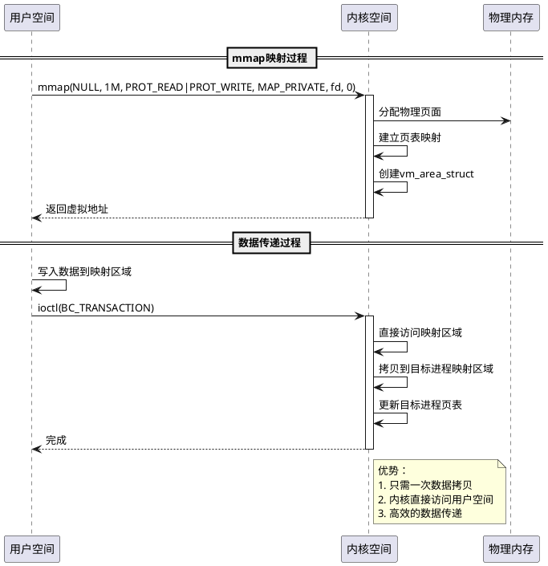
```plantuml
@startuml Binder内存映射机制
participant "用户空间" as User
participant "内核空间" as Kernel
participant "物理内存" as Memory

== mmap映射过程 ==
User -> Kernel : mmap(NULL, 1M, PROT_READ|PROT_WRITE, MAP_PRIVATE, fd, 0)
activate Kernel
Kernel -> Memory : 分配物理页面
Kernel -> Kernel : 建立页表映射
Kernel -> Kernel : 创建vm_area_struct
Kernel --> User : 返回虚拟地址
deactivate Kernel

== 数据传递过程 ==
User -> User : 写入数据到映射区域
User -> Kernel : ioctl(BC_TRANSACTION)
activate Kernel
Kernel -> Kernel : 直接访问映射区域
Kernel -> Kernel : 拷贝到目标进程映射区域
Kernel -> Kernel : 更新目标进程页表
Kernel --> User : 完成
deactivate Kernel

note right of Kernel
    优势：
    1. 只需一次数据拷贝
    2. 内核直接访问用户空间
    3. 高效的数据传递
end note
```

### 5.3 Binder对象传递

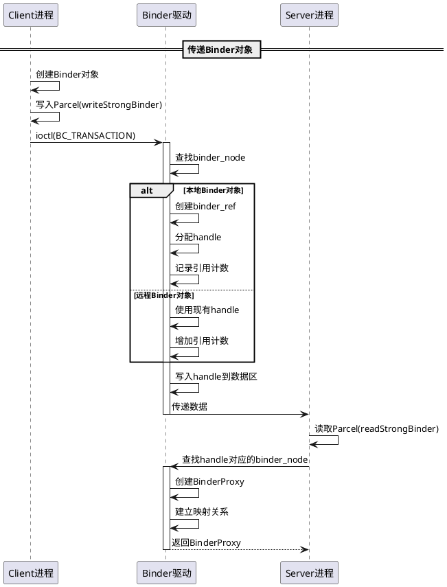
```plantuml
@startuml Binder对象传递机制
participant "Client进程" as Client
participant "Binder驱动" as Driver
participant "Server进程" as Server

== 传递Binder对象 ==
Client -> Client: 创建Binder对象
Client -> Client: 写入Parcel(writeStrongBinder)
Client -> Driver: ioctl(BC_TRANSACTION)
activate Driver
Driver -> Driver: 查找binder_node
alt 本地Binder对象
    Driver -> Driver: 创建binder_ref
    Driver -> Driver: 分配handle
    Driver -> Driver: 记录引用计数
else 远程Binder对象
    Driver -> Driver: 使用现有handle
    Driver -> Driver: 增加引用计数
end
Driver -> Driver: 写入handle到数据区
Driver -> Server: 传递数据
deactivate Driver

Server -> Server: 读取Parcel(readStrongBinder)
Server -> Driver: 查找handle对应的binder_node
activate Driver
Driver -> Driver: 创建BinderProxy
Driver -> Driver: 建立映射关系
Driver --> Server: 返回BinderProxy
deactivate Driver
@enduml
```

### 5.4 Binder内存模型

Binder内存模型是Binder机制高效性的核心，通过内存映射（mmap）技术实现进程间数据共享，避免了传统IPC机制需要多次数据拷贝的开销。

#### 5.4.1 内存映射架构

**1. 整体架构图**

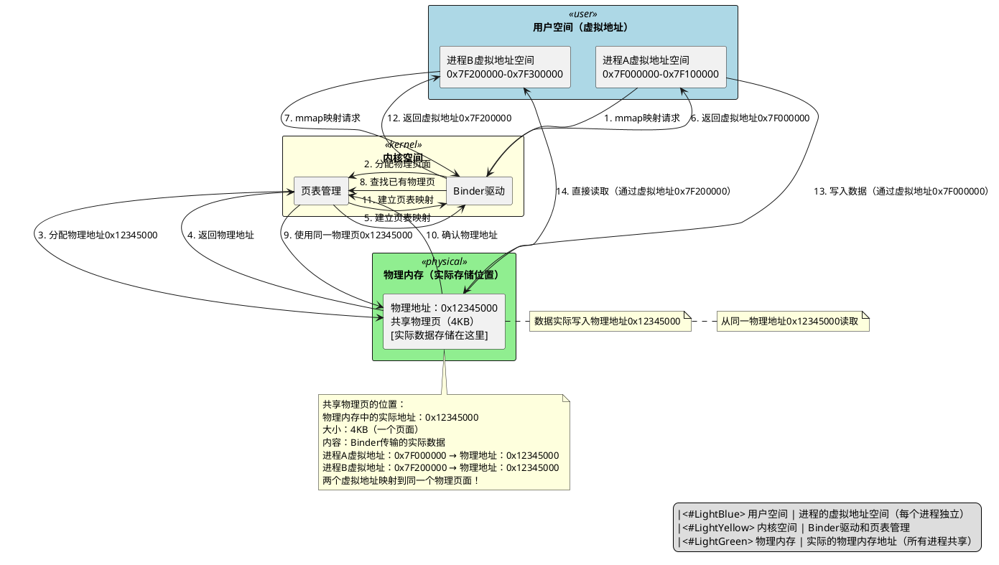
```plantuml
@startuml Binder内存模型架构
skinparam packageStyle rectangle
skinparam rectangle {
    BackgroundColor<<user>> LightBlue
    BackgroundColor<<kernel>> LightYellow
    BackgroundColor<<physical>> LightGreen
}

package "用户空间（虚拟地址）" <<user>> {
    rectangle "进程A虚拟地址空间\n0x7F000000-0x7F100000" as UserA
    rectangle "进程B虚拟地址空间\n0x7F200000-0x7F300000" as UserB
}

package "内核空间" <<kernel>> {
    rectangle "Binder驱动" as Driver
    rectangle "页表管理" as PageTable
}

package "物理内存（实际存储位置）" <<physical>> {
    rectangle "物理地址：0x12345000\n共享物理页（4KB）\n[实际数据存储在这里]" as SharedPage
}

' 层次布局：用户空间在上，内核空间在中间，物理内存在下
UserA -[hidden]down-> Driver
UserB -[hidden]down-> Driver
Driver -[hidden]down-> SharedPage

' 进程A的mmap映射流程
UserA -down-> Driver: 1. mmap映射请求
Driver -> PageTable: 2. 分配物理页面
PageTable -down-> SharedPage: 3. 分配物理地址0x12345000
SharedPage -up-> PageTable: 4. 返回物理地址
PageTable -> Driver: 5. 建立页表映射
Driver -up-> UserA: 6. 返回虚拟地址0x7F000000

' 进程B的mmap映射流程（使用同一物理页）
UserB -down-> Driver: 7. mmap映射请求
Driver -> PageTable: 8. 查找已有物理页
PageTable -down-> SharedPage: 9. 使用同一物理页0x12345000
SharedPage -up-> PageTable: 10. 确认物理地址
PageTable -> Driver: 11. 建立页表映射
Driver -up-> UserB: 12. 返回虚拟地址0x7F200000

' 数据传递流程
UserA -down-> SharedPage: 13. 写入数据（通过虚拟地址0x7F000000）
note right: 数据实际写入物理地址0x12345000
SharedPage -up-> UserB: 14. 直接读取（通过虚拟地址0x7F200000）
note right: 从同一物理地址0x12345000读取

note bottom of SharedPage
    共享物理页的位置：
    物理内存中的实际地址：0x12345000
    大小：4KB（一个页面）
    内容：Binder传输的实际数据
    进程A虚拟地址：0x7F000000 → 物理地址：0x12345000
    进程B虚拟地址：0x7F200000 → 物理地址：0x12345000
    两个虚拟地址映射到同一个物理页面！
end note

legend right
    |<#LightBlue> 用户空间 | 进程的虚拟地址空间（每个进程独立）
    |<#LightYellow> 内核空间 | Binder驱动和页表管理
    |<#LightGreen> 物理内存 | 实际的物理内存地址（所有进程共享）
endlegend
@enduml
```

**2. 共享物理页的具体位置**

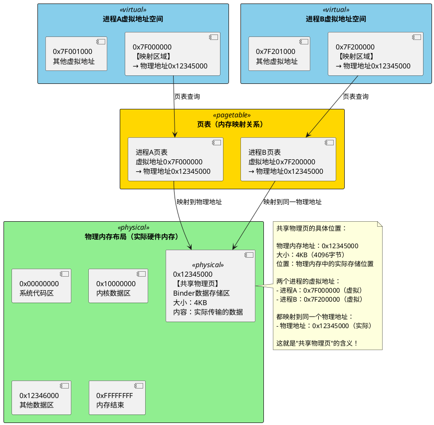
```plantuml
@startuml 共享物理页的具体位置
skinparam packageStyle rectangle
skinparam rectangle {
    BackgroundColor<<physical>> #90EE90
    BackgroundColor<<virtual>> #87CEEB
    BackgroundColor<<pagetable>> #FFD700
}

package "物理内存布局（实际硬件内存）" <<physical>> {
    [0x00000000\n系统代码区] as SysCode
    [0x10000000\n内核数据区] as KernelData
    [0x12345000\n【共享物理页】\nBinder数据存储区\n大小：4KB\n内容：实际传输的数据] as SharedPage <<physical>>
    [0x12346000\n其他数据区] as OtherData
    [0xFFFFFFFF\n内存结束] as MemEnd
}

package "进程A虚拟地址空间" <<virtual>> {
    [0x7F000000\n【映射区域】\n→ 物理地址0x12345000] as VMA
    [0x7F001000\n其他虚拟地址] as OtherVA
}

package "进程B虚拟地址空间" <<virtual>> {
    [0x7F200000\n【映射区域】\n→ 物理地址0x12345000] as VMB
    [0x7F201000\n其他虚拟地址] as OtherVB
}

package "页表（内存映射关系）" <<pagetable>> {
    [进程A页表\n虚拟地址0x7F000000\n→ 物理地址0x12345000] as PTA
    [进程B页表\n虚拟地址0x7F200000\n→ 物理地址0x12345000] as PTB
}

VMA --> PTA: 页表查询
PTA --> SharedPage: 映射到物理地址
VMB --> PTB: 页表查询
PTB --> SharedPage: 映射到同一物理地址

note right of SharedPage
    共享物理页的具体位置：
    
    物理内存地址：0x12345000
    大小：4KB（4096字节）
    位置：物理内存中的实际存储位置
    
    两个进程的虚拟地址：
    - 进程A：0x7F000000（虚拟）
    - 进程B：0x7F200000（虚拟）
    
    都映射到同一个物理地址：
    - 物理地址：0x12345000（实际）
    
    这就是"共享物理页"的含义！
end note

@enduml
```

**3. 内存地址映射关系**

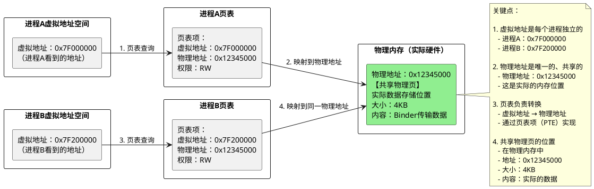
```plantuml
@startuml 内存地址映射关系详解
left to right direction

rectangle "进程A虚拟地址空间" as ProcA {
    rectangle "虚拟地址：0x7F000000\n（进程A看到的地址）" as VA_A
}

rectangle "进程A页表" as PageTableA {
    rectangle "页表项：\n虚拟地址：0x7F000000\n物理地址：0x12345000\n权限：RW" as PTE_A
}

rectangle "物理内存（实际硬件）" as PhysicalMem {
    rectangle "物理地址：0x12345000\n【共享物理页】\n实际数据存储位置\n大小：4KB\n内容：Binder传输数据" as PhysPage #LightGreen
}

rectangle "进程B页表" as PageTableB {
    rectangle "页表项：\n虚拟地址：0x7F200000\n物理地址：0x12345000\n权限：RW" as PTE_B
}

rectangle "进程B虚拟地址空间" as ProcB {
    rectangle "虚拟地址：0x7F200000\n（进程B看到的地址）" as VA_B
}

VA_A --> PTE_A: 1. 页表查询
PTE_A --> PhysPage: 2. 映射到物理地址
VA_B --> PTE_B: 3. 页表查询
PTE_B --> PhysPage: 4. 映射到同一物理地址

note right of PhysPage
    关键点：
    
    1. 虚拟地址是每个进程独立的
       - 进程A：0x7F000000
       - 进程B：0x7F200000
    
    2. 物理地址是唯一的、共享的
       - 物理地址：0x12345000
       - 这是实际的内存位置
    
    3. 页表负责转换
       - 虚拟地址 → 物理地址
       - 通过页表项（PTE）实现
    
    4. 共享物理页的位置
       - 在物理内存中
       - 地址：0x12345000
       - 大小：4KB
       - 内容：实际的数据
end note

@enduml
```

**4. 数据在共享物理页中的存储**

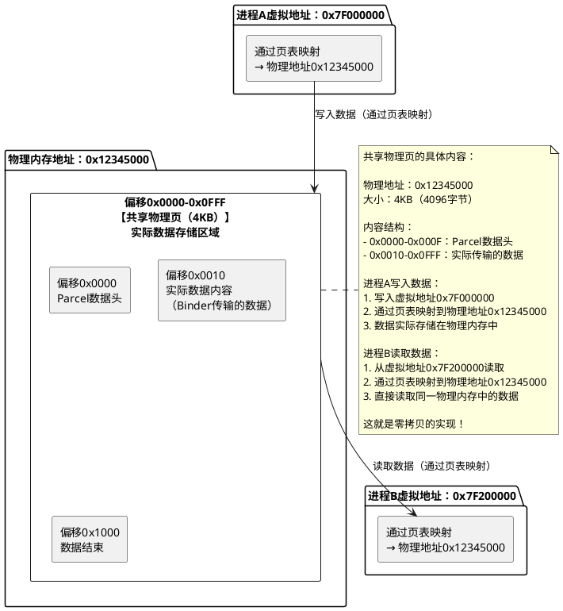
```plantuml
@startuml 共享物理页数据存储
skinparam componentStyle rectangle

package "物理内存地址：0x12345000" {
    component "偏移0x0000-0x0FFF\n【共享物理页（4KB）】\n实际数据存储区域" as Page {
        [偏移0x0000\nParcel数据头] as Header
        [偏移0x0010\n实际数据内容\n（Binder传输的数据）] as Data
        [偏移0x1000\n数据结束] as End
    }
}

package "进程A虚拟地址：0x7F000000" {
    component "通过页表映射\n→ 物理地址0x12345000" as MapA
}

package "进程B虚拟地址：0x7F200000" {
    component "通过页表映射\n→ 物理地址0x12345000" as MapB
}

MapA --> Page: 写入数据（通过页表映射）
Page --> MapB: 读取数据（通过页表映射）

note right of Page
    共享物理页的具体内容：
    
    物理地址：0x12345000
    大小：4KB（4096字节）
    
    内容结构：
    - 0x0000-0x000F：Parcel数据头
    - 0x0010-0x0FFF：实际传输的数据
    
    进程A写入数据：
    1. 写入虚拟地址0x7F000000
    2. 通过页表映射到物理地址0x12345000
    3. 数据实际存储在物理内存中
    
    进程B读取数据：
    1. 从虚拟地址0x7F200000读取
    2. 通过页表映射到物理地址0x12345000
    3. 直接读取同一物理内存中的数据
    
    这就是零拷贝的实现！
end note

@enduml
```

#### 5.4.2 mmap机制详解

`mmap`（memory map）是Unix/Linux系统中的一个重要系统调用，它允许应用程序将文件或设备映射到进程的虚拟地址空间。在Binder机制中，`mmap`是实现高效进程间通信的关键技术。

**1. mmap系统调用原型**

```c
#include <sys/mman.h>

void *mmap(void *addr, size_t length, int prot, int flags, int fd, off_t offset);
```

**参数说明：**
- `addr`：期望的映射起始地址，通常设为`NULL`由系统自动选择
- `length`：映射的长度（字节数），Binder中通常为1MB
- `prot`：内存保护标志
  - `PROT_READ`：可读
  - `PROT_WRITE`：可写
  - `PROT_EXEC`：可执行
  - `PROT_NONE`：不可访问
- `flags`：映射标志
  - `MAP_SHARED`：共享映射，多个进程共享同一物理页
  - `MAP_PRIVATE`：私有映射，写时复制（Binder使用此方式）
  - `MAP_ANONYMOUS`：匿名映射
- `fd`：文件描述符，Binder中为`/dev/binder`的设备文件描述符
- `offset`：文件偏移量，Binder中通常为0

**返回值：**
- 成功：返回映射区域的起始虚拟地址
- 失败：返回`MAP_FAILED`（通常是`(void *)-1`）

**2. mmap在Binder中的使用**

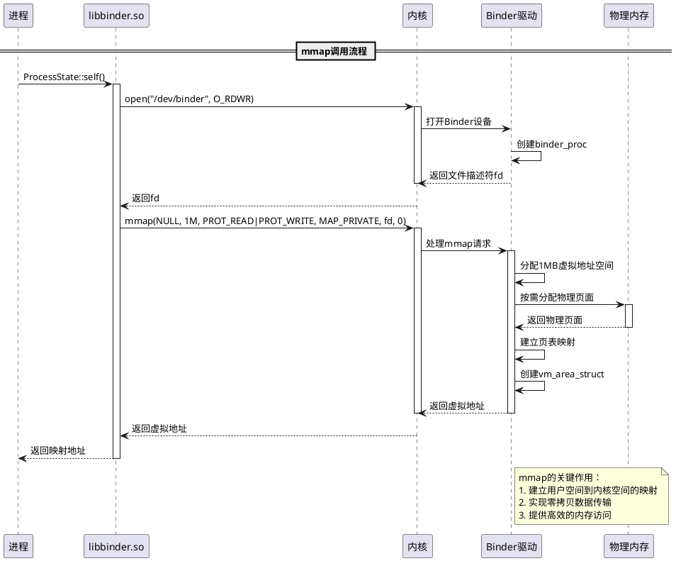
```plantuml
@startuml mmap在Binder中的使用
participant "进程" as Process
participant "libbinder.so" as Lib
participant "内核" as Kernel
participant "Binder驱动" as Driver
participant "物理内存" as Memory

== mmap调用流程 ==
Process -> Lib: ProcessState::self()
activate Lib
Lib -> Kernel: open("/dev/binder", O_RDWR)
activate Kernel
Kernel -> Driver: 打开Binder设备
Driver -> Driver: 创建binder_proc
Driver --> Kernel: 返回文件描述符fd
deactivate Kernel
Kernel --> Lib: 返回fd
Lib -> Kernel: mmap(NULL, 1M, PROT_READ|PROT_WRITE, MAP_PRIVATE, fd, 0)
activate Kernel
Kernel -> Driver: 处理mmap请求
activate Driver
Driver -> Driver: 分配1MB虚拟地址空间
Driver -> Memory: 按需分配物理页面
activate Memory
Memory --> Driver: 返回物理页面
deactivate Memory
Driver -> Driver: 建立页表映射
Driver -> Driver: 创建vm_area_struct
Driver --> Kernel: 返回虚拟地址
deactivate Driver
deactivate Kernel
Kernel --> Lib: 返回虚拟地址
Lib --> Process: 返回映射地址
deactivate Lib

note right of Driver
    mmap的关键作用：
    1. 建立用户空间到内核空间的映射
    2. 实现零拷贝数据传输
    3. 提供高效的内存访问
end note
```

**3. mmap的优势**

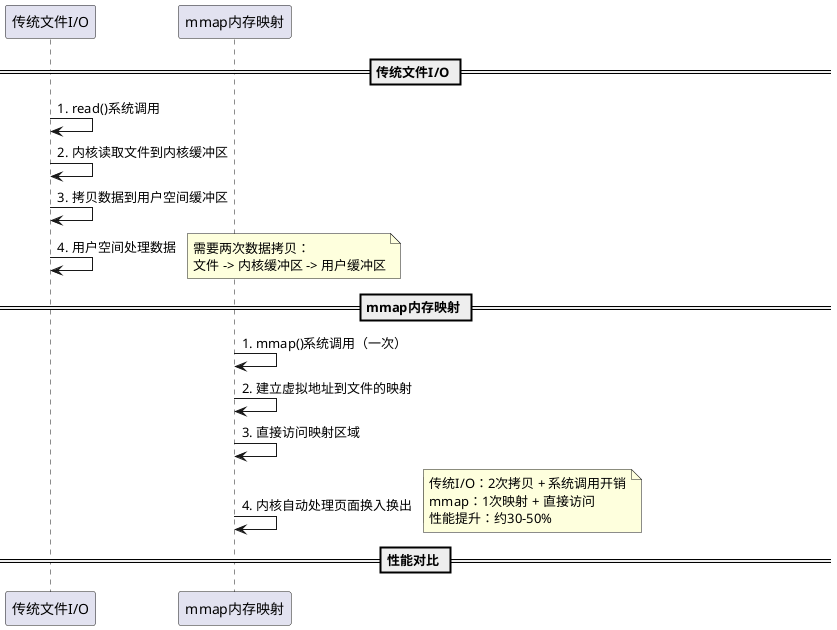
```plantuml
@startuml mmap优势对比
participant "传统文件I/O" as Traditional
participant "mmap内存映射" as Mmap

== 传统文件I/O ==
Traditional -> Traditional: 1. read()系统调用
Traditional -> Traditional: 2. 内核读取文件到内核缓冲区
Traditional -> Traditional: 3. 拷贝数据到用户空间缓冲区
Traditional -> Traditional: 4. 用户空间处理数据
note right
  需要两次数据拷贝：
  文件 -> 内核缓冲区 -> 用户缓冲区
end note

== mmap内存映射 ==
Mmap -> Mmap: 1. mmap()系统调用（一次）
Mmap -> Mmap: 2. 建立虚拟地址到文件的映射
Mmap -> Mmap: 3. 直接访问映射区域
Mmap -> Mmap: 4. 内核自动处理页面换入换出
note right
  只需一次映射：
  文件直接映射到用户空间
end note

== 性能对比 ==
note right
    传统I/O：2次拷贝 + 系统调用开销
    mmap：1次映射 + 直接访问
    性能提升：约30-50%
end note
```

**4. Binder中的mmap实现细节**

在Binder机制中，`mmap`的实现涉及以下关键步骤：

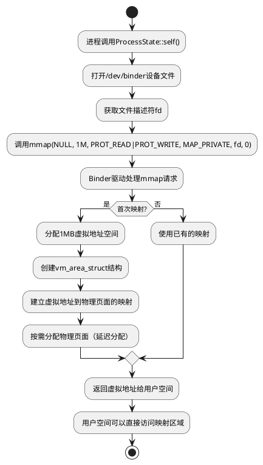
```plantuml
@startuml Binder mmap实现细节
start
: 进程调用ProcessState::self();
: 打开/dev/binder设备文件;
: 获取文件描述符fd;
: 调用mmap(NULL, 1M, PROT_READ|PROT_WRITE, MAP_PRIVATE, fd, 0);
: Binder驱动处理mmap请求;
if (首次映射?) then (是)
    : 分配1MB虚拟地址空间;
    : 创建vm_area_struct结构;
    : 建立虚拟地址到物理页面的映射;
    : 按需分配物理页面（延迟分配）;
else (否)
    : 使用已有的映射;
endif
: 返回虚拟地址给用户空间;
: 用户空间可以直接访问映射区域;
stop
```

**关键数据结构：**

```plantuml
@startuml mmap关键数据结构
class vm_area_struct {
    +vm_start : unsigned long
    +vm_end : unsigned long
    +vm_file : struct file*
    +vm_ops : struct vm_operations_struct*
    +vm_flags : unsigned long
    +vm_page_prot : pgprot_t
}

class binder_proc {
    +alloc : binder_alloc
    +vma : vm_area_struct*
    +buffer : binder_buffer*
}

class binder_alloc {
    +pages : struct page**
    +buffer_size : size_t
    +user_buffer_offset : size_t
    +buffers : rb_root
}

vm_area_struct --> binder_proc : 关联
binder_proc --> binder_alloc : 包含
binder_alloc --> binder_buffer : 管理
```

**5. mmap的零拷贝原理**

```plantuml
@startuml mmap零拷贝原理
participant "进程A" as ProcA
participant "进程A虚拟地址" as VMA
participant "页表A" as PTA
participant "共享物理页" as SharedPage
participant "页表B" as PTB
participant "进程B虚拟地址" as VMB
participant "进程B" as ProcB

== 映射建立 ==
ProcA -> VMA: mmap映射
VMA -> PTA: 建立页表项
PTA -> SharedPage: 映射到物理页
SharedPage -> PTA: 返回物理地址
PTA -> VMA: 建立映射关系

ProcB -> VMB: mmap映射
VMB -> PTB: 建立页表项
PTB -> SharedPage: 映射到同一物理页
SharedPage -> PTB: 返回物理地址
PTB -> VMB: 建立映射关系

== 数据传递（零拷贝） ==
ProcA -> VMA: 写入数据
VMA -> PTA: 通过页表访问
PTA -> SharedPage: 直接写入物理页
SharedPage -> PTB: 数据在物理页
PTB -> VMB: 通过页表访问
VMB -> ProcB: 直接读取数据

note right of SharedPage
    零拷贝实现：
    1. 进程A和进程B的虚拟地址
       映射到同一物理页面
    2. 数据写入物理页后，
       进程B可以直接读取
    3. 无需额外的数据拷贝
end note
```

**6. mmap的内存管理**

```plantuml
@startuml mmap内存管理
start
: mmap映射建立;
: 分配虚拟地址空间;
if (需要物理页面?) then (是)
    : 触发页面错误（page fault）;
    : 内核分配物理页面;
    : 建立页表映射;
    : 从文件读取数据（如果是文件映射）;
else (否)
    : 使用已有映射;
endif
: 用户空间访问映射区域;
if (页面不在内存?) then (是)
    : 触发页面错误;
    : 内核加载页面到内存;
else (否)
    : 直接访问;
endif
: 数据修改;
if (MAP_SHARED?) then (是)
    : 直接写入物理页;
    : 其他进程可见;
else (MAP_PRIVATE?)
    : 写时复制（Copy-on-Write）;
    : 创建私有副本;
endif
stop
```

**7. mmap的注意事项**

1. **内存对齐**：`mmap`要求映射长度必须是页面大小的整数倍（通常4KB）
2. **权限控制**：`prot`参数必须与文件打开时的权限匹配
3. **映射范围**：不能映射超出文件大小的范围
4. **同步问题**：多个进程共享映射时需要注意同步
5. **资源释放**：使用`munmap`释放映射区域

**8. Binder中mmap的特殊性**

在Binder机制中，`mmap`的使用有以下特殊性：

- **匿名映射**：Binder使用匿名映射（通过`/dev/binder`设备文件），不涉及实际文件
- **共享物理页**：多个进程通过`mmap`映射到同一物理页面，实现数据共享
- **延迟分配**：物理页面按需分配，提高内存利用率
- **自动同步**：数据写入后，其他进程立即可见，无需额外同步操作

#### 5.4.3 内存映射过程

```plantuml
@startuml Binder内存映射过程
start
: 进程调用ProcessState::self();
: 打开/dev/binder设备;
: 调用mmap(NULL, 1M, PROT_READ|PROT_WRITE, MAP_PRIVATE, fd, 0);
: 内核分配物理页面;
: 建立页表映射;
: 创建vm_area_struct;
: 返回虚拟地址给用户空间;
: 用户空间可以直接访问内核缓冲区;
stop
```

#### 5.4.4 内核缓冲区管理

Binder驱动使用内核缓冲区（binder_buffer）来管理进程间传递的数据：

```plantuml
@startuml Binder内核缓冲区管理
class binder_buffer {
    +entry : list_head
    +free : int
    +allow_user_free : int
    +async_transaction : int
    +debug_id : uint32_t
    +transaction : binder_transaction*
    +target_node : binder_node*
    +data_size : size_t
    +offsets_size : size_t
    +data : void*
    +offsets : void*
}

class binder_proc {
    +buffers : rb_root
    +free_buffers : list_head
    +allocated_buffers : list_head
    +buffer_size : size_t
    +buffer_free_size : size_t
}

class binder_alloc {
    +pages : struct page**
    +buffer_size : size_t
    +user_buffer_offset : size_t
    +buffers : rb_root
    +free_buffers : rb_root
    +allocated_buffers : rb_root
}

binder_proc --> binder_buffer : 管理
binder_alloc --> binder_buffer : 分配
binder_buffer --> binder_transaction : 关联
```

**缓冲区分配策略：**

1. **首次分配**：进程首次调用mmap时，分配1MB的虚拟地址空间
2. **按需分配**：物理页面按需分配，采用延迟分配策略
3. **页面回收**：当缓冲区空闲时，可以回收物理页面
4. **大小限制**：单个事务最大1MB，超过会抛出TransactionTooLargeException

#### 5.4.5 内存映射的优势

```plantuml
@startuml 内存映射优势对比
participant "传统IPC" as Traditional
participant "Binder IPC" as Binder

== 传统IPC（两次拷贝） ==
Traditional -> Traditional: 数据在用户空间A
Traditional -> Traditional: 拷贝1：用户空间A -> 内核空间
Traditional -> Traditional: 拷贝2：内核空间 -> 用户空间B
Traditional -> Traditional: 数据在用户空间B
note right: 需要两次数据拷贝

== Binder IPC（一次拷贝） ==
Binder -> Binder: 数据在用户空间A
Binder -> Binder: 写入映射区域（共享物理页）
Binder -> Binder: 内核直接访问映射区域
Binder -> Binder: 更新进程B页表指向同一物理页
Binder -> Binder: 进程B直接读取映射区域
note right: 只需一次数据拷贝

== 性能对比 ==
note right
    传统IPC：2次拷贝
    Binder：1次拷贝
    性能提升：约50%
end note
```

#### 5.4.6 内存映射的细节

**1. 映射区域布局**

```
用户空间虚拟地址（1MB）
├── 0x00000000 - 0x000FFFFF：映射区域
│   ├── 数据区（data area）
│   ├── 偏移区（offsets area）
│   └── 元数据区（metadata area）
└── 物理页面（按需分配）
    ├── 页面0（4KB）
    ├── 页面1（4KB）
    └── ...
```

**2. 页表映射关系**

```plantuml
@startuml Binder页表映射
participant "进程A" as ProcA
participant "页表A" as PTA
participant "物理内存" as PhysMem
participant "页表B" as PTB
participant "进程B" as ProcB

ProcA -> PTA: 虚拟地址VA1
PTA -> PhysMem: 映射到物理地址PA
PhysMem -> PTB: 同一物理地址PA
PTB -> ProcB: 映射到虚拟地址VB1

note right of PhysMem
    进程A和进程B的虚拟地址
    映射到同一物理页面
end note
```

**3. 数据传递流程**

```plantuml
@startuml Binder数据传递内存流程
participant "Client进程" as Client
participant "Client映射区" as ClientMap
participant "内核缓冲区" as KernelBuf
participant "Server映射区" as ServerMap
participant "Server进程" as Server

== 数据写入 ==
Client -> ClientMap: 写入数据到映射区
ClientMap -> KernelBuf: 数据在共享物理页
KernelBuf -> KernelBuf: 内核直接访问物理页

== 数据传递 ==
KernelBuf -> ServerMap: 更新Server页表指向同一物理页
ServerMap -> Server: Server直接读取映射区

note right of KernelBuf
    优势：
    1. 无需数据拷贝
    2. 内核直接访问
    3. 高效传递
end note
```

#### 5.4.7 物理内存与物理页面详解

**1. 物理内存的概念**

物理内存（Physical Memory）是计算机硬件中的实际内存芯片（RAM），是数据实际存储的地方。物理内存有以下特点：

- **实际存在**：物理内存是硬件设备，有具体的物理地址
- **有限资源**：物理内存大小是固定的（如4GB、8GB等）
- **直接访问**：CPU可以直接通过物理地址访问物理内存
- **共享资源**：所有进程共享同一块物理内存

**物理内存布局示例**：

```
物理内存（RAM芯片）
├── 0x00000000 - 0x000FFFFF：系统代码区（1MB）
├── 0x00100000 - 0x0FFFFFFF：内核数据区（256MB）
├── 0x10000000 - 0x12344FFF：其他数据区
├── 0x12345000 - 0x12345FFF：共享物理页（4KB）← Binder数据存储
├── 0x12346000 - 0x7FFFFFFF：其他数据区
└── 0x80000000 - 0xFFFFFFFF：内存结束
```

**2. 物理页面的概念**

物理页面（Physical Page）是物理内存管理的基本单位，是操作系统将物理内存划分成固定大小的块。

**物理页面的特点**：

- **固定大小**：通常为4KB（4096字节），这是由硬件页表决定的
- **连续地址**：每个物理页面在物理内存中是连续的
- **唯一标识**：每个物理页面有唯一的物理地址（页框号）
- **最小分配单位**：操作系统以页面为单位分配和回收内存

**物理页面结构**：

```plantuml
@startuml 物理页面结构
rectangle "物理内存（RAM）" {
    rectangle "物理页面0\n地址：0x00000000\n大小：4KB" as Page0 {
        [0x00000000-0x00000FFF\n4096字节] as Data0
    }
    rectangle "物理页面1\n地址：0x00001000\n大小：4KB" as Page1 {
        [0x00001000-0x00001FFF\n4096字节] as Data1
    }
    rectangle "物理页面N\n地址：0x12345000\n大小：4KB" as PageN {
        [0x12345000-0x12345FFF\n4096字节] as DataN
    }
    rectangle "..." as Dots
}

note right of PageN
    物理页面特点：
    1. 固定大小：4KB（4096字节）
    2. 连续地址：页面内地址连续
    3. 唯一标识：每个页面有唯一物理地址
    4. 最小单位：内存分配的最小单位
end note

@enduml
```

**3. 虚拟内存与虚拟页面**

虚拟内存（Virtual Memory）是每个进程看到的独立地址空间，是操作系统提供的抽象。

**虚拟内存的特点**：

- **独立空间**：每个进程有独立的虚拟地址空间
- **逻辑地址**：虚拟地址是逻辑地址，不是实际物理地址
- **按需映射**：虚拟地址通过页表映射到物理地址
- **保护机制**：不同进程的虚拟地址空间相互隔离

**虚拟页面（Virtual Page）**是虚拟内存管理的基本单位，与物理页面大小相同（通常4KB）。

**虚拟内存布局示例**：

```
进程A的虚拟地址空间（32位系统，4GB）
├── 0x00000000 - 0x08000000：代码区（128MB）
├── 0x08000000 - 0x40000000：数据区（896MB）
├── 0x40000000 - 0x7F000000：堆区（1GB）
├── 0x7F000000 - 0x7F100000：映射区（1MB）← mmap映射区域
├── 0x7F100000 - 0x7FFFFFFF：栈区（240MB）
└── 0x80000000 - 0xFFFFFFFF：内核空间（2GB）
```

**4. 页表详解**

页表（Page Table）是操作系统维护的数据结构，用于记录虚拟地址到物理地址的映射关系。页表不是文件，而是存储在内存中的数据结构。

**4.1 页表的存储位置**

页表存储在内存中，不是文件：

- **存储位置**：物理内存（RAM）中
- **存储方式**：内核数据结构
- **表现形式**：内存中的数组或树形结构
- **访问方式**：通过内存地址访问

```plantuml
@startuml 页表的存储位置
rectangle "物理内存（RAM）" {
    rectangle "内核空间" {
        rectangle "页表数据结构\n（内存中的数组）" as PageTable
        rectangle "页表项数组\n[PTE0, PTE1, ..., PTEN]" as PTEArray
    }
    rectangle "用户空间" {
        rectangle "进程A数据" as ProcA
        rectangle "进程B数据" as ProcB
    }
}

rectangle "虚拟地址空间" {
    rectangle "进程A虚拟地址\n0x7F000000" as VA_A
    rectangle "进程B虚拟地址\n0x7F200000" as VA_B
}

VA_A --> PageTable: 页表查询
PageTable --> PTEArray: 查找页表项
PTEArray --> ProcA: 映射到物理地址

note right of PageTable
    页表不是文件：
    1. 存储在物理内存中
    2. 是内核数据结构
    3. 通过内存地址访问
    4. 每个进程有独立的页表
end note

@enduml
```

**4.2 页表的数据结构**

页表在内存中的表现形式是数组或树形结构：

**单级页表（32位系统）**：

```plantuml
@startuml 单级页表数据结构
class "页表（Page Table）" as PageTable {
    +base : unsigned long
    +entries : pte_t[]
    +size : unsigned long
}

class "页表项（Page Table Entry）" as PTE {
    +physical_addr : unsigned long
    +present : bit
    +read_write : bit
    +user_supervisor : bit
    +page_size : bit
    +dirty : bit
    +accessed : bit
    +cache_disabled : bit
    +write_through : bit
}

PageTable --> PTE : 包含多个

note right of PTE
    页表项（PTE）结构：
    32位系统：4字节
    64位系统：8字节
    
    包含信息：
    - 物理地址（20位）
    - 权限位（读写、用户/内核）
    - 状态位（存在、脏、访问）
end note

@enduml
```

**多级页表（64位系统）**：

```plantuml
@startuml 多级页表数据结构
class "页全局目录（PGD）" as PGD {
    +entries : pgd_t[]
    +size : unsigned long
}

class "页上级目录（PUD）" as PUD {
    +entries : pud_t[]
    +size : unsigned long
}

class "页中间目录（PMD）" as PMD {
    +entries : pmd_t[]
    +size : unsigned long
}

class "页表（PT）" as PT {
    +entries : pte_t[]
    +size : unsigned long
}

class "页表项（PTE）" as PTE {
    +physical_addr : unsigned long
    +flags : unsigned long
}

PGD --> PUD : 指向
PUD --> PMD : 指向
PMD --> PT : 指向
PT --> PTE : 包含

note right of PGD
    多级页表结构：
    64位系统使用4级页表：
    PGD → PUD → PMD → PT → PTE
    
    优点：
    - 节省内存（稀疏映射）
    - 支持大地址空间
    - 灵活的内存管理
end note

@enduml
```

**4.3 页表在内存中的布局**

页表在内存中的实际布局：

```
物理内存布局：
├── 0x00000000 - 0x000FFFFF：系统代码区
├── 0x00100000 - 0x0FFFFFFF：内核数据区
├── 0x10000000 - 0x10001000：进程A页表（4KB）
│   ├── PTE[0]：虚拟地址0x7F000000 → 物理地址0x12345000
│   ├── PTE[1]：虚拟地址0x7F001000 → 物理地址0x12346000
│   └── ...
├── 0x10002000 - 0x10003000：进程B页表（4KB）
│   ├── PTE[0]：虚拟地址0x7F200000 → 物理地址0x12345000
│   ├── PTE[1]：虚拟地址0x7F201000 → 物理地址0x12347000
│   └── ...
└── 0x12345000 - 0x12345FFF：共享物理页（4KB）
```

**4.4 页表项（PTE）的详细结构**

页表项是页表的基本单位，每个页表项记录一个虚拟页面的映射信息：

```plantuml
@startuml 页表项结构详解
class "页表项（PTE）32位" as PTE32 {
    +bit[31:12] : 物理页框号（20位）
    +bit[11:9] : 保留位（3位）
    +bit[8] : 全局页（G）
    +bit[7] : 页大小（PS）
    +bit[6] : 脏位（D）
    +bit[5] : 访问位（A）
    +bit[4] : 缓存禁用（PCD）
    +bit[3] : 写通（PWT）
    +bit[2] : 用户/超级用户（U/S）
    +bit[1] : 读/写（R/W）
    +bit[0] : 存在位（P）
}

class "页表项（PTE）64位" as PTE64 {
    +bit[63:52] : 未使用（12位）
    +bit[51:12] : 物理页框号（40位）
    +bit[11:9] : 保留位（3位）
    +bit[8] : 全局页（G）
    +bit[7] : 页大小（PS）
    +bit[6] : 脏位（D）
    +bit[5] : 访问位（A）
    +bit[4] : 缓存禁用（PCD）
    +bit[3] : 写通（PWT）
    +bit[2] : 用户/超级用户（U/S）
    +bit[1] : 读/写（R/W）
    +bit[0] : 存在位（P）
}

note right of PTE32
    页表项关键位：
    
    存在位（P）：页面是否在内存中
    读/写位（R/W）：页面是否可写
    用户/超级用户位（U/S）：用户态访问权限
    物理页框号：物理页面的地址
    
    示例：
    PTE = 0x12345001
    - 物理页框号：0x12345
    - 存在位：1（在内存中）
    - 权限：可读可写
end note

@enduml
```

**4.5 页表的访问过程**

页表查询的详细过程：

```plantuml
@startuml 页表访问过程
participant "CPU" as CPU
participant "MMU" as MMU
participant "页表" as PageTable
participant "物理内存" as Memory

== 虚拟地址访问 ==
CPU -> MMU: 访问虚拟地址0x7F000000
activate MMU
MMU -> MMU: 提取页号（0x7F000）
MMU -> MMU: 提取页内偏移（0x000）
MMU -> PageTable: 查询页表项PTE[0x7F000]
activate PageTable
PageTable -> PageTable: 计算页表项地址
PageTable -> PageTable: 读取页表项内容
PageTable -> PageTable: 检查存在位（P）
alt 页面存在
    PageTable -> PageTable: 提取物理页框号
    PageTable -> PageTable: 检查权限位（R/W, U/S）
    PageTable --> MMU: 返回物理地址0x12345000
    MMU -> Memory: 访问物理地址0x12345000 + 偏移0x000
    Memory --> MMU: 返回数据
    MMU --> CPU: 返回数据
else 页面不存在
    PageTable --> MMU: 页面错误（Page Fault）
    MMU --> CPU: 触发异常
    note right: 操作系统处理页面错误
end
deactivate PageTable
deactivate MMU

note right of MMU
    页表查询过程：
    1. MMU提取虚拟地址的页号
    2. 使用页号作为索引查找页表项
    3. 检查页表项的存在位和权限位
    4. 提取物理页框号
    5. 组合物理地址并访问
end note

@enduml
```

**4.6 页表在Linux内核中的实现**

页表在Linux内核中的实际数据结构：

```plantuml
@startuml Linux内核页表结构
class "mm_struct" {
    +pgd : pgd_t*
    +mmap : vm_area_struct*
    +mm_users : atomic_t
    +mm_count : atomic_t
}

class "pgd_t" {
    +pgd : unsigned long
}

class "pud_t" {
    +pud : unsigned long
}

class "pmd_t" {
    +pmd : unsigned long
}

class "pte_t" {
    +pte : unsigned long
}

class "vm_area_struct" {
    +vm_start : unsigned long
    +vm_end : unsigned long
    +vm_flags : unsigned long
    +vm_page_prot : pgprot_t
    +vm_ops : vm_operations_struct*
}

mm_struct --> pgd_t : 指向页全局目录
pgd_t --> pud_t : 指向页上级目录
pud_t --> pmd_t : 指向页中间目录
pmd_t --> pte_t : 指向页表项
mm_struct --> vm_area_struct : 包含虚拟内存区域

note right of mm_struct
    mm_struct是进程的内存描述符：
    1. 每个进程有一个mm_struct
    2. pgd指向页表的根（PGD）
    3. mmap指向虚拟内存区域链表
    4. 页表存储在物理内存中
end note

@enduml
```

**4.7 页表的创建和管理**

页表的创建和管理过程：

```plantuml
@startuml 页表创建和管理
start
: 进程创建;
: 分配mm_struct;
: 分配页表空间（4KB）;
: 初始化PGD;
: 页表创建完成;
: 进程访问虚拟地址;
if (页表项存在?) then (是)
    : 使用已有映射;
else (否)
    : 触发页面错误;
    : 分配物理页面;
    : 创建页表项;
    : 建立映射关系;
endif
: 进程访问内存;
if (进程退出?) then (是)
    : 释放页表;
    : 释放物理页面;
    : 释放mm_struct;
else (否)
    : 继续使用;
endif
stop
```

**4.8 页表的查看方式**

虽然页表不是文件，但可以通过以下方式查看：

**1. 通过/proc文件系统查看进程内存映射**：

```bash
# 查看进程的内存映射
cat /proc/[pid]/maps

# 查看进程的页表信息
cat /proc/[pid]/pagemap

# 查看进程的内存统计
cat /proc/[pid]/status | grep Vm
```

**2. 通过内核调试接口查看**：

```bash
# 查看页表统计信息
cat /proc/vmstat | grep pg

# 查看内存信息
cat /proc/meminfo
```

**3. 通过代码访问页表**：

```c
// Linux内核代码示例
struct mm_struct *mm = current->mm;
pgd_t *pgd = mm->pgd;
pte_t *pte = pte_offset_map(pmd, address);
unsigned long pfn = pte_pfn(*pte);
unsigned long phys_addr = pfn << PAGE_SHIFT;
```

**4.9 页表与文件系统的区别**

| 特性 | 页表 | 文件系统 |
|------|------|----------|
| **存储位置** | 物理内存（RAM） | 存储设备（磁盘、SSD） |
| **表现形式** | 内存数据结构（数组/树） | 文件、目录 |
| **访问方式** | 内存地址访问 | 文件路径访问 |
| **持久性** | 非持久（进程退出后消失） | 持久（存储在磁盘上） |
| **速度** | 极快（内存访问） | 较慢（磁盘I/O） |
| **大小** | 每个进程几KB到几MB | 可以很大（GB、TB） |
| **作用** | 虚拟地址到物理地址映射 | 数据存储和管理 |

**4.10 页表的内存占用**

页表的内存占用：

- **32位系统**：每个进程的页表约4KB-16KB
- **64位系统**：每个进程的页表约几KB到几MB（取决于虚拟内存使用量）
- **多级页表**：只分配实际使用的页表项，节省内存

**页表内存占用示例**：

```
32位系统（4GB虚拟地址空间）：
- 虚拟地址空间：4GB = 2^32 字节
- 页面大小：4KB = 2^12 字节
- 页面数量：2^32 / 2^12 = 2^20 = 1,048,576 页
- 页表项大小：4字节
- 页表大小：1,048,576 × 4 = 4MB（单级页表）

64位系统（使用多级页表）：
- 只分配实际使用的页表项
- 典型进程：几KB到几MB
- 取决于虚拟内存的实际使用量
```

**4.11 页表的关键点总结**

1. **页表不是文件，是内存中的数据结构**
   - 存储在物理内存（RAM）中
   - 是内核维护的数据结构
   - 通过内存地址访问

2. **页表的表现形式是数组或树形结构**
   - 32位系统：单级页表（数组）
   - 64位系统：多级页表（树形结构）
   - 每个页表项记录一个虚拟页面的映射信息

3. **页表存储在物理内存中**
   - 每个进程有独立的页表
   - 页表本身也占用物理内存
   - 页表项指向物理页面

4. **页表通过MMU硬件访问**
   - CPU访问虚拟地址时，MMU自动查询页表
   - 页表查询对应用程序透明
   - 页表查询速度极快（硬件加速）

5. **页表是动态创建和管理的**
   - 进程创建时分配页表
   - 按需创建页表项
   - 进程退出时释放页表

**5. 物理页面与虚拟页面的映射关系**

虚拟页面通过页表（Page Table）映射到物理页面：

```plantuml
@startuml 物理页面与虚拟页面映射关系
left to right direction

rectangle "进程A虚拟地址空间" {
    rectangle "虚拟页面0\n虚拟地址：0x7F000000\n大小：4KB" as VPage0
    rectangle "虚拟页面1\n虚拟地址：0x7F001000\n大小：4KB" as VPage1
    rectangle "虚拟页面N\n虚拟地址：0x7F100000\n大小：4KB" as VPageN
}

rectangle "页表（内存中的数组）" {
    rectangle "页表项0\n虚拟地址：0x7F000000\n→ 物理地址：0x12345000" as PTE0
    rectangle "页表项1\n虚拟地址：0x7F001000\n→ 物理地址：0x12346000" as PTE1
    rectangle "页表项N\n虚拟地址：0x7F100000\n→ 物理地址：0x12347000" as PTEN
}

rectangle "物理内存（RAM）" {
    rectangle "物理页面0\n物理地址：0x12345000\n大小：4KB" as PPage0
    rectangle "物理页面1\n物理地址：0x12346000\n大小：4KB" as PPage1
    rectangle "物理页面N\n物理地址：0x12347000\n大小：4KB" as PPageN
}

VPage0 --> PTE0: 页表查询
PTE0 --> PPage0: 映射到物理页面
VPage1 --> PTE1: 页表查询
PTE1 --> PPage1: 映射到物理页面
VPageN --> PTEN: 页表查询
PTEN --> PPageN: 映射到物理页面

note right of PPage0
    映射关系：
    1. 虚拟页面通过页表映射到物理页面
    2. 页表是内存中的数据结构（数组/树）
    3. 一个虚拟页面对应一个物理页面
    4. 多个虚拟页面可以映射到同一个物理页面（共享）
    5. 物理页面是实际存储数据的地方
end note

@enduml
```

**5. 物理页面的分配过程**

```plantuml
@startuml 物理页面分配过程
start
: 进程请求内存（如mmap）;
: 分配虚拟页面;
if (虚拟页面已映射?) then (是)
    : 使用已有映射;
else (否)
    : 查找空闲物理页面;
    if (有空闲物理页面?) then (是)
        : 分配物理页面;
        : 建立页表映射;
        : 虚拟页面 → 物理页面;
    else (否)
        : 触发页面换出;
        : 释放其他物理页面;
        : 分配新的物理页面;
        : 建立页表映射;
    endif
endif
: 返回虚拟地址;
stop
```

**6. 物理页面在Binder中的作用**

在Binder机制中，物理页面用于存储跨进程传输的数据：

```plantuml
@startuml 物理页面在Binder中的作用
participant "进程A" as ProcA
participant "虚拟页面A" as VPageA
participant "页表" as PageTable
participant "共享物理页面" as SharedPage
participant "页表" as PageTableB
participant "虚拟页面B" as VPageB
participant "进程B" as ProcB

== mmap映射 ==
ProcA -> VPageA: 请求映射（mmap）
VPageA -> PageTable: 查找映射
PageTable -> SharedPage: 分配物理页面（4KB）
SharedPage -> PageTable: 返回物理地址
PageTable -> VPageA: 建立映射关系

ProcB -> VPageB: 请求映射（mmap）
VPageB -> PageTableB: 查找映射
PageTableB -> SharedPage: 使用同一物理页面
SharedPage -> PageTableB: 返回物理地址
PageTableB -> VPageB: 建立映射关系

== 数据传递 ==
ProcA -> VPageA: 写入数据
VPageA -> PageTable: 通过页表访问
PageTable -> SharedPage: 数据写入物理页面
SharedPage -> PageTableB: 数据在物理页面
PageTableB -> VPageB: 通过页表访问
VPageB -> ProcB: 读取数据

note right of SharedPage
    物理页面的作用：
    1. 存储实际数据（4KB大小）
    2. 被多个进程共享（通过不同虚拟地址）
    3. 实现零拷贝传输
    4. 是Binder高效性的基础
end note

@enduml
```

**7. 物理页面的生命周期**

```plantuml
@startuml 物理页面生命周期
start
: 物理页面空闲;
: 进程请求内存;
: 分配物理页面;
: 建立页表映射;
: 物理页面被使用;
if (进程释放内存?) then (是)
    : 解除页表映射;
    : 标记物理页面为空闲;
    if (需要回收?) then (是)
        : 回收物理页面;
        : 物理页面空闲;
    else (否)
        : 保留在内存中;
        note right: 提高下次分配效率
    endif
else (否)
    : 继续使用;
endif
stop
```

**8. 物理页面与虚拟页面的对比**

| 特性 | 物理页面 | 虚拟页面 |
|------|----------|----------|
| **存在位置** | 物理内存（RAM） | 虚拟地址空间 |
| **地址类型** | 物理地址（如0x12345000） | 虚拟地址（如0x7F000000） |
| **数量** | 固定（由RAM大小决定） | 每个进程独立（4GB虚拟空间） |
| **共享性** | 可以被多个进程共享 | 每个进程独立 |
| **大小** | 通常4KB | 通常4KB |
| **分配** | 由操作系统分配 | 由进程请求分配 |
| **映射** | 通过页表映射 | 映射到物理页面 |

**9. 如何理解物理页面**

**类比理解**：

1. **物理内存 = 一栋大楼**
   - 物理内存是实际存在的大楼（RAM芯片）
   - 大楼有固定的房间数量（物理页面数量）

2. **物理页面 = 大楼中的房间**
   - 每个房间大小固定（4KB）
   - 每个房间有唯一的房间号（物理地址）
   - 房间是实际存储物品的地方（存储数据）

3. **虚拟地址空间 = 每个住户的地址簿**
   - 每个进程有自己的地址簿（虚拟地址空间）
   - 地址簿中的地址是逻辑地址（虚拟地址）
   - 通过地址簿可以找到实际的房间（页表映射）

4. **页表 = 地址簿中的映射表**
   - 记录虚拟地址到物理地址的映射关系
   - 一个虚拟地址对应一个物理地址
   - 多个虚拟地址可以映射到同一个物理地址（共享）

**在Binder中的具体例子**：

```
物理内存（大楼）：
├── 房间0x12345000（物理页面）
│   └── 存储Binder传输的数据

进程A的地址簿（虚拟地址空间）：
├── 地址0x7F000000（虚拟页面）
│   └── 通过页表映射到房间0x12345000

进程B的地址簿（虚拟地址空间）：
├── 地址0x7F200000（虚拟页面）
│   └── 通过页表映射到房间0x12345000（同一房间）

结果：
- 进程A写入数据到地址0x7F000000
- 数据实际存储在房间0x12345000（物理页面）
- 进程B从地址0x7F200000读取数据
- 实际从同一房间0x12345000读取数据
- 实现零拷贝传输！
```

**10. 物理页面的关键点总结**

1. **物理页面是实际存储数据的地方**
   - 数据最终存储在物理内存的物理页面中
   - 虚拟地址只是逻辑地址，需要通过页表转换为物理地址

2. **物理页面可以被多个进程共享**
   - 多个进程的虚拟页面可以映射到同一个物理页面
   - 这是Binder零拷贝机制的基础

3. **物理页面是内存管理的基本单位**
   - 操作系统以页面为单位分配和回收内存
   - 页面大小由硬件决定（通常4KB）

4. **物理页面是有限的资源**
   - 物理内存大小是固定的
   - 需要合理分配和管理物理页面

5. **物理页面与虚拟页面的映射是动态的**
   - 映射关系可以动态建立和解除
   - 支持按需分配和延迟分配

#### 5.4.8 内存回收机制

当Binder缓冲区不再使用时，系统会回收物理页面：

```plantuml
@startuml Binder内存回收
start
: 事务处理完成;
: 释放binder_buffer;
if (缓冲区空闲?) then (是)
    : 标记为free;
    : 加入free_buffers列表;
    if (空闲时间超过阈值?) then (是)
        : 回收物理页面;
        : 释放物理内存;
    else (否)
        : 保留在内存中;
        note right: 提高下次分配效率
    endif
else (否)
    : 继续使用;
endif
stop
```

## 6. Binder驱动层

### 6.1 驱动初始化

```plantuml
@startuml Binder驱动初始化
start
: 系统启动;
: 加载binder驱动模块;
: 注册字符设备(/dev/binder);
: 初始化全局数据结构;
: 创建ServiceManager进程;
: ServiceManager注册为context manager;
: 驱动就绪;
stop
```

### 6.2 事务处理流程

```plantuml
@startuml Binder驱动事务处理
start
: 接收BC_TRANSACTION命令;
: 解析命令参数;
: 查找目标进程和线程;
if (目标线程存在?) then (是)
    : 分配binder_buffer;
    : 拷贝数据到内核缓冲区;
    : 创建binder_transaction;
    : 添加到目标线程todo队列;
    : 唤醒目标线程;
else (否)
    : 创建新线程;
    : 等待线程就绪;
endif
: 等待BR_REPLY;
if (收到BR_REPLY?) then (是)
    : 拷贝数据到用户空间;
    : 释放binder_buffer;
    : 返回结果;
else (超时)
    : 返回错误;
endif
stop
```

### 6.3 线程管理

```plantuml
@startuml Binder线程管理
start
: 进程调用startThreadPool();
: 创建binder_thread;
: 进入循环;
repeat
    : 调用talkWithDriver();
    : ioctl(BINDER_WRITE_READ);
    if (有事务?) then (是)
        : 处理BR_TRANSACTION;
        : 调用onTransact();
        : 发送BC_REPLY;
    else (否)
    endif
    if (有命令?) then (是)
        : 处理BR_COMMAND;
        if (BR_SPAWN_LOOPER?) then (是)
            : 创建新线程;
        else (否)
        endif
    else (否)
    endif
repeat while (线程存活?)
stop
```

## 7. 性能优化

### 7.1 一次拷贝机制

```plantuml
@startuml Binder一次拷贝机制
participant "Client进程" as Client
participant "内核缓冲区" as Kernel
participant "Server进程" as Server

== 传统IPC（两次拷贝） ==
Client -> Client : 数据在用户空间
Client -> Kernel : 拷贝1：用户空间->内核空间
Kernel -> Server : 拷贝2：内核空间->用户空间
Server -> Server : 数据在用户空间

== Binder（一次拷贝） ==
Client -> Kernel : mmap映射
Kernel -> Kernel : 建立页表映射
Client -> Kernel : 直接写入映射区域
note right of Kernel
    数据在映射区域
    内核可直接访问
end note
Kernel -> Server : 更新Server页表指向同一物理页
Server -> Server : 直接读取映射区域

note right
    优势：
    1. 减少一次数据拷贝
    2. 提高传输效率
    3. 降低CPU开销
end note
```

### 7.2 线程池优化

Binder线程池是Binder机制中用于处理跨进程调用的线程集合。每个进程都有一个Binder线程池，用于处理来自其他进程的Binder调用。

#### 7.2.1 Binder线程池大小

**Binder线程池的默认大小**：

- **初始线程数**：1个主线程（主Binder线程）
- **默认线程池大小**：15个线程（包括主线程）
- **最大线程数**：取决于系统配置，通常为15-31个线程
- **动态创建**：当线程不足时，Binder驱动会请求创建新线程

**线程池大小限制**：

1. **进程级限制**：
   - 每个进程的Binder线程池默认最大15个线程
   - 可以通过`BINDER_SET_MAX_THREADS` ioctl调用设置
   - 最小线程数：1个（主线程）
   - 最大线程数：通常为15-31个，取决于系统配置

2. **系统级限制**：
   - 系统全局Binder线程总数取决于系统内存和配置
   - 所有进程的Binder线程共享系统资源
   - 当系统资源不足时，新线程创建会失败

**线程池大小配置**：

```c
// Binder驱动中的线程池大小限制
#define DEFAULT_MAX_BINDER_THREADS 15  // 默认最大15个线程
#define MAX_BINDER_THREADS 31          // 系统最大31个线程
```

**查看当前线程池大小**：

```bash
# 查看进程的Binder线程信息
adb shell dumpsys binder | grep "pid=1234"

# 查看Binder线程统计
adb shell cat /sys/kernel/debug/binder/proc/1234

# 查看进程的线程信息
adb shell ps -T -p 1234 | grep binder
```

#### 7.2.2 线程池初始化流程

```plantuml
@startuml Binder线程池优化
participant "Server进程" as Server
participant "Binder驱动" as Driver

== 线程池初始化 ==
Server -> Server: ProcessState.startThreadPool()
Server -> Server: 创建主线程（主Binder线程）
Server -> Server: 初始化线程池（默认15个线程）
Server -> Driver: BC_ENTER_LOOPER（注册主线程）
Driver -> Driver: 注册主线程到线程池
note right: 主线程是第一个Binder线程

== 动态线程创建 ==
Server -> Driver: 接收事务
Driver -> Driver: 检查可用线程
alt 无可用线程且未达到上限
    Driver -> Server: BR_SPAWN_LOOPER（请求创建新线程）
    Server -> Server: 创建新线程
    Server -> Driver: BC_ENTER_LOOPER（注册新线程）
    Driver -> Driver: 注册线程到线程池
    note right: 线程池大小动态增长
else 有可用线程
    note right: 直接使用现有线程
else 达到线程池上限
    note right: 等待线程空闲
end
Driver -> Server: 分配事务到线程

== 线程复用 ==
Server -> Server: 线程处理完事务
Server -> Server: 线程进入等待状态
Server -> Server: 等待下一个事务
note right: 线程复用，提高效率

@enduml
```

#### 7.2.3 线程池大小的影响因素

**1. 系统配置**：

- **DEFAULT_MAX_BINDER_THREADS**：默认最大线程数（通常为15）
- **MAX_BINDER_THREADS**：系统最大线程数（通常为31）
- 这些值定义在Binder驱动中，可以通过内核参数调整

**2. 进程类型**：

- **普通应用**：默认15个线程
- **系统服务**：可能需要更多线程（如ActivityManagerService）
- **关键服务**：可以设置更大的线程池

**3. 负载情况**：

- **低负载**：使用少量线程即可
- **高负载**：需要更多线程处理并发请求
- **动态调整**：Binder驱动会根据负载动态创建线程

#### 7.2.4 线程池大小优化

**1. 默认线程池大小**：

```java
// ProcessState.java
// 默认Binder线程池大小
private static final int DEFAULT_BINDER_THREADS = 15;

public void startThreadPool() {
    if (mThreadPoolStarted) {
        return;
    }
    mThreadPoolStarted = true;
    spawnPooledThread(true);  // 创建主线程
    // 其他线程按需创建
}
```

**2. 线程池大小设置**：

```c
// Binder驱动中设置线程池大小
ioctl(binder_fd, BINDER_SET_MAX_THREADS, &max_threads);

// max_threads: 最大线程数（1-31）
// 默认值：15
```

**3. 查看线程池大小**：

```bash
# 查看进程的Binder线程数量
adb shell dumpsys binder | grep -A 10 "pid=1234"

# 输出示例：
# proc 1234:
#   threads: 15
#   requested threads: 15
#   ready threads: 15
```

#### 7.2.5 线程池大小与性能

**线程池大小对性能的影响**：

| 线程数 | 优点 | 缺点 |
|--------|------|------|
| **过少（<5）** | 内存占用少 | 并发处理能力弱，可能阻塞 |
| **适中（10-15）** | 平衡性能和资源 | 适合大多数场景 |
| **过多（>20）** | 并发处理能力强 | 内存占用大，线程切换开销大 |

**最佳实践**：

- **普通应用**：使用默认15个线程即可
- **高并发服务**：可以适当增加线程数（但不超过31）
- **低负载服务**：可以减少线程数（但至少保留1个主线程）

#### 7.2.6 线程池大小总结

**Binder线程池大小关键点**：

1. **默认大小**：15个线程（包括1个主线程）
2. **最大大小**：通常为31个线程（系统限制）
3. **动态创建**：根据负载动态创建新线程
4. **线程复用**：线程处理完事务后进入等待状态，等待下一个事务
5. **性能平衡**：线程数过多会增加内存占用和线程切换开销，过少会影响并发处理能力

**查看命令**：

```bash
# 查看进程的Binder线程池信息
adb shell dumpsys binder | grep -A 20 "pid=1234"

# 查看Binder线程统计
adb shell cat /sys/kernel/debug/binder/proc/1234 | grep threads
```

### 7.3 引用计数管理

```plantuml
@startuml Binder引用计数管理
participant "Client进程" as Client
participant "Binder驱动" as Driver
participant "Server进程" as Server

== 引用计数增加 ==
Client -> Driver: 获取Binder引用
Driver -> Driver: binder_ref.refs++
Driver -> Driver: 记录引用关系

== 引用计数减少 ==
Client -> Client: BinderProxy被回收
Client -> Driver: 释放Binder引用
Driver -> Driver: binder_ref.refs--
alt refs == 0
    Driver -> Driver: 释放binder_ref
    Driver -> Server: 发送死亡通知
    Server -> Server: binderDied()回调
else refs > 0
    note right: 引用计数仍大于0，继续保留
end

== 进程死亡处理 ==
Server -> Server: 进程死亡
Driver -> Driver: 清理所有binder_node
Driver -> Driver: 清理所有binder_ref
Driver -> Client: 发送死亡通知
Client -> Client: binderDied()回调
Client -> Client: 重新获取服务
@enduml
```

## 8. AIDL详解

AIDL（Android Interface Definition Language）是Android提供的接口定义语言，用于定义跨进程通信的接口。AIDL编译器会自动生成Binder通信所需的Java代码，简化了跨进程通信的实现。

### 8.1 AIDL概述

#### 8.1.1 AIDL的作用

AIDL的主要作用：
1. **定义接口**：定义跨进程通信的接口规范
2. **自动生成代码**：自动生成Stub和Proxy类
3. **简化实现**：简化Binder通信的实现过程
4. **类型安全**：提供类型安全的接口定义

#### 8.1.2 AIDL文件结构

```java
// IMyService.aidl
package com.example;

// 导入其他AIDL接口
import com.example.IMyCallback;

// 接口定义
interface IMyService {
    // 方法定义
    int add(int a, int b);
    void registerCallback(IMyCallback callback);
}
```

#### 8.1.3 AIDL支持的数据类型

AIDL支持以下数据类型：

1. **基本类型**：`int`、`long`、`char`、`boolean`、`float`、`double`、`byte`、`short`
2. **String**：字符串类型
3. **CharSequence**：字符序列
4. **List**：列表（必须是ArrayList，元素类型必须是AIDL支持的类型）
5. **Map**：映射（必须是HashMap，键值类型必须是AIDL支持的类型）
6. **Parcelable**：实现了Parcelable接口的对象
7. **AIDL接口**：其他AIDL定义的接口

### 8.2 AIDL关键字详解

AIDL提供了多个关键字来控制参数的方向和方法的调用方式，这些关键字对于理解Binder通信机制至关重要。

#### 8.2.1 in关键字

**作用**：表示参数是输入参数，数据从客户端流向服务端。

**特点**：
- 参数值从客户端传递到服务端
- 服务端对参数的修改不会返回给客户端
- 默认情况下，所有参数都是`in`方向（可以省略）

**示例**：

```java
// AIDL接口定义
interface IMyService {
    // in关键字可以省略，因为默认就是in
    int add(in int a, in int b);
    
    // 显式使用in关键字
    void processData(in String data);
}
```

**数据流向**：

```plantuml
@startuml in关键字数据流向
participant "客户端" as Client
participant "Binder驱动" as Driver
participant "服务端" as Server

== in参数传递 ==
Client -> Client: 准备参数值
Client -> Driver: 序列化参数（写入Parcel）
Driver -> Driver: 传递数据到服务端
Driver -> Server: 反序列化参数（从Parcel读取）
Server -> Server: 使用参数值
Server -> Server: 修改参数（不影响客户端）
note right
  服务端的修改不会返回给客户端
end note

== 示例 ==
Client -> Server: add(in int a=5, in int b=3)
Server -> Server: 计算 a + b = 8
Server -> Client: 返回结果 8
note right
  即使服务端修改了a或b的值，
  客户端也不会看到这些修改
end note
```

**使用场景**：
- 传递只读数据
- 传递基本类型参数
- 传递不需要返回修改的参数

#### 8.2.2 out关键字

**作用**：表示参数是输出参数，数据从服务端流向客户端。

**特点**：
- 客户端传递参数时，参数值会被忽略
- 服务端可以修改参数值
- 修改后的值会返回给客户端
- 参数必须是可修改的类型（不能是基本类型）

**示例**：

```java
// AIDL接口定义
interface IMyService {
    // out参数：服务端填充数据，返回给客户端
    void getUserInfo(out UserInfo user);
    
    // out参数：服务端返回计算结果
    void calculate(out int result);
}
```

**数据流向**：

```plantuml
@startuml out关键字数据流向
participant "客户端" as Client
participant "Binder驱动" as Driver
participant "服务端" as Server

== out参数传递 ==
Client -> Client: 创建参数对象（值被忽略）
Client -> Driver: 序列化参数（只传递对象引用）
Driver -> Driver: 传递对象引用到服务端
Driver -> Server: 反序列化参数（创建新对象）
Server -> Server: 填充参数值
Server -> Driver: 序列化修改后的参数
Driver -> Driver: 返回数据到客户端
Driver -> Client: 反序列化参数（更新对象）
Client -> Client: 使用返回的参数值

== 示例 ==
Client -> Server: getUserInfo(out UserInfo user)
note right
  客户端传递的user对象值被忽略
end note
Server -> Server: 创建新的UserInfo对象
Server -> Server: 填充user数据
Server -> Client: 返回填充后的user对象
note right
  客户端收到服务端填充的数据
end note
```

**使用场景**：
- 需要从服务端获取数据
- 参数值由服务端决定
- 返回多个值（通过多个out参数）

**注意事项**：
- `out`参数不能是基本类型（int、long等）
- 客户端传递的对象值会被忽略
- 服务端必须创建新对象或修改传入的对象

#### 8.2.3 inout关键字

**作用**：表示参数既是输入参数，也是输出参数，数据双向流动。

**特点**：
- 客户端传递参数值到服务端
- 服务端可以读取和修改参数值
- 修改后的值会返回给客户端
- 参数必须是可修改的类型（不能是基本类型）

**示例**：

```java
// AIDL接口定义
interface IMyService {
    // inout参数：客户端传递值，服务端修改后返回
    void updateUserInfo(inout UserInfo user);
    
    // inout参数：双向传递数据
    void processList(inout List<String> items);
}
```

**数据流向**：

```plantuml
@startuml inout关键字数据流向
participant "客户端" as Client
participant "Binder驱动" as Driver
participant "服务端" as Server

== inout参数传递 ==
Client -> Client: 准备参数值
Client -> Driver: 序列化参数（写入Parcel）
Driver -> Driver: 传递数据到服务端
Driver -> Server: 反序列化参数（从Parcel读取）
Server -> Server: 读取参数值
Server -> Server: 修改参数值
Server -> Driver: 序列化修改后的参数
Driver -> Driver: 返回数据到客户端
Driver -> Client: 反序列化参数（更新对象）
Client -> Client: 使用修改后的参数值

== 示例 ==
Client -> Server: updateUserInfo(inout UserInfo user)
note right
  客户端传递user对象
end note
Server -> Server: 读取user.name = "Alice"
Server -> Server: 修改user.name = "Bob"
Server -> Client: 返回修改后的user对象
note right
  客户端收到修改后的user.name = "Bob"
end note
```

**使用场景**：
- 需要传递初始值，并获取修改后的值
- 双向数据交换
- 需要更新对象状态

**注意事项**：
- `inout`参数不能是基本类型
- 客户端和服务端都会看到参数值的变化
- 性能开销比`in`参数大（需要双向序列化）

#### 8.2.4 oneway关键字

**作用**：表示方法是异步调用，不等待服务端返回结果。

**特点**：
- 调用立即返回，不阻塞客户端
- 服务端在后台线程处理请求
- 方法不能有返回值（必须是void）
- 不能抛出异常（RemoteException除外）

**示例**：

```java
// AIDL接口定义
interface IMyService {
    // oneway方法：异步调用
    oneway void sendMessage(String message);
    
    // oneway方法：不等待返回
    oneway void notifyEvent(int eventId);
}
```

**调用流程**：

```plantuml
@startuml oneway关键字调用流程
participant "客户端" as Client
participant "Binder驱动" as Driver
participant "服务端" as Server

== 普通方法调用（同步） ==
Client -> Driver: 发送请求
activate Client
Driver -> Server: 传递请求
activate Server
Server -> Server: 处理请求（耗时操作）
Server -> Driver: 返回结果
deactivate Server
Driver -> Client: 返回结果
deactivate Client
note right: 客户端等待服务端处理完成

== oneway方法调用（异步） ==
Client -> Driver: 发送请求（oneway）
Driver -> Client: 立即返回
deactivate Client
note right: 客户端不等待，立即返回

... 后台处理 ...
Driver -> Server: 传递请求
activate Server
Server -> Server: 处理请求（耗时操作）
deactivate Server
note right: 服务端在后台处理，不返回结果
```

**使用场景**：
- 发送通知、事件
- 日志记录
- 不需要返回结果的操作
- 提高性能，避免阻塞

**注意事项**：
- `oneway`方法必须是`void`返回类型
- 不能抛出检查异常（RemoteException除外）
- 调用顺序不保证
- 适合不需要返回值的场景

#### 8.2.5 关键字对比

**参数方向关键字对比**：

| 关键字 | 数据流向 | 客户端传递 | 服务端修改 | 返回值 | 适用类型 |
|--------|----------|------------|------------|--------|----------|
| `in` | 客户端→服务端 | 是 | 否（不影响客户端） | 否 | 所有类型 |
| `out` | 服务端→客户端 | 否（值被忽略） | 是 | 是 | 非基本类型 |
| `inout` | 双向 | 是 | 是 | 是 | 非基本类型 |

**调用方式对比**：

| 特性 | 普通方法 | oneway方法 |
|------|----------|------------|
| 返回值 | 可以有返回值 | 必须是void |
| 阻塞 | 阻塞等待返回 | 立即返回 |
| 异常 | 可以抛出异常 | 只能抛出RemoteException |
| 顺序 | 保证调用顺序 | 不保证顺序 |
| 性能 | 较慢（等待返回） | 较快（不等待） |

#### 8.2.6 关键字使用示例

**完整示例**：

```java
// IDataService.aidl
package com.example;

import com.example.UserInfo;
import com.example.DataCallback;

interface IDataService {
    // in参数：输入数据
    void saveData(in String key, in String value);
    
    // out参数：输出数据
    void loadData(in String key, out String value);
    
    // inout参数：双向数据
    void updateData(inout UserInfo user);
    
    // oneway方法：异步通知
    oneway void notifyDataChanged(String key);
    
    // 回调接口
    void registerCallback(DataCallback callback);
    void unregisterCallback(DataCallback callback);
}
```

**服务端实现**：

```java
public class DataService extends IDataService.Stub {
    private Map<String, String> mData = new HashMap<>();
    
    @Override
    public void saveData(String key, String value) {
        // in参数：直接使用传入的值
        mData.put(key, value);
    }
    
    @Override
    public void loadData(String key, String value) {
        // out参数：忽略传入的value，创建新值
        String loadedValue = mData.get(key);
        // 注意：out参数需要特殊处理，这里简化示例
    }
    
    @Override
    public void updateData(UserInfo user) {
        // inout参数：读取并修改
        String name = user.getName();
        user.setName(name + "_updated");
    }
    
    @Override
    public void notifyDataChanged(String key) {
        // oneway方法：异步处理，不返回结果
        // 通知所有监听者
        broadcastDataChanged(key);
    }
}
```

**客户端调用**：

```java
// 使用in参数
mService.saveData("key1", "value1");

// 使用out参数
String result = new String(); // 值会被忽略
mService.loadData("key1", result);
// result现在包含服务端返回的值

// 使用inout参数
UserInfo user = new UserInfo("Alice");
mService.updateData(user);
// user现在包含服务端修改后的值

// 使用oneway方法
mService.notifyDataChanged("key1"); // 立即返回，不等待
```

### 8.3 AIDL高级特性

#### 8.3.1 Parcelable对象

AIDL支持传递实现了Parcelable接口的对象：

```java
// UserInfo.java
public class UserInfo implements Parcelable {
    private String name;
    private int age;
    
    // Parcelable实现
    public static final Parcelable.Creator<UserInfo> CREATOR = 
        new Parcelable.Creator<UserInfo>() {
            @Override
            public UserInfo createFromParcel(Parcel in) {
                return new UserInfo(in);
            }
            
            @Override
            public UserInfo[] newArray(int size) {
                return new UserInfo[size];
            }
        };
    
    protected UserInfo(Parcel in) {
        name = in.readString();
        age = in.readInt();
    }
    
    @Override
    public void writeToParcel(Parcel dest, int flags) {
        dest.writeString(name);
        dest.writeInt(age);
    }
    
    @Override
    public int describeContents() {
        return 0;
    }
}
```

```java
// IDataService.aidl
package com.example;

import com.example.UserInfo;

interface IDataService {
    void setUserInfo(in UserInfo user);
    void getUserInfo(out UserInfo user);
}
```

#### 8.3.2 回调接口

AIDL支持传递回调接口：

```java
// IDataCallback.aidl
package com.example;

interface IDataCallback {
    void onDataChanged(String key, String value);
    void onError(int errorCode);
}
```

```java
// IDataService.aidl
package com.example;

import com.example.IDataCallback;

interface IDataService {
    void registerCallback(IDataCallback callback);
    void unregisterCallback(IDataCallback callback);
}
```

#### 8.3.3 集合类型

AIDL支持List和Map集合：

```java
// IDataService.aidl
package com.example;

import com.example.UserInfo;

interface IDataService {
    // List类型
    void setUserList(in List<UserInfo> users);
    void getUserList(out List<UserInfo> users);
    
    // Map类型
    void setUserMap(in Map<String, UserInfo> userMap);
    void getUserMap(out Map<String, UserInfo> userMap);
}
```

### 8.4 AIDL最佳实践

#### 8.4.1 参数方向选择

- **使用`in`**：传递只读数据，不需要返回修改
- **使用`out`**：只需要从服务端获取数据
- **使用`inout`**：需要双向数据交换（谨慎使用，性能开销大）
- **使用`oneway`**：不需要返回值的异步操作

#### 8.4.2 性能优化

1. **避免使用`inout`**：除非必要，否则使用`in`和`out`分离
2. **使用`oneway`**：对于不需要返回值的操作，使用`oneway`提高性能
3. **减少数据传递**：只传递必要的数据
4. **使用Parcelable**：对于复杂对象，实现Parcelable接口

#### 8.4.3 错误处理

```java
try {
    mService.saveData("key", "value");
} catch (RemoteException e) {
    // 处理远程异常
    Log.e(TAG, "RemoteException: " + e.getMessage());
} catch (SecurityException e) {
    // 处理权限异常
    Log.e(TAG, "SecurityException: " + e.getMessage());
}
```

## 9. 使用示例

### 9.1 AIDL接口定义

```java
// IMyService.aidl
package com.example;

interface IMyService {
    int add(int a, int b);
    void registerCallback(IMyCallback callback);
    void unregisterCallback(IMyCallback callback);
}

interface IMyCallback {
    void onResult(int result);
}
```

### 8.2 服务端实现

```java
// MyService.java
public class MyService extends Service {
    private IMyService.Stub mBinder = new IMyService.Stub() {
        @Override
        public int add(int a, int b) throws RemoteException {
            return a + b;
        }

        @Override
        public void registerCallback(IMyCallback callback) throws RemoteException {
            // 注册回调
            if (callback != null) {
                callback.asBinder().linkToDeath(new DeathRecipient() {
                    @Override
                    public void binderDied() {
                        // 处理死亡通知
                    }
                }, 0);
            }
        }

        @Override
        public void unregisterCallback(IMyCallback callback) throws RemoteException {
            // 注销回调
        }
    };

    @Override
    public IBinder onBind(Intent intent) {
        return mBinder;
    }
}
```

### 8.3 客户端调用

```java
// MainActivity.java
public class MainActivity extends Activity {
    private IMyService mService;
    private ServiceConnection mConnection = new ServiceConnection() {
        @Override
        public void onServiceConnected(ComponentName name, IBinder service) {
            mService = IMyService.Stub.asInterface(service);
            try {
                int result = mService.add(1, 2);
                Log.d(TAG, "Result: " + result);
            } catch (RemoteException e) {
                e.printStackTrace();
            }
        }

        @Override
        public void onServiceDisconnected(ComponentName name) {
            mService = null;
        }
    };

    @Override
    protected void onCreate(Bundle savedInstanceState) {
        super.onCreate(savedInstanceState);
        Intent intent = new Intent(this, MyService.class);
        bindService(intent, mConnection, BIND_AUTO_CREATE);
    }
}
```

### 8.4 完整调用时序

```plantuml
@startuml AIDL服务调用时序
participant "Client Activity" as Client
participant "ServiceConnection" as Conn
participant "BinderProxy" as Proxy
participant "Binder驱动" as Driver
participant "Binder Stub" as Stub
participant "Service" as Service

== 绑定服务 ==
Client -> Client : bindService(intent, connection)
Client -> Conn : onServiceConnected(name, binder)
Conn -> Proxy : IMyService.Stub.asInterface(binder)
activate Proxy
Proxy -> Proxy : 创建BinderProxy
Proxy --> Conn : 返回IMyService代理
deactivate Proxy
Conn -> Client : 保存mService引用

== 调用服务方法 ==
Client -> Proxy : mService.add(1, 2)
activate Proxy
Proxy -> Proxy : 创建Parcel，写入参数
Proxy -> Driver : ioctl(BC_TRANSACTION)
activate Driver
Driver -> Driver : 查找目标进程
Driver -> Driver : 分配缓冲区
Driver -> Stub : 唤醒线程
deactivate Driver
activate Stub
Stub -> Driver : ioctl(BR_TRANSACTION)
activate Driver
Driver --> Stub : 返回数据
deactivate Driver
Stub -> Stub : 反序列化参数
Stub -> Service : add(1, 2)
activate Service
Service -> Service : 执行业务逻辑
Service --> Stub : 返回结果(3)
deactivate Service
Stub -> Stub : 序列化结果
Stub -> Driver : ioctl(BC_REPLY)
activate Driver
Driver -> Proxy : 唤醒线程
deactivate Driver
Proxy -> Driver : ioctl(BR_REPLY)
activate Driver
Driver --> Proxy : 返回数据
deactivate Driver
Proxy -> Proxy : 反序列化结果
Proxy --> Client : 返回结果(3)
deactivate Proxy
deactivate Stub
```

## 9. 常见问题与解决方案

### 9.1 TransactionTooLargeException

**问题描述**：当传递的数据超过1MB时，会抛出TransactionTooLargeException。

**原因分析**：
- Binder事务缓冲区大小限制（通常为1MB）
- 传递的数据过大（如图片、大文件等）

**解决方案**：
1. 使用文件描述符（FileDescriptor）传递大文件
2. 分块传输数据
3. 使用ContentProvider共享数据
4. 使用共享内存（Ashmem）

```plantuml
@startuml 大数据传递方案
start
if (数据大小 < 1MB?) then (是)
    : 直接通过Binder传递;
else (否)
    if (是文件?) then (是)
        : 使用ParcelFileDescriptor;
        : 传递文件描述符;
    else (否)
        if (可分块?) then (是)
            : 分块传输;
            : 多次Binder调用;
        else (否)
            : 使用ContentProvider;
            : 通过URI共享;
        endif
    endif
endif
stop
```

### 9.2 DeadObjectException

**问题描述**：当服务端进程死亡时，客户端调用会抛出DeadObjectException。

**原因分析**：
- 服务端进程被系统杀死
- 服务端进程崩溃
- 服务端主动退出

**解决方案**：
1. 使用DeathRecipient监听服务死亡
2. 捕获RemoteException
3. 重新绑定服务

```java
// 使用DeathRecipient
mService.asBinder().linkToDeath(new DeathRecipient() {
    @Override
    public void binderDied() {
        // 服务死亡，重新绑定
        unbindService(mConnection);
        bindService(intent, mConnection, BIND_AUTO_CREATE);
    }
}, 0);

// 捕获异常
try {
    int result = mService.add(1, 2);
} catch (DeadObjectException e) {
    // 服务已死亡，重新绑定
    rebindService();
} catch (RemoteException e) {
    // 其他远程异常
    e.printStackTrace();
}
```

### 9.3 性能问题

**问题描述**：Binder调用频繁导致性能下降。

**优化方案**：
1. 批量操作：合并多个小操作
2. 异步调用：使用oneway标志
3. 缓存结果：避免重复调用
4. 减少调用频率：使用回调代替轮询

```plantuml
@startuml Binder性能优化策略
start
if (调用频率高?) then (是)
    if (可批量?) then (是)
        : 合并多个操作;
        : 一次Binder调用;
    else (否)
        if (需要返回值?) then (否)
            : 使用oneway异步调用;
        else (是)
            : 使用回调机制;
            : 减少轮询;
        endif
    endif
else (否)
    : 正常调用;
endif
if (结果可缓存?) then (是)
    : 缓存结果;
    : 减少重复调用;
else (否)
endif
stop
```

### 9.4 线程阻塞问题

**问题描述**：Binder调用阻塞主线程。

**解决方案**：
1. 在后台线程调用Binder方法
2. 使用异步回调
3. 设置超时时间

```java
// 在后台线程调用
new Thread(() -> {
    try {
        int result = mService.add(1, 2);
        runOnUiThread(() -> {
            // 更新UI
        });
    } catch (RemoteException e) {
        e.printStackTrace();
    }
}).start();
```

### 9.5 Binder耗尽问题

Binder耗尽是Android系统中一个严重的问题，当系统中Binder对象数量达到上限时，会导致新的Binder调用失败，影响系统正常运行。

#### 9.5.1 问题描述

**现象：**
- 应用无法启动新的Activity
- 系统服务调用失败
- 出现"Binder transaction failed"错误
- 系统响应变慢或卡死

**错误日志示例：**
```
E Binder: binder_alloc_buf failed to allocate memory
E Binder: binder: 1234:1234 transaction failed 29201, size 0-0
E AndroidRuntime: FATAL EXCEPTION: main
E AndroidRuntime: java.lang.RuntimeException: Binder transaction failed
```

#### 9.5.2 Binder耗尽的原因

```plantuml
@startuml Binder耗尽原因分析
start
: Binder对象创建;
if (Binder对象数量达到上限?) then (是)
    : Binder耗尽;
    note right
      系统默认限制：
      每个进程最多4096个Binder对象
      系统全局最多约100万个Binder对象
    end note
    : 常见原因：
      1. Binder对象泄漏
      2. 大量Binder引用未释放
      3. 进程死亡但Binder对象未清理
      4. 频繁创建临时Binder对象
      5. 系统服务Binder对象过多;
else (否)
    : 正常创建;
endif
stop
@enduml
```

**主要原因：**

1. **Binder对象泄漏**
   - 服务端Binder对象创建后未正确释放
   - 客户端持有Binder引用但未释放
   - 进程死亡但Binder对象未清理

   **代码示例：Binder对象泄漏**

   **错误示例（会导致泄漏）**：

   ```java
   // 服务端：创建Binder对象但未正确管理生命周期
   public class MyService extends Service {
       private List<IMyCallback> mCallbacks = new ArrayList<>();
       
       private final IMyService.Stub mBinder = new IMyService.Stub() {
           @Override
           public void registerCallback(IMyCallback callback) {
               // 问题1：直接添加到列表，没有死亡通知处理
               mCallbacks.add(callback);
               // 问题2：如果客户端进程死亡，callback对象不会被清理
               // 问题3：callback对象会一直占用Binder对象资源
           }
           
           @Override
           public void unregisterCallback(IMyCallback callback) {
               // 问题4：如果客户端忘记调用unregister，callback永远不会被移除
               mCallbacks.remove(callback);
           }
       };
       
       @Override
       public IBinder onBind(Intent intent) {
           return mBinder;
       }
   }
   ```

   **客户端错误示例**：

   ```java
   // 客户端：持有Binder引用但未释放
   public class MainActivity extends Activity {
       private IMyService mService;
       private ServiceConnection mConnection = new ServiceConnection() {
           @Override
           public void onServiceConnected(ComponentName name, IBinder service) {
               mService = IMyService.Stub.asInterface(service);
               // 问题：持有service引用，但可能忘记在onDestroy中释放
           }
           
           @Override
           public void onServiceDisconnected(ComponentName name) {
               // 问题：没有清理mService引用
           }
       };
       
       @Override
       protected void onCreate(Bundle savedInstanceState) {
           super.onCreate(savedInstanceState);
           Intent intent = new Intent(this, MyService.class);
           bindService(intent, mConnection, Context.BIND_AUTO_CREATE);
       }
       
       // 问题：没有在onDestroy中unbindService，导致Binder引用泄漏
       // @Override
       // protected void onDestroy() {
       //     super.onDestroy();
       //     unbindService(mConnection);
       //     mService = null;
       // }
   }
   ```

   **正确示例（避免泄漏）**：

   ```java
   // 服务端：正确管理Binder对象生命周期
   public class MyService extends Service {
       private List<RemoteCallback> mCallbacks = new CopyOnWriteArrayList<>();
       
       // 使用内部类包装callback，添加死亡通知
       private class RemoteCallback implements IBinder.DeathRecipient {
           final IMyCallback mCallback;
           
           RemoteCallback(IMyCallback callback) {
               mCallback = callback;
               try {
                   // 关键：注册死亡通知
                   callback.asBinder().linkToDeath(this, 0);
               } catch (RemoteException e) {
                   // 如果注册失败，说明callback已经死亡
                   e.printStackTrace();
               }
           }
           
           @Override
           public void binderDied() {
               // 关键：当客户端进程死亡时，自动清理
               mCallbacks.remove(this);
               // 取消死亡通知
               mCallback.asBinder().unlinkToDeath(this, 0);
           }
       }
       
       private final IMyService.Stub mBinder = new IMyService.Stub() {
           @Override
           public void registerCallback(IMyCallback callback) {
               // 正确：使用包装类，自动处理死亡通知
               RemoteCallback remoteCallback = new RemoteCallback(callback);
               mCallbacks.add(remoteCallback);
           }
           
           @Override
           public void unregisterCallback(IMyCallback callback) {
               // 正确：查找并移除对应的RemoteCallback
               for (RemoteCallback remoteCallback : mCallbacks) {
                   if (remoteCallback.mCallback.asBinder() == callback.asBinder()) {
                       mCallbacks.remove(remoteCallback);
                       // 取消死亡通知
                       callback.asBinder().unlinkToDeath(remoteCallback, 0);
                       break;
                   }
               }
           }
       };
       
       @Override
       public IBinder onBind(Intent intent) {
           return mBinder;
       }
       
       @Override
       public void onDestroy() {
           super.onDestroy();
           // 正确：清理所有callback
           for (RemoteCallback remoteCallback : mCallbacks) {
               remoteCallback.mCallback.asBinder().unlinkToDeath(remoteCallback, 0);
           }
           mCallbacks.clear();
       }
   }
   ```

   **客户端正确示例**：

   ```java
   // 客户端：正确管理Binder引用生命周期
   public class MainActivity extends Activity {
       private IMyService mService;
       private IMyCallback mCallback;
       
       private ServiceConnection mConnection = new ServiceConnection() {
           @Override
           public void onServiceConnected(ComponentName name, IBinder service) {
               mService = IMyService.Stub.asInterface(service);
               try {
                   // 注册callback
                   mCallback = new IMyCallback.Stub() {
                       @Override
                       public void onCallback(String data) {
                           // 处理回调
                       }
                   };
                   mService.registerCallback(mCallback);
               } catch (RemoteException e) {
                   e.printStackTrace();
               }
           }
           
           @Override
           public void onServiceDisconnected(ComponentName name) {
               // 正确：清理引用
               mService = null;
           }
       };
       
       @Override
       protected void onCreate(Bundle savedInstanceState) {
           super.onCreate(savedInstanceState);
           Intent intent = new Intent(this, MyService.class);
           bindService(intent, mConnection, Context.BIND_AUTO_CREATE);
       }
       
       @Override
       protected void onDestroy() {
           super.onDestroy();
           // 正确：取消注册callback
           if (mService != null && mCallback != null) {
               try {
                   mService.unregisterCallback(mCallback);
               } catch (RemoteException e) {
                   e.printStackTrace();
               }
           }
           // 正确：解绑服务
           unbindService(mConnection);
           mService = null;
           mCallback = null;
       }
   }
   ```

   **泄漏检测方法**：

   ```bash
   # 查看进程的Binder对象数量
   adb shell dumpsys binder | grep "pid=1234"
   
   # 如果Binder对象数量持续增长，可能存在泄漏
   # 正常情况：Binder对象数量应该保持稳定或周期性变化
   # 泄漏情况：Binder对象数量持续增长，最终达到4096上限
   ```

   **关键要点**：

   1. **服务端**：
      - 使用`linkToDeath()`注册死亡通知
      - 在`binderDied()`回调中清理Binder引用
      - 在Service的`onDestroy()`中清理所有引用

   2. **客户端**：
      - 在Activity/Fragment的`onDestroy()`中解绑服务
      - 取消注册所有callback
      - 将Binder引用设置为null

   3. **检测**：
      - 定期使用`dumpsys binder`检查Binder对象数量
      - 如果数量持续增长，可能存在泄漏

2. **引用计数错误**
   - 引用计数增加但未相应减少
   - 循环引用导致无法释放
   - 死亡通知未正确处理

3. **系统资源限制**
   - **每个进程最多4096个Binder对象**（默认值，定义在Binder驱动中）
   - **系统全局最多约100万个Binder对象**（取决于系统内存大小）
   - 内核缓冲区耗尽
   
   **Binder对象数量限制详解**：
   
   - **进程级限制**：每个进程最多可以创建4096个Binder对象（`BINDER_SET_MAX_THREADS`）
     - 这个限制定义在Binder驱动中（`/dev/binder`）
     - 可以通过`dumpsys binder`查看当前进程的Binder对象数量
     - 当达到上限时，新的Binder对象创建会失败
   
   - **系统级限制**：系统全局Binder对象数量取决于：
     - 系统内存大小
     - 内核配置参数
     - 通常约为100万个Binder对象
     - 当系统级限制达到时，所有进程都无法创建新的Binder对象
   
   - **限制位置**：
     - 进程级限制：定义在`drivers/android/binder.c`中的`BINDER_SET_MAX_THREADS`
     - 系统级限制：由内核内存管理决定
   
   - **查看当前限制**：
     ```bash
     # 查看进程的Binder对象数量
     adb shell dumpsys binder | grep "binder objects"
     
     # 查看特定进程的Binder信息
     adb shell dumpsys binder | grep "pid=1234"
     
     # 查看系统Binder统计
     adb shell cat /sys/kernel/debug/binder/stats
     ```
   
   - **限制的由来**：
     - 4096这个数字是2的12次方（2^12 = 4096）
     - 选择这个值是为了平衡性能和内存占用
     - 对于大多数应用来说，4096个Binder对象已经足够
     - 系统服务可能需要更多的Binder对象

4. **频繁创建临时对象**
   - 每次调用都创建新的Binder对象
   - 未复用已有的Binder对象
   - 大量短生命周期的Binder对象

#### 9.5.3 Binder耗尽场景

**场景1：Binder对象泄漏**

```plantuml
@startuml Binder对象泄漏场景
participant "Client进程" as Client
participant "Binder驱动" as Driver
participant "Server进程" as Server

== 正常流程 ==
Client -> Server: 获取Binder引用
Server -> Driver: 创建binder_node
Driver -> Driver: 分配handle
Driver -> Client: 返回BinderProxy
Client -> Client: 使用Binder对象

== 泄漏场景 ==
Client -> Client: BinderProxy未释放
Client -> Client: 进程退出
Driver -> Driver: binder_node未清理
Driver -> Driver: handle未释放
Driver -> Driver: Binder对象计数增加
note right: 导致Binder对象泄漏

== 累积效应 ==
Driver -> Driver: 多次泄漏累积
Driver -> Driver: Binder对象数量达到上限
Driver -> Driver: 新的Binder调用失败
```

**场景2：大量Binder引用未释放**

```plantuml
@startuml Binder引用未释放场景
participant "应用进程" as App
participant "系统服务" as Service
participant "Binder驱动" as Driver

== 频繁调用 ==
loop 大量调用
    App -> Service: 调用系统服务
    Service -> Driver: 创建Binder引用
    Driver -> Driver: 引用计数++
    App -> App: 未释放引用
    Driver -> Driver: 引用计数持续增加
end

== 耗尽结果 ==
Driver -> Driver: 引用计数达到上限
Driver -> Driver: 无法创建新的Binder对象
Driver -> App: 返回错误
```

**代码示例：大量Binder引用未释放**

**错误示例（会导致引用泄漏）**：

```java
// 错误：频繁创建Binder对象但未释放引用
public class BadExample {
    private List<IBinder> mBinderList = new ArrayList<>();
    
    // 问题：每次调用都创建新的Binder引用，但从未释放
    public void frequentCalls() {
        for (int i = 0; i < 10000; i++) {
            // 获取系统服务（每次调用都会创建新的Binder引用）
            IBinder binder = ServiceManager.getService("activity");
            if (binder != null) {
                // 问题1：持有Binder引用但从未释放
                mBinderList.add(binder);
                
                // 问题2：创建多个BinderProxy对象
                IActivityManager am = IActivityManager.Stub.asInterface(binder);
                // 使用am进行调用...
            }
        }
        // 问题3：方法结束后，mBinderList中的引用仍然存在
        // 这些Binder引用永远不会被释放，导致引用计数持续增长
    }
    
    // 问题4：没有清理方法
    // public void cleanup() {
    //     mBinderList.clear();
    // }
}
```

**正确示例（正确管理引用）**：

```java
// 正确：复用Binder对象，及时释放引用
public class GoodExample {
    private IActivityManager mActivityManager;
    private WeakReference<IBinder> mBinderRef;
    
    // 正确：单例模式，复用Binder对象
    public IActivityManager getActivityManager() {
        if (mActivityManager == null) {
            IBinder binder = ServiceManager.getService("activity");
            if (binder != null) {
                // 正确：使用弱引用，避免强引用导致无法释放
                mBinderRef = new WeakReference<>(binder);
                mActivityManager = IActivityManager.Stub.asInterface(binder);
            }
        }
        return mActivityManager;
    }
    
    // 正确：在不需要时清理引用
    public void cleanup() {
        if (mBinderRef != null && mBinderRef.get() != null) {
            IBinder binder = mBinderRef.get();
            // 正确：取消死亡通知（如果有注册）
            try {
                binder.unlinkToDeath(mDeathRecipient, 0);
            } catch (Exception e) {
                // 忽略异常
            }
        }
        mActivityManager = null;
        mBinderRef = null;
    }
    
    // 正确：使用缓存，避免重复创建Binder引用
    private static final Map<String, IBinder> sServiceCache = new ConcurrentHashMap<>();
    
    public IBinder getService(String name) {
        IBinder binder = sServiceCache.get(name);
        if (binder == null || !binder.pingBinder()) {
            // 如果缓存不存在或服务已死亡，重新获取
            binder = ServiceManager.getService(name);
            if (binder != null) {
                sServiceCache.put(name, binder);
                // 正确：注册死亡通知，当服务死亡时清理缓存
                try {
                    binder.linkToDeath(new IBinder.DeathRecipient() {
                        @Override
                        public void binderDied() {
                            sServiceCache.remove(name);
                        }
                    }, 0);
                } catch (RemoteException e) {
                    e.printStackTrace();
                }
            }
        }
        return binder;
    }
}
```

**批量操作示例（减少Binder调用）**：

```java
// 正确：批量操作，减少Binder调用次数
public class BatchOperation {
    private IActivityManager mActivityManager;
    
    // 错误：逐个调用，每次都会创建Binder引用
    public void badBatchOperation(List<String> packages) {
        for (String pkg : packages) {
            try {
                // 问题：每次循环都创建新的Binder调用
                mActivityManager.forceStopPackage(pkg, 0);
            } catch (RemoteException e) {
                e.printStackTrace();
            }
        }
    }
    
    // 正确：批量操作，减少Binder调用
    public void goodBatchOperation(List<String> packages) {
        try {
            // 正确：一次性传递所有数据，减少Binder调用次数
            String[] packageArray = packages.toArray(new String[0]);
            mActivityManager.forceStopPackages(packageArray, 0);
        } catch (RemoteException e) {
            e.printStackTrace();
        }
    }
}
```

**关键要点**：

1. **复用Binder对象**：使用单例模式或缓存，避免重复创建
2. **使用弱引用**：使用`WeakReference`避免强引用导致无法释放
3. **及时清理**：在不需要时及时清理Binder引用
4. **批量操作**：减少Binder调用次数，使用批量接口
5. **注册死亡通知**：当服务死亡时自动清理缓存

**场景3：进程死亡但Binder未清理**

```plantuml
@startuml 进程死亡Binder未清理
participant "异常进程" as Process
participant "Binder驱动" as Driver
participant "其他进程" as Other

== 进程异常 ==
Process -> Process: 进程崩溃
Process -> Driver: 进程死亡
Driver -> Driver: 检测到进程死亡
alt Binder清理正常
    Driver -> Driver: 清理binder_node
    Driver -> Driver: 释放所有引用
    Driver -> Other: 发送死亡通知
else Binder清理异常
    Driver -> Driver: binder_node未清理
    Driver -> Driver: 引用未释放
    Driver -> Driver: Binder对象泄漏
end

== 累积问题 ==
Driver -> Driver: 多次进程异常
Driver -> Driver: Binder对象累积
Driver -> Driver: 最终耗尽
```

**代码示例：进程死亡但Binder未清理**

**错误示例（进程异常退出导致泄漏）**：

```java
// 错误：进程异常退出时，Binder对象未清理
public class UnstableService extends Service {
    private List<IMyCallback> mCallbacks = new ArrayList<>();
    private Map<String, IBinder> mBinderMap = new HashMap<>();
    
    private final IMyService.Stub mBinder = new IMyService.Stub() {
        @Override
        public void registerCallback(IMyCallback callback) {
            // 问题1：没有注册死亡通知
            mCallbacks.add(callback);
            // 问题2：如果客户端进程死亡，callback不会被清理
        }
        
        @Override
        public void createBinderObject(String key) {
            // 问题3：创建Binder对象但未管理生命周期
            IBinder binder = new Binder();
            mBinderMap.put(key, binder);
            // 问题4：如果进程异常退出，这些Binder对象不会被清理
        }
    };
    
    @Override
    public IBinder onBind(Intent intent) {
        return mBinder;
    }
    
    // 问题5：如果进程被系统杀死（如OOM），onDestroy可能不会被调用
    // 导致Binder对象无法清理
    @Override
    public void onDestroy() {
        super.onDestroy();
        // 即使调用了，如果进程异常退出，这里也不会执行
        mCallbacks.clear();
        mBinderMap.clear();
    }
    
    // 问题6：没有处理进程异常退出的情况
    // 如果进程崩溃，所有Binder对象都会泄漏
}
```

**正确示例（正确处理进程死亡）**：

```java
// 正确：使用死亡通知和进程监控，确保Binder对象正确清理
public class StableService extends Service {
    private final CopyOnWriteArrayList<RemoteCallback> mCallbacks = new CopyOnWriteArrayList<>();
    private final ConcurrentHashMap<String, ManagedBinder> mBinderMap = new ConcurrentHashMap<>();
    
    // 使用包装类管理callback，自动处理死亡通知
    private class RemoteCallback implements IBinder.DeathRecipient {
        final IMyCallback mCallback;
        final long mTimestamp;
        
        RemoteCallback(IMyCallback callback) {
            mCallback = callback;
            mTimestamp = System.currentTimeMillis();
            try {
                // 正确：注册死亡通知
                callback.asBinder().linkToDeath(this, 0);
            } catch (RemoteException e) {
                // 如果注册失败，说明callback已经死亡
                e.printStackTrace();
            }
        }
        
        @Override
        public void binderDied() {
            // 正确：当客户端进程死亡时，自动清理
            mCallbacks.remove(this);
            try {
                mCallback.asBinder().unlinkToDeath(this, 0);
            } catch (Exception e) {
                // 忽略异常
            }
        }
    }
    
    // 管理Binder对象的生命周期
    private class ManagedBinder {
        final IBinder mBinder;
        final long mTimestamp;
        private IBinder.DeathRecipient mDeathRecipient;
        
        ManagedBinder(IBinder binder) {
            mBinder = binder;
            mTimestamp = System.currentTimeMillis();
        }
        
        void setDeathRecipient(IBinder.DeathRecipient recipient) {
            mDeathRecipient = recipient;
        }
        
        void cleanup() {
            if (mDeathRecipient != null) {
                try {
                    mBinder.unlinkToDeath(mDeathRecipient, 0);
                } catch (Exception e) {
                    // 忽略异常
                }
            }
        }
    }
    
    private final IMyService.Stub mBinder = new IMyService.Stub() {
        @Override
        public void registerCallback(IMyCallback callback) {
            // 正确：使用包装类，自动处理死亡通知
            RemoteCallback remoteCallback = new RemoteCallback(callback);
            mCallbacks.add(remoteCallback);
        }
        
        @Override
        public void unregisterCallback(IMyCallback callback) {
            // 正确：查找并移除对应的RemoteCallback
            for (RemoteCallback remoteCallback : mCallbacks) {
                if (remoteCallback.mCallback.asBinder() == callback.asBinder()) {
                    mCallbacks.remove(remoteCallback);
                    callback.asBinder().unlinkToDeath(remoteCallback, 0);
                    break;
                }
            }
        }
        
        @Override
        public void createBinderObject(String key) {
            // 正确：创建Binder对象并管理生命周期
            IBinder binder = new Binder();
            ManagedBinder managedBinder = new ManagedBinder(binder);
            mBinderMap.put(key, managedBinder);
        }
    };
    
    @Override
    public IBinder onBind(Intent intent) {
        return mBinder;
    }
    
    @Override
    public void onCreate() {
        super.onCreate();
        // 正确：注册进程监控，处理进程异常退出
        registerProcessMonitor();
    }
    
    @Override
    public void onDestroy() {
        super.onDestroy();
        // 正确：清理所有Binder对象
        cleanupAllBinders();
    }
    
    // 正确：注册进程监控
    private void registerProcessMonitor() {
        // 使用Application.ActivityLifecycleCallbacks监控进程状态
        // 或者使用Thread.setDefaultUncaughtExceptionHandler处理未捕获异常
        Thread.setDefaultUncaughtExceptionHandler(new Thread.UncaughtExceptionHandler() {
            @Override
            public void uncaughtException(Thread t, Throwable e) {
                // 正确：进程异常退出时，清理Binder对象
                cleanupAllBinders();
                // 重新抛出异常，让系统处理
                System.exit(1);
            }
        });
    }
    
    // 正确：清理所有Binder对象
    private void cleanupAllBinders() {
        // 清理所有callback
        for (RemoteCallback remoteCallback : mCallbacks) {
            try {
                remoteCallback.mCallback.asBinder().unlinkToDeath(remoteCallback, 0);
            } catch (Exception e) {
                // 忽略异常
            }
        }
        mCallbacks.clear();
        
        // 清理所有Binder对象
        for (ManagedBinder managedBinder : mBinderMap.values()) {
            managedBinder.cleanup();
        }
        mBinderMap.clear();
    }
    
    // 正确：定期清理过期的Binder对象
    private void cleanupExpiredBinders() {
        long currentTime = System.currentTimeMillis();
        long expireTime = 30 * 60 * 1000; // 30分钟
        
        // 清理过期的callback
        mCallbacks.removeIf(remoteCallback -> {
            if (currentTime - remoteCallback.mTimestamp > expireTime) {
                try {
                    remoteCallback.mCallback.asBinder().unlinkToDeath(remoteCallback, 0);
                } catch (Exception e) {
                    // 忽略异常
                }
                return true;
            }
            return false;
        });
        
        // 清理过期的Binder对象
        mBinderMap.entrySet().removeIf(entry -> {
            if (currentTime - entry.getValue().mTimestamp > expireTime) {
                entry.getValue().cleanup();
                return true;
            }
            return false;
        });
    }
}
```

**进程监控示例**：

```java
// 正确：使用Application监控进程状态
public class MyApplication extends Application {
    @Override
    public void onCreate() {
        super.onCreate();
        
        // 正确：注册Activity生命周期回调，监控进程状态
        registerActivityLifecycleCallbacks(new ActivityLifecycleCallbacks() {
            @Override
            public void onActivityCreated(Activity activity, Bundle savedInstanceState) {
                // 进程正常
            }
            
            @Override
            public void onActivityDestroyed(Activity activity) {
                // 检查是否所有Activity都已销毁
                if (isLastActivity(activity)) {
                    // 正确：最后一个Activity销毁时，清理Binder对象
                    cleanupBinders();
                }
            }
            
            // 其他方法...
        });
        
        // 正确：注册未捕获异常处理器
        Thread.setDefaultUncaughtExceptionHandler(new Thread.UncaughtExceptionHandler() {
            @Override
            public void uncaughtException(Thread t, Throwable e) {
                // 正确：进程异常退出时，清理Binder对象
                cleanupBinders();
                // 记录日志
                Log.e("MyApplication", "Uncaught exception", e);
            }
        });
    }
    
    private void cleanupBinders() {
        // 清理所有Binder对象
        // ...
    }
}
```

**关键要点**：

1. **注册死亡通知**：使用`linkToDeath()`监控客户端进程状态
2. **处理进程异常**：使用`UncaughtExceptionHandler`处理未捕获异常
3. **及时清理**：在`onDestroy()`中清理所有Binder对象
4. **定期清理**：清理过期的Binder对象，避免累积
5. **使用线程安全集合**：使用`CopyOnWriteArrayList`和`ConcurrentHashMap`避免并发问题

**场景4：系统服务Binder对象过多**

```plantuml
@startuml 系统服务Binder对象过多
participant "系统服务" as Service
participant "Binder驱动" as Driver
participant "应用进程" as App

== 系统服务启动 ==
Service -> Driver: 注册系统服务
Driver -> Driver: 创建binder_node
Driver -> Driver: 分配handle

== 大量应用连接 ==
loop 大量应用
    App -> Service: 连接系统服务
    Service -> Driver: 创建Binder引用
    Driver -> Driver: 引用计数++
end

== 耗尽场景 ==
Driver -> Driver: 系统服务Binder对象过多
Driver -> Driver: 引用计数达到上限
Driver -> Driver: 新的应用无法连接
Driver -> App: 返回错误
```

**代码示例：系统服务Binder对象过多**

**错误示例（系统服务设计不当）**：

```java
// 错误：系统服务为每个应用创建独立的Binder对象
public class BadSystemService extends ISystemService.Stub {
    // 问题1：为每个应用创建独立的Binder对象
    private Map<String, IBinder> mAppBinders = new HashMap<>();
    
    @Override
    public IBinder getServiceForApp(String packageName) {
        // 问题2：每个应用都创建新的Binder对象
        IBinder binder = mAppBinders.get(packageName);
        if (binder == null) {
            binder = new Binder();
            mAppBinders.put(packageName, binder);
            // 问题3：如果应用卸载，Binder对象不会被清理
            // 问题4：大量应用会导致Binder对象数量快速增长
        }
        return binder;
    }
    
    // 问题5：没有清理机制
    // 当应用卸载时，对应的Binder对象不会被清理
    // 导致Binder对象数量持续增长，最终达到4096上限
}
```

**正确示例（系统服务优化设计）**：

```java
// 正确：系统服务复用Binder对象，使用引用计数管理
public class GoodSystemService extends ISystemService.Stub {
    // 正确：使用单例Binder对象，所有应用共享
    private final IBinder mSharedBinder = new Binder();
    
    // 正确：使用引用计数管理应用连接
    private final ConcurrentHashMap<String, AppConnection> mAppConnections = new ConcurrentHashMap<>();
    
    private class AppConnection {
        final String mPackageName;
        int mRefCount;
        long mLastAccessTime;
        IBinder.DeathRecipient mDeathRecipient;
        
        AppConnection(String packageName) {
            mPackageName = packageName;
            mRefCount = 1;
            mLastAccessTime = System.currentTimeMillis();
        }
        
        void incrementRef() {
            mRefCount++;
            mLastAccessTime = System.currentTimeMillis();
        }
        
        void decrementRef() {
            mRefCount--;
            mLastAccessTime = System.currentTimeMillis();
        }
        
        boolean isExpired(long expireTime) {
            return mRefCount == 0 && (System.currentTimeMillis() - mLastAccessTime) > expireTime;
        }
    }
    
    @Override
    public IBinder getServiceForApp(String packageName) {
        // 正确：复用共享Binder对象，不创建新对象
        AppConnection connection = mAppConnections.get(packageName);
        if (connection == null) {
            connection = new AppConnection(packageName);
            mAppConnections.put(packageName, connection);
            
            // 正确：注册应用进程死亡通知
            try {
                // 获取应用进程的Binder
                IBinder appBinder = getAppBinder(packageName);
                if (appBinder != null) {
                    connection.mDeathRecipient = new IBinder.DeathRecipient() {
                        @Override
                        public void binderDied() {
                            // 正确：应用进程死亡时，清理连接
                            mAppConnections.remove(packageName);
                        }
                    };
                    appBinder.linkToDeath(connection.mDeathRecipient, 0);
                }
            } catch (RemoteException e) {
                e.printStackTrace();
            }
        } else {
            connection.incrementRef();
        }
        
        // 正确：返回共享Binder对象，不创建新对象
        return mSharedBinder;
    }
    
    // 正确：应用释放服务时，减少引用计数
    public void releaseServiceForApp(String packageName) {
        AppConnection connection = mAppConnections.get(packageName);
        if (connection != null) {
            connection.decrementRef();
            // 如果引用计数为0，标记为可清理
            if (connection.mRefCount == 0) {
                // 延迟清理，避免频繁创建/销毁
                scheduleCleanup(packageName);
            }
        }
    }
    
    // 正确：定期清理过期的连接
    private void scheduleCleanup(String packageName) {
        // 使用Handler延迟清理
        mHandler.postDelayed(() -> {
            AppConnection connection = mAppConnections.get(packageName);
            if (connection != null && connection.isExpired(5 * 60 * 1000)) { // 5分钟
                // 清理过期连接
                if (connection.mDeathRecipient != null) {
                    try {
                        IBinder appBinder = getAppBinder(packageName);
                        if (appBinder != null) {
                            appBinder.unlinkToDeath(connection.mDeathRecipient, 0);
                        }
                    } catch (Exception e) {
                        // 忽略异常
                    }
                }
                mAppConnections.remove(packageName);
            }
        }, 5 * 60 * 1000); // 5分钟后清理
    }
    
    // 正确：批量清理所有过期连接
    private void cleanupExpiredConnections() {
        long currentTime = System.currentTimeMillis();
        long expireTime = 10 * 60 * 1000; // 10分钟
        
        mAppConnections.entrySet().removeIf(entry -> {
            AppConnection connection = entry.getValue();
            if (connection.isExpired(expireTime)) {
                // 清理过期连接
                if (connection.mDeathRecipient != null) {
                    try {
                        IBinder appBinder = getAppBinder(entry.getKey());
                        if (appBinder != null) {
                            appBinder.unlinkToDeath(connection.mDeathRecipient, 0);
                        }
                    } catch (Exception e) {
                        // 忽略异常
                    }
                }
                return true;
            }
            return false;
        });
    }
    
    // 正确：限制最大连接数
    private static final int MAX_CONNECTIONS = 1000;
    
    @Override
    public IBinder getServiceForApp(String packageName) {
        // 正确：检查连接数限制
        if (mAppConnections.size() >= MAX_CONNECTIONS) {
            // 清理过期连接
            cleanupExpiredConnections();
            
            // 如果仍然超过限制，拒绝新连接
            if (mAppConnections.size() >= MAX_CONNECTIONS) {
                throw new IllegalStateException("Too many connections");
            }
        }
        
        // 继续处理...
        return mSharedBinder;
    }
}
```

**系统服务优化策略**：

```java
// 正确：使用连接池管理Binder对象
public class OptimizedSystemService extends ISystemService.Stub {
    // 正确：使用连接池，限制最大连接数
    private final BinderConnectionPool mConnectionPool = new BinderConnectionPool(100);
    
    private class BinderConnectionPool {
        private final int mMaxSize;
        private final Queue<IBinder> mAvailableBinders = new ConcurrentLinkedQueue<>();
        private final Set<IBinder> mUsedBinders = ConcurrentHashMap.newKeySet();
        
        BinderConnectionPool(int maxSize) {
            mMaxSize = maxSize;
            // 预创建一些Binder对象
            for (int i = 0; i < Math.min(10, maxSize); i++) {
                mAvailableBinders.offer(new Binder());
            }
        }
        
        IBinder acquire() {
            IBinder binder = mAvailableBinders.poll();
            if (binder == null && mUsedBinders.size() < mMaxSize) {
                // 如果池未满，创建新的Binder对象
                binder = new Binder();
            }
            if (binder != null) {
                mUsedBinders.add(binder);
            }
            return binder;
        }
        
        void release(IBinder binder) {
            if (mUsedBinders.remove(binder)) {
                // 正确：释放Binder对象回池
                mAvailableBinders.offer(binder);
            }
        }
    }
    
    @Override
    public IBinder getServiceForApp(String packageName) {
        // 正确：从连接池获取Binder对象
        IBinder binder = mConnectionPool.acquire();
        if (binder == null) {
            throw new IllegalStateException("Connection pool exhausted");
        }
        return binder;
    }
    
    public void releaseServiceForApp(IBinder binder) {
        // 正确：释放Binder对象回池
        mConnectionPool.release(binder);
    }
}
```

**关键要点**：

1. **复用Binder对象**：所有应用共享同一个Binder对象，不创建新对象
2. **使用引用计数**：管理应用连接，避免重复创建
3. **注册死亡通知**：应用进程死亡时自动清理
4. **定期清理**：清理过期的连接，释放资源
5. **限制连接数**：设置最大连接数，避免无限制增长
6. **使用连接池**：预创建Binder对象，提高效率

#### 9.5.4 检测Binder耗尽

**1. 使用dumpsys检测**

```bash
# 查看所有进程的Binder状态
adb shell dumpsys binder

# 查看特定进程的Binder信息
adb shell dumpsys binder | grep "pid=1234"

# 查看Binder对象数量
adb shell dumpsys binder | grep "binder objects"
```

**2. 查看内核日志**

```bash
# 查看Binder相关错误
adb logcat | grep -i "binder.*fail\|binder.*error\|binder.*alloc"

# 查看Binder分配失败
adb logcat | grep "binder_alloc_buf failed"
```

**3. 检查Binder对象数量**

```bash
# 查看进程的Binder对象数量
adb shell cat /sys/kernel/debug/binder/proc/1234

# 查看系统Binder对象总数
adb shell cat /sys/kernel/debug/binder/stats
```

**4. 使用代码检测**

```java
// 检测Binder对象数量
public static void checkBinderCount() {
    try {
        Process process = Runtime.getRuntime().exec("dumpsys binder");
        BufferedReader reader = new BufferedReader(
            new InputStreamReader(process.getInputStream()));
        String line;
        while ((line = reader.readLine()) != null) {
            if (line.contains("binder objects")) {
                Log.d(TAG, "Binder objects: " + line);
            }
        }
    } catch (IOException e) {
        e.printStackTrace();
    }
}
```

#### 9.5.5 解决方案

**方案1：释放Binder引用**

```plantuml
@startuml Binder引用释放方案
participant "应用代码" as App
participant "Binder对象" as Binder
participant "Binder驱动" as Driver

== 正确释放 ==
App -> Binder: 使用Binder对象
App -> Binder: 调用完成后释放引用
Binder -> Driver: 减少引用计数
Driver -> Driver: 引用计数--
alt 引用计数 == 0
    Driver -> Driver: 释放Binder对象
    Driver -> Driver: 清理资源
else 引用计数 > 0
    Driver -> Driver: 保留Binder对象
end

== 防止泄漏 ==
App -> App: 使用try-finally确保释放
App -> App: 在onDestroy中释放
App -> App: 使用弱引用避免泄漏
```

**代码示例：**

```java
// 正确释放Binder引用
public class MyService extends Service {
    private IMyService mService;
    private ServiceConnection mConnection = new ServiceConnection() {
        @Override
        public void onServiceConnected(ComponentName name, IBinder service) {
            mService = IMyService.Stub.asInterface(service);
            // 使用DeathRecipient监听服务死亡
            service.linkToDeath(new DeathRecipient() {
                @Override
                public void binderDied() {
                    mService = null;
                    // 重新绑定服务
                    rebindService();
                }
            }, 0);
        }

        @Override
        public void onServiceDisconnected(ComponentName name) {
            mService = null;
        }
    };

    @Override
    public void onDestroy() {
        super.onDestroy();
        // 确保释放Binder引用
        if (mConnection != null) {
            unbindService(mConnection);
        }
    }
}
```

**方案2：使用弱引用**

```java
// 使用WeakReference避免Binder泄漏
public class BinderManager {
    private static final Map<String, WeakReference<IBinder>> sBinderCache = 
        new HashMap<>();

    public static IBinder getBinder(String name) {
        WeakReference<IBinder> ref = sBinderCache.get(name);
        IBinder binder = ref != null ? ref.get() : null;
        if (binder == null) {
            binder = ServiceManager.getService(name);
            sBinderCache.put(name, new WeakReference<>(binder));
        }
        return binder;
    }
}
```

**方案3：批量操作减少Binder调用**

```plantuml
@startuml 批量操作减少Binder调用
participant "应用" as App
participant "系统服务" as Service
participant "Binder驱动" as Driver

== 频繁调用（错误） ==
loop 100次
    App -> Service: 单个操作
    Service -> Driver: 创建Binder引用
    Driver -> Driver: 引用计数++
end
note right: 创建100个Binder引用

== 批量操作（正确） ==
App -> Service: 批量操作（100个操作）
Service -> Driver: 创建1个Binder引用
Driver -> Driver: 引用计数++
note right: 只创建1个Binder引用
```

**代码示例：**

```java
// 批量操作减少Binder调用
public class BatchOperation {
    // 错误：频繁调用
    public void wrongWay() {
        for (int i = 0; i < 100; i++) {
            mService.operation(i); // 每次调用都创建Binder引用
        }
    }

    // 正确：批量调用
    public void correctWay() {
        List<Integer> operations = new ArrayList<>();
        for (int i = 0; i < 100; i++) {
            operations.add(i);
        }
        mService.batchOperation(operations); // 只创建1个Binder引用
    }
}
```

**方案4：及时清理死亡进程的Binder对象**

```plantuml
@startuml 清理死亡进程Binder对象
participant "Binder驱动" as Driver
participant "死亡进程" as Dead
participant "其他进程" as Other

== 进程死亡检测 ==
Dead -> Dead: 进程崩溃
Driver -> Driver: 检测到进程死亡
Driver -> Driver: 查找该进程的所有binder_node
Driver -> Driver: 清理所有binder_node
Driver -> Driver: 释放所有引用
Driver -> Other: 发送死亡通知
Other -> Other: binderDied()回调
Other -> Other: 释放相关引用

== 防止泄漏 ==
Driver -> Driver: 定期扫描死亡进程
Driver -> Driver: 自动清理未释放的Binder对象
```

**方案5：增加系统Binder限制（需要root权限）**

```bash
# 查看当前Binder限制
adb shell cat /proc/sys/kernel/threads-max

# 增加Binder对象限制（需要修改内核参数）
# 注意：这需要重新编译内核，不推荐
```

#### 9.5.6 预防措施

**1. 代码规范**

```plantuml
@startuml Binder使用规范
start
: 创建Binder对象;
: 使用try-finally确保释放;
: 在onDestroy中释放引用;
: 使用DeathRecipient监听死亡;
: 避免循环引用;
: 批量操作减少调用;
: 及时释放不再使用的引用;
stop
```

**2. 最佳实践**

- **及时释放**：使用完Binder对象后立即释放引用
- **生命周期管理**：在Activity/Service的onDestroy中释放Binder引用
- **死亡监听**：使用DeathRecipient监听服务死亡，及时清理
- **批量操作**：合并多个操作，减少Binder调用次数
- **对象复用**：复用已有的Binder对象，避免频繁创建
- **弱引用**：使用WeakReference避免强引用导致无法释放

**3. 监控和告警**

```java
// 监控Binder对象数量
public class BinderMonitor {
    private static final int MAX_BINDER_COUNT = 4000;
    private static final int WARNING_THRESHOLD = 3000;

    public static void checkBinderCount() {
        int count = getBinderCount();
        if (count > MAX_BINDER_COUNT) {
            Log.e(TAG, "Binder count exceeded limit: " + count);
            // 触发告警
        } else if (count > WARNING_THRESHOLD) {
            Log.w(TAG, "Binder count approaching limit: " + count);
            // 触发警告
        }
    }

    private static int getBinderCount() {
        // 从dumpsys获取Binder对象数量
        // 实现细节...
        return 0;
    }
}
```

#### 9.5.7 总结

Binder耗尽是一个严重的系统问题，主要原因包括：
- Binder对象泄漏
- 引用计数错误
- 进程死亡未清理
- 频繁创建临时对象

**解决方案：**
1. 及时释放Binder引用
2. 使用弱引用避免泄漏
3. 批量操作减少调用
4. 及时清理死亡进程
5. 增加系统限制（不推荐）

**预防措施：**
1. 遵循代码规范
2. 生命周期管理
3. 死亡监听机制
4. 监控和告警

通过合理的Binder使用和及时的资源释放，可以有效避免Binder耗尽问题。

## 10. Binder调试工具

### 10.1 dumpsys binder

```bash
# 查看所有Binder服务
adb shell dumpsys binder

# 查看特定进程的Binder信息
adb shell dumpsys binder | grep "pid=1234"

# 查看Binder调用统计
adb shell dumpsys binder | grep "outgoing transactions"
```

### 10.2 binder_proc调试

```bash
# 查看进程的Binder信息
adb shell cat /sys/kernel/debug/binder/proc/1234

# 查看Binder节点信息
adb shell cat /sys/kernel/debug/binder/nodes

# 查看Binder引用信息
adb shell cat /sys/kernel/debug/binder/refs
```

### 10.3 日志分析

```bash
# 搜索Binder相关日志
adb logcat | grep -i binder

# 搜索Binder事务日志
adb logcat | grep "Binder:"

# 搜索服务注册日志
adb logcat | grep "servicemanager"
```

## 11. 总结

### 11.1 Binder机制的核心优势

1. **高效性**：一次拷贝机制，性能优于传统IPC
2. **安全性**：基于UID/PID的身份验证
3. **透明性**：对上层提供类似本地调用的接口
4. **稳定性**：支持死亡通知和自动重连
5. **跨语言**：支持Java、C++等多种语言

### 11.2 关键设计要点

1. **内存映射**：使用mmap实现高效数据传输
2. **线程池**：动态创建线程处理并发请求
3. **引用计数**：自动管理Binder对象生命周期
4. **事务队列**：有序处理跨进程调用
5. **死亡通知**：及时感知服务端进程状态

### 11.3 最佳实践

1. **数据大小控制**：避免传递超过1MB的数据
2. **异常处理**：捕获RemoteException和DeadObjectException
3. **死亡监听**：使用DeathRecipient监听服务状态
4. **异步调用**：对于不需要返回值的调用使用oneway
5. **线程管理**：避免在主线程进行耗时Binder调用

### 11.4 学习路径建议

1. **基础理解**：理解Binder的基本概念和架构
2. **代码实践**：编写AIDL服务，理解调用流程
3. **深入分析**：阅读Binder驱动源码，理解底层实现
4. **性能优化**：掌握Binder性能优化技巧
5. **问题排查**：学会使用调试工具分析Binder问题

Binder机制是Android系统的核心基础设施，深入理解Binder对于Android开发至关重要。通过本文档的学习，应该能够全面掌握Binder的工作原理、使用方法和优化技巧。
