# Android显示系统架构分析

## 1. 概述

本文档全面梳理Android显示系统从底层硬件到上层应用的完整架构和加载过程。Android显示系统采用分层架构设计，从下至上包括：硬件层、Linux内核层、HAL层、Native层、Framework层、应用层。

## 2. 整体架构组件图

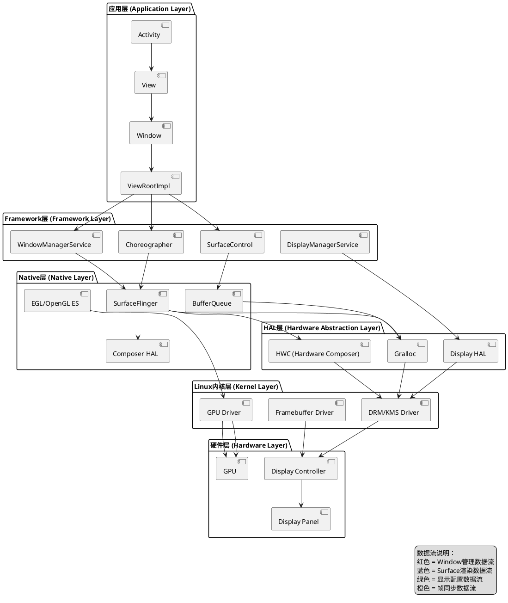

## 3. 显示系统启动流程时序图

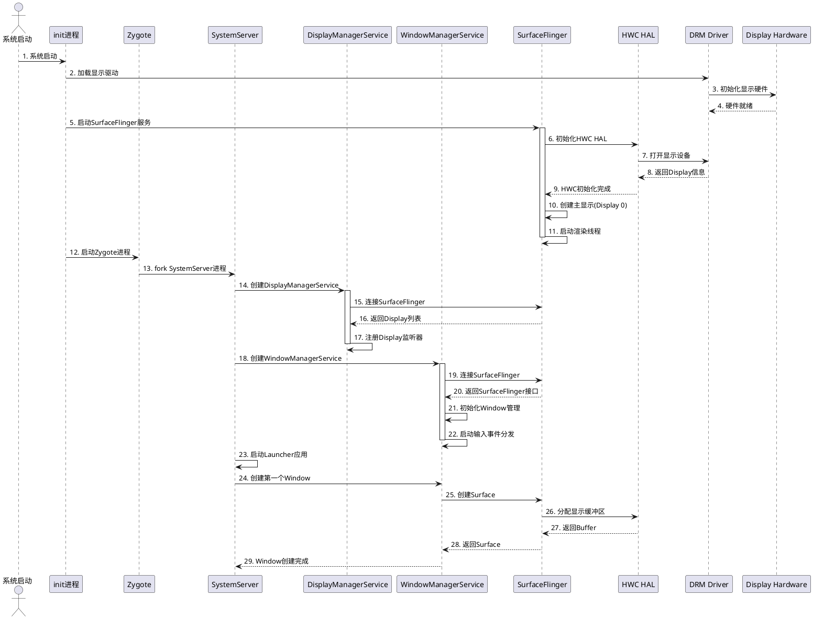

## 4. 帧渲染流程时序图

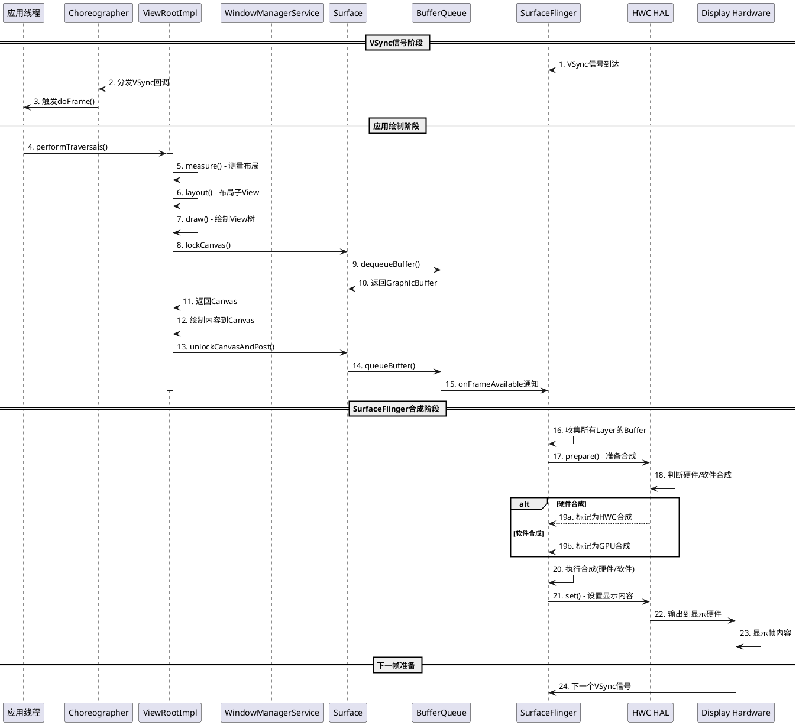

## 5. Window创建与管理类图

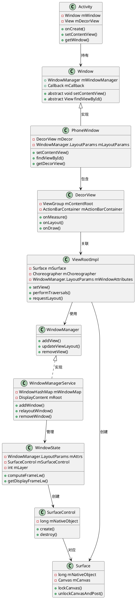

## 6. SurfaceFlinger核心类图

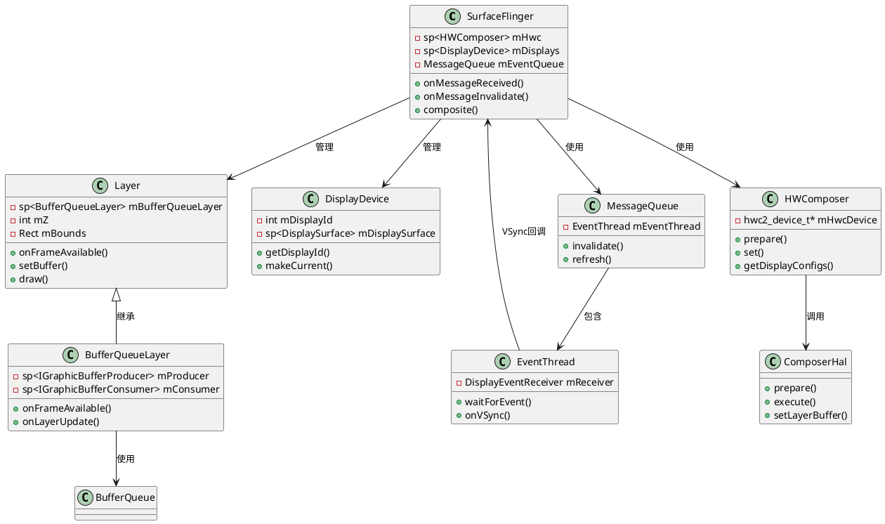

## 7. 显示系统初始化活动图

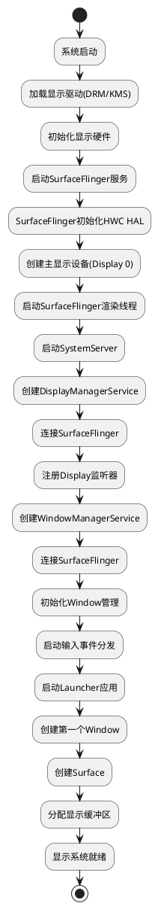

## 8. Window状态转换图

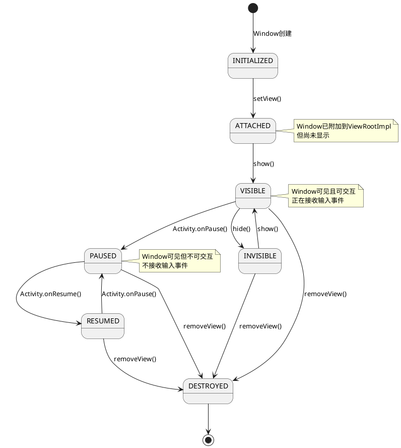

## 9. 显示数据流组件图

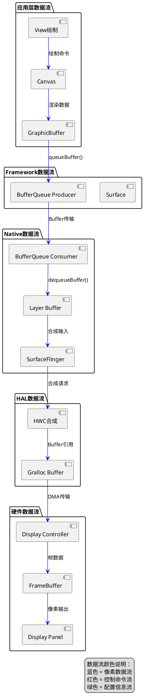

## 10. 帧数据结构详解

### 10.1 GraphicBuffer数据结构

GraphicBuffer是Android显示系统中帧数据的核心载体，它封装了像素数据的内存缓冲区。

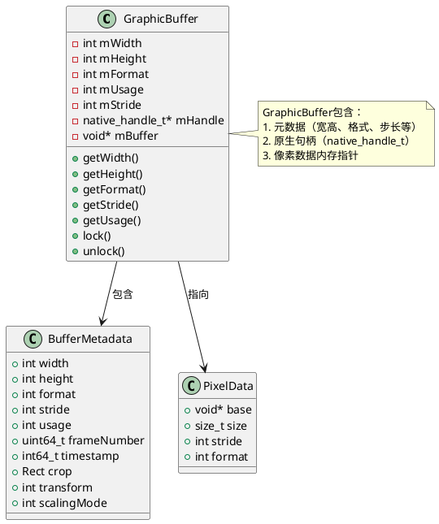

### 10.2 GraphicBuffer核心字段说明

#### 10.2.1 尺寸信息

- **mWidth**: Buffer的逻辑宽度（像素）
- **mHeight**: Buffer的逻辑高度（像素）
- **mStride**: Buffer的步长（每行的字节数），可能大于 `width * bytes_per_pixel`  due to memory alignment

#### 10.2.2 格式信息

- **mFormat**: 像素格式（PixelFormat），常见格式包括：
  - `RGBA_8888`: 32位RGBA，每像素4字节
  - `RGBX_8888`: 32位RGBX，每像素4字节
  - `RGB_565`: 16位RGB，每像素2字节
  - `RGB_888`: 24位RGB，每像素3字节
  - `YV12`: YUV420平面格式
  - `NV21`: YUV420半平面格式（Android相机常用）

#### 10.2.3 使用标志

- **mUsage**: Buffer的使用标志（GRALLOC_USAGE_*），包括：
  - `GRALLOC_USAGE_HW_TEXTURE`: 用于GPU纹理
  - `GRALLOC_USAGE_HW_RENDER`: 用于GPU渲染
  - `GRALLOC_USAGE_HW_COMPOSER`: 用于HWC合成
  - `GRALLOC_USAGE_HW_VIDEO_ENCODER`: 用于视频编码
  - `GRALLOC_USAGE_SW_READ_OFTEN`: 频繁CPU读取
  - `GRALLOC_USAGE_SW_WRITE_OFTEN`: 频繁CPU写入

#### 10.2.4 内存句柄

- **mHandle**: 原生内存句柄（native_handle_t），用于跨进程共享Buffer
- **mBuffer**: 像素数据的内存指针

### 10.3 像素格式详解

```plantuml
@startuml 像素格式内存布局图

package "RGBA_8888格式" {
    rectangle "像素内存布局" as RGBA {
        [R: 8bit] as R1
        [G: 8bit] as G1
        [B: 8bit] as B1
        [A: 8bit] as A1
    }
    note right
        每像素4字节
        内存顺序：R-G-B-A
        总大小 = width * height * 4
    end note
}

package "RGB_565格式" {
    rectangle "像素内存布局" as RGB565 {
        [R: 5bit] as R2
        [G: 6bit] as G2
        [B: 5bit] as B2
    }
    note right
        每像素2字节
        内存顺序：R-G-B
        总大小 = width * height * 2
    end note
}

package "YV12格式 (YUV420)" {
    rectangle "Y平面" as YPlane {
        [Y: 8bit] as Y1
        [Y: 8bit] as Y2
        [Y: 8bit] as Y3
        [Y: 8bit] as Y4
    }
    rectangle "V平面" as VPlane {
        [V: 8bit] as V1
        [V: 8bit] as V2
    }
    rectangle "U平面" as UPlane {
        [U: 8bit] as U1
        [U: 8bit] as U2
    }
    note right
        Y平面：width * height
        U平面：width/2 * height/2
        V平面：width/2 * height/2
        总大小 = width * height * 1.5
    end note
}

package "NV21格式 (YUV420半平面)" {
    rectangle "Y平面" as YPlane2 {
        [Y: 8bit] as Y3
        [Y: 8bit] as Y4
    }
    rectangle "UV交错平面" as UVPlane {
        [V: 8bit] as V3
        [U: 8bit] as U3
        [V: 8bit] as V4
        [U: 8bit] as U4
    }
    note right
        Y平面：width * height
        UV平面：width * height/2
        UV交错存储：V-U-V-U
        总大小 = width * height * 1.5
    end note
}

@enduml
```

### 10.4 Buffer元数据结构

BufferQueue在传输Buffer时会附加元数据信息：

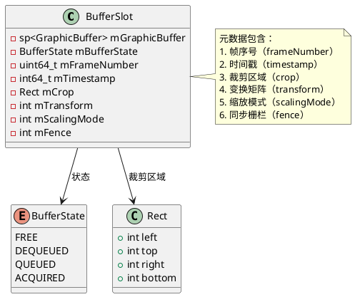

### 10.5 帧数据内存布局示例

#### 10.5.1 RGBA_8888格式内存布局

```
Buffer内存布局（1920x1080分辨率，RGBA_8888格式）：

┌─────────────────────────────────────────┐
│ Buffer Metadata (元数据)                │
│ - width: 1920                          │
│ - height: 1080                         │
│ - format: RGBA_8888                    │
│ - stride: 1920 (或对齐后的值)          │
│ - size: 1920 * 1080 * 4 = 8,294,400字节│
├─────────────────────────────────────────┤
│ Pixel Data (像素数据)                  │
│ ┌─────────────────────────────────────┐ │
│ │ Row 0: [R G B A] [R G B A] ...    │ │
│ │ Row 1: [R G B A] [R G B A] ...    │ │
│ │ ...                                │ │
│ │ Row 1079: [R G B A] [R G B A] ... │ │
│ └─────────────────────────────────────┘ │
└─────────────────────────────────────────┘

每行大小 = stride * 4 字节
总大小 = stride * height * 4 字节
```

#### 10.5.2 YV12格式内存布局

```
Buffer内存布局（1920x1080分辨率，YV12格式）：

┌─────────────────────────────────────────┐
│ Buffer Metadata                         │
│ - width: 1920                          │
│ - height: 1080                         │
│ - format: YV12                         │
│ - stride: 1920                         │
├─────────────────────────────────────────┤
│ Y Plane (亮度平面)                      │
│ ┌─────────────────────────────────────┐ │
│ │ 1920 * 1080 = 2,073,600 字节       │ │
│ └─────────────────────────────────────┘ │
├─────────────────────────────────────────┤
│ V Plane (色度V平面)                    │
│ ┌─────────────────────────────────────┐ │
│ │ 960 * 540 = 518,400 字节           │ │
│ └─────────────────────────────────────┘ │
├─────────────────────────────────────────┤
│ U Plane (色度U平面)                    │
│ ┌─────────────────────────────────────┐ │
│ │ 960 * 540 = 518,400 字节           │ │
│ └─────────────────────────────────────┘ │
└─────────────────────────────────────────┘

总大小 = 2,073,600 + 518,400 + 518,400 = 3,110,400 字节
```

### 10.6 Buffer传输数据结构

Buffer在Producer和Consumer之间传输时的数据结构：

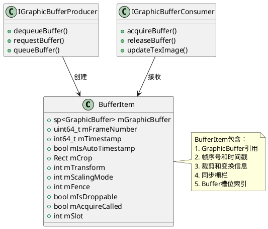

### 10.7 帧数据大小计算

#### 10.7.1 常见格式大小计算

| 格式 | 每像素字节数 | 1920x1080大小 | 说明 |
|------|------------|--------------|------|
| RGBA_8888 | 4 | ~8.3 MB | 32位RGBA，最常用 |
| RGBX_8888 | 4 | ~8.3 MB | 32位RGBX，无Alpha |
| RGB_565 | 2 | ~4.1 MB | 16位RGB，节省内存 |
| RGB_888 | 3 | ~6.2 MB | 24位RGB |
| YV12 | 1.5 | ~3.1 MB | YUV420平面格式 |
| NV21 | 1.5 | ~3.1 MB | YUV420半平面格式 |

#### 10.7.2 实际内存大小

实际分配的内存可能大于计算值，原因包括：

1. **内存对齐**：Stride可能大于 `width * bytes_per_pixel`
   ```
   实际大小 = stride * height * bytes_per_pixel
   其中 stride >= width * bytes_per_pixel
   ```

2. **多Buffer缓冲**：BufferQueue通常维护2-3个Buffer
   ```
   总内存 = 单个Buffer大小 * Buffer数量
   ```

3. **元数据开销**：BufferSlot、BufferItem等元数据占用额外内存

### 10.8 帧数据访问方式

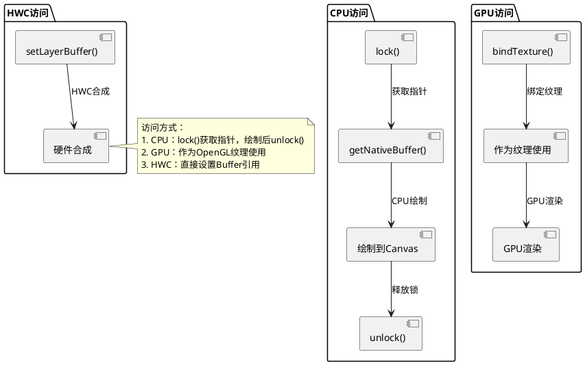

### 10.9 帧数据生命周期

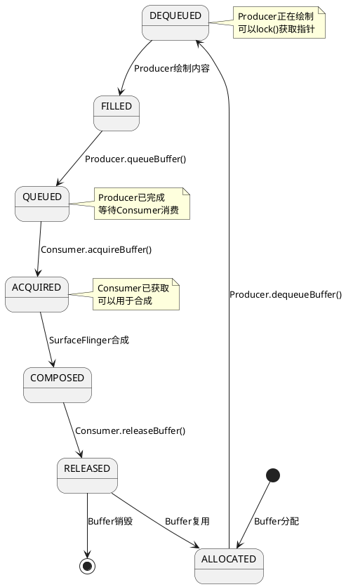

### 10.10 关键数据结构总结

#### 10.10.1 GraphicBuffer核心结构

```cpp
// GraphicBuffer核心字段（简化表示）
struct GraphicBuffer {
    int mWidth;           // 宽度（像素）
    int mHeight;          // 高度（像素）
    int mFormat;          // 像素格式（PixelFormat）
    int mUsage;           // 使用标志（GRALLOC_USAGE_*）
    int mStride;          // 步长（每行字节数）
    native_handle_t* mHandle;  // 原生内存句柄
    void* mBuffer;        // 像素数据指针
};
```

#### 10.10.2 BufferItem结构

```cpp
// BufferItem结构（简化表示）
struct BufferItem {
    sp<GraphicBuffer> mGraphicBuffer;  // GraphicBuffer引用
    uint64_t mFrameNumber;             // 帧序号
    int64_t mTimestamp;                // 时间戳（纳秒）
    Rect mCrop;                         // 裁剪区域
    int mTransform;                     // 变换矩阵
    int mScalingMode;                   // 缩放模式
    int mFence;                         // 同步栅栏
    int mSlot;                          // Buffer槽位索引
};
```

#### 10.10.3 像素格式枚举

```cpp
// 常见像素格式（Android PixelFormat）
enum PixelFormat {
    UNKNOWN = 0,
    RGBA_8888 = 1,
    RGBX_8888 = 2,
    RGB_888 = 3,
    RGB_565 = 4,
    RGBA_5551 = 6,
    RGBA_4444 = 7,
    YV12 = 0x32315659,      // YUV420平面格式
    NV21 = 0x11,            // YUV420半平面格式
    // ... 更多格式
};
```

## 11. 多显示系统架构图

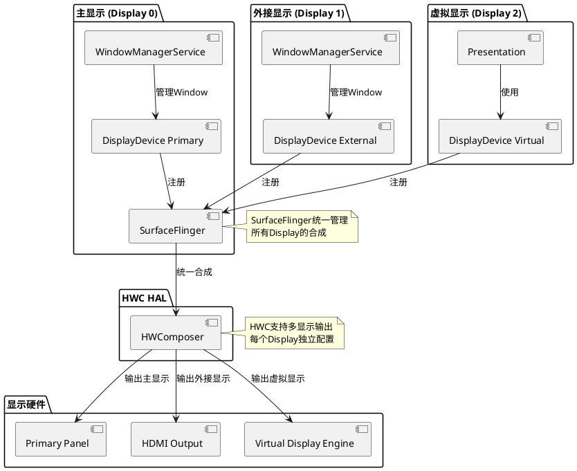

## 11. VSync同步机制时序图

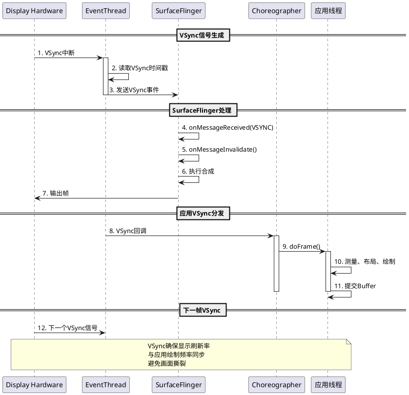

## 12. BufferQueue工作机制类图

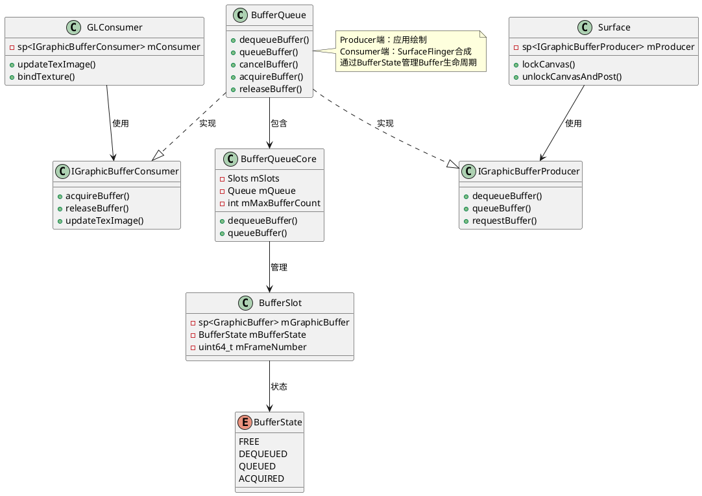

## 13. 显示系统关键流程总结

### 13.1 系统启动流程

1. **硬件初始化**：Linux内核加载DRM/KMS驱动，初始化显示硬件
2. **SurfaceFlinger启动**：init进程启动SurfaceFlinger服务，初始化HWC HAL
3. **SystemServer启动**：创建DisplayManagerService和WindowManagerService
4. **服务连接**：Framework服务连接到SurfaceFlinger
5. **应用启动**：启动Launcher，创建第一个Window

### 13.2 帧渲染流程

1. **VSync触发**：显示硬件产生VSync信号
2. **应用绘制**：Choreographer触发doFrame()，执行measure/layout/draw
3. **Buffer提交**：应用将绘制内容提交到BufferQueue
4. **合成准备**：SurfaceFlinger收集所有Layer的Buffer
5. **HWC合成**：HWC判断硬件/软件合成方式
6. **显示输出**：合成后的帧输出到显示硬件

### 13.3 Window生命周期

1. **创建**：Activity创建PhoneWindow
2. **附加**：ViewRootImpl.setView()附加Window
3. **显示**：WindowManagerService.addView()显示Window
4. **绘制**：performTraversals()执行绘制流程
5. **销毁**：removeView()移除Window

## 14. 关键组件说明

### 14.1 SurfaceFlinger

SurfaceFlinger是Android显示系统的核心服务，负责：
- 管理所有Display设备
- 收集所有Layer的Buffer
- 执行合成操作（硬件或软件）
- 与HWC HAL交互
- 管理VSync信号分发

### 14.2 WindowManagerService

WindowManagerService负责：
- 管理所有Window的生命周期
- 处理Window的Z-order排序
- 管理Window的布局和动画
- 处理输入事件分发
- 与SurfaceFlinger交互创建Surface

### 14.3 HWC (Hardware Composer)

HWC HAL负责：
- 判断Layer的合成方式（硬件/软件）
- 执行硬件合成（Overlay）
- 管理显示缓冲区
- 处理多显示输出
- 优化功耗和性能

### 14.4 BufferQueue

BufferQueue是生产者-消费者模型：
- Producer端：应用绘制内容到Buffer
- Consumer端：SurfaceFlinger消费Buffer进行合成
- 通过BufferState管理Buffer生命周期
- 支持多Buffer缓冲，提高性能

## 15. 性能优化要点

1. **硬件合成优先**：HWC优先使用硬件Overlay合成，减少GPU负载
2. **VSync同步**：通过VSync同步应用绘制和显示刷新
3. **Buffer复用**：BufferQueue复用GraphicBuffer，减少内存分配
4. **多Buffer缓冲**：使用2-3个Buffer实现流水线渲染
5. **Layer合并**：SurfaceFlinger合并相同属性的Layer

## 16. 总结

Android显示系统采用分层架构，从底层硬件到上层应用，每一层都有明确的职责：

- **硬件层**：提供显示硬件支持
- **内核层**：提供显示驱动接口
- **HAL层**：抽象硬件差异，提供统一接口
- **Native层**：核心显示服务SurfaceFlinger
- **Framework层**：Window管理和View系统
- **应用层**：Activity和View的绘制

整个系统通过VSync同步、BufferQueue缓冲、HWC硬件加速等机制，实现了高效、流畅的显示效果。

## 17. 进程模型图

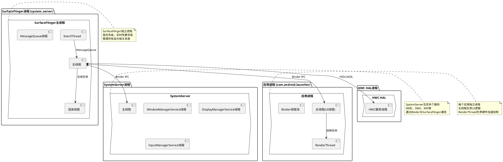

## 18. 线程模型详细图

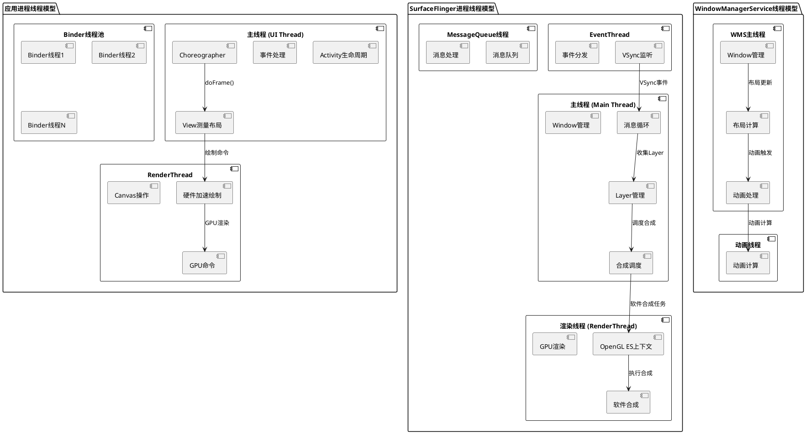

## 19. 数据流与控制流分离图

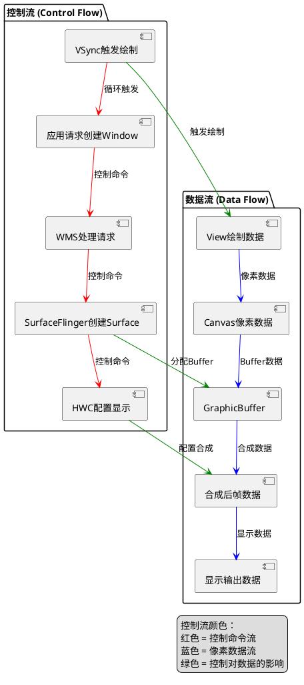

## 20. 完整数据流与控制流时序图

```plantuml
@startuml 完整数据流与控制流时序图

participant "应用" as App
participant "WMS" as WMS
participant "SurfaceFlinger" as SF
participant "HWC" as HWC
participant "显示硬件" as Display

== 控制流：Window创建 ==
App -> WMS: 1. 请求创建Window (控制)
activate WMS
WMS -> SF: 2. 创建Surface (控制)
activate SF
SF -> HWC: 3. 分配Buffer (控制)
HWC --> SF: 4. Buffer分配完成 (控制)
SF --> WMS: 5. Surface创建完成 (控制)
WMS --> App: 6. Window创建完成 (控制)
deactivate SF
deactivate WMS

== 数据流：帧渲染 ==
Display -> SF: 7. VSync信号 (控制)
SF -> App: 8. VSync回调 (控制)
activate App
App -> App: 9. 绘制View树 (数据)
App -> SF: 10. queueBuffer() (数据)
deactivate App

== 控制流：合成调度 ==
SF -> SF: 11. 收集所有Layer (控制)
SF -> HWC: 12. prepare() (控制)
HWC --> SF: 13. 合成方式标记 (控制)
SF -> SF: 14. 执行合成 (控制)

== 数据流：合成输出 ==
SF -> HWC: 15. set() - Buffer引用 (数据)
HWC -> Display: 16. 输出帧数据 (数据)
Display -> Display: 17. 显示帧 (数据)

note over App,Display
    控制流：管理生命周期、调度、配置
    数据流：像素数据从应用到显示硬件
    两者分离但相互配合
end note

@enduml
```

## 21. HWC合成判断流程图

```plantuml
@startuml HWC合成判断流程图

start

:SurfaceFlinger调用HWC.prepare();

:遍历所有Layer;

:检查Layer属性;

if (Layer有Buffer?) then (否)
    :标记为SKIP;
    stop
endif

if (Layer需要混合?) then (是)
    if (硬件支持混合?) then (否)
        :标记为CLIENT合成;
        stop
    endif
endif

if (Layer需要变换?) then (是)
    if (硬件支持变换?) then (否)
        :标记为CLIENT合成;
        stop
    endif
endif

if (Layer需要缩放?) then (是)
    if (硬件支持缩放?) then (否)
        :标记为CLIENT合成;
        stop
    endif
endif

if (Layer透明度 < 1.0?) then (是)
    if (硬件支持Alpha混合?) then (否)
        :标记为CLIENT合成;
        stop
    endif
endif

if (Overlay资源可用?) then (是)
    :标记为DEVICE合成(硬件Overlay);
else (否)
    :标记为CLIENT合成(软件合成);
endif

:返回合成方式标记;

stop

note right
    DEVICE合成：硬件Overlay
    性能最优，功耗最低
    
    CLIENT合成：软件合成
    使用GPU渲染，性能次之
end note

@enduml
```

## 22. BufferQueue状态转换流程图

```plantuml
@startuml BufferQueue状态转换流程图

start

:Buffer创建;

:状态 = FREE;

:Producer调用dequeueBuffer();

:状态 = DEQUEUED;
note right
    Producer正在使用
    不能同时被Consumer使用
end note

:Producer绘制内容;

:Producer调用queueBuffer();

:状态 = QUEUED;
note right
    Producer已完成绘制
    等待Consumer消费
end note

:Consumer调用acquireBuffer();

:状态 = ACQUIRED;
note right
    Consumer正在使用
    不能同时被Producer使用
end note

:Consumer使用Buffer;

:Consumer调用releaseBuffer();

:状态 = FREE;

:Buffer可复用;

stop

@enduml
```

## 23. Buffer状态转换图

```plantuml
@startuml Buffer状态转换图

[*] --> FREE : Buffer创建

FREE --> DEQUEUED : Producer.dequeueBuffer()
DEQUEUED --> FREE : Producer.cancelBuffer()
DEQUEUED --> QUEUED : Producer.queueBuffer()

QUEUED --> ACQUIRED : Consumer.acquireBuffer()
QUEUED --> FREE : Buffer被丢弃

ACQUIRED --> FREE : Consumer.releaseBuffer()

FREE --> [*] : Buffer销毁

note right of FREE
    Buffer空闲状态
    可以被Producer或Consumer使用
end note

note right of DEQUEUED
    Producer已获取Buffer
    正在绘制内容
end note

note right of QUEUED
    Producer已完成绘制
    等待Consumer消费
end note

note right of ACQUIRED
    Consumer已获取Buffer
    正在合成或显示
end note

@enduml
```

## 24. Layer状态转换图

```plantuml
@startuml Layer状态转换图

[*] --> CREATED : Layer创建

CREATED --> ACTIVE : setBuffer()
ACTIVE --> INACTIVE : removeBuffer()
INACTIVE --> ACTIVE : setBuffer()

ACTIVE --> HIDDEN : setVisibility(HIDDEN)
HIDDEN --> ACTIVE : setVisibility(VISIBLE)

ACTIVE --> DESTROYED : destroy()
INACTIVE --> DESTROYED : destroy()
HIDDEN --> DESTROYED : destroy()

DESTROYED --> [*]

note right of CREATED
    Layer已创建但未激活
    没有Buffer数据
end note

note right of ACTIVE
    Layer处于活动状态
    有Buffer数据，参与合成
end note

note right of INACTIVE
    Layer暂时无Buffer
    但Layer对象仍存在
end note

note right of HIDDEN
    Layer被隐藏
    不参与合成但保留状态
end note

@enduml
```

## 25. Display状态转换图

```plantuml
@startuml Display状态转换图

[*] --> UNKNOWN : Display检测

UNKNOWN --> OFF : Display关闭
OFF --> ON : Display打开
ON --> OFF : Display关闭

ON --> DOZE : 进入Doze模式
DOZE --> ON : 退出Doze模式

ON --> SUSPEND : 系统挂起
SUSPEND --> ON : 系统恢复

ON --> DESTROYED : Display移除
OFF --> DESTROYED : Display移除
DOZE --> DESTROYED : Display移除
SUSPEND --> DESTROYED : Display移除

DESTROYED --> [*]

note right of UNKNOWN
    Display状态未知
    初始化阶段
end note

note right of ON
    Display正常工作
    显示内容
end note

note right of OFF
    Display关闭
    不显示内容但硬件仍存在
end note

note right of DOZE
    Display处于Doze模式
    低功耗状态
end note

note right of SUSPEND
    Display挂起
    系统休眠状态
end note

@enduml
```

## 26. Window Z-order管理流程图

```plantuml
@startuml Window Z-order管理流程图

start

:应用请求添加Window;

:WMS接收addWindow()请求;

:获取Window的LayoutParams.type;

:根据type确定基础Z-order;

switch (Window Type)
case (TYPE_APPLICATION)
    :基础Z-order = APPLICATION_BASE;
case (TYPE_APPLICATION_OVERLAY)
    :基础Z-order = APPLICATION_OVERLAY_BASE;
case (TYPE_SYSTEM_ALERT)
    :基础Z-order = SYSTEM_ALERT_BASE;
case (TYPE_SYSTEM_OVERLAY)
    :基础Z-order = SYSTEM_OVERLAY_BASE;
case (TYPE_TOAST)
    :基础Z-order = TOAST_BASE;
case (TYPE_PRIORITY_PHONE)
    :基础Z-order = PRIORITY_PHONE_BASE;
endswitch

:计算Window的最终Z-order;

:finalZ = baseZ + subLayer;

:插入到WindowList的合适位置;

:通知SurfaceFlinger更新Layer顺序;

:Window显示;

stop

note right
    Z-order决定Window的显示层级
    数值越大越在上层
    相同Z-order时后添加的在上层
end note

@enduml
```

## 27. VSync分发机制流程图

```plantuml
@startuml VSync分发机制流程图

start

:显示硬件产生VSync中断;

:EventThread读取VSync时间戳;

:计算VSync时间戳;

:添加到VSync事件队列;

:遍历所有注册的VSync监听器;

:计算每个监听器的VSync时间;

if (监听器需要VSync?) then (是)
    :发送VSync回调;
    :更新监听器的VSync时间;
else (否)
    :跳过该监听器;
endif

if (还有更多监听器?) then (是)
    :继续下一个监听器;
else (否)
    :等待下一个VSync信号;
endif

stop

note right
    VSync分发确保：
    1. 所有监听器同步
    2. 时间戳准确
    3. 延迟最小
end note

@enduml
```

## 28. Surface创建流程活动图

```plantuml
@startuml Surface创建流程活动图

start

:应用调用WindowManager.addView();

:ViewRootImpl.setView();

:创建SurfaceControl;

:调用WMS.addWindow();

:WMS验证Window权限;

if (权限验证通过?) then (否)
    :抛出SecurityException;
    stop
endif

:WMS创建WindowState;

:WMS调用SurfaceFlinger.createSurface();

:SurfaceFlinger创建Layer;

:SurfaceFlinger分配BufferQueue;

:SurfaceFlinger返回SurfaceControl;

:WMS创建Surface对象;

:Surface绑定到SurfaceControl;

:返回Surface给应用;

:应用可以开始绘制;

stop

@enduml
```

## 29. 硬件合成与软件合成对比时序图

```plantuml
@startuml 硬件合成与软件合成对比时序图

== 硬件合成流程 (HWC Overlay) ==

participant "SurfaceFlinger" as SF
participant "HWC HAL" as HWC
participant "Display Controller" as DC
participant "Display Hardware" as Display

SF -> HWC: prepare() - 准备合成
HWC -> HWC: 判断为DEVICE合成
HWC --> SF: 返回合成方式标记

SF -> HWC: set() - 设置Layer Buffer
HWC -> DC: 配置Overlay硬件
DC -> Display: 直接输出Layer
Display -> Display: 显示内容

note over SF,Display
    硬件合成优势：
    1. 性能最优
    2. 功耗最低
    3. 延迟最小
end note

== 软件合成流程 (GPU Compositing) ==

participant "SurfaceFlinger" as SF2
participant "GPU" as GPU
participant "Display Controller" as DC2
participant "Display Hardware" as Display2

SF2 -> HWC: prepare() - 准备合成
HWC -> HWC: 判断为CLIENT合成
HWC --> SF2: 返回合成方式标记

SF2 -> GPU: 绑定所有Layer纹理
GPU -> GPU: 执行OpenGL ES合成
GPU -> GPU: 渲染到Framebuffer
GPU -> DC2: 输出合成后的帧
DC2 -> Display2: 显示内容

note over SF2,Display2
    软件合成特点：
    1. 灵活性高
    2. 支持复杂效果
    3. 功耗较高
end note

@enduml
```

## 30. 多Buffer流水线渲染机制图

```plantuml
@startuml 多Buffer流水线渲染机制图

participant "应用" as App
participant "BufferQueue" as BQ
participant "SurfaceFlinger" as SF

== 三Buffer流水线 ==

note over App,SF
    Buffer 0: Producer正在绘制
    Buffer 1: Consumer正在合成
    Buffer 2: Display正在显示
end note

App -> BQ: dequeueBuffer() -> Buffer 0
activate App
App -> App: 绘制到Buffer 0
App -> BQ: queueBuffer(Buffer 0)
deactivate App

BQ -> SF: onFrameAvailable(Buffer 0)

par SF合成Buffer 1
    SF -> BQ: acquireBuffer() -> Buffer 1
    SF -> SF: 合成Buffer 1
    SF -> BQ: releaseBuffer(Buffer 1)
end

par App绘制Buffer 0
    App -> BQ: dequeueBuffer() -> Buffer 0
    App -> App: 绘制到Buffer 0
    App -> BQ: queueBuffer(Buffer 0)
end

par Display显示Buffer 2
    Display -> Display: 显示Buffer 2
end

note over App,SF
    三个Buffer并行工作：
    1. 提高吞吐量
    2. 减少等待时间
    3. 保证流畅性
end note

@enduml
```

## 31. 显示系统关键机制总结

### 31.1 VSync同步机制

VSync（Vertical Synchronization）是显示系统的核心同步机制：
- **硬件VSync**：显示硬件产生的垂直同步信号，通常60Hz或120Hz
- **软件VSync**：SurfaceFlinger分发给应用的VSync回调
- **作用**：确保应用绘制与显示刷新同步，避免画面撕裂
- **分发路径**：硬件 → EventThread → SurfaceFlinger → Choreographer → 应用

### 31.2 BufferQueue缓冲机制

BufferQueue采用生产者-消费者模型：
- **Producer端**：应用绘制内容到Buffer
- **Consumer端**：SurfaceFlinger消费Buffer进行合成
- **Buffer状态**：FREE → DEQUEUED → QUEUED → ACQUIRED → FREE
- **多Buffer流水线**：2-3个Buffer并行工作，提高性能

### 31.3 HWC硬件合成机制

HWC（Hardware Composer）负责硬件加速合成：
- **合成方式判断**：根据Layer属性判断硬件/软件合成
- **硬件Overlay**：直接使用显示控制器合成，性能最优
- **软件合成**：使用GPU OpenGL ES合成，灵活性高
- **优化目标**：优先硬件合成，降低功耗

### 31.4 Window Z-order管理机制

WindowManagerService管理Window的显示层级：
- **基础Z-order**：根据Window类型确定
- **子层级调整**：通过subLayer微调
- **动态更新**：Window添加/移除时重新排序
- **SurfaceFlinger同步**：Z-order变化时通知SurfaceFlinger更新Layer顺序

### 31.5 多显示管理机制

Android支持多显示设备：
- **主显示（Display 0）**：设备内置主屏幕
- **外接显示（Display 1+）**：HDMI、USB-C等外接显示器
- **虚拟显示（Virtual Display）**：录屏、投屏等场景
- **统一管理**：SurfaceFlinger统一管理所有Display的合成

## 32. 关键流程总结

### 32.1 Window创建流程

1. **应用请求**：Activity.onCreate() → setContentView()
2. **Window创建**：创建PhoneWindow和DecorView
3. **ViewRootImpl附加**：setView()附加Window到ViewRootImpl
4. **WMS注册**：WindowManagerService.addWindow()
5. **Surface创建**：SurfaceFlinger.createSurface()
6. **Buffer分配**：分配BufferQueue和GraphicBuffer
7. **Window显示**：Window添加到显示列表，开始绘制

### 32.2 帧渲染流程

1. **VSync触发**：显示硬件产生VSync信号
2. **事件分发**：EventThread分发VSync到SurfaceFlinger和应用
3. **应用绘制**：Choreographer触发doFrame() → measure/layout/draw
4. **Buffer提交**：应用绘制内容提交到BufferQueue
5. **合成准备**：SurfaceFlinger收集所有Layer的Buffer
6. **HWC判断**：HWC判断每个Layer的合成方式
7. **执行合成**：硬件Overlay或GPU软件合成
8. **显示输出**：合成后的帧输出到显示硬件

### 32.3 Layer生命周期流程

1. **Layer创建**：Surface创建时创建对应的Layer
2. **Buffer更新**：应用提交Buffer时更新Layer
3. **合成参与**：Layer参与SurfaceFlinger的合成
4. **状态管理**：Layer在ACTIVE、INACTIVE、HIDDEN状态间转换
5. **Layer销毁**：Surface销毁时销毁对应的Layer

### 32.4 Display生命周期流程

1. **Display检测**：系统启动或外接设备插入时检测Display
2. **Display注册**：DisplayManagerService注册Display到SurfaceFlinger
3. **Display配置**：配置分辨率、刷新率、颜色空间等
4. **Display激活**：Display进入ON状态，开始显示内容
5. **Display管理**：处理Display的ON/OFF/DOZE/SUSPEND状态转换
6. **Display移除**：设备移除时销毁Display对象

## 33. 显示问题分析思路

### 33.1 黑屏问题分析

#### 33.1.1 问题定义

黑屏是指屏幕完全无显示内容，呈现黑色状态。可能发生在系统启动、应用启动、界面切换等场景。

#### 33.1.2 可能原因分析

```plantuml
@startuml 黑屏问题原因分析图

package "硬件层原因" {
    [显示硬件故障] as HW1
    [背光未开启] as HW2
    [显示驱动异常] as HW3
}

package "系统层原因" {
    [SurfaceFlinger未启动] as SYS1
    [Display未激活] as SYS2
    [HWC初始化失败] as SYS3
}

package "应用层原因" {
    [Window未创建] as APP1
    [Surface未分配] as APP2
    [View未绘制] as APP3
    [Window被隐藏] as APP4
}

package "配置原因" {
    [Display亮度为0] as CFG1
    [Window透明度为0] as CFG2
    [View背景为黑色] as CFG3
}

@enduml
```

#### 33.1.3 黑屏问题排查流程图

```plantuml
@startuml 黑屏问题排查流程图

start

:确认黑屏现象;

if (背光是否亮起?) then (否)
    :检查背光驱动;
    :检查背光配置;
    stop
endif

if (SurfaceFlinger是否运行?) then (否)
    :检查SurfaceFlinger进程;
    :检查SurfaceFlinger日志;
    stop
endif

if (Display是否激活?) then (否)
    :检查Display状态;
    :检查Display配置;
    stop
endif

if (Window是否存在?) then (否)
    :检查Window创建流程;
    :检查WMS日志;
    stop
endif

if (Surface是否分配?) then (否)
    :检查Surface创建流程;
    :检查Buffer分配;
    stop
endif

if (View是否绘制?) then (否)
    :检查View绘制流程;
    :检查Canvas操作;
    stop
endif

if (Window是否被隐藏?) then (是)
    :检查Window可见性;
    :检查Z-order;
    stop
endif

if (Buffer是否提交?) then (否)
    :检查queueBuffer调用;
    :检查Buffer状态;
    stop
endif

:检查合成流程;
:检查HWC输出;

stop

note right
    排查顺序：
    1. 硬件层（背光、驱动）
    2. 系统层（SurfaceFlinger、Display）
    3. 应用层（Window、Surface、View）
    4. 数据流（Buffer、合成）
end note

@enduml
```

#### 33.1.4 关键日志检查点

1. **SurfaceFlinger日志**：
   - `dumpsys SurfaceFlinger` - 检查Display状态、Layer列表
   - `logcat | grep SurfaceFlinger` - 检查SurfaceFlinger错误日志

2. **WindowManager日志**：
   - `dumpsys window` - 检查Window列表、Z-order
   - `logcat | grep WindowManager` - 检查Window创建/销毁日志

3. **应用日志**：
   - `logcat | grep ActivityManager` - 检查Activity生命周期
   - `logcat | grep ViewRootImpl` - 检查View绘制日志

4. **硬件日志**：
   - `dmesg | grep display` - 检查显示驱动日志
   - `dmesg | grep backlight` - 检查背光驱动日志

#### 33.1.5 关键日志示例及说明

**1. SurfaceFlinger Display状态检查**

```bash
# 检查Display状态
adb shell dumpsys SurfaceFlinger --display-id

# 正常输出示例：
# Display 0: width=1080, height=2400, refreshRate=60.0
# Display 1: width=1920, height=1080, refreshRate=60.0

# 异常情况：
# - Display未激活：Display 0: state=OFF
# - Display未注册：无Display输出
```

**2. SurfaceFlinger Layer列表检查**

```bash
# 检查Layer列表
adb shell dumpsys SurfaceFlinger --list

# 正常输出示例：
# Layer 0: com.android.launcher/com.android.launcher.Launcher (0x7f8a1b4000)
#   zOrder=1, visible=true, activeBuffer=1920x1080
# Layer 1: StatusBar (0x7f8a1b5000)
#   zOrder=2, visible=true, activeBuffer=1080x240

# 异常情况：
# - Layer不存在：无对应应用的Layer
# - Layer不可见：visible=false
# - Buffer为空：activeBuffer=null
```

**3. WindowManager Window列表检查**

```bash
# 检查Window列表
adb shell dumpsys window windows | grep -A 10 "Window #"

# 正常输出示例：
# Window #1: Window{abc123 u0 com.android.launcher}
#   mDisplayId=0, mOwnerUid=10000
#   mAttrs=WM.LayoutParams{(0,0)(fillxfill) type=1}
#   mShown=true, mHasSurface=true

# 异常情况：
# - Window未创建：无对应Window
# - Window未显示：mShown=false
# - Surface未创建：mHasSurface=false
```

**4. Activity生命周期日志**

```bash
# 检查Activity生命周期
adb logcat | grep -E "ActivityManager|Activity"

# 正常输出示例：
# 09-24 19:05:23.456  1000  1234  1234 I ActivityManager: START u0 {act=android.intent.action.MAIN cat=[android.intent.category.LAUNCHER] flg=0x10000000 cmp=com.android.launcher/.Launcher} from uid 10000
# 09-24 19:05:23.567  1000  1234  1234 I ActivityManager: Displayed com.android.launcher/.Launcher: +111ms

# 异常情况：
# - Activity未启动：无START日志
# - Activity启动超时：Displayed时间过长
# - Activity崩溃：FATAL EXCEPTION日志
```

**5. ViewRootImpl绘制日志**

```bash
# 检查View绘制
adb logcat | grep ViewRootImpl

# 正常输出示例：
# 09-24 19:05:23.789  1000  1234  1234 D ViewRootImpl: performTraversals: measure=5ms, layout=3ms, draw=8ms
# 09-24 19:05:23.890  1000  1234  1234 D ViewRootImpl: onDraw: canvas=0x7f8a1b6000

# 异常情况：
# - performTraversals未调用：无对应日志
# - 绘制耗时过长：draw时间>16ms
# - Canvas为空：canvas=null
```

**6. 显示驱动日志**

```bash
# 检查显示驱动
adb shell dmesg | grep -i display

# 正常输出示例：
# [    1.234567] display: panel init success
# [    1.345678] display: backlight enabled, brightness=255

# 异常情况：
# - 驱动未加载：无display相关日志
# - 初始化失败：panel init failed
# - 背光未开启：backlight disabled
```

**7. 背光驱动日志**

```bash
# 检查背光状态
adb shell dmesg | grep -i backlight

# 正常输出示例：
# [    1.234567] backlight: brightness=255/255, state=ON
# [    1.345678] backlight: set brightness=200

# 异常情况：
# - 背光未开启：state=OFF
# - 亮度为0：brightness=0
# - 驱动错误：backlight error
```

### 33.2 白屏问题分析

#### 33.2.1 问题定义

白屏是指屏幕显示白色或浅色背景，但没有正常内容显示。通常发生在应用启动、界面加载等场景。

#### 33.2.2 可能原因分析

```plantuml
@startuml 白屏问题原因分析图

package "Window层原因" {
    [Window背景为白色] as WIN1
    [DecorView未加载] as WIN2
    [ContentView未设置] as WIN3
}

package "View层原因" {
    [View未inflate] as VIEW1
    [View未测量布局] as VIEW2
    [View未绘制] as VIEW3
    [View背景为白色] as VIEW4
}

package "资源加载原因" {
    [布局文件加载失败] as RES1
    [资源文件缺失] as RES2
    [主题配置错误] as RES3
}

package "时序原因" {
    [布局加载延迟] as TIME1
    [数据加载延迟] as TIME2
    [异步操作未完成] as TIME3
}

@enduml
```

#### 33.2.3 白屏问题排查流程图

```plantuml
@startuml 白屏问题排查流程图

start

:确认白屏现象;

if (Window背景是否为白色?) then (是)
    :检查Window主题配置;
    :检查Window背景色;
    stop
endif

if (DecorView是否创建?) then (否)
    :检查PhoneWindow创建;
    :检查setContentView调用;
    stop
endif

if (ContentView是否设置?) then (否)
    :检查setContentView参数;
    :检查布局文件路径;
    stop
endif

if (布局文件是否加载?) then (否)
    :检查布局文件存在性;
    :检查资源ID正确性;
    stop
endif

if (View是否inflate?) then (否)
    :检查LayoutInflater;
    :检查inflate返回值;
    stop
endif

if (View是否测量布局?) then (否)
    :检查performTraversals调用;
    :检查measure/layout流程;
    stop
endif

if (View是否绘制?) then (否)
    :检查draw流程;
    :检查Canvas操作;
    stop
endif

if (数据是否加载?) then (否)
    :检查数据加载时机;
    :检查异步操作完成;
    stop
endif

:检查View可见性;
:检查View透明度;

stop

note right
    白屏通常是：
    1. Window/View背景为白色
    2. 内容未加载或未显示
    3. 布局加载时序问题
end note

@enduml
```

#### 33.2.4 关键检查点

1. **Window主题检查**：
   - `AndroidManifest.xml` 中的 `android:theme` 配置
   - `styles.xml` 中的主题背景色设置

2. **布局加载检查**：
   - `setContentView()` 调用时机和参数
   - 布局文件是否存在和正确
   - `LayoutInflater.inflate()` 返回值

3. **View绘制检查**：
   - `onMeasure()` / `onLayout()` / `onDraw()` 是否调用
   - View的可见性和透明度设置

4. **时序问题检查**：
   - Activity生命周期与数据加载的时序
   - 异步操作完成时机

#### 33.2.5 关键日志示例及说明

**1. Window主题配置检查**

```bash
# 检查Window主题
adb shell dumpsys window | grep -A 5 "mAttrs"

# 正常输出示例：
# mAttrs=WM.LayoutParams{(0,0)(fillxfill) type=1 fl=0x81810100}
#   theme=0x01030005 (系统默认主题)

# 异常情况：
# - 主题未设置：theme=0x0
# - 主题资源缺失：ResourceNotFoundException
```

**2. setContentView调用日志**

```bash
# 检查setContentView调用
adb logcat | grep -E "setContentView|LayoutInflater"

# 正常输出示例：
# 09-24 19:05:23.456  1000  1234  1234 D Activity: setContentView: layoutId=0x7f0a001c
# 09-24 19:05:23.567  1000  1234  1234 D LayoutInflater: inflate: layout=activity_main.xml

# 异常情况：
# - setContentView未调用：无对应日志
# - 布局文件不存在：ResourceNotFoundException: Resource ID 0x7f0a001c
# - inflate失败：inflate返回null
```

**3. View测量布局日志**

```bash
# 检查View测量布局
adb logcat | grep -E "onMeasure|onLayout|performTraversals"

# 正常输出示例：
# 09-24 19:05:23.789  1000  1234  1234 D ViewRootImpl: performTraversals: measure=5ms
# 09-24 19:05:23.890  1000  1234  1234 D View: onMeasure: width=1080, height=2400
# 09-24 19:05:23.901  1000  1234  1234 D View: onLayout: l=0, t=0, r=1080, b=2400

# 异常情况：
# - onMeasure未调用：无measure日志
# - onLayout未调用：无layout日志
# - 尺寸为0：width=0或height=0
```

**4. View绘制日志**

```bash
# 检查View绘制
adb logcat | grep -E "onDraw|draw\(|Canvas"

# 正常输出示例：
# 09-24 19:05:23.912  1000  1234  1234 D View: onDraw: canvas=0x7f8a1b6000
# 09-24 19:05:23.923  1000  1234  1234 D ViewRootImpl: draw: frame=1, duration=8ms

# 异常情况：
# - onDraw未调用：无draw日志
# - Canvas为空：canvas=null
# - 绘制耗时过长：duration>16ms
```

**5. 资源加载日志**

```bash
# 检查资源加载
adb logcat | grep -E "Resources|AssetManager|ResourceNotFoundException"

# 正常输出示例：
# 09-24 19:05:23.456  1000  1234  1234 D Resources: loadDrawable: resId=0x7f020001
# 09-24 19:05:23.567  1000  1234  1234 D AssetManager: open: path=res/layout/activity_main.xml

# 异常情况：
# - 资源未找到：ResourceNotFoundException: Resource ID 0x7f020001
# - 资源加载失败：Failed to load resource
# - 资源文件损坏：Corrupt XML resource file
```

**6. Activity生命周期时序日志**

```bash
# 检查Activity生命周期时序
adb logcat | grep -E "ActivityManager|onCreate|onResume|onStart"

# 正常输出示例：
# 09-24 19:05:23.100  1000  1234  1234 I ActivityManager: START u0 {cmp=com.example/.MainActivity}
# 09-24 19:05:23.200  1000  1234  1234 D Activity: onCreate: savedInstanceState=null
# 09-24 19:05:23.300  1000  1234  1234 D Activity: onStart
# 09-24 19:05:23.400  1000  1234  1234 D Activity: onResume

# 异常情况：
# - onCreate未调用：无onCreate日志
# - 生命周期顺序错误：onResume在onCreate之前
# - 生命周期回调延迟：时间间隔过长
```

### 33.3 闪屏问题分析

#### 33.3.1 问题定义

闪屏是指屏幕内容快速闪烁，可能表现为黑屏/白屏交替、内容快速切换、画面抖动等。

#### 33.3.2 可能原因分析

```plantuml
@startuml 闪屏问题原因分析图

package "VSync同步问题" {
    [VSync信号不稳定] as VSYNC1
    [VSync时间戳错误] as VSYNC2
    [帧率不匹配] as VSYNC3
}

package "Buffer问题" {
    [Buffer切换过快] as BUF1
    [Buffer状态异常] as BUF2
    [Buffer内容错误] as BUF3
}

package "Window切换问题" {
    [Window频繁创建销毁] as WIN1
    [Window Z-order变化] as WIN2
    [Window可见性切换] as WIN3
}

package "合成问题" {
    [Layer频繁更新] as COMP1
    [合成方式切换] as COMP2
    [HWC状态异常] as COMP3
}

@enduml
```

#### 33.3.3 闪屏问题排查流程图

```plantuml
@startuml 闪屏问题排查流程图

start

:确认闪屏现象;

:记录闪屏时间点;

:分析日志时间线;

if (VSync是否稳定?) then (否)
    :检查VSync信号;
    :检查EventThread日志;
    :检查帧率配置;
    stop
endif

if (Buffer切换是否正常?) then (否)
    :检查BufferQueue状态;
    :检查queueBuffer频率;
    :检查Buffer内容;
    stop
endif

if (Window是否频繁切换?) then (是)
    :检查Window创建销毁;
    :检查Activity生命周期;
    :检查Window可见性变化;
    stop
endif

if (Layer是否频繁更新?) then (是)
    :检查Layer更新频率;
    :检查onFrameAvailable调用;
    :检查合成触发;
    stop
endif

if (合成方式是否切换?) then (是)
    :检查HWC合成判断;
    :检查硬件/软件合成切换;
    stop
endif

if (显示刷新率是否变化?) then (是)
    :检查刷新率配置;
    :检查Display模式切换;
    stop
endif

:检查动画效果;
:检查View更新频率;

stop

note right
    闪屏排查重点：
    1. VSync同步稳定性
    2. Buffer切换频率
    3. Window/Layer更新频率
    4. 合成方式切换
end note

@enduml
```

#### 33.3.4 关键检查点

1. **VSync稳定性**：
   - `dumpsys SurfaceFlinger --vsync` - 检查VSync统计
   - `logcat | grep VSync` - 检查VSync事件日志

2. **帧率分析**：
   - `dumpsys gfxinfo <package>` - 检查应用帧率
   - Perfetto性能分析工具

3. **Buffer切换频率**：
   - `dumpsys SurfaceFlinger --latency` - 检查Buffer延迟
   - BufferQueue状态日志

4. **Window变化**：
   - `dumpsys window windows` - 检查Window列表变化
   - Activity生命周期日志

#### 33.3.5 关键日志示例及说明

**1. VSync事件日志**

```bash
# 检查VSync事件
adb logcat | grep -E "VSync|EventThread"

# 正常输出示例：
# 09-24 19:05:23.456  1000  1234  1234 D EventThread: VSync: timestamp=1234567890123, frame=100
# 09-24 19:05:23.473  1000  1234  1234 D EventThread: VSync: timestamp=1234567890289, frame=101
# VSync间隔：16.67ms (60Hz)

# 异常情况：
# - VSync间隔不稳定：间隔变化>2ms
# - VSync丢失：缺少某些帧的VSync日志
# - VSync时间戳错误：timestamp异常
```

**2. VSync统计信息**

```bash
# 检查VSync统计
adb shell dumpsys SurfaceFlinger --vsync

# 正常输出示例：
# VSync Statistics:
#   totalVSyncCount: 3600
#   missedVSyncCount: 0
#   averageVSyncInterval: 16.67ms
#   maxVSyncInterval: 17.23ms
#   minVSyncInterval: 16.12ms

# 异常情况：
# - VSync丢失过多：missedVSyncCount>10
# - VSync间隔过大：maxVSyncInterval>20ms
# - VSync间隔不稳定：max-min>3ms
```

**3. BufferQueue状态日志**

```bash
# 检查BufferQueue状态
adb logcat | grep -E "BufferQueue|queueBuffer|dequeueBuffer|acquireBuffer"

# 正常输出示例：
# 09-24 19:05:23.456  1000  1234  1234 D BufferQueue: dequeueBuffer: slot=0, state=FREE
# 09-24 19:05:23.567  1000  1234  1234 D BufferQueue: queueBuffer: slot=0, state=QUEUED
# 09-24 19:05:23.678  1000  1234  1234 D BufferQueue: acquireBuffer: slot=0, state=ACQUIRED

# 异常情况：
# - Buffer切换过快：queueBuffer频率>60fps
# - Buffer状态异常：state不符合预期
# - Buffer丢失：dequeueBuffer后无queueBuffer
```

**4. Layer更新频率日志**

```bash
# 检查Layer更新
adb logcat | grep -E "onFrameAvailable|Layer.*update"

# 正常输出示例：
# 09-24 19:05:23.456  1000  1234  1234 D SurfaceFlinger: onFrameAvailable: layer=0x7f8a1b4000
# 09-24 19:05:23.473  1000  1234  1234 D SurfaceFlinger: Layer update: frame=100

# 异常情况：
# - Layer更新过快：onFrameAvailable频率>60fps
# - Layer更新丢失：某些帧无onFrameAvailable
# - Layer更新延迟：onFrameAvailable时间间隔>20ms
```

**5. Window创建销毁日志**

```bash
# 检查Window创建销毁
adb logcat | grep -E "WindowManager|addWindow|removeWindow"

# 正常输出示例：
# 09-24 19:05:23.456  1000  1234  1234 D WindowManager: addWindow: window=Window{abc123}
# 09-24 19:05:23.567  1000  1234  1234 D WindowManager: removeWindow: window=Window{abc123}

# 异常情况：
# - Window频繁创建销毁：addWindow和removeWindow交替出现
# - Window创建失败：addWindow返回错误
# - Window未销毁：addWindow后无removeWindow
```

**6. HWC合成方式切换日志**

```bash
# 检查HWC合成方式
adb logcat | grep -E "HWC|prepare|setLayerCompositionType"

# 正常输出示例：
# 09-24 19:05:23.456  1000  1234  1234 D HWC: prepare: layer=0, type=DEVICE (硬件合成)
# 09-24 19:05:23.567  1000  1234  1234 D HWC: prepare: layer=1, type=CLIENT (软件合成)

# 异常情况：
# - 合成方式频繁切换：type在DEVICE和CLIENT间切换
# - 硬件合成失败：type从DEVICE变为CLIENT
# - HWC错误：HWC error或HWC failed
```

**7. Display刷新率变化日志**

```bash
# 检查Display刷新率
adb logcat | grep -E "Display.*refresh|setActiveConfig"

# 正常输出示例：
# 09-24 19:05:23.456  1000  1234  1234 D DisplayManager: setActiveConfig: display=0, config=0, refreshRate=60Hz
# 09-24 19:05:23.567  1000  1234  1234 D DisplayManager: refreshRate changed: 60Hz -> 120Hz

# 异常情况：
# - 刷新率频繁切换：refreshRate在多个值间切换
# - 刷新率设置失败：setActiveConfig返回错误
# - 刷新率异常：refreshRate不在预期范围
```

### 33.4 卡顿问题分析

#### 33.4.1 问题定义

卡顿是指界面响应迟缓、动画不流畅、滚动卡顿等性能问题，通常表现为帧率下降、延迟增加。

#### 33.4.2 可能原因分析

```plantuml
@startuml 卡顿问题原因分析图

package "主线程阻塞" {
    [耗时操作在主线程] as MAIN1
    [同步IO操作] as MAIN2
    [复杂计算] as MAIN3
    [死锁/锁竞争] as MAIN4
}

package "绘制性能问题" {
    [View层级过深] as DRAW1
    [过度绘制] as DRAW2
    [复杂绘制操作] as DRAW3
    [频繁重绘] as DRAW4
}

package "内存问题" {
    [内存不足] as MEM1
    [频繁GC] as MEM2
    [内存泄漏] as MEM3
}

package "合成性能问题" {
    [软件合成过多] as COMP1
    [Layer数量过多] as COMP2
    [合成复杂度高] as COMP3
}

package "系统负载问题" {
    [CPU负载过高] as SYS1
    [GPU负载过高] as SYS2
    [IO负载过高] as SYS3
}

@enduml
```

#### 33.4.3 卡顿问题排查流程图

```plantuml
@startuml 卡顿问题排查流程图

start

:确认卡顿现象;

:测量帧率和延迟;

if (主线程是否阻塞?) then (是)
    :检查主线程堆栈;
    :检查耗时操作;
    :检查锁竞争;
    stop
endif

if (绘制是否耗时?) then (是)
    :检查View层级;
    :检查过度绘制;
    :检查绘制复杂度;
    stop
endif

if (内存是否不足?) then (是)
    :检查内存使用;
    :检查GC频率;
    :检查内存泄漏;
    stop
endif

if (合成是否耗时?) then (是)
    :检查Layer数量;
    :检查合成方式;
    :检查HWC性能;
    stop
endif

if (系统负载是否高?) then (是)
    :检查CPU使用率;
    :检查GPU使用率;
    :检查IO负载;
    stop
endif

if (帧率是否低于60fps?) then (是)
    :分析帧时间分布;
    :找出慢帧原因;
    stop
endif

:检查动画性能;
:检查滚动性能;

stop

note right
    卡顿排查工具：
    1. Systrace/Perfetto
    2. dumpsys gfxinfo
    3. GPU渲染分析
    4. 内存分析工具
end note

@enduml
```

#### 33.4.4 性能分析工具和方法

1. **帧率分析**：
   ```bash
   # 检查应用帧率
   adb shell dumpsys gfxinfo <package> framestats
   
   # 开启GPU渲染分析
   adb shell setprop debug.hwui.profile true
   ```

2. **Systrace/Perfetto分析**：
   - 抓取系统级性能数据
   - 分析主线程、渲染线程、合成线程
   - 定位耗时操作和阻塞点

3. **View层级分析**：
   ```bash
   # 检查View层级深度
   adb shell dumpsys window <package>
   
   # 使用Layout Inspector
   # 检查过度绘制（开发者选项）
   ```

4. **内存分析**：
   ```bash
   # 检查内存使用
   adb shell dumpsys meminfo <package>
   
   # 检查GC频率
   adb logcat | grep GC
   ```

5. **CPU/GPU分析**：
   ```bash
   # 检查CPU使用率
   adb shell top
   
   # 检查GPU使用率
   adb shell dumpsys gfxinfo <package>
   ```

#### 33.4.5 关键日志示例及说明

**1. 帧率统计日志**

```bash
# 检查应用帧率
adb shell dumpsys gfxinfo com.android.launcher framestats

# 正常输出示例：
# Janky frames: 0 (0.00%)
# 50th percentile: 16ms
# 90th percentile: 17ms
# 95th percentile: 18ms
# 99th percentile: 20ms
# Number Missed Vsync: 0
# Number High input latency: 0
# Number Slow UI thread: 0
# Number Slow bitmap uploads: 0
# Number Slow draw: 0

# 异常情况：
# - Janky frames过多：Janky frames>5%
# - 帧时间过长：99th percentile>20ms
# - VSync丢失：Number Missed Vsync>0
# - UI线程慢：Number Slow UI thread>0
```

**2. 主线程阻塞日志**

```bash
# 检查主线程阻塞
adb logcat | grep -E "Choreographer|doFrame|Skipped.*frames"

# 正常输出示例：
# 09-24 19:05:23.456  1000  1234  1234 D Choreographer: doFrame: frame=100, duration=12ms
# 09-24 19:05:23.473  1000  1234  1234 D Choreographer: doFrame: frame=101, duration=14ms

# 异常情况：
# - 跳帧：Skipped 5 frames! The application may be doing too much work on its main thread
# - doFrame耗时过长：duration>16ms
# - doFrame未调用：缺少某些帧的doFrame日志
```

**3. View绘制耗时日志**

```bash
# 检查View绘制耗时
adb logcat | grep -E "performTraversals|onMeasure|onLayout|onDraw"

# 正常输出示例：
# 09-24 19:05:23.456  1000  1234  1234 D ViewRootImpl: performTraversals: measure=2ms, layout=1ms, draw=5ms, total=8ms
# 09-24 19:05:23.567  1000  1234  1234 D View: onMeasure: duration=1ms
# 09-24 19:05:23.678  1000  1234  1234 D View: onLayout: duration=1ms
# 09-24 19:05:23.789  1000  1234  1234 D View: onDraw: duration=3ms

# 异常情况：
# - performTraversals耗时过长：total>16ms
# - measure耗时过长：measure>5ms
# - layout耗时过长：layout>5ms
# - draw耗时过长：draw>10ms
```

**4. GC日志**

```bash
# 检查GC频率
adb logcat | grep -E "GC_|Alloc|Freed"

# 正常输出示例：
# 09-24 19:05:23.456  1000  1234  1234 D art: GC: Alloc 2MB, Freed 1MB, 50% free
# 09-24 19:05:23.567  1000  1234  1234 D art: GC: Pause 5ms

# 异常情况：
# - GC频繁：GC间隔<100ms
# - GC暂停时间长：Pause>10ms
# - 内存不足：Alloc失败或OOM
```

**5. 内存使用日志**

```bash
# 检查内存使用
adb shell dumpsys meminfo com.android.launcher

# 正常输出示例：
# Applications Memory Usage (in Kilobytes):
#   Pss Total: 150000
#   Private Dirty: 120000
#   Shared Dirty: 30000
#   Heap Size: 100000
#   Heap Alloc: 80000
#   Heap Free: 20000

# 异常情况：
# - 内存占用过高：Pss Total>200MB
# - 内存泄漏：Pss Total持续增长
# - Heap不足：Heap Free<10%
```

**6. CPU使用率日志**

```bash
# 检查CPU使用率
adb shell top -n 1 | grep -E "PID|com.android.launcher"

# 正常输出示例：
# PID   USER    PR  NI  VIRT  RES  SHR S %CPU %MEM     TIME+ COMMAND
# 1234  u0_a10  10 -10 1.5G  150M  50M S  15   5.2   0:10.23 com.android.launcher

# 异常情况：
# - CPU使用率过高：%CPU>50%
# - CPU使用率持续高：%CPU长时间>30%
# - CPU使用率异常波动：%CPU变化>20%
```

**7. GPU使用率日志**

```bash
# 检查GPU使用率
adb shell dumpsys gfxinfo com.android.launcher | grep -E "GPU|Render"

# 正常输出示例：
# GPU: 30%
# Render thread: 25%
# UI thread: 15%

# 异常情况：
# - GPU使用率过高：GPU>80%
# - Render线程阻塞：Render thread>50%
# - UI线程阻塞：UI thread>30%
```

**8. Layer数量日志**

```bash
# 检查Layer数量
adb shell dumpsys SurfaceFlinger --list | wc -l

# 正常输出示例：
# Layer count: 10

# 异常情况：
# - Layer数量过多：Layer count>50
# - Layer数量异常增长：Layer count持续增加
# - Layer未释放：Layer count只增不减
```

**9. 合成耗时日志**

```bash
# 检查合成耗时
adb logcat | grep -E "SurfaceFlinger.*composite|HWC.*prepare|HWC.*set"

# 正常输出示例：
# 09-24 19:05:23.456  1000  1234  1234 D SurfaceFlinger: composite: duration=3ms
# 09-24 19:05:23.567  1000  1234  1234 D HWC: prepare: duration=1ms
# 09-24 19:05:23.678  1000  1234  1234 D HWC: set: duration=2ms

# 异常情况：
# - 合成耗时过长：composite duration>8ms
# - HWC准备耗时过长：prepare duration>5ms
# - HWC设置耗时过长：set duration>5ms
```

### 33.5 问题分析通用流程

```plantuml
@startuml 显示问题分析通用流程

start

:问题现象确认;

:收集问题信息;
note right
    1. 问题发生时间
    2. 复现步骤
    3. 复现概率
    4. 影响范围
end note

:收集日志和截图;

:分析日志时间线;

if (问题是否在硬件层?) then (是)
    :检查硬件驱动;
    :检查硬件配置;
    stop
endif

if (问题是否在系统层?) then (是)
    :检查SurfaceFlinger;
    :检查WMS/DMS;
    :检查HWC;
    stop
endif

if (问题是否在应用层?) then (是)
    :检查Window创建;
    :检查View绘制;
    :检查生命周期;
    stop
endif

:定位根因;

:设计解决方案;

:验证修复效果;

stop

@enduml
```

### 33.6 关键日志命令汇总

#### 33.6.1 SurfaceFlinger相关

```bash
# 检查Display状态
adb shell dumpsys SurfaceFlinger --display-id

# 检查Layer列表
adb shell dumpsys SurfaceFlinger --list

# 检查VSync统计
adb shell dumpsys SurfaceFlinger --vsync

# 检查帧延迟
adb shell dumpsys SurfaceFlinger --latency

# SurfaceFlinger日志
adb logcat | grep SurfaceFlinger
```

#### 33.6.2 WindowManager相关

```bash
# 检查Window列表
adb shell dumpsys window windows

# 检查Window层级
adb shell dumpsys window | grep -A 5 "Window #"

# WindowManager日志
adb logcat | grep WindowManager

# Activity生命周期
adb logcat | grep ActivityManager
```

#### 33.6.3 应用性能相关

```bash
# 检查帧率
adb shell dumpsys gfxinfo <package> framestats

# 检查内存
adb shell dumpsys meminfo <package>

# View绘制日志
adb logcat | grep ViewRootImpl

# Choreographer日志
adb logcat | grep Choreographer
```

#### 33.6.4 硬件相关

```bash
# 显示驱动日志
adb shell dmesg | grep display

# 背光日志
adb shell dmesg | grep backlight

# GPU日志
adb shell dmesg | grep gpu
```

### 33.7 典型案例分析思路

#### 33.7.1 案例1：应用启动黑屏

**现象**：应用启动时出现短暂黑屏

**分析思路**：
1. 检查Activity启动流程
2. 检查Window创建时机
3. 检查ContentView加载时机
4. 检查View绘制时机

**可能原因**：
- Window创建延迟
- setContentView()调用延迟
- 布局文件加载耗时
- View绘制延迟

**解决方案**：
- 优化启动流程，提前创建Window
- 使用启动窗口（Starting Window）
- 预加载布局资源
- 优化布局文件复杂度

#### 33.7.2 案例2：界面切换闪屏

**现象**：Activity切换时出现闪屏

**分析思路**：
1. 检查Activity切换动画
2. 检查Window切换时序
3. 检查Layer更新频率
4. 检查VSync同步

**可能原因**：
- Activity切换动画配置问题
- Window Z-order变化
- Layer频繁创建销毁
- VSync信号不稳定

**解决方案**：
- 优化Activity切换动画
- 使用共享元素过渡
- 减少Layer创建销毁
- 稳定VSync信号

#### 33.7.3 案例3：列表滚动卡顿

**现象**：RecyclerView滚动时卡顿

**分析思路**：
1. 检查主线程阻塞
2. 检查View绘制性能
3. 检查内存使用
4. 检查帧率

**可能原因**：
- 主线程执行耗时操作
- View层级过深
- 过度绘制
- 内存不足导致GC

**解决方案**：
- 异步处理耗时操作
- 优化View层级
- 减少过度绘制
- 优化内存使用

#### 33.7.4 案例4：Activity切换时的黑屏问题

**现象**：Activity切换过程中出现短暂黑屏

**分析思路**：
1. 检查Starting Window（启动窗口）是否创建
2. 检查Activity切换动画配置
3. 检查Window创建时序
4. 检查ContentView加载时机
5. 检查Transition动画执行

**可能原因**：
- Starting Window未创建或创建延迟
- Activity切换动画未配置或配置错误
- 新Activity的Window创建延迟
- setContentView()调用延迟
- Transition动画执行异常

**关键日志检查**：
```bash
# 检查Starting Window创建
adb logcat | grep -E "StartingWindow|makeVisible"

# 检查Activity切换动画
adb logcat | grep -E "overridePendingTransition|ActivityOptions|Transition"

# 检查Window创建时序
adb logcat | grep -E "addWindow|onCreate|onResume"

# 检查ContentView加载
adb logcat | grep -E "setContentView|LayoutInflater"
```

**解决方案**：
- 确保Starting Window正确创建
- 配置合适的Activity切换动画
- 优化新Activity的启动流程
- 使用ActivityOptions优化切换动画
- 预加载新Activity的布局资源

#### 33.7.5 案例5：Activity切换时的白屏问题

**现象**：Activity切换过程中出现短暂白屏

**分析思路**：
1. 检查Starting Window背景色
2. 检查Activity主题配置
3. 检查Window背景设置
4. 检查ContentView加载时序
5. 检查Transition动画配置

**可能原因**：
- Starting Window背景为白色
- Activity主题背景为白色
- Window背景色配置错误
- ContentView加载延迟
- Transition动画未正确执行

**关键日志检查**：
```bash
# 检查Starting Window背景
adb shell dumpsys window | grep -A 5 "StartingWindow"

# 检查Activity主题
adb logcat | grep -E "theme|Window.*background"

# 检查ContentView加载时序
adb logcat | grep -E "onCreate|setContentView|onResume"

# 检查Transition动画
adb logcat | grep -E "Transition|ActivityOptions"
```

**解决方案**：
- 设置Starting Window背景色与Activity一致
- 配置Activity主题背景色
- 优化ContentView加载时机
- 使用ActivityOptions设置合适的动画
- 预加载关键资源

#### 33.7.6 案例6：Activity切换时的闪屏问题

**现象**：Activity切换过程中出现闪屏（黑屏/白屏交替）

**分析思路**：
1. 检查Activity切换动画时序
2. 检查Window Z-order变化
3. 检查Layer创建销毁频率
4. 检查Transition动画执行
5. 检查VSync同步

**可能原因**：
- Activity切换动画配置冲突
- Window Z-order频繁变化
- Layer频繁创建销毁
- Transition动画执行异常
- VSync信号不稳定

**关键日志检查**：
```bash
# 检查Activity切换时序
adb logcat | grep -E "START|onCreate|onStart|onResume|onPause|onStop"

# 检查Window Z-order变化
adb shell dumpsys window | grep -E "Window.*zOrder|mLayer"

# 检查Layer创建销毁
adb logcat | grep -E "Layer.*create|Layer.*destroy|addWindow|removeWindow"

# 检查Transition动画
adb logcat | grep -E "Transition.*start|Transition.*end|ActivityOptions"

# 检查VSync同步
adb logcat | grep -E "VSync|EventThread"
```

**解决方案**：
- 优化Activity切换动画配置
- 使用共享元素过渡（Shared Element Transition）
- 减少Window/Layer创建销毁
- 优化Transition动画执行
- 稳定VSync信号

### 33.9 Activity切换问题专项分析

#### 33.9.1 Activity切换流程分析

Activity切换涉及多个阶段，每个阶段都可能出现显示问题：

```plantuml
@startuml Activity切换流程分析图

start

:用户触发Activity切换;

:旧Activity.onPause();

:新Activity.onCreate();

:创建Starting Window;

if (Starting Window创建成功?) then (否)
    :可能出现黑屏;
    stop
endif

:新Activity.setContentView();

if (ContentView加载成功?) then (否)
    :可能出现白屏;
    stop
endif

:新Activity.onStart();

:新Activity.onResume();

:旧Activity.onStop();

:销毁Starting Window;

:执行Transition动画;

if (Transition动画正常?) then (否)
    :可能出现闪屏;
    stop
endif

:切换完成;

stop

note right
    Activity切换关键阶段：
    1. Starting Window创建
    2. ContentView加载
    3. Transition动画执行
    每个阶段都可能出现显示问题
end note

@enduml
```

#### 33.9.2 Activity切换黑屏问题分析

**问题特征**：
- 切换过程中出现短暂黑屏
- 通常发生在Starting Window创建之前或失败时

**根本原因**：
1. **Starting Window未创建**：新Activity的Window创建延迟
2. **Starting Window创建失败**：系统资源不足或权限问题
3. **Window创建时序问题**：Window创建在ContentView加载之前
4. **Transition动画配置错误**：动画未正确执行

**排查步骤**：
1. 检查Starting Window创建日志
2. 检查Window创建时序
3. 检查Transition动画配置
4. 检查系统资源使用情况

**关键日志**：
```bash
# Starting Window创建日志
adb logcat | grep -E "StartingWindow|makeVisible|addStartingWindow"

# Window创建日志
adb logcat | grep -E "addWindow|WindowManager.*add"

# Transition动画日志
adb logcat | grep -E "Transition|ActivityOptions|overridePendingTransition"
```

#### 33.9.3 Activity切换白屏问题分析

**问题特征**：
- 切换过程中出现短暂白屏
- 通常发生在ContentView加载之前或失败时

**根本原因**：
1. **Starting Window背景为白色**：主题配置问题
2. **Activity主题背景为白色**：styles.xml配置问题
3. **ContentView加载延迟**：布局文件复杂或资源加载慢
4. **Window背景色配置错误**：Window背景设置为白色

**排查步骤**：
1. 检查Starting Window背景色配置
2. 检查Activity主题配置
3. 检查ContentView加载时序
4. 检查布局文件复杂度

**关键日志**：
```bash
# Starting Window背景检查
adb shell dumpsys window | grep -A 10 "StartingWindow"

# Activity主题检查
adb logcat | grep -E "theme|Window.*background|setBackground"

# ContentView加载日志
adb logcat | grep -E "setContentView|LayoutInflater|inflate"
```

#### 33.9.4 Activity切换闪屏问题分析

**问题特征**：
- 切换过程中出现闪屏（黑屏/白屏交替）
- 通常发生在Transition动画执行异常时

**根本原因**：
1. **Transition动画配置冲突**：多个动画同时执行
2. **Window Z-order频繁变化**：Window层级不稳定
3. **Layer频繁创建销毁**：Surface创建销毁异常
4. **VSync信号不稳定**：帧同步问题

**排查步骤**：
1. 检查Transition动画配置
2. 检查Window Z-order变化
3. 检查Layer创建销毁频率
4. 检查VSync同步情况

**关键日志**：
```bash
# Transition动画日志
adb logcat | grep -E "Transition.*start|Transition.*end|ActivityOptions"

# Window Z-order日志
adb shell dumpsys window | grep -E "mLayer|zOrder"

# Layer创建销毁日志
adb logcat | grep -E "Layer.*create|Layer.*destroy|addWindow|removeWindow"

# VSync日志
adb logcat | grep -E "VSync|EventThread"
```

#### 33.9.5 Activity切换问题排查流程图

```plantuml
@startuml Activity切换问题排查流程图

start

:确认问题现象;

if (问题类型?) then (黑屏)
    :检查Starting Window创建;
    if (Starting Window未创建?) then (是)
        :检查Window创建流程;
        :检查系统资源;
        stop
    endif
    :检查Transition动画;
    stop
elseif (白屏) then
    :检查Starting Window背景;
    if (背景为白色?) then (是)
        :检查主题配置;
        :修改背景色;
        stop
    endif
    :检查ContentView加载;
    if (加载延迟?) then (是)
        :优化布局文件;
        :预加载资源;
        stop
    endif
elseif (闪屏) then
    :检查Transition动画;
    if (动画冲突?) then (是)
        :优化动画配置;
        stop
    endif
    :检查Window Z-order;
    if (Z-order不稳定?) then (是)
        :检查Window管理;
        stop
    endif
    :检查VSync同步;
    stop
endif

:定位根因;

:设计解决方案;

stop

@enduml
```

#### 33.9.6 Activity切换问题关键日志汇总

**1. Starting Window相关日志**

```bash
# Starting Window创建日志
adb logcat | grep -E "StartingWindow|makeVisible|addStartingWindow"

# 正常输出示例：
# 09-24 19:05:23.456  1000  1234  1234 D WindowManager: addStartingWindow: activity=com.example/.MainActivity
# 09-24 19:05:23.567  1000  1234  1234 D WindowManager: makeVisible: window=StartingWindow{abc123}

# 异常情况：
# - Starting Window未创建：无addStartingWindow日志
# - Starting Window创建失败：addStartingWindow返回错误
# - Starting Window创建延迟：addStartingWindow时间过长
```

**2. Activity生命周期时序日志**

```bash
# Activity生命周期时序
adb logcat | grep -E "ActivityManager|onCreate|onStart|onResume|onPause|onStop"

# 正常输出示例：
# 09-24 19:05:23.100  1000  1234  1234 I ActivityManager: START u0 {cmp=com.example/.MainActivity}
# 09-24 19:05:23.200  1000  1234  1234 D Activity: onCreate
# 09-24 19:05:23.300  1000  1234  1234 D Activity: onStart
# 09-24 19:05:23.400  1000  1234  1234 D Activity: onResume
# 09-24 19:05:23.500  1000  1234  1234 D Activity: onPause (旧Activity)

# 异常情况：
# - 生命周期顺序错误：onResume在onCreate之前
# - 生命周期回调延迟：时间间隔过长
# - 生命周期回调缺失：缺少某些回调
```

**3. Transition动画日志**

```bash
# Transition动画日志
adb logcat | grep -E "Transition|ActivityOptions|overridePendingTransition"

# 正常输出示例：
# 09-24 19:05:23.456  1000  1234  1234 D Transition: startTransition: type=SLIDE
# 09-24 19:05:23.567  1000  1234  1234 D Transition: endTransition: duration=300ms

# 异常情况：
# - Transition未启动：无startTransition日志
# - Transition执行失败：Transition error
# - Transition耗时过长：duration>500ms
```

**4. Window创建销毁日志**

```bash
# Window创建销毁日志
adb logcat | grep -E "addWindow|removeWindow|WindowManager"

# 正常输出示例：
# 09-24 19:05:23.456  1000  1234  1234 D WindowManager: addWindow: window=Window{abc123}
# 09-24 19:05:23.567  1000  1234  1234 D WindowManager: removeWindow: window=Window{def456}

# 异常情况：
# - Window创建失败：addWindow返回错误
# - Window未销毁：addWindow后无removeWindow
# - Window创建延迟：addWindow时间过长
```

**5. Layer创建销毁日志**

```bash
# Layer创建销毁日志
adb logcat | grep -E "Layer.*create|Layer.*destroy|SurfaceFlinger"

# 正常输出示例：
# 09-24 19:05:23.456  1000  1234  1234 D SurfaceFlinger: Layer create: layer=0x7f8a1b4000
# 09-24 19:05:23.567  1000  1234  1234 D SurfaceFlinger: Layer destroy: layer=0x7f8a1b5000

# 异常情况：
# - Layer创建失败：Layer create返回错误
# - Layer未销毁：Layer create后无destroy
# - Layer频繁创建销毁：create和destroy频繁交替
```

#### 33.8.1 黑屏问题检查清单

- [ ] 背光是否正常
- [ ] SurfaceFlinger是否运行
- [ ] Display是否激活
- [ ] Window是否创建
- [ ] Surface是否分配
- [ ] View是否绘制
- [ ] Buffer是否提交
- [ ] 合成是否执行

#### 33.8.2 白屏问题检查清单

- [ ] Window主题配置
- [ ] DecorView是否创建
- [ ] ContentView是否设置
- [ ] 布局文件是否加载
- [ ] View是否inflate
- [ ] View是否测量布局
- [ ] View是否绘制
- [ ] 数据是否加载

#### 33.8.3 闪屏问题检查清单

- [ ] VSync是否稳定
- [ ] Buffer切换是否正常
- [ ] Window是否频繁切换
- [ ] Layer是否频繁更新
- [ ] 合成方式是否切换
- [ ] 显示刷新率是否变化
- [ ] 动画效果是否异常

#### 33.8.4 卡顿问题检查清单

- [ ] 主线程是否阻塞
- [ ] 绘制是否耗时
- [ ] 内存是否不足
- [ ] 合成是否耗时
- [ ] 系统负载是否高
- [ ] 帧率是否低于60fps
- [ ] View层级是否过深
- [ ] 是否过度绘制
