# Android页面状态保存和恢复机制详解

## 1. 概述

Android系统为了提供良好的用户体验，在系统资源紧张或配置变更时，会销毁并重建Activity。为了保持用户界面状态的一致性，Android提供了完整的状态保存和恢复机制。

### 1.1 触发状态保存的场景

- **配置变更**：屏幕旋转、语言切换、键盘弹出等
- **系统资源回收**：内存不足时系统杀死后台进程
- **多窗口模式切换**：分屏、画中画模式切换
- **系统重启**：设备重启后恢复应用状态

### 1.2 状态保存的层次结构

```
Activity
  ├── Activity自身状态（onSaveInstanceState）
  ├── Fragment状态（Fragment.onSaveInstanceState）
  │   └── Fragment的View状态（自动保存）
  └── View状态（View.onSaveInstanceState）
      └── View子View状态（递归保存）
```

## 2. Activity状态保存和恢复

### 2.1 生命周期方法

Activity提供了两个关键方法来处理状态保存和恢复：

- `onSaveInstanceState(Bundle outState)`：保存状态
- `onRestoreInstanceState(Bundle savedInstanceState)`：恢复状态

### 2.2 状态保存流程

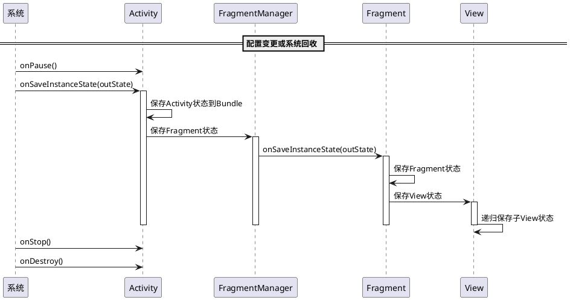

### 2.3 状态恢复流程

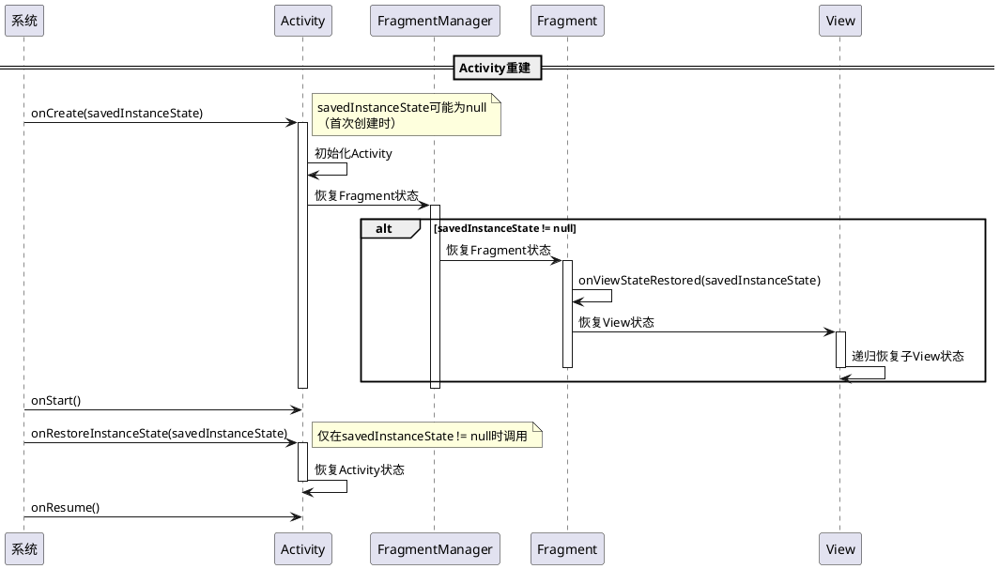

### 2.4 代码示例

```java
public class MainActivity extends AppCompatActivity {
    private static final String KEY_USER_NAME = "user_name";
    private static final String KEY_SCORE = "score";
    
    private String mUserName;
    private int mScore;
    
    @Override
    protected void onCreate(Bundle savedInstanceState) {
        super.onCreate(savedInstanceState);
        setContentView(R.layout.activity_main);
        
        // 恢复状态（方式1：在onCreate中）
        if (savedInstanceState != null) {
            mUserName = savedInstanceState.getString(KEY_USER_NAME);
            mScore = savedInstanceState.getInt(KEY_SCORE, 0);
        } else {
            // 首次创建，初始化默认值
            mUserName = "";
            mScore = 0;
        }
    }
    
    @Override
    protected void onSaveInstanceState(Bundle outState) {
        super.onSaveInstanceState(outState);
        // 保存状态
        outState.putString(KEY_USER_NAME, mUserName);
        outState.putInt(KEY_SCORE, mScore);
    }
    
    @Override
    protected void onRestoreInstanceState(Bundle savedInstanceState) {
        super.onRestoreInstanceState(savedInstanceState);
        // 恢复状态（方式2：在onRestoreInstanceState中）
        // 注意：此时savedInstanceState一定不为null
        mUserName = savedInstanceState.getString(KEY_USER_NAME);
        mScore = savedInstanceState.getInt(KEY_SCORE, 0);
    }
}
```

### 2.5 自动保存的View状态

Android会自动保存和恢复View的以下状态：

- EditText的文本内容
- CheckBox/RadioButton的选中状态
- ScrollView的滚动位置
- ListView/RecyclerView的滚动位置（需要设置id）

```java
// View必须有id才能自动保存状态
<EditText
    android:id="@+id/editText"
    android:layout_width="match_parent"
    android:layout_height="wrap_content" />
```

### 2.6 Bundle savedInstanceState的存储位置和持久化机制

这是一个非常重要的问题：**Bundle savedInstanceState最终保存到哪里？是否做了持久化？**

答案是：**取决于场景，Bundle的存储位置和持久化方式不同。**

#### 2.6.1 两种不同的存储机制

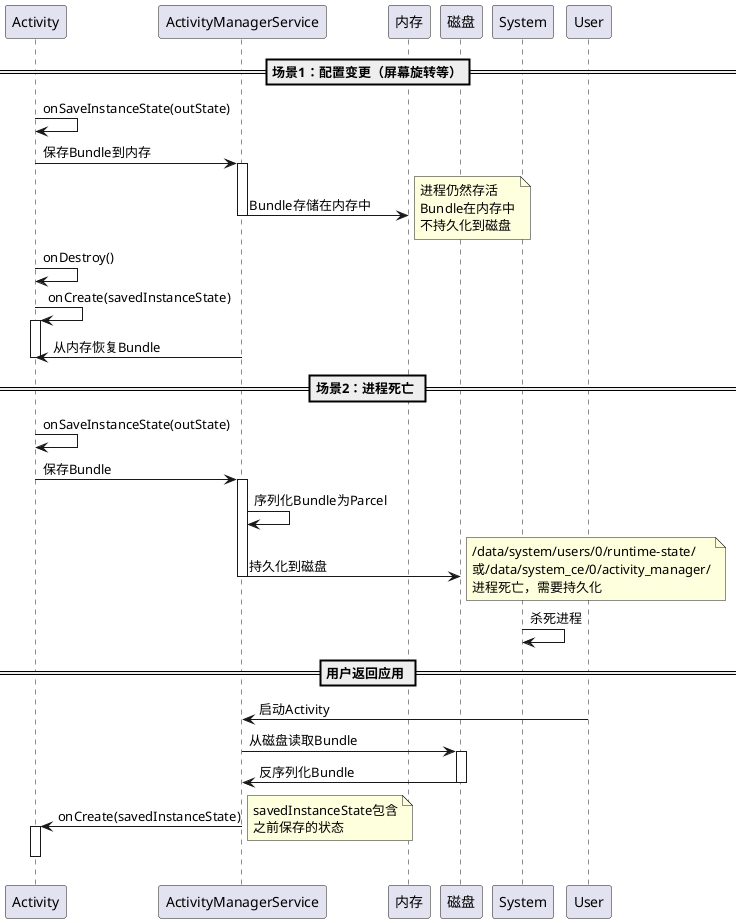

#### 2.6.2 配置变更场景：内存存储

**存储位置**：内存（ActivityManagerService的内存中）

**持久化**：**不持久化**

**特点**：
- Bundle保存在ActivityManagerService（AMS）的内存中
- 进程仍然存活，只是Activity被销毁重建
- 配置变更完成后，Bundle会被清理
- 如果进程被杀死，内存中的Bundle会丢失

**代码流程**：
```java
// 配置变更时
Activity.onSaveInstanceState(outState) 
  → ActivityManagerService.saveInstanceState() 
    → 存储在AMS的内存中（不写磁盘）
    
// Activity重建时
Activity.onCreate(savedInstanceState) 
  → ActivityManagerService.restoreInstanceState() 
    → 从AMS内存中恢复Bundle
```

#### 2.6.3 进程死亡场景：磁盘持久化

**存储位置**：磁盘文件系统

**持久化**：**是，持久化到磁盘**

**存储路径**（不同Android版本可能不同）：
- `/data/system/users/{userId}/runtime-state/`（旧版本）
- `/data/system_ce/{userId}/activity_manager/`（新版本）
- `/data/data/{packageName}/`（应用私有目录，部分场景）

**特点**：
- Bundle被序列化为Parcel格式
- 写入磁盘文件，即使进程死亡也能恢复
- 系统重启后，如果应用被重新启动，可以恢复状态
- 文件会在Activity正常finish后清理

**序列化过程**：
```java
// 进程死亡时
Activity.onSaveInstanceState(outState)
  → ActivityManagerService.saveInstanceState()
    → Bundle.writeToParcel() // 序列化
      → 写入磁盘文件
      
// 进程重启时
Activity.onCreate(savedInstanceState)
  → ActivityManagerService.restoreInstanceState()
    → Parcel.readBundle() // 反序列化
      → 从磁盘文件读取
```

#### 2.6.4 Bundle存储的详细流程

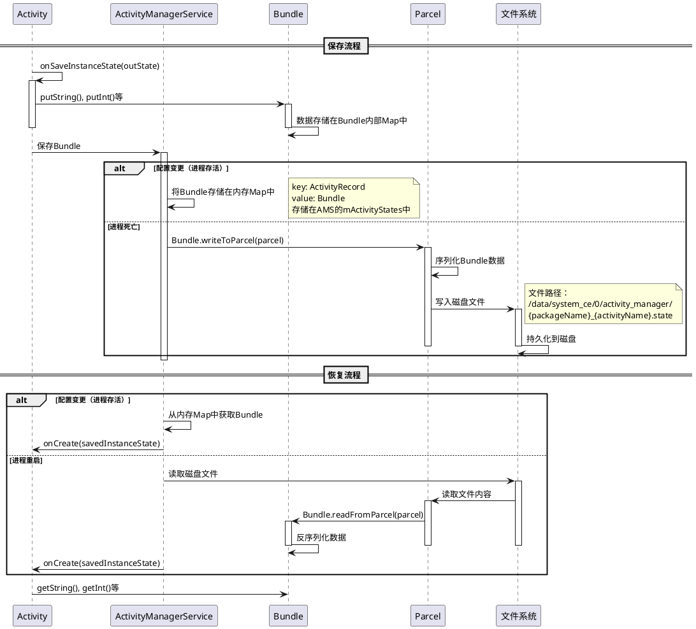

#### 2.6.5 Bundle大小限制

**重要限制**：Bundle有大小限制，通常为**1MB**

- **TransactionTooLargeException**：如果Bundle超过1MB，会抛出此异常
- **原因**：Binder传输有大小限制（通常1MB），Bundle通过Binder传输

**解决方案**：
1. 减少Bundle中的数据量
2. 使用ViewModel + SavedStateHandle（内部使用SharedPreferences）
3. 使用本地存储（SharedPreferences、Room数据库）存储大型数据

#### 2.6.6 验证Bundle存储位置

可以通过以下方式验证Bundle的存储：

**方法1：查看系统日志**
```bash
# 查看ActivityManagerService的日志
adb logcat | grep ActivityManagerService

# 查看Bundle保存和恢复的日志
adb logcat | grep "saveInstanceState\|restoreInstanceState"
```

**方法2：查看磁盘文件**（需要root权限）
```bash
# 查看状态文件（需要root）
adb root
adb shell ls -la /data/system_ce/0/activity_manager/
```

**方法3：代码验证**
```java
@Override
protected void onSaveInstanceState(Bundle outState) {
    super.onSaveInstanceState(outState);
    Log.d(TAG, "Bundle size: " + getBundleSize(outState) + " bytes");
}

private int getBundleSize(Bundle bundle) {
    Parcel parcel = Parcel.obtain();
    bundle.writeToParcel(parcel, 0);
    int size = parcel.dataSize();
    parcel.recycle();
    return size;
}
```

#### 2.6.7 总结对比

| 场景 | 存储位置 | 持久化 | 进程状态 | 恢复时机 |
|------|---------|--------|---------|---------|
| 配置变更 | AMS内存 | 否 | 进程存活 | 立即恢复 |
| 进程死亡 | 磁盘文件 | 是 | 进程死亡 | 进程重启时 |
| 系统重启 | 磁盘文件 | 是 | 进程死亡 | 应用启动时 |

**关键点**：
1. **配置变更**：Bundle在内存中，不持久化，进程存活
2. **进程死亡**：Bundle持久化到磁盘，进程死亡后仍可恢复
3. **大小限制**：Bundle有1MB限制，超过会抛异常
4. **自动管理**：系统自动管理Bundle的保存和恢复，开发者无需关心存储细节

## 3. Fragment状态保存和恢复

### 3.1 Fragment状态保存机制

Fragment的状态保存比Activity更复杂，因为Fragment可以：

1. **通过Activity保存**：Fragment状态保存在Activity的Bundle中
2. **独立保存**：使用`setRetainInstance(true)`保留实例（已废弃）
3. **手动保存**：使用`FragmentManager.saveFragmentInstanceState()`

### 3.2 Fragment状态保存流程

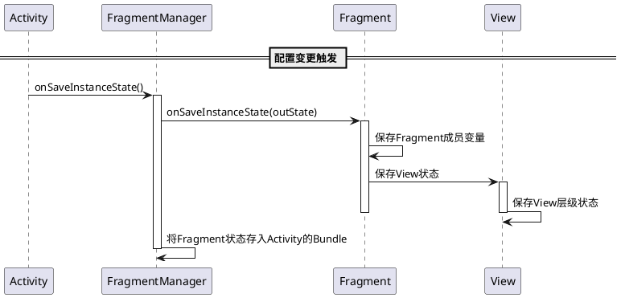

### 3.3 Fragment状态恢复流程

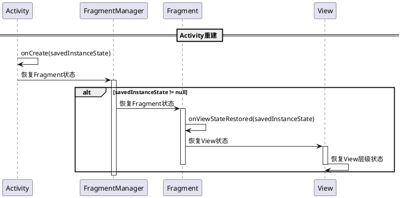

### 3.4 Fragment状态保存代码示例

```java
public class MyFragment extends Fragment {
    private static final String KEY_DATA = "data";
    private String mData;
    
    @Override
    public void onSaveInstanceState(Bundle outState) {
        super.onSaveInstanceState(outState);
        // 保存Fragment状态
        outState.putString(KEY_DATA, mData);
    }
    
    @Override
    public void onViewStateRestored(@Nullable Bundle savedInstanceState) {
        super.onViewStateRestored(savedInstanceState);
        // 恢复Fragment状态
        if (savedInstanceState != null) {
            mData = savedInstanceState.getString(KEY_DATA);
        }
    }
}
```

### 3.5 Fragment状态在进程死亡时的持久化

**重要问题**：Fragment的状态在进程被杀死时是否也做持久化？

**答案**：**是，Fragment的状态会持久化，因为它保存在Activity的Bundle中。**

#### 3.5.1 Fragment状态的存储位置

Fragment的状态保存在Activity的Bundle中，因此：

- **配置变更场景**：Fragment状态随Activity Bundle存储在AMS内存中（不持久化）
- **进程死亡场景**：Fragment状态随Activity Bundle持久化到磁盘

#### 3.5.2 Fragment状态持久化流程

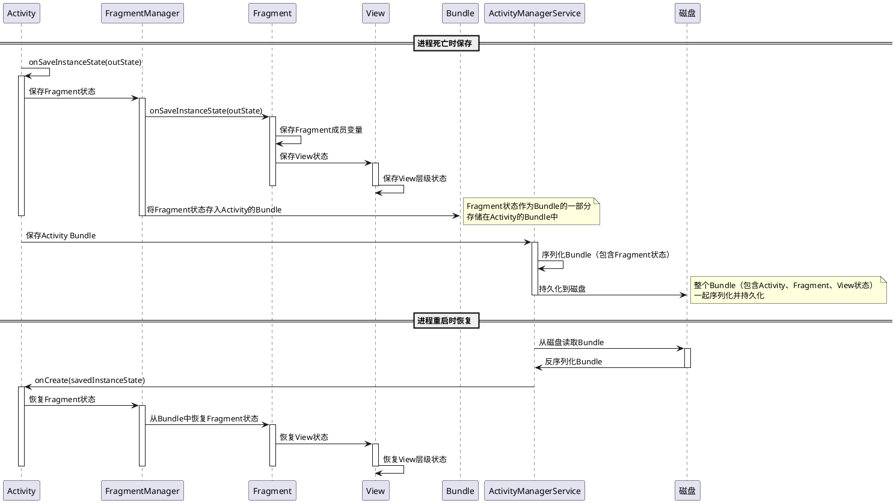

#### 3.5.3 Fragment状态存储结构

Fragment的状态在Activity Bundle中的存储结构：

```
Activity Bundle
  ├── Activity自身状态
  │   ├── KEY_USER_NAME: "John"
  │   └── KEY_SCORE: 100
  ├── Fragment状态（由FragmentManager管理）
  │   ├── android:fragments (FragmentManagerState)
  │   │   ├── Fragment 1状态
  │   │   │   ├── Fragment成员变量
  │   │   │   └── View状态
  │   │   │       ├── View 1状态
  │   │   │       └── View 2状态
  │   │   └── Fragment 2状态
  │   │       └── ...
  │   └── ...
  └── ...
```

#### 3.5.4 代码验证

可以通过以下代码验证Fragment状态是否被保存：

```java
@Override
protected void onSaveInstanceState(Bundle outState) {
    super.onSaveInstanceState(outState);
    
    // 验证Bundle中是否包含Fragment状态
    if (outState.containsKey("android:fragments")) {
        Log.d(TAG, "Fragment状态已保存到Bundle中");
    }
    
    // 查看Bundle大小（包含Fragment和View状态）
    Parcel parcel = Parcel.obtain();
    outState.writeToParcel(parcel, 0);
    int size = parcel.dataSize();
    parcel.recycle();
    Log.d(TAG, "Bundle总大小（包含Fragment状态）: " + size + " bytes");
}
```

#### 3.5.5 总结

| 场景 | Fragment状态存储 | 持久化 | 说明 |
|------|----------------|--------|------|
| 配置变更 | Activity Bundle（内存） | 否 | Fragment状态随Activity Bundle存储在AMS内存 |
| 进程死亡 | Activity Bundle（磁盘） | 是 | Fragment状态随Activity Bundle持久化到磁盘 |
| 系统重启 | Activity Bundle（磁盘） | 是 | Fragment状态随Activity Bundle从磁盘恢复 |

**关键点**：
1. **Fragment状态是Activity Bundle的一部分**：Fragment的状态保存在Activity的Bundle中，不是独立存储
2. **进程死亡时也会持久化**：当Activity的Bundle持久化到磁盘时，Fragment的状态也会一起持久化
3. **View状态也会持久化**：View的状态保存在Fragment的Bundle中，因此也会一起持久化
4. **整体序列化**：Activity、Fragment、View的状态作为一个整体Bundle序列化和持久化

### 3.6 Fragment和View状态如何放入Activity Bundle的实现机制

**核心问题**：Fragment和View的状态是如何放入Activity的Bundle中的？在进程死亡时如何做持久化？

#### 3.6.1 整体流程概述

Fragment和View的状态通过以下层次结构保存到Activity Bundle中：

```
Activity.onSaveInstanceState(outState)
  └── FragmentManager.saveAllState()
      └── 遍历所有Fragment
          └── Fragment.onSaveInstanceState(outState)
              └── View.onSaveInstanceState()
                  └── 递归保存子View状态
```

#### 3.6.2 Fragment状态保存到Activity Bundle的详细流程

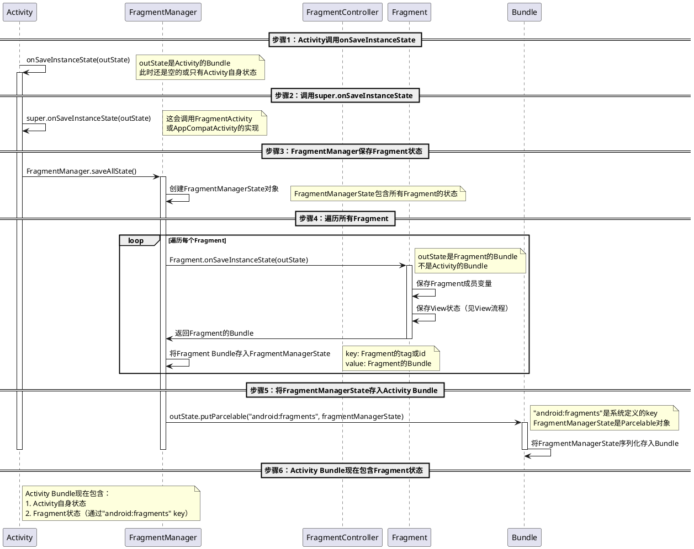

#### 3.6.3 View状态保存到Fragment Bundle的详细流程

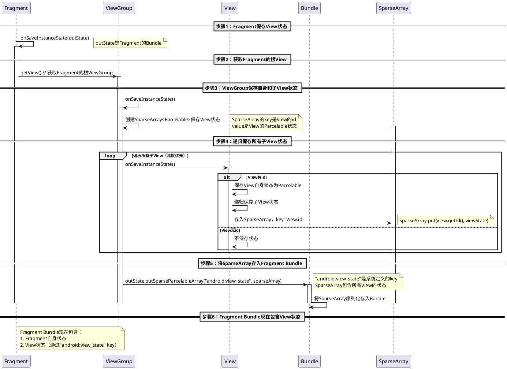

#### 3.6.4 完整的Bundle结构

最终Activity Bundle的完整结构如下：

```
Activity Bundle
├── Activity自身状态
│   ├── KEY_USER_NAME: "John" (String)
│   ├── KEY_SCORE: 100 (int)
│   └── ... (开发者自定义的状态)
│
└── "android:fragments" (FragmentManagerState - Parcelable)
    └── mActive (ArrayList<FragmentState>)
        └── Fragment 1状态 (FragmentState)
            ├── mClassName: "com.example.MyFragment"
            ├── mTag: "fragment_tag"
            ├── mBundle (Fragment的Bundle)
            │   ├── Fragment自身状态
            │   │   ├── KEY_DATA: "data" (String)
            │   │   └── ... (Fragment自定义状态)
            │   │
            │   └── "android:view_state" (SparseArray<Parcelable>)
            │       ├── key: R.id.view1
            │       │   └── value: View1的Parcelable状态
            │       │       ├── View1自身状态
            │       │       └── 子View状态（递归结构）
            │       ├── key: R.id.view2
            │       │   └── value: View2的Parcelable状态
            │       └── ...
            └── Fragment 2状态
                └── ... (同样的结构)
```

#### 3.6.5 进程死亡时的持久化流程

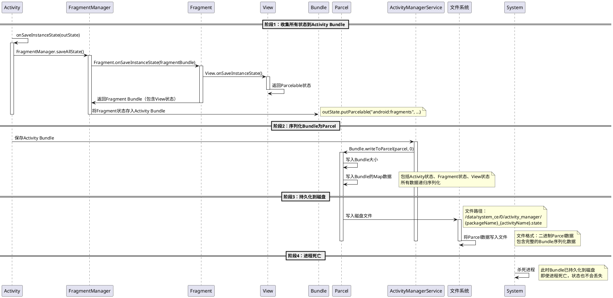

#### 3.6.6 进程重启时的恢复流程

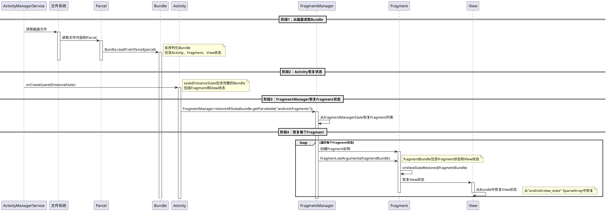

#### 3.6.7 关键代码实现（基于Android源码逻辑）

**FragmentManager保存Fragment状态**：
```java
// FragmentManager.java (简化版)
public FragmentManagerState saveAllState() {
    FragmentManagerState fms = new FragmentManagerState();
    ArrayList<FragmentState> active = new ArrayList<>();
    
    // 遍历所有Fragment
    for (Fragment f : mActive.values()) {
        if (f != null) {
            FragmentState fs = new FragmentState(f);
            Bundle fragmentBundle = new Bundle();
            
            // 调用Fragment的onSaveInstanceState
            f.onSaveInstanceState(fragmentBundle);
            
            // 保存View状态到Fragment Bundle
            if (f.mView != null) {
                SparseArray<Parcelable> viewState = new SparseArray<>();
                f.mView.saveHierarchyState(viewState);
                fragmentBundle.putSparseParcelableArray("android:view_state", viewState);
            }
            
            fs.mBundle = fragmentBundle;
            active.add(fs);
        }
    }
    
    fms.mActive = active;
    return fms;
}
```

**View保存状态**：
```java
// View.java (简化版)
public void saveHierarchyState(SparseArray<Parcelable> container) {
    dispatchSaveInstanceState(container);
}

protected void dispatchSaveInstanceState(SparseArray<Parcelable> container) {
    if (mID != NO_ID) {
        // 保存View自身状态
        Parcelable state = onSaveInstanceState();
        if (state != null) {
            container.put(mID, state);
        }
    }
    
    // 递归保存子View状态
    if (this instanceof ViewGroup) {
        ViewGroup vg = (ViewGroup) this;
        for (int i = 0; i < vg.getChildCount(); i++) {
            vg.getChildAt(i).saveHierarchyState(container);
        }
    }
}
```

**ActivityManagerService持久化**：
```java
// ActivityManagerService.java (简化版)
void saveInstanceState(ActivityRecord r, Bundle outState) {
    if (outState != null) {
        // 序列化Bundle为Parcel
        Parcel parcel = Parcel.obtain();
        outState.writeToParcel(parcel, 0);
        
        // 持久化到磁盘
        String fileName = r.packageName + "_" + r.shortComponentName + ".state";
        File stateFile = new File("/data/system_ce/0/activity_manager/", fileName);
        FileOutputStream fos = new FileOutputStream(stateFile);
        fos.write(parcel.marshall());
        fos.close();
        
        parcel.recycle();
    }
}
```

#### 3.6.8 总结

**Fragment和View状态如何放入Activity Bundle**：

1. **Fragment状态**：
   - FragmentManager调用每个Fragment的`onSaveInstanceState()`
   - Fragment状态保存到Fragment的Bundle中
   - FragmentManager将Fragment Bundle存入FragmentManagerState
   - FragmentManagerState作为Parcelable存入Activity Bundle（key: "android:fragments"）

2. **View状态**：
   - View的`saveHierarchyState()`递归保存所有View状态
   - View状态保存为Parcelable对象，存入SparseArray（key: View.id）
   - SparseArray存入Fragment Bundle（key: "android:view_state"）
   - Fragment Bundle包含在FragmentManagerState中

3. **持久化过程**：
   - Activity Bundle（包含Fragment和View状态）序列化为Parcel
   - Parcel数据写入磁盘文件
   - 进程死亡后，状态仍然保存在磁盘上

4. **恢复过程**：
   - 从磁盘读取Parcel数据
   - 反序列化为Activity Bundle
   - FragmentManager从Bundle中恢复Fragment状态
   - Fragment从Bundle中恢复View状态

**关键点**：
- Fragment状态通过FragmentManager统一管理，存入Activity Bundle
- View状态通过SparseArray存储，key是View的id
- 整个Bundle作为一个整体序列化和持久化
- 系统使用预定义的key（"android:fragments"、"android:view_state"）来组织状态

### 3.7 Bundle内部数据结构详解

**核心问题**：Bundle里面保存Activity、Fragment、View的数据结构是怎么样的？

#### 3.7.1 Bundle的内部数据结构

Bundle本质上是一个**键值对（Key-Value）映射**，内部使用`ArrayMap<String, Object>`存储数据。

**Bundle内部结构**：
```java
// Bundle.java (简化版)
public class Bundle implements Parcelable {
    // 内部使用ArrayMap存储键值对
    ArrayMap<String, Object> mMap;
    
    // 存储不同类型的数据
    public void putString(String key, String value) {
        mMap.put(key, value);
    }
    
    public void putInt(String key, int value) {
        mMap.put(key, value);
    }
    
    public void putParcelable(String key, Parcelable value) {
        mMap.put(key, value);
    }
    
    public void putBundle(String key, Bundle value) {
        mMap.put(key, value);
    }
    
    // ... 其他put方法
}
```

#### 3.7.2 Bundle中Activity、Fragment、View的完整数据结构

完整的Activity Bundle数据结构如下：

```
Bundle (Activity Bundle)
│
├── ArrayMap<String, Object> mMap
│   │
│   ├── Entry 1: "user_name" → String("John")
│   │   ├── key: "user_name" (String)
│   │   └── value: "John" (String)
│   │
│   ├── Entry 2: "score" → Integer(100)
│   │   ├── key: "score" (String)
│   │   └── value: 100 (Integer)
│   │
│   ├── Entry 3: "android:fragments" → FragmentManagerState (Parcelable)
│   │   ├── key: "android:fragments" (String)
│   │   └── value: FragmentManagerState (Parcelable)
│   │       │
│   │       └── FragmentManagerState内部结构
│   │           ├── mActive: ArrayList<FragmentState>
│   │           │   │
│   │           │   ├── FragmentState[0]
│   │           │   │   ├── mClassName: String("com.example.MyFragment")
│   │           │   │   ├── mTag: String("fragment_tag")
│   │           │   │   ├── mId: int(R.id.fragment_container)
│   │           │   │   ├── mBundle: Bundle (Fragment的Bundle)
│   │           │   │   │   │
│   │           │   │   │   └── ArrayMap<String, Object> mMap
│   │           │   │   │       │
│   │           │   │   │       ├── Entry 1: "data" → String("fragment_data")
│   │           │   │   │       │   ├── key: "data" (String)
│   │           │   │   │       │   └── value: "fragment_data" (String)
│   │           │   │   │       │
│   │           │   │   │       ├── Entry 2: "android:view_state" → SparseArray<Parcelable>
│   │           │   │   │       │   ├── key: "android:view_state" (String)
│   │           │   │   │       │   └── value: SparseArray<Parcelable>
│   │           │   │   │       │       │
│   │           │   │   │       │       └── SparseArray内部结构
│   │           │   │   │       │           ├── int[] mKeys (View的id数组)
│   │           │   │   │       │           │   ├── mKeys[0] = R.id.view1
│   │           │   │   │       │           │   ├── mKeys[1] = R.id.view2
│   │           │   │   │       │           │   └── ...
│   │           │   │   │       │           │
│   │           │   │   │       │           └── Object[] mValues (View状态数组)
│   │           │   │   │       │               ├── mValues[0] = View1SavedState (Parcelable)
│   │           │   │   │       │               │   ├── mText: String("EditText content")
│   │           │   │   │       │               │   ├── mSelectionStart: int(5)
│   │           │   │   │       │               │   ├── mSelectionEnd: int(10)
│   │           │   │   │       │               │   └── ... (View自身状态)
│   │           │   │   │       │               │
│   │           │   │   │       │               ├── mValues[1] = View2SavedState (Parcelable)
│   │           │   │   │       │               │   ├── mChecked: boolean(true)
│   │           │   │   │       │               │   └── ... (CheckBox状态)
│   │           │   │   │       │               │
│   │           │   │   │       │               └── ...
│   │           │   │   │       │
│   │           │   │   │       └── ... (Fragment其他状态)
│   │           │   │   │
│   │           │   │   └── ... (FragmentState其他字段)
│   │           │   │
│   │           │   └── FragmentState[1]
│   │           │       └── ... (同样的结构)
│   │           │
│   │           └── ... (FragmentManagerState其他字段)
│   │
│   └── ... (Activity其他状态)
```

#### 3.7.3 数据类型的存储方式

Bundle支持多种数据类型的存储，每种类型在Bundle中的存储方式如下：

| 数据类型 | 存储方式 | 示例 |
|---------|---------|------|
| **String** | 直接存储String对象 | `mMap.put("key", "value")` |
| **int** | 存储为Integer对象 | `mMap.put("key", Integer.valueOf(100))` |
| **boolean** | 存储为Boolean对象 | `mMap.put("key", Boolean.valueOf(true))` |
| **Parcelable** | 存储Parcelable对象（需要实现Parcelable接口） | `mMap.put("key", fragmentManagerState)` |
| **Bundle** | 存储Bundle对象（嵌套结构） | `mMap.put("key", fragmentBundle)` |
| **SparseArray** | 存储SparseArray对象 | `mMap.put("key", sparseArray)` |
| **ArrayList** | 存储ArrayList对象 | `mMap.put("key", arrayList)` |

#### 3.7.4 FragmentManagerState的数据结构

FragmentManagerState是系统定义的Parcelable类，用于管理所有Fragment的状态：

```java
// FragmentManagerState.java (简化版)
public class FragmentManagerState implements Parcelable {
    // Fragment列表
    ArrayList<FragmentState> mActive;
    
    // Fragment回退栈
    ArrayList<String> mBackStack;
    
    // 其他状态
    int mPrimaryNavActiveWho;
    
    // ... 其他字段
}
```

#### 3.7.5 FragmentState的数据结构

FragmentState存储单个Fragment的状态：

```java
// FragmentState.java (简化版)
public class FragmentState implements Parcelable {
    // Fragment类名
    String mClassName;
    
    // Fragment的tag
    String mTag;
    
    // Fragment的id
    int mId;
    
    // Fragment的Bundle（包含Fragment状态和View状态）
    Bundle mBundle;
    
    // Fragment是否隐藏
    boolean mHidden;
    
    // Fragment的实例ID
    int mFragmentId;
    
    // ... 其他字段
}
```

#### 3.7.6 SparseArray的数据结构

SparseArray用于存储View状态，key是View的id（int类型），value是View的Parcelable状态：

```java
// SparseArray.java (简化版)
public class SparseArray<E> {
    // View的id数组（有序）
    int[] mKeys;
    
    // View状态数组（与mKeys一一对应）
    Object[] mValues;
    
    // 数组大小
    int mSize;
    
    // 存储View状态
    public void put(int key, E value) {
        // 二分查找插入位置
        int i = ContainerHelpers.binarySearch(mKeys, mSize, key);
        
        if (i >= 0) {
            // key已存在，更新value
            mValues[i] = value;
        } else {
            // key不存在，插入新值
            i = ~i;
            // 扩容和插入逻辑
            mKeys = GrowingArrayUtils.insert(mKeys, mSize, i, key);
            mValues = GrowingArrayUtils.insert(mValues, mSize, i, value);
            mSize++;
        }
    }
    
    // 获取View状态
    public E get(int key) {
        int i = ContainerHelpers.binarySearch(mKeys, mSize, key);
        if (i < 0) {
            return null;
        }
        return (E) mValues[i];
    }
}
```

#### 3.7.7 View状态的数据结构

View的状态保存为Parcelable对象，不同类型的View有不同的状态结构：

**EditText的状态**：
```java
// AbsSavedState.java (EditText的基类)
public class AbsSavedState extends BaseSavedState {
    // 文本内容
    CharSequence mText;
    
    // 选中文本的起始位置
    int mSelectionStart;
    
    // 选中文本的结束位置
    int mSelectionEnd;
    
    // 光标位置
    int mCursorPosition;
    
    // ... 其他字段
}
```

**CheckBox的状态**：
```java
// CompoundButton.SavedState.java
public class SavedState extends BaseSavedState {
    // 是否选中
    boolean mChecked;
    
    // ... 其他字段
}
```

**ScrollView的状态**：
```java
// ScrollView.SavedState.java
public class SavedState extends BaseSavedState {
    // 滚动位置
    int mScrollPosition;
    
    // ... 其他字段
}
```

#### 3.7.8 Bundle序列化后的数据结构

当Bundle序列化为Parcel时，数据结构如下：

```
Parcel (二进制数据)
│
├── Bundle大小 (int, 4字节)
│
├── Bundle数据
│   │
│   ├── Map大小 (int, 4字节)
│   │
│   ├── Entry 1: "user_name"
│   │   ├── Key类型 (byte, 1字节) = STRING_VAL
│   │   ├── Key长度 (int, 4字节)
│   │   ├── Key数据 ("user_name"的UTF-8字节)
│   │   ├── Value类型 (byte, 1字节) = STRING_VAL
│   │   ├── Value长度 (int, 4字节)
│   │   └── Value数据 ("John"的UTF-8字节)
│   │
│   ├── Entry 2: "score"
│   │   ├── Key类型 (byte) = STRING_VAL
│   │   ├── Key数据 ("score")
│   │   ├── Value类型 (byte) = INT_VAL
│   │   └── Value数据 (100的4字节int)
│   │
│   ├── Entry 3: "android:fragments"
│   │   ├── Key类型 (byte) = STRING_VAL
│   │   ├── Key数据 ("android:fragments")
│   │   ├── Value类型 (byte) = PARCELABLE_VAL
│   │   ├── 类名长度 (int)
│   │   ├── 类名数据 ("androidx.fragment.app.FragmentManagerState")
│   │   └── Parcelable数据
│   │       │
│   │       └── FragmentManagerState序列化数据
│   │           ├── mActive大小 (int)
│   │           ├── FragmentState[0]序列化数据
│   │           │   ├── mClassName (String)
│   │           │   ├── mTag (String)
│   │           │   ├── mId (int)
│   │           │   └── mBundle (Bundle序列化数据)
│   │           │       │
│   │           │       └── Fragment Bundle序列化数据
│   │           │           ├── Map大小
│   │           │           ├── Entry: "data" → String
│   │           │           └── Entry: "android:view_state" → SparseArray
│   │           │               │
│   │           │               └── SparseArray序列化数据
│   │           │                   ├── 数组大小 (int)
│   │           │                   ├── Key数组 (int[])
│   │           │                   └── Value数组 (Parcelable[])
│   │           │                       │
│   │           │                       └── View1SavedState序列化数据
│   │           │                           ├── 类名
│   │           │                           └── View状态数据
│   │           │
│   │           └── ... (其他FragmentState)
│   │
│   └── ... (其他Entry)
```

#### 3.7.9 数据结构可视化

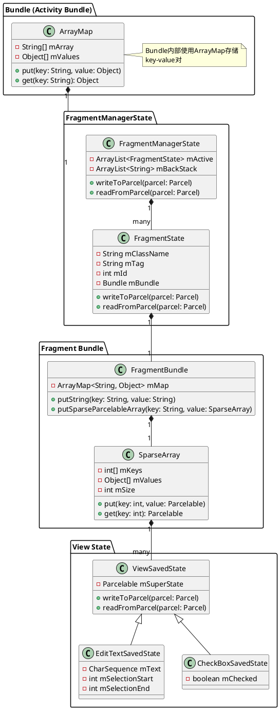

#### 3.7.10 总结

**Bundle的数据结构特点**：

1. **键值对映射**：Bundle使用ArrayMap存储键值对，key是String类型，value可以是多种类型
2. **嵌套结构**：Bundle可以嵌套存储Bundle，形成层次结构
3. **Parcelable支持**：复杂对象（如FragmentManagerState、View状态）实现Parcelable接口进行序列化
4. **SparseArray优化**：View状态使用SparseArray存储，key是View的id（int），value是Parcelable状态
5. **类型标识**：序列化时，每个值都有类型标识（byte），用于反序列化时识别数据类型

**关键点**：
- Bundle内部使用ArrayMap<String, Object>存储数据
- Fragment状态通过FragmentManagerState管理，存储在Activity Bundle的"android:fragments" key下
- View状态通过SparseArray存储，key是View的id，存储在Fragment Bundle的"android:view_state" key下
- 所有数据最终序列化为Parcel格式，持久化到磁盘

### 3.8 Fragment实例保存（已废弃）

`setRetainInstance(true)`在Android P（API 28）后已废弃，不推荐使用。

**废弃原因**：
- 与ViewModel功能重复
- 容易导致内存泄漏
- 生命周期管理复杂

**替代方案**：使用ViewModel + SavedStateHandle

## 4. View状态保存和恢复

### 4.1 View状态保存机制

View的状态保存是自动的，但需要满足条件：

1. **View必须有id**：没有id的View不会保存状态
2. **实现onSaveInstanceState()**：自定义View需要实现此方法
3. **实现onRestoreInstanceState()**：自定义View需要实现此方法

### 4.1.1 View状态在进程死亡时的持久化

**重要问题**：View的状态在进程被杀死时是否也做持久化？

**答案**：**是，View的状态会持久化，因为它保存在Fragment/Activity的Bundle中。**

#### View状态的存储位置

View的状态保存在Fragment或Activity的Bundle中，因此：

- **配置变更场景**：View状态随Fragment/Activity Bundle存储在AMS内存中（不持久化）
- **进程死亡场景**：View状态随Fragment/Activity Bundle持久化到磁盘

#### View状态持久化流程

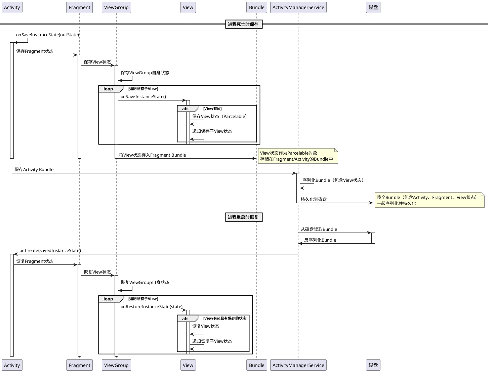

#### View状态存储结构

View的状态在Bundle中的存储结构：

```
Activity Bundle
  └── Fragment Bundle
      └── View状态（Parcelable）
          ├── View ID: R.id.view1
          │   ├── View自身状态
          │   └── 子View状态
          │       ├── View ID: R.id.child1
          │       │   └── 子View状态
          │       └── View ID: R.id.child2
          │           └── 子View状态
          └── View ID: R.id.view2
              └── View状态
```

#### 自动保存的View状态

以下View的状态会自动保存和恢复（需要设置id）：

- **EditText**：文本内容、光标位置、选中文本
- **CheckBox/RadioButton**：选中状态
- **Switch**：开关状态
- **ScrollView**：滚动位置
- **ListView/RecyclerView**：滚动位置（需要设置id）
- **SeekBar**：进度值
- **Spinner**：选中项

#### 总结

| 场景 | View状态存储 | 持久化 | 说明 |
|------|------------|--------|------|
| 配置变更 | Fragment/Activity Bundle（内存） | 否 | View状态随Bundle存储在AMS内存 |
| 进程死亡 | Fragment/Activity Bundle（磁盘） | 是 | View状态随Bundle持久化到磁盘 |
| 系统重启 | Fragment/Activity Bundle（磁盘） | 是 | View状态随Bundle从磁盘恢复 |

**关键点**：
1. **View状态是Bundle的一部分**：View的状态保存在Fragment或Activity的Bundle中
2. **进程死亡时也会持久化**：当Bundle持久化到磁盘时，View的状态也会一起持久化
3. **需要View有id**：没有id的View不会保存状态
4. **整体序列化**：Activity、Fragment、View的状态作为一个整体Bundle序列化和持久化

### 4.2 View状态保存流程

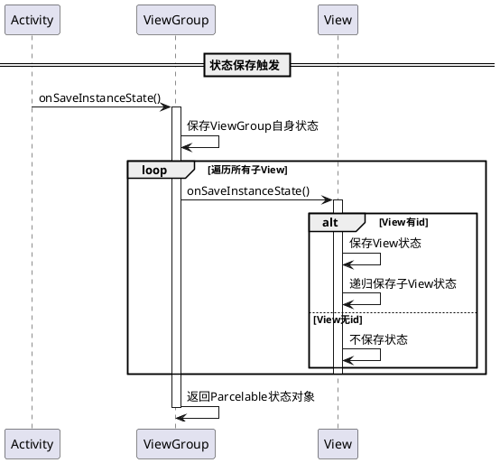

### 4.3 自定义View状态保存示例

```java
public class CustomView extends View {
    private static final String KEY_CUSTOM_STATE = "custom_state";
    private int mCustomState;
    
    public CustomView(Context context, AttributeSet attrs) {
        super(context, attrs);
    }
    
    @Override
    public Parcelable onSaveInstanceState() {
        Parcelable superState = super.onSaveInstanceState();
        SavedState ss = new SavedState(superState);
        ss.customState = mCustomState;
        return ss;
    }
    
    @Override
    public void onRestoreInstanceState(Parcelable state) {
        SavedState ss = (SavedState) state;
        super.onRestoreInstanceState(ss.getSuperState());
        mCustomState = ss.customState;
    }
    
    static class SavedState extends BaseSavedState {
        int customState;
        
        SavedState(Parcelable superState) {
            super(superState);
        }
        
        private SavedState(Parcel in) {
            super(in);
            customState = in.readInt();
        }
        
        @Override
        public void writeToParcel(Parcel out, int flags) {
            super.writeToParcel(out, flags);
            out.writeInt(customState);
        }
        
        public static final Parcelable.Creator<SavedState> CREATOR =
            new Parcelable.Creator<SavedState>() {
                public SavedState createFromParcel(Parcel in) {
                    return new SavedState(in);
                }
                
                public SavedState[] newArray(int size) {
                    return new SavedState[size];
                }
            };
    }
}
```

## 5. 配置变更处理

### 5.1 配置变更场景

配置变更会触发Activity重建，常见场景包括：

- 屏幕旋转（orientation）
- 语言切换（locale）
- 键盘弹出/隐藏（keyboardHidden）
- 屏幕密度变化（screenSize）
- 夜间模式切换（uiMode）

### 5.2 配置变更处理方式

#### 方式1：允许重建（默认）

系统自动保存和恢复状态，Activity重建。

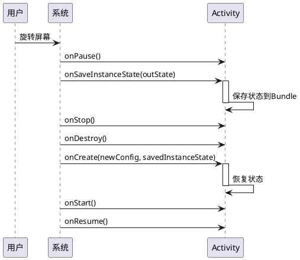

#### 方式2：手动处理配置变更

在AndroidManifest.xml中声明`android:configChanges`，手动处理配置变更。

```xml
<activity
    android:name=".MainActivity"
    android:configChanges="orientation|screenSize|keyboardHidden" />
```

```java
@Override
public void onConfigurationChanged(Configuration newConfig) {
    super.onConfigurationChanged(newConfig);
    // 手动处理配置变更，Activity不会重建
    if (newConfig.orientation == Configuration.ORIENTATION_LANDSCAPE) {
        // 横屏处理
    } else {
        // 竖屏处理
    }
}
```

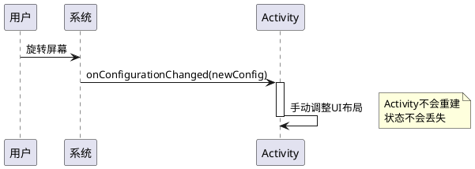

### 5.3 配置变更对比

| 处理方式 | Activity重建 | 状态保存 | 适用场景 |
|---------|------------|---------|---------|
| 允许重建（默认） | 是 | 自动 | 大多数场景 |
| 手动处理 | 否 | 不需要 | 视频播放、游戏等 |

## 6. 进程死亡和恢复

### 6.1 进程死亡场景

当系统内存不足时，可能会杀死后台进程。进程死亡后，Activity实例被销毁，但系统会保存状态Bundle。

### 6.2 进程死亡恢复流程

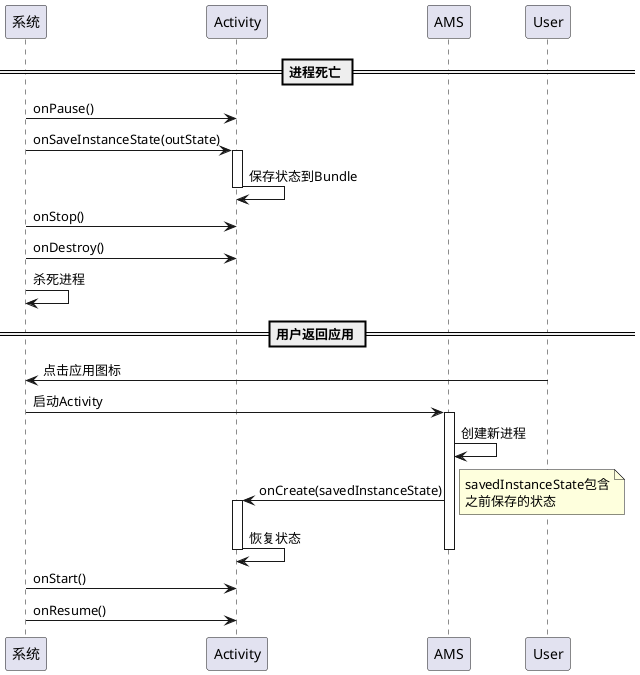

### 6.3 SavedStateHandle（推荐方案）

ViewModel + SavedStateHandle是处理进程死亡恢复的推荐方案。

```java
public class MainViewModel extends ViewModel {
    private SavedStateHandle mSavedStateHandle;
    
    public MainViewModel(SavedStateHandle savedStateHandle) {
        mSavedStateHandle = savedStateHandle;
    }
    
    public LiveData<String> getUserName() {
        return mSavedStateHandle.getLiveData("user_name", "");
    }
    
    public void setUserName(String name) {
        mSavedStateHandle.set("user_name", name);
    }
}
```

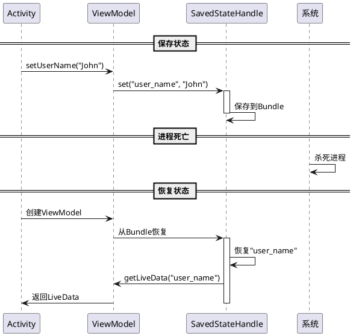

## 7. 状态保存的最佳实践

### 7.1 应该保存的状态

- 用户输入的数据（EditText、CheckBox等）
- UI状态（滚动位置、选中项等）
- 临时状态（对话框显示状态等）

### 7.2 不应该保存的状态

- 大型对象（图片、文件等）
- 数据库连接、网络连接
- 静态变量
- 单例对象

### 7.3 状态保存大小限制

Bundle有大小限制（通常为1MB），超过限制会导致`TransactionTooLargeException`。

**解决方案**：
1. 使用ViewModel + SavedStateHandle
2. 使用本地存储（SharedPreferences、数据库）
3. 只保存必要的轻量级数据

### 7.4 代码示例：正确的状态保存

```java
public class MainActivity extends AppCompatActivity {
    // 应该保存：用户输入
    private String mUserName;
    private boolean mIsChecked;
    
    // 不应该保存：大型对象
    private Bitmap mLargeImage; // 错误：不应该保存
    
    // 应该使用ViewModel保存：复杂状态
    private MainViewModel mViewModel;
    
    @Override
    protected void onCreate(Bundle savedInstanceState) {
        super.onCreate(savedInstanceState);
        setContentView(R.layout.activity_main);
        
        mViewModel = new ViewModelProvider(this).get(MainViewModel.class);
        
        if (savedInstanceState != null) {
            mUserName = savedInstanceState.getString("user_name");
            mIsChecked = savedInstanceState.getBoolean("is_checked", false);
        }
    }
    
    @Override
    protected void onSaveInstanceState(Bundle outState) {
        super.onSaveInstanceState(outState);
        // 只保存轻量级数据
        outState.putString("user_name", mUserName);
        outState.putBoolean("is_checked", mIsChecked);
        // 大型对象使用ViewModel或本地存储
    }
}
```

## 8. 常见问题和解决方案

### 8.1 问题1：EditText内容丢失

**原因**：EditText没有设置id

**解决方案**：给EditText设置id

```xml
<EditText
    android:id="@+id/editText"
    android:layout_width="match_parent"
    android:layout_height="wrap_content" />
```

### 8.2 问题2：Fragment状态丢失

**原因**：Fragment没有正确保存状态

**解决方案**：确保Fragment实现了onSaveInstanceState

```java
@Override
public void onSaveInstanceState(Bundle outState) {
    super.onSaveInstanceState(outState);
    outState.putString("key", mData);
}
```

### 8.3 问题3：TransactionTooLargeException

**原因**：Bundle数据过大（超过1MB）

**解决方案**：
1. 减少保存的数据量
2. 使用ViewModel + SavedStateHandle
3. 使用本地存储（SharedPreferences、Room数据库）

### 8.4 问题4：自定义View状态不保存

**原因**：自定义View没有实现onSaveInstanceState

**解决方案**：实现onSaveInstanceState和onRestoreInstanceState

## 9. 项目中的实际应用

### 9.1 DefaultActivity状态保存

项目中`DefaultActivity`实现了状态保存：

```284:289:src/com/android/provision/activities/DefaultActivity.java
    @Override
    protected void onSaveInstanceState(Bundle outState) {
        super.onSaveInstanceState(outState);
        if (mStateMachine != null) {
            outState.putBoolean(STATE_ENTER_CURRENTSTATE, mStateMachine.mCurrentState instanceof StartupState);
        }
    }
```

### 9.2 Fragment状态保存

项目中`StartupState`使用`FragmentManager.saveFragmentInstanceState()`保存Fragment状态：

```660:669:src/com/android/provision/activities/DefaultActivity.java
        @Override
        public void onLeave() {
            DefaultActivity defaultActivity = (DefaultActivity) context;
            FragmentManager fragmentManager = defaultActivity.getSupportFragmentManager();
            Fragment fragment = fragmentManager.findFragmentByTag(StartupFragment.class.getSimpleName());
            if (fragment != null) {
                savedState = fragmentManager.saveFragmentInstanceState(fragment);
            }
            cancelShutdownTask();
        }
```

### 9.3 状态机状态持久化

项目使用SharedPreferences持久化状态机状态，这是进程死亡恢复的补充方案：

```2516:2529:src/com/android/provision/activities/DefaultActivity.java
        private void saveState() {
            SharedPreferences preferences = mContext.getSharedPreferences(Utils.PREF_STATE, Context.MODE_PRIVATE);
            Editor editor = preferences.edit();
            editor.clear();

            for (int i = 0; i < mStateStack.size(); ++i) {
                Log.w(TAG, " saveState is " + mStateStack.get(i).getClass().getSimpleName());
                editor.putString(KEY_STATE_PREFIX + i, mStateStack.get(i).getClass().getSimpleName());
            }
            if (!(mCurrentState instanceof EsimDateState)) {
                editor.putString(KEY_STATE_PREFIX + mStateStack.size(), mCurrentState.getClass().getSimpleName());
            }
            editor.apply();
        }
```

## 10. 总结

### 10.1 状态保存层次

1. **Activity层**：使用`onSaveInstanceState`保存Activity状态
2. **Fragment层**：使用`onSaveInstanceState`保存Fragment状态
3. **View层**：自动保存（需要id）或手动实现`onSaveInstanceState`
4. **持久化层**：使用SharedPreferences、数据库等持久化重要状态

### 10.2 最佳实践总结

1. **轻量级数据**：使用Bundle保存
2. **复杂状态**：使用ViewModel + SavedStateHandle
3. **持久化数据**：使用SharedPreferences、Room数据库
4. **大型对象**：使用文件存储，Bundle中只保存路径
5. **View状态**：确保View有id，系统会自动保存

### 10.3 状态保存流程图

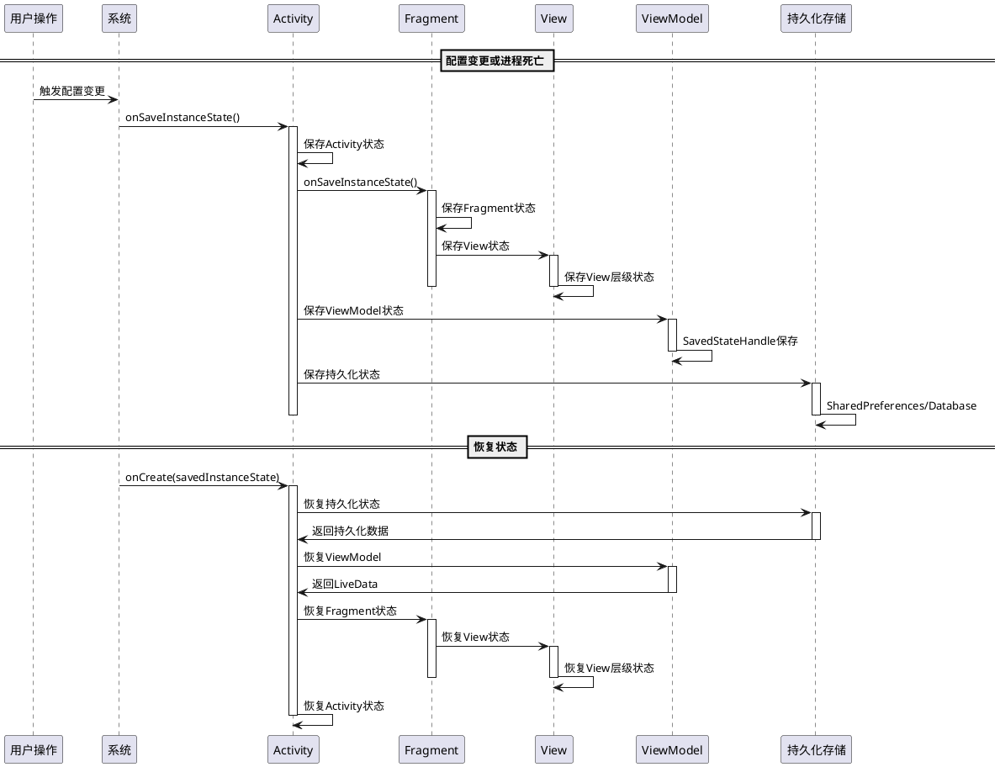

## 11. 参考资料

- [Android官方文档 - 保存和恢复Activity状态](https://developer.android.com/guide/components/activities/activity-lifecycle#saving-state)
- [Android官方文档 - Fragment生命周期](https://developer.android.com/guide/fragments/lifecycle)
- [Android官方文档 - ViewModel和SavedState](https://developer.android.com/topic/libraries/architecture/viewmodel-savedstate)
- [Android官方文档 - 处理配置变更](https://developer.android.com/guide/topics/resources/runtime-changes)
