# Settings中Preference实现界面机制原理详解

## 目录

1. [概述](#概述)
2. [Preference架构设计](#preference架构设计)
3. [Preference类层次结构](#preference类层次结构)
4. [PreferenceFragment工作流程](#preferencefragment工作流程)
5. [XML配置机制](#xml配置机制)
6. [View绑定机制](#view绑定机制)
7. [事件处理机制](#事件处理机制)
8. [数据持久化机制](#数据持久化机制)
9. [自定义Preference实现](#自定义preference实现)
10. [最佳实践](#最佳实践)
11. [总结](#总结)

---

## 概述

Preference是Android Settings应用中用于构建设置界面的核心框架。它提供了一种声明式的方式来定义设置项，自动处理数据持久化、UI渲染和用户交互。本文档详细解析Preference框架的实现机制和工作原理。

### 核心特性

- **声明式配置**：通过XML文件定义设置项，无需手动编写大量UI代码
- **自动数据持久化**：自动将设置值保存到SharedPreferences
- **统一UI风格**：自动应用系统主题和样式
- **生命周期管理**：与Fragment生命周期自动同步
- **事件回调**：提供丰富的回调接口处理用户交互

### 核心组件

1. **Preference**：设置项的基础抽象类
2. **PreferenceFragment**：承载Preference的Fragment容器
3. **PreferenceScreen**：Preference的根容器
4. **PreferenceCategory**：Preference的分组容器
5. **PreferenceManager**：管理Preference的SharedPreferences和生命周期

---

## Preference架构设计

### 系统架构组件图

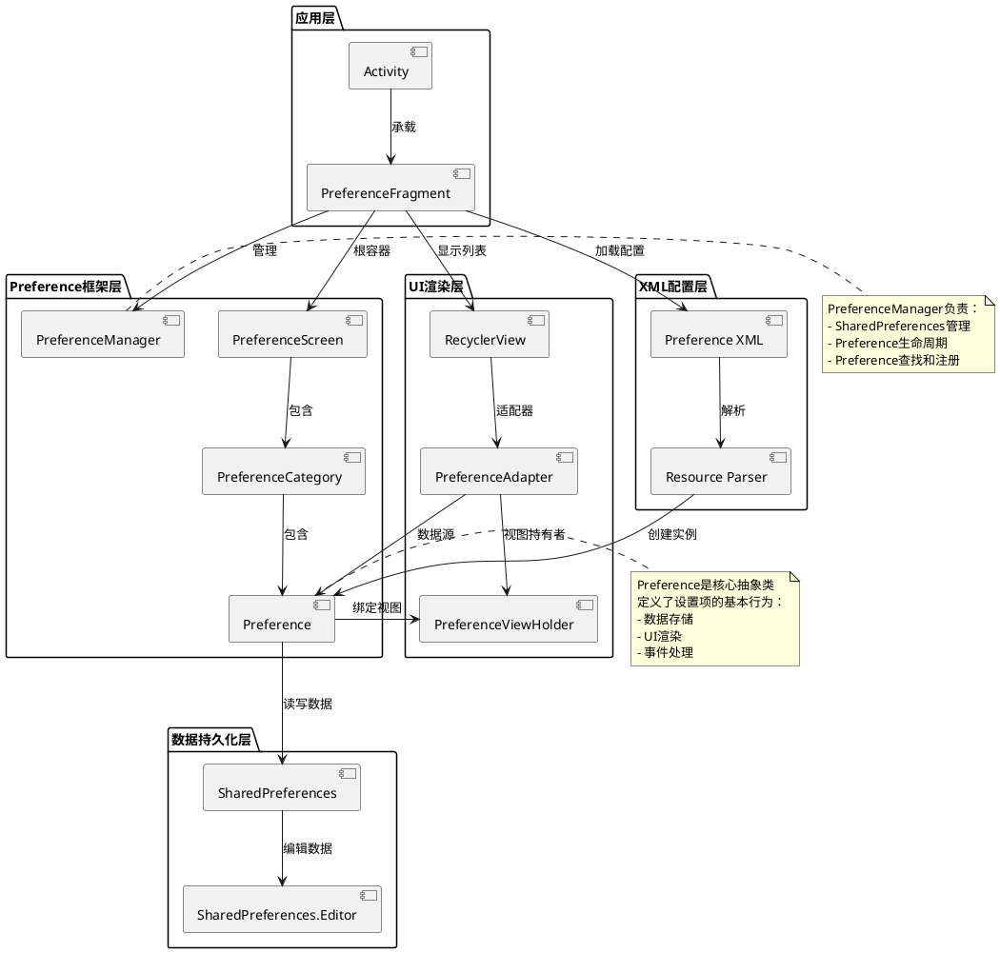

### 数据流与控制流

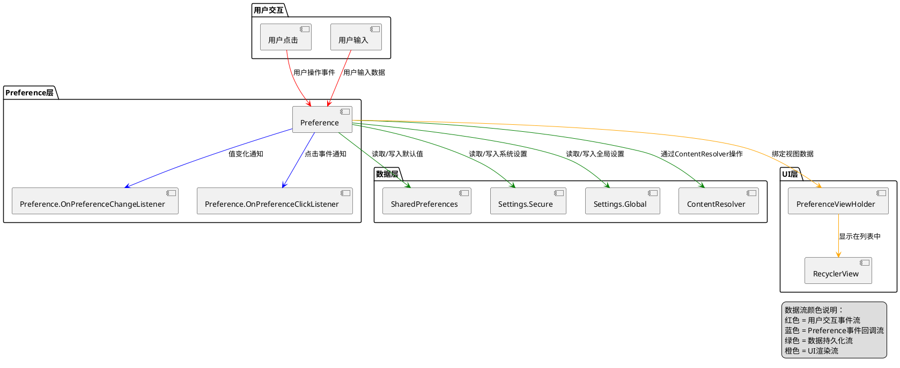

---

## Preference类层次结构

### Preference类继承关系图

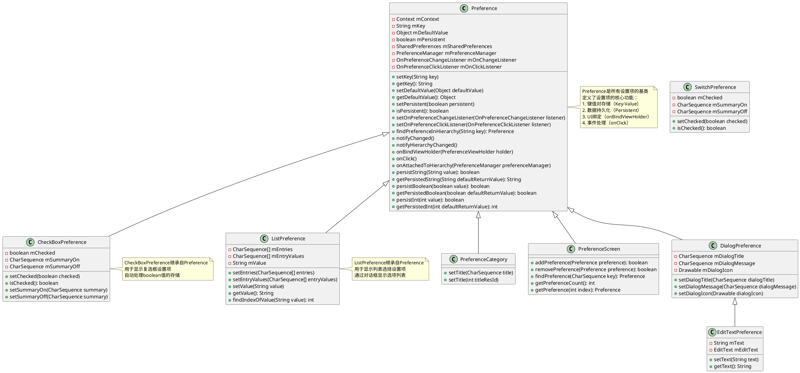

### 自定义Preference类关系

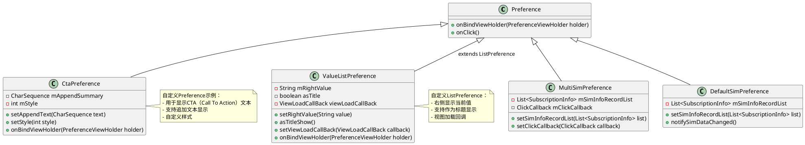

---

## PreferenceFragment工作流程

### PreferenceFragment创建和显示时序图

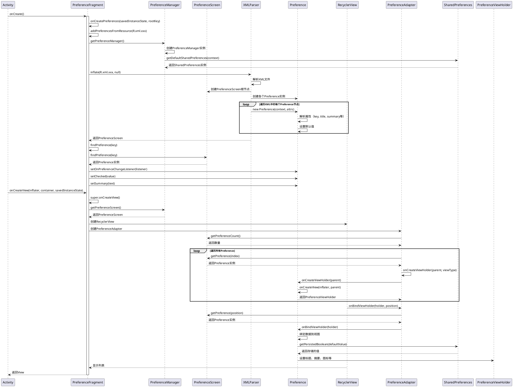

### PreferenceFragment生命周期活动图

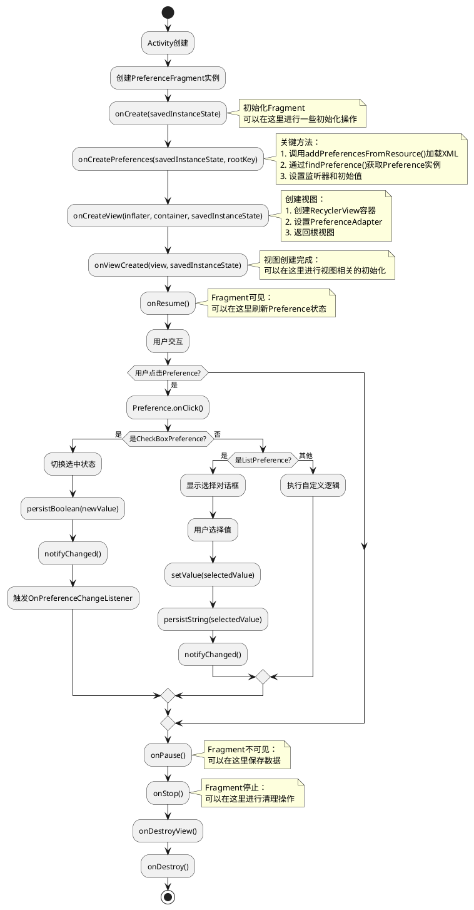

---

## XML配置机制

### XML配置结构

Preference通过XML文件进行声明式配置，XML结构如下：

```xml
<?xml version="1.0" encoding="utf-8"?>
<PreferenceScreen xmlns:android="http://schemas.android.com/apk/res/android"
    xmlns:miui="http://schemas.android.com/apk/res/com.android.provision">
    
    <!-- PreferenceCategory用于分组 -->
    <PreferenceCategory
        android:key="other_settings_category"
        android:title="@string/category_title">
        
        <!-- CheckBoxPreference复选框设置项 -->
        <com.android.provision.widget.PrivacyCheckboxPreference
            android:key="button_location_service_key"
            android:title="@string/other_settings_location"
            android:summary="@string/other_settings_location_summary"
            android:defaultValue="true" />
        
        <!-- ListPreference列表选择设置项 -->
        <com.android.provision.widget.ValueListPreference
            android:key="button_global_auto_update_key"
            android:title="@string/other_settings_auto_update"
            android:summary="@string/other_settings_auto_update_summary"
            android:dialogTitle="@string/other_settings_auto_update"
            android:entries="@array/other_settings_auto_update_entries"
            android:entryValues="@array/other_settings_auto_update_entries" />
        
        <!-- 自定义Preference -->
        <com.android.provision.widget.CtaPreference
            android:key="mi_interconnection_service_part_two"
            miui:hasHyperlink="true" />
            
    </PreferenceCategory>
</PreferenceScreen>
```

### XML解析流程

```plantuml
@startuml
title XML解析流程

start

:调用addPreferencesFromResource(R.xml.xxx);

:PreferenceManager.inflateFromResource();
note right
    获取XML资源输入流
end note

:创建PreferenceInflater;
note right
    用于解析XML并创建Preference实例
end note

:解析XML根节点;
if (根节点是PreferenceScreen?) then (是)
    :创建PreferenceScreen实例;
else (否)
    stop
endif

:遍历XML子节点;
loop 遍历每个子节点
    if (节点是PreferenceCategory?) then (是)
        :创建PreferenceCategory实例;
        :递归解析Category的子节点;
    else (否)
        if (是Preference节点?) then (是)
            :获取Preference类名;
            if (是自定义Preference?) then (是)
                :使用自定义类名创建实例;
                note right
                    例如：com.android.provision.widget.CtaPreference
                end note
            else (否)
                :使用默认Preference类创建实例;
                note right
                    根据标签名确定类型：
                    - CheckBoxPreference
                    - ListPreference
                    - EditTextPreference
                    等
                end note
            endif
            
            :解析Preference属性;
            note right
                解析的属性包括：
                - android:key
                - android:title
                - android:summary
                - android:defaultValue
                - android:entries
                - android:entryValues
                等
            end note
            
            :设置Preference属性;
            :调用Preference.setKey(key);
            :调用Preference.setTitle(title);
            :调用Preference.setSummary(summary);
            :调用Preference.setDefaultValue(defaultValue);
            
            :添加到父容器;
            if (父容器是PreferenceCategory?) then (是)
                :PreferenceCategory.addPreference(preference);
            else (是PreferenceScreen?)
                :PreferenceScreen.addPreference(preference);
            endif
        endif
    endif
endloop

:返回PreferenceScreen根节点;

stop

@enduml
```

### XML属性说明

| 属性 | 说明 | 示例 |
|------|------|------|
| `android:key` | Preference的唯一标识符，用于数据存储和查找 | `android:key="button_location_service_key"` |
| `android:title` | Preference的标题文本 | `android:title="@string/other_settings_location"` |
| `android:summary` | Preference的摘要文本 | `android:summary="@string/other_settings_location_summary"` |
| `android:defaultValue` | Preference的默认值 | `android:defaultValue="true"` |
| `android:entries` | ListPreference显示的选项文本数组 | `android:entries="@array/auto_update_entries"` |
| `android:entryValues` | ListPreference选项对应的值数组 | `android:entryValues="@array/auto_update_values"` |
| `android:dialogTitle` | DialogPreference对话框的标题 | `android:dialogTitle="@string/select_option"` |
| `android:icon` | Preference的图标 | `android:icon="@drawable/ic_location"` |
| `android:enabled` | Preference是否可用 | `android:enabled="true"` |
| `android:selectable` | Preference是否可选择 | `android:selectable="true"` |

---

## View绑定机制

### onBindViewHolder流程

Preference通过`onBindViewHolder`方法将数据绑定到视图。这是Preference框架的核心机制之一。

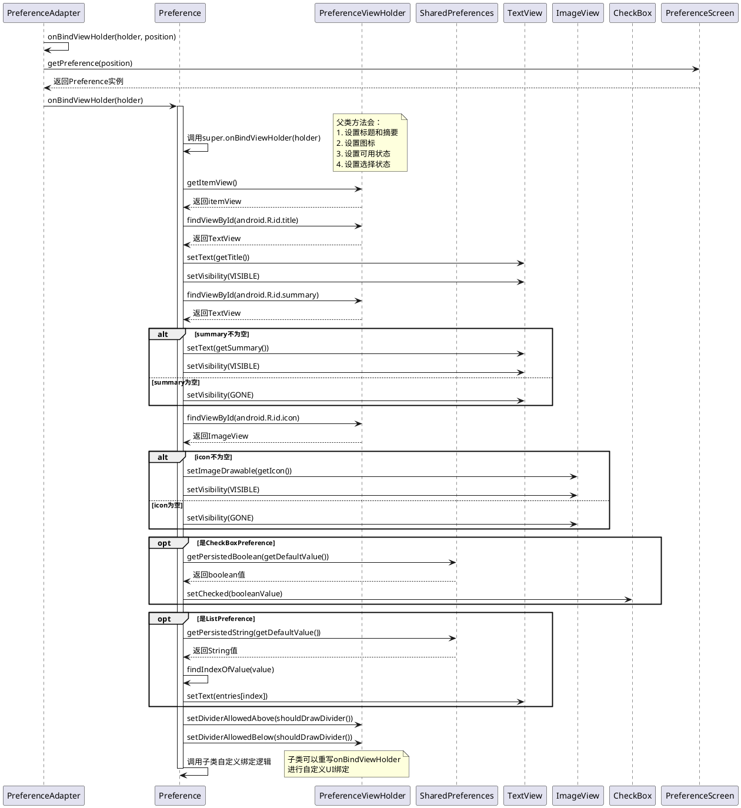

### 自定义Preference的View绑定示例

以`CtaPreference`为例，展示自定义Preference如何绑定视图：

```java
@Override
public void onBindViewHolder(PreferenceViewHolder holder) {
    // 调用父类方法，完成基础绑定
    super.onBindViewHolder(holder);
    
    View view = holder.itemView;
    
    // 自定义背景
    view.setBackgroundResource(R.drawable.preference_item_background);
    
    // 隐藏widget区域
    ViewGroup widgetFrame = (ViewGroup) view.findViewById(com.android.internal.R.id.widget_frame);
    if (widgetFrame != null) {
        widgetFrame.setVisibility(View.GONE);
    }
    
    // 自定义summary TextView样式
    TextView textView = (TextView) view.findViewById(android.R.id.summary);
    textView.setTypeface(tf);
    textView.setTextSize(TypedValue.COMPLEX_UNIT_PX, 
        getContext().getResources().getDimension(R.dimen.privacy_description_text_size));
    textView.setMovementMethod(LinkMovementMethod.getInstance());
    
    // 添加追加文本
    if (mAppendSummary != null && !buildTag) {
        TextView appendText = new TextView(view.getContext());
        appendText.setText(mAppendSummary);
        parent.addView(appendText, params);
        buildTag = true;
    }
}
```

### View创建流程

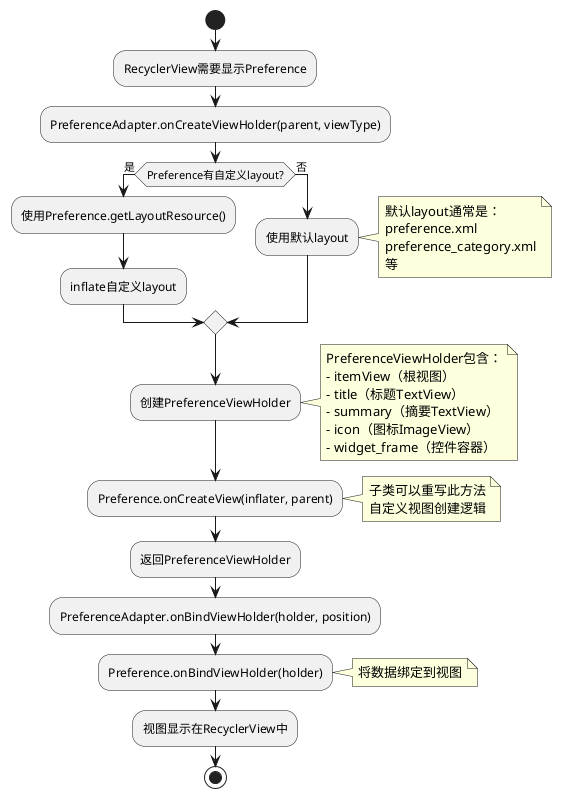

---

## 事件处理机制

### Preference点击事件流程

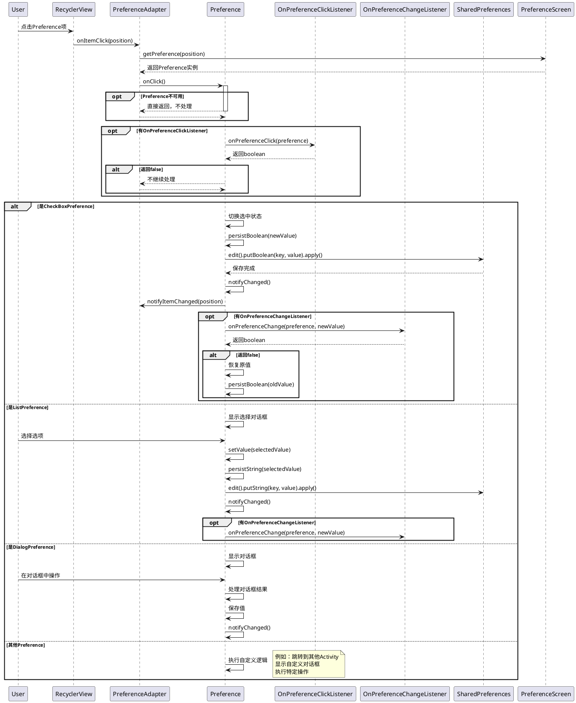

### 事件监听器设置

PreferenceFragment中设置事件监听器的示例：

```java
@Override
public void onCreatePreferences(Bundle savedInstanceState, String rootKey) {
    addPreferencesFromResource(R.xml.other_settings);
    
    // 获取Preference实例
    mLocationPreference = (CheckBoxPreference) findPreference(BUTTON_LOCATION_SERVICE_KEY);
    
    // 设置值变化监听器
    mLocationPreference.setOnPreferenceChangeListener(new Preference.OnPreferenceChangeListener() {
        @Override
        public boolean onPreferenceChange(Preference preference, Object newValue) {
            boolean isChecked = (Boolean) newValue;
            
            // 执行自定义逻辑
            if (isChecked) {
                // 开启位置服务
                Utils.updateLocationEnabled(getActivity(), true, UserHandle.myUserId(),
                    Settings.Secure.LOCATION_CHANGER_SYSTEM_SETTINGS);
            } else {
                // 关闭位置服务
                Utils.updateLocationEnabled(getActivity(), false, UserHandle.myUserId(),
                    Settings.Secure.LOCATION_CHANGER_SYSTEM_SETTINGS);
            }
            
            // 返回true表示接受新值，false表示拒绝新值
            return true;
        }
    });
    
    // 设置点击监听器
    mLocationPreference.setOnPreferenceClickListener(new Preference.OnPreferenceClickListener() {
        @Override
        public boolean onPreferenceClick(Preference preference) {
            // 执行点击逻辑
            // 返回true表示已处理，false表示继续默认处理
            return true;
        }
    });
}
```

### 事件处理活动图

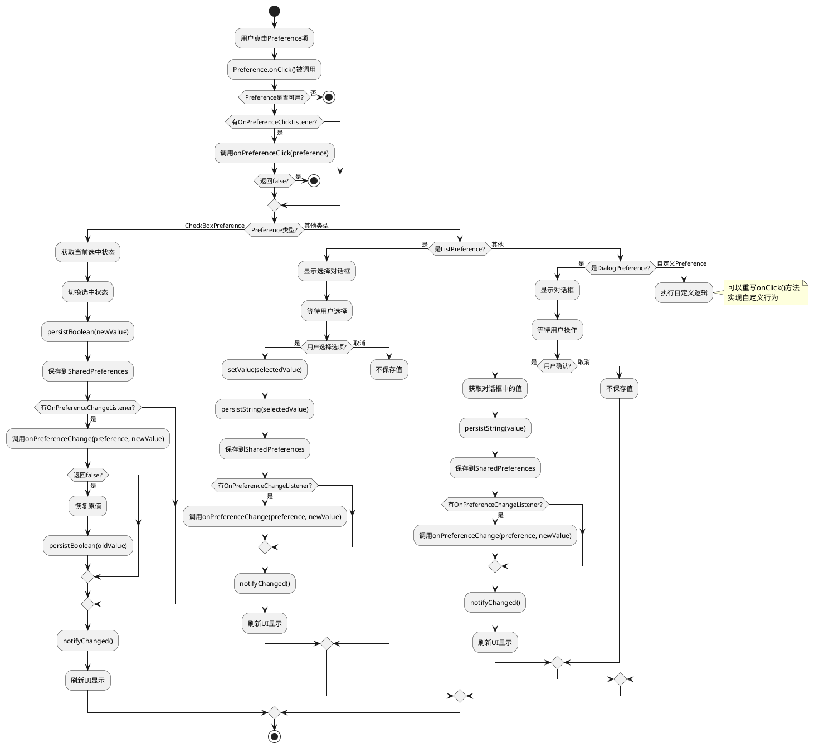

---

## 数据持久化机制

### SharedPreferences存储机制

Preference框架使用SharedPreferences进行数据持久化。每个Preference通过其key值在SharedPreferences中存储对应的值。

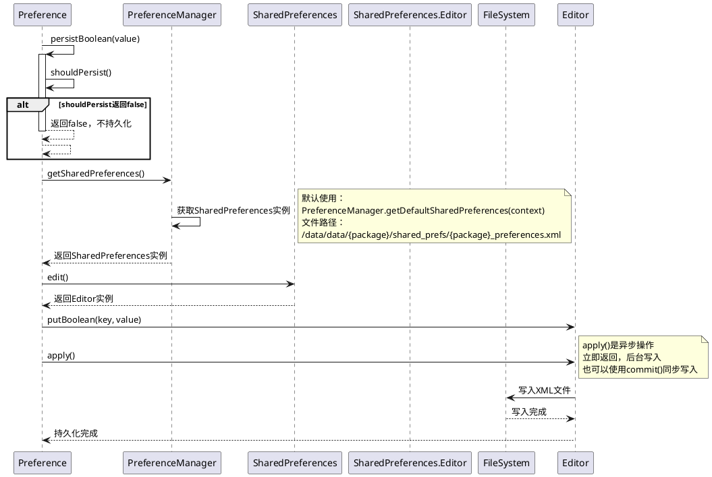

### 数据读取流程

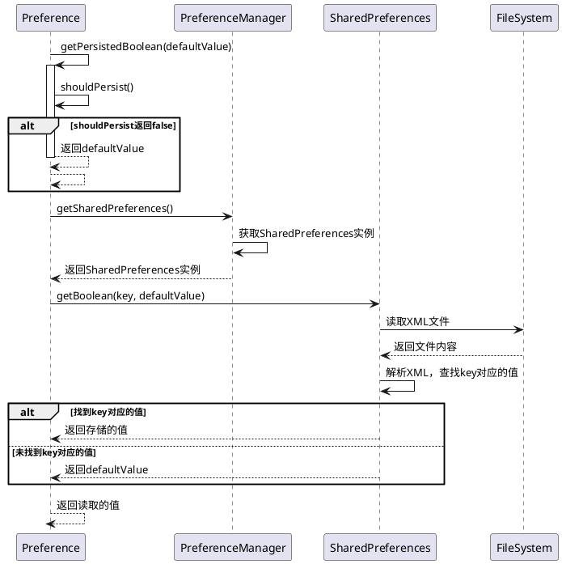

### 存储位置和格式

Preference数据存储在SharedPreferences中，文件位置和格式如下：

**文件路径**：
```
/data/data/{package_name}/shared_prefs/{package_name}_preferences.xml
```

**XML格式示例**：
```xml
<?xml version='1.0' encoding='utf-8' standalone='yes' ?>
<map>
    <boolean name="button_location_service_key" value="true" />
    <string name="button_global_auto_update_key">自动下载并安装</string>
    <int name="some_int_preference" value="42" />
    <float name="some_float_preference" value="3.14" />
    <long name="some_long_preference" value="1234567890" />
</map>
```

### 数据持久化方法

Preference提供了多种数据持久化方法：

| 方法 | 说明 | 示例 |
|------|------|------|
| `persistBoolean(boolean value)` | 持久化boolean值 | `persistBoolean(true)` |
| `getPersistedBoolean(boolean defaultReturnValue)` | 读取boolean值 | `boolean value = getPersistedBoolean(false)` |
| `persistString(String value)` | 持久化String值 | `persistString("selected_value")` |
| `getPersistedString(String defaultReturnValue)` | 读取String值 | `String value = getPersistedString("default")` |
| `persistInt(int value)` | 持久化int值 | `persistInt(42)` |
| `getPersistedInt(int defaultReturnValue)` | 读取int值 | `int value = getPersistedInt(0)` |
| `persistFloat(float value)` | 持久化float值 | `persistFloat(3.14f)` |
| `getPersistedFloat(float defaultReturnValue)` | 读取float值 | `float value = getPersistedFloat(0.0f)` |
| `persistLong(long value)` | 持久化long值 | `persistLong(1234567890L)` |
| `getPersistedLong(long defaultReturnValue)` | 读取long值 | `long value = getPersistedLong(0L)` |
| `persistStringSet(Set<String> values)` | 持久化String集合 | `persistStringSet(stringSet)` |
| `getPersistedStringSet(Set<String> defaultReturnValue)` | 读取String集合 | `Set<String> value = getPersistedStringSet(defaultSet)` |

### 禁用持久化

如果Preference不需要持久化数据，可以调用：

```java
preference.setPersistent(false);
```

这样Preference的值变化不会保存到SharedPreferences中，只会在内存中保持。

---

## 自定义Preference实现

### 自定义Preference步骤

1. **继承Preference或其子类**
2. **实现构造函数**
3. **重写onBindViewHolder方法**（可选，用于自定义UI）
4. **重写onClick方法**（可选，用于自定义点击行为）
5. **实现数据持久化**（如果需要）

### CtaPreference实现示例

```java
public class CtaPreference extends Preference implements FolmeAnimationController {
    private CharSequence mAppendSummary;
    private int mStyle;
    
    // 构造函数
    public CtaPreference(Context context, AttributeSet attrs, int defStyleAttr) {
        super(context, attrs, defStyleAttr);
        tf = Typeface.create("mipro-regular", Typeface.NORMAL);
    }
    
    // 重写onBindViewHolder，自定义UI绑定
    @Override
    public void onBindViewHolder(PreferenceViewHolder holder) {
        super.onBindViewHolder(holder);
        View view = holder.itemView;
        
        // 自定义背景
        view.setBackgroundResource(R.drawable.preference_item_background);
        
        // 隐藏widget区域
        ViewGroup widgetFrame = (ViewGroup) view.findViewById(
            com.android.internal.R.id.widget_frame);
        if (widgetFrame != null) {
            widgetFrame.setVisibility(View.GONE);
        }
        
        // 自定义summary TextView样式
        TextView textView = (TextView) view.findViewById(android.R.id.summary);
        textView.setTypeface(tf);
        textView.setTextSize(TypedValue.COMPLEX_UNIT_PX, 
            getContext().getResources().getDimension(R.dimen.privacy_description_text_size));
        textView.setMovementMethod(LinkMovementMethod.getInstance());
        
        // 添加追加文本
        if (mAppendSummary != null && !buildTag) {
            TextView appendText = new TextView(view.getContext());
            appendText.setText(mAppendSummary);
            parent.addView(appendText, params);
            buildTag = true;
        }
    }
    
    // 提供设置方法
    public void setAppendText(CharSequence charSequence) {
        mAppendSummary = charSequence;
    }
    
    public void setStyle(int style) {
        mStyle = style;
    }
}
```

### ValueListPreference实现示例

```java
public class ValueListPreference extends ListPreference implements FolmeAnimationController {
    private String mRightValue;
    private boolean asTitle = false;
    private ViewLoadCallBack viewLoadCallBack;
    
    public ValueListPreference(Context context, AttributeSet attrs) {
        super(context, attrs);
        // 设置自定义布局
        setLayoutResource(R.layout.miuix_preference_text);
        setWidgetLayoutResource(R.layout.preference_widget_value_right);
    }
    
    @Override
    public void onBindViewHolder(PreferenceViewHolder holder) {
        super.onBindViewHolder(holder);
        View view = holder.itemView;
        
        // 自定义背景
        view.setBackgroundResource(R.drawable.preference_item_background);
        
        // 设置右侧显示的值
        TextView valueView = (TextView) view.findViewById(R.id.value_right);
        if (valueView != null) {
            if (!TextUtils.isEmpty(mRightValue)) {
                valueView.setText(mRightValue);
                valueView.setVisibility(View.VISIBLE);
            } else {
                valueView.setVisibility(View.GONE);
            }
        }
        
        // 如果作为标题显示，隐藏摘要和箭头
        if (asTitle) {
            TextView sumView = (TextView) view.findViewById(android.R.id.summary);
            if (sumView != null) {
                sumView.setVisibility(View.GONE);
            }
            ImageView rightArrowView = (ImageView) view.findViewById(R.id.arrow_right);
            if (rightArrowView != null) {
                rightArrowView.setVisibility(View.GONE);
            }
        }
        
        // 视图加载回调
        if (viewLoadCallBack != null) {
            viewLoadCallBack.call();
        }
    }
    
    @Override
    protected void onClick() {
        // 如果作为标题显示，不响应点击
        if (asTitle) {
            return;
        }
        super.onClick();
    }
    
    public void setRightValue(String str) {
        if (!TextUtils.isEmpty(str)) {
            mRightValue = str;
            setValue(str);
            notifyChanged();
        }
    }
    
    public void asTitleShow() {
        this.asTitle = true;
    }
    
    public void setViewLoadCallBack(ViewLoadCallBack viewLoadCallBack) {
        this.viewLoadCallBack = viewLoadCallBack;
    }
    
    public interface ViewLoadCallBack {
        void call();
    }
}
```

### 自定义Preference类图

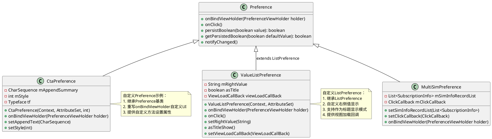

### 自定义Preference使用流程

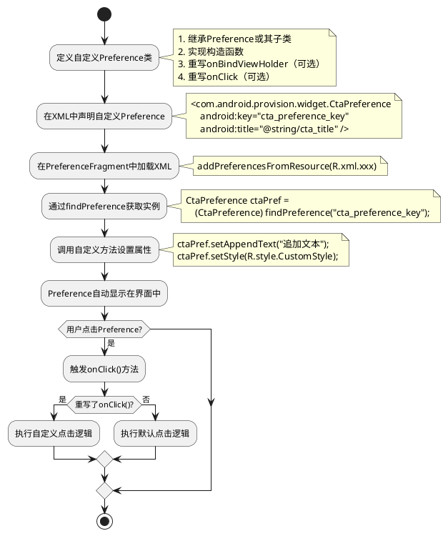

---

## 最佳实践

### 1. XML配置最佳实践

**使用有意义的key值**：
```xml
<!-- 好的做法 -->
<CheckBoxPreference
    android:key="button_location_service_key"
    android:title="@string/location_service" />

<!-- 不好的做法 -->
<CheckBoxPreference
    android:key="pref1"
    android:title="@string/location_service" />
```

**合理使用PreferenceCategory分组**：
```xml
<PreferenceCategory android:title="@string/privacy_settings">
    <CheckBoxPreference android:key="location_key" ... />
    <CheckBoxPreference android:key="camera_key" ... />
</PreferenceCategory>

<PreferenceCategory android:title="@string/network_settings">
    <CheckBoxPreference android:key="wifi_key" ... />
    <CheckBoxPreference android:key="bluetooth_key" ... />
</PreferenceCategory>
```

**设置合理的默认值**：
```xml
<CheckBoxPreference
    android:key="auto_update_key"
    android:defaultValue="true" />
```

### 2. PreferenceFragment最佳实践

**在onCreatePreferences中初始化**：
```java
@Override
public void onCreatePreferences(Bundle savedInstanceState, String rootKey) {
    addPreferencesFromResource(R.xml.settings);
    
    // 获取Preference实例
    mLocationPreference = (CheckBoxPreference) findPreference(LOCATION_KEY);
    
    // 设置监听器
    mLocationPreference.setOnPreferenceChangeListener((preference, newValue) -> {
        // 处理值变化
        return true;
    });
    
    // 设置初始值
    updatePreferenceState();
}
```

**在onResume中刷新状态**：
```java
@Override
public void onResume() {
    super.onResume();
    // 刷新Preference状态，确保显示最新值
    refreshPreferenceStates();
}
```

**在onStop中保存数据**：
```java
@Override
public void onStop() {
    super.onStop();
    // 保存Preference值到系统设置
    savePreferenceValues();
}
```

### 3. 自定义Preference最佳实践

**重写onBindViewHolder时调用super**：
```java
@Override
public void onBindViewHolder(PreferenceViewHolder holder) {
    super.onBindViewHolder(holder);  // 必须调用父类方法
    // 然后进行自定义绑定
}
```

**使用notifyChanged()通知UI更新**：
```java
public void setRightValue(String value) {
    mRightValue = value;
    setValue(value);
    notifyChanged();  // 通知UI更新
}
```

**合理使用setPersistent()**：
```java
// 如果Preference不需要持久化，禁用持久化
preference.setPersistent(false);
```

### 4. 性能优化建议

**避免在onBindViewHolder中进行耗时操作**：
```java
// 不好的做法
@Override
public void onBindViewHolder(PreferenceViewHolder holder) {
    super.onBindViewHolder(holder);
    // 耗时操作
    String result = performHeavyOperation();
    textView.setText(result);
}

// 好的做法：预先计算或异步加载
@Override
public void onBindViewHolder(PreferenceViewHolder holder) {
    super.onBindViewHolder(holder);
    textView.setText(mPrecomputedValue);
}
```

**合理使用findPreference缓存**：
```java
public class MyPreferenceFragment extends PreferenceFragment {
    private CheckBoxPreference mLocationPreference;
    
    @Override
    public void onCreatePreferences(Bundle savedInstanceState, String rootKey) {
        addPreferencesFromResource(R.xml.settings);
        // 缓存Preference引用，避免重复查找
        mLocationPreference = (CheckBoxPreference) findPreference(LOCATION_KEY);
    }
}
```

### 5. 错误处理最佳实践

**检查Preference是否为null**：
```java
Preference preference = findPreference(KEY);
if (preference != null) {
    preference.setOnPreferenceChangeListener(listener);
} else {
    Log.w(TAG, "Preference not found: " + KEY);
}
```

**处理SharedPreferences读取异常**：
```java
try {
    boolean value = getPersistedBoolean(false);
    // 使用value
} catch (Exception e) {
    Log.e(TAG, "Failed to get persisted value", e);
    // 使用默认值
    boolean value = false;
}
```

---

## 总结

### Preference框架核心机制总结

1. **声明式配置**：通过XML文件声明式定义设置项，减少代码量
2. **自动数据持久化**：自动将Preference值保存到SharedPreferences
3. **统一UI渲染**：通过RecyclerView和Adapter自动渲染Preference列表
4. **生命周期管理**：与Fragment生命周期自动同步
5. **事件回调机制**：提供丰富的回调接口处理用户交互
6. **灵活的扩展性**：支持自定义Preference实现特殊需求

### Preference工作流程总结

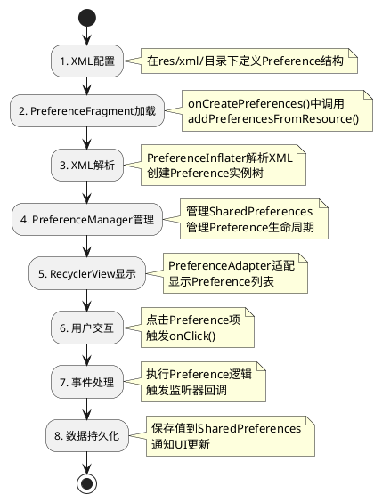

### 关键设计模式

1. **模板方法模式**：Preference定义了onBindViewHolder、onClick等模板方法，子类可以重写实现自定义行为
2. **观察者模式**：通过OnPreferenceChangeListener和OnPreferenceClickListener实现事件通知
3. **适配器模式**：PreferenceAdapter将Preference适配到RecyclerView
4. **工厂模式**：PreferenceInflater根据XML标签创建不同类型的Preference实例

### 适用场景

Preference框架适用于：
- Settings应用的设置界面
- 配置页面
- 用户偏好设置
- 需要数据持久化的选项列表

不适用于：
- 复杂的自定义UI
- 需要频繁动态变化的列表
- 不需要数据持久化的简单列表

---

## 附录

### 相关代码文件

- `OtherSettingsFragment.java`：PreferenceFragment使用示例
- `other_settings.xml`：Preference XML配置示例
- `CtaPreference.java`：自定义Preference示例
- `ValueListPreference.java`：自定义ListPreference示例
- `MultiSimSettingsFragment.java`：多SIM卡设置Fragment示例

### 参考文档

- Android官方文档：Preference API Guide
- AndroidX Preference库文档
- SharedPreferences使用指南

---

**文档版本**：v1.0  
**最后更新**：2025-01-XX  
**作者**：AI Assistant
