# ViewTreeObserver.OnDrawListener 事件上报链路分析

## 文档信息

- **文档标题**: ViewTreeObserver.OnDrawListener事件上报链路分析
- **创建时间**: 2025-11-04
- **适用场景**: 精确捕获View首次渲染完成时间点
- **Framework版本**: Android 13+

---

## 1. 概述

### 1.1 背景

在开机引导场景中，需要精确记录界面首次渲染完成的时间点，用于：
- 性能分析：计算从Activity启动到用户可见的耗时
- 日志分析：在问题定位时准确标记界面显示时刻
- 时间对齐：将视频帧、用户操作与日志时间线精确对齐

### 1.2 为什么选择OnDrawListener

| 时间点 | 精确度 | 说明 |
|--------|--------|------|
| onCreate() | 低 | Activity创建，UI未初始化 |
| onResume() | 中 | Activity可见，但未绘制 |
| onWindowFocusChanged() | 中高 | 窗口获得焦点，可能已绘制 |
| **OnDrawListener.onDraw()** | **最高** | **View.draw()执行完成，内容已渲染到Surface** |
| Choreographer.FrameCallback | 最高 | Vsync信号，屏幕刷新完成 |

**OnDrawListener.onDraw()** 是捕获首次渲染完成的最准确、最轻量的方案。

---

## 2. 架构设计

### 2.1 核心类关系图

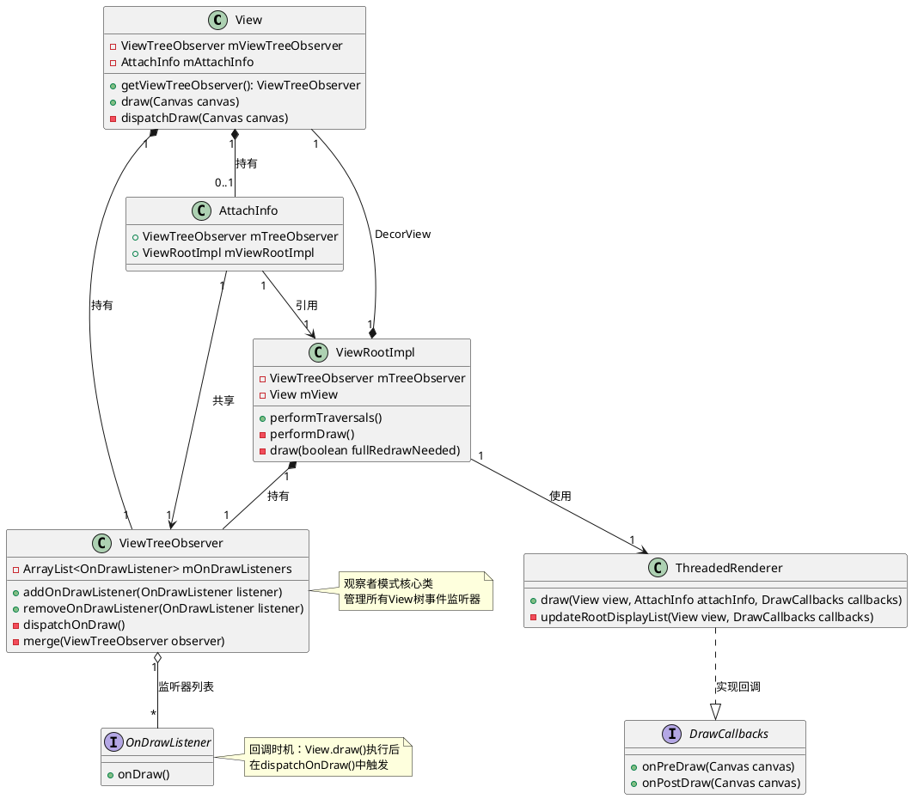

### 2.2 OnDrawListener在View树中的位置

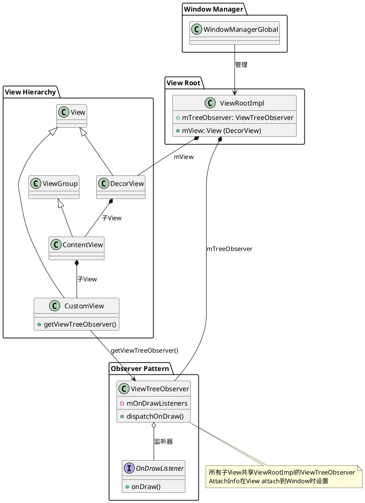

### 2.3 Framework层完整组件架构图

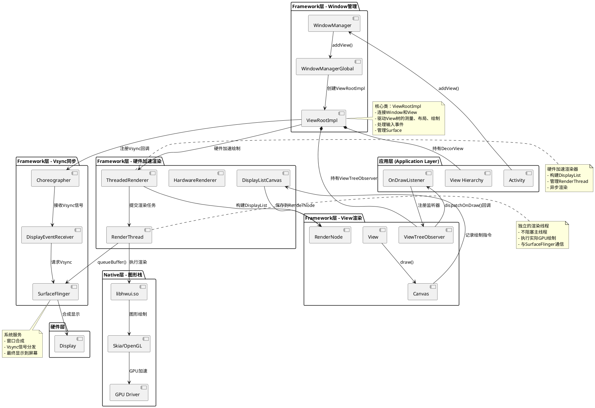

### 2.4 Framework层核心组件详解

#### 2.4.1 ViewRootImpl - View树的根

**职责**：
- Window与View树的桥梁
- 驱动View的measure/layout/draw三大流程
- 接收和分发Vsync信号
- 管理Surface和输入事件

**核心方法**：
```java
// frameworks/base/core/java/android/view/ViewRootImpl.java

public final class ViewRootImpl implements ViewParent {
    final View mView;  // DecorView
    final ViewTreeObserver mTreeObserver;
    final ThreadedRenderer mAttachInfo.mThreadedRenderer;
    final Choreographer mChoreographer;
    
    // Vsync回调，开始一帧的绘制
    void doTraversal() {
        performTraversals();
    }
    
    // 三大流程入口
    private void performTraversals() {
        performMeasure(childWidthMeasureSpec, childHeightMeasureSpec);
        performLayout(lp, mWidth, mHeight);
        performDraw();
    }
    
    // 绘制流程
    private void performDraw() {
        draw(fullRedrawNeeded);
    }
    
    private boolean draw(boolean fullRedrawNeeded) {
        if (mAttachInfo.mThreadedRenderer != null && mAttachInfo.mThreadedRenderer.isEnabled()) {
            // 硬件加速绘制路径
            mAttachInfo.mThreadedRenderer.draw(mView, mAttachInfo, this);
        } else {
            // 软件绘制路径
            drawSoftware(surface, mAttachInfo, xOffset, yOffset, scalingRequired, dirty, surfaceInsets);
        }
        return true;
    }
}
```

**关键时机**：
- `performTraversals()`：接收Vsync后的总入口
- `performDraw()`：绘制流程开始
- `draw()`：选择硬件/软件绘制路径
- `ThreadedRenderer.draw()`：触发硬件加速绘制
- 在绘制完成后触发`ViewTreeObserver.dispatchOnDraw()`

#### 2.4.2 ThreadedRenderer - 硬件加速渲染器

**职责**：
- 构建和管理DisplayList (RenderNode树)
- 管理独立的RenderThread
- 异步执行GPU绘制，不阻塞主线程
- 与SurfaceFlinger通信

**核心方法**：
```java
// frameworks/base/core/java/android/view/ThreadedRenderer.java

public final class ThreadedRenderer extends HardwareRenderer {
    
    // 主线程调用，开始一帧的渲染
    void draw(View view, AttachInfo attachInfo, DrawCallbacks callbacks) {
        updateRootDisplayList(view, callbacks);  // 构建DisplayList
        
        // 关键：在DisplayList构建完成后回调
        if (callbacks != null) {
            callbacks.onPostDraw();  // 这里会触发ViewTreeObserver.dispatchOnDraw()
        }
        
        // 提交到RenderThread异步渲染
        int syncResult = syncAndDrawFrame(mChoreographer.mFrameInfo);
    }
    
    // 更新View树的DisplayList
    private void updateRootDisplayList(View view, DrawCallbacks callbacks) {
        if (callbacks != null) {
            callbacks.onPreDraw();
        }
        
        // 触发View.updateDisplayListIfDirty()，递归构建DisplayList
        updateViewTreeDisplayList(view);
    }
    
    // 同步并渲染一帧
    private int syncAndDrawFrame(FrameInfo frameInfo) {
        // 调用Native层，提交到RenderThread
        return nSyncAndDrawFrame(mNativeProxy, frameInfo.frameInfo, frameInfo.frameInfo.length);
    }
}
```

**工作流程**：
1. 主线程：构建DisplayList（记录绘制指令）
2. 回调`onPostDraw()`触发`dispatchOnDraw()`
3. 提交到RenderThread
4. RenderThread：执行GPU绘制
5. queueBuffer到SurfaceFlinger

#### 2.4.3 RenderThread - 独立渲染线程

**职责**：
- 独立线程，不阻塞主线程UI
- 执行实际的GPU绘制操作
- 与SurfaceFlinger同步
- 管理GraphicBuffer

**工作机制**：
```cpp
// frameworks/base/libs/hwui/renderthread/RenderThread.cpp

void RenderThread::threadLoop() {
    while (true) {
        // 从队列获取渲染任务
        task = mQueue.next();
        
        // 执行渲染
        drawFrame(task);
        
        // 提交到SurfaceFlinger
        queueBuffer();
    }
}

void drawFrame(RenderTask* task) {
    // 1. 执行DisplayList中的绘制指令
    canvas->drawRenderNode(task->renderNode);
    
    // 2. GPU执行绘制
    mEglManager->swapBuffers();
    
    // 3. 提交Buffer
    mNativeWindow->queueBuffer();
}
```

**线程模型**：
```
主线程 (UI Thread)              RenderThread               SurfaceFlinger
    |                               |                            |
    | performDraw()                 |                            |
    |------------------------------>|                            |
    | updateDisplayList()           |                            |
    | (构建绘制指令)                  |                            |
    |                               |                            |
    | dispatchOnDraw() ★             |                            |
    | (OnDrawListener回调)          |                            |
    |                               |                            |
    | syncAndDrawFrame()            |                            |
    |------------------------------>| drawFrame()                |
    |                               | (GPU渲染)                   |
    | 返回，可以处理下一帧            |                            |
    |                               |------------------------------>|
    |                               | queueBuffer()              |
    |                               |                            | 合成显示
    |                               |<------------------------------|
    |                               | Vsync信号                   |
```

#### 2.4.4 Choreographer - Vsync协调者

**职责**：
- 接收和分发Vsync信号
- 协调动画、输入、绘制的时序
- 确保以60fps/90fps/120fps刷新

**核心机制**：
```java
// frameworks/base/core/java/android/view/Choreographer.java

public final class Choreographer {
    private static final int CALLBACK_INPUT = 0;      // 输入事件
    private static final int CALLBACK_ANIMATION = 1;   // 动画
    private static final int CALLBACK_TRAVERSAL = 2;   // 遍历(measure/layout/draw)
    private static final int CALLBACK_COMMIT = 3;      // 提交
    
    // Vsync信号到来
    void doFrame(long frameTimeNanos, int frame) {
        // 按优先级执行回调
        doCallbacks(CALLBACK_INPUT, frameTimeNanos);
        doCallbacks(CALLBACK_ANIMATION, frameTimeNanos);
        doCallbacks(CALLBACK_TRAVERSAL, frameTimeNanos);  // ViewRootImpl.doTraversal()
        doCallbacks(CALLBACK_COMMIT, frameTimeNanos);
    }
}
```

**时间轴**：
```
Vsync信号 (16.6ms间隔，60fps)
    ↓
Choreographer.doFrame()
    ↓
CALLBACK_TRAVERSAL → ViewRootImpl.doTraversal()
    ↓
performTraversals() → performDraw()
    ↓
ThreadedRenderer.draw()
    ↓
updateDisplayList() → View.draw()
    ↓
onPostDraw() → ViewTreeObserver.dispatchOnDraw()
    ↓
OnDrawListener.onDraw() ★ (应用层回调)
```

#### 2.4.5 SurfaceFlinger - 系统合成器

**职责**：
- 窗口合成（Composition）
- 管理所有应用的Surface
- 分发Vsync信号
- 控制屏幕刷新

**交互流程**：
```
应用进程                      SurfaceFlinger              Display硬件
    |                               |                           |
    | dequeueBuffer()              |                           |
    |------------------------------>|                           |
    | 返回GraphicBuffer            |                           |
    |<------------------------------|                           |
    |                               |                           |
    | GPU绘制到Buffer               |                           |
    |                               |                           |
    | queueBuffer()                |                           |
    |------------------------------>| 接收Buffer                |
    |                               |                           |
    |                               | 合成所有Layer             |
    |                               | (其他应用、SystemUI等)    |
    |                               |                           |
    |                               | 提交到Display             |
    |                               |------------------------------>|
    |                               |                           | 屏幕显示
    |                               |                           |
    | 请求Vsync                     |                           |
    |<------------------------------|                           |
```

### 2.5 分层架构图

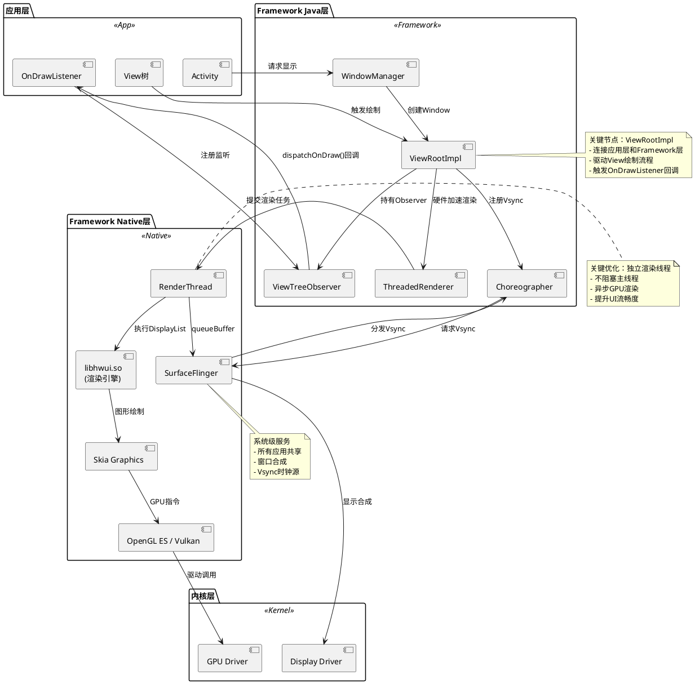

### 2.6 硬件加速绘制管线

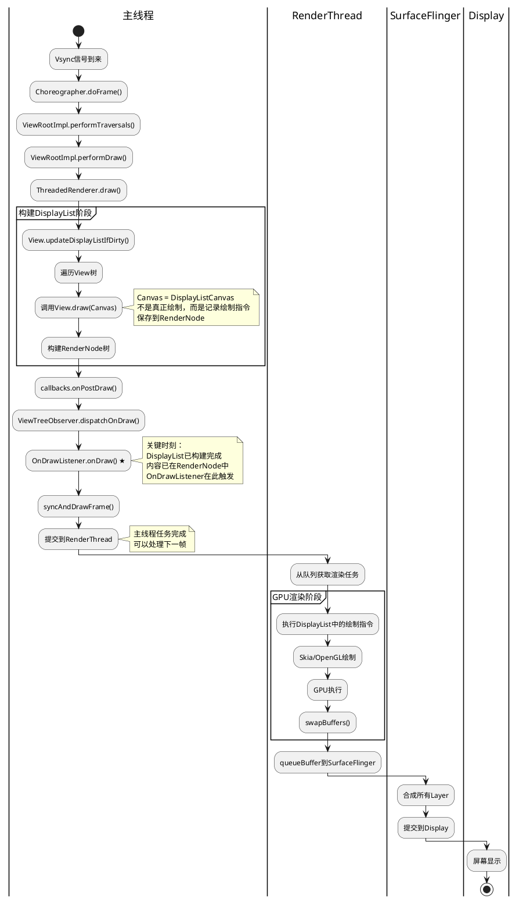

---

## 3. 事件上报链路

### 3.1 完整调用时序图

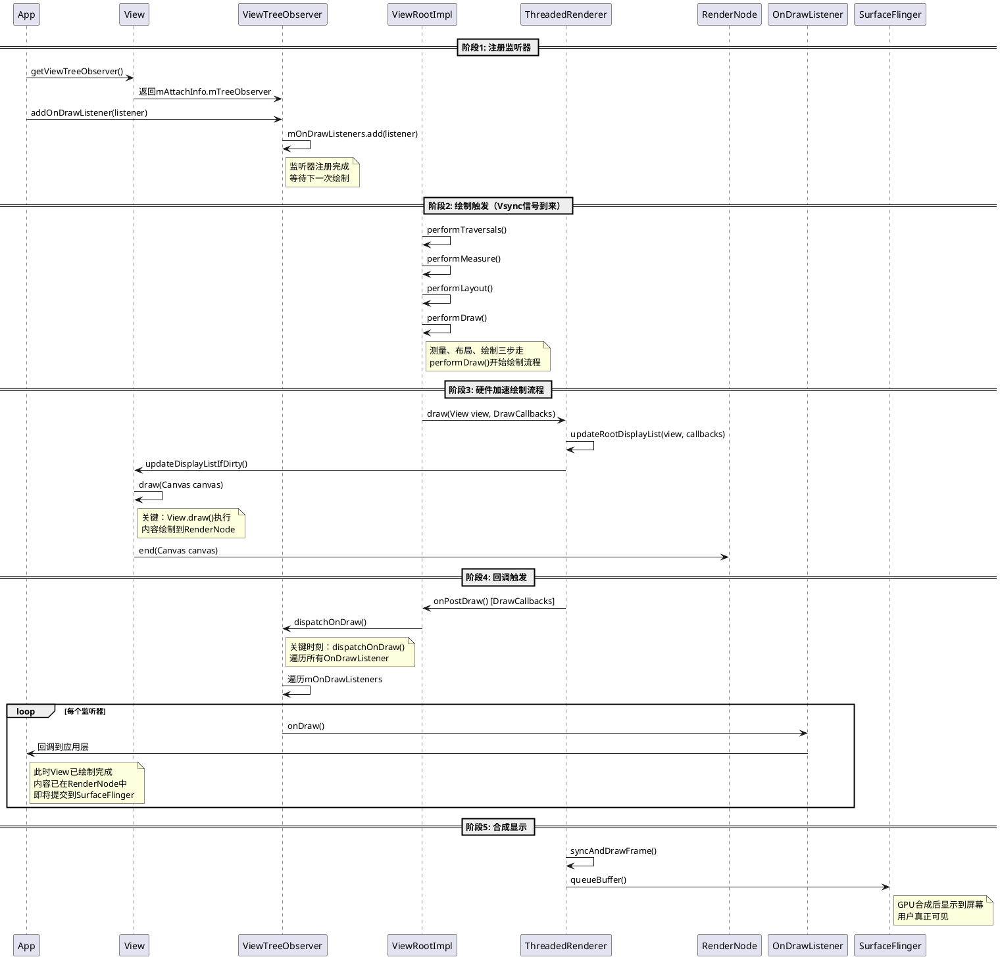

### 3.2 软件绘制流程（备用）

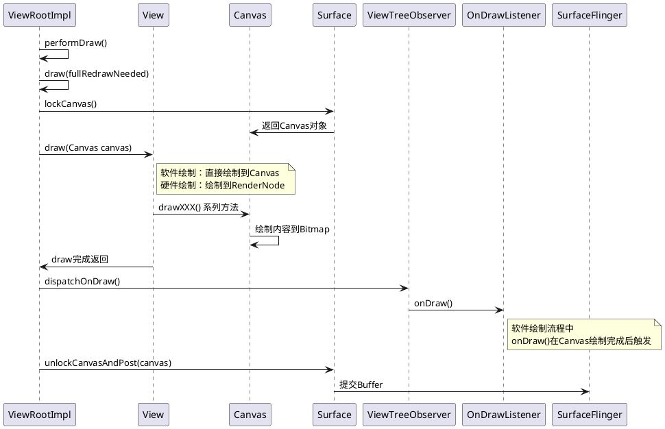

---

## 4. Framework层关键源码深入分析

### 4.1 ViewTreeObserver源码完整分析

#### 4.1.1 ViewTreeObserver核心数据结构

```java
// frameworks/base/core/java/android/view/ViewTreeObserver.java

public final class ViewTreeObserver {
    // 监听器列表（使用CopyOnWriteArray在Android 11+）
    private CopyOnWriteArray<OnDrawListener> mOnDrawListeners;
    private CopyOnWriteArray<OnPreDrawListener> mOnPreDrawListeners;
    private CopyOnWriteArray<OnGlobalLayoutListener> mOnGlobalLayoutListeners;
    
    // 标记是否在分发过程中（防止并发修改）
    private boolean mInDispatchOnDraw;
    
    // 标记Observer是否存活（View attach到Window后才存活）
    private boolean mAlive = true;
    
    // 构造函数（仅在Framework内部调用）
    ViewTreeObserver(Context context) {
        // 初始化
    }
    
    // 检查是否存活
    private void checkIsAlive() {
        if (!mAlive) {
            throw new IllegalStateException("This ViewTreeObserver is not alive, call "
                    + "getViewTreeObserver() again");
        }
    }
}
```

#### 4.1.2 addOnDrawListener实现

```java
// frameworks/base/core/java/android/view/ViewTreeObserver.java

public void addOnDrawListener(OnDrawListener listener) {
    checkIsAlive();  // 检查Observer是否存活
    
    if (mOnDrawListeners == null) {
        mOnDrawListeners = new CopyOnWriteArray<OnDrawListener>();
    }
    
    mOnDrawListeners.add(listener);
}
```

**关键点**：
- 使用`CopyOnWriteArray`保证线程安全
- 添加时不需要同步锁
- 写时复制，读操作不受影响

#### 4.1.3 dispatchOnDraw实现（核心方法）

```java
// frameworks/base/core/java/android/view/ViewTreeObserver.java

final void dispatchOnDraw() {
    if (mOnDrawListeners != null && mOnDrawListeners.size() > 0) {
        // 标记开始分发（防止在回调中移除监听器）
        mInDispatchOnDraw = true;
        
        // 获取快照（CopyOnWriteArray内部机制）
        final CopyOnWriteArray.Access<OnDrawListener> access = mOnDrawListeners.start();
        try {
            final int count = access.size();
            for (int i = 0; i < count; i++) {
                access.get(i).onDraw();  // 回调应用层
            }
        } finally {
            mOnDrawListeners.end();
            mInDispatchOnDraw = false;  // 分发完成
        }
    }
}
```

**关键机制**：
1. 使用`CopyOnWriteArray.Access`获取快照
2. 遍历过程中不受add/remove影响
3. `mInDispatchOnDraw`标记防止直接修改（在某些Android版本）

#### 4.1.4 removeOnDrawListener实现

```java
// frameworks/base/core/java/android/view/ViewTreeObserver.java

public void removeOnDrawListener(OnDrawListener victim) {
    checkIsAlive();
    
    if (mOnDrawListeners == null) {
        return;
    }
    
    // Android 11+增加了此检查
    if (mInDispatchOnDraw) {
        throw new IllegalStateException(
            "Cannot call removeOnDrawListener inside of onDraw");
    }
    
    mOnDrawListeners.remove(victim);
}
```

**问题根源**：
- `mInDispatchOnDraw`标记检测在回调中移除
- 直接在`onDraw()`中调用会触发异常
- 必须使用`post()`延迟移除

#### 4.1.5 Observer的merge机制

```java
// frameworks/base/core/java/android/view/ViewTreeObserver.java

// 当View从临时Observer切换到Window的Observer时调用
void merge(ViewTreeObserver observer) {
    if (observer.mOnDrawListeners != null) {
        if (mOnDrawListeners != null) {
            mOnDrawListeners.addAll(observer.mOnDrawListeners);
        } else {
            mOnDrawListeners = observer.mOnDrawListeners;
        }
    }
    
    // 合并其他监听器...
    
    // 销毁旧Observer
    observer.kill();
}

// 杀死Observer，标记为不存活
private void kill() {
    mAlive = false;
}
```

**使用场景**：
```java
// View未attach到Window时
ViewTreeObserver tempObserver = view.getViewTreeObserver();  // 临时Observer
tempObserver.addOnDrawListener(listener);

// View attach到Window后
// Framework会自动merge到Window的Observer
// 之前注册的监听器会被迁移
```

### 4.2 ViewRootImpl源码深入分析

#### 4.2.1 ViewRootImpl核心成员变量

```java
// frameworks/base/core/java/android/view/ViewRootImpl.java

public final class ViewRootImpl implements ViewParent,
        View.AttachInfo.Callbacks, ThreadedRenderer.DrawCallbacks {
    
    // View树的根（DecorView）
    View mView;
    
    // ViewTreeObserver实例（整个View树共享）
    final ViewTreeObserver mTreeObserver;
    
    // AttachInfo（包含Window相关信息）
    final View.AttachInfo mAttachInfo;
    
    // 硬件加速渲染器
    ThreadedRenderer mThreadedRenderer;
    
    // Choreographer（Vsync协调器）
    final Choreographer mChoreographer;
    
    // Surface（绘制表面）
    final Surface mSurface = new Surface();
    
    // 是否需要全量重绘
    boolean mFullRedrawNeeded;
    
    // 绘制相关标志
    boolean mIsDrawing;
    
    // 构造函数
    public ViewRootImpl(Context context, Display display) {
        mContext = context;
        
        // 创建ViewTreeObserver
        mTreeObserver = new ViewTreeObserver(context);
        
        // 创建AttachInfo
        mAttachInfo = new View.AttachInfo(mWindowSession, mWindow, display,
                this, mHandler, this, context);
        mAttachInfo.mTreeObserver = mTreeObserver;
        
        // 获取Choreographer
        mChoreographer = Choreographer.getInstance();
        
        // 创建硬件加速渲染器
        if (mAttachInfo.mThreadedRenderer != null) {
            mThreadedRenderer = mAttachInfo.mThreadedRenderer;
        }
    }
}
```

#### 4.2.2 performTraversals核心流程

```java
// frameworks/base/core/java/android/view/ViewRootImpl.java

private void performTraversals() {
    final View host = mView;  // DecorView
    
    // 1. 预处理
    if (mFirst) {
        // 首次遍历
        mFullRedrawNeeded = true;
        
        // 通知View已attach
        host.dispatchAttachedToWindow(mAttachInfo, 0);
    }
    
    // 2. 请求Window大小
    if (mLayoutRequested) {
        // 向WindowManager请求Window大小
        windowSizeMayChange |= measureHierarchy(host, lp, res,
                desiredWindowWidth, desiredWindowHeight);
    }
    
    // 3. Measure阶段
    if (didLayout) {
        performMeasure(childWidthMeasureSpec, childHeightMeasureSpec);
    }
    
    // 4. Layout阶段
    if (didLayout) {
        performLayout(lp, mWidth, mHeight);
    }
    
    // 5. Draw阶段
    if (!cancelDraw) {
        performDraw();
    }
}
```

#### 4.2.3 performDraw详细流程

```java
// frameworks/base/core/java/android/view/ViewRootImpl.java

private void performDraw() {
    // 检查是否正在绘制
    if (mAttachInfo.mDisplayState == Display.STATE_OFF && !mReportNextDraw) {
        return;
    }
    
    // 标记开始绘制
    final boolean fullRedrawNeeded = mFullRedrawNeeded;
    mFullRedrawNeeded = false;
    
    mIsDrawing = true;
    try {
        // 开始真正的绘制
        drawSoftware(surface, mAttachInfo, xOffset, yOffset,
                scalingRequired, dirty, surfaceInsets);
    } finally {
        mIsDrawing = false;
    }
}

private boolean draw(boolean fullRedrawNeeded) {
    Surface surface = mSurface;
    
    if (mAttachInfo.mThreadedRenderer != null && mAttachInfo.mThreadedRenderer.isEnabled()) {
        // 硬件加速绘制路径
        mAttachInfo.mThreadedRenderer.draw(mView, mAttachInfo, this);
    } else {
        // 软件绘制路径
        if (!drawSoftware(surface, mAttachInfo, xOffset, yOffset,
                scalingRequired, dirty, surfaceInsets)) {
            return false;
        }
    }
    
    return true;
}
```

#### 4.2.4 实现DrawCallbacks接口

```java
// frameworks/base/core/java/android/view/ViewRootImpl.java

// ViewRootImpl实现了ThreadedRenderer.DrawCallbacks接口
@Override
public void onPreDraw(Canvas canvas) {
    // 在构建DisplayList之前回调
}

@Override
public void onPostDraw(Canvas canvas) {
    // 关键：在构建DisplayList之后回调
    // 这里触发ViewTreeObserver的dispatchOnDraw()
    mAttachInfo.mTreeObserver.dispatchOnDraw();
}
```

### 4.3 ThreadedRenderer源码深入分析

#### 4.3.1 ThreadedRenderer核心成员

```java
// frameworks/base/core/java/android/view/ThreadedRenderer.java

public final class ThreadedRenderer extends HardwareRenderer {
    // Native层RenderProxy的引用
    private long mNativeProxy;
    
    // RootRenderNode（View树对应的RenderNode树的根）
    private RenderNode mRootNode;
    
    // 是否初始化
    private boolean mInitialized = false;
    
    // Surface宽高
    private int mWidth, mHeight;
    
    // 是否启用硬件加速
    private boolean mEnabled;
    
    // 构造函数
    ThreadedRenderer(Context context, boolean translucent, String name) {
        super();
        setName(name);
        setOpaque(!translucent);
        
        // 创建Native层RenderProxy
        mNativeProxy = nCreateRootRenderNode();
        mRootNode = RenderNode.adopt(mNativeProxy);
    }
}
```

#### 4.3.2 draw方法详细实现

```java
// frameworks/base/core/java/android/view/ThreadedRenderer.java

void draw(View view, AttachInfo attachInfo, DrawCallbacks callbacks) {
    // 标记帧开始
    attachInfo.mViewRootImpl.mChoreographer.mFrameInfo.markDrawStart();
    
    // 1. 更新RootRenderNode的DisplayList
    updateRootDisplayList(view, callbacks);
    
    // 2. 关键回调：onPostDraw()
    if (callbacks != null) {
        callbacks.onPostDraw();  // ViewRootImpl.onPostDraw() → dispatchOnDraw()
    }
    
    // 3. 注册动画回调（如果有）
    registerAnimatingRenderNode(mRootNode);
    
    // 4. 同步并绘制一帧（提交到RenderThread）
    int syncResult = syncAndDrawFrame(mChoreographer.mFrameInfo);
    
    // 5. 处理结果
    if ((syncResult & SYNC_LOST_SURFACE_REWARD_IF_FOUND) != 0) {
        // Surface丢失，需要重新创建
        setEnabled(false);
    }
}
```

#### 4.3.3 updateRootDisplayList详细流程

```java
// frameworks/base/core/java/android/view/ThreadedRenderer.java

private void updateRootDisplayList(View view, DrawCallbacks callbacks) {
    // 1. 预绘制回调
    if (callbacks != null) {
        callbacks.onPreDraw();
    }
    
    // 2. 更新View树的DisplayList
    updateViewTreeDisplayList(view);
    
    // 3. mRootNode现在包含完整的绘制指令
}

private void updateViewTreeDisplayList(View view) {
    // 标记开始构建DisplayList
    view.mPrivateFlags |= View.PFLAG_DRAWN;
    
    // 递归更新View树的RenderNode
    view.updateDisplayListIfDirty();
    
    // 将View的RenderNode设置为mRootNode的子节点
    RecordingCanvas canvas = mRootNode.beginRecording(mWidth, mHeight);
    try {
        canvas.drawRenderNode(view.updateDisplayListIfDirty());
    } finally {
        mRootNode.endRecording();
    }
}
```

#### 4.3.4 syncAndDrawFrame实现

```java
// frameworks/base/core/java/android/view/ThreadedRenderer.java

private int syncAndDrawFrame(FrameInfo frameInfo) {
    // 调用Native方法，提交到RenderThread
    return nSyncAndDrawFrame(mNativeProxy, frameInfo.frameInfo, frameInfo.frameInfo.length);
}

// Native方法声明
private static native int nSyncAndDrawFrame(long nativeProxy, long[] frameInfo, int size);
```

**Native层对应实现**：
```cpp
// frameworks/base/libs/hwui/jni/android_view_ThreadedRenderer.cpp

static int android_view_ThreadedRenderer_syncAndDrawFrame(JNIEnv* env, jobject clazz,
        jlong proxyPtr, jlongArray frameInfo, jint frameInfoSize) {
    RenderProxy* proxy = reinterpret_cast<RenderProxy*>(proxyPtr);
    
    // 同步帧信息
    env->GetLongArrayRegion(frameInfo, 0, frameInfoSize, proxy->frameInfo());
    
    // 提交到RenderThread执行
    return proxy->syncAndDrawFrame();
}
```

### 4.4 RenderNode和DisplayList机制

#### 4.4.1 RenderNode核心概念

```java
// frameworks/base/core/java/android/graphics/RenderNode.java

public final class RenderNode {
    // Native层RenderNode的引用
    private long mNativeRenderNode;
    
    // DisplayList（绘制指令列表）
    // 实际存储在Native层
    
    // 属性
    private int mWidth, mHeight;
    private float mAlpha = 1.0f;
    private float mTranslationX, mTranslationY, mTranslationZ;
    
    // 开始记录绘制指令
    public RecordingCanvas beginRecording(int width, int height) {
        // 创建RecordingCanvas，关联到这个RenderNode
        return RecordingCanvas.obtain(this, width, height);
    }
    
    // 结束记录
    public void endRecording() {
        // 将RecordingCanvas记录的指令保存到DisplayList
        nEndRecording(mNativeRenderNode);
    }
    
    // 检查是否需要更新DisplayList
    public boolean hasDisplayList() {
        return nHasDisplayList(mNativeRenderNode);
    }
}
```

#### 4.4.2 View.updateDisplayListIfDirty实现

```java
// frameworks/base/core/java/android/view/View.java

public RenderNode updateDisplayListIfDirty() {
    final RenderNode renderNode = mRenderNode;
    
    // 检查是否需要重建DisplayList
    if ((mPrivateFlags & PFLAG_DRAWING_CACHE_VALID) == 0
            || !renderNode.hasDisplayList()
            || (mRecreateDisplayList)) {
        
        // 需要重建DisplayList
        if (renderNode.hasDisplayList()
                && !mRecreateDisplayList) {
            // 标记为有效
            mPrivateFlags |= PFLAG_DRAWN | PFLAG_DRAWING_CACHE_VALID;
            mPrivateFlags &= ~PFLAG_DIRTY_MASK;
            
            // 不需要重建，直接返回
            return renderNode;
        }
        
        // 重建DisplayList
        mRecreateDisplayList = true;
        
        // 开始记录
        final RecordingCanvas canvas = renderNode.beginRecording(width, height);
        try {
            if (layerType == LAYER_TYPE_SOFTWARE) {
                // 软件层
                buildDrawingCache(true);
                Bitmap cache = getDrawingCache(true);
                if (cache != null) {
                    canvas.drawBitmap(cache, 0, 0, mLayerPaint);
                }
            } else {
                // 硬件加速
                computeScroll();
                
                canvas.translate(-mScrollX, -mScrollY);
                
                // 关键：调用draw()记录绘制指令
                draw(canvas);
                
                // 绘制子View
                if (mOverlay != null && !mOverlay.isEmpty()) {
                    mOverlay.getOverlayView().draw(canvas);
                }
            }
        } finally {
            // 结束记录
            renderNode.endRecording();
        }
        
        // 标记为有效
        mPrivateFlags |= PFLAG_DRAWN | PFLAG_DRAWING_CACHE_VALID;
        mPrivateFlags &= ~PFLAG_DIRTY_MASK;
        
    } else {
        // 不需要重建，直接返回
        mPrivateFlags |= PFLAG_DRAWN | PFLAG_DRAWING_CACHE_VALID;
        mPrivateFlags &= ~PFLAG_DIRTY_MASK;
    }
    
    return renderNode;
}
```

**DisplayList工作原理**：
```
View树                RenderNode树              DisplayList
  |                       |                         |
DecorView  ---------> RootRenderNode  --------> [drawRect(), drawText(), ...]
  |                       |                         |
  ├─FrameLayout -----> RenderNode1  ----------> [drawColor(), ...]
  |   |                   |                         |
  |   └─TextView -----> RenderNode2  ----------> [drawText(), ...]
  |                       |                         |
  └─Button  ----------> RenderNode3  ----------> [drawRoundRect(), ...]
  
每个RenderNode包含：
- 绘制指令列表（DisplayList）
- 变换矩阵（translation, rotation, scale）
- 裁剪区域（clip）
- 透明度（alpha）
- 子RenderNode列表
```

### 4.5 Surface和GraphicBuffer交互机制

#### 4.5.1 Surface核心概念

```java
// frameworks/base/core/java/android/view/Surface.java

public class Surface implements Parcelable {
    // Native层Surface的引用
    private long mNativeObject;
    
    // Surface关联的Canvas
    private Canvas mCanvas;
    
    // Surface的生成ID（每次创建递增）
    private int mGenerationId;
    
    // 锁定Surface获取Canvas（软件绘制）
    public Canvas lockCanvas(Rect inOutDirty) {
        return lockCanvasNative(inOutDirty);
    }
    
    // 解锁并提交Canvas（软件绘制）
    public void unlockCanvasAndPost(Canvas canvas) {
        unlockCanvasAndPostNative(canvas);
    }
    
    // 检查Surface是否有效
    public boolean isValid() {
        return mNativeObject != 0;
    }
}
```

#### 4.5.2 GraphicBuffer工作流程

```
应用进程                    BufferQueue                SurfaceFlinger
    |                           |                              |
    | 1. dequeueBuffer()        |                              |
    |-------------------------->|                              |
    | 返回GraphicBuffer[0]      |                              |
    |<--------------------------|                              |
    |                           |                              |
    | 2. lockCanvas()           |                              |
    | 获取Buffer的Canvas        |                              |
    |                           |                              |
    | 3. 绘制到Canvas/GPU渲染   |                              |
    | canvas.drawXXX()          |                              |
    | GPU执行绘制指令           |                              |
    |                           |                              |
    | 4. unlockCanvas()         |                              |
    | 5. queueBuffer([0])       |                              |
    |-------------------------->| 标记Buffer[0]为已填充         |
    |                           |                              |
    | 6. dequeueBuffer()        |                              |
    |-------------------------->| 返回Buffer[1]                |
    | 返回GraphicBuffer[1]      | (双缓冲/三缓冲)              |
    |<--------------------------|                              |
    |                           |                              |
    |                           | Buffer[0]准备好              |
    |                           |----------------------------->|
    |                           |                              | 7. acquireBuffer([0])
    |                           |                              | 合成Buffer[0]到屏幕
    |                           |                              |
    |                           |                              | 8. releaseBuffer([0])
    |                           |<-----------------------------|
    |                           | Buffer[0]可重用              |
```

**多缓冲机制**：
- **双缓冲**：应用绘制Buffer A时，SurfaceFlinger显示Buffer B
- **三缓冲**：应用绘制Buffer A，SurfaceFlinger显示Buffer B，Buffer C在队列中等待
- 避免应用等待SurfaceFlinger完成合成

#### 4.5.3 BufferQueue核心实现

```cpp
// frameworks/native/libs/gui/BufferQueueCore.cpp

class BufferQueueCore {
private:
    // Buffer槽位（通常2-3个）
    BufferQueueDefs::SlotsType mSlots;
    
    // 最大缓冲数量
    int mMaxAcquiredBufferCount;
    int mMaxDequeuedBufferCount;
    
    // 当前Buffer状态
    // FREE: 空闲，可dequeue
    // DEQUEUED: 已dequeue，应用正在使用
    // QUEUED: 已queue，等待SurfaceFlinger消费
    // ACQUIRED: SurfaceFlinger正在使用
    
public:
    // 从队列获取一个空闲Buffer
    status_t dequeueBuffer(int* outSlot, sp<Fence>* outFence) {
        // 查找FREE状态的Buffer
        for (int i = 0; i < BufferQueueDefs::NUM_BUFFER_SLOTS; i++) {
            if (mSlots[i].mBufferState == BufferSlot::FREE) {
                *outSlot = i;
                mSlots[i].mBufferState = BufferSlot::DEQUEUED;
                return OK;
            }
        }
        // 没有空闲Buffer，返回WOULD_BLOCK
        return WOULD_BLOCK;
    }
    
    // 将填充好的Buffer放入队列
    status_t queueBuffer(int slot, const QueueBufferInput& input,
            QueueBufferOutput* output) {
        mSlots[slot].mBufferState = BufferSlot::QUEUED;
        
        // 通知SurfaceFlinger有新Buffer
        mFrameAvailableListener->onFrameAvailable(BufferItem);
        return OK;
    }
};
```

### 4.6 OnDrawListener触发的精确时刻

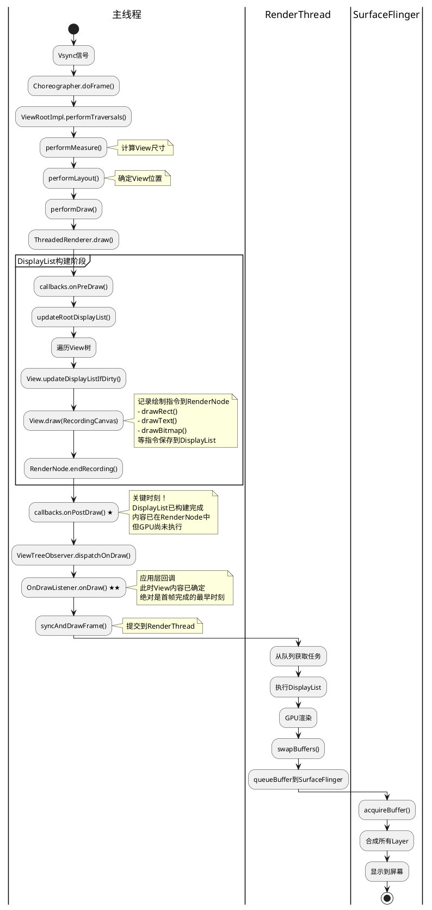

**关键结论**：
1. `OnDrawListener.onDraw()`触发时，View的绘制指令已完全确定
2. 此时内容在RenderNode的DisplayList中，尚未提交GPU
3. 这是应用层能捕获到的"首帧完成"的最精确时刻
4. 之后的GPU渲染和屏幕显示是异步的，应用层无法直接感知

---

## 5. Framework层性能优化机制

### 5.1 DisplayList缓存机制

**优化原理**：
- View内容不变时，重用上一帧的DisplayList
- 避免重复记录绘制指令
- 大幅减少CPU开销

**实现机制**：
```java
// View.java
public RenderNode updateDisplayListIfDirty() {
    if ((mPrivateFlags & PFLAG_DRAWING_CACHE_VALID) != 0
            && renderNode.hasDisplayList()
            && !mRecreateDisplayList) {
        // DisplayList有效且不需要重建，直接返回
        return renderNode;
    }
    
    // 需要重建DisplayList
    RecordingCanvas canvas = renderNode.beginRecording();
    draw(canvas);  // 记录绘制指令
    renderNode.endRecording();
    
    // 标记为有效
    mPrivateFlags |= PFLAG_DRAWING_CACHE_VALID;
    
    return renderNode;
}
```

### 5.2 RenderThread异步渲染

**优化原理**：
- 主线程只负责构建DisplayList（轻量）
- RenderThread独立执行GPU绘制（耗时）
- 主线程可以立即处理下一帧

**性能对比**：
```
传统软件绘制（单线程）：
  主线程: [Measure][Layout][绘制到Surface-20ms] [Measure][Layout][绘制到Surface-20ms]
  帧率: 1000ms / (5+5+20) = 33fps

硬件加速+RenderThread（双线程）：
  主线程: [Measure][Layout][构建DisplayList-3ms] [Measure][Layout][构建DisplayList-3ms]
  RenderThread:              [GPU渲染-10ms]              [GPU渲染-10ms]
  帧率: 1000ms / (5+5+3) = 76fps
```

### 5.3 View属性动画优化

**优化原理**：
- translation、rotation、alpha等属性可以在RenderNode层修改
- 不需要重建DisplayList
- 动画在RenderThread执行，完全不阻塞主线程

**实现示例**：
```java
// 传统View.invalidate()方式（慢）
view.setTranslationX(100);  // 会触发重建DisplayList

// RenderNode属性动画（快）
view.animate().translationX(100).start();  // 只修改RenderNode属性
```

---

## 6. 在MiuiProvision中的应用实践

### 6.1 CoverScreenService应用场景

:Vsync信号到来;

:ViewRootImpl.doTraversal();

:ViewRootImpl.performTraversals();

partition "绘制流程" {
    :performMeasure();
    :performLayout();
    :performDraw();
}

if (硬件加速?) then (是)
    :ThreadedRenderer.draw();
    :updateRootDisplayList();
    :View.updateDisplayListIfDirty();
    :View.draw(Canvas);
    note right
        关键：View内容绘制完成
        RenderNode已构建
    end note
    
    :onPostDraw() 回调;
else (否)
    :drawSoftware();
    :View.draw(Canvas);
    note right
        软件绘制：直接绘制到Surface
    end note
endif

:ViewTreeObserver.dispatchOnDraw();

partition "监听器回调" {
    repeat
        :OnDrawListener.onDraw();
        note right
            应用层回调
            此时View已渲染完成
        end note
    repeat while (还有监听器?)
}

:ThreadedRenderer.syncAndDrawFrame();

:提交到SurfaceFlinger;

:屏幕显示;

stop

@enduml
```

---

## 6. 在MiuiProvision中的应用

### 6.1 CoverScreenService应用

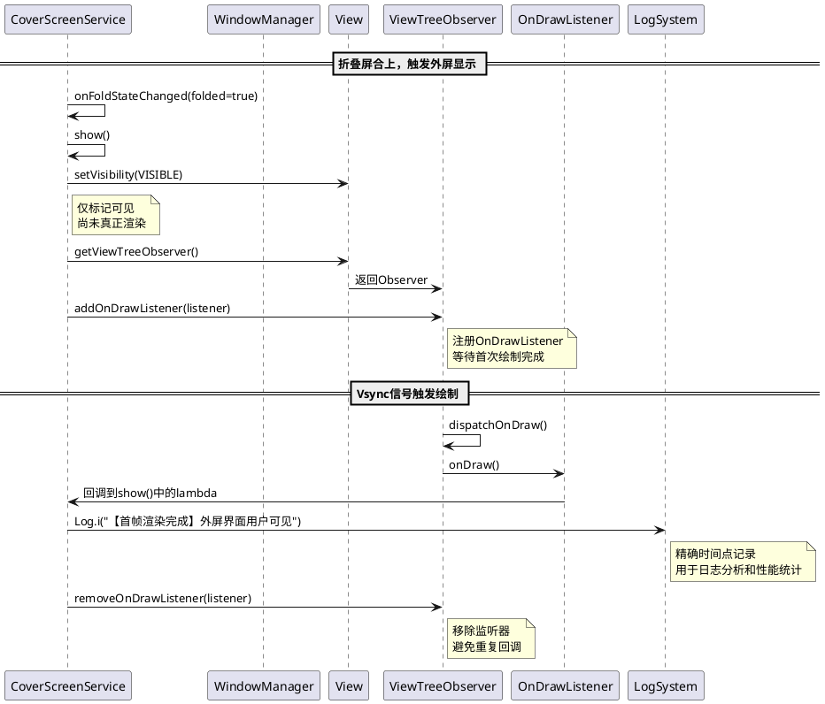

### 6.2 DefaultActivity应用

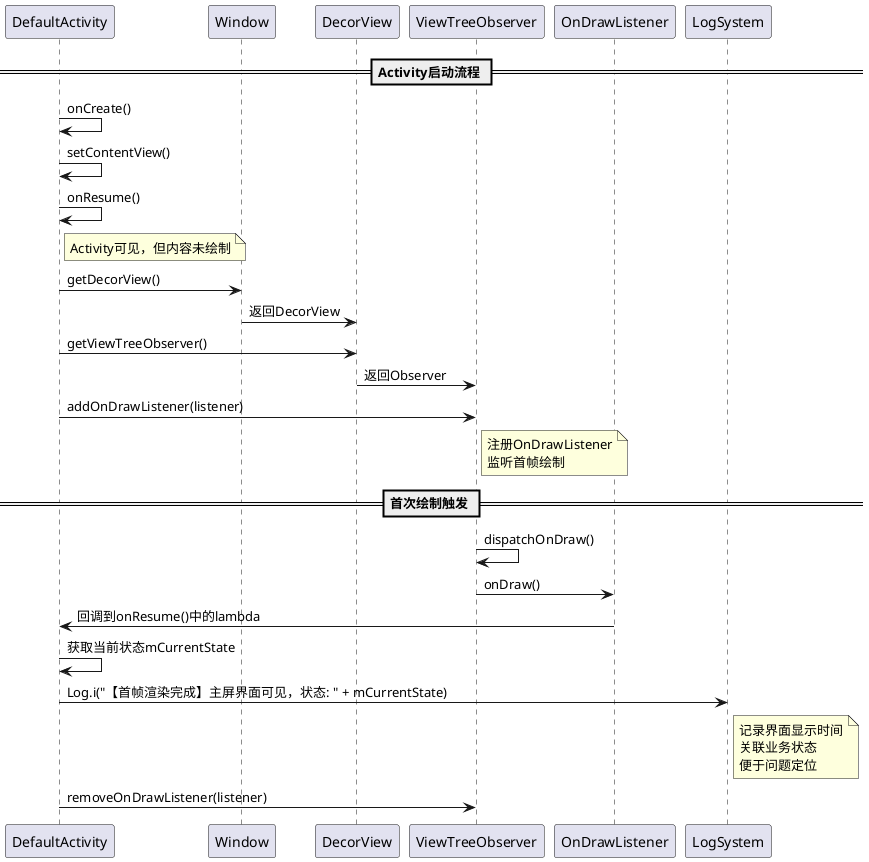

---

## 7. 代码实现示例

### 7.1 CoverScreenService完整实现

```java
// CoverScreenService.java

private void show() {
    Log.d(TAG, "show, mIsShowing=" + mIsShowing + ", isInset=" + isInset);
    mIsShowing = true;

    updateLanguageFeature();

    if (!mIsViewAdded) {
        addWindowOnce();
    }

    if (mView == null) {
        Log.e(TAG, "show: mView is null, cannot show");
        return;
    }

    if (isInset) {
        Log.d(TAG, "show: set VISIBLE directly");
        mView.setVisibility(View.VISIBLE);
        
        // 【关键实现】监听首次绘制完成
        mView.getViewTreeObserver().addOnDrawListener(new ViewTreeObserver.OnDrawListener() {
            @Override
            public void onDraw() {
                // 使用post延迟移除监听器，避免在dispatchOnDraw遍历时修改集合导致IllegalStateException
                final ViewTreeObserver.OnDrawListener listener = this;
                mView.post(() -> {
                    mView.getViewTreeObserver().removeOnDrawListener(listener);
                });
                
                long timestamp = System.currentTimeMillis();
                Log.i(TAG, "【首帧渲染完成】外屏界面用户现在真正可见，时间戳: " + timestamp);
            }
        });
    } else {
        Log.d(TAG, "show: request apply insets");
        ViewCompat.requestApplyInsets(mView);
    }

    hideStatusBar();
    requestFocusDelay();
}
```

### 7.2 DefaultActivity完整实现

```java
// DefaultActivity.java

@Override
protected void onResume() {
    super.onResume();
    
    // 【关键实现】监听首次绘制完成
    final View decorView = getWindow().getDecorView();
    decorView.getViewTreeObserver().addOnDrawListener(new ViewTreeObserver.OnDrawListener() {
        @Override
        public void onDraw() {
            // 使用post延迟移除监听器，避免在dispatchOnDraw遍历时修改集合导致IllegalStateException
            final ViewTreeObserver.OnDrawListener listener = this;
            decorView.post(() -> {
                decorView.getViewTreeObserver().removeOnDrawListener(listener);
            });
            
            long timestamp = System.currentTimeMillis();
            String currentState = mCurrentState != null ? mCurrentState.getClass().getSimpleName() : "null";
            Log.i(TAG, "【首帧渲染完成】主屏界面用户现在真正可见，时间戳: " + timestamp + "，当前状态: " + currentState);
        }
    });
}
```

---

## 8. 常见问题和解决方案

### 8.1 IllegalStateException: Cannot call removeOnDrawListener inside of onDraw

**问题描述**：
```
FATAL EXCEPTION: main
java.lang.IllegalStateException: Cannot call removeOnDrawListener inside of onDraw
at android.view.ViewTreeObserver.removeOnDrawListener(ViewTreeObserver.java:812)
at com.android.provision.activities.BaseActivity$1.onDraw(BaseActivity.java:106)
at android.view.ViewTreeObserver.dispatchOnDraw(ViewTreeObserver.java:1239)
```

**根本原因**：

在`ViewTreeObserver.dispatchOnDraw()`方法中，Framework正在遍历监听器列表：
```java
// ViewTreeObserver.java
final void dispatchOnDraw() {
    if (mOnDrawListeners != null) {
        final ArrayList<OnDrawListener> listeners = mOnDrawListeners;
        int numListeners = listeners.size();
        for (int i = 0; i < numListeners; ++i) {
            listeners.get(i).onDraw();  // 在这里回调应用层
        }
    }
}
```

如果在`onDraw()`回调中直接调用`removeOnDrawListener()`，会在遍历过程中修改集合，触发`IllegalStateException`。

**错误代码**：
```java
mView.getViewTreeObserver().addOnDrawListener(new ViewTreeObserver.OnDrawListener() {
    @Override
    public void onDraw() {
        // 错误：在回调中直接移除会抛异常
        mView.getViewTreeObserver().removeOnDrawListener(this);
        Log.i(TAG, "首帧渲染完成");
    }
});
```

**正确代码**：
```java
mView.getViewTreeObserver().addOnDrawListener(new ViewTreeObserver.OnDrawListener() {
    @Override
    public void onDraw() {
        // 正确：使用post延迟移除，等dispatchOnDraw()遍历完成后再移除
        final ViewTreeObserver.OnDrawListener listener = this;
        mView.post(() -> {
            mView.getViewTreeObserver().removeOnDrawListener(listener);
        });
        long timestamp = System.currentTimeMillis();
        Log.i(TAG, "【首帧渲染完成】时间戳: " + timestamp);
    }
});
```

**为什么post()可以解决**：

`View.post()`会将Runnable放入消息队列，在下一次Looper循环时执行，此时`dispatchOnDraw()`已经完成遍历：

```
时间线：
1. dispatchOnDraw() 开始遍历
2. onDraw() 回调触发
3. post(runnable) 将移除操作放入消息队列
4. onDraw() 返回
5. dispatchOnDraw() 继续遍历下一个监听器
6. dispatchOnDraw() 遍历完成，返回
7. Looper处理下一条消息
8. runnable执行，安全地移除监听器
```

**影响范围**：
- Android所有版本
- ViewTreeObserver的所有监听器（OnPreDrawListener、OnGlobalLayoutListener等）都有此问题
- 必须在遍历完成后才能修改监听器列表

---

## 9. 性能和注意事项

### 9.1 性能影响

| 项目 | 影响 | 说明 |
|------|------|------|
| CPU开销 | 极低 | 仅在主线程同步回调，耗时<1ms |
| 内存开销 | 极低 | 单个监听器对象，约几百字节 |
| 启动延迟 | 无 | 不影响绘制流程，异步回调 |
| 帧率影响 | 无 | 不阻塞渲染管线 |

### 8.2 注意事项

**1. 必须在主线程注册**
```java
// 正确
mView.post(() -> {
    mView.getViewTreeObserver().addOnDrawListener(listener);
});

// 错误：在子线程注册会抛异常
new Thread(() -> {
    mView.getViewTreeObserver().addOnDrawListener(listener);  // ViewRootImpl$CalledFromWrongThreadException
}).start();
```

**2. 及时移除监听器（关键：使用post延迟移除）**
```java
// 正确：使用post延迟移除，避免IllegalStateException
@Override
public void onDraw() {
    final ViewTreeObserver.OnDrawListener listener = this;
    mView.post(() -> {
        mView.getViewTreeObserver().removeOnDrawListener(listener);
    });
    // ... 处理逻辑
}

// 错误1：直接在onDraw中移除会抛IllegalStateException
@Override
public void onDraw() {
    mView.getViewTreeObserver().removeOnDrawListener(this);  // IllegalStateException!
    // 原因：dispatchOnDraw()正在遍历监听器列表，不能同时修改
}

// 错误2：不移除会导致每次绘制都回调
@Override
public void onDraw() {
    // 忘记移除，导致内存泄漏和重复回调
}
```

**为什么不能直接移除？**
```java
// ViewTreeObserver.java源码
final void dispatchOnDraw() {
    if (mOnDrawListeners != null) {
        final ArrayList<OnDrawListener> listeners = mOnDrawListeners;
        int numListeners = listeners.size();
        for (int i = 0; i < numListeners; ++i) {
            listeners.get(i).onDraw();  // 如果在这里调用remove，会抛异常
        }
    }
}
```
在遍历过程中修改集合会触发`IllegalStateException: Cannot call removeOnDrawListener inside of onDraw`。

**3. View未attach时的处理**
```java
// View未attach到Window时，getViewTreeObserver()返回临时Observer
// 需要在View.post()中注册，确保已attach

if (mView.isAttachedToWindow()) {
    mView.getViewTreeObserver().addOnDrawListener(listener);
} else {
    mView.post(() -> {
        mView.getViewTreeObserver().addOnDrawListener(listener);
    });
}
```

**4. 避免在onDraw()中执行耗时操作**
```java
// 正确：轻量级日志记录
@Override
public void onDraw() {
    mView.getViewTreeObserver().removeOnDrawListener(this);
    Log.i(TAG, "首帧渲染完成");
}

// 错误：耗时操作会阻塞主线程
@Override
public void onDraw() {
    mView.getViewTreeObserver().removeOnDrawListener(this);
    // 耗时操作：网络请求、数据库查询、大量计算
    performHeavyOperation();  // 会导致卡顿
}
```

### 8.3 与其他方案对比

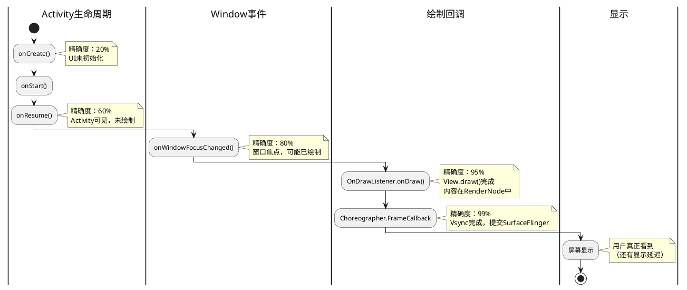

---

## 9. 日志分析实战

### 9.1 完整日志序列示例

**外屏显示日志（CoverScreenService）**：
```
11-04 10:23:45.123  CoverScreenService: mFoldStateListener:true, thread=main
11-04 10:23:45.125  CoverScreenService: show, mIsShowing=true, isInset=true
11-04 10:23:45.127  CoverScreenService: show: set VISIBLE directly
11-04 10:23:45.145  CoverScreenService: 【首帧渲染完成】外屏界面用户现在真正可见，时间戳: 1699067025145
```

**时间差分析**：
- 折叠触发 → 设置VISIBLE：2ms（标记可见）
- 设置VISIBLE → 首帧完成：18ms（measure/layout/draw完成）

**主屏显示日志（DefaultActivity）**：
```
11-04 10:23:50.200  DefaultActivity: DefaultActivity onCreate
11-04 10:23:50.215  DefaultActivity: onResume
11-04 10:23:50.230  DefaultActivity: here is onWindowFocusChanged
11-04 10:23:50.248  DefaultActivity: 【首帧渲染完成】主屏界面用户现在真正可见，时间戳: 1699067030248，当前状态: LanguageState
```

**时间差分析**：
- onCreate → onResume：15ms（生命周期）
- onResume → onWindowFocusChanged：15ms（窗口焦点）
- onWindowFocusChanged → 首帧完成：18ms（绘制完成）

### 9.2 日志对齐规则

在Jira问题分析中，使用OnDrawListener日志作为界面显示的精确时间锚点：

```
问题视频时间轴：           0:00    0:05    0:10    0:15    0:20
                          |-------|-------|-------|-------|
用户操作：                 打开     折叠    点击    返回
                                    ↓
日志时间戳：              10:23:45.145 （首帧渲染完成）
                                    ↓
后续事件对齐：            +2ms TalkBack播报
                          +50ms 动画完成
                          +500ms 用户点击
```

---

## 10. 总结

### 10.1 核心要点

1. **OnDrawListener.onDraw()** 是捕获View首次渲染完成的最准确、最轻量方案
2. 触发时机：View.draw()完成，内容已在RenderNode/Canvas中
3. 回调位置：ThreadedRenderer.onPostDraw() → ViewTreeObserver.dispatchOnDraw()
4. 必须在主线程注册，并在回调中立即移除监听器
5. 适用于Window、Activity、普通View的渲染监控

### 10.2 适用场景

- 性能统计：计算Activity启动到首屏显示耗时
- 日志分析：精确标记界面显示时间，便于问题定位
- 时间对齐：将视频帧、用户操作与日志时间线对齐
- 自动化测试：判断界面是否真正显示完成

### 10.3 推荐实践

| 场景 | 推荐方案 | 理由 |
|------|---------|------|
| Activity首屏显示 | OnDrawListener | 精确度高，代码简洁 |
| Fragment显示 | OnDrawListener | 可绑定到Fragment的根View |
| Window显示 | OnDrawListener | 监听DecorView的绘制 |
| 自定义View显示 | OnDrawListener | 监听自定义View本身 |
| 性能优化 | Choreographer.FrameCallback | 更精确，但代码复杂 |

---

## 11. 参考资料

### 11.1 Android Framework源码

- `frameworks/base/core/java/android/view/View.java`
- `frameworks/base/core/java/android/view/ViewTreeObserver.java`
- `frameworks/base/core/java/android/view/ViewRootImpl.java`
- `frameworks/base/core/java/android/view/ThreadedRenderer.java`

### 11.2 相关文档

- Android官方文档：[ViewTreeObserver](https://developer.android.com/reference/android/view/ViewTreeObserver)
- Android官方文档：[OnDrawListener](https://developer.android.com/reference/android/view/ViewTreeObserver.OnDrawListener)
- Android性能优化：[reportFullyDrawn()](https://developer.android.com/topic/performance/vitals/launch-time#time-full)

---

## 元数据

- **文档版本**: v1.0
- **最后更新**: 2025-11-04
- **维护者**: 开机引导团队
- **适用项目**: MiuiProvisionAosp
