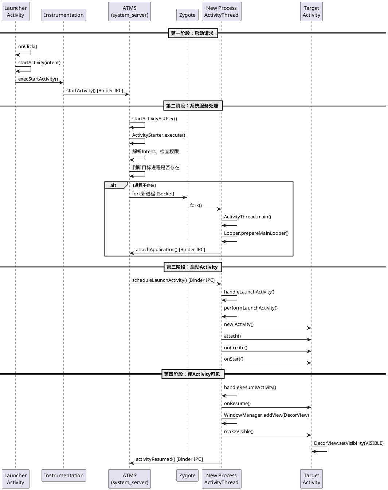

# 实践案例：Activity启动流程完整分析

## 📌 分析目标

理解从应用点击图标到Activity显示的完整流程，涉及：
- Launcher启动流程
- AMS处理流程
- 进程创建流程
- Activity生命周期回调

---

## 🎯 第一步：确定入口点

### 1.1 Launcher点击事件

**文件位置：**
```
packages/apps/Launcher3/src/com/android/launcher3/
├── Launcher.java                    # Launcher主Activity
└── BubbleTextView.java              # 应用图标View
```

**关键代码：**

```java:packages/apps/Launcher3/src/com/android/launcher3/BubbleTextView.java
public void onClick(View v) {
    // 点击应用图标
    Object tag = v.getTag();
    if (tag instanceof ShortcutInfo) {
        onClickAppShortcut(v, (ShortcutInfo) tag, launcher);
    }
}

// 启动应用
boolean startActivitySafely(View v, Intent intent) {
    startActivity(intent);
}
```

**分析要点：**
- Launcher如何响应点击事件？
- Intent如何构造？包含哪些信息？
- 使用的启动Flag是什么？（FLAG_ACTIVITY_NEW_TASK）

---

## 🎯 第二步：Activity启动请求

### 2.1 Activity.startActivity()

**文件位置：**
```
frameworks/base/core/java/android/app/Activity.java
```

**关键代码追踪：**

```java:frameworks/base/core/java/android/app/Activity.java
@Override
public void startActivity(Intent intent) {
    this.startActivity(intent, null);
}

@Override
public void startActivity(Intent intent, @Nullable Bundle options) {
    if (options != null) {
        startActivityForResult(intent, -1, options);
    } else {
        startActivityForResult(intent, -1);
    }
}

public void startActivityForResult(@RequiresPermission Intent intent, 
                                   int requestCode, 
                                   @Nullable Bundle options) {
    // 关键调用
    Instrumentation.ActivityResult ar = mInstrumentation.execStartActivity(
        this,                              // who
        mMainThread.getApplicationThread(), // contextThread
        mToken,                            // token
        this,                              // target
        intent,                            // intent
        requestCode,                       // requestCode
        options                            // options
    );
}
```

**数据流分析：**
```
参数说明：
├── who: 当前Activity实例
├── contextThread: ApplicationThread (Binder对象，用于回调)
├── mToken: Activity的唯一标识（IBinder）
├── intent: 启动意图
└── options: 启动选项（动画、窗口大小等）
```

---

### 2.2 Instrumentation.execStartActivity()

**文件位置：**
```
frameworks/base/core/java/android/app/Instrumentation.java
```

**关键代码：**

```java:frameworks/base/core/java/android/app/Instrumentation.java
public ActivityResult execStartActivity(
        Context who, IBinder contextThread, IBinder token, Activity target,
        Intent intent, int requestCode, Bundle options) {
    
    // 获取ApplicationThread (Binder客户端)
    IApplicationThread whoThread = (IApplicationThread) contextThread;
    
    try {
        // 关键调用：跨进程调用AMS
        int result = ActivityTaskManager.getService().startActivity(
            whoThread,                      // caller
            who.getBasePackageName(),       // callingPackage
            who.getAttributionTag(),        // callingAttributionTag
            intent,                         // intent
            intent.resolveTypeIfNeeded(who.getContentResolver()), // resolvedType
            token,                          // resultTo
            target != null ? target.mEmbeddedID : null, // resultWho
            requestCode,                    // requestCode
            0,                              // startFlags
            null,                           // profilerInfo
            options                         // bOptions
        );
        
        // 检查启动结果
        checkStartActivityResult(result, intent);
        
    } catch (RemoteException e) {
        throw new RuntimeException("Failure from system", e);
    }
    return null;
}
```

**重要注解：**
- `ActivityTaskManager.getService()` 返回的是ATMS的Binder代理对象
- 这里发生了进程间通信（IPC）：应用进程 → system_server进程

---

### 2.3 ActivityTaskManager.getService()

**文件位置：**
```
frameworks/base/core/java/android/app/ActivityTaskManager.java
```

**关键代码：**

```java:frameworks/base/core/java/android/app/ActivityTaskManager.java
public static IActivityTaskManager getService() {
    return IActivityTaskManagerSingleton.get();
}

@UnsupportedAppUsage(trackingBug = 129726065)
private static final Singleton<IActivityTaskManager> IActivityTaskManagerSingleton =
        new Singleton<IActivityTaskManager>() {
            @Override
            protected IActivityTaskManager create() {
                // 从ServiceManager获取ATMS的Binder代理
                final IBinder b = ServiceManager.getService(Context.ACTIVITY_TASK_SERVICE);
                return IActivityTaskManager.Stub.asInterface(b);
            }
        };
```

**Binder通信架构：**
```
┌─────────────────────────┐
│  Application Process    │
│  ┌──────────────────┐   │
│  │ IActivityTaskManager.Stub.Proxy │  ← Binder客户端
│  └──────────┬───────┘   │
└─────────────┼───────────┘
              │ Binder IPC
              ↓
┌─────────────────────────┐
│  system_server Process  │
│  ┌──────────────────┐   │
│  │ ActivityTaskManagerService │  ← Binder服务端
│  └──────────────────┘   │
└─────────────────────────┘
```

---

## 🎯 第三步：系统服务处理

### 3.1 ATMS.startActivity()

**文件位置：**
```
frameworks/base/services/core/java/com/android/server/wm/ActivityTaskManagerService.java
```

**关键方法调用链：**

```java
ActivityTaskManagerService.startActivity()
  ↓
ActivityTaskManagerService.startActivityAsUser()
  ↓
ActivityStarter.execute()
  ↓
ActivityStarter.executeRequest()
  ↓
ActivityStarter.startActivityUnchecked()
  ↓
RootWindowContainer.resumeFocusedTasksTopActivities()
  ↓
Task.resumeTopActivityUncheckedLocked()
  ↓
TaskFragment.resumeTopActivity()
  ↓
ActivityStackSupervisor.startSpecificActivity()
```

**核心代码分析：**

```java:frameworks/base/services/core/java/com/android/server/wm/ActivityTaskManagerService.java
@Override
public final int startActivity(IApplicationThread caller, String callingPackage,
        String callingFeatureId, Intent intent, String resolvedType, IBinder resultTo,
        String resultWho, int requestCode, int startFlags, ProfilerInfo profilerInfo,
        Bundle bOptions) {
    
    // 调用startActivityAsUser，使用当前用户ID
    return startActivityAsUser(caller, callingPackage, callingFeatureId, intent,
            resolvedType, resultTo, resultWho, requestCode, startFlags, profilerInfo,
            bOptions, UserHandle.getCallingUserId());
}

int startActivityAsUser(IApplicationThread caller, String callingPackage,
        String callingFeatureId, Intent intent, String resolvedType, IBinder resultTo,
        String resultWho, int requestCode, int startFlags, ProfilerInfo profilerInfo,
        Bundle bOptions, int userId) {
    
    // 权限检查
    enforceNotIsolatedCaller("startActivityAsUser");
    
    // 使用ActivityStarter执行启动
    return getActivityStartController().obtainStarter(intent, "startActivityAsUser")
            .setCaller(caller)
            .setCallingPackage(callingPackage)
            .setResolvedType(resolvedType)
            .setResultTo(resultTo)
            .setRequestCode(requestCode)
            .setStartFlags(startFlags)
            .setUserId(userId)
            .execute();
}
```

---

### 3.2 ActivityStarter.execute()

**文件位置：**
```
frameworks/base/services/core/java/com/android/server/wm/ActivityStarter.java
```

**核心职责：**
1. 解析Intent，确定目标Activity
2. 检查权限和配置
3. 确定启动模式（standard/singleTop/singleTask/singleInstance）
4. 创建或复用Task
5. 决定是否需要创建新进程

**关键代码：**

```java:frameworks/base/services/core/java/com/android/server/wm/ActivityStarter.java
int execute() {
    try {
        // 执行启动请求
        int res = executeRequest(mRequest);
        
        // 后续处理
        mLastStartActivityResult = res;
        return res;
    } finally {
        onExecutionComplete();
    }
}

private int executeRequest(Request request) {
    // 解析Intent信息
    ActivityInfo aInfo = resolveActivity(mIntent, mResolvedType, mStartFlags, ...);
    
    // 检查权限
    if (!verifyPermissions(aInfo)) {
        return START_PERMISSION_DENIED;
    }
    
    // 检查是否需要创建新进程
    final ActivityRecord r = new ActivityRecord(...);
    
    // 执行启动
    return startActivityUnchecked(r, sourceRecord, ...);
}
```

---

### 3.3 进程创建判断

**关键逻辑：**

```java:frameworks/base/services/core/java/com/android/server/wm/ActivityStackSupervisor.java
void startSpecificActivity(ActivityRecord r, boolean andResume, boolean checkConfig) {
    // 获取目标进程
    final WindowProcessController wpc =
            mService.getProcessController(r.processName, r.info.applicationInfo.uid);
    
    boolean knownToBeDead = false;
    if (wpc != null && wpc.hasThread()) {
        // 进程已存在，直接启动Activity
        try {
            realStartActivityLocked(r, wpc, andResume, checkConfig);
            return;
        } catch (RemoteException e) {
            knownToBeDead = true;
        }
    }
    
    // 进程不存在，需要创建新进程
    mService.mAmInternal.startProcess(
            r.processName,                  // 进程名
            r.info.applicationInfo,         // 应用信息
            knownToBeDead,
            "activity",                     // 启动原因
            r.intent.getComponent()         // 组件名
    );
}
```

---

## 🎯 第四步：进程创建（Zygote Fork）

### 4.1 AMS请求Zygote

**文件位置：**
```
frameworks/base/services/core/java/com/android/server/am/ActivityManagerService.java
frameworks/base/core/java/com/android/internal/os/ZygoteProcess.java
```

**调用链：**
```
ActivityManagerService.startProcessLocked()
  ↓
ProcessList.startProcessLocked()
  ↓
ProcessList.startProcess()
  ↓
ZygoteProcess.start()
  ↓
ZygoteProcess.startViaZygote()
  ↓
ZygoteProcess.zygoteSendArgsAndGetResult()
```

**关键代码：**

```java:frameworks/base/core/java/com/android/internal/os/ZygoteProcess.java
public final Process.ProcessStartResult start(
        final String processClass,      // "android.app.ActivityThread"
        final String niceName,           // 进程名
        int uid, int gid,
        int[] gids,
        int runtimeFlags,
        int mountExternal,
        int targetSdkVersion,
        String seInfo,
        String abi,
        String instructionSet,
        String appDataDir,
        String invokeWith,
        String packageName,
        String[] zygoteArgs) {
    
    try {
        return startViaZygote(processClass, niceName, uid, gid, gids,
                runtimeFlags, mountExternal, targetSdkVersion, seInfo,
                abi, instructionSet, appDataDir, invokeWith, false,
                packageName, zygoteArgs);
    } catch (ZygoteStartFailedEx ex) {
        throw new RuntimeException("Starting VM process failed", ex);
    }
}

// 通过Socket与Zygote通信
private Process.ProcessStartResult zygoteSendArgsAndGetResult(
        ZygoteState zygoteState, ArrayList<String> args) throws ZygoteStartFailedEx {
    
    // 打开与Zygote的Socket连接
    final BufferedWriter writer = zygoteState.writer;
    final DataInputStream inputStream = zygoteState.inputStream;
    
    // 发送启动参数
    writer.write(Integer.toString(args.size()));
    writer.newLine();
    
    for (String arg : args) {
        writer.write(arg);
        writer.newLine();
    }
    
    writer.flush();
    
    // 读取结果（新进程PID）
    Process.ProcessStartResult result = new Process.ProcessStartResult();
    result.pid = inputStream.readInt();
    
    return result;
}
```

**Zygote通信架构：**
```
┌──────────────────────┐
│  system_server       │
│  (AMS)               │
└──────────┬───────────┘
           │ Socket通信
           │ /dev/socket/zygote
           ↓
┌──────────────────────┐
│  Zygote进程          │
│  - fork()新进程      │
│  - 预加载资源        │
└──────────┬───────────┘
           │ fork
           ↓
┌──────────────────────┐
│  新应用进程          │
│  (启动ActivityThread)│
└──────────────────────┘
```

---

### 4.2 ActivityThread.main()

**文件位置：**
```
frameworks/base/core/java/android/app/ActivityThread.java
```

**新进程的入口点：**

```java:frameworks/base/core/java/android/app/ActivityThread.java
public static void main(String[] args) {
    // 跟踪启动时间
    Trace.traceBegin(Trace.TRACE_TAG_ACTIVITY_MANAGER, "ActivityThreadMain");
    
    // 初始化环境
    Environment.initForCurrentUser();
    
    // 初始化主线程Looper
    Looper.prepareMainLooper();
    
    // 创建ActivityThread实例
    ActivityThread thread = new ActivityThread();
    thread.attach(false, startSeq);
    
    // 获取主线程Handler
    if (sMainThreadHandler == null) {
        sMainThreadHandler = thread.getHandler();
    }
    
    Trace.traceEnd(Trace.TRACE_TAG_ACTIVITY_MANAGER);
    
    // 开始消息循环
    Looper.loop();
    
    // 正常情况不会执行到这里
    throw new RuntimeException("Main thread loop unexpectedly exited");
}
```

---

### 4.3 ActivityThread.attach()

**绑定到AMS：**

```java:frameworks/base/core/java/android/app/ActivityThread.java
private void attach(boolean system, long startSeq) {
    sCurrentActivityThread = this;
    mSystemThread = system;
    
    if (!system) {
        // 应用进程模式
        
        // 获取AMS的Binder代理
        final IActivityManager mgr = ActivityManager.getService();
        
        try {
            // 关键：绑定应用到AMS
            mgr.attachApplication(mAppThread, startSeq);
        } catch (RemoteException ex) {
            throw ex.rethrowFromSystemServer();
        }
        
        // 监听GC
        BinderInternal.addGcWatcher(new Runnable() {
            @Override
            public void run() {
                Runtime runtime = Runtime.getRuntime();
                long dalvikMax = runtime.maxMemory();
                long dalvikUsed = runtime.totalMemory() - runtime.freeMemory();
                if (dalvikUsed > ((3*dalvikMax)/4)) {
                    // 内存使用超过75%，手动触发GC
                    runtime.gc();
                }
            }
        });
    } else {
        // SystemServer模式（此处不详述）
    }
}
```

**ApplicationThread的作用：**
```java
// ApplicationThread是ActivityThread的内部类
// 实现了IApplicationThread.Stub，是AMS回调应用的Binder接口
private class ApplicationThread extends IApplicationThread.Stub {
    
    // AMS调用此方法启动Activity
    @Override
    public final void scheduleTransaction(ClientTransaction transaction) {
        ActivityThread.this.scheduleTransaction(transaction);
    }
    
    // ... 其他生命周期回调方法
}
```

---

## 🎯 第五步：Activity生命周期启动

### 5.1 AMS通知应用启动Activity

**回到ActivityStackSupervisor：**

```java:frameworks/base/services/core/java/com/android/server/wm/ActivityStackSupervisor.java
boolean realStartActivityLocked(ActivityRecord r, WindowProcessController proc,
        boolean andResume, boolean checkConfig) throws RemoteException {
    
    try {
        // 创建启动事务
        final ClientTransaction clientTransaction = ClientTransaction.obtain(
                proc.getThread(),   // IApplicationThread
                r.appToken);        // IBinder token
        
        // 添加LaunchActivityItem
        clientTransaction.addCallback(LaunchActivityItem.obtain(
                new Intent(r.intent),
                System.identityHashCode(r),
                r.info,
                config,
                r.compat,
                r.launchedFromPackage,
                task.voiceInteractor,
                proc.getReportedProcState(),
                r.getSavedState(),
                r.getPersistentSavedState(),
                results,
                newIntents,
                dc.isNextTransitionForward(),
                proc.createProfilerInfoIfNeeded(),
                r.assistToken,
                r.shareableActivityToken
        ));
        
        // 设置最终生命周期状态
        final ActivityLifecycleItem lifecycleItem;
        if (andResume) {
            lifecycleItem = ResumeActivityItem.obtain(dc.isNextTransitionForward());
        } else {
            lifecycleItem = PauseActivityItem.obtain();
        }
        clientTransaction.setLifecycleStateRequest(lifecycleItem);
        
        // 执行事务（Binder调用）
        mService.getLifecycleManager().scheduleTransaction(clientTransaction);
        
    } catch (RemoteException e) {
        throw e;
    }
    
    return true;
}
```

---

### 5.2 应用进程处理启动事务

**TransactionExecutor执行事务：**

```java:frameworks/base/core/java/android/app/servertransaction/TransactionExecutor.java
public void execute(ClientTransaction transaction) {
    // 执行所有回调（如LaunchActivityItem）
    executeCallbacks(transaction);
    
    // 执行生命周期状态转换（如ResumeActivityItem）
    executeLifecycleState(transaction);
}

public void executeCallbacks(ClientTransaction transaction) {
    final List<ClientTransactionItem> callbacks = transaction.getCallbacks();
    
    for (int i = 0; i < callbacks.size(); ++i) {
        final ClientTransactionItem item = callbacks.get(i);
        
        // 执行LaunchActivityItem.execute()
        item.execute(mTransactionHandler, token, mPendingActions);
    }
}
```

---

### 5.3 LaunchActivityItem.execute()

**创建Activity实例：**

```java:frameworks/base/core/java/android/app/servertransaction/LaunchActivityItem.java
@Override
public void execute(ClientTransactionHandler client, IBinder token,
        PendingTransactionActions pendingActions) {
    
    Trace.traceBegin(TRACE_TAG_ACTIVITY_MANAGER, "activityStart");
    
    // client是ActivityThread
    ActivityClientRecord r = new ActivityClientRecord(token, mIntent, mIdent, mInfo,
            mOverrideConfig, mCompatInfo, mReferrer, mVoiceInteractor, mState,
            mPersistentState, mPendingResults, mPendingNewIntents, mIsForward,
            mProfilerInfo, client, mAssistToken, mShareableActivityToken);
    
    // 调用ActivityThread.handleLaunchActivity()
    client.handleLaunchActivity(r, pendingActions, null);
    
    Trace.traceEnd(TRACE_TAG_ACTIVITY_MANAGER);
}
```

---

### 5.4 ActivityThread.handleLaunchActivity()

**核心启动逻辑：**

```java:frameworks/base/core/java/android/app/ActivityThread.java
@Override
public Activity handleLaunchActivity(ActivityClientRecord r,
        PendingTransactionActions pendingActions, Intent customIntent) {
    
    // 预备工作
    WindowManagerGlobal.initialize();
    
    // 创建Activity实例并调用onCreate()
    final Activity a = performLaunchActivity(r, customIntent);
    
    if (a != null) {
        // 设置窗口配置
        r.createdConfig = new Configuration(mConfiguration);
        
        // 报告启动完成
        if (!r.activity.mFinished && pendingActions != null) {
            pendingActions.setOldState(r.state);
            pendingActions.setRestoreInstanceState(true);
            pendingActions.setCallOnPostCreate(true);
        }
    } else {
        // 启动失败，通知AMS
        try {
            ActivityTaskManager.getService()
                .finishActivity(r.token, Activity.RESULT_CANCELED, null, false);
        } catch (RemoteException ex) {
            throw ex.rethrowFromSystemServer();
        }
    }
    
    return a;
}
```

---

### 5.5 ActivityThread.performLaunchActivity()

**创建Activity并调用onCreate：**

```java:frameworks/base/core/java/android/app/ActivityThread.java
private Activity performLaunchActivity(ActivityClientRecord r, Intent customIntent) {
    
    // 1. 创建Context
    ContextImpl appContext = createBaseContextForActivity(r);
    Activity activity = null;
    
    try {
        // 2. 通过ClassLoader创建Activity实例
        java.lang.ClassLoader cl = appContext.getClassLoader();
        activity = mInstrumentation.newActivity(
                cl, component.getClassName(), r.intent);
        
        // 3. 创建Application（如果还没创建）
        Application app = r.packageInfo.makeApplication(false, mInstrumentation);
        
        if (activity != null) {
            // 4. 初始化Activity
            appContext.setOuterContext(activity);
            activity.attach(appContext, this, getInstrumentation(), r.token,
                    r.ident, app, r.intent, r.activityInfo, title, r.parent,
                    r.embeddedID, r.lastNonConfigurationInstances, config,
                    r.referrer, r.voiceInteractor, window, r.configCallback,
                    r.assistToken, r.shareableActivityToken);
            
            // 5. 调用Activity.onCreate()
            if (r.isPersistable()) {
                mInstrumentation.callActivityOnCreate(activity, r.state, r.persistentState);
            } else {
                mInstrumentation.callActivityOnCreate(activity, r.state);
            }
            
            // 6. 调用Activity.onStart()
            if (!r.activity.mFinished) {
                activity.performStart();
                r.stopped = false;
            }
            
            // 7. 调用Activity.onRestoreInstanceState()
            if (!r.activity.mFinished) {
                if (r.isPersistable()) {
                    if (r.state != null || r.persistentState != null) {
                        mInstrumentation.callActivityOnRestoreInstanceState(activity, r.state,
                                r.persistentState);
                    }
                } else if (r.state != null) {
                    mInstrumentation.callActivityOnRestoreInstanceState(activity, r.state);
                }
            }
            
            // 8. 调用Activity.onPostCreate()
            if (!r.activity.mFinished) {
                activity.mCalled = false;
                if (r.isPersistable()) {
                    mInstrumentation.callActivityOnPostCreate(activity, r.state,
                            r.persistentState);
                } else {
                    mInstrumentation.callActivityOnPostCreate(activity, r.state);
                }
            }
        }
        
        r.paused = true;
        mActivities.put(r.token, r);
        
    } catch (Exception e) {
        // 异常处理
    }
    
    return activity;
}
```

---

### 5.6 Instrumentation.callActivityOnCreate()

**最终调用到应用代码：**

```java:frameworks/base/core/java/android/app/Instrumentation.java
public void callActivityOnCreate(Activity activity, Bundle icicle) {
    prePerformCreate(activity);
    
    // 调用Activity.onCreate()
    activity.performCreate(icicle);
    
    postPerformCreate(activity);
}
```

```java:frameworks/base/core/java/android/app/Activity.java
final void performCreate(Bundle icicle) {
    performCreate(icicle, null);
}

final void performCreate(Bundle icicle, PersistableBundle persistentState) {
    // 调用开发者重写的onCreate()方法
    if (persistentState != null) {
        onCreate(icicle, persistentState);
    } else {
        onCreate(icicle);
    }
    
    // Fragment状态恢复
    mFragments.dispatchActivityCreated();
}
```

---

## 🎯 第六步：Activity可见（onResume）

### 6.1 ResumeActivityItem.execute()

**文件位置：**
```
frameworks/base/core/java/android/app/servertransaction/ResumeActivityItem.java
```

**关键代码：**

```java:frameworks/base/core/java/android/app/servertransaction/ResumeActivityItem.java
@Override
public void execute(ClientTransactionHandler client, IBinder token,
        PendingTransactionActions pendingActions) {
    
    Trace.traceBegin(TRACE_TAG_ACTIVITY_MANAGER, "activityResume");
    
    // 调用ActivityThread.handleResumeActivity()
    client.handleResumeActivity(token, true, mIsForward, "RESUME_ACTIVITY");
    
    Trace.traceEnd(TRACE_TAG_ACTIVITY_MANAGER);
}
```

---

### 6.2 ActivityThread.handleResumeActivity()

**使Activity可见：**

```java:frameworks/base/core/java/android/app/ActivityThread.java
@Override
public void handleResumeActivity(IBinder token, boolean finalStateRequest, boolean isForward,
        String reason) {
    
    // 调用Activity.onResume()
    final ActivityClientRecord r = performResumeActivity(token, finalStateRequest, reason);
    
    final Activity a = r.activity;
    
    if (r.window == null && !a.mFinished && willBeVisible) {
        r.window = r.activity.getWindow();
        View decor = r.window.getDecorView();
        
        // DecorView初始设为不可见
        decor.setVisibility(View.INVISIBLE);
        
        ViewManager wm = a.getWindowManager();
        WindowManager.LayoutParams l = r.window.getAttributes();
        a.mDecor = decor;
        
        l.type = WindowManager.LayoutParams.TYPE_BASE_APPLICATION;
        l.softInputMode |= forwardBit;
        
        if (a.mVisibleFromClient) {
            if (!a.mWindowAdded) {
                a.mWindowAdded = true;
                
                // 将DecorView添加到WindowManager
                // 这会触发View的measure/layout/draw流程
                wm.addView(decor, l);
            }
        }
    }
    
    // 设置Activity可见
    if (!r.activity.mFinished && willBeVisible && r.activity.mDecor != null && !r.hideForNow) {
        // 使DecorView可见
        if (r.activity.mVisibleFromClient) {
            r.activity.makeVisible();
        }
    }
    
    // 通知AMS Resume完成
    ActivityClient.getInstance().activityResumed(r.token);
}
```

---

### 6.3 Activity.makeVisible()

**最终显示：**

```java:frameworks/base/core/java/android/app/Activity.java
void makeVisible() {
    if (!mWindowAdded) {
        ViewManager wm = getWindowManager();
        wm.addView(mDecor, getWindow().getAttributes());
        mWindowAdded = true;
    }
    // 设置为可见
    mDecor.setVisibility(View.VISIBLE);
}
```

---

## 📊 完整时序图



---

## 🔍 关键知识点总结

### 1. Binder IPC通信
- **跨进程调用**：应用进程 ↔ system_server
- **关键接口**：IActivityTaskManager、IApplicationThread
- **通信方向**：双向（应用调用系统服务，系统服务回调应用）

### 2. 进程创建
- **Zygote机制**：预加载类和资源，fork新进程
- **Socket通信**：system_server通过Socket与Zygote通信
- **进程入口**：ActivityThread.main()

### 3. 消息机制
- **主线程Looper**：ActivityThread.main()中创建
- **Handler机制**：处理各种生命周期事件
- **异步执行**：系统服务的调用通过Handler发送到主线程

### 4. 生命周期
```
onCreate() → onStart() → onResume() → Activity可见
```

### 5. Window/View系统
- **DecorView**：Activity的根View
- **WindowManager**：管理窗口显示
- **makeVisible()**：最终显示到屏幕

---

## 🛠️ 实践验证方法

### 1. 添加日志追踪

在关键位置添加日志：

```java
// Activity.java - startActivity()
Log.d("ActivityStart", "1. Activity.startActivity() called, intent=" + intent);

// Instrumentation.java - execStartActivity()
Log.d("ActivityStart", "2. Instrumentation.execStartActivity() caller=" + who);

// ActivityThread.java - main()
Log.d("ActivityStart", "3. ActivityThread.main() entered, pid=" + Process.myPid());

// ActivityThread.java - performLaunchActivity()
Log.d("ActivityStart", "4. performLaunchActivity() component=" + r.intent.getComponent());

// Activity.java - onCreate()
Log.d("ActivityStart", "5. Activity.onCreate() called, activity=" + this);
```

### 2. 使用Logcat过滤

```bash
# 追踪Activity启动
adb logcat -s ActivityTaskManager:V ActivityManager:V ActivityThread:V

# 追踪Binder调用
adb logcat -s Binder:V

# 追踪进程创建
adb logcat -s Zygote:V Process:V
```

### 3. 使用Systrace分析

```bash
# 录制启动trace
python systrace.py -t 10 -o activity_start.html \
    am wm view dalvik sched gfx

# 分析关键时间点
- Application: activityStart
- ActivityManager: activityResume
- ViewRootImpl: performTraversals
```

---

## ✅ 学习检查清单

完成以下任务，确保理解完整流程：

- [ ] 能画出Activity启动完整时序图
- [ ] 能解释Binder在其中的作用
- [ ] 能说明Zygote fork的时机和过程
- [ ] 能追踪onCreate/onStart/onResume的调用链
- [ ] 能解释DecorView如何显示到屏幕
- [ ] 能在源码中找到所有关键类和方法
- [ ] 能添加日志验证整个流程
- [ ] 能分析Systrace中的启动耗时

---

**文档版本：** v1.0  
**更新日期：** 2025-10-25  
**适用场景：** Android 12+ AOSP源码分析

