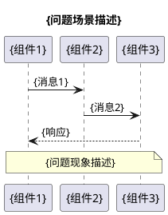
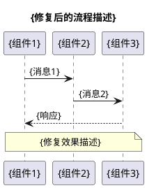
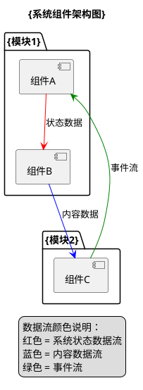
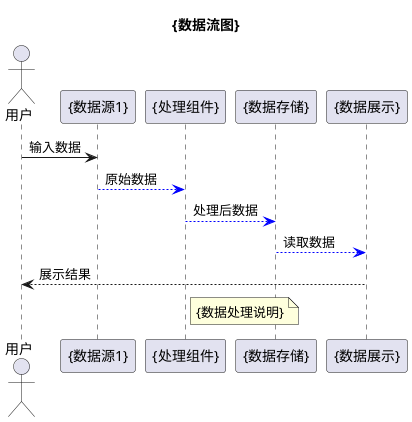
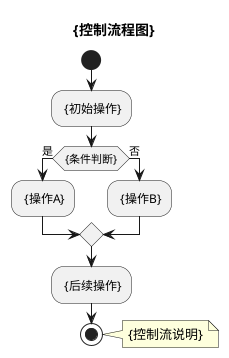
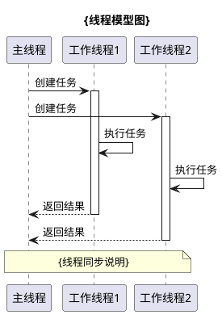
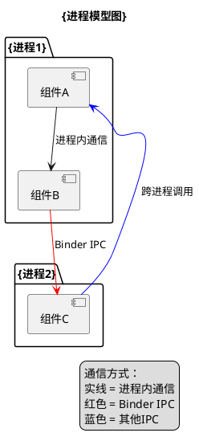
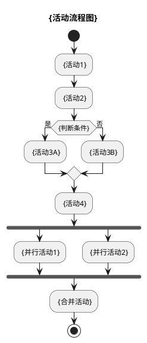

# {Jira单号} {问题标题}问题分析

## 第一阶段：信息收集

### 1.1 基本信息

| 项目 | 内容 |
|------|------|
| Jira单号 | {Jira单号} |
| 问题标题 | {问题标题} |
| 机型 | {机型名称}（代号：{设备代号}） |
| 设备类型 | {设备类型，如：折叠屏翻盖手机（Flip）、折叠屏大屏（Fold）、普通手机等} |
| Android版本 | {Android版本号} |
| HyperOS版本 | {HyperOS版本号} |
| 分支类型 | {分支类型，如：w-stable、v-pre、master等} |
| 组件 | {组件名称，如：开机引导 Provision} |
| 问题类型 | {问题类型，如：故障、功能缺失、性能问题等} |
| 优先级 | {优先级，如：严重、高、中、低} |
| 复现概率 | {复现概率，如：必现（Every time）、高概率、偶现等} |
| Bug分类 | {Bug分类，如：显示 Display、崩溃 Crash、功能 Function等} |
| 测试方法 | {测试方法，如：手工测试 Manual Testing、自动化测试等} |
| 经办人 | {经办人姓名} |
| 报告人 | {报告人姓名} |
| 创建时间 | {创建时间，格式：YYYY-MM-DD HH:MM} |
| 最后更新 | {最后更新时间，格式：YYYY-MM-DD HH:MM} |

### 1.2 问题描述

**测试类型**：{测试类型，如：功能测试、性能测试、兼容性测试等}

**复现概率**：{复现概率}

**前提条件**：{问题发生的前提条件，如：设备首次开机、恢复出厂设置后、特定操作后等}

**复现步骤**：
1. {步骤1}
2. {步骤2}
3. {步骤3}
...（根据实际情况添加更多步骤）

**预期结果**：{预期应该出现的结果}

**实际结果**：{实际出现的结果，描述问题现象}

**是否可恢复**：{是否可恢复，如：恢复操作容易、需要重启、无法恢复等}

### 1.3 附件信息

1. **视频文件**：{视频文件名}（{文件大小}）
2. **截图文件**：
   - {截图文件名1}
   - {截图文件名2}
   - ...（根据实际情况添加）
3. **日志文件**：{日志文件名}（{文件大小}）
4. **Kpan日志链接**：{Kpan链接}（密码：{密码}）
5. **提效工具日志**：{提效工具日志链接}（如有）

### 1.4 视频帧分析

使用ffmpeg从视频中提取关键帧，逐帧分析如下：

**帧X（X秒）**：

{描述该帧显示的内容和问题现象}

**帧Y（Y秒）**：

{描述该帧显示的内容和问题现象}

...（根据实际情况添加更多关键帧分析）

**关键发现**：
1. {关键发现1}
2. {关键发现2}
3. {关键发现3}
...（根据实际情况添加更多发现）

---

## 第二阶段：文档声明

### 2.1 唯一性声明

本文档是Jira问题单{单号}的唯一官方分析文档。任何关于该问题的分析结论、根因定位、解决方案、测试验证均以本文档为准。

### 2.2 文档版本

| 版本 | 日期 | 修改人 | 修改说明 |
|------|------|--------|----------|
| v1.0 | {日期} | {修改人} | 初始版本，完成根因分析和解决方案设计 |

### 2.3 参考文档

1. Jira问题单：https://jira-phone.mioffice.cn/browse/{Jira单号}
2. UI设计规范：https://www.figma.com/design/qoKmZPVm8vUjcjfAIe6ahi/%E5%BC%80%E6%9C%BA%E5%BC%95%E5%AF%BCota?node-id=10068-23223&p=f&t=EruSQsX9WFk09bwd-0
3. 相关代码仓库：{代码路径}
4. PRD文档：
   - 国内版：https://mi.feishu.cn/docx/S46IdxOZzoEmnxx5ZkEcaro0n2e
   - 国际版：https://mi.feishu.cn/docx/CBGWdidZSoRrlmx4O3fcCg33nVc

---

## 第三阶段：日志分析

### 3.1 日志采集说明

**日志采集时间**：{日志采集时间，格式：YYYY-MM-DD HH:MM:SS}

**问题发生时间**：{问题发生时间，格式：YYYY-MM-DD HH:MM}（根据视频文件名或问题描述）

**时间差异说明**：
- 日志采集时间与问题发生时间的对比
- 时间差：{时间差，如：X小时、X分钟等}
- 说明：{说明日志是否为问题现场实时采集，如果不是，说明原因}
- {如果是开机引导模块，说明：开机引导是出厂后第一个应用，设备未联网，系统时间未通过NTP同步，日志的绝对时间戳可能不准确，但事件的相对顺序、时间间隔、系统配置信息都是可信的}

### 3.2 问题时间线

基于视频分析的时间线（相对时间）或日志分析的时间线（绝对时间）：

```log
// 阶段1：{阶段描述}（{时间范围}）

{时间戳}  {进程/组件}: {日志内容或事件描述}
        （{注释说明}）

// 阶段2：{阶段描述}（{时间范围}）【问题阶段】

{时间戳}  {进程/组件}: {日志内容或事件描述}
        {问题发生时间点！问题现象描述}

// 阶段3：{阶段描述}（{时间范围}）

{时间戳}  {进程/组件}: {日志内容或事件描述}
        （{注释说明}）
```

**注意**：
- 所有日志必须在一个连贯的```log ... ```代码块中
- 不要用三级标题拆分时间线
- 使用注释标注阶段，格式：`// {阶段描述}（{时间范围}）`
- 保留完整的原始日志格式，包括时间戳和进程信息
- 使用中文括号添加注释说明
- 标注问题发生的准确时间点，格式：`{问题发生时间点！问题现象描述}`

### 3.3 关键发现

1. {关键发现1：问题发生的时间点和位置}
2. {关键发现2：用户操作时序}
3. {关键发现3：问题根源日志位置}
4. {关键发现4：触发条件}
5. {关键发现5：问题影响范围}
...（根据实际情况添加更多发现）

---

## 第四阶段：问题范围分析

### 4.1 进程归属判断

**问题进程**：{进程名称，如：com.android.provision}

**判断依据**：
1. {判断依据1}
2. {判断依据2}
3. {判断依据3}

### 4.2 模块边界识别

**责任模块**：{模块名称，如：开机引导（MiuiProvision）、SystemUI、Framework等}

**涉及组件**：
1. {组件1}：{说明}
2. {组件2}：{说明}
3. {组件3}：{说明}

**不涉及模块**：
- {模块1}：{说明为什么不涉及}
- {模块2}：{说明为什么不涉及}

### 4.3 跨模块交互分析

1. **{模块A} ↔ {模块B}**：
   - {交互描述}
   - {API调用或数据流}
   - {交互是否正常}

2. **{模块C} ↔ {模块D}**：
   - {交互描述}
   - {API调用或数据流}
   - {交互是否正常}

### 4.4 责任判定

**问题归属**：{本模块问题/其他模块问题}

**判定理由**：
1. {判定理由1}
2. {判定理由2}
3. {判定理由3}

**转派建议**：{如果是其他模块问题，说明应转派到哪个团队或模块}

---

## 第五阶段：根因与解决方案

### 5.1 代码分析

#### 5.1.1 关键类分析

**类1：{类名}.java**

位置：`{文件路径}`

关键方法：`{方法名}()`

```java
{代码片段}
```

**问题点**：{说明代码中的问题点}

#### 5.1.2 {其他代码分析}

{根据实际情况添加更多代码分析，如：布局文件分析、配置文件分析、API调用分析等}

### 5.2 PlantUML架构图

#### 5.2.1 问题流程时序图



#### 5.2.2 正确流程时序图（修复方案）



#### 5.2.3 类关系图

```plantuml
@startuml
title {相关类关系图}

package "{包名}" {
    class {类名1} {
        - {字段1}: {类型}
        + {方法1}(): {返回类型}
    }
    
    class {类名2} {
        - {字段2}: {类型}
        + {方法2}(): {返回类型}
    }
}

{类名1} --> {类名2} : {关系说明}

note right of {类名1}
  {说明}
end note

@enduml
```

#### 5.2.4 组件架构图



#### 5.2.5 数据流图



#### 5.2.6 控制流图



#### 5.2.7 状态迁移图

```plantuml
@startuml
title {状态迁移图}

[*] -> {状态1}
{状态1} -> {状态2} : {触发条件1}
{状态2} -> {状态3} : {触发条件2}
{状态3} -> {状态1} : {触发条件3}
{状态2} -> [*] : {结束条件}

note right of {状态2}
  {状态说明}
end note

@enduml
```

#### 5.2.8 线程模型图



#### 5.2.9 进程模型图



#### 5.2.10 活动图



#### 5.2.11 模块依赖图

```plantuml
@startuml
title {模块依赖关系图}

package "{模块A}" {
  [类A1]
  [类A2]
}

package "{模块B}" {
  [类B1]
  [类B2]
}

package "{模块C}" {
  [类C1]
}

{模块A} --> {模块B} : 依赖
{模块B} --> {模块C} : 依赖
{模块A} ..> {模块C} : 间接依赖

note right of {模块A}
  {模块说明}
end note

@enduml
```

### 5.3 根本原因总结

**直接原因**：
{直接导致问题的原因}

**深层原因**：
1. {深层原因1}
2. {深层原因2}
3. {深层原因3}

**技术细节**：
- {技术细节1}
- {技术细节2}
- {技术细节3}

### 5.4 解决方案设计

#### 方案1：{方案名称}（推荐）

**修改文件**：`{文件路径}`

**修改位置**：{方法名或行号}

**修改内容**：
```java
// 修改前：
{原代码}

// 修改后：
{修改后的代码}
```

**优点**：
1. {优点1}
2. {优点2}
3. {优点3}

**缺点**：
1. {缺点1}
2. {缺点2}

#### 方案2：{方案名称}（备选）

**修改文件**：`{文件路径}`

**修改位置**：{方法名或行号}

**修改内容**：
{修改说明}

**优点**：
1. {优点1}
2. {优点2}

**缺点**：
1. {缺点1}
2. {缺点2}

#### 方案对比

| 维度 | 方案1 | 方案2 |
|------|-------|-------|
| 代码改动量 | {小/中/大} | {小/中/大} |
| 风险 | {低/中/高} | {低/中/高} |
| 维护性 | {好/中/差} | {好/中/差} |
| 测试工作量 | {小/中/大} | {小/中/大} |
| 推荐度 | {星级} | {星级} |

### 5.5 推荐方案

**推荐方案**：{方案名称}

**实施步骤**：
1. {步骤1}
2. {步骤2}
3. {步骤3}
...（根据实际情况添加更多步骤）

---

## 第六阶段：测试验证

### 6.1 测试环境

| 项目 | 内容 |
|------|------|
| 测试机型 | {机型名称}（代号：{设备代号}） |
| 测试版本 | {测试版本号} |
| 测试场景 | {测试场景描述} |
| 测试工具 | {测试工具，如：ADB、截图工具、视频录制等} |

### 6.2 测试步骤

#### 6.2.1 修复前验证（确认问题）

```bash
# 步骤1：{步骤描述}
{命令或操作}

# 步骤2：{步骤描述}
{命令或操作}

# 步骤3：{步骤描述}
{命令或操作}

# 步骤4：记录问题现象
# - {现象1}
# - {现象2}
# - {现象3}
```

#### 6.2.2 代码修改

按照"{方案名称}"修改代码：

```bash
# 编辑文件
vim {文件路径}

# 修改内容：
# 原: {原代码}
# 改: {修改后的代码}
```

#### 6.2.3 编译安装

```bash
# 步骤1：编译模块
cd {模块路径}
{编译命令}

# 步骤2：等待编译完成，查看是否有编译错误

# 步骤3：安装到设备
{安装命令}

# 步骤4：确认安装成功
{验证命令}
```

#### 6.2.4 修复后验证

```bash
# 步骤1：{步骤描述}
{命令或操作}

# 步骤2：{步骤描述}
{命令或操作}

# 步骤3：{步骤描述}
{命令或操作}

# 步骤4：对比修复前后效果
{对比方法}
```

#### 6.2.5 ADB自动化验证脚本（可选）

```bash
#!/bin/bash
# 文件名：verify_fix.sh
# 功能：自动化验证修复效果

{脚本内容}
```

### 6.3 验证标准

#### 6.3.1 功能验证

| 测试项 | 预期结果 | 实际结果 | 状态 |
|--------|----------|----------|------|
| {测试项1} | {预期结果} | 待测试 | 待验证 |
| {测试项2} | {预期结果} | 待测试 | 待验证 |
| {测试项3} | {预期结果} | 待测试 | 待验证 |

#### 6.3.2 非功能验证

| 测试项 | 预期结果 | 实际结果 | 状态 |
|--------|----------|----------|------|
| 性能 | {预期结果} | 待测试 | 待验证 |
| 兼容性 | {预期结果} | 待测试 | 待验证 |
| 稳定性 | {预期结果} | 待测试 | 待验证 |

### 6.4 回归测试范围

1. **{设备类型1}**：
   - {测试场景1}
   - {测试场景2}
   - {测试场景3}

2. **{设备类型2}**：
   - {测试场景1}
   - {测试场景2}

3. **{其他场景}**：
   - {确保不受影响的场景}

---

## 第七阶段：修复效果

### 7.1 预期修复效果

修复后，{问题场景}应呈现以下效果：

1. **{效果维度1}**：
   - {效果描述1}
   - {效果描述2}
   - {效果描述3}

2. **{效果维度2}**：
   - {效果描述1}
   - {效果描述2}

3. **用户体验**：
   - {用户体验改善1}
   - {用户体验改善2}
   - {用户体验改善3}

### 7.2 对比分析

| 维度 | 修复前 | 修复后 |
|------|--------|--------|
| {维度1} | {修复前状态} | {修复后状态} |
| {维度2} | {修复前状态} | {修复后状态} |
| {维度3} | {修复前状态} | {修复后状态} |
| 用户体验 | {修复前状态} | {修复后状态} |

### 7.3 潜在风险

1. **{风险1}**：
   - 风险：{风险描述}
   - 缓解措施：{缓解措施}

2. **{风险2}**：
   - 风险：{风险描述}
   - 缓解措施：{缓解措施}

3. **{风险3}**：
   - 风险：{风险描述}
   - 缓解措施：{缓解措施}

---

## 第八阶段：相关文件

### 8.1 源代码文件

| 文件路径 | 修改类型 | 说明 |
|----------|----------|------|
| `{文件路径1}` | 修改 | {修改说明} |
| `{文件路径2}` | 使用 | {使用说明} |
| `{文件路径3}` | 废弃 | {废弃说明} |

### 8.2 资源文件

| 文件路径 | 类型 | 说明 |
|----------|------|------|
| `{文件路径1}` | {类型} | {说明} |
| `{文件路径2}` | {类型} | {说明} |

### 8.3 工具类

| 文件路径 | 相关方法 | 说明 |
|----------|----------|------|
| `{文件路径}` | `{方法名}()` | {说明} |

### 8.4 配置文件

| 文件路径 | 说明 |
|----------|------|
| `{文件路径}` | {说明} |

### 8.5 测试文件

| 文件路径 | 说明 |
|----------|------|
| `{文件路径}` | {说明} |

---

## 元数据

### 分析人员信息

| 项目 | 内容 |
|------|------|
| 分析人员 | {分析人员姓名} |
| 分析日期 | {分析日期，格式：YYYY-MM-DD} |
| 文档版本 | {文档版本号} |
| 分析工具 | {分析工具，如：ffmpeg, adb, grep, PlantUML等} |
| 参考文档 | {参考文档列表} |

### 代码提交信息（待填写）

| 项目 | 内容 |
|------|------|
| Gerrit Change-Id | 待生成 |
| Commit Message | [BugFix] {问题标题}<br>Jira单号：{Jira单号}<br>[RootCause] {根本原因描述}<br>[Modify] {修改点列表，编号1、2、3...}<br>[Test] {测试环境、测试步骤、测试结果} |
| 提交分支 | {分支名称} |
| 提交时间 | 待提交 |

### 测试验证信息（待填写）

| 项目 | 内容 |
|------|------|
| 测试人员 | 待指定 |
| 测试环境 | {测试环境描述} |
| 测试结果 | 待测试 |
| 验证通过版本 | 待验证 |
| Corgi ID | {Corgi ID，如有} |

### 问题状态跟踪

| 时间 | 状态 | 说明 |
|------|------|------|
| {时间1} | 创建 | {说明} |
| {时间2} | 确认 | {说明} |
| {时间3} | 分析中 | {说明} |
| {时间4} | 待修复 | {说明} |
| 待定 | 待测试 | 等待测试团队验证 |
| 待定 | 已修复 | 测试通过，问题关闭 |

---

## 附录

### A. 设备信息

**{设备名称}规格**：
- 代号：{设备代号}
- 类型：{设备类型}
- {其他规格信息}
- Android版本：{版本号}
- HyperOS版本：{版本号}

### B. 相关API

**{API名称}**：
- `{API方法1}()`：{说明}
- `{API方法2}()`：{说明}
- `{API方法3}()`：{说明}

### C. {其他技术细节}

{根据实际情况添加技术细节，如：布局约束语法、配置参数说明、算法说明等}

### D. 参考资料

1. Android官方文档：
   - {文档名称}：{链接}

2. 小米开发文档：
   - {文档名称}：{链接}

3. Jira相关问题：
   - {问题单号}：{问题描述}（{状态}）

---

**文档结束**
