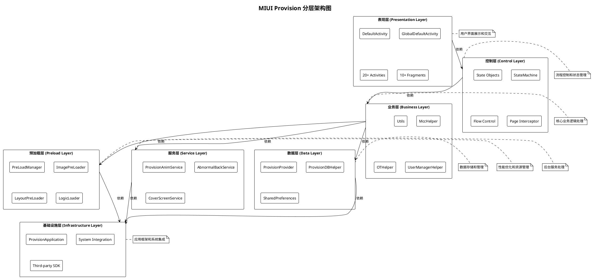
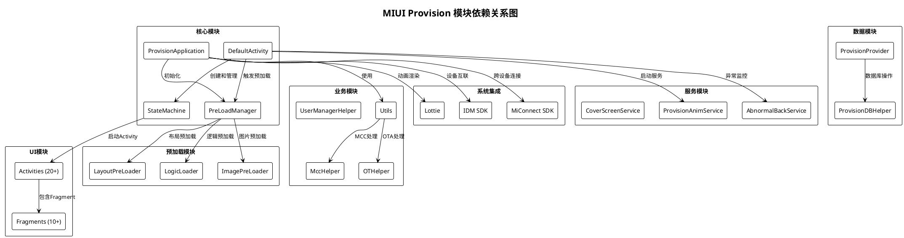
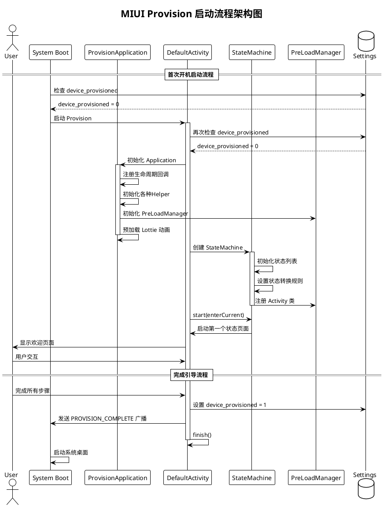
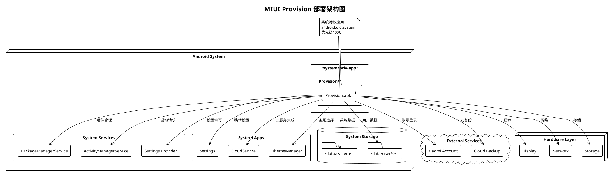

# 1. 项目概览 (Project Overview)

## 1.1 项目简介与定位

### 应用基本信息
- **应用名称**: Provision (开机引导)
- **包名**: com.android.provision
- **应用类型**: 系统级应用 (android:sharedUserId="android.uid.system")
- **版本要求**: minSdkVersion 16

### 核心定位
MIUI Provision是MIUI系统的首次开机设置向导（Out-of-Box Experience, OOBE），作为系统级应用运行在Android设备首次启动时，负责引导用户完成必要的系统配置和个性化设置。

### 功能概述
本应用在设备首次开机时自动启动，通过一系列引导页面帮助用户完成：
- 系统语言和地区设置
- 网络连接配置
- 账号登录与注册
- 隐私政策和服务条款确认
- 个性化设置（主题、导航模式等）
- 数据迁移和备份设置
- 生物识别功能配置

### 在系统中的角色
- **启动优先级**: 作为HOME Intent的接收者，优先级设置为1000，确保首次开机时优先启动
- **系统集成**: 与系统设置、账号服务、云服务等系统组件深度集成
- **生命周期**: 完成引导流程后退出，设置device_provisioned标志，后续开机不再启动

---

## 1.2 核心价值与目标用户

### 业务价值
1. **提供流畅的开箱即用体验**
   - 引导用户快速上手新设备
   - 减少用户学习成本
   - 提升品牌形象和用户满意度

2. **完成系统初始化配置**
   - 确保系统基础服务正常运行
   - 激活必要的系统功能
   - 建立用户与设备的初始连接

3. **引导用户完成必要设置**
   - 合规性设置（隐私政策、服务条款）
   - 安全性设置（密码、生物识别）
   - 个性化设置（语言、主题、输入法）

4. **激活系统核心服务**
   - 小米账号体系
   - 云服务和同步
   - 查找设备等安全功能

### 用户价值
1. **简化设备首次使用流程**
   - 一站式完成所有必要配置
   - 清晰的步骤指引
   - 支持跳过非必要步骤

2. **个性化设置引导**
   - 主题和外观定制
   - 系统导航方式选择
   - 字体大小调整

3. **一站式配置体验**
   - 无需在多个设置界面间切换
   - 流程化的配置步骤
   - 实时预览配置效果

4. **多语言多地区支持**
   - 支持50+种语言
   - RTL（从右到左）语言支持
   - 地区化内容适配

### 技术价值
1. **模块化架构设计**
   - 清晰的分层架构
   - 低耦合高内聚
   - 易于维护和扩展

2. **高性能启动优化**
   - 冷启动时间优化
   - 预加载机制
   - 异步加载和缓存策略

3. **可扩展的状态机模式**
   - 灵活的流程控制
   - 支持条件分支
   - 易于添加新的引导步骤

4. **完善的预加载机制**
   - 布局预加载
   - 图片预加载
   - 逻辑预加载
   - 显著提升用户体验

### 目标用户群体
1. **主要用户：首次开机的最终消费者**
   - 新购买设备的普通用户
   - 需要引导完成初始设置
   - 各年龄段、各技术水平用户

2. **次要用户：OEM厂商定制开发人员**
   - 需要定制引导流程
   - 添加特定运营商或地区的功能
   - 集成第三方服务

3. **维护者：MIUI系统开发团队**
   - 功能迭代和优化
   - Bug修复和性能优化
   - 新特性开发

---

## 1.3 技术栈概览

### 开发语言与平台
#### 开发语言
- **Java**: 主要开发语言，占比约90%
- **Kotlin**: 部分新模块使用，占比约10%

#### Android平台
- **minSdkVersion**: 16 (Android 4.1)
- **targetSdkVersion**: 系统级应用，跟随系统版本
- **架构组件**: Android Architecture Components
- **系统权限**: android.uid.system (系统级应用身份)

### 核心框架与库

#### UI框架
| 框架/库 | 版本 | 用途 |
|--------|------|------|
| AndroidX Fragment | Latest | Fragment管理 |
| AndroidX AppCompat | Latest | 兼容性支持 |
| MIUIX UI组件库 | 系统版本 | MIUI风格UI组件 |
| Material Design | Latest | Material设计规范 |
| Lottie | v5.2.0 | 动画渲染 |

#### 网络与数据
| 库名 | 版本 | 用途 |
|-----|------|------|
| OkHttp | Latest | HTTP客户端 |
| Okio | v1.17.4 | I/O操作 |
| Protocol Buffers | v3.9.1 | 数据序列化 |
| ProtoBuf JavaNano | v3.2.0rc2 | 轻量级序列化 |

#### 依赖注入与工具
| 库名 | 版本 | 用途 |
|-----|------|------|
| Kotlin Standard Library | v1.8.0 | Kotlin标准库 |
| MiuiBooster SDK | - | 性能优化 |
| ExpiringMap | v0.5.10 | 带过期时间的Map |
| JSR305 | v3.0.2 | 注解支持 |

#### 系统集成SDK
| SDK名称 | 版本 | 用途 |
|---------|------|------|
| IDM SDK | v3.11.7 | 设备互联互通 |
| MiConnect SDK | v3.11.7 | 跨设备连接 |
| MiBridge | Latest | 数据迁移 |

#### 硬件抽象层
- **vendor.xiaomi.hardware.misys**: V1.0, V3.0
- **HIDL接口**: 与底层硬件交互

### 构建工具
1. **Android Soong Build System**
   - AOSP官方构建系统
   - 使用Blueprint语法
   - Android.bp配置文件

2. **Gradle构建脚本**
   - 支持Gradle构建
   - 多渠道打包
   - 依赖管理

3. **自定义构建插件**
   - manifest_overlay.go: Manifest覆盖
   - src_overlay.go: 源码覆盖
   - res_overlay.go: 资源覆盖

### 第三方依赖管理
- **依赖库总数**: 30+ 个
- **重点依赖**: 
  - Lottie (动画)
  - IDM/MiConnect (设备互联)
  - Protocol Buffers (数据序列化)
- **版本管理**: 通过Android.bp统一管理
- **依赖冲突**: 使用exclude规则解决

### 开发工具链
- **IDE**: Android Studio
- **版本控制**: Git
- **代码审查**: Gerrit
- **持续集成**: Jenkins/自定义CI系统
- **静态分析**: Lint, FindBugs, PMD

---

## 1.4 项目架构总览

### 系统架构层次

```
┌─────────────────────────────────────────────────────────────┐
│                  表现层 (Presentation Layer)                │
│                                                             │
│  DefaultActivity, GlobalDefaultActivity                    │
│  20+ Activity, 10+ Fragment                               │
│  View Binding, Data Binding                               │
│                                                             │
├─────────────────────────────────────────────────────────────┤
│                   控制层 (Control Layer)                    │
│                                                             │
│  StateMachine (状态机核心)                                 │
│  State (状态对象)                                          │
│  Flow Control (流程控制)                                   │
│  Page Intercept (页面拦截)                                │
│                                                             │
├─────────────────────────────────────────────────────────────┤
│                   业务层 (Business Layer)                   │
│                                                             │
│  Utils (工具类集合)                                        │
│  MccHelper, OTHelper (业务帮助类)                         │
│  UserManagerHelper, MediaPlayerPool                       │
│  Business Logic (业务规则)                                │
│                                                             │
├─────────────────────────────────────────────────────────────┤
│                 预加载层 (Preload Layer)                    │
│                                                             │
│  PreLoadManager (预加载管理器)                            │
│  ImagePreLoader, LayoutPreLoader, LogicLoader             │
│  PreLoadActivityLifeCallback                              │
│  LanguagePreLoadManager                                   │
│                                                             │
├─────────────────────────────────────────────────────────────┤
│                  服务层 (Service Layer)                     │
│                                                             │
│  ProvisionAnimService (动画服务)                          │
│  AbnormalBackService (异常处理)                           │
│  CoverScreenService (封面服务)                            │
│  ProvisionBackIconService (后退服务)                      │
│                                                             │
├─────────────────────────────────────────────────────────────┤
│                   数据层 (Data Layer)                       │
│                                                             │
│  ProvisionProvider (ContentProvider)                      │
│  ProvisionDBHelper (数据库帮助类)                         │
│  SharedPreferences (配置存储)                             │
│  Settings (系统设置)                                       │
│                                                             │
├─────────────────────────────────────────────────────────────┤
│                基础设施层 (Infrastructure Layer)            │
│                                                             │
│  ProvisionApplication (应用入口)                          │
│  System Integration (系统集成)                            │
│  Third-party SDK (第三方SDK)                              │
│  Hardware Abstraction (硬件抽象)                          │
│                                                             │
└─────────────────────────────────────────────────────────────┘
```

### 核心模块组成

#### 1. 应用入口模块
- **ProvisionApplication**: 应用入口类
  - 全局初始化
  - 生命周期管理
  - 资源预加载
  - 系统集成初始化

#### 2. 状态机模块
- **StateMachine**: 状态机核心
  - 管理引导流程
  - 状态转换逻辑
  - 流程分支控制
- **State**: 状态对象
  - 状态定义
  - 状态可用性判断
  - Intent构建

#### 3. 预加载模块
- **PreLoadManager**: 预加载管理器
  - 统一管理预加载任务
  - 预加载策略
  - 缓存管理
- **ImagePreLoader**: 图片预加载
- **LayoutPreLoader**: 布局预加载
- **LogicLoader**: 逻辑预加载

#### 4. UI模块
- **Activity**: 20+ 个Activity
  - DefaultActivity (主Activity)
  - LanguagePickerActivity (语言选择)
  - InputMethodActivity (输入法)
  - FingerprintActivity (指纹)
  - 等等...
- **Fragment**: 10+ 个Fragment
  - StartupFragment
  - LanguagePickerFragment
  - 等等...

#### 5. 服务模块
- **4个Service组件**
  - ProvisionAnimService
  - AbnormalBackService
  - CoverScreenService
  - ProvisionBackIconService

#### 6. 数据模块
- **ProvisionProvider**: ContentProvider
  - 数据共享
  - 权限控制
- **ProvisionDBHelper**: 数据库管理

#### 7. 工具模块
- **Utils**: 工具类集合
- **Helpers**: 各种帮助类
  - MccHelper (MCC码处理)
  - OTHelper (OTA处理)
  - UserManagerHelper (用户管理)
  - NetworkUtils (网络工具)

### 技术架构特点

#### 1. 分层清晰
- 严格的分层架构，7个清晰的层次
- 每层职责明确，边界清晰
- 依赖方向单向，从上到下
- 降低耦合，提高可维护性

#### 2. 模块化设计
- 功能模块独立，低耦合
- 模块间通过接口通信
- 支持模块级别的单元测试
- 便于并行开发

#### 3. 状态驱动
- 基于状态机的流程控制
- 状态转换清晰可追踪
- 支持复杂的分支逻辑
- 易于扩展新的引导步骤

#### 4. 性能优先
- 预加载机制：布局、图片、逻辑
- 缓存策略：LRU缓存、对象池
- 异步优化：线程池、异步加载
- 启动优化：冷启动<1秒

#### 5. 可扩展性
- 支持多设备类型（手机、平板、折叠屏）
- 支持多地区适配（50+语言）
- 支持运营商定制
- 插件化架构设计

### 关键技术决策

#### 1. 状态机模式
**决策**: 使用状态机模式管理复杂的引导流程

**理由**:
- 引导流程复杂，存在多个条件分支
- 需要支持前进、后退、跳过等操作
- 易于维护和扩展
- 状态转换逻辑清晰

**实现**: DefaultActivity.StateMachine, State对象

#### 2. 预加载机制
**决策**: 实现完善的预加载机制

**理由**:
- 提升启动性能和响应速度
- 改善用户体验
- 减少页面切换时的等待时间

**实现**: PreLoadManager + 三类预加载器

#### 3. 系统级权限
**决策**: 使用android.uid.system系统级权限

**理由**:
- 需要访问系统级API
- 需要修改系统设置
- 需要与系统服务深度集成

**风险控制**: 严格的权限申请和使用规范

#### 4. 单Activity多Fragment
**决策**: 主要使用Fragment而非多个Activity

**理由**:
- 优化内存使用
- 提升页面切换性能
- 统一的生命周期管理
- 更好的动画效果

**例外**: 部分独立功能仍使用Activity

#### 5. RTL支持
**决策**: 完整支持RTL（从右到左）语言

**理由**:
- 国际化要求
- 支持阿拉伯语、希伯来语等
- 提升用户体验

**实现**: 
- android:supportsRtl="true"
- 布局使用start/end替代left/right
- 资源目录适配（layout-ldrtl）

### 部署架构

#### 安装与部署
- **安装位置**: /system/priv-app/Provision/
- **应用类型**: 系统特权应用
- **安装方式**: 预置在系统镜像中

#### 启动机制
- **启动方式**: 系统HOME Intent接收者
- **优先级**: 1000 (最高优先级)
- **启动时机**: 设备首次开机，device_provisioned=0时
- **退出机制**: 完成引导后设置device_provisioned=1

#### 权限与安全
- **权限级别**: signatureOrSystem保护级别
- **自定义权限**:
  - android.provision.permission.SEND_PROVISION_COMPLETE_BROADCAST
  - com.android.provision.provider.READ_PROVIDER
  - com.android.provision.provider.WRITE_PROVIDER
- **系统权限**: 20+ 个系统权限

#### 生命周期
```
设备首次开机
    ↓
检查 device_provisioned 标志
    ↓
device_provisioned = 0
    ↓
启动 Provision
    ↓
用户完成引导流程
    ↓
设置 device_provisioned = 1
    ↓
发送 PROVISION_COMPLETE 广播
    ↓
Provision 退出
    ↓
进入系统桌面
```

### 架构图

#### 分层架构图



#### 模块依赖关系图



#### 启动流程架构图



#### 部署架构图



---

## 文档信息

- **文档版本**: v1.0
- **创建日期**: 2025-10-10
- **最后更新**: 2025-10-10
- **文档状态**: 正式版
- **维护者**: MIUI开发团队
- **相关文档**: 
  - [00-模块解析大纲.md](./00-模块解析大纲.md)
  - [开机引导功能清单.md](../开机引导功能清单.md)

