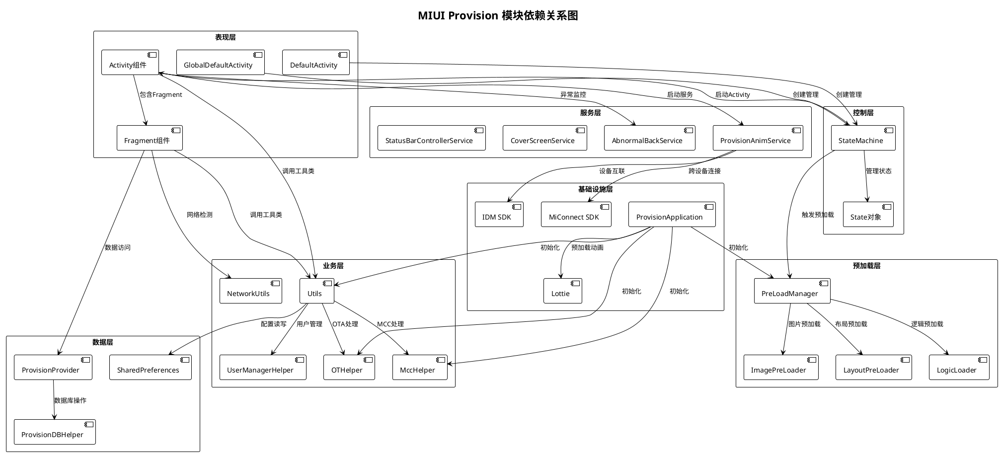
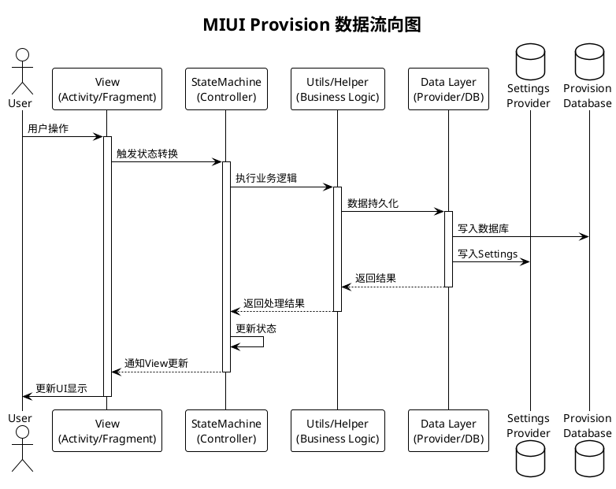

# 2. 架构设计 (Architecture Design)

## 2.1 整体架构模式

### 2.1.1 分层架构 (Layered Architecture)

MIUI Provision应用采用严格的分层架构设计，从上到下共7层，每层职责清晰，依赖方向单一。

```
┌─────────────────────────────────────────────────────────────┐
│  Layer 1: 表现层 (Presentation Layer)                       │
│  - DefaultActivity, GlobalDefaultActivity                   │
│  - 20+ Activity组件                                         │
│  - 10+ Fragment组件                                         │
│  - 职责: 用户界面展示和用户交互处理                         │
├─────────────────────────────────────────────────────────────┤
│  Layer 2: 控制层 (Control Layer)                            │
│  - StateMachine (状态机)                                    │
│  - State (状态对象)                                         │
│  - 职责: 流程控制、状态管理、页面路由                       │
├─────────────────────────────────────────────────────────────┤
│  Layer 3: 业务层 (Business Layer)                           │
│  - Utils (工具类集合)                                       │
│  - MccHelper, OTHelper, UserManagerHelper                  │
│  - 职责: 业务逻辑处理、业务规则执行                         │
├─────────────────────────────────────────────────────────────┤
│  Layer 4: 预加载层 (Preload Layer)                          │
│  - PreLoadManager (预加载管理器)                            │
│  - ImagePreLoader, LayoutPreLoader, LogicLoader            │
│  - 职责: 资源预加载、性能优化                               │
├─────────────────────────────────────────────────────────────┤
│  Layer 5: 服务层 (Service Layer)                            │
│  - ProvisionAnimService (动画服务)                          │
│  - AbnormalBackService (异常监控服务)                       │
│  - 职责: 后台服务、跨进程通信                               │
├─────────────────────────────────────────────────────────────┤
│  Layer 6: 数据层 (Data Layer)                               │
│  - ProvisionProvider (ContentProvider)                     │
│  - ProvisionDBHelper (数据库管理)                           │
│  - 职责: 数据持久化、数据共享                               │
├─────────────────────────────────────────────────────────────┤
│  Layer 7: 基础设施层 (Infrastructure Layer)                 │
│  - ProvisionApplication (应用入口)                          │
│  - 系统集成、第三方SDK集成                                  │
│  - 职责: 应用初始化、资源管理、系统对接                     │
└─────────────────────────────────────────────────────────────┘
```

#### 表现层 (Presentation Layer)

**核心组件**:
- **DefaultActivity**: 国内版主Activity，管理整个引导流程
- **GlobalDefaultActivity**: 国际版主Activity，增强的向导脚本支持
- **20+ Activity**: 各功能页面Activity
- **10+ Fragment**: 各功能页面Fragment

**设计特点**:
- 使用MVVM架构模式
- Fragment优先策略，减少Activity数量
- ViewBinding统一视图绑定
- 支持横竖屏切换和配置变更

**关键代码**:
```java
// DefaultActivity.java (第114行)
public class DefaultActivity extends ProvisionBaseActivity {
    private StateMachine mStateMachine;
    
    @Override
    protected void onCreate(Bundle icicle) {
        super.onCreate(icicle);
        if (deviceIsProvisioned()) {
            finishSetup(false);
            return;
        }
        mStateMachine = new StateMachine(this);
        mStateMachine.start(enterCurrent);
    }
}
```

#### 控制层 (Control Layer)

**核心组件**:
- **StateMachine**: 状态机引擎，管理状态转换
- **State**: 抽象状态类，定义状态行为
- **Flow Control**: 流程控制逻辑
- **Page Interceptor**: 页面拦截器

**设计特点**:
- 状态机模式 (State Machine Pattern)
- 责任链模式 (Chain of Responsibility Pattern)
- 动态状态转换，支持前进/后退/跳转
- 条件化流程分支

**状态转换逻辑**:
```
当前状态 → isAvailable()检查 → 可用则进入 → 执行onEnter() 
                              → 不可用则跳过 → 查找下一个可用状态
```

#### 业务层 (Business Layer)

**核心组件**:
- **Utils**: 通用工具类，提供各种辅助功能
- **MccHelper**: MCC码处理，地区判断
- **OTHelper**: OTA处理，版本升级
- **UserManagerHelper**: 用户管理
- **NetworkUtils**: 网络工具类

**职责范围**:
- 业务规则验证
- 数据格式转换
- 系统API封装
- 设备特性检测

#### 预加载层 (Preload Layer)

**核心组件**:
- **PreLoadManager**: 统一管理预加载任务
- **ImagePreLoader**: 图片预加载
- **LayoutPreLoader**: 布局预加载
- **LogicLoader**: 逻辑预加载

**预加载策略**:
```java
// PreLoadManager.java
private static final int NEXT_ACTIVITY_LOAD_SIZE = 2;  // 预加载后续2个页面
private static final int PRE_ACTIVITY_LOAD_SIZE = 2;   // 预加载前面2个页面
```

#### 服务层 (Service Layer)

**核心组件**:
- **ProvisionAnimService**: 动画播放服务
- **AbnormalBackService**: 异常返回监控
- **CoverScreenService**: 封面屏幕服务
- **ProvisionBackIconService**: 返回按钮服务

**服务特点**:
- 后台运行，独立生命周期
- 跨进程通信 (IPC)
- 支持AIDL接口

#### 数据层 (Data Layer)

**核心组件**:
- **ProvisionProvider**: ContentProvider，提供数据共享
- **ProvisionDBHelper**: SQLiteOpenHelper，管理数据库
- **SharedPreferences**: 配置存储
- **Settings**: 系统设置读写

**数据库设计**:
```java
// ProvisionDBHelper.java
public class ProvisionDBHelper extends SQLiteOpenHelper {
    private static final String DATABASE_NAME = "provision.db";
    private static final int DATABASE_VERSION = 1;
    
    // 两张表：
    // 1. appdata: 应用数据
    // 2. dotinfo: 点信息
}
```

#### 基础设施层 (Infrastructure Layer)

**核心组件**:
- **ProvisionApplication**: Application入口类
- **系统集成**: IDM、MiConnect、Lottie等SDK
- **资源管理**: 多语言、主题、配置

**初始化流程**:
```java
// ProvisionApplication.java (第38行)
@Override
public void onCreate() {
    super.onCreate();
    registerActivityLifecycleCallbacks(LifecycleHandler.create());
    AutoDensityConfig.init(this);
    OTHelper.initialize(this);
    MccHelper.getInstance().init(this);
    MediaPlayerPool.get().acquireDefault();
    Utils.setupProvisionResources(getContext());
    LanguagePreLoadManager.preLoadTextureView();
    registerActivityLifecycleCallbacks(PreLoadActivityLifeCallback.create());
    PreLoadManager.get().init(this);
    ImmersiveUtils.enableImmersion(this);
    preloadAnimations();  // 预加载12个Lottie动画
}
```

---

### 2.1.2 MVVM/MVP模式应用

#### MVVM架构应用

**Model层**:
- 数据实体类 (beans包下)
- 数据库操作 (database包下)
- 网络请求 (http包下)

**View层**:
- Activity和Fragment
- 布局文件 (res/layout)
- 自定义View (widget包下)

**ViewModel层**:
- 业务逻辑封装在Utils和Helper类中
- 状态管理由StateMachine负责

#### 数据绑定机制

虽然未使用DataBinding库,但通过以下方式实现数据绑定:
- ViewBinding: findViewById的类型安全替代
- 观察者模式: BroadcastReceiver监听系统事件
- 回调机制: IOnFocusListener等接口

---

### 2.1.3 状态机模式 (State Machine Pattern)

#### 状态定义

**状态抽象类**:
```java
// global/State.java
public class State {
    protected StateMachine mStateMachine;
    protected Context context;
    protected String packageName;
    protected String className;
    protected Class<?> targetClass;
    
    // 状态可用性检查
    public abstract boolean isAvailable(boolean toNext);
    
    // 状态进入时执行
    public void onEnter(boolean canGoBack, boolean toNext);
    
    // 创建Intent
    public Intent getIntent();
}
```

**具体状态实现**:
- LanguageState: 语言选择状态
- InputMethodState: 输入法选择状态
- WiFiState: WiFi连接状态
- TermsState: 条款同意状态
- ActivationState: 激活状态
- 等20+个状态

#### 状态转换

**状态转换引擎**:
```java
// DefaultActivity内部类
public class StateMachine {
    private SparseArray<StateInfo> mStates;      // 状态注册表
    private State mCurrentState;                 // 当前状态
    private State mCompleteState;                // 完成状态
    private ArrayList<State> mStateStack;        // 状态栈
    
    private class StateInfo {
        private State current;  // 当前状态
        private State next;     // 下一个状态
    }
    
    // 转换到下一个状态
    public void transitToNext() {
        State nextState = getNextAvailableState(mCurrentState);
        if (nextState != null) {
            enterState(nextState);
        } else {
            finishSetup(true);  // 完成所有状态
        }
    }
    
    // 转换到上一个状态
    public void transitToPrevious() {
        if (!mStateStack.isEmpty()) {
            State prevState = mStateStack.remove(mStateStack.size() - 1);
            enterState(prevState);
        }
    }
}
```

#### 事件处理

**状态事件类型**:
- `RESULT_OK`: 用户完成当前步骤,进入下一状态
- `RESULT_CANCELED`: 用户返回,回到上一状态
- `RESULT_SKIP`: 跳过当前状态
- 自定义ResultCode: 用于特殊跳转

#### 流程控制

**分支决策逻辑**:
```java
// isAvailable()方法决定状态是否可用
public boolean isAvailable(boolean toNext) {
    // 多维度判断：
    // 1. 设备类型: isTabletDevice(), isFoldDevice()
    // 2. 地区版本: IS_INTERNATIONAL_BUILD
    // 3. 功能支持: supportMiMover(), isSupportEsimMode()
    // 4. 网络状态: isWifiConnected()
    // 5. 企业配置: ENTERPRISE_ACTIVATED
    return condition1 && condition2 && !condition3;
}
```

---

## 2.2 模块划分

### 2.2.1 核心模块 (Core Module)

#### 应用入口模块

**ProvisionApplication**:
- 应用全局初始化
- 注册生命周期回调
- 初始化各种Helper和Manager
- 预加载动画资源

**职责**:
- 全局Context提供
- 系统资源初始化
- SDK集成初始化
- 预加载任务触发

#### 生命周期管理

**LifecycleHandler**:
- 监控Activity生命周期
- 管理Activity栈
- 内存管理和优化

**PreLoadActivityLifeCallback**:
- 在Activity切换时触发预加载
- 管理预加载任务队列
- 资源缓存策略

#### 全局配置模块

**Constants**:
- 定义全局常量
- Intent Action定义
- RequestCode定义

**DefaultPreferenceHelper**:
- SharedPreferences封装
- 配置读写接口

#### 核心服务模块

**StateMachine**:
- 状态机引擎
- 流程编排
- 状态管理

---

### 2.2.2 功能模块 (Feature Module)

#### 按功能领域划分

**1. 语言与地区模块**
- LanguagePickerActivity/Fragment
- LocalePickerActivity/Fragment
- ZonePickerActivity/Fragment
- 功能: 语言选择、地区选择、时区设置

**2. 网络配置模块**
- WiFi配置 (通过系统Settings)
- 网络检测 (NetworkUtils)
- Captive Portal验证

**3. 账号与安全模块**
- GoogleAccountActivity
- FingerprintActivity/Fragment
- PrivacyProvisionActivity
- 功能: 账号登录、指纹录入、隐私设置

**4. 输入法模块**
- InputMethodActivity/Fragment
- InputMethodLicenseActivity
- InputMethodAndSubtypeUtil

**5. 个性化设置模块**
- FontSizeActivity/Fragment
- FontStyleActivity/Fragment
- NavigationModePickerActivity/Fragment
- HomeSettingsActivity/Fragment
- 功能: 字体、导航方式、桌面设置

**6. SIM卡与电话模块**
- SimCardDetectionActivity/Fragment
- MultiSimSettingsActivity/Fragment
- SimInfoUtils

**7. 数据迁移模块**
- MiMover相关逻辑
- MiBridge SDK集成
- MiConnect SDK集成

**8. 条款与服务模块**
- TermsActivity/Fragment
- TermsAndStatementActivity/Fragment
- ServiceStatementActivity/Fragment
- CMTermsActivity/Fragment
- CUTermsActivity/Fragment

**9. 启动与欢迎模块**
- StartupFragment
- BootVideoActivity/Fragment
- CongratulationActivity/Fragment

**10. 其他设置模块**
- OtherSettingsActivity/Fragment
- LocationInformationActivity
- SendUsageAndDiagnosticDataActivity
- KindTipActivity/Fragment

#### 模块职责定义

| 模块 | 职责 | 依赖 |
|------|------|------|
| 语言与地区 | 设置系统语言、地区、时区 | Utils, Settings |
| 网络配置 | 引导用户连接WiFi | NetworkUtils, Settings |
| 账号与安全 | 账号登录、生物识别设置 | AccountManager, FingerprintManager |
| 输入法 | 选择和配置输入法 | InputMethodManager |
| 个性化设置 | 主题、字体、导航方式 | ThemeManager, Settings |
| SIM卡 | SIM卡检测和配置 | TelephonyManager |
| 数据迁移 | 从旧设备迁移数据 | MiBridge, MiConnect |
| 条款与服务 | 展示和确认服务条款 | WebView |
| 启动与欢迎 | 欢迎动画、启动页 | Lottie |
| 其他设置 | 位置、数据收集等设置 | Settings |

#### 模块边界

**边界原则**:
- 每个模块有清晰的输入和输出
- 模块间通过Intent传递数据
- 禁止模块间直接耦合
- 通过StateMachine统一调度

#### 模块交互

**交互方式**:
- **状态转换**: StateMachine控制模块跳转
- **Intent传递**: Activity间数据传递
- **广播通信**: 跨模块事件通知
- **ContentProvider**: 跨进程数据共享

---

### 2.2.3 基础设施模块 (Infrastructure Module)

#### 网络模块

**组件**:
- NetRequestor: HTTP请求封装
- NetworkUtils: 网络状态检测
- NetWorkChangedReceiver: 网络变化监听

**功能**:
- HTTP/HTTPS请求
- 网络连接检测
- Captive Portal验证
- 网络变化监听

#### 数据库模块

**组件**:
- ProvisionDBHelper: 数据库管理
- ProvisionProvider: ContentProvider

**数据库结构**:
```sql
CREATE TABLE appdata (
    app_id INTEGER PRIMARY KEY AUTOINCREMENT,
    package VARCHAR,
    className VARCHAR,
    folderId VARCHAR,
    dot INTEGER
);

CREATE TABLE dotinfo (
    dotinfo_id INTEGER PRIMARY KEY AUTOINCREMENT,
    color VARCHAR,
    configId VARCHAR,
    folderDot INTEGER
);
```

#### 工具类模块

**Utils包结构**:
- **通用工具**: Utils.java (2000+行核心工具类)
- **网络工具**: NetworkUtils, PreLoadWifi
- **设备工具**: DeviceUtils, NotchAdapterUtils
- **UI工具**: ViewUtils, ImmersiveUtils
- **字体工具**: FontSizeUtils
- **用户管理**: UserManagerHelper
- **媒体工具**: MediaPlayerPool
- **地区工具**: MccHelper
- **OTA工具**: OTHelper
- **指纹工具**: FingerprintReader
- **等60+工具类**

#### 第三方SDK集成

**集成SDK列表**:
1. **Lottie (v5.2.0)**
   - 用途: 动画渲染
   - 集成位置: ProvisionApplication.preloadAnimations()
   - 预加载12个JSON动画文件

2. **IDM SDK (v3.11.7)**
   - 用途: 设备互联互通
   - AIDL接口: idm-aidl-3_11_7.aar

3. **MiConnect SDK (v3.11.7)**
   - 用途: 跨设备连接和数据迁移
   - 蓝牙BLE连接管理

4. **MiBridge**
   - 用途: 数据迁移桥接
   - 与MiMover集成

5. **OneTrack SDK (v2.2.0)**
   - 用途: 数据埋点和用户行为分析

6. **Protocol Buffers (v3.9.1)**
   - 用途: 数据序列化

7. **MiuiBooster**
   - 用途: 性能优化
   - 启动加速

8. **MIUIX UI组件库**
   - 用途: MIUI风格UI组件
   - miuix.app.Application
   - miuix.provision.ProvisionBaseActivity

9. **Xiaomi HIDL (Hardware Abstraction)**
   - vendor.xiaomi.hardware.misys-V1.0
   - vendor.xiaomi.hardware.misys-V3.0

---

## 2.3 依赖关系图

### 2.3.1 模块间依赖



### 2.3.2 组件间依赖

#### Activity依赖关系

**继承关系**:
```
Object
  └── Activity (Android Framework)
       └── ProvisionBaseActivity (MIUIX)
            ├── DefaultActivity
            ├── GlobalDefaultActivity
            ├── BaseActivity
            │    ├── LanguagePickerActivity
            │    ├── InputMethodActivity
            │    ├── FingerprintActivity
            │    └── ... (15+ Activity)
            └── ... (其他Activity)
```

**依赖特点**:
- 所有Activity继承自ProvisionBaseActivity
- ProvisionBaseActivity提供统一的MIUI主题和行为
- BaseActivity是大部分业务Activity的父类
- 特殊Activity直接继承ProvisionBaseActivity

#### Fragment依赖关系

**继承关系**:
```
Object
  └── Fragment (AndroidX)
       ├── BaseFragment
       │    ├── BaseListFragment
       │    │    ├── LanguagePickerFragment
       │    │    ├── LocalePickerFragment
       │    │    └── ZonePickerFragment
       │    ├── StartupFragment
       │    ├── InputMethodFragment
       │    ├── FontSizeFragment
       │    └── ... (10+ Fragment)
       └── ... (其他Fragment)
```

#### Service依赖关系

**4个Service组件**:
1. **ProvisionAnimService**
   - 依赖: Lottie SDK
   - 用途: 动画播放

2. **AbnormalBackService**
   - 依赖: Utils
   - 用途: 异常返回监控

3. **CoverScreenService**
   - 依赖: Utils
   - 用途: 折叠屏封面屏控制

4. **StatusBarControllerService**
   - 依赖: SystemUI
   - 用途: 状态栏控制

#### Provider依赖关系

**ProvisionProvider**:
```java
public class ProvisionProvider extends ContentProvider {
    private ProvisionDBHelper mDBHelper;  // 依赖数据库Helper
    
    // 提供CRUD接口
    @Override
    public Cursor query(Uri uri, ...)
    
    @Override
    public Uri insert(Uri uri, ContentValues values)
    
    @Override
    public int update(Uri uri, ContentValues values, ...)
    
    @Override
    public int delete(Uri uri, ...)
}
```

### 2.3.3 第三方库依赖

#### 依赖清单

**核心依赖** (libs目录):
```
libs/
├── lottie-5.2.0.aar                        # 动画渲染
├── idm_3_11_7.aar                          # 设备互联
├── idm-aidl-3_11_7.aar                     # IDM AIDL接口
├── miconnect_3_11_7.aar                    # 跨设备连接
├── mibridge-release.aar                    # 数据迁移桥接
├── mgl_native-release.aar                  # MGL Native库
├── provisionlib-1.0.62.aar                 # Provision库
├── onetrack-sdk-2.2.0.jar                  # 数据埋点
├── protobuf-java-3.9.1.jar                 # ProtoBuf
├── protobuf-javanano-3.2.0rc2.jar          # ProtoBuf Nano
├── expiringmap-0.5.10.jar                  # 带过期时间的Map
├── MiuiBooster.jar                         # 性能优化
├── vendor.xiaomi.hardware.misys-V1.0-java.jar  # HIDL V1.0
├── vendor.xiaomi.hardware.misys-V3_0.jar   # HIDL V3.0
└── vendor.xiaomi.hardware.misys.common-V1-java.jar
```

**AndroidX依赖** (prebuilts-alpha目录):
- androidx.fragment
- androidx.appcompat
- androidx.preference
- androidx.constraintlayout
- androidx.recyclerview
- androidx.viewpager2
- 等37个AAR + 7个JAR

**MIUIX依赖**:
- miuix.appcompat
- miuix.animation
- miuix.autodensity
- miuix.provision
- 等32个AAR + 2个JAR

**Kotlin依赖**:
- kotlin-stdlib-1.8.0.jar
- kotlinx-coroutines-android

#### 版本管理

**版本锁定策略**:
```groovy
// Android.bp中统一管理
java_import {
    name: "Provision-lottie",
    aars: ["bp_libs/lottie-5.2.0.aar"],
}

java_import {
    name: "Provision-idm",
    aars: ["libs/idm_3_11_7.aar"],
}
```

**版本更新策略**:
- 第三方库版本固定，避免隐式升级
- 通过prebuilts_lib_alpha.json管理AndroidX版本
- 定期进行依赖安全扫描
- 重大升级需要完整回归测试

#### 冲突解决

**冲突类型**:
1. **版本冲突**: 多个库依赖同一库的不同版本
2. **类名冲突**: 不同库包含相同的类
3. **资源冲突**: 资源ID或名称冲突

**解决方案**:
```groovy
// 使用exclude排除冲突依赖
implementation('com.example:library:1.0') {
    exclude group: 'com.google.protobuf', module: 'protobuf-java'
}

// 使用force强制指定版本
configurations.all {
    resolutionStrategy {
        force 'com.google.protobuf:protobuf-java:3.9.1'
    }
}
```

#### 依赖更新策略

**更新原则**:
1. **保守更新**: 非必要不升级，稳定性优先
2. **安全优先**: 有安全漏洞立即升级
3. **兼容性测试**: 升级后完整回归测试
4. **版本记录**: 记录每次依赖变更

**更新流程**:
```
发现新版本 → 评估必要性 → 本地测试 → 兼容性验证 
→ 提交审查 → 集成测试 → 发布
```

---

## 2.4 数据流向

### 2.4.1 单向数据流

#### 数据流向图



#### 状态管理

**状态类型**:
1. **UI状态**: Activity/Fragment的UI状态
2. **流程状态**: StateMachine的当前状态
3. **持久化状态**: Settings和Database中的状态
4. **全局状态**: Application级别的全局状态

**状态同步**:
```java
// Settings状态同步
Settings.Global.putInt(contentResolver, "device_provisioned", 1);

// SharedPreferences状态同步
SharedPreferences prefs = PreferenceManager.getDefaultSharedPreferences(context);
prefs.edit().putBoolean("setup_complete", true).apply();

// 数据库状态同步
ProvisionProvider.insert(uri, contentValues);
```

#### 数据更新机制

**更新方式**:
- **同步更新**: 立即生效的设置 (如语言、时区)
- **异步更新**: 后台保存的数据 (如用户偏好)
- **广播通知**: 跨组件的状态同步

**更新流程**:
```
用户操作 → View捕获 → Controller处理 → Business验证 
→ Data持久化 → 广播通知 → View更新
```

#### 响应式编程

**响应式组件**:
- **BroadcastReceiver**: 响应系统广播
- **ContentObserver**: 观察ContentProvider变化
- **Callback**: 异步操作回调

**示例**:
```java
// 监听网络变化
NetWorkChangedReceiver extends BroadcastReceiver {
    @Override
    public void onReceive(Context context, Intent intent) {
        // 响应网络状态变化
    }
}

// 注册监听
IntentFilter filter = new IntentFilter(ConnectivityManager.CONNECTIVITY_ACTION);
registerReceiver(mNetorkReceiver, filter);
```

### 2.4.2 事件总线

虽然未使用第三方事件总线库(如EventBus),但通过Android原生机制实现事件通信:

#### 事件定义

**广播事件**:
```java
// 引导开始
public static final String PROVISION_START_BROADCAST = 
    "android.provision.action.PROVISION_START";

// 引导完成
public static final String PROVISION_COMPLETE_BROADCAST = 
    "android.provision.action.PROVISION_COMPLETE";

// 自定义广播
public static final String CUSTOM_EVENT = "com.android.provision.CUSTOM_EVENT";
```

#### 事件分发

**发送广播**:
```java
// 发送系统广播
Intent intent = new Intent(PROVISION_START_BROADCAST);
sendBroadcast(intent);

// 发送有权限的广播
Intent intent = new Intent(PROVISION_COMPLETE_BROADCAST);
sendBroadcast(intent, "android.provision.permission.SEND_PROVISION_COMPLETE_BROADCAST");

// 发送到指定用户
Utils.sendBroadcastAsUser(context, intent);
```

#### 事件订阅

**注册接收器**:
```java
// 动态注册
IntentFilter filter = new IntentFilter();
filter.addAction(Intent.ACTION_USER_UNLOCKED);
filter.addAction(ConnectivityManager.CONNECTIVITY_ACTION);
registerReceiver(mReceiver, filter);

// 静态注册 (AndroidManifest.xml)
<receiver android:name=".receiver.TimeReceiver">
    <intent-filter>
        <action android:name="android.intent.action.TIME_SET" />
        <action android:name="android.intent.action.TIMEZONE_CHANGED" />
    </intent-filter>
</receiver>
```

#### 生命周期管理

**及时注销**:
```java
@Override
protected void onDestroy() {
    super.onDestroy();
    if (mNetorkReceiver != null) {
        unregisterReceiver(mNetorkReceiver);
        mNetorkReceiver = null;
    }
}
```

### 2.4.3 状态持久化

#### 持久化方式

**1. Settings Provider**
```java
// Global Settings (系统级别)
Settings.Global.putInt(resolver, "device_provisioned", 1);
Settings.Global.putInt(resolver, "user_setup_complete", 1);

// Secure Settings (用户级别)
Settings.Secure.putInt(resolver, "user_setup_complete", 1);
```

**2. SharedPreferences**
```java
SharedPreferences prefs = PreferenceManager.getDefaultSharedPreferences(context);
prefs.edit()
    .putBoolean("setup_complete", true)
    .putString("language", "zh_CN")
    .putLong("setup_time", System.currentTimeMillis())
    .apply();
```

**3. SQLite Database**
```java
// 通过ProvisionProvider访问
ContentValues values = new ContentValues();
values.put("package", packageName);
values.put("className", className);
getContentResolver().insert(ProvisionProvider.CONTENT_URI, values);
```

**4. 文件存储**
```java
// 配置文件存储
File configFile = new File(getFilesDir(), "config.json");
FileWriter writer = new FileWriter(configFile);
writer.write(jsonString);
writer.close();
```

#### 状态恢复

**Activity状态恢复**:
```java
@Override
protected void onCreate(Bundle savedInstanceState) {
    super.onCreate(savedInstanceState);
    
    if (savedInstanceState != null) {
        // 恢复状态
        boolean enterCurrent = savedInstanceState.getBoolean(
            STATE_ENTER_CURRENTSTATE, true);
        mStateMachine.start(enterCurrent);
    } else {
        // 首次创建
        mStateMachine.start(true);
    }
}

@Override
protected void onSaveInstanceState(Bundle outState) {
    super.onSaveInstanceState(outState);
    // 保存状态
    outState.putBoolean(STATE_ENTER_CURRENTSTATE, mEnterCurrent);
}
```

**配置变更处理**:
```java
@Override
public void onConfigurationChanged(@NonNull Configuration newConfig) {
    super.onConfigurationChanged(newConfig);
    // 处理配置变更 (如横竖屏切换、语言变更)
    PreLoadManager.get().onConfigurationChange(newConfig);
}
```

---

## 文档信息

- **文档版本**: v1.0
- **创建日期**: 2025-10-17
- **最后更新**: 2025-10-17
- **文档状态**: 正式版
- **维护者**: MIUI开发团队
- **相关文档**:
  - [00-模块解析大纲.md](./00-模块解析大纲.md)
  - [01-项目概览.md](./01-项目概览.md)
  - [03-代码结构.md](./03-代码结构.md)

