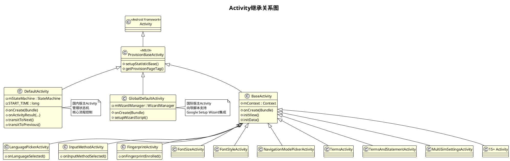
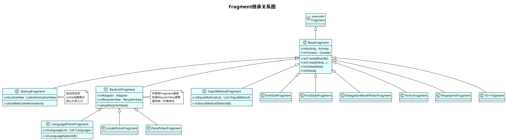
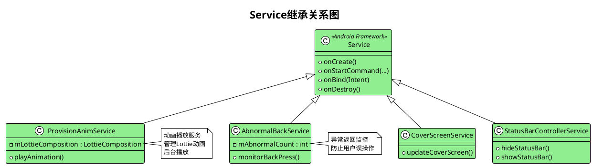

# 3. 代码结构 (Code Structure)

## 3.1 包结构设计

### 3.1.1 按功能分包 (Package by Feature)

MIUI Provision采用**混合分包策略**：核心使用按层次分包，功能模块使用按功能分包。

#### 包结构总览

```
com.android.provision/
├── activities/              # Activity组件 (20+ 个)
├── adapter/                 # 适配器
├── bean/                    # 基础数据实体
├── beans/                   # 业务数据实体
├── ble/                     # 蓝牙相关
│   ├── miconnect/          # MiConnect蓝牙
│   └── utils/              # 蓝牙工具
├── database/                # 数据库
├── fragment/                # Fragment组件 (15+ 个)
├── global/                  # 国际版全局组件
├── http/                    # 网络请求
├── manager/                 # 管理器集合
├── miconnect/               # 设备互联
├── provider/                # ContentProvider
├── receiver/                # 广播接收器
├── renderengine/            # 渲染引擎
├── state/                   # 状态对象
├── turbo/                   # 性能优化
├── utils/                   # 工具类集合 (60+ 个)
├── widget/                  # 自定义View组件
├── *.java                   # 顶层类 (20+ 个)
└── MiuiSecurity/           # 安全相关
    └── JNIUtils.java
```

#### 按功能分包示例

**1. 蓝牙功能包 (ble)**
```
ble/
├── BleManager.java                    # 蓝牙管理器
├── miconnect/                         # MiConnect蓝牙连接
│   ├── BaseMiConnectServerImpl.java
│   ├── DeviceInfo.java
│   ├── MiConnectBleConfig.java
│   ├── MiConnectDeviceInfo.java
│   ├── MiConnectServerImpl.java
│   └── ... (10个类)
└── utils/                             # 蓝牙工具类
    ├── BleAdvertiser.java
    ├── BleDeviceInfo.java
    ├── BleGattServerHelper.java
    └── ... (6个类)
```

**特点**:
- 功能内聚：所有蓝牙相关代码集中在ble包
- 子包划分：按实现细分为miconnect和utils
- 易于维护：修改蓝牙功能只需关注ble包

**2. 数据实体包 (beans/bean)**
```
bean/                               # 基础实体
├── DefaultSimBean.java            # SIM卡实体
└── SimInfoBean.java               # SIM信息实体

beans/                              # 业务实体
├── CarouselBean.java              # 轮播实体
├── CarouselProvisionMessageBean.java
├── CarouselServerConfig.java
├── FontInfo.java                  # 字体信息
├── LocalFontModel.java            # 本地字体模型
├── TimeZoneObj.java               # 时区对象
└── IntHashCode.java               # 哈希工具
```

**3. 管理器包 (manager)**
```
manager/
├── PreLoadManager.java            # 预加载管理器 (核心)
├── LanguagePreLoadManager.java    # 语言预加载
├── ImagePreLoader.java            # 图片预加载
├── LayoutPreLoader.java           # 布局预加载
├── LogicLoader.java               # 逻辑预加载
├── PreLoadActivityLifeCallback.java  # 预加载生命周期
├── IPreLoad.java                  # 预加载接口
└── ... (12个类)
```

---

### 3.1.2 按层次分包 (Package by Layer)

#### UI层 (Presentation Layer)

**activities包**:
```
activities/
├── BaseActivity.java              # Activity基类
├── DefaultActivity.java           # 主Activity (国内版, 2500+行)
├── GlobalDefaultActivity.java     # 主Activity (国际版)
├── LanguagePickerActivity.java    # 语言选择
├── InputMethodActivity.java       # 输入法选择
├── FingerprintActivity.java       # 指纹录入
├── FontSizeActivity.java          # 字体大小
├── FontStyleActivity.java         # 字体样式
├── NavigationModePickerActivity.java  # 导航方式
├── TermsActivity.java             # 条款
├── TermsAndStatementActivity.java # 条款与声明
├── MultiSimSettingsActivity.java  # 双卡设置
├── GoogleAccountActivity.java     # Google账号
├── BootVideoActivity.java         # 启动视频
├── CongratulationActivity.java    # 恭喜页
├── HomeSettingsActivity.java      # 主屏设置
├── OtherSettingsActivity.java     # 其他设置
├── LocationInformationActivity.java  # 位置信息
├── SimCardDetectionActivity.java  # SIM卡检测
├── ServiceStatementActivity.java  # 服务声明
├── CMTermsActivity.java           # 移动条款
├── CUTermsActivity.java           # 联通条款
├── PlaceHolderActivity.java       # 占位Activity
├── InputMethodLicenseActivity.java  # 输入法许可
├── SendUsageAndDiagnosticDataActvity.java  # 数据收集
├── CarouselSettingActivity.java   # 轮播设置
├── AIButtonActivity.java          # AI按钮
├── ZonePickerActivity.java        # 时区选择
├── LocalePickerActivity.java      # 区域选择
├── RecentTaskStyleActivity.java   # 最近任务样式
├── SubScreenActivity.java         # 副屏Activity
└── KindTipActivity.java           # 提示Activity
```

**fragment包**:
```
fragment/
├── BaseFragment.java              # Fragment基类
├── BaseListFragment.java          # 列表Fragment基类
├── StartupFragment.java           # 启动Fragment (核心)
├── LanguagePickerFragment.java    # 语言选择Fragment
├── LocalePickerFragment.java      # 区域选择Fragment
├── InputMethodFragment.java       # 输入法Fragment
├── FontSizeFragment.java          # 字体大小Fragment
├── FontStyleFragment.java         # 字体样式Fragment
├── NavigationModePickerFragment.java  # 导航方式Fragment
├── TermsFragment.java             # 条款Fragment
├── TermsAndStatementFragment.java # 条款与声明Fragment
├── SimCardDetectionFragment.java  # SIM卡检测Fragment
├── MultiSimSettingsFragment.java  # 双卡设置Fragment
├── FingerprintFragment.java       # 指纹Fragment
├── BootVideoFragment.java         # 启动视频Fragment
├── CongratulationFragment.java    # 恭喜Fragment
├── HomeSettingsFragment.java      # 主屏设置Fragment
├── OtherSettingsFragment.java     # 其他设置Fragment
├── LocationInformationBlankFragment.java  # 位置信息Fragment
├── ServiceStatementFragment.java  # 服务声明Fragment
├── CMTermsFragment.java           # 移动条款Fragment
├── CUTermsFragment.java           # 联通条款Fragment
├── SendUsageAndDiagnosticDataFragment.java  # 数据收集Fragment
├── CarouselSettingFragment.java   # 轮播设置Fragment
├── AIButtonFragment.java          # AI按钮Fragment
├── ZonePickerFragment.java        # 时区选择Fragment
└── KindTipFragment.java           # 提示Fragment
```

**widget包**:
```
widget/
├── FontSizeAdjustView.java        # 字体调整View
├── ProvisionTextView.java         # Provision文本View
├── ProvisionButton.java           # Provision按钮
├── AutoFitTextView.java           # 自适应文本View
├── ProvisionRecyclerView.java     # Provision列表View
└── ... (9个自定义View)
```

#### 业务层 (Business Layer)

**utils包**:
```
utils/
├── Utils.java                     # 核心工具类 (2000+行)
├── NetworkUtils.java              # 网络工具
├── MccHelper.java                 # MCC码辅助类
├── OTHelper.java                  # OT辅助类
├── UserManagerHelper.java         # 用户管理辅助类
├── FontSizeUtils.java             # 字体大小工具
├── FingerprintReader.java         # 指纹读取器
├── MediaPlayerPool.java           # 媒体播放器池
├── SimUtils.java                  # SIM卡工具
├── PageIntercepHelper.java        # 页面拦截辅助类
├── PreLoadWifi.java               # WiFi预加载
├── BoostHelper.java               # 性能提升辅助类
├── NotchAdapterUtils.java         # 刘海屏适配
├── ImmersiveUtils.java            # 沉浸式工具
├── DeviceUtils.java               # 设备工具
├── LifecycleHandler.java          # 生命周期处理器
├── ActivityCollector.java         # Activity收集器
├── Base64Utils.java               # Base64工具
├── MinorControlUtils.java         # 未成年人控制
├── MiuiDockUtils.java             # MIUI Dock工具
├── AuraMediator.java              # Aura中介器
├── VoiceWakeupUtils.java          # 语音唤醒工具
├── ResetSimCountHelper.java       # 重置SIM计数辅助类
├── HomeSearchBarHelper.java       # 搜索栏辅助类
└── ... (60+工具类)
```

**全局工具类 (顶层)**:
```
com.android.provision/
├── Utils.java                     # 核心工具类
├── ViewUtils.java                 # View工具类
├── Constants.java                 # 常量定义
├── SimInfoUtils.java              # SIM信息工具
├── MiuiPhoneUtils.java            # MIUI电话工具
├── MiuiCustomizeUtil.java         # MIUI定制工具
├── InputMethodAndSubtypeUtil.java # 输入法工具
├── HomeSearchBarHelper.java       # 搜索栏辅助类
├── CloudBackupConfigHelper.java   # 云备份配置辅助类
├── DefaultPreferenceHelper.java   # 默认偏好设置辅助类
├── EnterpriseNfcSetupHelper.java  # 企业NFC设置辅助类
├── EnableAccessibilityController.java  # 无障碍控制器
└── ProcessManagerDelegate.java    # 进程管理代理
```

#### 控制层 (Control Layer)

**state包**:
```
state/
└── State.java                     # 状态抽象类

global/                            # 国际版状态管理
├── State.java                     # 国际版State
├── SplitAndReorganizedFlow.java   # 拆分重组流程
├── WizardManagerHelper.java       # 向导管理辅助类
└── ... (16个类)
```

**说明**: StateMachine作为内部类定义在DefaultActivity中

#### 数据层 (Data Layer)

**database包**:
```
database/
└── ProvisionDBHelper.java         # 数据库辅助类
```

**provider包**:
```
provider/
└── ProvisionProvider.java         # ContentProvider
```

#### 服务层 (Service Layer)

**顶层Service类**:
```
com.android.provision/
├── ProvisionAnimService.java      # 动画服务
├── AbnormalBackService.java       # 异常返回服务
├── CoverScreenService.java        # 封面屏幕服务
└── StatusBarControllerService.java # 状态栏控制服务
```

#### 基础设施层 (Infrastructure Layer)

**顶层基础类**:
```
com.android.provision/
├── ProvisionApplication.java      # Application入口
├── ProvisionStateHolder.java      # 状态持有者
├── IOnFocusListener.java          # 焦点监听接口
├── TimeReceiver.java              # 时间接收器
└── AnimHelper.java                # 动画辅助类
```

---

### 3.1.3 分包策略总结

#### 优势分析

**功能内聚**:
- ble包：所有蓝牙功能集中
- manager包：所有管理器集中
- beans包：所有数据实体集中

**层次清晰**:
- activities/fragment：表现层
- utils：业务层
- database/provider：数据层
- services：服务层

**可测试性**:
- 每个包可独立测试
- 工具类提供静态方法，易于单元测试
- 管理器使用单例模式，便于Mock

**可维护性**:
- 包职责明确，修改范围可控
- 子包划分合理，易于定位代码
- 命名规范统一，易于理解

#### 改进建议

**1. 进一步功能化**
```
建议重构：
com.android.provision/
├── feature/                       # 功能模块
│   ├── language/                 # 语言模块
│   │   ├── LanguagePickerActivity.java
│   │   ├── LanguagePickerFragment.java
│   │   └── LanguageUtils.java
│   ├── inputmethod/              # 输入法模块
│   │   ├── InputMethodActivity.java
│   │   ├── InputMethodFragment.java
│   │   └── InputMethodUtils.java
│   └── ...
```

**2. 共享模块**
```
建议新增：
com.android.provision/
├── common/                        # 共享模块
│   ├── base/                     # 基类
│   ├── constant/                 # 常量
│   ├── util/                     # 工具类
│   └── widget/                   # 通用组件
```

---

## 3.2 类关系图

### 3.2.1 继承体系

#### Activity继承关系



**继承层次**:
```
Object
  └── Activity (Android Framework)
       └── ProvisionBaseActivity (MIUIX)
            ├── DefaultActivity (国内版主Activity)
            ├── GlobalDefaultActivity (国际版主Activity)
            ├── BaseActivity (业务Activity基类)
            │    ├── LanguagePickerActivity
            │    ├── InputMethodActivity
            │    ├── FingerprintActivity
            │    ├── FontSizeActivity
            │    ├── FontStyleActivity
            │    ├── NavigationModePickerActivity
            │    ├── TermsActivity
            │    ├── MultiSimSettingsActivity
            │    ├── GoogleAccountActivity
            │    ├── BootVideoActivity
            │    ├── CongratulationActivity
            │    ├── HomeSettingsActivity
            │    ├── OtherSettingsActivity
            │    └── ... (15+ Activity)
            ├── PlaceHolderActivity
            └── SubScreenActivity
```

**设计特点**:
- **ProvisionBaseActivity**: MIUIX提供的基类，提供统一主题和行为
- **BaseActivity**: 项目自定义基类，封装通用逻辑
- **DefaultActivity**: 核心控制器，管理状态机
- **GlobalDefaultActivity**: 国际版特殊处理

#### Fragment继承关系



**继承层次**:
```
Object
  └── Fragment (AndroidX)
       └── BaseFragment (项目基类)
            ├── BaseListFragment (列表基类)
            │    ├── LanguagePickerFragment
            │    ├── LocalePickerFragment
            │    └── ZonePickerFragment
            ├── StartupFragment
            ├── InputMethodFragment
            ├── FontSizeFragment
            ├── FontStyleFragment
            ├── NavigationModePickerFragment
            ├── TermsFragment
            ├── TermsAndStatementFragment
            ├── SimCardDetectionFragment
            ├── MultiSimSettingsFragment
            ├── FingerprintFragment
            ├── BootVideoFragment
            ├── CongratulationFragment
            ├── HomeSettingsFragment
            ├── OtherSettingsFragment
            └── ... (15+ Fragment)
```

#### Service继承关系



#### Helper类继承关系

大部分Helper类不使用继承，而是使用单例模式或静态方法。

```java
// 单例模式示例
public class MccHelper {
    private static MccHelper sInstance;
    
    public static MccHelper getInstance() {
        if (sInstance == null) {
            synchronized (MccHelper.class) {
                if (sInstance == null) {
                    sInstance = new MccHelper();
                }
            }
        }
        return sInstance;
    }
    
    public void init(Context context) { ... }
}

// 静态方法示例
public class Utils {
    public static boolean isTabletDevice() { ... }
    public static boolean isFoldDevice() { ... }
    public static boolean isWifiConnected(Context context) { ... }
}
```

---

### 3.2.2 接口设计

#### 接口定义

**1. 预加载接口**
```java
// manager/IPreLoad.java
public interface IPreLoad<K, V> {
    /**
     * 预加载资源
     * @param key 资源Key
     */
    void preLoad(K key);
    
    /**
     * 获取预加载的资源
     * @param key 资源Key
     * @return 资源对象
     */
    V getPreLoad(K key);
    
    /**
     * 移除预加载的资源
     * @param key 资源Key
     */
    void removePreLoad(K key);
    
    /**
     * 清空所有预加载资源
     */
    void clear();
}
```

**实现类**:
- **ImagePreLoader**: 实现`IPreLoad<Integer, Drawable>`
- **LayoutPreLoader**: 实现`IPreLoad<Integer, View>`
- **LogicLoader**: 实现`IPreLoad<Class<?>, Void>`

**2. 焦点监听接口**
```java
// IOnFocusListener.java
public interface IOnFocusListener {
    /**
     * 焦点变化回调
     * @param hasFocus 是否有焦点
     */
    void onFocusChange(boolean hasFocus);
}
```

**3. 回调接口**
```java
// PageIntercepHelper中的回调接口
public interface ResultCallback {
    void onActivityResult(int requestCode, int resultCode, Intent data);
}
```

#### 接口隔离原则

**反例 (胖接口)**:
```java
// 不推荐: 一个接口包含太多方法
public interface PreLoader {
    void preLoadImage(int resId);
    Drawable getImage(int resId);
    void preLoadLayout(int layoutId);
    View getLayout(int layoutId);
    void preLoadLogic(Class<?> clazz);
    // ... 太多方法
}
```

**正例 (接口隔离)**:
```java
// 推荐: 接口职责单一
public interface IPreLoad<K, V> {
    void preLoad(K key);
    V getPreLoad(K key);
    void removePreLoad(K key);
    void clear();
}

// 不同类型的预加载器实现相同接口
class ImagePreLoader implements IPreLoad<Integer, Drawable> { }
class LayoutPreLoader implements IPreLoad<Integer, View> { }
```

#### 依赖倒置原则

**示例**:
```java
// 高层模块依赖抽象
public class PreLoadManager {
    private IPreLoad<Integer, Drawable> mImagePreLoader;
    private IPreLoad<Integer, View> mLayoutPreLoader;
    
    public void setImagePreLoader(IPreLoad<Integer, Drawable> loader) {
        mImagePreLoader = loader;
    }
    
    public void setLayoutPreLoader(IPreLoad<Integer, View> loader) {
        mLayoutPreLoader = loader;
    }
}
```

---

### 3.2.3 组合关系

#### 组合优于继承

**StateMachine与State的组合关系**:
```java
public class DefaultActivity extends ProvisionBaseActivity {
    private StateMachine mStateMachine;  // 组合关系
    
    @Override
    protected void onCreate(Bundle icicle) {
        super.onCreate(icicle);
        mStateMachine = new StateMachine(this);  // 创建StateMachine
        mStateMachine.start(enterCurrent);
    }
}

public class StateMachine {
    private Context mContext;
    private SparseArray<StateInfo> mStates;  // 组合多个State
    private State mCurrentState;             // 当前State
    private ArrayList<State> mStateStack;    // State栈
    
    private class StateInfo {
        private State current;  // 当前状态
        private State next;     // 下一个状态
    }
}
```

**PreLoadManager与PreLoader的组合关系**:
```java
public class PreLoadManager {
    private ImagePreLoader mImagePreLoader;      // 组合
    private LayoutPreLoader mLayoutPreLoader;    // 组合
    private LogicLoader mLogicLoader;            // 组合
    
    public void init(Context context) {
        mImagePreLoader = new ImagePreLoader();
        mLayoutPreLoader = new LayoutPreLoader();
        mLogicLoader = new LogicLoader();
    }
}
```

#### 委托模式

**PageIntercepHelper的委托模式**:
```java
public class PageIntercepHelper {
    private static PageIntercepHelper sInstance;
    private ResultCallback mCallback;  // 委托回调
    
    public void setCallback(ResultCallback callback) {
        mCallback = callback;
    }
    
    public void handleResult(int requestCode, int resultCode, Intent data) {
        if (mCallback != null) {
            mCallback.onActivityResult(requestCode, resultCode, data);
        }
    }
}

// 使用委托
public class DefaultActivity extends ProvisionBaseActivity {
    @Override
    protected void onCreate(Bundle icicle) {
        super.onCreate(icicle);
        PageIntercepHelper.getInstance().setCallback(this::onActivityResult);
    }
}
```

#### 装饰模式

**ProvisionApplication装饰AutoDensityConfig**:
```java
public class ProvisionApplication extends Application implements IDensity {
    @Override
    public void onCreate() {
        super.onCreate();
        AutoDensityConfig.init(this);  // 装饰自动密度配置
    }
    
    @Override
    public boolean shouldAdaptAutoDensity() {
        return true;  // 全局打开动态dpi
    }
}
```

#### 适配器模式

**ListViewHintAdapter**:
```java
public class ListViewHintAdapter extends BaseAdapter {
    private List<String> mData;
    private Context mContext;
    private LayoutInflater mInflater;
    
    @Override
    public View getView(int position, View convertView, ViewGroup parent) {
        ViewHolder holder;
        if (convertView == null) {
            convertView = mInflater.inflate(R.layout.item_list, parent, false);
            holder = new ViewHolder(convertView);
            convertView.setTag(holder);
        } else {
            holder = (ViewHolder) convertView.getTag();
        }
        holder.bind(mData.get(position));
        return convertView;
    }
    
    static class ViewHolder {
        // ViewHolder模式
    }
}
```

---

## 3.3 设计模式应用

### 3.3.1 创建型模式

#### 单例模式 (Singleton Pattern)

**应用场景**: 全局唯一的管理器和辅助类

**实现示例**:

**1. 饿汉式单例**
```java
public class PreLoadManager {
    private static final PreLoadManager sInstance = new PreLoadManager();
    
    private PreLoadManager() { }
    
    public static PreLoadManager get() {
        return sInstance;
    }
}
```

**2. 双重检查锁单例 (DCL)**
```java
public class MccHelper {
    private static volatile MccHelper sInstance;
    
    private MccHelper() { }
    
    public static MccHelper getInstance() {
        if (sInstance == null) {
            synchronized (MccHelper.class) {
                if (sInstance == null) {
                    sInstance = new MccHelper();
                }
            }
        }
        return sInstance;
    }
}
```

**3. 静态内部类单例**
```java
public class MediaPlayerPool {
    private static class Holder {
        private static final MediaPlayerPool INSTANCE = new MediaPlayerPool();
    }
    
    public static MediaPlayerPool get() {
        return Holder.INSTANCE;
    }
}
```

**单例类列表**:
- PreLoadManager
- MccHelper
- OTHelper
- UserManagerHelper
- PageIntercepHelper
- MediaPlayerPool
- LanguagePreLoadManager
- 等20+个单例类

#### 工厂模式 (Factory Pattern)

**State工厂**:
```java
// global/State.java
public class State {
    public static final String PREFIX = "com.android.provision.global.";
    
    public static State create(String name) {
        State state;
        try {
            state = (State) Class.forName(PREFIX + name).newInstance();
        } catch (InstantiationException | IllegalAccessException 
                | ClassNotFoundException e) {
            e.printStackTrace();
            state = null;
        }
        return state;
    }
}

// 使用工厂创建State
State languageState = State.create("LanguageState");
State inputMethodState = State.create("InputMethodState");
```

**Fragment工厂**:
```java
public class FragmentFactory {
    public static BaseFragment createFragment(String tag) {
        switch (tag) {
            case "LANGUAGE":
                return new LanguagePickerFragment();
            case "INPUT_METHOD":
                return new InputMethodFragment();
            case "FINGERPRINT":
                return new FingerprintFragment();
            default:
                return null;
        }
    }
}
```

#### 建造者模式 (Builder Pattern)

**Intent构建**:
```java
public class State {
    public Intent getIntent() {
        Intent intent;
        if (targetClass != null) {
            intent = new Intent(context, targetClass);
        } else {
            intent = new Intent();
            intent.setClassName(packageName, className);
        }
        
        // Builder式链式调用
        return intent
            .addFlags(Intent.FLAG_ACTIVITY_NEW_TASK)
            .putExtra("can_go_back", canGoBack)
            .putExtra("to_next", toNext);
    }
}
```

**NotificationCompat.Builder应用**:
```java
Notification notification = new NotificationCompat.Builder(context, CHANNEL_ID)
    .setContentTitle("开机引导")
    .setContentText("正在进行系统设置...")
    .setSmallIcon(R.drawable.ic_notification)
    .setPriority(NotificationCompat.PRIORITY_HIGH)
    .setAutoCancel(true)
    .build();
```

#### 原型模式 (Prototype Pattern)

**ContentValues克隆**:
```java
ContentValues原生支持Parcelable，可以序列化和反序列化实现深拷贝。

// 数据库批量插入时复用ContentValues模板
ContentValues template = new ContentValues();
template.put("package", packageName);
template.put("dot", 0);

for (String className : classNames) {
    ContentValues values = new ContentValues(template);  // 复制
    values.put("className", className);
    contentResolver.insert(uri, values);
}
```

---

### 3.3.2 结构型模式

#### 适配器模式 (Adapter Pattern)

**1. ListView/RecyclerView适配器**
```java
public class ListViewHintAdapter extends BaseAdapter {
    // 适配数据到ListView
}

// RecyclerView适配器
public class LanguageAdapter extends RecyclerView.Adapter<LanguageViewHolder> {
    private List<Language> mLanguages;
    
    @Override
    public LanguageViewHolder onCreateViewHolder(ViewGroup parent, int viewType) {
        // 创建ViewHolder
    }
    
    @Override
    public void onBindViewHolder(LanguageViewHolder holder, int position) {
        // 绑定数据
    }
}
```

**2. 系统API适配器**
```java
public class InputMethodAndSubtypeUtil {
    /**
     * 适配不同Android版本的InputMethod API
     */
    public static List<InputMethodInfo> getEnabledInputMethods(Context context) {
        InputMethodManager imm = (InputMethodManager) 
            context.getSystemService(Context.INPUT_METHOD_SERVICE);
        
        if (Build.VERSION.SDK_INT >= Build.VERSION_CODES.N) {
            // Android 7.0+ API
            return imm.getEnabledInputMethodList();
        } else {
            // 旧版本API
            return imm.getInputMethodList();
        }
    }
}
```

#### 装饰器模式 (Decorator Pattern)

**Context装饰**:
```java
public class ProvisionApplication extends Application implements IDensity {
    @Override
    public void onCreate() {
        super.onCreate();
        // 装饰Application，添加AutoDensity功能
        AutoDensityConfig.init(this);
    }
    
    @Override
    public boolean shouldAdaptAutoDensity() {
        return true;
    }
}
```

**View装饰**:
```java
// 自定义View装饰原生View
public class FontSizeAdjustView extends LinearLayout {
    private TextView mTextView;
    private SeekBar mSeekBar;
    
    public FontSizeAdjustView(Context context) {
        super(context);
        inflate(context, R.layout.font_size_adjust, this);
        initView();
    }
    
    // 装饰额外功能
    public void setFontSize(float size) {
        mTextView.setTextSize(size);
    }
}
```

#### 代理模式 (Proxy Pattern)

**1. AIDL代理**
```java
// IDM SDK通过AIDL实现远程代理
public class IdmManager {
    private IIdmService mService;  // AIDL代理对象
    
    public void bindService() {
        Intent intent = new Intent();
        intent.setPackage("com.xiaomi.idm");
        context.bindService(intent, mConnection, Context.BIND_AUTO_CREATE);
    }
    
    private ServiceConnection mConnection = new ServiceConnection() {
        @Override
        public void onServiceConnected(ComponentName name, IBinder service) {
            mService = IIdmService.Stub.asInterface(service);  // 获取代理
        }
    };
    
    public void callRemoteMethod() {
        if (mService != null) {
            try {
                mService.someMethod();  // 通过代理调用远程方法
            } catch (RemoteException e) {
                e.printStackTrace();
            }
        }
    }
}
```

**2. 进程管理代理**
```java
public class ProcessManagerDelegate {
    /**
     * 代理系统进程管理API
     */
    public static void killBackgroundProcesses(Context context, String packageName) {
        ActivityManager am = (ActivityManager) 
            context.getSystemService(Context.ACTIVITY_SERVICE);
        // 代理系统API
        am.killBackgroundProcesses(packageName);
    }
}
```

#### 外观模式 (Facade Pattern)

**Utils外观类**:
```java
public class Utils {
    /**
     * Utils作为外观类，统一对外提供各种功能
     * 隐藏内部复杂实现
     */
    
    // 设备检测外观方法
    public static boolean isTabletDevice() {
        return DeviceUtils.isTablet();
    }
    
    public static boolean isFoldDevice() {
        return DeviceUtils.isFold();
    }
    
    // 网络检测外观方法
    public static boolean isWifiConnected(Context context) {
        return NetworkUtils.isWifiConnected(context);
    }
    
    // 系统设置外观方法
    public static void setDeviceProvisioned(Context context, boolean provisioned) {
        Settings.Global.putInt(context.getContentResolver(),
            Settings.Global.DEVICE_PROVISIONED, provisioned ? 1 : 0);
    }
}
```

**PreLoadManager外观类**:
```java
public class PreLoadManager {
    private ImagePreLoader mImagePreLoader;
    private LayoutPreLoader mLayoutPreLoader;
    private LogicLoader mLogicLoader;
    
    /**
     * 对外提供统一的预加载接口
     * 隐藏内部多个PreLoader的复杂性
     */
    public void preLoad(Class<?> activityClass) {
        mImagePreLoader.preLoad(...);
        mLayoutPreLoader.preLoad(...);
        mLogicLoader.preLoad(activityClass);
    }
}
```

---

### 3.3.3 行为型模式

#### 观察者模式 (Observer Pattern)

**1. BroadcastReceiver观察者**
```java
// 网络变化观察者
public class NetWorkChangedReceiver extends BroadcastReceiver {
    @Override
    public void onReceive(Context context, Intent intent) {
        String action = intent.getAction();
        if (ConnectivityManager.CONNECTIVITY_ACTION.equals(action)) {
            // 观察到网络变化
            boolean isConnected = NetworkUtils.isNetworkConnected(context);
            notifyNetworkChanged(isConnected);
        }
    }
    
    private void notifyNetworkChanged(boolean isConnected) {
        // 通知观察者
    }
}

// 注册观察者
IntentFilter filter = new IntentFilter(ConnectivityManager.CONNECTIVITY_ACTION);
registerReceiver(mNetorkReceiver, filter);
```

**2. LifecycleObserver**
```java
public class PreLoadActivityLifeCallback implements Application.ActivityLifecycleCallbacks {
    /**
     * 观察Activity生命周期
     */
    @Override
    public void onActivityCreated(Activity activity, Bundle savedInstanceState) {
        // Activity创建时触发预加载
        PreLoadManager.get().preLoad(activity.getClass());
    }
    
    @Override
    public void onActivityStarted(Activity activity) { }
    
    @Override
    public void onActivityResumed(Activity activity) { }
    
    // ... 其他生命周期回调
}

// 注册生命周期观察者
registerActivityLifecycleCallbacks(PreLoadActivityLifeCallback.create());
```

**3. ContentObserver**
```java
// 观察Settings变化
ContentObserver settingsObserver = new ContentObserver(handler) {
    @Override
    public void onChange(boolean selfChange) {
        // Settings变化时回调
        boolean provisioned = Settings.Global.getInt(
            contentResolver, "device_provisioned", 0) == 1;
        if (provisioned) {
            // 响应变化
        }
    }
};

// 注册观察
contentResolver.registerContentObserver(
    Settings.Global.getUriFor("device_provisioned"),
    false,
    settingsObserver
);
```

#### 策略模式 (Strategy Pattern)

**State可用性检查策略**:
```java
public abstract class State {
    /**
     * 每个State实现自己的可用性检查策略
     */
    public abstract boolean isAvailable(boolean toNext);
}

// 语言状态策略
public class LanguageState extends State {
    @Override
    public boolean isAvailable(boolean toNext) {
        // 语言选择总是可用
        return true;
    }
}

// 字体状态策略
public class FontState extends State {
    @Override
    public boolean isAvailable(boolean toNext) {
        // 复杂的策略判断
        return Utils.isMiSansSupportLanguages() 
            && FontStyleFragment.getFontList(context).size() == 2
            && !Utils.isFoldDevice()
            && !Utils.isInProvisionState(context);
    }
}

// MiMover状态策略
public class MiMoverState extends State {
    @Override
    public boolean isAvailable(boolean toNext) {
        return Utils.supportMiMover(context)
            && !Utils.isInternationalBuild();
    }
}
```

**网络检测策略**:
```java
public interface NetworkCheckStrategy {
    boolean isAvailable(Context context);
}

// WiFi策略
public class WiFiCheckStrategy implements NetworkCheckStrategy {
    @Override
    public boolean isAvailable(Context context) {
        return NetworkUtils.isWifiConnected(context);
    }
}

// 移动网络策略
public class MobileDataCheckStrategy implements NetworkCheckStrategy {
    @Override
    public boolean isAvailable(Context context) {
        return NetworkUtils.isMobileDataConnected(context);
    }
}

// 任意网络策略
public class AnyNetworkCheckStrategy implements NetworkCheckStrategy {
    @Override
    public boolean isAvailable(Context context) {
        return NetworkUtils.isNetworkConnected(context);
    }
}
```

#### 状态模式 (State Pattern)

**StateMachine状态模式**:
```java
public class StateMachine {
    private State mCurrentState;  // 当前状态
    
    /**
     * 状态转换
     */
    public void transitToNext() {
        State nextState = getNextAvailableState(mCurrentState);
        if (nextState != null) {
            // 退出当前状态
            mCurrentState.onExit();
            // 切换状态
            mCurrentState = nextState;
            // 进入新状态
            mCurrentState.onEnter(true, true);
        }
    }
    
    public void transitToPrevious() {
        if (!mStateStack.isEmpty()) {
            State prevState = mStateStack.remove(mStateStack.size() - 1);
            mCurrentState.onExit();
            mCurrentState = prevState;
            mCurrentState.onEnter(true, false);
        }
    }
}
```

**State状态对象**:
```java
public abstract class State {
    /**
     * 进入状态
     */
    public void onEnter(boolean canGoBack, boolean toNext) {
        if (isAvailable(toNext)) {
            Intent intent = getIntent();
            intent.putExtra("can_go_back", canGoBack);
            context.startActivityForResult(intent, REQUEST_CODE);
        }
    }
    
    /**
     * 退出状态
     */
    public void onExit() {
        // 清理状态资源
    }
    
    /**
     * 状态可用性
     */
    public abstract boolean isAvailable(boolean toNext);
}
```

#### 模板方法模式 (Template Method Pattern)

**BaseActivity模板方法**:
```java
public abstract class BaseActivity extends ProvisionBaseActivity {
    
    @Override
    protected void onCreate(Bundle savedInstanceState) {
        super.onCreate(savedInstanceState);
        
        // 模板方法定义流程
        setContentView(getLayoutId());
        initView();
        initData();
        initListener();
    }
    
    /**
     * 子类必须实现的抽象方法
     */
    protected abstract int getLayoutId();
    
    /**
     * 子类可选实现的钩子方法
     */
    protected void initView() { }
    protected void initData() { }
    protected void initListener() { }
}

// 子类实现
public class LanguagePickerActivity extends BaseActivity {
    @Override
    protected int getLayoutId() {
        return R.layout.activity_language_picker;
    }
    
    @Override
    protected void initView() {
        // 初始化视图
    }
    
    @Override
    protected void initData() {
        // 加载语言列表
    }
}
```

**BaseFragment模板方法**:
```java
public abstract class BaseFragment extends Fragment {
    
    @Override
    public View onCreateView(LayoutInflater inflater, ViewGroup container,
                             Bundle savedInstanceState) {
        View view = inflater.inflate(getLayoutId(), container, false);
        initView(view);
        initData();
        return view;
    }
    
    protected abstract int getLayoutId();
    protected abstract void initView(View view);
    protected void initData() { }
}
```

#### 责任链模式 (Chain of Responsibility Pattern)

**页面拦截责任链**:
```java
public class PageIntercepHelper {
    /**
     * 页面拦截责任链
     */
    public boolean intercept(State state) {
        // 企业设置拦截
        if (shouldInterceptForEnterprise(state)) {
            handleEnterpriseIntercept();
            return true;
        }
        
        // NFC设置拦截
        if (shouldInterceptForNfc(state)) {
            handleNfcIntercept();
            return true;
        }
        
        // 未成年人控制拦截
        if (shouldInterceptForMinorControl(state)) {
            handleMinorControlIntercept();
            return true;
        }
        
        // 没有拦截，继续执行
        return false;
    }
}
```

**异常处理责任链**:
```java
public abstract class ExceptionHandler {
    protected ExceptionHandler next;
    
    public void setNext(ExceptionHandler handler) {
        this.next = handler;
    }
    
    public void handle(Exception e) {
        if (canHandle(e)) {
            doHandle(e);
        } else if (next != null) {
            next.handle(e);
        }
    }
    
    protected abstract boolean canHandle(Exception e);
    protected abstract void doHandle(Exception e);
}

// 网络异常处理器
class NetworkExceptionHandler extends ExceptionHandler {
    @Override
    protected boolean canHandle(Exception e) {
        return e instanceof IOException;
    }
    
    @Override
    protected void doHandle(Exception e) {
        // 处理网络异常
    }
}

// 数据库异常处理器
class DatabaseExceptionHandler extends ExceptionHandler {
    @Override
    protected boolean canHandle(Exception e) {
        return e instanceof SQLException;
    }
    
    @Override
    protected void doHandle(Exception e) {
        // 处理数据库异常
    }
}

// 构建责任链
ExceptionHandler chain = new NetworkExceptionHandler();
chain.setNext(new DatabaseExceptionHandler());
chain.setNext(new DefaultExceptionHandler());
```

#### 命令模式 (Command Pattern)

**Intent作为命令对象**:
```java
// Intent封装了命令信息
Intent intent = new Intent(context, TargetActivity.class);
intent.putExtra("command", "ACTION_SETUP");
intent.putExtra("param1", value1);
startActivity(intent);

// TargetActivity执行命令
String command = getIntent().getStringExtra("command");
if ("ACTION_SETUP".equals(command)) {
    executeSetupCommand();
}
```

---

## 文档信息

- **文档版本**: v1.0
- **创建日期**: 2025-10-17
- **最后更新**: 2025-10-17
- **文档状态**: 正式版
- **维护者**: MIUI开发团队
- **相关文档**:
  - [00-模块解析大纲.md](./00-模块解析大纲.md)
  - [01-项目概览.md](./01-项目概览.md)
  - [02-架构设计.md](./02-架构设计.md)
  - [04-核心功能模块.md](./04-核心功能模块.md)

