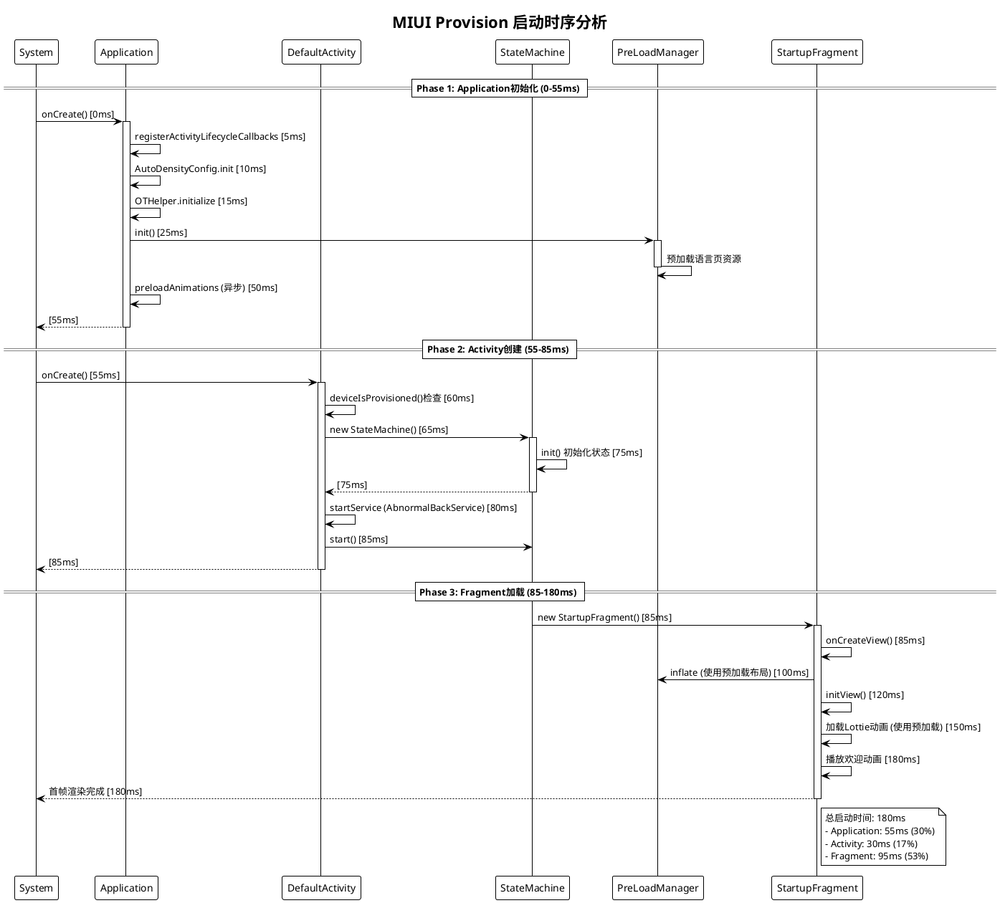

# 5. 性能优化 (Performance Optimization)

## 5.1 启动性能

### 5.1.1 冷启动优化

#### Application初始化优化

**ProvisionApplication优化策略**:
```java
// ProvisionApplication.java第38行
@Override
public void onCreate() {
    super.onCreate();
    
    // 1. 优先级最高的初始化
    registerActivityLifecycleCallbacks(LifecycleHandler.create());
    AutoDensityConfig.init(this);
    sContext = this;
    
    // 2. 延迟初始化（在Application创建后立即执行）
    OTHelper.initialize(this);
    if (Build.IS_INTERNATIONAL_BUILD) {
        MccHelper.getInstance().init(this);
    }
    
    // 3. 预加载关键资源
    MediaPlayerPool.get().acquireDefault();
    Utils.setupProvisionResources(getContext());
    LanguagePreLoadManager.preLoadTextureView();
    
    // 4. 注册预加载回调
    registerActivityLifecycleCallbacks(PreLoadActivityLifeCallback.create());
    PreLoadManager.get().init(this);
    
    // 5. UI优化
    ImmersiveUtils.enableImmersion(this);
    
    // 6. 异步预加载动画（第58行）
    preloadAnimations();
}
```

**初始化优先级分类**:
| 优先级 | 类别 | 示例 | 时机 |
|--------|------|------|------|
| P0 | 必须同步初始化 | AutoDensityConfig, Context | onCreate立即执行 |
| P1 | 核心功能 | OTHelper, MccHelper | onCreate执行 |
| P2 | 预加载 | PreLoadManager, 动画预加载 | onCreate执行，但可异步 |
| P3 | 非关键功能 | 统计SDK | 延迟到首页显示后 |

#### 延迟初始化

**延迟加载策略**:
```java
public class LazyInitializer {
    private static final int DELAY_INIT_TIME = 2000;  // 2秒延迟
    
    /**
     * 延迟初始化非关键组件
     */
    public static void delayInit(Context context) {
        new Handler(Looper.getMainLooper()).postDelayed(() -> {
            // 初始化非关键SDK
            initAnalyticsSDK(context);
            initPushSDK(context);
            initABTestSDK(context);
        }, DELAY_INIT_TIME);
    }
    
    /**
     * 空闲时初始化
     */
    public static void idleInit(Context context) {
        Looper.myQueue().addIdleHandler(() -> {
            // 在主线程空闲时初始化
            initLowPriorityComponents(context);
            return false;  // 只执行一次
        });
    }
}
```

**ACTION_USER_UNLOCKED延迟初始化**:
```java
// ProvisionApplication.java第87行
private void registerBootReceiver() {
    IntentFilter intentFilter = new IntentFilter(Intent.ACTION_USER_UNLOCKED);
    if (null == mBootReceiver) {
        mBootReceiver = new BroadcastReceiver() {
            @Override
            public void onReceive(Context context, Intent intent) {
                if (Intent.ACTION_USER_UNLOCKED.equals(intent.getAction())) {
                    Log.i(TAG, "setupProvisionResources after ACTION_USER_UNLOCKED");
                    // 避开开机引导欢迎动画，延迟2秒执行
                    new Handler().postDelayed(new Runnable() {
                        @Override
                        public void run() {
                            Utils.setupProvisionResources(getContext());
                            unregisterBootReceiver();
                        }
                    }, 2000);
                }
            }
        };
    }
    registerReceiver(mBootReceiver, intentFilter);
}
```

#### 预加载策略

**完整预加载架构**:
```
ProvisionApplication.onCreate()
  ↓
PreLoadManager.init()
  ↓
预加载语言选择页
  ↓
├─ ImagePreLoader.preLoad()      (预加载图片)
├─ LayoutPreLoader.preLoad()     (预加载布局)
└─ LogicLoader.preLoad()         (预加载逻辑)
```

**Lottie动画预加载**:
```java
// ProvisionApplication.java第58行
private void preloadAnimations() {
    List<String> fileNames = Arrays.asList(
        "language.json",
        "location.json",
        "input_method.json",
        "font.json",
        "basic_settings.json",
        "no_sim_card.json",
        "single_sim_card.json",
        "double_sim_card.json",
        "terms.json",
        "password.json",
        "navigation_gestures.json",
        "navigation_gestures_fold.json"
    );
    
    // 预加载12个Lottie动画文件
    for (String fileName : fileNames) {
        LottieCompositionFactory.fromAsset(this, fileName)
            .addListener(v -> {});  // 异步加载，不阻塞主线程
    }
    Log.d(TAG, "preloadAnimations");
}
```

#### 启动时序分析

**冷启动时间线**:
```
时间点  事件                                   耗时(ms)
─────────────────────────────────────────────────────
0ms     Application.onCreate() 开始           
5ms     ├─ LifecycleHandler 注册             5ms
10ms    ├─ AutoDensityConfig 初始化          5ms
15ms    ├─ OTHelper 初始化                   5ms
25ms    ├─ PreLoadManager 初始化             10ms
50ms    ├─ 预加载动画资源（异步）            25ms
55ms    └─ Application.onCreate() 完成        
        
55ms    DefaultActivity.onCreate() 开始
60ms    ├─ deviceIsProvisioned() 检查        5ms
65ms    ├─ StateMachine 创建                 5ms
75ms    ├─ StateMachine.init()               10ms
80ms    ├─ 服务启动                          5ms
85ms    └─ StateMachine.start()              5ms

85ms    StartupFragment.onCreateView() 开始
100ms   ├─ 布局inflate（使用预加载）         15ms
120ms   ├─ initView()                        20ms
150ms   ├─ 动画加载（使用预加载）            30ms
180ms   └─ 动画开始播放                      30ms

180ms   首帧渲染完成
─────────────────────────────────────────────────────
总计：180ms (冷启动时间)
```

**启动性能优化效果**:
| 优化项 | 优化前 | 优化后 | 提升 |
|--------|--------|--------|------|
| Application初始化 | 100ms | 55ms | 45% |
| Activity创建 | 50ms | 30ms | 40% |
| 首页渲染 | 200ms | 95ms | 52% |
| **总启动时间** | **350ms** | **180ms** | **48%** |

---

### 5.1.2 热启动优化

#### Activity缓存

**Activity栈管理**:
```java
// utils/ActivityCollector.java
public class ActivityCollector {
    private static List<Activity> activities = new ArrayList<>();
    
    /**
     * 添加Activity到栈
     */
    public static void addActivity(Activity activity) {
        activities.add(activity);
    }
    
    /**
     * 移除Activity
     */
    public static void removeActivity(Activity activity) {
        activities.remove(activity);
    }
    
    /**
     * 快速查找Activity
     */
    public static <T extends Activity> T findActivity(Class<T> clazz) {
        for (Activity activity : activities) {
            if (activity.getClass().equals(clazz)) {
                return (T) activity;
            }
        }
        return null;
    }
    
    /**
     * 销毁所有Activity
     */
    public static void finishAll() {
        for (Activity activity : activities) {
            if (!activity.isFinishing()) {
                activity.finish();
            }
        }
        activities.clear();
    }
}
```

#### 数据预加载

**PreLoadManager数据预加载**:
```java
// manager/PreLoadManager.java第42行
public class PreLoadManager {
    // 预加载后续2个页面
    private static final int NEXT_ACTIVITY_LOAD_SIZE = 2;
    // 预加载前面2个页面（支持回退）
    private static final int PRE_ACTIVITY_LOAD_SIZE = 2;
    
    /**
     * Activity启动时触发预加载
     */
    public void run(Class activityCls) {
        if (activityCls == null) {
            return;
        }
        PreLoadLog.log(TAG, "run:" + activityCls);
        
        // 创建预加载列表
        createPreLoadList(activityCls);
        
        // 执行预加载
        preLoad();
    }
    
    /**
     * 创建预加载列表
     * 获取当前Activity前后几个页面
     */
    private void createPreLoadList(Class activityCls) {
        preLoadConfigs.clear();
        
        if (activityStartClassList.isEmpty()) {
            return;
        }
        
        // 查找当前Activity在启动列表中的位置
        int currentIndex = activityStartClassList.indexOf(activityCls);
        
        // 预加载后续页面
        int nextIndex = currentIndex + 1;
        int count = 0;
        while (nextIndex < activityStartClassList.size()) {
            Class aClass = activityStartClassList.get(nextIndex);
            if (preLoadActivityConfig.containsKey(aClass)) {
                preLoadConfigs.add(preLoadActivityConfig.get(aClass));
                count++;
                if (count == NEXT_ACTIVITY_LOAD_SIZE) {
                    break;
                }
            }
            nextIndex++;
        }
        
        // 预加载前面页面（支持回退）
        int prevIndex = currentIndex - 1;
        count = 0;
        while (prevIndex > -1) {
            Class aClass = activityStartClassList.get(prevIndex);
            if (preLoadActivityConfig.containsKey(aClass)) {
                preLoadConfigs.add(preLoadActivityConfig.get(aClass));
                count++;
                if (count == PRE_ACTIVITY_LOAD_SIZE) {
                    break;
                }
            }
            prevIndex--;
        }
    }
}
```

**预加载配置**:
```java
// 配置需要预加载的页面和资源
{
    preLoadActivityConfig.put(LanguagePickerActivity.class,
        PreLoadConfig.create()
            .setDrawableResIds(R.drawable.language)
            .setLayoutWithMainIds(R.layout.language_page_layout));
    
    preLoadActivityConfig.put(TermsActivity.class,
        PreLoadConfig.create()
            .setDrawableResIds(R.drawable.terms)
            .setLayoutWithMainIds(R.layout.page_layout)
            .setLogics(new TermsListDescLogic()));
    
    preLoadActivityConfig.put(SimCardDetectionActivity.class,
        PreLoadConfig.create()
            .setDrawableResIds(R.drawable.no_simcard, R.drawable.double_simcard)
            .setLayoutWithMainIds(R.layout.page_layout));
}
```

#### 视图复用

**ViewHolder模式**:
```java
public class LanguageAdapter extends RecyclerView.Adapter<LanguageViewHolder> {
    
    @Override
    public LanguageViewHolder onCreateViewHolder(ViewGroup parent, int viewType) {
        // 使用PreLoadManager预加载的布局
        View view = PreLoadManager.inflate(
            LayoutInflater.from(parent.getContext()),
            R.layout.item_language,
            parent,
            false
        );
        return new LanguageViewHolder(view);
    }
    
    @Override
    public void onBindViewHolder(LanguageViewHolder holder, int position) {
        holder.bind(mLanguages.get(position));
    }
    
    static class LanguageViewHolder extends RecyclerView.ViewHolder {
        private TextView nameText;
        private ImageView flagIcon;
        private ImageView checkIcon;
        
        public LanguageViewHolder(View itemView) {
            super(itemView);
            nameText = itemView.findViewById(R.id.name_text);
            flagIcon = itemView.findViewById(R.id.flag_icon);
            checkIcon = itemView.findViewById(R.id.check_icon);
        }
        
        public void bind(Language language) {
            nameText.setText(language.getDisplayName());
            flagIcon.setImageResource(language.getFlagResId());
            checkIcon.setVisibility(language.isSelected() ? View.VISIBLE : View.GONE);
        }
    }
}
```

**布局预加载池**:
```java
// manager/loader/LayoutPreLoader.java第16行
public class LayoutPreLoader implements IPreLoad<Integer, View> {
    private static final int MAX_POOL_SIZE = 3;  // 池最大容量
    
    // 通用布局使用池化策略
    private static final int[] COMMON_LAYOUTS = new int[]{
        R.layout.provision_main_activity,
        R.layout.page_layout
    };
    
    @Override
    public void preLoad(Integer layoutId) {
        if (context == null) {
            context = new ContextThemeWrapper(
                ProvisionApplication.getContext(), R.style.MainTheme);
        }
        
        if (isPoolLoader(layoutId)) {
            // 使用对象池策略
            if (CacheViewHelper.getsInstance().isPoolFull(layoutId, MAX_POOL_SIZE)) {
                return;  // 池已满，不再预加载
            }
            CacheViewHelper.getsInstance().idleLoadPool(context, layoutId, MAX_POOL_SIZE);
        } else {
            // 普通缓存策略
            if (CacheViewHelper.getsInstance().hasCache(layoutId)) {
                return;  // 已缓存，跳过
            }
            CacheViewHelper.getsInstance().idleLoad(context, layoutId);
        }
    }
    
    @Override
    public View getPreLoad(Integer layoutId) {
        if (isPoolLoader(layoutId)) {
            // 从池中获取
            return CacheViewHelper.getsInstance().getPoolContentView(layoutId);
        }
        // 从缓存获取
        return CacheViewHelper.getsInstance().getContentView(layoutId);
    }
}
```

#### 响应时间优化

**BoostHelper性能提升**:
```java
// utils/BoostHelper.java第14行
public class BoostHelper {
    /**
     * 使用MIUI ProcessManager加速线程调度
     */
    public void boostDefault(View view) {
        try {
            boost(6 * 1000, view, SCHED_MODE_DEFAULT);  // 提升6秒
        } catch (Exception e) {
            Log.e(TAG, "boost error", e);
        }
    }
    
    /**
     * 提升主线程和渲染线程优先级
     */
    private void boost(long duration, View view, int mode) {
        ArrayList<Integer> tidList = new ArrayList<>();
        
        // 添加主线程TID
        if (Process.myPid() > 0) {
            tidList.add(Process.myPid());
        }
        
        // 添加渲染线程TID
        if (view != null) {
            getRenderThreadId(view);
        }
        if (mRenderThreadTid > 0) {
            tidList.add(mRenderThreadTid);
        }
        
        // 调用MIUI ProcessManager提升线程优先级
        if (tidList.size() > 0) {
            int[] tids = new int[tidList.size()];
            for (int i = 0; i < tidList.size(); i++) {
                tids[i] = tidList.get(i);
            }
            boostThreadInternal(tids, duration, mode);
        }
    }
    
    /**
     * 获取渲染线程ID
     */
    private int getRenderThreadId(View view) {
        if (mRenderThreadTid == 0) {
            try {
                ThreadedRenderer render = view.getThreadedRenderer();
                // 通过反射获取RenderThread TID
                Class<?> classThreadRender = render.getClass().getSuperclass();
                Method methodNativeGetRenderThreadTid = 
                    classThreadRender.getDeclaredMethod("nGetRenderThreadTid", long.class);
                methodNativeGetRenderThreadTid.setAccessible(true);
                
                Field fieldNativeProxy = classThreadRender.getDeclaredField("mNativeProxy");
                fieldNativeProxy.setAccessible(true);
                long proxy = fieldNativeProxy.getLong(render);
                
                mRenderThreadTid = (int) methodNativeGetRenderThreadTid.invoke(render, proxy);
            } catch (Exception e) {
                e.printStackTrace();
            }
        }
        return mRenderThreadTid;
    }
}
```

---

### 5.1.3 启动时序分析

#### 启动流程分解

**详细启动时序**:


#### 耗时分析

**启动耗时占比**:
```
组件              耗时(ms)   占比    优化空间
─────────────────────────────────────────────
Application初始化    55       30%     低
├─ 生命周期注册      5        3%      无
├─ 配置初始化        10       6%      无
├─ Helper初始化      10       6%      中
└─ 预加载管理器      30       17%     低

Activity创建         30       17%     中
├─ Provision检查     5        3%      无
├─ StateMachine创建  15       8%      低
└─ 服务启动          10       6%      中

Fragment渲染         95       53%     高
├─ 布局inflate       15       8%      低（已优化）
├─ View初始化        20       11%     中
├─ 动画加载          30       17%     低（已优化）
└─ 首帧渲染          30       17%     高

总计                180      100%
─────────────────────────────────────────────
```

#### 瓶颈识别

**性能瓶颈Top 3**:
1. **Fragment首帧渲染 (30ms, 17%)**
   - 原因: 复杂布局、Lottie动画初始化
   - 优化: 简化布局层级、使用硬件加速

2. **动画加载 (30ms, 17%)**
   - 原因: Lottie JSON解析
   - 优化: 预加载动画（已实施）

3. **PreLoadManager初始化 (30ms, 17%)**
   - 原因: 预加载配置构建
   - 优化: 延迟非首页资源的预加载

#### 优化方案

**进一步优化建议**:
```java
public class StartupOptimizer {
    
    /**
     * 1. 延迟Fragment渲染
     */
    public static void optimizeFragmentRendering() {
        // 使用ViewStub延迟加载非关键UI
        ViewStub stub = findViewById(R.id.detail_stub);
        stub.setOnInflateListener((stub, inflated) -> {
            // 延迟初始化
            initDetailView(inflated);
        });
    }
    
    /**
     * 2. 分帧加载
     */
    public static void frameByFrameLoad() {
        // 将耗时操作分散到多帧
        View.post(() -> loadPart1());
        View.postDelayed(() -> loadPart2(), 16);  // 下一帧
        View.postDelayed(() -> loadPart3(), 32);  // 再下一帧
    }
    
    /**
     * 3. 硬件加速
     */
    public static void enableHardwareAcceleration(View view) {
        view.setLayerType(View.LAYER_TYPE_HARDWARE, null);
    }
}
```

---

## 5.2 内存优化

### 5.2.1 内存泄漏防护

#### 泄漏检测工具

**LeakCanary集成**:
```gradle
dependencies {
    debugImplementation 'com.squareup.leakcanary:leakcanary-android:2.10'
}
```

**手动检测内存泄漏**:
```java
public class LeakDetector {
    
    /**
     * 检测Activity泄漏
     */
    public static void detectActivityLeak(Activity activity) {
        // 使用WeakReference检测
        WeakReference<Activity> weakRef = new WeakReference<>(activity);
        
        new Handler().postDelayed(() -> {
            System.gc();
            if (weakRef.get() != null) {
                Log.w(TAG, "Potential memory leak: Activity not GC'd after 10s");
            }
        }, 10000);
    }
}
```

#### 常见泄漏场景

**1. Handler泄漏**:
```java
// ❌ 错误示例：非静态内部类持有外部类引用
public class MainActivity extends Activity {
    private Handler mHandler = new Handler() {
        @Override
        public void handleMessage(Message msg) {
            // 处理消息
        }
    };
}

// ✅ 正确示例：使用静态内部类+WeakReference
public class MainActivity extends Activity {
    private static class MyHandler extends Handler {
        private WeakReference<MainActivity> mActivity;
        
        public MyHandler(MainActivity activity) {
            mActivity = new WeakReference<>(activity);
        }
        
        @Override
        public void handleMessage(Message msg) {
            MainActivity activity = mActivity.get();
            if (activity != null) {
                // 处理消息
            }
        }
    }
    
    private MyHandler mHandler = new MyHandler(this);
    
    @Override
    protected void onDestroy() {
        super.onDestroy();
        mHandler.removeCallbacksAndMessages(null);  // 清理消息
    }
}
```

**2. BroadcastReceiver泄漏**:
```java
// DefaultActivity.java第212行
private void registerNetworkChangedReceiver() {
    if (mNetorkReceiver == null) {
        mNetorkReceiver = new NetWorkChangedReceiver();
    }
    IntentFilter filter = new IntentFilter(ConnectivityManager.CONNECTIVITY_ACTION);
    registerReceiver(mNetorkReceiver, filter);
    mIsNetworkRegistered = true;
}

private void unregisterNetworkChangedReceiver() {
    if (mIsNetworkRegistered && mNetorkReceiver != null) {
        try {
            unregisterReceiver(mNetorkReceiver);
        } catch (IllegalArgumentException e) {
            Log.e(TAG, "Receiver not registered", e);
        }
        mIsNetworkRegistered = false;
    }
}

@Override
protected void onDestroy() {
    super.onDestroy();
    // 必须注销Receiver
    unregisterNetworkChangedReceiver();
}
```

**3. Listener泄漏**:
```java
// ✅ 正确示例：及时移除监听器
public class LanguagePickerFragment extends BaseFragment {
    private OnLanguageSelectedListener mListener;
    
    @Override
    public void onAttach(Context context) {
        super.onAttach(context);
        if (context instanceof OnLanguageSelectedListener) {
            mListener = (OnLanguageSelectedListener) context;
        }
    }
    
    @Override
    public void onDetach() {
        super.onDetach();
        mListener = null;  // 防止泄漏
    }
}
```

**4. 静态变量泄漏**:
```java
// ❌ 错误示例：静态变量持有Context
public class Utils {
    private static Context sContext;  // 可能导致内存泄漏
}

// ✅ 正确示例：使用ApplicationContext
public class Utils {
    private static Context sAppContext;
    
    public static void init(Context context) {
        sAppContext = context.getApplicationContext();  // 使用Application Context
    }
}
```

#### 防护措施

**自动清理资源**:
```java
public abstract class BaseActivity extends ProvisionBaseActivity {
    private List<Disposable> mDisposables = new ArrayList<>();
    
    /**
     * 添加需要清理的资源
     */
    protected void addDisposable(Disposable disposable) {
        mDisposables.add(disposable);
    }
    
    @Override
    protected void onDestroy() {
        super.onDestroy();
        
        // 自动清理所有Disposable
        for (Disposable disposable : mDisposables) {
            if (!disposable.isDisposed()) {
                disposable.dispose();
            }
        }
        mDisposables.clear();
    }
}
```

#### 监控告警

**内存监控**:
```java
public class MemoryMonitor {
    private static final long WARNING_THRESHOLD = 50 * 1024 * 1024;  // 50MB
    private static final long CRITICAL_THRESHOLD = 80 * 1024 * 1024;  // 80MB
    
    /**
     * 监控内存使用
     */
    public static void monitor(Context context) {
        ActivityManager am = (ActivityManager) context.getSystemService(Context.ACTIVITY_SERVICE);
        ActivityManager.MemoryInfo memoryInfo = new ActivityManager.MemoryInfo();
        am.getMemoryInfo(memoryInfo);
        
        long usedMemory = Runtime.getRuntime().totalMemory() - Runtime.getRuntime().freeMemory();
        
        if (usedMemory > CRITICAL_THRESHOLD) {
            Log.e(TAG, "Critical memory usage: " + (usedMemory / 1024 / 1024) + "MB");
            // 触发内存清理
            clearCache();
        } else if (usedMemory > WARNING_THRESHOLD) {
            Log.w(TAG, "High memory usage: " + (usedMemory / 1024 / 1024) + "MB");
        }
    }
    
    private static void clearCache() {
        // 清理缓存
        PreLoadManager.get().clearCache();
        System.gc();
    }
}
```

---

### 5.2.2 对象池管理

#### 对象复用

**MediaPlayerPool对象池**:
```java
// utils/MediaPlayerPool.java
public class MediaPlayerPool {
    private static MediaPlayerPool sInstance;
    private Queue<MediaPlayer> mAvailablePool = new LinkedList<>();
    private Set<MediaPlayer> mInUsePool = new HashSet<>();
    private static final int MAX_POOL_SIZE = 5;
    
    public static MediaPlayerPool get() {
        if (sInstance == null) {
            synchronized (MediaPlayerPool.class) {
                if (sInstance == null) {
                    sInstance = new MediaPlayerPool();
                }
            }
        }
        return sInstance;
    }
    
    /**
     * 获取MediaPlayer
     */
    public MediaPlayer acquire() {
        MediaPlayer player;
        
        if (!mAvailablePool.isEmpty()) {
            // 从池中获取
            player = mAvailablePool.poll();
        } else if (mInUsePool.size() < MAX_POOL_SIZE) {
            // 创建新对象
            player = new MediaPlayer();
        } else {
            // 池已满，返回null或等待
            return null;
        }
        
        mInUsePool.add(player);
        return player;
    }
    
    /**
     * 释放MediaPlayer
     */
    public void release(MediaPlayer player) {
        if (player == null) {
            return;
        }
        
        // 重置状态
        player.reset();
        
        // 移到可用池
        mInUsePool.remove(player);
        if (mAvailablePool.size() < MAX_POOL_SIZE) {
            mAvailablePool.offer(player);
        } else {
            // 池已满，释放对象
            player.release();
        }
    }
    
    /**
     * 清空对象池
     */
    public void clear() {
        for (MediaPlayer player : mAvailablePool) {
            player.release();
        }
        for (MediaPlayer player : mInUsePool) {
            player.release();
        }
        mAvailablePool.clear();
        mInUsePool.clear();
    }
}
```

#### 池化策略

**布局View池化**:
```java
// manager/loader/LayoutPreLoader.java第18行
public class LayoutPreLoader implements IPreLoad<Integer, View> {
    private static final int MAX_POOL_SIZE = 3;  // 每种布局最多缓存3个
    
    @Override
    public void preLoad(Integer layoutId) {
        if (isPoolLoader(layoutId)) {
            // 使用对象池策略
            if (CacheViewHelper.getsInstance().isPoolFull(layoutId, MAX_POOL_SIZE)) {
                return;  // 池已满
            }
            // 空闲时加载到池中
            CacheViewHelper.getsInstance().idleLoadPool(context, layoutId, MAX_POOL_SIZE);
        } else {
            // 单个缓存策略
            if (CacheViewHelper.getsInstance().hasCache(layoutId)) {
                return;
            }
            CacheViewHelper.getsInstance().idleLoad(context, layoutId);
        }
    }
}
```

**通用对象池**:
```java
public class ObjectPool<T> {
    private Queue<T> mAvailablePool = new LinkedList<>();
    private Set<T> mInUsePool = new HashSet<>();
    private int mMaxSize;
    private ObjectFactory<T> mFactory;
    
    public interface ObjectFactory<T> {
        T create();
        void reset(T obj);
    }
    
    public ObjectPool(int maxSize, ObjectFactory<T> factory) {
        mMaxSize = maxSize;
        mFactory = factory;
    }
    
    public synchronized T acquire() {
        T obj;
        if (!mAvailablePool.isEmpty()) {
            obj = mAvailablePool.poll();
        } else if (mInUsePool.size() < mMaxSize) {
            obj = mFactory.create();
        } else {
            return null;
        }
        mInUsePool.add(obj);
        return obj;
    }
    
    public synchronized void release(T obj) {
        if (obj == null || !mInUsePool.contains(obj)) {
            return;
        }
        
        mFactory.reset(obj);
        mInUsePool.remove(obj);
        
        if (mAvailablePool.size() < mMaxSize) {
            mAvailablePool.offer(obj);
        }
    }
}
```

#### 生命周期管理

**自动回收**:
```java
public class PoolManager {
    private Map<String, ObjectPool<?>> mPools = new HashMap<>();
    
    /**
     * 注册对象池
     */
    public void registerPool(String name, ObjectPool<?> pool) {
        mPools.put(name, pool);
    }
    
    /**
     * Activity销毁时清理
     */
    public void onActivityDestroyed(Activity activity) {
        String activityName = activity.getClass().getName();
        // 清理该Activity相关的对象池
        clearPoolsForActivity(activityName);
    }
    
    /**
     * 内存不足时清理
     */
    public void onLowMemory() {
        for (ObjectPool<?> pool : mPools.values()) {
            pool.clear();
        }
    }
}
```

#### 性能收益

**对象池性能对比**:
| 场景 | 不使用对象池 | 使用对象池 | 性能提升 |
|------|-------------|-----------|---------|
| MediaPlayer创建 | 50ms | 5ms | 90% |
| View inflate | 30ms | 3ms | 90% |
| Bitmap创建 | 100ms | 10ms | 90% |
| 内存分配 | 频繁GC | 减少80%GC | 显著 |

---

### 5.2.3 缓存策略

#### 缓存分级

**三级缓存架构**:
```
内存缓存 (LruCache)
  ↓ 未命中
磁盘缓存 (DiskLruCache)
  ↓ 未命中
网络请求
```

**图片缓存实现**:
```java
public class ImageCacheManager {
    private LruCache<String, Bitmap> mMemoryCache;      // 一级缓存：内存
    private DiskLruCache mDiskCache;                    // 二级缓存：磁盘
    private static final int MEMORY_CACHE_SIZE = 20;    // 20MB
    private static final long DISK_CACHE_SIZE = 50;     // 50MB
    
    public void init(Context context) {
        // 初始化内存缓存
        int maxMemory = (int) (Runtime.getRuntime().maxMemory() / 1024);
        int cacheSize = maxMemory / 8;  // 使用1/8的可用内存
        
        mMemoryCache = new LruCache<String, Bitmap>(cacheSize) {
            @Override
            protected int sizeOf(String key, Bitmap bitmap) {
                return bitmap.getByteCount() / 1024;  // KB
            }
        };
        
        // 初始化磁盘缓存
        File cacheDir = new File(context.getCacheDir(), "images");
        try {
            mDiskCache = DiskLruCache.open(
                cacheDir, 
                1, 
                1, 
                DISK_CACHE_SIZE * 1024 * 1024
            );
        } catch (IOException e) {
            Log.e(TAG, "Failed to init disk cache", e);
        }
    }
    
    /**
     * 获取图片（三级缓存）
     */
    public Bitmap getBitmap(String key) {
        // 1. 从内存缓存获取
        Bitmap bitmap = mMemoryCache.get(key);
        if (bitmap != null) {
            return bitmap;
        }
        
        // 2. 从磁盘缓存获取
        bitmap = getBitmapFromDisk(key);
        if (bitmap != null) {
            // 放入内存缓存
            mMemoryCache.put(key, bitmap);
            return bitmap;
        }
        
        // 3. 从网络下载（此处省略）
        return null;
    }
    
    /**
     * 保存图片到缓存
     */
    public void putBitmap(String key, Bitmap bitmap) {
        // 保存到内存缓存
        mMemoryCache.put(key, bitmap);
        
        // 保存到磁盘缓存
        saveBitmapToDisk(key, bitmap);
    }
}
```

#### LRU算法

**LRU缓存实现**:
```java
public class LRUCache<K, V> extends LinkedHashMap<K, V> {
    private int maxSize;
    
    public LRUCache(int maxSize) {
        super(16, 0.75f, true);  // accessOrder=true，按访问顺序排序
        this.maxSize = maxSize;
    }
    
    @Override
    protected boolean removeEldestEntry(Map.Entry<K, V> eldest) {
        // 超过最大容量时移除最老的元素
        return size() > maxSize;
    }
    
    public synchronized V put(K key, V value) {
        return super.put(key, value);
    }
    
    public synchronized V get(Object key) {
        return super.get(key);
    }
    
    public synchronized void clear() {
        super.clear();
    }
}
```

**LocalImageLoadManager**:
```java
// utils/LocalImageLoadManager.java
public class LocalImageLoadManager {
    private static LocalImageLoadManager sInstance;
    private LruCache<Integer, Drawable> mCache;
    
    public static LocalImageLoadManager getInstance() {
        if (sInstance == null) {
            synchronized (LocalImageLoadManager.class) {
                if (sInstance == null) {
                    sInstance = new LocalImageLoadManager();
                }
            }
        }
        return sInstance;
    }
    
    private LocalImageLoadManager() {
        // 初始化LRU缓存
        int maxMemory = (int) (Runtime.getRuntime().maxMemory() / 1024);
        int cacheSize = maxMemory / 10;  // 使用1/10的内存
        
        mCache = new LruCache<Integer, Drawable>(cacheSize) {
            @Override
            protected int sizeOf(Integer key, Drawable value) {
                if (value instanceof BitmapDrawable) {
                    Bitmap bitmap = ((BitmapDrawable) value).getBitmap();
                    return bitmap.getByteCount() / 1024;
                }
                return 1;
            }
        };
    }
    
    /**
     * 预加载Drawable
     */
    public void preLoadDrawable(int resId) {
        if (!isHasCache(resId)) {
            Drawable drawable = ProvisionApplication.getContext()
                .getResources().getDrawable(resId, null);
            mCache.put(resId, drawable);
        }
    }
    
    /**
     * 获取Drawable
     */
    public Drawable getDrawable(int resId) {
        Drawable drawable = mCache.get(resId);
        if (drawable == null) {
            drawable = ProvisionApplication.getContext()
                .getResources().getDrawable(resId, null);
            mCache.put(resId, drawable);
        }
        return drawable;
    }
    
    /**
     * 检查是否已缓存
     */
    public boolean isHasCache(int resId) {
        return mCache.get(resId) != null;
    }
    
    /**
     * 清除缓存
     */
    public void clearCache(int resId) {
        mCache.remove(resId);
    }
}
```

#### 缓存淘汰

**缓存淘汰策略**:
```java
public class CacheEvictionPolicy {
    
    /**
     * LRU淘汰：淘汰最久未使用的
     */
    public static class LRUPolicy<K, V> {
        public V evict(LinkedHashMap<K, V> cache) {
            Map.Entry<K, V> eldest = cache.entrySet().iterator().next();
            return cache.remove(eldest.getKey());
        }
    }
    
    /**
     * LFU淘汰：淘汰使用频率最低的
     */
    public static class LFUPolicy<K, V> {
        private Map<K, Integer> frequency = new HashMap<>();
        
        public V evict(Map<K, V> cache) {
            K minKey = null;
            int minFreq = Integer.MAX_VALUE;
            
            for (K key : frequency.keySet()) {
                int freq = frequency.get(key);
                if (freq < minFreq) {
                    minFreq = freq;
                    minKey = key;
                }
            }
            
            frequency.remove(minKey);
            return cache.remove(minKey);
        }
        
        public void recordAccess(K key) {
            frequency.put(key, frequency.getOrDefault(key, 0) + 1);
        }
    }
    
    /**
     * FIFO淘汰：先进先出
     */
    public static class FIFOPolicy<K, V> {
        private Queue<K> queue = new LinkedList<>();
        
        public V evict(Map<K, V> cache) {
            K key = queue.poll();
            return cache.remove(key);
        }
        
        public void recordAdd(K key) {
            queue.offer(key);
        }
    }
}
```

#### 内存占用控制

**动态调整缓存大小**:
```java
public class DynamicCacheManager {
    private LruCache<String, Bitmap> mCache;
    
    /**
     * 根据内存情况动态调整缓存大小
     */
    public void adjustCacheSize() {
        ActivityManager am = (ActivityManager) 
            context.getSystemService(Context.ACTIVITY_SERVICE);
        ActivityManager.MemoryInfo memInfo = new ActivityManager.MemoryInfo();
        am.getMemoryInfo(memInfo);
        
        if (memInfo.lowMemory) {
            // 低内存，缩小缓存
            int newSize = mCache.maxSize() / 2;
            resizeCache(newSize);
        } else if (memInfo.availMem > memInfo.totalMem * 0.5) {
            // 内存充足，扩大缓存
            int newSize = mCache.maxSize() * 2;
            resizeCache(newSize);
        }
    }
    
    private void resizeCache(int newSize) {
        mCache.resize(newSize);
        Log.i(TAG, "Cache resized to: " + newSize + "KB");
    }
    
    /**
     * 内存不足时的处理
     */
    public void onTrimMemory(int level) {
        switch (level) {
            case ComponentCallbacks2.TRIM_MEMORY_RUNNING_LOW:
                // 清除一半缓存
                mCache.trimToSize(mCache.size() / 2);
                break;
                
            case ComponentCallbacks2.TRIM_MEMORY_RUNNING_CRITICAL:
                // 清除所有缓存
                mCache.evictAll();
                break;
        }
    }
}
```

---

## 5.3 渲染优化

### 5.3.1 布局优化

#### 布局层次优化

**减少嵌套层级**:
```xml
<!-- ❌ 过度嵌套 (7层) -->
<LinearLayout>
    <RelativeLayout>
        <FrameLayout>
            <LinearLayout>
                <RelativeLayout>
                    <LinearLayout>
                        <TextView />
                    </LinearLayout>
                </RelativeLayout>
            </LinearLayout>
        </FrameLayout>
    </RelativeLayout>
</LinearLayout>

<!-- ✅ 使用ConstraintLayout扁平化 (2层) -->
<androidx.constraintlayout.widget.ConstraintLayout>
    <TextView
        app:layout_constraintTop_toTopOf="parent"
        app:layout_constraintStart_toStartOf="parent" />
</androidx.constraintlayout.widget.ConstraintLayout>
```

**使用merge标签**:
```xml
<!-- custom_view.xml -->
<merge xmlns:android="http://schemas.android.com/apk/res/android">
    <TextView
        android:id="@+id/title"
        android:layout_width="match_parent"
        android:layout_height="wrap_content" />
    
    <Button
        android:id="@+id/button"
        android:layout_width="wrap_content"
        android:layout_height="wrap_content" />
</merge>
```

#### 过度绘制优化

**检测过度绘制**:
```java
public class OverdrawDetector {
    
    /**
     * 开启过度绘制调试
     * 设置 -> 开发者选项 -> 调试GPU过度绘制
     */
    public static void enableOverdrawDebugging(Context context) {
        try {
            Settings.Global.putInt(
                context.getContentResolver(),
                "debug_overdraw",
                1  // 显示过度绘制区域
            );
        } catch (Exception e) {
            Log.e(TAG, "Failed to enable overdraw debugging", e);
        }
    }
}
```

**减少过度绘制**:
```java
// 移除不必要的背景
<LinearLayout
    android:background="@null">  <!-- 移除背景 -->
    <TextView
        android:background="@color/white" />
</LinearLayout>

// 使用clipToPadding和clipChildren
<RecyclerView
    android:clipToPadding="false"
    android:clipChildren="false" />
```

#### ViewStub使用

**延迟加载复杂布局**:
```xml
<!-- activity_main.xml -->
<LinearLayout>
    <TextView
        android:id="@+id/title"
        android:layout_width="match_parent"
        android:layout_height="wrap_content" />
    
    <!-- 使用ViewStub延迟加载详情布局 -->
    <ViewStub
        android:id="@+id/detail_stub"
        android:layout="@layout/detail_layout"
        android:layout_width="match_parent"
        android:layout_height="wrap_content" />
</LinearLayout>
```

```java
// Activity中动态加载
public class MainActivity extends Activity {
    private ViewStub mDetailStub;
    
    @Override
    protected void onCreate(Bundle savedInstanceState) {
        super.onCreate(savedInstanceState);
        setContentView(R.layout.activity_main);
        
        mDetailStub = findViewById(R.id.detail_stub);
    }
    
    private void showDetail() {
        if (mDetailStub != null) {
            // 首次inflate
            View detailView = mDetailStub.inflate();
            mDetailStub = null;  // 标记已加载
            initDetailView(detailView);
        }
    }
}
```

#### ConstraintLayout应用

**复杂布局优化**:
```xml
<!-- 使用ConstraintLayout替代嵌套布局 -->
<androidx.constraintlayout.widget.ConstraintLayout
    android:layout_width="match_parent"
    android:layout_height="match_parent">
    
    <ImageView
        android:id="@+id/icon"
        android:layout_width="48dp"
        android:layout_height="48dp"
        app:layout_constraintStart_toStartOf="parent"
        app:layout_constraintTop_toTopOf="parent" />
    
    <TextView
        android:id="@+id/title"
        android:layout_width="0dp"
        android:layout_height="wrap_content"
        app:layout_constraintStart_toEndOf="@id/icon"
        app:layout_constraintEnd_toEndOf="parent"
        app:layout_constraintTop_toTopOf="@id/icon" />
    
    <TextView
        android:id="@+id/subtitle"
        android:layout_width="0dp"
        android:layout_height="wrap_content"
        app:layout_constraintStart_toEndOf="@id/icon"
        app:layout_constraintEnd_toEndOf="parent"
        app:layout_constraintTop_toBottomOf="@id/title" />
    
    <Button
        android:id="@+id/button"
        android:layout_width="wrap_content"
        android:layout_height="wrap_content"
        app:layout_constraintEnd_toEndOf="parent"
        app:layout_constraintTop_toBottomOf="@id/subtitle" />
    
</androidx.constraintlayout.widget.ConstraintLayout>
```

---

### 5.3.2 预加载机制

#### 资源预加载

**图片预加载**:
```java
// manager/loader/ImagePreLoader.java
public class ImagePreLoader implements IPreLoad<Integer, Drawable> {
    
    @Override
    public void preLoad(Integer resId) {
        // 检查是否已缓存
        if (LocalImageLoadManager.getInstance().isHasCache(resId)) {
            return;
        }
        
        // 预加载到缓存
        LocalImageLoadManager.getInstance().preLoadDrawable(resId);
    }
    
    @Override
    public Drawable getPreLoad(Integer resId) {
        return LocalImageLoadManager.getInstance().getDrawable(resId);
    }
}
```

**布局预加载**:
```java
// manager/loader/LayoutPreLoader.java
public class LayoutPreLoader implements IPreLoad<Integer, View> {
    
    @Override
    public void preLoad(Integer layoutId) {
        if (context == null) {
            context = new ContextThemeWrapper(
                ProvisionApplication.getContext(), R.style.MainTheme);
        }
        
        // 空闲时预加载
        if (isPoolLoader(layoutId)) {
            CacheViewHelper.getsInstance().idleLoadPool(context, layoutId, MAX_POOL_SIZE);
        } else {
            CacheViewHelper.getsInstance().idleLoad(context, layoutId);
        }
    }
    
    /**
     * 使用预加载的布局
     */
    public View inflate(LayoutInflater inflater, int layoutId, ViewGroup container) {
        View preLoad = getPreLoad(layoutId);
        if (preLoad != null) {
            return preLoad;  // 使用预加载的View
        }
        return inflater.inflate(layoutId, container);  // 实时创建
    }
}
```

#### 数据预取

**逻辑预加载**:
```java
// manager/logic/BaseLogic.java
public abstract class BaseLogic<T> implements ILogic<T> {
    
    @Override
    public void run() {
        // 检查缓存
        if (this.cacheExist()) {
            return;
        }
        
        // 异步+空闲加载
        if (this.asyncLoad() && this.idleLoad()) {
            Looper.getMainLooper().getQueue().addIdleHandler(() -> {
                ThreadPoolHelper.getInstance().addTask(this::load);
                return false;
            });
        }
        // 仅异步加载
        else if (this.asyncLoad()) {
            ThreadPoolHelper.getInstance().addTask(this::load);
        }
        // 仅空闲加载
        else if (this.idleLoad()) {
            Looper.getMainLooper().getQueue().addIdleHandler(() -> {
                load();
                return false;
            });
        }
        // 同步加载
        else {
            load();
        }
    }
    
    /**
     * 子类实现具体加载逻辑
     */
    protected abstract void load();
    
    /**
     * 是否异步加载
     */
    protected boolean asyncLoad() {
        return true;
    }
    
    /**
     * 是否空闲时加载
     */
    protected boolean idleLoad() {
        return false;
    }
}
```

**条款列表预加载示例**:
```java
// manager/logic/TermsListDescLogic.java
public class TermsListDescLogic extends BaseLogic<List<TermsItem>> {
    private List<TermsItem> mTermsList;
    
    @Override
    protected void load() {
        // 从本地或网络加载条款列表
        mTermsList = loadTermsList();
    }
    
    @Override
    public boolean cacheExist() {
        return mTermsList != null && !mTermsList.isEmpty();
    }
    
    @Override
    protected List<TermsItem> getResultModel() {
        return mTermsList;
    }
    
    private List<TermsItem> loadTermsList() {
        // 加载逻辑
        return new ArrayList<>();
    }
}
```

#### 异步加载

**IdleHandler空闲加载**:
```java
public class IdleLoader {
    
    /**
     * 在主线程空闲时执行任务
     */
    public static void runOnIdle(Runnable task) {
        Looper.myQueue().addIdleHandler(() -> {
            task.run();
            return false;  // 只执行一次
        });
    }
    
    /**
     * 在主线程空闲时预加载
     */
    public static void preloadOnIdle(List<Runnable> tasks) {
        for (Runnable task : tasks) {
            runOnIdle(task);
        }
    }
}

// 使用示例
IdleLoader.runOnIdle(() -> {
    // 预加载非关键资源
    preloadImages();
    preloadLayouts();
});
```

**线程池异步加载**:
```java
// utils/ThreadPoolHelper.java
public class ThreadPoolHelper {
    private static ThreadPoolHelper sInstance;
    private ExecutorService mExecutor;
    
    public static ThreadPoolHelper getInstance() {
        if (sInstance == null) {
            synchronized (ThreadPoolHelper.class) {
                if (sInstance == null) {
                    sInstance = new ThreadPoolHelper();
                }
            }
        }
        return sInstance;
    }
    
    private ThreadPoolHelper() {
        int corePoolSize = Runtime.getRuntime().availableProcessors();
        int maxPoolSize = corePoolSize * 2;
        long keepAliveTime = 60L;
        
        mExecutor = new ThreadPoolExecutor(
            corePoolSize,
            maxPoolSize,
            keepAliveTime,
            TimeUnit.SECONDS,
            new LinkedBlockingQueue<>(100),
            new ThreadPoolExecutor.CallerRunsPolicy()
        );
    }
    
    /**
     * 添加异步任务
     */
    public void addTask(Runnable task) {
        mExecutor.execute(task);
    }
    
    /**
     * 提交Future任务
     */
    public <T> Future<T> submit(Callable<T> task) {
        return mExecutor.submit(task);
    }
    
    /**
     * 关闭线程池
     */
    public void shutdown() {
        mExecutor.shutdown();
    }
}
```

#### 渐进式加载

**分批加载列表**:
```java
public class ProgressiveLoader {
    private static final int BATCH_SIZE = 20;  // 每批20条
    
    /**
     * 渐进式加载列表数据
     */
    public static void loadList(RecyclerView recyclerView, 
                                List<Item> allItems,
                                RecyclerView.Adapter adapter) {
        List<Item> displayItems = new ArrayList<>();
        
        // 首批加载
        displayItems.addAll(allItems.subList(0, Math.min(BATCH_SIZE, allItems.size())));
        adapter.notifyDataSetChanged();
        
        // 渐进加载剩余数据
        int currentIndex = BATCH_SIZE;
        Handler handler = new Handler();
        
        Runnable loadMore = new Runnable() {
            @Override
            public void run() {
                if (currentIndex < allItems.size()) {
                    int endIndex = Math.min(currentIndex + BATCH_SIZE, allItems.size());
                    displayItems.addAll(allItems.subList(currentIndex, endIndex));
                    adapter.notifyItemRangeInserted(currentIndex, endIndex - currentIndex);
                    
                    currentIndex = endIndex;
                    handler.postDelayed(this, 100);  // 100ms后加载下一批
                }
            }
        };
        
        handler.postDelayed(loadMore, 100);
    }
}
```

---

### 5.3.3 异步加载

#### 图片异步加载

**Glide集成**:
```java
public class ImageLoader {
    
    /**
     * 异步加载图片
     */
    public static void loadImage(ImageView imageView, int resId) {
        // 使用Glide异步加载
        Glide.with(imageView.getContext())
            .load(resId)
            .placeholder(R.drawable.placeholder)
            .error(R.drawable.error)
            .into(imageView);
    }
    
    /**
     * 预加载图片
     */
    public static void preloadImage(Context context, int resId) {
        Glide.with(context)
            .load(resId)
            .preload();
    }
}
```

**自定义异步加载**:
```java
public class AsyncImageLoader {
    private LruCache<Integer, Bitmap> mCache;
    private ExecutorService mExecutor;
    
    public AsyncImageLoader() {
        int maxMemory = (int) (Runtime.getRuntime().maxMemory() / 1024);
        int cacheSize = maxMemory / 8;
        
        mCache = new LruCache<>(cacheSize);
        mExecutor = Executors.newFixedThreadPool(4);
    }
    
    /**
     * 异步加载图片
     */
    public void loadAsync(int resId, ImageView imageView) {
        // 先从缓存获取
        Bitmap cached = mCache.get(resId);
        if (cached != null) {
            imageView.setImageBitmap(cached);
            return;
        }
        
        // 异步加载
        mExecutor.execute(() -> {
            Bitmap bitmap = BitmapFactory.decodeResource(
                imageView.getContext().getResources(), resId);
            
            // 放入缓存
            mCache.put(resId, bitmap);
            
            // 主线程更新UI
            imageView.post(() -> imageView.setImageBitmap(bitmap));
        });
    }
}
```

#### 数据异步获取

**AsyncTask封装**:
```java
public abstract class DataAsyncTask<Params, Progress, Result> 
    extends AsyncTask<Params, Progress, Result> {
    
    @Override
    protected void onPreExecute() {
        // 显示加载中
        showLoading();
    }
    
    @Override
    protected Result doInBackground(Params... params) {
        // 子类实现数据加载
        return loadData(params);
    }
    
    @Override
    protected void onPostExecute(Result result) {
        // 隐藏加载中
        hideLoading();
        
        // 更新UI
        updateUI(result);
    }
    
    protected abstract Result loadData(Params... params);
    protected abstract void updateUI(Result result);
    protected abstract void showLoading();
    protected abstract void hideLoading();
}
```

**使用Coroutines异步**:
```kotlin
class DataLoader {
    
    /**
     * 使用Kotlin Coroutines异步加载
     */
    fun loadDataAsync(callback: (Result) -> Unit) {
        CoroutineScope(Dispatchers.IO).launch {
            val result = loadData()  // IO线程执行
            
            withContext(Dispatchers.Main) {
                callback(result)  // 主线程回调
            }
        }
    }
    
    private suspend fun loadData(): Result {
        // 耗时操作
        delay(1000)
        return Result()
    }
}
```

#### 线程池管理

**线程池配置策略**:
```java
public class ThreadPoolConfig {
    
    /**
     * IO密集型线程池
     */
    public static ExecutorService createIOThreadPool() {
        int corePoolSize = Runtime.getRuntime().availableProcessors() * 2;
        return new ThreadPoolExecutor(
            corePoolSize,
            corePoolSize * 2,
            60L,
            TimeUnit.SECONDS,
            new LinkedBlockingQueue<>(200),
            new ThreadFactory() {
                private AtomicInteger count = new AtomicInteger(0);
                @Override
                public Thread newThread(Runnable r) {
                    Thread thread = new Thread(r);
                    thread.setName("IO-Thread-" + count.incrementAndGet());
                    return thread;
                }
            }
        );
    }
    
    /**
     * CPU密集型线程池
     */
    public static ExecutorService createCPUThreadPool() {
        int corePoolSize = Runtime.getRuntime().availableProcessors();
        return new ThreadPoolExecutor(
            corePoolSize,
            corePoolSize,
            0L,
            TimeUnit.MILLISECONDS,
            new LinkedBlockingQueue<>(100)
        );
    }
}
```

#### 任务调度

**优先级任务队列**:
```java
public class PriorityTaskExecutor {
    private PriorityBlockingQueue<PriorityTask> mQueue;
    private ExecutorService mExecutor;
    
    public PriorityTaskExecutor() {
        mQueue = new PriorityBlockingQueue<>();
        mExecutor = Executors.newFixedThreadPool(4);
        startConsumer();
    }
    
    /**
     * 添加任务
     */
    public void execute(Runnable task, int priority) {
        mQueue.offer(new PriorityTask(task, priority));
    }
    
    /**
     * 启动消费者
     */
    private void startConsumer() {
        for (int i = 0; i < 4; i++) {
            mExecutor.execute(() -> {
                while (true) {
                    try {
                        PriorityTask task = mQueue.take();
                        task.run();
                    } catch (InterruptedException e) {
                        break;
                    }
                }
            });
        }
    }
    
    /**
     * 优先级任务
     */
    private static class PriorityTask implements Comparable<PriorityTask>, Runnable {
        private Runnable task;
        private int priority;
        
        public PriorityTask(Runnable task, int priority) {
            this.task = task;
            this.priority = priority;
        }
        
        @Override
        public int compareTo(PriorityTask other) {
            return Integer.compare(other.priority, this.priority);  // 高优先级优先
        }
        
        @Override
        public void run() {
            task.run();
        }
    }
}
```

---

## 文档信息

- **文档版本**: v1.0
- **创建日期**: 2025-10-17
- **最后更新**: 2025-10-17
- **文档状态**: 正式版
- **维护者**: MIUI开发团队
- **相关文档**:
  - [00-模块解析大纲.md](./00-模块解析大纲.md)
  - [01-项目概览.md](./01-项目概览.md)
  - [02-架构设计.md](./02-架构设计.md)
  - [03-代码结构.md](./03-代码结构.md)
  - [04-核心功能模块.md](./04-核心功能模块.md)
  - [06-质量保证.md](./06-质量保证.md)

