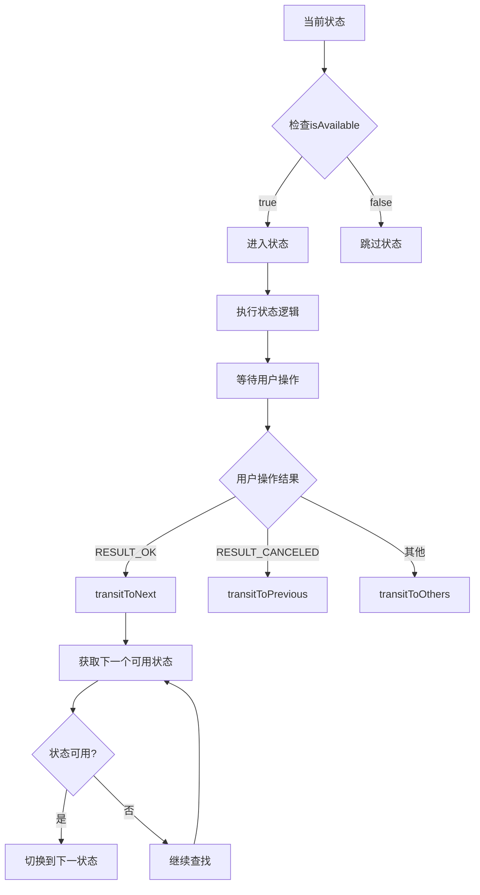

# 开机引导界面迁徙逻辑架构设计分析

##  架构概述

作为架构师，我将从系统设计的角度科学地分析MIUI开机引导的界面迁徙逻辑，重点关注架构模式、设计原则和性能优化策略。

##  核心架构模式

### 1. 状态机模式 (State Machine Pattern)

#### 架构设计
```java
// 核心状态机架构
public class StateMachine {
    private SparseArray<StateInfo> mStates;        // 状态注册表
    private State mCurrentState;                   // 当前状态
    private State mCompleteState;                  // 完成状态
    private ArrayList<State> mStateStack;          // 状态栈（支持回退）
    
    // 状态信息封装
    private class StateInfo {
        private State current;  // 当前状态
        private State next;     // 下一个状态
    }
}
```

#### 设计优势
- **解耦性**: 状态与状态转换逻辑分离
- **可扩展性**: 新增状态无需修改现有代码
- **可维护性**: 状态转换逻辑集中管理
- **可测试性**: 每个状态可独立测试

### 2. 策略模式 (Strategy Pattern)

#### 条件判断策略
```java
// 状态可用性检查策略
public abstract class State {
    public abstract boolean isAvailable(boolean toNext);
    
    // 具体策略实现
    public static class FontState extends State {
        @Override
        public boolean isAvailable(boolean toNext) {
            return Utils.isMiSansSupportLanguages() && 
                   FontStyleFragment.getFontList(context).size()==2 && 
                   !Utils.isFoldDevice() && 
                   !Utils.isInProvisionState(context);
        }
    }
}
```

#### 设计优势
- **动态决策**: 运行时根据条件动态选择状态
- **多维度判断**: 设备类型、功能支持、地区版本等
- **灵活配置**: 不同设备配置不同的状态流程

##  界面迁徙决策逻辑

### 1. 多维度决策矩阵

| 决策维度 | 影响因子 | 决策逻辑 |
|---------|---------|---------|
| **设备类型** | 折叠屏、平板、手机 | `Utils.isFlipDevice()`, `Utils.isTabletDevice()` |
| **地区版本** | 国际版、国内版 | `miui.os.Build.IS_INTERNATIONAL_BUILD` |
| **功能支持** | MiMover、eSIM、Google服务 | `Utils.supportMiMover()`, `Utils.isSupportEsimMode()` |
| **企业配置** | 企业版、标准版 | `miui.enterprise.EnterpriseManagerStub.ENTERPRISE_ACTIVATED` |
| **网络状态** | WiFi连接、网络验证 | `Utils.isWifiConnected()`, `NetworkUtils.isCaptivePortalValidated()` |

### 2. 状态转换决策树



### 3. 关键决策点分析

#### 3.1 输入法后的分支决策
```java
// 决策逻辑: DefaultActivity.java 第2240-2251行
if (Utils.isNewGlobalOOBE()) {
    // 新版本流程：跳过WiFi和字体设置
    setNextState(inputMethodState, termsState);
} else {
    // 旧版本流程：包含WiFi和字体设置
    setNextState(inputMethodState, wifiSetting);
    setNextState(wifiSetting, fontSize);
    setNextState(fontSize, termsState);
}
```

**架构分析**:
- **策略选择**: 基于版本和地区动态选择流程
- **性能优化**: 新版本跳过非必要步骤，提升用户体验
- **向后兼容**: 旧版本保持完整流程

#### 3.2 条款后的分支决策
```java
// 决策逻辑: DefaultActivity.java 第2265-2300行
if (Utils.supportMiMover(mContext)) {
    // 支持数据迁移：基础设置 → 隐私中心 → 数据迁移
    setNextState(termsAndStatement, otherState);
    setNextState(otherState, PrivacyCenterState);
    setNextState(PrivacyCenterState, miMoverState);
    setNextState(miMoverState, activationState);
} else {
    // 不支持数据迁移：直接激活
    setNextState(termsAndStatement, activationState);
}
```

**架构分析**:
- **功能检测**: 动态检测设备功能支持
- **用户体验**: 根据功能支持调整流程复杂度
- **模块化**: 数据迁移作为独立模块

##  性能优化架构

### 1. 预加载机制 (PreLoadManager)

#### 架构设计
```java
public class PreLoadManager {
    private static final int NEXT_ACTIVITY_LOAD_SIZE = 2;  // 预加载后续2个页面
    private static final int PRE_ACTIVITY_LOAD_SIZE = 2;    // 预加载前序2个页面
    
    // 多维度预加载
    private ImagePreLoader imagePreLoader;      // 图片预加载
    private LayoutPreLoader layoutPreLoader;    // 布局预加载
    private LogicLoader logicLoader;            // 逻辑预加载
}
```

#### 性能优化策略
- **预测性加载**: 基于状态机预测下一个可能的状态
- **资源池管理**: 使用缓存池管理常用布局和图片
- **异步加载**: 后台线程预加载资源，不阻塞UI
- **内存管理**: 智能释放不再需要的预加载资源

### 2. 缓存策略

#### 布局缓存
```java
public class LayoutPreLoader implements IPreLoad<Integer, View> {
    public View inflate(LayoutInflater layoutInflater, int layoutId, ViewGroup container) {
        View preLoad = getPreLoad(layoutId);
        if (preLoad != null) {
            return preLoad;  // 使用预加载的布局
        }
        return layoutInflater.inflate(layoutId, container);  // 实时创建
    }
}
```

#### 图片缓存
```java
public class ImagePreLoader implements IPreLoad<Integer, Drawable> {
    @Override
    public void preLoad(Integer resId) {
        if(LocalImageLoadManager.getInstance().isHasCache(resId)){
            return;  // 已缓存，跳过
        }
        LocalImageLoadManager.getInstance().preLoadDrawable(resId);
    }
}
```

##  架构设计原则

### 1. 单一职责原则 (SRP)
- **StateMachine**: 只负责状态转换逻辑
- **State**: 只负责单个状态的业务逻辑
- **PreLoadManager**: 只负责资源预加载

### 2. 开闭原则 (OCP)
- **状态扩展**: 新增状态无需修改现有代码
- **条件扩展**: 新增判断条件通过重写`isAvailable`实现
- **流程扩展**: 新增流程分支通过配置实现

### 3. 依赖倒置原则 (DIP)
- **抽象依赖**: StateMachine依赖State抽象
- **接口隔离**: 不同预加载器实现不同接口
- **配置驱动**: 通过配置控制状态转换

### 4. 里氏替换原则 (LSP)
- **状态替换**: 任何State子类都可以替换父类
- **预加载替换**: 不同预加载器可以互相替换

##  架构优化建议

### 1. 状态机优化
```java
// 建议：使用Builder模式构建状态机
public class StateMachineBuilder {
    public StateMachineBuilder addState(State state) {
        // 添加状态
        return this;
    }
    
    public StateMachineBuilder setTransition(State from, State to) {
        // 设置状态转换
        return this;
    }
    
    public StateMachine build() {
        // 构建状态机
    }
}
```

### 2. 条件判断优化
```java
// 建议：使用责任链模式处理复杂条件
public abstract class ConditionHandler {
    protected ConditionHandler nextHandler;
    
    public abstract boolean canHandle(State state);
    public abstract boolean isAvailable(State state);
    
    public boolean handle(State state) {
        if (canHandle(state)) {
            return isAvailable(state);
        }
        return nextHandler != null ? nextHandler.handle(state) : true;
    }
}
```

### 3. 性能监控
```java
// 建议：添加性能监控
public class PerformanceMonitor {
    public void recordStateTransition(State from, State to, long duration) {
        // 记录状态转换耗时
    }
    
    public void recordPreLoadTime(String resource, long duration) {
        // 记录预加载耗时
    }
}
```

##  架构质量评估

### 1. 可维护性 
- **模块化设计**: 状态、状态机、预加载器独立模块
- **配置驱动**: 通过配置控制流程，减少硬编码
- **日志完善**: 详细的日志记录便于问题定位

### 2. 可扩展性 
- **状态扩展**: 新增状态无需修改现有代码
- **流程扩展**: 支持多种流程变体
- **功能扩展**: 预加载机制支持新资源类型

### 3. 性能表现 
- **预加载优化**: 显著减少界面切换延迟
- **缓存策略**: 减少重复资源加载
- **异步处理**: 不阻塞主线程

### 4. 可测试性 
- **状态隔离**: 每个状态可独立测试
- **依赖注入**: 便于Mock测试
- **接口抽象**: 便于单元测试

##  架构演进方向

### 1. 微服务化
- **状态服务**: 将状态管理独立为服务
- **预加载服务**: 将预加载逻辑独立为服务
- **配置服务**: 将流程配置独立为服务

### 2. 智能化
- **AI决策**: 使用机器学习优化状态转换决策
- **自适应加载**: 根据用户行为动态调整预加载策略
- **智能缓存**: 基于使用模式优化缓存策略

### 3. 云原生
- **配置中心**: 使用云配置中心管理流程配置
- **监控告警**: 集成云监控和告警系统
- **弹性伸缩**: 支持动态扩缩容

---

*此架构分析基于当前代码实现，为后续架构优化和重构提供科学依据*

