# 国际版 Wizard Script 配置机制分析

## 一、概述

### 1.1 配置文件位置
- **目录**: `res_gte_v34/raw/`
- **适用版本**: Android 14 (API 34) 及以上
- **文件数量**: 30个XML配置文件
- **配置标准**: 遵循 Google SetupWizard 规范

### 1.2 核心设计理念
国际版开机引导采用 **声明式配置** + **Google SetupWizard集成** 的架构模式，通过XML配置文件定义完整的向导流程，与Google原生开机向导深度集成。

## 二、配置文件架构

### 2.1 主配置文件
**文件**: `wizard_script.xml` (17.9 KB, 354行)

这是整个开机引导的 **顶层路由配置**，定义了主流程和各个子流程的入口。

#### 核心结构
```xml
<WizardScript xmlns:wizard="http://schemas.android.com/apk/res/com.google.android.setupwizard"
    wizard:version="2">
    
    <!-- 1. OEM前置配置 -->
    <WizardAction id="oem_pre_setup" />
    
    <!-- 2. MIUI启动页（替代Google Welcome） -->
    <WizardAction id="miui_startup"
        wizard:uri="intent:#Intent;package=com.android.provision;
                     action=com.android.provision.global.STARTUP;end">
        <result wizard:name="start_qr_provision" wizard:resultCode="101"
                wizard:action="check_user_unlock_qr" />
        <result wizard:action="check_user_unlock" />
    </WizardAction>
    
    <!-- 3. Quick Start快速配对流程 -->
    <WizardAction id="quick_start_flow"
        wizard:script="android.resource://com.android.provision/raw/wizard_script_quick_start_flow">
        <result wizard:action="miui_second" />
    </WizardAction>
    
    <!-- 4. 网络连接和更新流程 -->
    <WizardAction id="connect_and_update"
        wizard:script="android.resource://com.android.provision/raw/wizard_script_connect_and_update_flow">
        <result wizard:name="no_connection" wizard:resultCode="1"
                wizard:action="no_network_flow" />
    </WizardAction>
    
    <!-- 5. 账号配置流程 -->
    <WizardAction id="setup_as_new_flow"
        wizard:script="android.resource://com.android.provision/raw/wizard_script_account_flow">
        <result wizard:action="oem_post_setup" />
    </WizardAction>
    
    <!-- 6. MIUI第二阶段配置 -->
    <WizardAction id="miui_second"
        wizard:uri="intent:#Intent;action=com.android.provision.global.SECOND;end">
        <result wizard:action="oem_post_setup"/>
    </WizardAction>
    
    <!-- 7. OEM后置配置 -->
    <WizardAction id="oem_post_setup"
        wizard:uri="intent:#Intent;action=com.android.setupwizard.OEM_POST_SETUP;end" />
    
    <!-- 8. 退出向导 -->
    <WizardAction id="exit" />
</WizardScript>
```

### 2.2 子流程配置文件

#### (1) 网络连接和更新流程
**文件**: `wizard_script_connect_and_update_flow.xml` (14.1 KB)

**核心步骤**:
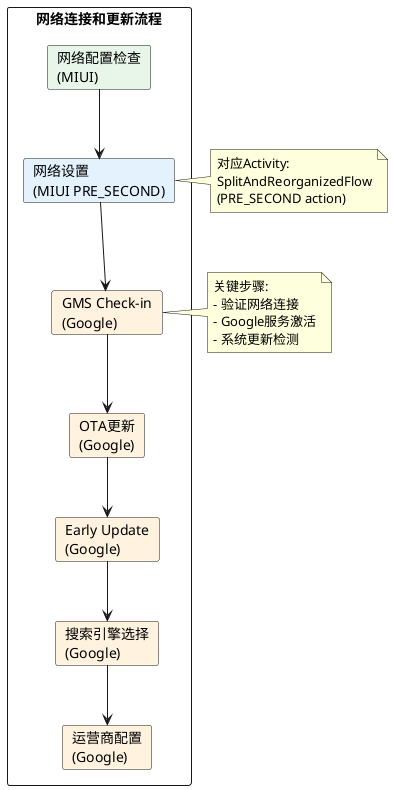

**关键Action**:
- `prov_profile_checking`: 检查运营商配置文件
- `network_settings`: **MIUI定制** (action=`com.android.provision.global.PRE_SECOND`)
- `pre_checkin_and_update`: GMS签入和更新前置检查
- `ota_update`: OTA系统更新
- `early_update`: Early Update (GMS更新)
- `search_selector_presync`: 搜索引擎选择
- `sim_carrier_setup_after_wifi`: WiFi连接后的运营商配置

#### (2) Quick Start 快速配对流程
**文件**: `wizard_script_quick_start_flow.xml` (6.4 KB)

**核心步骤**:
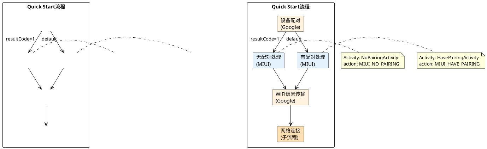

**MIUI集成点**:
- `no_pairing_case`: `com.android.provision.global.MIUI_NO_PAIRING`
- `pairing_case`: `com.android.provision.global.MIUI_HAVE_PAIRING`

#### (3) 账号配置流程
**文件**: `wizard_script_account_flow.xml` (7.2 KB)

**核心步骤**:
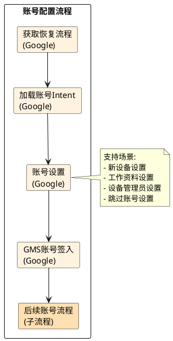

**关键特性**:
- 支持 **工作资料(Work Profile)** 配置
- 支持 **设备管理(Device Management)** 配置
- 支持 **跳过账号** 流程
- 支持 **企业零接触(Zero Touch)** 配置

#### (4) 其他关键子流程

| 文件名 | 用途 | 大小 | 关键特性 |
|--------|------|------|----------|
| `wizard_script_unified_restore_flow.xml` | 统一恢复流程 | 12.5 KB | 支持云恢复、设备间传输 |
| `wizard_script_zero_touch_flow.xml` | 企业零接触配置 | 5.7 KB | 企业设备自动配置 |
| `wizard_script_qr_provision_flow.xml` | 二维码配置 | 11.9 KB | 企业设备快速部署 |
| `wizard_script_nfc_provision_flow.xml` | NFC配置 | 10.4 KB | NFC设备快速配置 |
| `wizard_script_sim_setup_flow.xml` | SIM卡配置 | 3.2 KB | 多SIM卡管理 |
| `wizard_script_no_network_flow.xml` | 无网络流程 | 2.2 KB | 离线配置 |
| `wizard_script_no_account_flow.xml` | 无账号流程 | 2.4 KB | 跳过账号设置 |

## 三、配置工作机制

### 3.1 Intent URI 格式

配置文件使用 **Intent URI** 格式定义Activity跳转:

```xml
wizard:uri="intent:#Intent;
             package=com.android.provision;
             action=com.android.provision.global.STARTUP;
             end"
```

**格式说明**:
- `intent:#Intent`: URI协议头
- `package=`: 目标应用包名
- `action=`: Intent Action
- `end`: URI结束标记

**支持的参数类型**:
- `S.key=value`: String类型
- `B.key=true`: Boolean类型
- `i.key=100`: Integer类型
- `f.key=0x10000000`: Flag (用于launchFlags)

### 3.2 Result Code 机制

每个 `WizardAction` 可以定义多个 `result` 分支:

```xml
<WizardAction id="network_settings">
    <!-- 使用移动网络: resultCode=101 -->
    <result wizard:name="use_mobile" wizard:resultCode="101"
            wizard:action="sim_slots_selection" />
    
    <!-- 查看所有WiFi: resultCode=102 -->
    <result wizard:name="see_all_wifi" wizard:resultCode="102"
            wizard:action="wifi_settings" />
    
    <!-- 跳过: resultCode=1 -->
    <result wizard:name="skip" wizard:resultCode="1" />
    
    <!-- 默认: 完成后续更新 -->
    <result wizard:action="complete_in_flight_updates" />
</WizardAction>
```

**Result Code 约定**:
- `-1`: `RESULT_OK` (默认成功)
- `1`: `RESULT_SKIP` (跳过)
- `101-128`: 自定义结果码 (特殊流程)

### 3.3 Script 嵌套机制

通过 `wizard:script` 属性引用子配置文件:

```xml
<WizardAction id="quick_start_flow"
    wizard:script="android.resource://com.android.provision/raw/wizard_script_quick_start_flow">
    <result wizard:action="miui_second" />
</WizardAction>
```

**机制说明**:
1. **子脚本独立执行**: 子配置文件完整执行后返回
2. **结果传递**: 子脚本的最终结果传递给父脚本
3. **上下文保持**: `wizardBundle` 在脚本间传递，保持状态

### 3.4 条件执行机制

#### 生命周期条件
```xml
<!-- 仅在初始设置时执行 -->
<WizardAction id="ota_update" wizard:ifLifecycle="default" />

<!-- 仅在延迟设置时执行 -->
<WizardAction id="complete_in_flight_updates" wizard:ifLifecycle="deferred" />
```

#### 流程条件
```xml
<!-- 仅在特定流程中执行 -->
<WizardAction id="setup_as_new_flow" wizard:flow="SetupAsNewFlow" />
```

## 四、MIUI集成点

### 4.1 MIUI自定义Activity

| Action | Activity | 功能 | 阶段 |
|--------|----------|------|------|
| `com.android.provision.global.STARTUP` | `DefaultActivity` | MIUI启动页(语言选择) | 第一阶段入口 |
| `com.android.provision.global.PRE_SECOND` | `SplitAndReorganizedFlow` | 网络设置(WiFi/eSIM) | 网络配置 |
| `com.android.provision.global.MIUI_NO_PAIRING` | `NoPairingActivity` | Quick Start无配对处理 | Quick Start |
| `com.android.provision.global.MIUI_HAVE_PAIRING` | `HavePairingActivity` | Quick Start有配对处理 | Quick Start |
| `com.android.provision.global.SECOND` | `GlobalDefaultActivity` | MIUI第二阶段配置 | 第二阶段入口 |
| `com.android.provision.global.SECOND.PRE` | `FingerprintActivity` | 指纹/生物识别设置 | 安全设置 |
| `com.android.setupwizard.OEM_POST_SETUP` | `OemPostActivity` | OEM后置配置(祝贺页) | 完成阶段 |

### 4.2 MIUI与Google流程整合

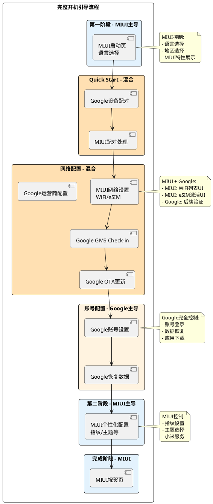

### 4.3 WizardManagerHelper核心类

**文件**: `src/com/android/provision/global/WizardManagerHelper.java`

```java
public class WizardManagerHelper {
    private static final String ACTION_NEXT = "com.android.wizard.NEXT";
    static final String EXTRA_SCRIPT_URI = "scriptUri";
    static final String EXTRA_ACTION_ID = "actionId";
    static final String EXTRA_WIZARD_BUNDLE = "wizardBundle";
    static final String EXTRA_RESULT_CODE = "com.android.setupwizard.ResultCode";
    
    // 生成下一步Intent
    public static Intent getNextIntent(Intent originalIntent, int resultCode) {
        Intent intent = new Intent(ACTION_NEXT);
        copyWizardManagerExtras(originalIntent, intent);
        intent.putExtra(EXTRA_RESULT_CODE, resultCode);
        return intent;
    }
    
    // 复制Wizard上下文
    public static void copyWizardManagerExtras(Intent srcIntent, Intent dstIntent) {
        dstIntent.putExtra(EXTRA_WIZARD_BUNDLE, srcIntent.getBundleExtra(EXTRA_WIZARD_BUNDLE));
        dstIntent.putExtra(EXTRA_SCRIPT_URI, srcIntent.getStringExtra(EXTRA_SCRIPT_URI));
        dstIntent.putExtra(EXTRA_ACTION_ID, srcIntent.getStringExtra(EXTRA_ACTION_ID));
    }
}
```

**工作原理**:
1. **接收Intent**: MIUI Activity接收来自Google SetupWizard的Intent
2. **提取上下文**: 从Intent中提取 `wizardBundle`, `scriptUri`, `actionId`
3. **业务处理**: 执行MIUI定制逻辑
4. **返回结果**: 通过 `getNextIntent()` 返回 `com.android.wizard.NEXT` Intent
5. **流程继续**: Google SetupWizard根据 `resultCode` 继续执行后续步骤

## 五、典型流程实例

### 5.1 完整的首次开机流程

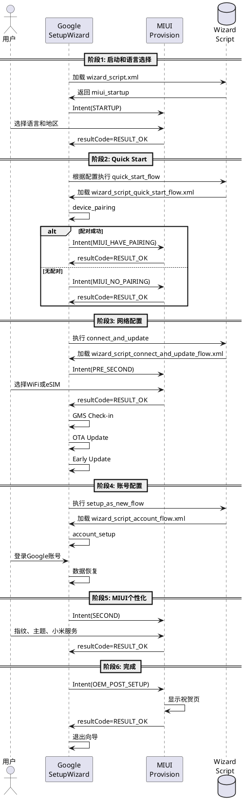

### 5.2 无网络流程

当用户跳过网络配置时:

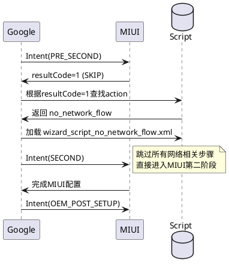

### 5.3 企业零接触流程

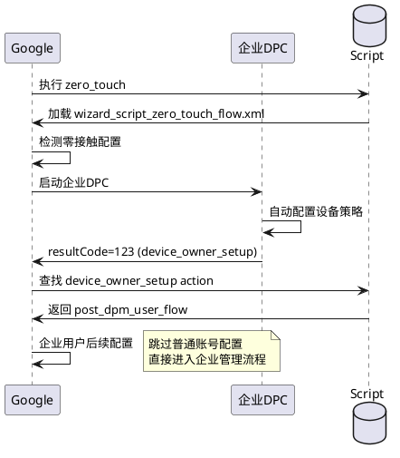

## 六、配置优势分析

### 6.1 架构优势

#### (1) 声明式配置
- **优点**: 流程清晰可见，易于理解和维护
- **灵活性**: 无需修改代码即可调整流程顺序
- **可测试性**: 可独立测试每个WizardAction

#### (2) 深度集成Google生态
- **兼容性**: 完全兼容Google GMS认证要求
- **一致性**: 用户体验与原生Android保持一致
- **功能完整**: 支持企业功能(Zero Touch, QR Code, NFC)

#### (3) 模块化设计
- **可组合**: 子脚本可自由组合
- **可复用**: 同一子脚本可在多个流程中复用
- **易扩展**: 新增流程只需添加新的XML文件

### 6.2 与国内版对比

| 维度 | 国际版 (Wizard Script) | 国内版 (State Machine) |
|------|----------------------|----------------------|
| **配置方式** | XML声明式配置 | Java代码硬编码 |
| **流程控制** | Google SetupWizard引擎 | 自研StateMachine |
| **灵活性** | 高 (XML配置即可调整) | 低 (需修改代码) |
| **Google集成** | 深度集成 | 无集成 |
| **企业功能** | 完整支持 | 不支持 |
| **维护成本** | 低 (配置文件维护) | 高 (代码维护) |
| **调试难度** | 中 (需理解Wizard机制) | 低 (直观的Java代码) |
| **定制能力** | 中 (受Google规范约束) | 高 (完全自主控制) |

### 6.3 技术挑战

#### (1) 调试复杂度
- **问题**: XML配置运行时解析，错误难以追踪
- **解决**: 增加日志记录，捕获Intent传递过程

#### (2) Google依赖
- **问题**: 依赖Google SetupWizard APK
- **解决**: 确保GMS包完整性，处理GMS缺失场景

#### (3) 版本兼容性
- **问题**: Google SetupWizard更新可能影响流程
- **解决**: 版本化配置文件(`res_gte_v34`), 适配不同Android版本

## 七、最佳实践建议

### 7.1 配置文件管理

#### (1) 版本控制
```
res_gte_v34/     # Android 14+
res_gte_v33/     # Android 13
res_gte_v31/     # Android 12
```

#### (2) 命名规范
- 主配置: `wizard_script.xml`
- 子流程: `wizard_script_<flow_name>_flow.xml`
- 单一功能: `wizard_script_<feature>.xml`

#### (3) 注释标准
```xml
<!--
    功能说明: 网络配置流程
    依赖: GMS Check-in, OTA服务
    修改人: XXX
    修改时间: 2024-10-10
-->
<WizardAction id="network_settings" />
```

### 7.2 MIUI定制开发

#### (1) Activity实现模板
```java
public class MiuiCustomActivity extends BaseActivity {
    @Override
    protected void onCreate(Bundle savedInstanceState) {
        super.onCreate(savedInstanceState);
        
        // 1. 提取Wizard上下文
        Intent intent = getIntent();
        Bundle wizardBundle = intent.getBundleExtra(
            WizardManagerHelper.EXTRA_WIZARD_BUNDLE);
        
        // 2. 业务逻辑处理
        // ...
        
        // 3. 返回结果
        Intent resultIntent = WizardManagerHelper.getNextIntent(
            intent, RESULT_OK);
        startActivity(resultIntent);
        finish();
    }
}
```

#### (2) Result Code规划
```java
public class MiuiResultCodes {
    public static final int RESULT_SKIP = 1;
    public static final int RESULT_USE_MOBILE = 101;
    public static final int RESULT_SEE_ALL_WIFI = 102;
    public static final int RESULT_SHOW_PSIM = 103;
}
```

#### (3) Manifest配置
```xml
<activity android:name=".global.MiuiCustomActivity"
          android:exported="true">
    <intent-filter>
        <action android:name="com.android.provision.global.CUSTOM_ACTION" />
        <category android:name="android.intent.category.DEFAULT" />
    </intent-filter>
</activity>
```

### 7.3 测试策略

#### (1) 单元测试
- 测试每个MIUI Activity的Result Code返回
- 测试WizardManagerHelper的Intent构造

#### (2) 集成测试
- 测试完整流程的端到端执行
- 测试各种Result Code的分支逻辑

#### (3) ADB调试命令
```bash
# 启动特定WizardAction
adb shell am start -a com.android.provision.global.STARTUP \
    -e scriptUri "android.resource://com.android.provision/raw/wizard_script" \
    -e actionId "miui_startup"

# 模拟Result Code返回
adb shell am start -a com.android.wizard.NEXT \
    --ei com.android.setupwizard.ResultCode 101

# 查看当前流程状态
adb logcat | grep -E "WizardManager|SetupWizard"
```

## 八、常见问题与解决方案

### 8.1 流程跳过问题

**问题**: 用户快速点击导致某些步骤被跳过

**原因**: Result Code处理不当，意外进入SKIP分支

**解决**:
```xml
<!-- 明确区分skip和continue -->
<WizardAction id="network_settings">
    <result wizard:name="user_skip" wizard:resultCode="1"
            wizard:action="no_network_flow" />
    <result wizard:name="timeout" wizard:resultCode="101"
            wizard:action="network_unavailable" />
    <result wizard:action="complete_in_flight_updates" />
</WizardAction>
```

### 8.2 循环跳转问题

**问题**: 流程陷入死循环，无法退出

**原因**: Action之间形成循环引用

**解决**:
```xml
<!-- 错误示例 -->
<WizardAction id="action_a" wizard:action="action_b" />
<WizardAction id="action_b" wizard:action="action_a" />

<!-- 正确示例 -->
<WizardAction id="action_a" wizard:action="action_b" />
<WizardAction id="action_b" wizard:action="END_OF_SCRIPT" />
```

### 8.3 GMS依赖缺失

**问题**: 某些设备缺少Google SetupWizard

**解决**:
```java
// 检测GMS可用性
boolean hasGms = isPackageInstalled("com.google.android.setupwizard");
if (!hasGms) {
    // 降级到国内版State Machine流程
    startActivity(new Intent(this, DefaultActivity.class));
    finish();
    return;
}

// 正常启动Wizard流程
Intent wizardIntent = new Intent();
wizardIntent.setAction("com.android.provision.global.STARTUP");
startActivity(wizardIntent);
```

### 8.4 配置版本兼容

**问题**: 不同Android版本配置不兼容

**解决**:
```kotlin
// 动态选择配置资源
val scriptResource = when {
    Build.VERSION.SDK_INT >= Build.VERSION_CODES.UPSIDE_DOWN_CAKE -> 
        R.raw.wizard_script  // res_gte_v34
    Build.VERSION.SDK_INT >= Build.VERSION_CODES.TIRAMISU -> 
        R.raw.wizard_script_v33
    else -> 
        R.raw.wizard_script_legacy
}
```

## 九、核心机制深度解析

### 9.1 Action约定机制详解

#### (1) Google官方Action规范

**问题**: 这些Action是Google内部约定好的吗？

**答案**: **是的**，但分为两类：

##### Google标准Action (固定约定)
这些Action是Google在SetupWizard框架中预定义的标准接口：

```java
// Google SetupWizard标准Action
com.android.setupwizard.WELCOME              // 欢迎页
com.android.setupwizard.NETWORK_SETTINGS     // 网络设置
com.android.setupwizard.GMS_CHECKIN          // GMS签入
com.android.setupwizard.ACCOUNT_SETUP        // 账号设置
com.android.setupwizard.CHECK_FRP            // FRP检查
com.android.setupwizard.OEM_POST_SETUP       // OEM后置配置
```

这些Action由Google在`com.google.android.setupwizard` APK中实现，厂商**不能修改**，只能**调用**。

##### MIUI自定义Action (厂商扩展)
MIUI可以定义自己的Action来插入定制页面：

```java
// MIUI自定义Action
com.android.provision.global.STARTUP         // MIUI启动页
com.android.provision.global.PRE_SECOND      // MIUI网络设置
com.android.provision.global.MIUI_NO_PAIRING // Quick Start无配对
com.android.provision.global.MIUI_HAVE_PAIRING // Quick Start有配对
com.android.provision.global.SECOND          // MIUI第二阶段
com.android.provision.global.SECOND.PRE      // MIUI生物识别
```

#### (2) Action工作原理

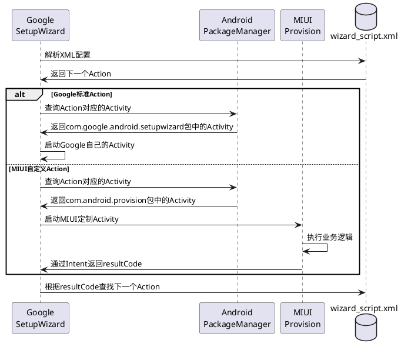

**关键机制**:
1. **Intent Action机制**: 通过Android标准的Intent Action来路由
2. **AndroidManifest注册**: MIUI在Manifest中注册自定义Action
3. **包名无关**: Google不关心实现方是谁，只要有Activity响应该Action即可

#### (3) 自定义Action实现示例

**步骤1: 在wizard_script.xml中定义Action**
```xml
<!-- MIUI自定义Action -->
<WizardAction id="miui_custom_feature"
    wizard:uri="intent:#Intent;
                 package=com.android.provision;
                 action=com.android.provision.global.CUSTOM_FEATURE;
                 end">
    <result wizard:name="completed" wizard:resultCode="-1"
            wizard:action="next_google_action" />
    <result wizard:name="skip" wizard:resultCode="1"
            wizard:action="skip_flow" />
</WizardAction>
```

**步骤2: 创建Activity**
```java
package com.android.provision.global;

public class CustomFeatureActivity extends BaseActivity {
    @Override
    protected void onCreate(Bundle savedInstanceState) {
        super.onCreate(savedInstanceState);
        setContentView(R.layout.activity_custom);
        
        // 处理业务逻辑
        findViewById(R.id.next_button).setOnClickListener(v -> {
            // 返回成功
            Intent resultIntent = WizardManagerHelper.getNextIntent(
                getIntent(), Activity.RESULT_OK);
            startActivity(resultIntent);
            finish();
        });
        
        findViewById(R.id.skip_button).setOnClickListener(v -> {
            // 返回跳过
            Intent resultIntent = WizardManagerHelper.getNextIntent(
                getIntent(), 1); // RESULT_SKIP
            startActivity(resultIntent);
            finish();
        });
    }
}
```

**步骤3: 在AndroidManifest.xml中注册**
```xml
<activity android:name=".global.CustomFeatureActivity"
          android:exported="true"
          android:excludeFromRecents="true"
          android:screenOrientation="portrait">
    <intent-filter>
        <action android:name="com.android.provision.global.CUSTOM_FEATURE" />
        <category android:name="android.intent.category.DEFAULT" />
    </intent-filter>
</activity>
```

### 9.2 wizard_script.xml覆盖机制

#### (1) 文件位置和打包

**问题**: MIUI自定义的wizard_script.xml需要覆盖Android原生的wizard_script.xml吗？

**答案**: **不需要覆盖，而是提供（Provide）**

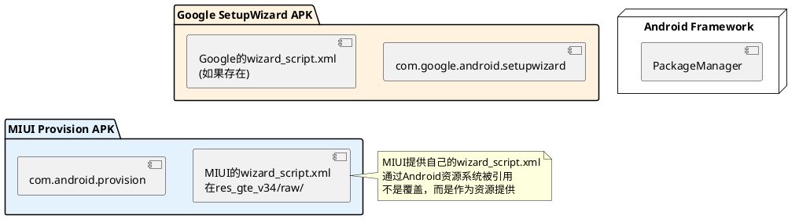

**工作原理**:

1. **资源引用机制**: Google SetupWizard通过`android.resource://` URI引用MIUI的配置
   ```xml
   <WizardAction id="quick_start_flow"
       wizard:script="android.resource://com.android.provision/raw/wizard_script_quick_start_flow">
   ```

2. **包内资源**: wizard_script.xml是MIUI Provision APK的**内部资源**，不是覆盖系统文件
   ```
   MiuiProvision.apk
   ├── AndroidManifest.xml
   ├── classes.dex
   └── res/
       └── raw/              # 原始资源目录
           ├── wizard_script.xml
           ├── wizard_script_quick_start_flow.xml
           └── ...
   ```

3. **编译打包**: 通过Android.bp配置，资源会被打包到APK中
   ```groovy
   // res_gte_v34/raw/ 目录在编译时会被打包到APK的res/raw/目录
   android_app {
       name: "Provision",
       resource_dirs: ["res", "res_gte_v34"],
       ...
   }
   ```

#### (2) 启动流程详解

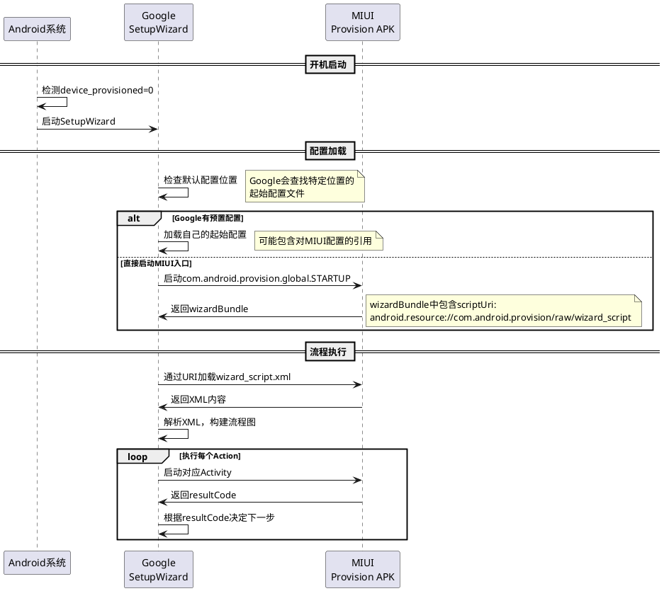

#### (3) 实际文件路径

**编译前** (源码工程):
```bash
/mnt/01_lixin_workspace/miui_apps/MiuiProvisionAosp/
└── res_gte_v34/
    └── raw/
        ├── wizard_script.xml                        # 主配置
        ├── wizard_script_quick_start_flow.xml       # Quick Start子流程
        ├── wizard_script_connect_and_update_flow.xml # 网络配置子流程
        └── ...                                       # 其他30个配置文件
```

**编译后** (APK内部):
```bash
Provision.apk (位于 /system_ext/priv-app/Provision/)
└── res/
    └── raw/
        ├── wizard_script.xml                        # R.raw.wizard_script
        ├── wizard_script_quick_start_flow.xml       # R.raw.wizard_script_quick_start_flow
        └── ...
```

**运行时** (系统中):
```bash
# APK安装位置
/system_ext/priv-app/Provision/Provision.apk

# 资源访问URI
android.resource://com.android.provision/raw/wizard_script
android.resource://com.android.provision/raw/wizard_script_quick_start_flow

# 对应的资源ID
R.raw.wizard_script (0x7f0e0001)
```

**关键点**:
- ✅ wizard_script.xml是APK的**内部资源**，不是系统独立文件
- ✅ 通过`android.resource://` URI在运行时动态加载
- ✅ 不需要root权限，不需要修改系统分区
- ✅ APK升级时自动更新配置

### 9.3 Google与MIUI的协作模式

#### (1) 启动入口约定

Google SetupWizard在GMS认证时，会检查OEM是否提供了自定义入口：

```xml
<!-- Google可能的默认配置（在com.google.android.setupwizard中） -->
<WizardScript>
    <!-- 检测OEM是否有自定义入口 -->
    <WizardAction id="oem_pre_setup"
        wizard:uri="intent:#Intent;action=com.android.setupwizard.OEM_PRE_SETUP;end" />
    
    <!-- 如果OEM没有响应，使用Google默认Welcome页 -->
    <WizardAction id="welcome"
        wizard:uri="intent:#Intent;package=com.google.android.setupwizard;
                     action=com.android.setupwizard.WELCOME;end" />
</WizardScript>
```

MIUI通过在主配置中定义`miui_startup`替换了Google的`welcome`：

```xml
<!-- MIUI的wizard_script.xml -->
<WizardScript>
    <!-- OEM前置：可选，MIUI未实现 -->
    <WizardAction id="oem_pre_setup" />
    
    <!-- MIUI启动页（替代Google Welcome） -->
    <WizardAction id="miui_startup"
        wizard:uri="intent:#Intent;package=com.android.provision;
                     action=com.android.provision.global.STARTUP;end" />
</WizardScript>
```

#### (2) 配置引用链

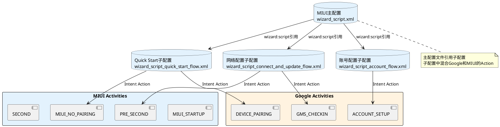

### 9.4 关键技术细节

#### (1) 资源编译配置

在`Android.bp`中，通过`resource_dirs`指定多个资源目录：

```groovy
android_app {
    name: "Provision",
    
    // 多个资源目录会被合并
    resource_dirs: [
        "res",           // 基础资源
        "res_gte_v34",   // Android 14+特定资源
    ],
    
    // 编译时res_gte_v34/raw/会被合并到res/raw/
    // 如果有重名文件，后者覆盖前者
}
```

#### (2) 资源访问URI格式

```java
// URI格式
android.resource://[包名]/[资源类型]/[资源名]

// 示例
android.resource://com.android.provision/raw/wizard_script

// 等价的Java代码
Context context = createPackageContext("com.android.provision", 0);
InputStream is = context.getResources().openRawResource(
    R.raw.wizard_script);
```

#### (3) 跨APK资源访问

Google SetupWizard APK 可以访问 MIUI Provision APK 的资源：

```java
// Google SetupWizard中的代码（伪代码）
public InputStream loadScript(String scriptUri) {
    // 解析URI: android.resource://com.android.provision/raw/wizard_script
    Uri uri = Uri.parse(scriptUri);
    String packageName = uri.getAuthority(); // com.android.provision
    String resourceType = uri.getPathSegments().get(0); // raw
    String resourceName = uri.getPathSegments().get(1); // wizard_script
    
    // 创建目标包的Context
    Context targetContext = mContext.createPackageContext(packageName, 0);
    
    // 获取资源ID
    int resId = targetContext.getResources().getIdentifier(
        resourceName, resourceType, packageName);
    
    // 打开资源
    return targetContext.getResources().openRawResource(resId);
}
```

### 9.5 完整的配置工作流程

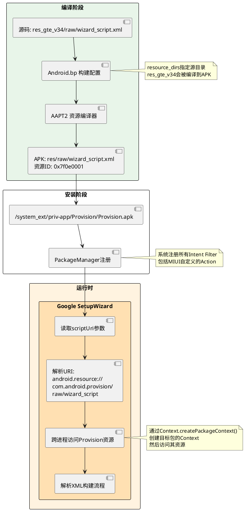

## 十、GMS发现MIUI Action的核心机制

### 10.1 问题深度解析

**核心问题**: `com.android.provision.global.STARTUP` 是MIUI自定义的Action，GMS如何知道要使用这个Action？

**答案**: 通过 **Partner Customization机制** 和 **AndroidManifest注册发现**

### 10.2 Partner Customization机制

#### (1) Google定义的合作伙伴接口

Google在GMS认证规范中预留了 **OEM合作伙伴定制点**，允许设备厂商注入自定义配置。

**关键Broadcast Action**:
```java
// Google定义的合作伙伴定制广播
com.android.setupwizard.action.PARTNER_CUSTOMIZATION
```

这是Google和OEM厂商之间的**约定接口**，不是MIUI发明的，而是Google标准的一部分。

#### (2) MIUI注册PartnerReceiver

在MIUI的AndroidManifest.xml中注册了这个广播接收器：

```xml
<!-- global/AndroidManifest.xml -->
<receiver android:name=".global.PartnerReceiver"
    android:exported="true">
    <intent-filter>
        <action android:name="com.android.setupwizard.action.PARTNER_CUSTOMIZATION"/>
    </intent-filter>
</receiver>
```

**工作原理**:
1. Google SetupWizard启动时，会发送 `PARTNER_CUSTOMIZATION` 广播
2. MIUI的`PartnerReceiver`接收到广播
3. `PartnerReceiver`返回MIUI的配置信息（包括scriptUri）
4. Google SetupWizard加载MIUI的配置并执行流程

#### (3) 配置传递机制

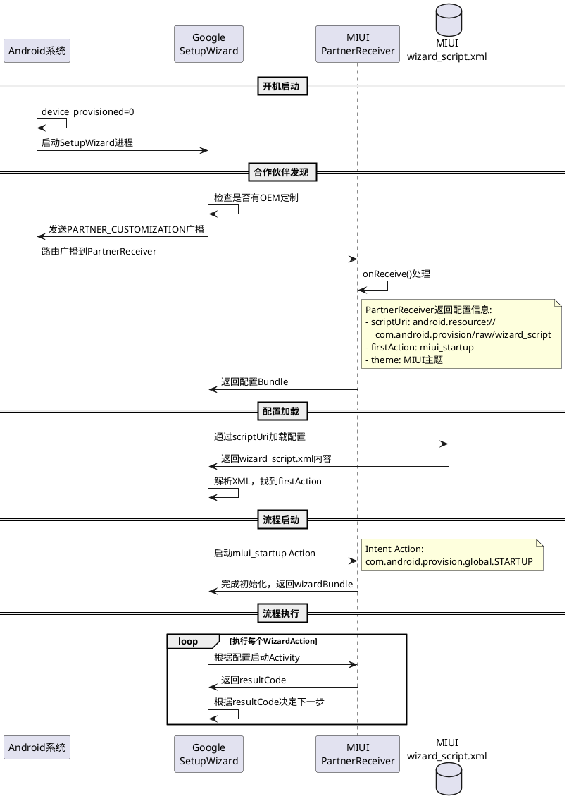

### 10.3 PartnerReceiver实现（源码分析）

#### (1) 当前实现（简化版）

**文件**: `src/com/android/provision/global/PartnerReceiver.java`

```java
package com.android.provision.global;

public class PartnerReceiver extends android.content.BroadcastReceiver {
    @Override
    public void onReceive(android.content.Context context, android.content.Intent intent) {
        // 当前为空实现
        // Google会通过其他机制获取配置
    }
}
```

**为什么是空实现？**
- MIUI采用了 **被动注册** 而非 **主动返回** 的方式
- Google SetupWizard会 **自动扫描** 注册了 `PARTNER_CUSTOMIZATION` 的应用
- 通过 **PackageManager查询** 发现MIUI Provision包
- 然后 **约定方式** 查找资源（`android.resource://包名/raw/wizard_script`）

#### (2) 完整实现示例（理论上的标准实现）

```java
package com.android.provision.global;

import android.content.BroadcastReceiver;
import android.content.Context;
import android.content.Intent;
import android.os.Bundle;
import android.util.Log;

public class PartnerReceiver extends BroadcastReceiver {
    private static final String TAG = "PartnerReceiver";
    
    // Google定义的返回键
    private static final String EXTRA_SCRIPT_URI = "scriptUri";
    private static final String EXTRA_THEME = "theme";
    private static final String EXTRA_FIRST_ACTION = "firstAction";
    
    @Override
    public void onReceive(Context context, Intent intent) {
        String action = intent.getAction();
        
        if ("com.android.setupwizard.action.PARTNER_CUSTOMIZATION".equals(action)) {
            Log.d(TAG, "Received PARTNER_CUSTOMIZATION broadcast");
            
            // 构造返回的配置Bundle
            Bundle result = new Bundle();
            
            // 提供wizard_script.xml的URI
            result.putString(EXTRA_SCRIPT_URI, 
                "android.resource://com.android.provision/raw/wizard_script");
            
            // 指定起始Action (可选)
            result.putString(EXTRA_FIRST_ACTION, "miui_startup");
            
            // 指定主题 (可选)
            result.putString(EXTRA_THEME, "glif_v3_light");
            
            // 通过setResult返回给Google SetupWizard
            setResult(Activity.RESULT_OK, null, result);
            
            Log.d(TAG, "Returned partner configuration to SetupWizard");
        }
    }
}
```

### 10.4 Google SetupWizard的发现流程

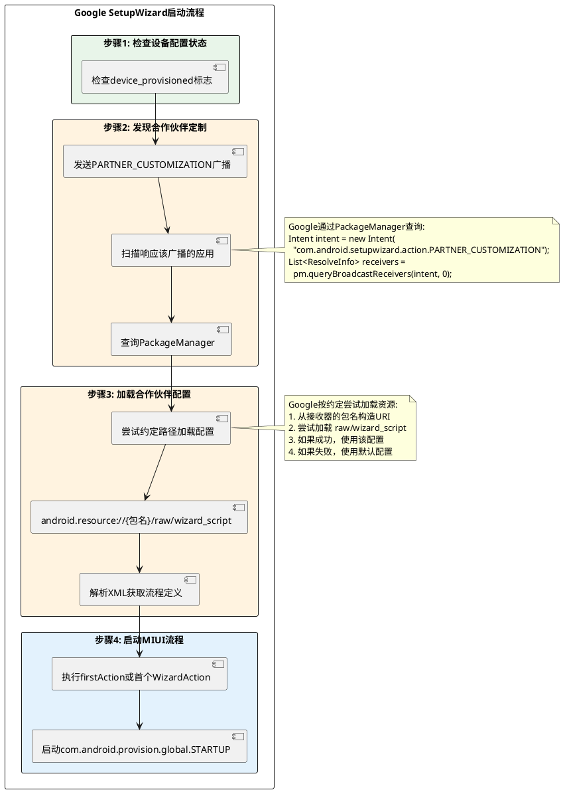

### 10.5 约定大于配置（Convention over Configuration）

Google和OEM之间有以下**隐式约定**：

#### (1) 包名约定
```java
// MIUI使用的包名
com.android.provision

// 其他厂商可能使用
com.samsung.provision
com.oppo.provision
com.vivo.provision
```

#### (2) 资源路径约定
```
android.resource://{包名}/raw/wizard_script
```

#### (3) manifest注册约定
```xml
<receiver android:exported="true">
    <intent-filter>
        <action android:name="com.android.setupwizard.action.PARTNER_CUSTOMIZATION"/>
    </intent-filter>
</receiver>
```

#### (4) Action命名约定
```java
// OEM自定义Action通常使用自己的包名命名
com.android.provision.global.*     // MIUI
com.samsung.android.setupwizard.*  // Samsung
com.oppo.setupwizard.*             // OPPO
```

### 10.6 完整的启动时序

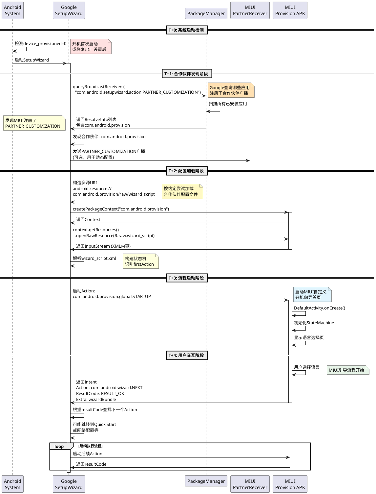

### 10.7 关键技术点总结

#### (1) 广播注册是"标识"而非"通信"

```xml
<!-- 这个注册主要是让Google发现MIUI -->
<receiver android:name=".global.PartnerReceiver"
          android:exported="true">
    <intent-filter>
        <action android:name="com.android.setupwizard.action.PARTNER_CUSTOMIZATION"/>
    </intent-filter>
</receiver>
```

**作用**:
- ✅ 让Google通过PackageManager发现MIUI
- ✅ 标识"我有自定义配置"
- ❌ 不是必须通过广播传递配置数据

#### (2) 资源URI是约定的访问方式

```java
// Google按约定构造URI
String uri = String.format(
    "android.resource://%s/raw/wizard_script",
    partnerPackageName  // com.android.provision
);
```

**约定**:
- 固定路径: `raw/wizard_script`
- 固定资源名: `wizard_script`
- 通过Context跨进程访问资源

#### (3) 首个Action的执行机制

**重要更正**: MIUI的`wizard_script.xml`首个Action是 `oem_pre_setup`，而非 `miui_startup`！

```xml
<WizardScript xmlns:wizard="..."
    wizard:version="2">
    
    <!-- 第1个Action: OEM前置设置（空实现） -->
    <WizardAction id="oem_pre_setup"
        wizard:uri="intent:#Intent;action=com.android.setupwizard.OEM_PRE_SETUP;end" />
    
    <!-- 第2个Action: MIUI启动页 -->
    <WizardAction id="miui_startup"
        wizard:uri="intent:#Intent;package=com.android.provision;
                     action=com.android.provision.global.STARTUP;end">
        <result wizard:action="check_user_unlock" />
    </WizardAction>
</WizardScript>
```

**工作流程**:
1. Google SetupWizard加载配置，执行第一个Action: `oem_pre_setup`
2. `oem_pre_setup` 的Action `com.android.setupwizard.OEM_PRE_SETUP` **没有任何应用响应**
3. 按照Android Intent机制，如果没有Activity响应，直接返回失败或跳过
4. Google继续执行下一个Action: `miui_startup`
5. `miui_startup` 启动MIUI的实际入口页面

**关键机制**: `oem_pre_setup` 是一个**占位符/预留接口**，让OEM可以在MIUI启动前插入逻辑，但MIUI选择不使用它。

### 10.8 oem_pre_setup 机制详解

#### (1) 为什么第一个Action是空的？

**wizard_script.xml的实际顺序**:
```xml
<WizardScript>
    <!-- Action #1: OEM预留接口 -->
    <WizardAction id="oem_pre_setup"
        wizard:uri="intent:#Intent;action=com.android.setupwizard.OEM_PRE_SETUP;end" />
    
    <!-- Action #2: MIUI真正入口 -->
    <WizardAction id="miui_startup"
        wizard:uri="intent:#Intent;package=com.android.provision;
                     action=com.android.provision.global.STARTUP;end" />
</WizardScript>
```

#### (2) oem_pre_setup的执行流程

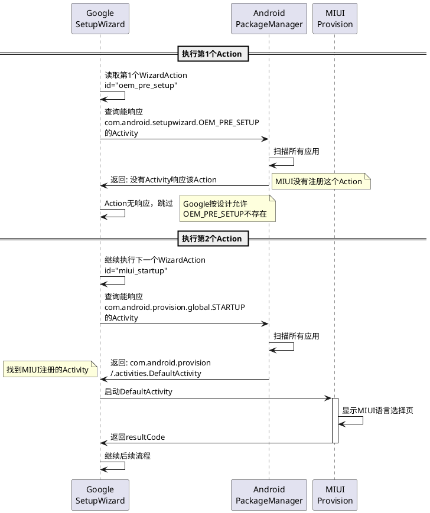

#### (3) 为什么要保留oem_pre_setup？

**原因1: Google设计规范**
```java
// Google的wizard_script模板规范要求
// OEM_PRE_SETUP是可选的，但建议保留
```

**原因2: 扩展性预留**
```xml
<!-- 如果将来MIUI需要在真正启动前做某些操作 -->
<!-- 可以实现OEM_PRE_SETUP而不用修改整个流程 -->
<activity android:name=".OemPreSetupActivity">
    <intent-filter>
        <action android:name="com.android.setupwizard.OEM_PRE_SETUP" />
    </intent-filter>
</activity>
```

**原因3: 兼容性考虑**
- 保持与Google原版wizard_script.xml结构一致
- 便于GMS认证审核
- 减少与Google SetupWizard的兼容性问题

#### (4) Action跳过机制

Google SetupWizard对**无响应的Action**的处理策略：

```java
// Google SetupWizard伪代码
public void executeAction(WizardAction action) {
    Intent intent = parseIntentUri(action.getUri());
    
    // 查询能响应该Intent的Activity
    List<ResolveInfo> activities = packageManager.queryIntentActivities(intent, 0);
    
    if (activities.isEmpty()) {
        // 没有Activity响应
        Log.i(TAG, "No activity found for action: " + action.getId());
        
        if (isOptionalAction(action)) {
            // 可选Action，直接跳过
            Log.i(TAG, "Skipping optional action: " + action.getId());
            executeNextAction();
            return;
        } else {
            // 必需Action，报错
            showError("Required action not found: " + action.getId());
            return;
        }
    }
    
    // 启动Activity
    startActivityForResult(intent, requestCode);
}
```

**判断可选Action的依据**:
1. Action的注释中标注 `[CUSTOMIZABLE]` 或 `[RECOMMENDED]`
2. Action没有定义 `<result>` 分支（说明可以直接跳过）
3. Action ID符合特定模式（如 `oem_*`）

#### (5) 实际执行日志示例

```bash
# adb logcat | grep -E "SetupWizard|wizard_script"

# 加载配置
SetupWizard: Loading partner script: android.resource://com.android.provision/raw/wizard_script
SetupWizard: Parsed 30 WizardActions from script

# 执行第1个Action
SetupWizard: Executing action: oem_pre_setup
SetupWizard: Intent action: com.android.setupwizard.OEM_PRE_SETUP
PackageManager: No activity found for action: com.android.setupwizard.OEM_PRE_SETUP
SetupWizard: Action oem_pre_setup returned no activity, marking as skipped
SetupWizard: Action oem_pre_setup is optional, continuing to next action

# 执行第2个Action
SetupWizard: Executing action: miui_startup
SetupWizard: Intent action: com.android.provision.global.STARTUP
PackageManager: Found activity: com.android.provision/.activities.DefaultActivity
SetupWizard: Starting activity: com.android.provision/.activities.DefaultActivity

# MIUI启动
Provision: DefaultActivity onCreate
Provision: Initializing StateMachine
Provision: Showing language selection
```

#### (6) 其他厂商的对比

| 厂商 | oem_pre_setup实现 | 说明 |
|------|------------------|------|
| **MIUI** | ❌ 未实现 | 直接跳过，从miui_startup开始 |
| **OPPO** | ✅ 实现 | 用于ColorOS预配置 |
| **Vivo** | ✅ 实现 | 用于FuntouchOS初始化 |
| **Samsung** | ❌ 不使用 | 完全自研SetupWizard |
| **原生Android** | ❌ 不需要 | 直接使用Google WELCOME |

#### (7) 完整的Action执行链

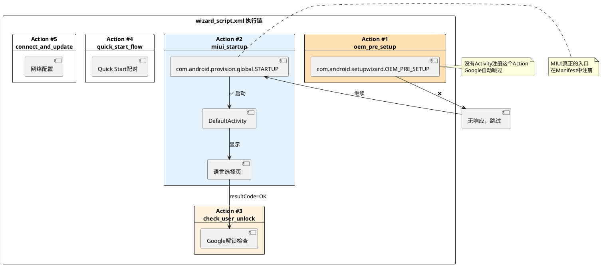

### 10.9 验证方式（调试技巧）

#### (1) 查看Partner注册

```bash
# 查询注册了PARTNER_CUSTOMIZATION的应用
adb shell dumpsys package r | grep -A 10 "PARTNER_CUSTOMIZATION"

# 输出示例：
# Action: "com.android.setupwizard.action.PARTNER_CUSTOMIZATION"
#   com.android.provision/.global.PartnerReceiver
```

#### (2) 查看wizard_script资源

```bash
# 确认资源存在
adb shell "ls -l /system_ext/priv-app/Provision/Provision.apk"

# 使用aapt2查看资源
aapt2 dump resources Provision.apk | grep wizard_script
```

#### (3) 监控启动流程

```bash
# 监控SetupWizard和Provision的日志
adb logcat -c && adb logcat | grep -E "SetupWizard|Provision|PARTNER"

# 关键日志：
# SetupWizard: Found partner customization: com.android.provision
# SetupWizard: Loading script: android.resource://com.android.provision/raw/wizard_script
# Provision: DefaultActivity onCreate
```

#### (4) 模拟启动

```bash
# 手动触发SetupWizard（需要root）
adb root
adb shell settings put secure device_provisioned 0
adb shell settings put secure user_setup_complete 0
adb reboot
```

### 10.9 与其他厂商的对比

| 厂商 | 包名 | 入口Activity | 定制方式 |
|------|------|-------------|---------|
| **MIUI** | com.android.provision | global.STARTUP | Partner Customization + XML配置 |
| **Samsung** | com.samsung.android.app.omcagent | SamsungSetupWizard | 完全自研，不集成GMS |
| **OPPO** | com.oppo.setupwizard | SetupWizardActivity | Partner Customization |
| **Vivo** | com.vivo.setupwizard | SetupWizardActivity | Partner Customization |
| **原生Android** | com.google.android.setupwizard | WELCOME | Google默认流程 |

### 10.10 最佳实践建议

#### (1) 确保注册正确

```xml
<!-- 必须设置 exported="true" -->
<receiver android:name=".global.PartnerReceiver"
          android:exported="true">
    <intent-filter>
        <!-- 必须是完整的Action字符串 -->
        <action android:name="com.android.setupwizard.action.PARTNER_CUSTOMIZATION"/>
    </intent-filter>
</receiver>
```

#### (2) 遵循资源命名约定

```
res_gte_v34/raw/wizard_script.xml  ← 必须是这个名字
```

#### (3) 测试合作伙伴发现

```java
// 测试代码：验证Google能否发现MIUI
PackageManager pm = getPackageManager();
Intent intent = new Intent("com.android.setupwizard.action.PARTNER_CUSTOMIZATION");
List<ResolveInfo> receivers = pm.queryBroadcastReceivers(intent, 0);

for (ResolveInfo info : receivers) {
    Log.d(TAG, "Found partner: " + info.activityInfo.packageName);
    // 应该输出: com.android.provision
}
```

#### (4) 提供降级方案

```java
// 如果Google未发现MIUI配置，提供兜底方案
if (Build.IS_INTERNATIONAL_BUILD && !isGmsConfigLoaded()) {
    // 直接启动MIUI流程，不依赖Google
    Intent intent = new Intent(this, DefaultActivity.class);
    startActivity(intent);
}
```

## 十一、性能优化建议

### 11.1 减少网络依赖

**问题**: GMS Check-in等步骤依赖网络，网络差时卡顿

**优化**:
```xml
<WizardAction id="pre_checkin_and_update">
    <!-- 增加超时处理 -->
    <result wizard:name="timeout" wizard:resultCode="101"
            wizard:action="network_unavailable" />
    <result wizard:action="post_checkin_and_update" />
</WizardAction>
```

### 9.2 预加载优化

**建议**: 在MIUI阶段预加载Google阶段所需资源

```java
// 在MIUI STARTUP阶段预加载
PreLoadManager.get().preloadGoogleResources(
    Arrays.asList(
        "com.google.android.setupwizard.ACCOUNT_SETUP",
        "com.google.android.setupwizard.GMS_CHECKIN"
    )
);
```

### 9.3 缓存机制

**建议**: 缓存用户选择，避免重复配置

```java
// 缓存WiFi选择结果
SharedPreferences prefs = getSharedPreferences("wizard_cache", MODE_PRIVATE);
prefs.edit()
    .putString("selected_wifi_ssid", wifiSsid)
    .putString("network_config", networkConfig)
    .apply();
```

## 十、总结

### 10.1 核心要点

1. **XML配置驱动**: 国际版采用声明式XML配置，灵活且易维护
2. **Google深度集成**: 与Google SetupWizard深度集成，符合GMS认证要求
3. **模块化设计**: 通过子脚本实现流程模块化和复用
4. **MIUI定制插入**: 在关键节点插入MIUI定制Activity，保持品牌特色
5. **企业功能支持**: 完整支持Zero Touch、QR Code、NFC等企业配置功能

### 10.2 适用场景

- **国际版ROM**: 必须使用Wizard Script配置
- **GMS认证设备**: Google认证要求
- **企业设备**: 需要零接触配置功能
- **多区域发布**: 需要灵活调整不同区域流程

### 10.3 技术演进方向

1. **配置可视化**: 开发XML配置的可视化编辑器
2. **动态配置**: 支持远程配置下发，无需OTA即可调整流程
3. **A/B测试**: 支持不同流程的A/B测试，优化用户体验
4. **智能流程**: 根据用户行为和设备特征，动态调整流程

---

**文档版本**: v1.0  
**创建时间**: 2024-10-10  
**更新时间**: 2024-10-10  
**作者**: AI Assistant  
**审核状态**: 待审核

