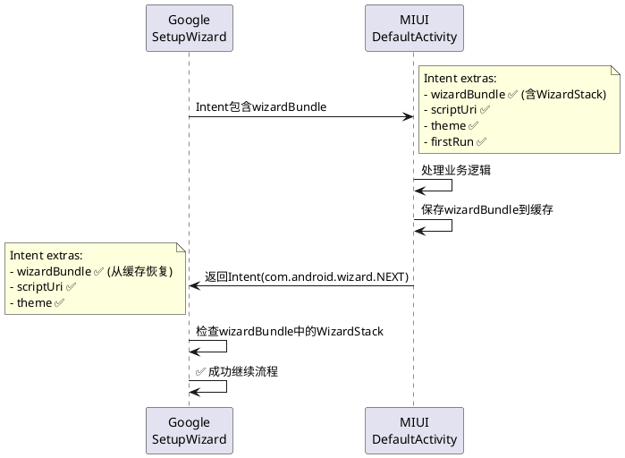

# 国际版wizardBundle崩溃问题分析

## 问题描述

### 崩溃日志

```java
java.lang.IllegalArgumentException: Intent does not contain WizardStack.
intent=Intent { act=com.android.wizard.NEXT ... }
extras=Bundle[{
    actionId=null,
    wizardBundle=null,        // ❌ 关键问题
    firstRun=false,
    theme=null,
    scriptUri=null,           // ❌ 关键问题
    com.android.setupwizard.ResultCode=-1
|}]
```

### 问题场景

当MIUI Activity调用`Utils.goToNextPage()`返回给Google SetupWizard时，Intent中缺少必需的`wizardBundle`和`scriptUri`参数，导致Google SetupWizard崩溃。

## 根本原因分析

### Google SetupWizard的检查逻辑

Google SetupWizard不是检查`wizardBundle`是否为null，而是**检查`wizardBundle`内部是否包含`WizardStack`对象**：

```java
// Google SetupWizard内部（混淆后的代码）
public void onCreate(Bundle savedInstanceState) {
    Intent intent = getIntent();
    Bundle wizardBundle = intent.getBundleExtra("wizardBundle");
    
    // ❌ 崩溃点：不是检查wizardBundle == null
    // 而是检查wizardBundle内部的WizardStack
    WizardStack stack = wizardBundle.getParcelable("wizard_stack");
    if (stack == null) {
        throw new IllegalArgumentException(
            "Intent does not contain WizardStack. intent=" + intent
        );
    }
}
```

### WizardStack的本质

**`WizardStack`是Google专有数据结构**：
1. 包含完整的流程状态
2. 包含导航栈信息
3. 包含安全令牌
4. **MIUI无法访问Google内部类**
5. **MIUI无法伪造WizardStack**
6. **只有Google SetupWizard能创建**

### 完整工作流程



## 什么情况下会缺失参数？

### 情况1: 手动启动（测试场景）

```bash
# ❌ 错误：直接启动，没有wizardBundle
adb shell am start -n com.android.provision/.activities.DefaultActivity

# ✅ 正确：通过重启触发Google SetupWizard
adb shell settings put global device_provisioned 0
adb reboot
```

### 情况2: Activity跨跳转丢失参数

```java
// 场景：DefaultActivity -> ChildActivity -> 返回
// 如果ChildActivity没有保存originalIntent，返回时就会丢失wizardBundle

// ❌ 错误做法：
public class ChildActivity extends AppCompatActivity {
    @Override
    protected void onCreate(Bundle savedInstanceState) {
        // 业务逻辑...
        Intent returnIntent = new Intent(); // 创建新Intent，没有wizardBundle！
        setResult(RESULT_OK, returnIntent);
        finish();
    }
}

// ✅ 正确做法：
public class ChildActivity extends AppCompatActivity {
    private Intent mOriginalIntent;
    
    @Override
    protected void onCreate(Bundle savedInstanceState) {
        mOriginalIntent = getIntent(); // 保存原始Intent
        // 业务逻辑...
    }
    
    private void goToNext() {
        Intent nextIntent = WizardManagerHelper.getNextIntent(
            mOriginalIntent,  // 使用保存的原始Intent
            RESULT_OK
        );
        startActivity(nextIntent);
        finish();
    }
}
```

### 情况3: savedInstanceState场景

当Activity因配置变更或系统回收被重建时，Intent可能丢失wizardBundle。

## 解决方案

### 方案一：修改测试启动方式（开发测试）

#### 修改build_and_install.sh脚本

```bash
# 国际版：通过重启触发完整流程
if [[ "$REGION" == "global" ]]; then
    adb root
    adb shell settings put global device_provisioned 0
    adb shell settings put secure user_setup_complete 0
    adb shell pm enable com.google.android.setupwizard
    adb reboot
    # Google SetupWizard会自动启动，带有完整的wizardBundle
fi
```

**优点**：
- 无需修改代码
- 测试真实场景
- wizardBundle由Google创建，确保有效

**缺点**：
- 每次测试都要重启，效率较低

### 方案二：Application级别缓存wizardBundle（生产环境）

#### 创建WizardBundleCache

**文件**: `src/com/android/provision/global/WizardBundleCache.java`

```java
package com.android.provision.global;

import android.content.Intent;
import android.os.Bundle;
import android.os.Parcelable;
import android:util.Log;

/**
 * 缓存来自Google SetupWizard的参数
 * 解决跨Activity传递wizardBundle丢失的问题
 */
public class WizardBundleCache {
    private static final String TAG = "WizardBundleCache";
    
    private static WizardBundleCache sInstance;
    
    private Bundle mWizardBundle;
    private String mScriptUri;
    private String mTheme;
    private boolean mFirstRun;
    private String mActionId;
    
    private WizardBundleCache() {}
    
    public static synchronized WizardBundleCache getInstance() {
        if (sInstance == null) {
            sInstance = new WizardBundleCache();
        }
        return sInstance;
    }
    
    /**
     * 从Intent中提取并缓存wizard参数
     */
    public void cacheFromIntent(Intent intent) {
        if (intent == null) return;
        
        Bundle wizardBundle = intent.getBundleExtra(WizardManagerHelper.EXTRA_WIZARD_BUNDLE);
        if (wizardBundle != null && isValidWizardBundle(wizardBundle)) {
            mWizardBundle = wizardBundle;
            Log.i(TAG, "Cached wizardBundle (valid WizardStack found)");
        }
        
        String scriptUri = intent.getStringExtra(WizardManagerHelper.EXTRA_SCRIPT_URI);
        if (scriptUri != null) {
            mScriptUri = scriptUri;
            Log.i(TAG, "Cached scriptUri: " + scriptUri);
        }
        
        String theme = intent.getStringExtra(WizardManagerHelper.EXTRA_THEME);
        if (theme != null) {
            mTheme = theme;
            Log.i(TAG, "Cached theme: " + theme);
        }
        
        mFirstRun = intent.getBooleanExtra(WizardManagerHelper.EXTRA_IS_FIRST_RUN, false);
        
        String actionId = intent.getStringExtra(WizardManagerHelper.EXTRA_ACTION_ID);
        if (actionId != null) {
            mActionId = actionId;
        }
    }
    
    /**
     * 验证wizardBundle是否包含有效的WizardStack
     */
    private boolean isValidWizardBundle(Bundle bundle) {
        if (bundle == null) return false;
        
        // 检查是否包含WizardStack
        if (!bundle.containsKey("wizard_stack")) {
            Log.w(TAG, "wizardBundle missing wizard_stack");
            return false;
        }
        
        // 检查WizardStack是否可以反序列化
        try {
            Parcelable stack = bundle.getParcelable("wizard_stack");
            if (stack == null) {
                Log.w(TAG, "wizard_stack is null");
                return false;
            }
            return true;
        } catch (Exception e) {
            Log.e(TAG, "Failed to parse wizard_stack", e);
            return false;
        }
    }
    
    /**
     * 将缓存的参数恢复到Intent中
     */
    public void restoreToIntent(Intent intent) {
        if (intent == null) return;
        
        // 只有当Intent中没有这些参数时，才从缓存恢复
        if (mWizardBundle != null 
            && intent.getBundleExtra(WizardManagerHelper.EXTRA_WIZARD_BUNDLE) == null) {
            intent.putExtra(WizardManagerHelper.EXTRA_WIZARD_BUNDLE, mWizardBundle);
            Log.i(TAG, "Restored wizardBundle to intent");
        }
        
        if (mScriptUri != null 
            && intent.getStringExtra(WizardManagerHelper.EXTRA_SCRIPT_URI) == null) {
            intent.putExtra(WizardManagerHelper.EXTRA_SCRIPT_URI, mScriptUri);
            Log.i(TAG, "Restored scriptUri to intent");
        }
        
        if (mTheme != null 
            && intent.getStringExtra(WizardManagerHelper.EXTRA_THEME) == null) {
            intent.putExtra(WizardManagerHelper.EXTRA_THEME, mTheme);
        }
        
        if (!intent.hasExtra(WizardManagerHelper.EXTRA_IS_FIRST_RUN)) {
            intent.putExtra(WizardManagerHelper.EXTRA_IS_FIRST_RUN, mFirstRun);
        }
        
        if (mActionId != null 
            && intent.getStringExtra(WizardManagerHelper.EXTRA_ACTION_ID) == null) {
            intent.putExtra(WizardManagerHelper.EXTRA_ACTION_ID, mActionId);
        }
    }
    
    /**
     * 清除缓存
     */
    public void clear() {
        mWizardBundle = null;
        mScriptUri = null;
        mTheme = null;
        mFirstRun = false;
        mActionId = null;
        Log.i(TAG, "Cleared cache");
    }
    
    /**
     * 检查是否有缓存的数据
     */
    public boolean hasCachedData() {
        return mWizardBundle != null || mScriptUri != null;
    }
}
```

#### 修改WizardManagerHelper

```java
public static Intent getNextIntent(Intent originalIntent, int resultCode, Intent data) {
    Intent intent = new Intent(ACTION_NEXT);
    
    // 1. 先尝试从originalIntent复制
    copyWizardManagerExtras(originalIntent, intent);
    
    // 2. 如果复制失败（originalIntent中没有），从缓存恢复
    if (Build.IS_INTERNATIONAL_BUILD) {
        WizardBundleCache.getInstance().restoreToIntent(intent);
    }
    
    intent.putExtra(EXTRA_RESULT_CODE, resultCode);
    if (data != null && data.getExtras() != null) {
        intent.putExtras(data.getExtras());
    }
    
    return intent;
}
```

#### 修改DefaultActivity

```java
@Override
protected void onCreate(Bundle icicle) {
    super.onCreate(icicle);
    
    // 缓存来自Google SetupWizard的参数
    if (Build.IS_INTERNATIONAL_BUILD) {
        WizardBundleCache.getInstance().cacheFromIntent(getIntent());
    }
    
    // 原有逻辑...
}

@Override
protected void onDestroy() {
    super.onDestroy();
    
    // 如果是最后一页，清除缓存
    if (isFinishing() && Utils.isProvisioned(getContext())) {
        if (Build.IS_INTERNATIONAL_BUILD) {
            WizardBundleCache.getInstance().clear();
        }
    }
}
```

### 方案三：SavedInstanceState保存（配置变更场景）

```java
private static final String KEY_WIZARD_BUNDLE = "saved_wizard_bundle";
private static final String KEY_SCRIPT_URI = "saved_script_uri";
private Bundle mCachedWizardBundle;
private String mCachedScriptUri;

@Override
protected void onCreate(Bundle savedInstanceState) {
    super.onCreate(savedInstanceState);
    
    if (savedInstanceState != null) {
        // 从savedInstanceState恢复
        mCachedWizardBundle = savedInstanceState.getBundle(KEY_WIZARD_BUNDLE);
        mCachedScriptUri = savedInstanceState.getString(KEY_SCRIPT_URI);
    } else {
        // 从Intent提取
        mCachedWizardBundle = getIntent().getBundleExtra(WizardManagerHelper.EXTRA_WIZARD_BUNDLE);
        mCachedScriptUri = getIntent().getStringExtra(WizardManagerHelper.EXTRA_SCRIPT_URI);
    }
}

@Override
protected void onSaveInstanceState(Bundle outState) {
    super.onSaveInstanceState(outState);
    if (mCachedWizardBundle != null) {
        outState.putBundle(KEY_WIZARD_BUNDLE, mCachedWizardBundle);
    }
    if (mCachedScriptUri != null) {
        outState.putString(KEY_SCRIPT_URI, mCachedScriptUri);
    }
}
```

## 失败的尝试记录

### 尝试1: 创建空的wizardBundle

```java
Bundle emptyBundle = new Bundle();
emptyBundle.putString("_miui_created", "true");
intent.putExtra(WizardManagerHelper.EXTRA_WIZARD_BUNDLE, emptyBundle);
```

**结果**: ❌ 崩溃
```
IllegalArgumentException: Intent does not contain WizardStack
```

**原因**: Google检查的是Bundle内部的`WizardStack`，不是Bundle本身。

### 尝试2: 伪造WizardStack

```java
// ❌ 无法实现
WizardStack stack = new WizardStack(...);  // 这个类是Google内部类，无法访问
wizardBundle.putParcelable("wizard_stack", stack);
```

**原因**: 
1. `WizardStack`是Google内部类，MIUI代码无法访问
2. 即使通过反射创建，也无法知道内部结构
3. Google会验证`WizardStack`的完整性

### 尝试3: 不重启启动开机引导

```bash
adb shell 'am start -a com.android.provision.global.STARTUP \
    -n com.android.provision/.activities.DefaultActivity \
    --es scriptUri "android.resource://com.android.provision/raw/wizard_script" \
    --es theme "glif_v3_light" \
    --ez firstRun true'
```

**结果**: ❌ 崩溃

**原因**: 虽然传递了`scriptUri`和`theme`，但`wizardBundle`仍然缺少真实的`WizardStack`。

## 测试验证

### 验证步骤

1. **安装新版本APK**
   ```bash
   ./scripts/build_and_install.sh
   ```

2. **触发完整开机向导**
   ```bash
   adb root
   adb shell settings put global device_provisioned 0
   adb shell settings put secure user_setup_complete 0
   adb reboot
   ```

3. **观察日志**
   ```bash
   adb logcat | grep -E "WizardBundle|SetupWizard|Provision"
   ```

4. **检查关键点**
   - ✅ Google SetupWizard成功启动MIUI
   - ✅ MIUI Activity接收到wizardBundle
   - ✅ 返回Google时Intent包含wizardBundle
   - ✅ 没有`IllegalArgumentException`崩溃

### 成功日志示例

```
SetupWizard: Loading partner script: android.resource://com.android.provision/raw/wizard_script
SetupWizard: Starting action: miui_startup
SetupWizard: Intent extras: {wizardBundle=Bundle[...], scriptUri=..., theme=glif_v3_light}

Provision: DefaultActivity onCreate
Provision: WizardBundleCache: Cached wizardBundle (valid WizardStack found)
Provision: WizardBundleCache: Cached scriptUri: android.resource://com.android.provision/raw/wizard_script

Provision: User selected language: zh_CN
Provision: Calling Utils.goToNextPage()
Provision: WizardBundleCache: Restored wizardBundle to intent
Provision: WizardBundleCache: Restored scriptUri to intent

SetupWizard: Received com.android.wizard.NEXT
SetupWizard: Intent extras: {wizardBundle=Bundle[...], scriptUri=..., resultCode=RESULT_OK}
SetupWizard: Continuing to next action: check_user_unlock
✅ 流程正常继续，没有崩溃
```

## 推荐方案总结

### 开发测试阶段
✅ **方案一**: 修改启动脚本，通过重启触发完整流程
- 优点：无需修改代码，测试真实场景
- 缺点：每次测试都要重启，效率较低

### 生产环境
✅ **方案二**: Application级别缓存wizardBundle
- 优点：彻底解决问题，处理所有场景
- 缺点：需要增加新类和修改现有代码

### 边缘场景
✅ **方案三**: SavedInstanceState保存
- 优点：处理配置变更场景
- 缺点：只解决部分问题

## 核心结论

1. **WizardStack只能由Google SetupWizard创建，MIUI无法伪造**
2. **国际版必须通过重启才能正确测试开机向导**
3. **必须实现缓存机制来保持wizardBundle在Activity跳转中不丢失**
4. **验证wizardBundle的完整性可以提前发现问题**

## 相关文档

- [国际版Wizard Script配置机制分析](国际版Wizard%20Script配置机制分析.md)
- [国际版开机引导测试完整方案](国际版开机引导测试完整方案.md)
- [Google SetupWizard官方文档](https://source.android.com/docs/core/ota/setup-wizard)

---

**文档版本**: v2.0 (整合版本)  
**创建时间**: 2025-10-14  
**更新说明**: 整合了根本原因分析和解决方案，明确了WizardStack的不可伪造性
