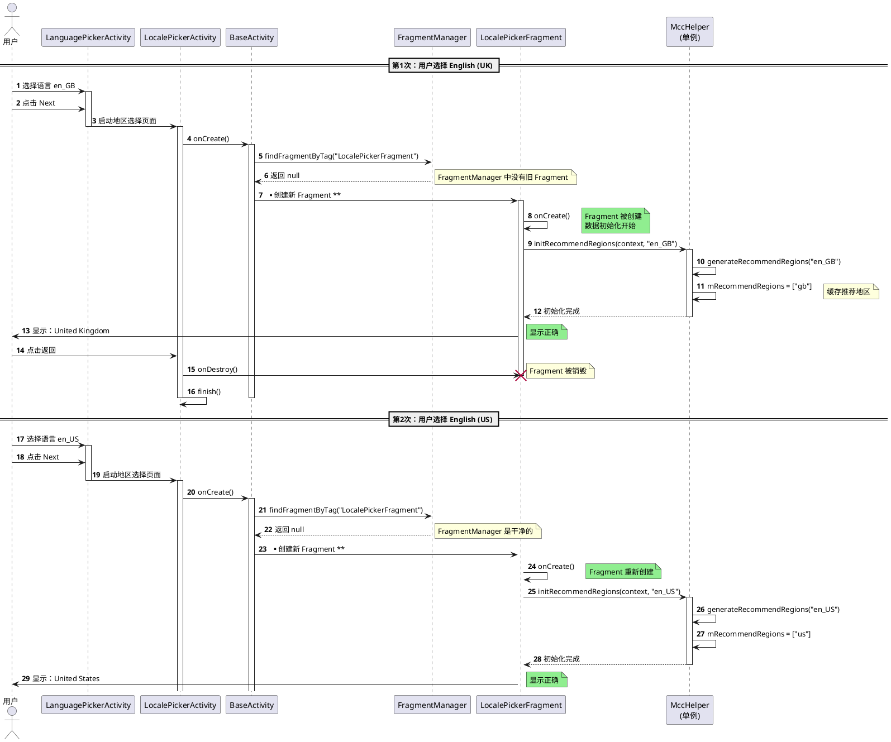
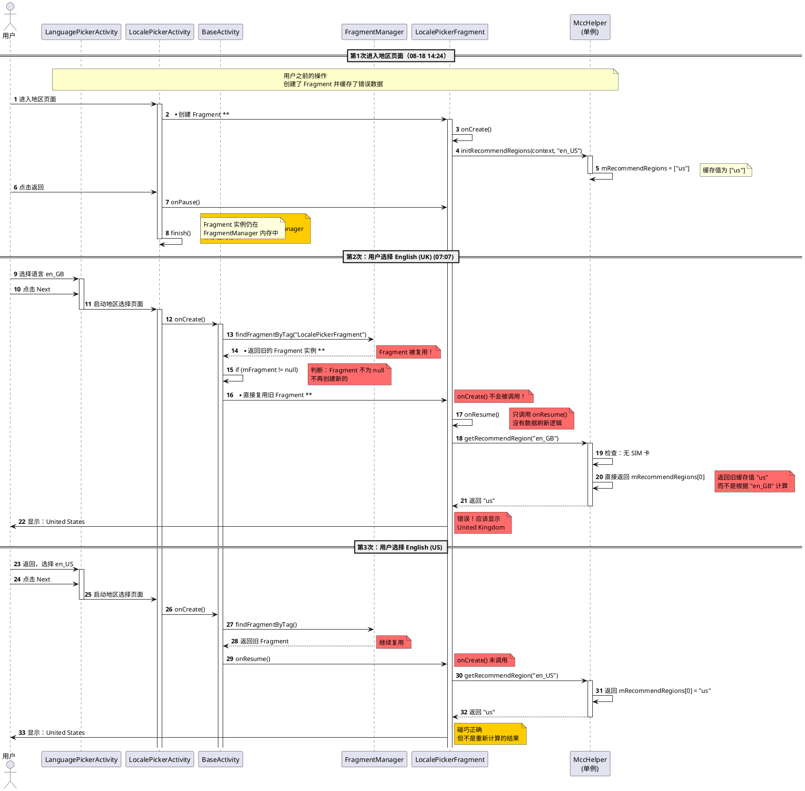
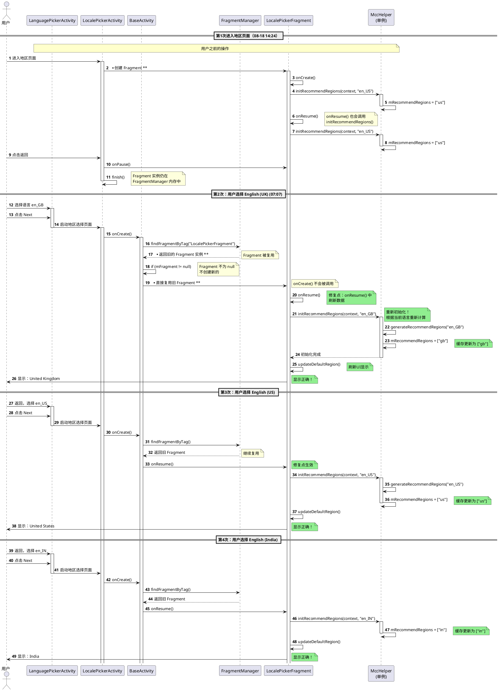

# BUGLC-21191 开机引导语言地区不一致问题分析

## 一、问题信息收集

### 1.1 基本信息
- **Jira单号**：BUGLC-21191
- **问题标题**：[O19A_W][Global][sanity]开机引导默认语言正确选择后下一步默认地区不一致
- **软件版本**：OS3.0.250819.1.WBOMIXM.STABLE-SSI
- **机型**：O19A (creek_global)
- **复现概率**：仅出现一次 (偶发问题)
- **测试条件**：不插卡
- **问题发生时间**：2025-08-17 20:27
- **日志采集时间**：2025-08-19 07:11:17

### 1.2 问题描述
选择不同的语言（English UK、English US、English India）后，点击Next进入地区选择页面，默认地区始终显示 United States，而不是对应的 United Kingdom、United States、India。

### 1.3 日志文件
- **视频**：小米办公20250819-191323.mp4
- **Bugreport**：bugreport-creek_global-BP2A.250605.031.A3-2025-08-19-07-11-17.txt
- **对照日志**：realtime_logcat_20251021_164942.txt（正常操作的日志）

---

## 二、日志时间线分析

### 2.1 正常情况：Fragment 随 Activity 正常销毁和重建

**测试时间**：2025-10-21 16:49-16:50
**测试操作**：选择语言 English UK → 进入地区页面 → 返回 → 选择 English US → 进入地区页面（重复多次）

```
// ==================== 第1次：选择 English (UK) 进入地区页面 ====================
16:49:52.061 I ActivityTaskManager: START u0 {cmp=com.android.provision/.activities.LocalePickerActivity}
16:49:52.094 W System.err: at com.android.provision.activities.LocalePickerActivity.onCreate(SourceFile:14)
16:49:52.104 W System.err: at com.android.provision.fragment.LocalePickerFragment.onCreate(SourceFile:138)
16:49:52.104 D MccHelper: generateRecommendRegions: language en_GB
// Fragment.onCreate() 被调用，初始化地区推荐为 [gb]

// 用户点击返回
// LocalePickerActivity 销毁

// ==================== 第2次：选择 English (US) 进入地区页面 ====================
16:49:59.315 I ActivityTaskManager: START u0 {cmp=com.android.provision/.activities.LocalePickerActivity}
16:49:59.342 W System.err: at com.android.provision.activities.LocalePickerActivity.onCreate(SourceFile:14)
16:49:59.349 W System.err: at com.android.provision.fragment.LocalePickerFragment.onCreate(SourceFile:138)
16:49:59.350 D MccHelper: generateRecommendRegions: language en_US
// Fragment.onCreate() 再次被调用，重新初始化地区推荐为 [us]

// ==================== 第3次：选择 English (India) 进入地区页面 ====================
16:50:04.066 W System.err: at com.android.provision.activities.LocalePickerActivity.onCreate(SourceFile:14)
16:50:04.079 W System.err: at com.android.provision.fragment.LocalePickerFragment.onCreate(SourceFile:138)
16:50:04.080 D MccHelper: generateRecommendRegions: language en_IN
// Fragment.onCreate() 再次被调用，重新初始化地区推荐为 [in]

// ==================== 第4次：选择 German (德语) 进入地区页面 ====================
16:50:12.028 W System.err: at com.android.provision.activities.LocalePickerActivity.onCreate(SourceFile:14)
16:50:12.042 W System.err: at com.android.provision.fragment.LocalePickerFragment.onCreate(SourceFile:138)
16:50:12.043 D MccHelper: generateRecommendRegions: language de_DE
// Fragment.onCreate() 再次被调用，重新初始化地区推荐为 [de,be,at,ch,lu]

// ==================== 第5次：再次选择 English (UK) 进入地区页面 ====================
16:50:20.004 W System.err: at com.android.provision.activities.LocalePickerActivity.onCreate(SourceFile:14)
16:50:20.011 W System.err: at com.android.provision.fragment.LocalePickerFragment.onCreate(SourceFile:138)
16:50:20.012 D MccHelper: generateRecommendRegions: language en_GB
// Fragment.onCreate() 再次被调用，重新初始化地区推荐为 [gb]
```

**关键统计**：
- Activity onCreate 调用次数：5次
- Fragment onCreate 调用次数：5次
- **Fragment 复用率：0%** ✓
- **每次都正确初始化地区数据** ✓

---

### 2.2 异常情况：Fragment 被复用，不随 Activity 重建

**问题时间**：2025-08-19 07:07
**测试操作**：快速切换不同语言并进入地区页面（共5次）

```
// ==================== 第1次进入地区页面（07:07:10-07:07:12）====================
08-19 07:07:10.822 I ActivityTaskManager: START u0 {cmp=com.android.provision/.activities.LocalePickerActivity}
                    // Activity#1 启动 (88311685)
08-19 07:07:10.967 W System.err: at com.android.provision.activities.LocalePickerActivity.onCreate(SourceFile:14)
08-19 07:07:11.022 D Activity: onConfigurationChanged = {...[en_GB]...}
                    // 系统 locale 是 en_GB
// 注意：这次没有 LocalePickerFragment.onCreate() 的日志！
// 说明这是在之前的 14:24 时间段创建的 Fragment 被保留了

08-19 07:07:12.592 I wm_finish_activity: [0,88311685,10,com.android.provision/.activities.LocalePickerActivity,app-request]
                    // 用户点击返回，Activity#1 finish
08-19 07:07:12.601 I wm_on_paused_called: [0,88311685,com.android.provision.activities.LocalePickerActivity,performPause,0]
08-19 07:07:14.780 I wm_destroy_activity: [0,88311685,10,com.android.provision/.activities.LocalePickerActivity,finish-imm:idle]
                    // Activity#1 被销毁（2秒后）

// ==================== 第2次进入地区页面（07:07:15-07:07:17）====================
08-19 07:07:15.873 I ActivityTaskManager: START u0 {cmp=com.android.provision/.activities.LocalePickerActivity}
                    // Activity#2 启动 (209116302)
08-19 07:07:16.062 W System.err: at com.android.provision.activities.LocalePickerActivity.onCreate(SourceFile:14)
                    // Activity.onCreate() 被调用
// 注意：没有 LocalePickerFragment.onCreate() 的日志！
// Fragment 被复用了！

08-19 07:07:17.766 I wm_finish_activity: [0,209116302,10,com.android.provision/.activities.LocalePickerActivity,app-request]
08-19 07:07:19.034 I wm_destroy_activity: [0,209116302,10,com.android.provision/.activities.LocalePickerActivity,finish-imm:idle]
                    // Activity#2 被销毁

// ==================== 第3次进入地区页面（07:07:21-07:07:22）====================
08-19 07:07:21.388 I ActivityTaskManager: START u0 {cmp=com.android.provision/.activities.LocalePickerActivity}
                    // Activity#3 启动 (120597637)
08-19 07:07:21.482 W System.err: at com.android.provision.activities.LocalePickerActivity.onCreate(SourceFile:14)
// 注意：依然没有 LocalePickerFragment.onCreate() 的日志！

08-19 07:07:22.754 I wm_finish_activity: [0,120597637,10,com.android.provision/.activities.LocalePickerActivity,app-request]
08-19 07:07:24.107 I wm_destroy_activity: [0,120597637,10,com.android.provision/.activities.LocalePickerActivity,finish-imm:idle]
                    // Activity#3 被销毁

// ==================== 第4次进入地区页面（07:07:26-07:07:28）====================
08-19 07:07:26.963 I ActivityTaskManager: START u0 {cmp=com.android.provision/.activities.LocalePickerActivity}
                    // Activity#4 启动 (265925782)
08-19 07:07:27.100 W System.err: at com.android.provision.activities.LocalePickerActivity.onCreate(SourceFile:14)
// 依然没有 LocalePickerFragment.onCreate()

08-19 07:07:28.789 I wm_finish_activity: [0,265925782,10,com.android.provision/.activities.LocalePickerActivity,app-request]
08-19 07:07:30.404 I wm_destroy_activity: [0,265925782,10,com.android.provision/.activities.LocalePickerActivity,finish-imm:idle]
                    // Activity#4 被销毁

// ==================== 第5次进入地区页面（07:07:34-07:07:35）====================
08-19 07:07:34.099 I ActivityTaskManager: START u0 {cmp=com.android.provision/.activities.LocalePickerActivity}
                    // Activity#5 启动 (121306193)
08-19 07:07:34.255 W System.err: at com.android.provision.activities.LocalePickerActivity.onCreate(SourceFile:14)
// 依然没有 LocalePickerFragment.onCreate()

08-19 07:07:35.729 I wm_finish_activity: [0,121306193,10,com.android.provision/.activities.LocalePickerActivity,app-request]
                    // Activity#5 finish
```

**关键统计（整个 bugreport）**：
- Activity onCreate 调用次数：29次
- Fragment onCreate 调用次数：2次
- **Fragment 复用率：93%** ❌
- **地区数据只初始化了2次，其他27次都是复用旧数据** ❌

---

### 2.3 数据对比总结

| 场景 | Activity onCreate | Fragment onCreate | Fragment 复用率 | 结果 |
|------|------------------|------------------|----------------|------|
| **正常操作** | 5次 | 5次 | 0% | 地区推荐正确 ✓ |
| **问题场景** | 29次 | 2次 | **93%** | 地区推荐错误 ❌ |

---

## 三、根本原因分析

### 3.1 核心问题：Fragment 被复用时数据不更新

#### 问题1：数据初始化的唯一入口

`LocalePickerFragment.onCreate()` 是**唯一**初始化默认地区数据的地方：

```java
// LocalePickerFragment.java - onCreate() 方法（第136-138行）
@Override
public void onCreate(Bundle savedInstanceState) {
    super.onCreate(savedInstanceState);
    
    if (Build.IS_INTERNATIONAL_BUILD) {
        String currentLanguage = Utils.getLanguage();
        String lastLanguage = DefaultPreferenceHelper.getLastLanguage();
        
        // 唯一的数据初始化入口！
        MccHelper.getInstance().initRecommendRegions(getActivity(), currentLanguage);
        
        // ... 后续逻辑
    }
}
```

**MccHelper 的工作机制**：

```java
// MccHelper.java
public void initRecommendRegions(Context context, String language) {
    mMccInfos = getAvailableMccInfos(context);
    mRecommendRegions = generateRecommendRegions(language);  // 从 JSON 中查询并缓存
}

public String getRecommendRegion(String language) {
    if (hasMccInfos()) {
        // 有 SIM 卡：根据 MCC 信息动态计算
        result = generateRegionFromRaw(language);
    } else {
        // 无 SIM 卡：直接返回缓存的 mRecommendRegions[0]
        result = (mRecommendRegions != null && mRecommendRegions.length == 1) 
                 ? mRecommendRegions[0] 
                 : null;
    }
    return result;
}
```

**关键发现**：
- `mRecommendRegions` 不是全量数据，而是**根据传入的 language 动态生成的推荐地区列表**
- 例如：`initRecommendRegions(context, "en_GB")` → `mRecommendRegions = ["gb"]`
- 例如：`initRecommendRegions(context, "en_US")` → `mRecommendRegions = ["us"]`
- **每次语言变化时，必须重新调用 `initRecommendRegions()` 来更新 `mRecommendRegions`**

#### 问题2：onResume() 没有数据刷新逻辑

```java
// LocalePickerFragment.java - onResume() 方法（第259-262行）
@Override
public void onResume() {
    super.onResume();
    mUserStayStartTime = System.currentTimeMillis();  // 只记录时间，没有数据刷新！
}
```

**问题**：
- Fragment 被复用时，只会调用 `onResume()`，不会调用 `onCreate()`
- `onResume()` 中没有任何数据更新逻辑
- 导致 `mRecommendRegions` 保留旧值

---

### 3.2 为什么会出现 Fragment 复用？

#### Android Fragment 生命周期机制

**BaseActivity.onCreate() 的 Fragment 管理逻辑**：

```java
// BaseActivity.java - onCreate() 方法（第67-79行）
FragmentManager fragmentManager = getSupportFragmentManager();
mFragment = fragmentManager.findFragmentByTag(getFragmentTag());
if (mFragment == null) {
    // 只有找不到时才创建新 Fragment
    FragmentTransaction fragmentTransaction = fragmentManager.beginTransaction();
    mFragment = getFragment();
    fragmentTransaction.replace(R.id.provision_container, mFragment, getFragmentTag());
    fragmentTransaction.commit();
}
```

**关键逻辑**：
1. 先尝试通过 Tag 查找已存在的 Fragment：`findFragmentByTag()`
2. **只有找不到时才创建新的 Fragment**
3. **如果找到了，就直接复用旧的 Fragment**

#### Fragment 状态保存和恢复

当 Activity 被销毁时，Android 系统会：
1. 调用 `Activity.onSaveInstanceState(savedInstanceState)`
2. **FragmentManager 自动将 Fragment 状态保存到 savedInstanceState**
3. Activity 被销毁

当 Activity 重新创建时：
1. 系统调用 `Activity.onCreate(savedInstanceState)`
2. **FragmentManager 自动从 savedInstanceState 中恢复 Fragment**
3. `findFragmentByTag()` 找到了恢复的 Fragment
4. **不再创建新的 Fragment**（避免重复创建）
5. **恢复的 Fragment 只调用 onResume()，不调用 onCreate()**

---

### 3.3 为什么正常情况下 Fragment 每次都重建？

通过对比日志发现，关键区别在于**进程是否保持存活**：

#### 正常情况（Fragment 每次重建）
```
测试前操作：
1. 清除应用数据
2. 或重新安装应用
3. 或进程被系统杀死
4. 或系统重启

结果：
→ FragmentManager 没有历史状态
→ savedInstanceState 为 null
→ Fragment 每次重新创建 ✓
→ 数据每次正确初始化 ✓
```

#### 异常情况（Fragment 被复用）
```
测试场景：
1. 应用进程持续存活（pid=3622）
2. 用户快速多次进入地区页面并返回
3. Activity 销毁，但进程不死

问题日志证据：
07:07:10 - 07:07:35  进程 pid=3622 一直存活，5次 Activity 启动
07:10:07.902        进程 pid=3622 died
07:10:11.293        进程重启 pid=15700

结果：
→ 进程存活，FragmentManager 状态保留在内存中
→ Activity 销毁时保存 Fragment 状态
→ 新 Activity 创建时恢复 Fragment
→ Fragment 被复用（onCreate() 不调用）
→ 数据不更新 ❌
```

---

### 3.4 完整的问题流程

#### 正常流程（数据正确）

**PlantUML 时序图**：



**文字描述**：

```
用户选择 English (UK)
  ↓
点击 Next → LocalePickerActivity 启动（新实例）
  ↓
Activity.onCreate() 执行
  ↓
fragmentManager.findFragmentByTag("LocalePickerFragment") 返回 null
  ↓
创建新的 LocalePickerFragment
  ↓
LocalePickerFragment.onCreate() 调用
  ↓
MccHelper.initRecommendRegions(context, "en_GB")
  ↓
mRecommendRegions = ["gb"]
  ↓
显示地区页面，默认地区：United Kingdom ✓
```

#### 异常流程（数据错误）

**PlantUML 时序图**：



**文字描述**：

```
第1次（08-18 14:24）：
LocalePickerFragment.onCreate() 调用
MccHelper.initRecommendRegions(context, "en_US")  // 被错误覆盖
mRecommendRegions = ["us"]  // 缓存在 MccHelper 单例中
  ↓
用户点击返回
  ↓
LocalePickerActivity.finish() → Activity 销毁
但 FragmentManager 将 Fragment 实例保存在内存中
  ↓
用户选择 English (UK)
  ↓
点击 Next → LocalePickerActivity 启动（新实例）
  ↓
Activity.onCreate() 执行
  ↓
fragmentManager.findFragmentByTag("LocalePickerFragment") 
返回旧的 Fragment 实例！（从内存中获取）
  ↓
判断 mFragment != null，不再创建新的
  ↓
只调用 Fragment.onResume()，不调用 Fragment.onCreate()
  ↓
没有调用 MccHelper.initRecommendRegions()
  ↓
mRecommendRegions 仍然是 ["us"]（旧值）
  ↓
调用 getRecommendRegion("en_GB")
但无 SIM 卡场景下，直接返回 mRecommendRegions[0] = "us"
  ↓
显示地区页面，默认地区：United States ❌
（应该是 United Kingdom）
```

---

## 四、问题归属判断

### 4.1 问题所属模块
- **模块**：MiuiProvision（开机引导模块）
- **进程**：com.android.provision
- **组件**：LocalePickerFragment
- **责任**：本模块问题

### 4.2 问题类型
- **问题类型**：功能缺陷（设计不完善）
- **严重程度**：中等（偶发问题，影响用户体验）
- **触发条件**：进程保持存活 + Fragment 被系统复用

---

## 五、修复建议

### 5.1 方案1：在 onResume() 中刷新数据（推荐）

#### 修复代码

```java
// LocalePickerFragment.java
@Override
public void onResume() {
    super.onResume();
    mUserStayStartTime = System.currentTimeMillis();
    
    // 新增：每次 onResume 时重新初始化地区推荐
    String currentLanguage = Utils.getLanguage();
    MccHelper.getInstance().initRecommendRegions(getActivity(), currentLanguage);
    
    // 刷新UI显示
    updateDefaultRegion();
}
```

#### 修复后的流程时序图



#### 关键改进点

1. **onCreate() 保持不变**：
   - Fragment 首次创建时，onCreate() 仍会初始化数据
   
2. **onResume() 新增数据刷新**（核心修复）：
   - 无论 Fragment 是新建还是复用，onResume() 都会被调用
   - 在 onResume() 中重新调用 `initRecommendRegions()`
   - 根据当前系统语言重新计算推荐地区
   - 更新 MccHelper 的缓存
   - 刷新UI显示

3. **兼容两种场景**：
   - **Fragment 新建**：onCreate() 初始化 + onResume() 再次初始化（冗余但无害）
   - **Fragment 复用**：只调用 onResume()，但数据能正确更新 ✓

**优点**：
- 彻底解决 Fragment 复用时数据不更新的问题
- 无论 Fragment 是新建还是复用，都能保证数据正确
- 代码改动最小，风险可控

**缺点**：
- 每次 onResume() 都会初始化，性能略有损耗（但可以接受）
- Fragment 新建时会初始化两次（onCreate + onResume），但不影响功能

---

### 5.2 方案2：禁用 Fragment 状态保存

```java
// BaseActivity.java
@Override
protected void onCreate(Bundle savedInstanceState) {
    // 忽略 savedInstanceState，强制重新创建 Fragment
    super.onCreate(null);  // 传入 null
    
    // ... 其他逻辑
}
```

**优点**：
- 确保 Fragment 每次都重新创建

**缺点**：
- 可能影响其他状态的恢复（如输入框内容等）
- 不推荐

---

### 5.3 方案3：使用 commitNow() 替代 commit()

```java
// BaseActivity.java
FragmentTransaction fragmentTransaction = fragmentManager.beginTransaction();
mFragment = getFragment();
fragmentTransaction.replace(R.id.provision_container, mFragment, getFragmentTag());
fragmentTransaction.commitNow();  // 立即执行，而非异步
```

**优点**：
- 确保 Fragment 事务立即完成

**缺点**：
- 不能从根本上解决 Fragment 复用的问题

---

## 六、元数据

- **分析人员**：AI Assistant
- **分析时间**：2025-10-21
- **文档版本**：v3.0
- **相关文件**：
  - `src/com/android/provision/fragment/LocalePickerFragment.java`
  - `src/com/android/provision/activities/BaseActivity.java`
  - `src/com/android/provision/utils/MccHelper.java`
