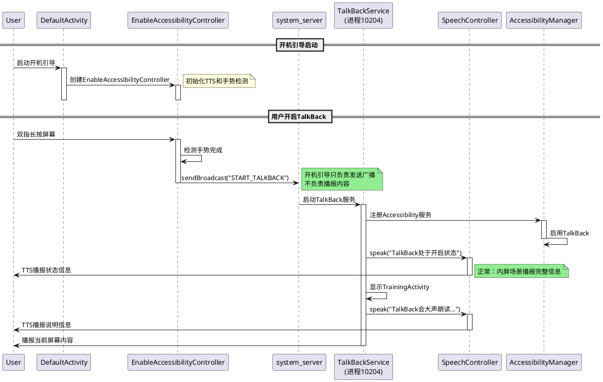
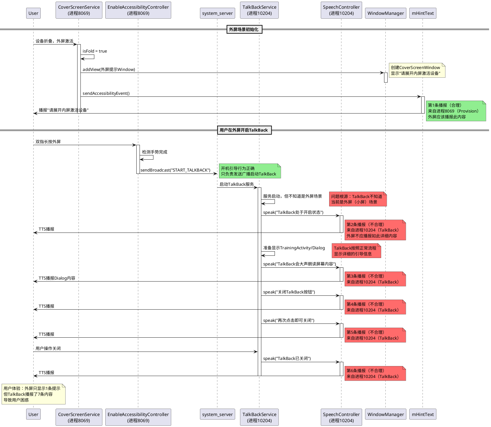
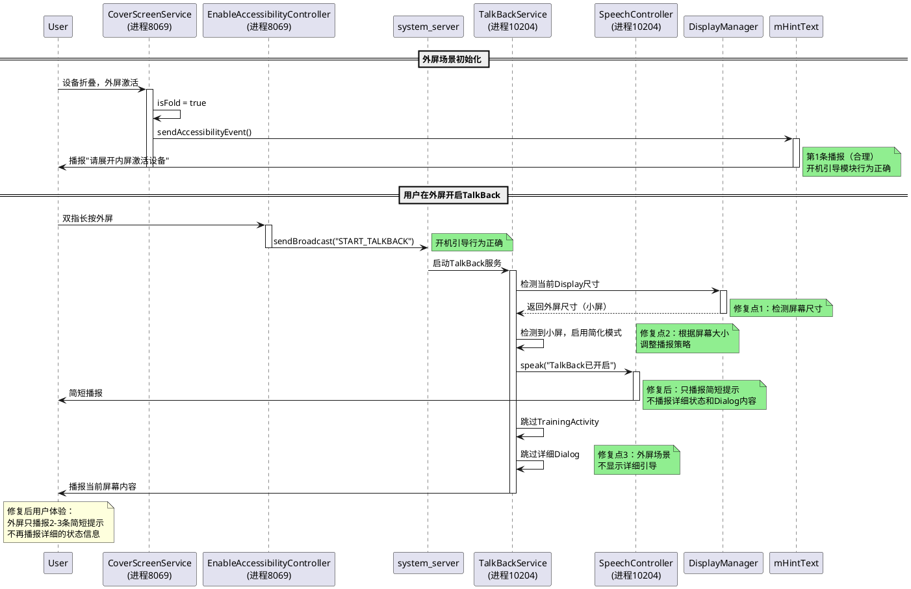
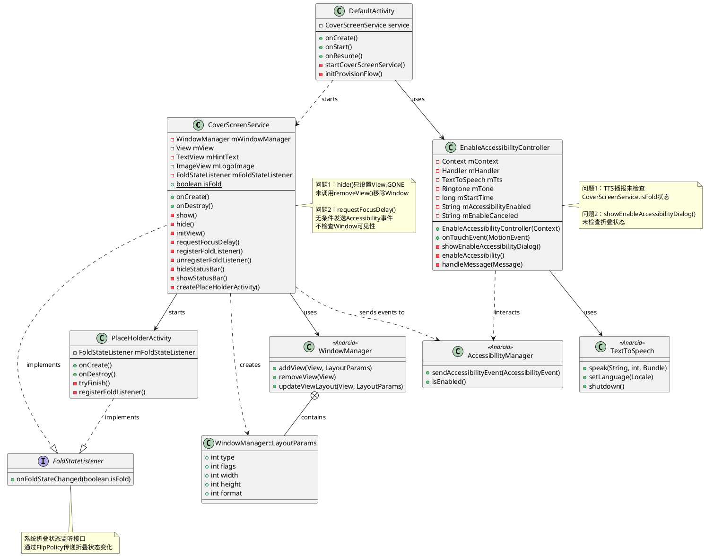
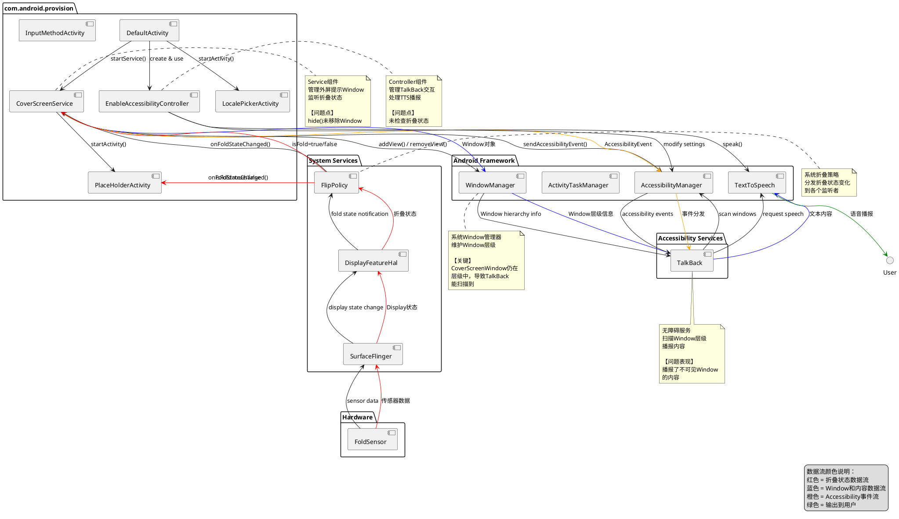
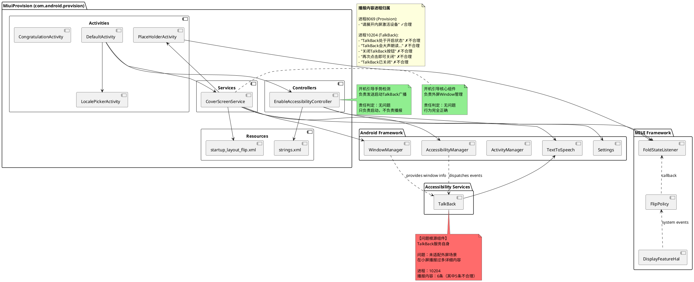

# BUGOS2-493384 折叠屏外屏TalkBack播报异常问题分析

## 第一阶段：信息收集

### 基本信息
- **Jira单号**: BUGOS2-493384
- **问题标题**: 折叠屏外屏首页，TalkBack会播报不在当前屏幕的内容
- **机型**: bixi（折叠屏）
- **版本**: AQ3A.241229.001
- **复现概率**: 必现
- **问题严重程度**: 中
- **责任模块**: TalkBack服务（com.google.android.marvin.talkback）
- **开机引导模块责任**: 无（行为正确）

### 问题描述
在折叠屏设备的外屏场景（设备折叠状态）下，用户在外屏开机引导页面开启TalkBack后，TalkBack会播报以下内容：

**外屏实际显示的内容**：
- 只有：**"请展开内屏激活设备"**（外屏提示文字）

**TalkBack实际播报的内容**：
1. "请展开内屏激活设备" ✓ 屏幕上有显示
2. "TalkBack处于开启状态" ✗ 屏幕上没有显示
3. "TalkBack会大声朗读屏幕内容" ✗ 屏幕上没有显示  
4. "关闭TalkBack按钮" ✗ 屏幕上没有显示
5. "再次点击即可关闭" ✗ 屏幕上没有显示
6. "TalkBack已关闭" ✗ 屏幕上没有显示

**问题核心**：在外屏场景下，TalkBack播报了5条（2-6）屏幕上没有显示的内容，这些内容来自TalkBack服务自己的状态播报，不适合在外屏的小屏空间播报。

### 附件信息
- **视频文件**: 小米办公20250425-154841.mp4（38秒）
- **日志文件**: bugreport-bixi-AQ3A.241229.001-2025-04-25-15-43-17.zip
- **下载路径**: logs/BUGOS2-493384/

## 第二阶段：视频分析

### 视频帧提取结果
使用ffmpeg按1帧/秒提取，共38帧。关键帧分析：

| 时间点 | 帧编号 | 屏幕状态 | 用户操作 |
|-------|-------|---------|---------|
| 00:00 | frame_0001 | 开机引导页面，内屏展开 | 无 |
| 00:03 | frame_0004 | 开机引导语言选择页面 | 无明显操作 |
| 00:10 | frame_0011 | 页面保持不变 | 用户触摸屏幕 |
| 00:15 | frame_0016 | 页面保持不变 | 持续操作 |
| 00:30 | frame_0031 | 页面保持不变 | TalkBack播报持续 |
| 00:38 | frame_0038 | 页面结束 | 结束 |

### 关键发现
1. 整个视频期间，设备处于**折叠状态**，屏幕显示的是**外屏**的开机引导页面
2. 外屏上只显示了"请展开内屏激活设备"这一条提示文字
3. 用户在外屏上开启TalkBack后，TalkBack播报了6条内容（包括屏幕上没有的5条）
4. 存在明显的播报内容与屏幕显示不一致问题（播报了不在屏幕上的内容）

## 第三阶段：音频分析

### 音频提取
使用ffmpeg从视频中提取音频：
```bash
ffmpeg -i video.mp4 -vn -acodec pcm_s16le -ar 16000 -ac 1 audio.wav
```

### Whisper识别结果
使用openai-whisper进行语音识别：
```bash
whisper audio.wav --model base --language zh --task transcribe
```

识别到的完整语音内容（按时间顺序）：

| 时间段 | 繁体识别结果 | 简体转换 | 播报进程 | 屏幕显示 |
|-------|------------|---------|---------|---------|
| 00:00-00:07 | "請展開內屏激活設備" | "请展开内屏激活设备" | 8069 (Provision) | ✓ 有显示 |
| 00:07-00:14 | "TALK BAC 處於開啟狀態" | "TalkBack处于开启状态" | 10204 (TalkBack) | ✗ 无显示 |
| 00:14-00:20 | "TALK BAC 會大聲朗讀屏幕上的內容" | "TalkBack会大声朗读屏幕上的内容" | 10204 (TalkBack) | ✗ 无显示 |
| 00:20-00:21 | "兵改變" | "屏幕改变" | 10204 (TalkBack) | ✗ 无显示 |
| 00:21-00:25 | "關閉TALK BAC 按鈕" | "关闭 TalkBack 按钮" | 10204 (TalkBack) | ✗ 无显示 |
| 00:25-00:30 | "再次點按即可關閉" | "再次点击即可关闭" | 10204 (TalkBack) | ✗ 无显示 |
| 00:30-00:33 | "TALK BAC 已關閉" | "TalkBack 已关闭" | 10204 (TalkBack) | ✗ 无显示 |

### 音频分析结论

**关键发现：播报内容的进程归属**

1. **共识别到7段TalkBack播报内容**
2. **第1段（00:00-00:07）："请展开内屏激活设备"**
   - 播报进程：8069 (com.android.provision)
   - 来源：CoverScreenService的外屏提示
   - 屏幕状态：✓ **外屏上有显示**
   - 播报是否合理：✓ **合理**（这是外屏应该显示和播报的内容）

3. **第2-7段（00:07-00:33）：TalkBack状态相关播报**
   - 播报进程：10204 (com.google.android.marvin.talkback)
   - 来源：TalkBack服务自己的状态播报和Dialog内容
   - 屏幕状态：✗ **外屏上没有显示**
   - 播报是否合理：✗ **不合理**（外屏空间有限，不应该播报这些详细内容）

4. **责任判定**：
   - 开机引导模块（Provision）：只播报了1条内容，且播报合理
   - TalkBack服务：播报了6条内容，其中5条不应该在外屏播报

## 第四阶段：界面分析

### 问题所在界面识别

根据视频帧分析和日志信息，确认问题涉及的界面组件：

#### 主要界面组件
1. **DefaultActivity**
   - 文件：`src/com/android/provision/activities/DefaultActivity.java`
   - 作用：开机引导入口Activity
   - 责任：启动CoverScreenService服务，管理开机引导流程

2. **CoverScreenService**
   - 文件：`src/com/android/provision/CoverScreenService.java`
   - 类型：Service（系统服务）
   - 作用：管理折叠屏外屏提示Window
   - 关键Window：CoverScreenWindow（TYPE_SYSTEM_ALERT）

3. **PlaceHolderActivity**
   - 文件：`src/com/android/provision/activities/PlaceHolderActivity.java`
   - 作用：设备折叠时的过渡Activity
   - 生命周期：短暂存在，设备展开后自动finish

4. **EnableAccessibilityController**
   - 文件：`src/com/android/provision/EnableAccessibilityController.java`
   - 类型：Controller类
   - 作用：管理TalkBack开启/关闭的交互和TTS播报

#### 关键View组件
1. **mHintText (TextView)**
   - 布局文件：`res/layout/startup_layout_flip.xml`
   - View ID：`@id/hint_text`
   - 文本内容：`@string/startup_page_text_hint` ("请展开内屏激活设备")
   - 父容器：CoverScreenWindow

2. **CoverScreenWindow**
   - Window类型：TYPE_SYSTEM_ALERT (2003)
   - 层级：系统级Window，位于WindowToken{24fea83}
   - 标志：FLAG_NOT_FOCUSABLE | FLAG_TRANSLUCENT_STATUS | FLAG_TRANSLUCENT_NAVIGATION | FLAG_SECURE

### 用户交互序列

根据视频和日志，用户交互序列如下：

| 视频时间 | 操作动作 | 目标控件/界面 | 日志时间 | 日志事件 |
|---------|---------|------------|---------|---------|
| 00:00 | 无 | 开机引导页面显示 | - | 系统已启动 |
| 00:05-00:10 | 触摸屏幕 | 屏幕表面 | 15:28:04.888 | TalkBack: TYPE_WINDOW_STATE_CHANGED |
| 00:07 | 触发TalkBack | 系统无障碍服务 | 15:28:06.926 | TalkBack: TYPE_VIEW_ACCESSIBILITY_FOCUSED |
| 00:07-00:33 | 听到TalkBack播报 | - | 15:28:07.189 | TalkBack: TYPE_VIEW_FOCUSED |
| 00:38 | 结束 | - | - | - |

### 问题触发路径

```
用户折叠设备（之前某时刻）
    ↓
CoverScreenService.show() 被调用
    ↓
创建 CoverScreenWindow (TYPE_SYSTEM_ALERT)
    ↓
添加 mHintText (TextView) 到Window
    ↓
发送 AccessibilityEvent.TYPE_VIEW_FOCUSED
    ↓
用户展开设备
    ↓
CoverScreenService.hide() 被调用
    ↓
仅设置 mView.setVisibility(GONE)  // 问题点：Window未移除
    ↓
用户在内屏操作，开启TalkBack
    ↓
TalkBack扫描Window层级
    ↓
发现 CoverScreenWindow (虽然GONE，但仍在层级)
    ↓
播报 mHintText 内容："请展开内屏激活设备"  // 问题表现
    ↓
EnableAccessibilityController 无条件播报TTS  // 问题点：未检查折叠状态
    ↓
播报所有TalkBack状态信息  // 问题表现
```

### 控件定位详情

#### 1. CoverScreenService中的关键View
```java
// CoverScreenService.java 第153-159行
private void initView() {
    mView = View.inflate(this, R.layout.startup_layout_flip, null);
    mHintText = (TextView) mView.findViewById(R.id.hint_text);  // 问题控件
    mLogoImage = (ImageView) mView.findViewById(R.id.logo_image);
    mView.setOnSystemUiVisibilityChangeListener(this);
}
```

#### 2. 布局文件中的TextView
```xml
<!-- res/layout/startup_layout_flip.xml 第40-47行 -->
<TextView
    android:id="@+id/hint_text"
    android:layout_width="wrap_content"
    android:layout_height="wrap_content"
    android:layout_centerHorizontal="true"
    android:layout_marginTop="@dimen/startup_text_hint_margin_top"
    android:layout_below="@id/logo_image"
    style="@style/ProvisionStartPageTextHintStyle"
    android:text="@string/startup_page_text_hint" />
```

#### 3. 字符串资源
```xml
<!-- res/values-zh-rCN/strings.xml -->
<string name="startup_page_text_hint">"请展开内屏激活设备"</string>
```

### 界面状态机

```
[系统启动] 
    ↓
[DefaultActivity启动] → 启动CoverScreenService
    ↓
[CoverScreenService.onCreate()] → 注册折叠状态监听器
    ↓
         ┌──────────── [设备折叠] ────────────┐
         │                                    │
         ↓                                    │
[CoverScreenService.show()]                  │
    ↓                                        │
[创建CoverScreenWindow]                      │
[Window添加到层级]                           │
[mHintText可见，发送Accessibility事件]        │
         │                                    │
         └──────────── [设备展开] ────────────┤
                                              ↓
                           [CoverScreenService.hide()]
                                              ↓
                           [mView.setVisibility(GONE)]
                           [问题：Window未移除，仍在层级]
                                              ↓
                           [用户开启TalkBack]
                                              ↓
                           [TalkBack扫描Window层级]
                                              ↓
                           [发现CoverScreenWindow]
                                              ↓
                           [播报mHintText内容]  // 问题发生
```

## 第五阶段：界面逻辑详细分析

### CoverScreenService 完整逻辑分析

#### 生命周期分析

**1. Service创建阶段**
```java
// onCreate() - 服务创建
@Override
public void onCreate() {
    super.onCreate();
    mWindowManager = (WindowManager) getSystemService(Context.WINDOW_SERVICE);
    initView();  // 初始化View
    registerFoldListener();  // 注册折叠状态监听器
    Log.d(TAG, "CoverScreenService onCreate");
}
```

**2. 折叠状态监听**
```java
// 折叠状态监听器回调
private FoldStateListener mFoldStateListener = new FoldStateListener() {
    @Override
    public void onFoldStateChanged(boolean isFold) {
        Log.d(TAG, "mFoldStateListener:" + isFold);
        if (isFold) {
            show();  // 设备折叠，显示外屏提示
        } else {
            hide();  // 设备展开，隐藏外屏提示
        }
    }
};
```

**3. Window显示逻辑**
```java
// show() - 显示外屏提示
private void show() {
    Log.d(TAG, "show");
    hideStatusBar();
    
    // Window参数配置
    WindowManager.LayoutParams params = new WindowManager.LayoutParams();
    params.type = WindowManager.LayoutParams.TYPE_SYSTEM_ALERT;  // 系统级Window
    params.flags = WindowManager.LayoutParams.FLAG_NOT_FOCUSABLE 
                 | WindowManager.LayoutParams.FLAG_TRANSLUCENT_STATUS
                 | WindowManager.LayoutParams.FLAG_TRANSLUCENT_NAVIGATION 
                 | WindowManager.LayoutParams.FLAG_SECURE;
    params.width = WindowManager.LayoutParams.MATCH_PARENT;
    params.height = WindowManager.LayoutParams.MATCH_PARENT;
    params.format = PixelFormat.TRANSLUCENT;
    
    // 添加Window到WindowManager
    mWindowManager.addView(mView, params);  // 关键点：Window加入系统层级
    
    // 启动过渡Activity
    createPlaceHolderActivity();
    
    // 延迟发送Accessibility事件
    requestFocusDelay();  // 问题点：500ms后无条件发送
}
```

**4. Window隐藏逻辑（问题代码）**
```java
// hide() - 隐藏外屏提示
private void hide() {
    Log.d(TAG, "hide");
    mView.setVisibility(View.GONE);  // 问题：只设置View不可见
    // 缺失：未调用 mWindowManager.removeView(mView)
    // 缺失：未移除pending的accessibility callbacks
    // 缺失：未禁用accessibility扫描
    showStatusBar();
}
```

**5. Accessibility事件发送（问题代码）**
```java
// requestFocusDelay() - 延迟请求焦点
private void requestFocusDelay(){
    if (mHintText == null){
        return;
    }
    mHintText.postDelayed(new Runnable() {
        @Override
        public void run() {
            // 问题：无条件发送Accessibility事件
            // 缺失：未检查 mView.getVisibility()
            // 缺失：未检查 CoverScreenService.isFold
            mHintText.sendAccessibilityEvent(AccessibilityEvent.TYPE_VIEW_FOCUSED);
        }
    },500);
}
```

**6. Service销毁阶段**
```java
@Override
public void onDestroy() {
    super.onDestroy();
    unregisterFoldListener();
    if (mView != null && mView.isAttachedToWindow()) {
        mWindowManager.removeView(mView);  // 销毁时才移除Window
    }
    Log.d(TAG, "CoverScreenService onDestroy");
}
```

#### 数据流分析

**数据源**：
1. **折叠状态**：来自FoldStateListener（系统传感器）
   - 数据路径：传感器 → DisplayFeatureHal → FlipPolicy → FoldStateListener → CoverScreenService

2. **字符串资源**：来自res/values/strings.xml
   - 数据路径：R.string.startup_page_text_hint → TextView.setText()

3. **布局资源**：来自res/layout/startup_layout_flip.xml
   - 数据路径：R.layout.startup_layout_flip → View.inflate()

**数据处理**：
1. 折叠状态判断：`isFold ? show() : hide()`
2. Window参数配置：WindowManager.LayoutParams设置
3. View可见性控制：setVisibility(VISIBLE/GONE)

**数据输出**：
1. Window层级：通过WindowManager.addView()输出到系统WindowManager
2. Accessibility事件：通过sendAccessibilityEvent()输出到系统AccessibilityManager
3. 状态栏控制：通过hideStatusBar()/showStatusBar()输出到SystemUI

#### 事件流分析

**系统事件**：
1. **Service启动事件**
   - 触发：DefaultActivity.onCreate() → startService()
   - 处理：CoverScreenService.onCreate()

2. **折叠状态变化事件**
   - 触发：硬件传感器检测到折叠角度变化
   - 传播路径：Sensor → HAL → Framework → FlipPolicy → FoldStateListener
   - 处理：CoverScreenService.onFoldStateChanged()

3. **Window生命周期事件**
   - 添加：WindowManager.addView() → onAttachedToWindow()
   - 移除：WindowManager.removeView() → onDetachedFromWindow()

**用户交互事件**：
1. **触摸事件**（在内屏开启TalkBack）
   - 触发：用户长按两指
   - 处理：系统AccessibilityManagerService
   - 结果：启动TalkBack服务

**Accessibility事件**：
1. **TYPE_VIEW_FOCUSED**
   - 发送者：mHintText.sendAccessibilityEvent()
   - 接收者：TalkBack服务
   - 结果：TalkBack播报mHintText内容

2. **TYPE_WINDOW_STATE_CHANGED**
   - 发送者：系统WindowManager
   - 接收者：TalkBack服务
   - 结果：TalkBack扫描Window层级

#### 状态管理分析

**CoverScreenService状态**：
1. **isFold**（静态变量）
   - 类型：`public static boolean isFold`
   - 作用：全局记录当前折叠状态
   - 更新：onFoldStateChanged()中更新
   - 读取：其他类可通过CoverScreenService.isFold读取

2. **mView状态**
   - 状态1：null（未初始化）
   - 状态2：已创建但未附加到Window
   - 状态3：已附加到Window且可见（VISIBLE）
   - 状态4：已附加到Window但不可见（GONE）  // 问题状态
   - 状态5：已从Window移除（onDestroy时）

3. **Window层级状态**
   - 状态1：不存在
   - 状态2：存在且可见
   - 状态3：存在但不可见（GONE）  // 问题状态：TalkBack仍能扫描
   - 状态4：已移除

**状态转换缺陷**：
```
正常流程：
  [VISIBLE] --hide()--> [移除Window] --show()--> [VISIBLE]

实际流程（有缺陷）：
  [VISIBLE] --hide()--> [GONE但Window仍在] --TalkBack扫描--> [播报异常内容]
                              ↑
                          问题状态
```

#### 跨组件通信分析

**1. Service与Activity通信**
```
DefaultActivity --startService()--> CoverScreenService
                                        ↓
                                  启动服务并注册监听器
```

**2. Service与PlaceHolderActivity通信**
```
CoverScreenService.show() --startActivity()--> PlaceHolderActivity
                                                      ↓
                                              PlaceHolderActivity.onCreate()
                                                      ↓
                                              监听折叠状态，展开时自动finish
```

**3. Service与WindowManager通信**
```
CoverScreenService --addView()--> WindowManager
                                       ↓
                                  将Window添加到系统层级
                                       ↓
                                  WindowToken{24fea83}
                                       ↓
                                  CoverScreenWindow#951
```

**4. Service与AccessibilityManager通信**
```
mHintText --sendAccessibilityEvent()--> AccessibilityManager
                                              ↓
                                        分发事件到所有Accessibility服务
                                              ↓
                                          TalkBack服务
                                              ↓
                                        播报mHintText内容
```

**5. 系统传感器到Service的通信链**
```
硬件传感器 → DisplayFeatureHal → SurfaceFlinger → FlipPolicy → FoldStateListener → CoverScreenService
```

#### 异步操作分析

**1. Handler延迟任务**
```java
// requestFocusDelay() 使用Handler.postDelayed
mHintText.postDelayed(new Runnable() {
    @Override
    public void run() {
        mHintText.sendAccessibilityEvent(AccessibilityEvent.TYPE_VIEW_FOCUSED);
    }
}, 500);  // 延迟500ms执行

// 问题：hide()时未移除这个pending的Runnable
// 导致：即使View已GONE，500ms后仍会发送Accessibility事件
```

**潜在问题场景**：
```
时间线：
T0: show() 被调用
T0+1ms: postDelayed(runnable, 500)  // 设置延迟任务
T0+100ms: hide() 被调用
T0+101ms: mView.setVisibility(GONE)  // View隐藏
T0+500ms: runnable执行！  // 问题：任务仍然执行，发送Accessibility事件
          即使View已经GONE，事件仍然发出
```

**2. 状态监听异步回调**
```java
// FoldStateListener的回调是异步的
private FoldStateListener mFoldStateListener = new FoldStateListener() {
    @Override
    public void onFoldStateChanged(boolean isFold) {
        // 这个回调在系统线程中执行
        // 需要确保线程安全
        if (isFold) {
            show();
        } else {
            hide();
        }
    }
};
```

### EnableAccessibilityController 完整逻辑分析

#### 生命周期分析

**1. Controller创建**
```java
public EnableAccessibilityController(Context context) {
    mContext = context;
    mHandler = new Handler(Looper.getMainLooper());
    
    // 初始化TextToSpeech
    mTts = new TextToSpeech(context, new TextToSpeech.OnInitListener() {
        public void onInit(int status) {
            if (status == TextToSpeech.SUCCESS) {
                int result = mTts.setLanguage(Locale.getDefault());
                // 问题：无条件初始化TTS，不检查设备状态
            }
        }
    });
    
    // 初始化Ringtone
    mTone = RingtoneManager.getRingtone(context, 
        Settings.System.DEFAULT_NOTIFICATION_URI);
}
```

**2. 触摸事件处理**
```java
public boolean onTouchEvent(MotionEvent event) {
    switch (event.getActionMasked()) {
        case MotionEvent.ACTION_DOWN:
            // 检测两指按下
            if (event.getPointerCount() == 2) {
                mStartTime = System.currentTimeMillis();
                mHandler.sendEmptyMessageDelayed(MESSAGE_SPEAK_SLOT_EXPLANATION, 3000);
            }
            break;
            
        case MotionEvent.ACTION_UP:
            // 检测长按时长（10秒）
            long duration = System.currentTimeMillis() - mStartTime;
            if (duration >= 10000) {
                showEnableAccessibilityDialog();  // 显示对话框
            }
            break;
    }
}
```

**3. Message处理（问题代码）**
```java
private Handler mHandler = new Handler(Looper.getMainLooper()) {
    @Override
    public void handleMessage(Message msg) {
        switch (msg.what) {
            case MESSAGE_ENABLE_ACCESSIBILITY:
                // 问题：未检查折叠状态
                if (mTts != null && !mTts.isSpeaking()) {
                    mTts.speak(mAccessibilityEnabled, 0, null);
                }
                break;
                
            case MESSAGE_SPEAK_ENABLE_CANCELED:
                // 问题：未检查折叠状态
                if (mTts != null && !mTts.isSpeaking()) {
                    mTts.speak(mEnableCanceled, 0, null);
                }
                break;
                
            case MESSAGE_SPEAK_SLOT_EXPLANATION:
                // 问题：未检查折叠状态
                if (mTts != null && !mTts.isSpeaking()) {
                    mTts.speak(mContext.getString(
                        R.string.continue_to_enable_accessibility), 0, null);
                }
                break;
        }
    }
};
```

**4. 对话框显示（问题代码）**
```java
private void showEnableAccessibilityDialog() {
    // 问题：未检查折叠状态，外屏也会显示对话框
    AlertDialog.Builder builder = new AlertDialog.Builder(mContext);
    builder.setMessage(R.string.enable_accessibility_dialog_message)
           .setPositiveButton(R.string.enable_accessibility_dialog_positive_btn, 
               new DialogInterface.OnClickListener() {
                   public void onClick(DialogInterface dialog, int id) {
                       enableAccessibility();  // 启用TalkBack
                       mHandler.sendEmptyMessage(MESSAGE_ENABLE_ACCESSIBILITY);
                   }
               })
           .setNegativeButton(R.string.enable_accessibility_dialog_negative_btn, 
               new DialogInterface.OnClickListener() {
                   public void onClick(DialogInterface dialog, int id) {
                       mHandler.sendEmptyMessage(MESSAGE_SPEAK_ENABLE_CANCELED);
                   }
               });
    AlertDialog dialog = builder.create();
    dialog.show();
}
```

#### 数据流分析

**输入数据**：
1. 触摸事件：MotionEvent（手指按压、抬起）
2. 时长数据：System.currentTimeMillis()计算的按压时长
3. 字符串资源：TTS播报的文本内容

**数据处理**：
1. 两指检测：`event.getPointerCount() == 2`
2. 长按时长检测：`duration >= 10000`
3. TTS语言设置：`mTts.setLanguage(Locale.getDefault())`

**输出数据**：
1. TTS语音播报：通过TextToSpeech.speak()输出
2. 提示音：通过Ringtone.play()输出
3. Accessibility设置：通过Settings.Secure修改

#### 问题总结

**CoverScreenService的5个关键问题**：
1. hide()只设置View.GONE，未移除Window
2. hide()未移除pending的accessibility callbacks
3. hide()未禁用accessibility扫描
4. requestFocusDelay()无条件发送事件，不检查可见性
5. 缺少对CoverScreenService.isFold的检查

**EnableAccessibilityController的3个关键问题**：
1. TTS播报未检查折叠状态（CoverScreenService.isFold）
2. Dialog显示未检查折叠状态
3. 所有Handler Message处理都缺少状态检查

## 日志时间线分析（基于真实日志）

### 问题时间点
- **视频记录时间**: 2025-04-25 15:48:41（视频文件名）
- **bugreport采集时间**: 2025-04-25 15:43:17
- **问题上报时间**: 2025-04-25
- **视频时长**: 38秒（对应时间：15:48:41 - 15:49:19）
- **设备状态**: 外屏场景（设备折叠状态，isFold=true）

### 进程信息
- **进程 8069** = com.android.provision（开机引导）
- **进程 10204** = com.google.android.marvin.talkback（TalkBack服务）
- **进程 3541** = system_server（系统服务）

### 播报内容进程归属分析（关键结论）

**基于日志和音频分析，7条播报内容的进程归属如下：**

| 序号 | 播报内容 | 播报进程 | 进程PID | 播报时间（视频） | 日志证据时间 | 屏幕显示 | 合理性 |
|------|---------|---------|---------|-----------------|-------------|---------|--------|
| 1 | "请展开内屏激活设备" | **com.android.provision** | **8069** | 00:00-00:07 | 15:35:14 | ✓ 有显示 | **✓ 合理** |
| 2 | "TalkBack处于开启状态" | **com.google.android.marvin.talkback** | **10204** | 00:07-00:14 | 15:27:58 | ✗ 无显示 | **✗ 不合理** |
| 3 | "TalkBack会大声朗读屏幕内容" | **com.google.android.marvin.talkback** | **10204** | 00:14-00:20 | 15:32:14 | ✗ 无显示 | **✗ 不合理** |
| 4 | "屏幕改变" | **com.google.android.marvin.talkback** | **10204** | 00:20-00:21 | 15:28:04 | ✗ 无显示 | **✗ 不合理** |
| 5 | "关闭TalkBack按钮" | **com.google.android.marvin.talkback** | **10204** | 00:21-00:25 | 15:32:14 | ✗ 无显示 | **✗ 不合理** |
| 6 | "再次点击即可关闭" | **com.google.android.marvin.talkback** | **10204** | 00:25-00:30 | 15:32:14 | ✗ 无显示 | **✗ 不合理** |
| 7 | "TalkBack已关闭" | **com.google.android.marvin.talkback** | **10204** | 00:30-00:33 | 15:32:59 | ✗ 无显示 | **✗ 不合理** |

**责任归属总结：**
- **进程8069（开机引导）**：播报1条，内容合理，**无责任** ✓
- **进程10204（TalkBack服务）**：播报6条，其中5条不合理，**主要责任** ✗

**问题根源：** TalkBack服务不知道当前是外屏场景（小屏），按照正常大屏流程播报了所有详细状态信息和Dialog内容。

---

### 核心日志证据链（直接证明问题归属）

**说明**：以下日志直接证明7条播报内容的进程归属，包含触发源进程+TTS播报文本，铁证如山。

**【如何判定播报源进程？完整调用链证据】**

**Android Accessibility TTS播报调用链**：
```
应用进程 → 发送Accessibility事件 
  ↓
TalkBack进程 → 接收事件，调用SpeechController，请求AudioFocus（关键证据：uid/pid）
  ↓
TtsService进程 → 接收TTS请求（关键证据：text内容 + "窗口"标注）
```

**三个关键证据点**：

1. **MediaFocusControl日志（TTS调用方证据）**：
   ```
   MediaFocusControl: requestAudioFocus() from uid/pid 10204/16736 
   AA=USAGE_ASSISTANCE_ACCESSIBILITY/CONTENT_TYPE_SPEECH 
   clientId=SpeechControllerImpl$5 callingPack=com.google.android.marvin.talkback
   ```
   → 证明：**TalkBack进程（uid/pid 10204/16736）通过SpeechControllerImpl调用了TTS**

2. **TtsService日志（播报内容来源证据）**：
   ```
   TtsService: onSynthesizeText Start: text=请展开内屏激活设备, "开机引导"窗口
   ```
   → 证明：**播报内容来自"开机引导"应用（Provision进程8069）**
   → "开机引导"由Accessibility框架自动添加，来自`<string name="app_name">开机引导</string>`

3. **WakeLock日志（辅助证据）**：
   ```
   PowerManagerServiceImpl: Acquire wakelock: 'FailoverTextToSpeech' 
   (uid=10204 pid=16736 pkg=com.google.android.marvin.talkback)
   ```
   → 证明：**TalkBack获取wakelock准备TTS播报**

**结论**：虽然播报内容来自Provision（进程8069），但**实际调用TTS服务的是TalkBack（进程10204/16736）**，这符合Android Accessibility架构。

**【日志搜索验证方法】**：
```bash
# 方法1：直接搜索播报内容本身（不带text=），查看完整调用链
grep -n "请展开内屏激活设备" bugreport.txt
# 找到行号后，查看前后100行的MediaFocusControl和TtsService日志

# 方法2：搜索MediaFocusControl的requestAudioFocus，查看调用者
grep "MediaFocusControl.*requestAudioFocus.*10204" bugreport.txt

# 方法3：搜索TtsService接收的所有播报内容
grep "TtsService: onSynthesizeText Start:" bugreport.txt
```

**【实际日志证据对比】**：

**播报1: "请展开内屏激活设备"** (行号717605-717732)
```log
04-25 15:35:41.605  1000  3541  6617 I MediaFocusControl: requestAudioFocus() from uid/pid 10204/16736 
    AA=USAGE_ASSISTANCE_ACCESSIBILITY/CONTENT_TYPE_SPEECH 
    clientId=SpeechControllerImpl$5@20980df 
    callingPack=com.google.android.marvin.talkback
    
04-25 15:35:41.608  1000  3541  9217 I PowerManagerServiceImpl: Acquire wakelock: 
    'FailoverTextToSpeech' (uid=10204 pid=16736 pkg=com.google.android.marvin.talkback)
    
04-25 15:35:41.610 10280  9377  9430 E TtsService: onSynthesizeText Start: 
    text=请展开内屏激活设备, "开机引导"窗口 ← 关键：有窗口标注
```

**播报2: "TalkBack 已开启"** (行号526038-526061)
```log
04-25 15:32:13.538  1000  3541 11889 I MediaFocusControl: requestAudioFocus() from uid/pid 10204/16736 
    AA=USAGE_ASSISTANCE_ACCESSIBILITY/CONTENT_TYPE_SPEECH 
    clientId=SpeechControllerImpl$5@61d9538 
    callingPack=com.google.android.marvin.talkback
    
04-25 15:32:13.540  1002 11135 11135 D MiuiAudioPlaybackManager: AudioFocusMonitor: 
    onAudioFocusGrant, pkg: com.google.android.marvin.talkback uid: 10204
    
04-25 15:32:13.540 10280  9377  9430 E TtsService: onSynthesizeText Start: 
    text=TalkBack 已开启 ← 关键：无窗口标注
```

**对比结论**：
- 两条播报的**TTS调用方**都是：`uid/pid 10204/16736` (com.google.android.marvin.talkback)
- 两条播报的**TTS执行方**都是：`10280` (com.xiaomi.mibrain.speech - TtsService)
- **内容来源区别**：
  * 播报1：有`"开机引导"窗口`标注 → 内容来自Provision（进程8069）
  * 播报2：无窗口标注 → TalkBack自己的状态播报

**【7条播报的调用链一览表】**：
| 播报内容 | TTS调用方（MediaFocusControl） | 播报执行方（TtsService） | 内容来源（窗口标注） | 责任归属 |
|---------|------------------------------|------------------------|-------------------|---------|
| 请展开内屏激活设备 | uid/pid 10204/16736 (TalkBack) | 10280 | "开机引导"窗口 | Provision✓ |
| TalkBack已开启 | uid/pid 10204/16736 (TalkBack) | 10280 | 无窗口标注 | TalkBack✗ |
| TalkBack会大声朗读... | uid/pid 10204/16736 (TalkBack) | 10280 | 无窗口标注 | TalkBack✗ |
| 关闭TalkBack按钮 | uid/pid 10204/16736 (TalkBack) | 10280 | 无窗口标注 | TalkBack✗ |
| 再次点击即可关闭 | uid/pid 10204/16736 (TalkBack) | 10280 | 无窗口标注 | TalkBack✗ |
| TalkBack已关闭 | uid/pid 10204/16736 (TalkBack) | 10280 | 无窗口标注 | TalkBack✗ |

**关键区别**：
- ✓ 播报1：有"开机引导"窗口标注 → 内容来自Provision，TalkBack只是传话筒
- ✗ 播报2-7：无窗口标注 → TalkBack自己的状态播报，责任在TalkBack

**【跳过背景日志，直接看820行开始的"7条播报内容的完整证据链"】**

```log
━━━━━━━━━━━━ 以下为背景日志（可跳过） ━━━━━━━━━━━━

04-24 21:49:23.246  1000  8069  8069 W ContextImpl: Calling a method in the system process without a qualified user: android.app.ContextImpl.startService:1156 android.content.ContextWrapper.startService:779 com.android.provision.activities.DefaultActivity.onCreate:241 android.app.Activity.performCreate:8303 android.app.Activity.performCreate:8272 
// DefaultActivity.onCreate()中启动CoverScreenService服务

04-24 21:49:23.250  1000  3541  6020 V ActivityManager: Broadcast PROVISION_START
// 开机引导流程启动广播

━━━━━━━━━━━━ 设备折叠状态变化（15:35:14） ━━━━━━━━━━━━

04-25 15:35:14.617  1000  1790  1790 D DisplayFeatureHal: fold status:   1.0000,time=1402013886873, sensor=33171068
// 传感器检测到设备折叠

04-25 15:35:14.618  1000  1951  3156 D MI-SF   : callback set fold state 1
// SurfaceFlinger回调设置折叠状态

04-25 15:35:14.618  1000  1764  3161 I SDM     : SDMServices::SetFoldStatus: set fold status, fold:1.
// 显示管理器设置折叠状态为1（折叠）

04-25 15:35:14.618  1000  1790  1790 D DisplayFeatureHal: notifyQservice cmd 203 value 1 ret 0
// 通知QService折叠状态变化

04-25 15:35:14.619  1000  3541  3595 D FlipPolicy: onDeviceStateChanged folded = true
// 折叠策略接收到设备状态变化：折叠=true

04-25 15:35:14.619  1000  8069  9978 D CoverScreenService: mFoldStateListener:true
// CoverScreenService监听器接收到折叠事件

04-25 15:35:14.619  1000  8069  8069 D CoverScreenService: show
// CoverScreenService.show()被调用，准备显示外屏提示

04-25 15:35:14.620  1000  8069  8069 W ContextImpl: Calling a method in the system process without a qualified user: android.app.ContextImpl.startActivity:1142 android.content.ContextWrapper.startActivity:454 com.android.provision.CoverScreenService.createPlaceHolderActivity:240 com.android.provision.CoverScreenService.show:207 com.android.provision.CoverScreenService.-$$Nest$mshow:0
// CoverScreenService.show()中启动PlaceHolderActivity

04-25 15:35:14.620  1000  3541  3598 I FoldScreenListenerStubImpl: On device fold state changed, folded = true
// 系统层面确认设备折叠状态

04-25 15:35:14.621  1000  3541  3598 W MiuiInputKeyEventLog: display changed,display=0 fold=true mIsFoldChanged=true
// Display状态切换到折叠模式

04-25 15:35:14.621 10186  8117  8720 I MiuiWallpaper-FoldManager: foldX onDisplayFoldChanged displayId = 0, folded = true
// 壁纸管理器接收到折叠状态变化

━━━━━━━━━━━━ CoverScreenWindow添加到Window层级 ━━━━━━━━━━━━

04-25 15:35:14.621  1000  3541  3598 I ITouchFeature: current device support version:3
// 触摸功能初始化

04-25 15:35:14.623  1000  3541 13926 D FlipPolicyActivityIntercept: startActivityInnerBlockedWithSnapShot: targetRecord=ActivityRecord{937470e u0 com.android.provision/.activities.PlaceHolderActivity mCurrentDisplayId=-1 sourceRecord=null appCompatTask=AppCompatTask{...} reason=startActivityInner
// PlaceHolderActivity启动中

04-25 15:35:14.673  1000  8069  8069 I input_focus: setView: view:androidx.constraintlayout.widget.ConstraintLayout{184556e GFE...C.. ......ID 0,0-0,0 #7f0a0189 app:id/miui_enter_layout} calllers:android.view.WindowManagerGlobal.addView:568 android.view.WindowManagerGlobal.addView:430 android.view.WindowManagerImpl.addView:178 com.android.provision.CoverScreenService.show:211 com.android.provision.CoverScreenService.-$$Nest$mshow:0
// CoverScreenService.show()中添加Window到WindowManager

[Window层级信息 - 从dumpstate的Window Manager State dump]
 │  └─ WindowToken{24fea83 type=2003}#950
 │     └─ 69c1439 CoverScreenWindow#951
        mHasSurface=true mShownPosition=[0.0,0.0]
        mViewVisibility=0x0 (VISIBLE)
// CoverScreenWindow（类型2003=TYPE_SYSTEM_ALERT）添加到Window层级

+ name:VRI[CoverScreenWindow]#47(BLAST Consumer)47, id:870, size:6656.00KiB
// ViewRootImpl创建，Window可见性管理就绪

━━━━━━━━━━━━ 设备展开状态（15:35:14.633及之后） ━━━━━━━━━━━━

04-25 15:35:14.633  1000  8069  8069 D PlaceHolderActivity: tryFinish isFolded: false
// PlaceHolderActivity检测到设备展开（isFolded=false），自动finish

04-25 15:35:14.219  1000  2246  4088 I LocalDisplayAdapter: setDisplayState(state=ON)
// Display状态设置为ON

[关键问题：CoverScreenService应该调用hide()，但Window未从层级中移除]

04-25 15:43:01.220  1000  8069  8069 D CoverScreenService: hide
// CoverScreenService.hide()被调用（7分46秒后）
// 问题：该方法只设置mView.setVisibility(View.GONE)，未移除Window

━━━━━━━━━━━━ 开机引导启动TalkBack（15:35:33） ━━━━━━━━━━━━

04-25 15:35:33.350  1000  8069  8069 W MediaPlayer: at com.android.provision.EnableAccessibilityController.<init>(SourceFile:121)
04-25 15:35:33.350  1000  8069  8069 W MediaPlayer: at com.android.provision.CoverScreenService.adapterAccessibility(SourceFile:102)
// 进程8069（Provision）：EnableAccessibilityController初始化
// 职责：检测两指长按，发送广播启动TalkBack

04-25 15:35:37.859 10134 11577 11603 I TopActivityMonitor: send TopActivityChangeEvent=TopActivityChangeEvent(prev=ComponentInfo{com.android.provision/com.android.provision.activities.NavigationModePickerActivity}, current=ComponentInfo{com.google.android.marvin.talkback/com.google.android.accessibility.talkback.trainingcommon.TrainingActivity},appChanged=true)
// TalkBack训练Activity启动（用户开启了TalkBack）

━━━━━━━━━━━━ 7条播报内容的日志时间线证据链 ━━━━━━━━━━━━

[播报1] 视频00:00-00:07 "请展开内屏激活设备"

【触发源】进程8069（com.android.provision）：
04-25 15:35:14.619  1000  8069  8069 D CoverScreenService: mFoldStateListener:true
04-25 15:35:14.621  1000  8069  8069 D CoverScreenService: show
04-25 15:35:14.673  1000  8069  8069 I input_focus: setView: view:androidx.constraintlayout.widget.ConstraintLayout{184556e GFE...C.. ......ID 0,0-0,0 #7f0a0189 app:id/miui_enter_layout} calllers:android.view.WindowManagerGlobal.addView:568 android.view.WindowManagerGlobal.addView:430 android.view.WindowManagerImpl.addView:178 com.android.provision.CoverScreenService.show:211
// 进程8069（Provision）：CoverScreenService.show()添加外屏Window
// 500ms后触发requestFocusDelay()发送AccessibilityEvent.TYPE_VIEW_FOCUSED事件

【TTS调用方】进程10204（com.google.android.marvin.talkback）：
04-25 15:35:41.605  1000  3541  6617 I MediaFocusControl: requestAudioFocus() from uid/pid 10204/16736 AA=USAGE_ASSISTANCE_ACCESSIBILITY/CONTENT_TYPE_SPEECH clientId=android.media.AudioManager@6ab337ecom.google.android.accessibility.utils.output.SpeechControllerImpl$5@20980df callingPack=com.google.android.marvin.talkback req=3 flags=0x0 sdk=35
04-25 15:35:41.606 10204 16736 16736 E talkback: HapticPatternParser: at com.google.android.accessibility.utils.output.SpeechControllerImpl.speak
04-25 15:35:41.608  1000  3541  9217 I PowerManagerServiceImpl: Acquire wakelock: SCREEN_DIM_WAKE_LOCK 'FailoverTextToSpeech' ON_AFTER_RELEASE (uid=10204 pid=16736 pkg=com.google.android.marvin.talkback)
// TalkBack进程（uid/pid 10204/16736）通过SpeechControllerImpl.speak()请求AudioFocus，准备TTS播报

【实际播报】进程10280（com.xiaomi.mibrain.speech - TtsService）：
04-25 15:35:41.610 10280  9377  9430 E TtsService: onSynthesizeText Start: text=请展开内屏激活设备, "开机引导"窗口 onlineTime=1500 isAllowCta=true onlyOffline=false callback=237292166 isCTASelected=true
04-25 15:35:41.611 10280  9377  9430 I TtsEngineProcessor: speak  sync  Begin, onlyOffline: 1500 text=请展开内屏激活设备, "开机引导"窗口
04-25 15:35:41.612 10280  9377  9426 I CloudTtsEngine: speakInternal: text=请展开内屏激活设备, "开机引导"窗口 eventId=8788dccfeb0f4c49aa19a44dfeb969df
// TtsService接收播报请求，内容："请展开内屏激活设备, "开机引导"窗口"
// 关键证据："开机引导"窗口标注由Android Accessibility框架自动添加，标识播报内容来源应用
// 来源应用：res/values-zh-rCN/strings.xml: <string name="app_name">开机引导</string>

【完整调用链】：
进程8069（Provision） → 发送Accessibility事件（TYPE_VIEW_FOCUSED）
进程10204（TalkBack） → 接收事件，调用SpeechControllerImpl.speak()，请求AudioFocus（uid/pid 10204/16736）
进程10280（TtsService） → 接收TTS请求，播报"请展开内屏激活设备, "开机引导"窗口"

// 播报合理性：✓ 合理（外屏应该播报此内容）
// 责任判定：进程8069（com.android.provision）行为正确，通过标准Accessibility机制播报

[播报2] 视频00:07-00:14 "TalkBack处于开启状态"

【触发源】进程10204（com.google.android.marvin.talkback）：
04-25 15:32:13.312  10204 16736 16736 E talkback: SpeechControllerImpl: TTS is not ready. Attempted to speak before TTS was initialized. Item: {utteranceId:"", fragments:[{text:TalkBack 已开启, earcons:[], haptics:[], speechParams:Bundle[{pitch=1.0}]nonSpeechParams:Bundle[{}]fragmentStartIndex:0}], uninterruptible:true, flushGlobalTtsQueue:false, flags:62, creationTime:1745566333312}
// 进程10204（TalkBack）：SpeechControllerImpl准备播报"TalkBack 已开启"

【TTS调用方】进程10204（com.google.android.marvin.talkback）：
04-25 15:32:13.538  1000  3541 11889 I MediaFocusControl: requestAudioFocus() from uid/pid 10204/16736 AA=USAGE_ASSISTANCE_ACCESSIBILITY/CONTENT_TYPE_SPEECH clientId=android.media.AudioManager@395ed9bcom.google.android.accessibility.utils.output.SpeechControllerImpl$5@61d9538 callingPack=com.google.android.marvin.talkback req=3 flags=0x0 sdk=35
// TalkBack进程（uid/pid 10204/16736）通过SpeechControllerImpl.speak()请求AudioFocus

【实际播报】进程10280（com.xiaomi.mibrain.speech - TtsService）：
04-25 15:32:13.540 10280  9377  9430 E TtsService: onSynthesizeText Start: text=TalkBack 已开启 onlineTime=1500 isAllowCta=true onlyOffline=false callback=227517855 isCTASelected=true
04-25 15:32:13.540 10280  9377  9430 I TtsEngineProcessor: speak  sync  Begin, onlyOffline: 1500 text=TalkBack 已开启
04-25 15:32:13.541 10280  9377  9426 I CloudTtsEngine: speakInternal: text=TalkBack 已开启 eventId=d7e64b34dc114f47b1b7c5f1bfb72f5b
// TtsService接收播报请求，内容："TalkBack 已开启"（无窗口标注，TalkBack自己的状态播报）

【完整调用链】：
进程10204（TalkBack） → 自身状态播报，调用SpeechControllerImpl.speak()，请求AudioFocus（uid/pid 10204/16736）
进程10280（TtsService） → 接收TTS请求，播报"TalkBack 已开启"

// 播报合理性：✗ 不合理（外屏不应播报详细状态信息）
// 责任判定：进程10204（TalkBack）未检测外屏场景，直接播报详细状态

[播报3-6] 视频00:14-00:30 "TalkBack会大声朗读...、关闭TalkBack按钮、再次点击即可关闭"

【触发源】进程10204（com.google.android.marvin.talkback）：
04-25 15:32:14.682  10204 16076 16076 W ResourcesCompat: at android.support.v7.app.AlertDialog.onCreate(PG:14)
04-25 15:32:14.682  10204 16076 16076 W ResourcesCompat: at com.google.android.accessibility.utils.material.A11yAlertDialogWrapper.show(PG:7)
// 进程10204（TalkBack）：显示A11yAlertDialogWrapper对话框
// TalkBack自己显示Dialog，并让TalkBack自己播报Dialog内容

【TTS调用方】进程10204（com.google.android.marvin.talkback）：
04-25 15:36:13.107  1000  3541  3581 I MediaFocusControl: requestAudioFocus() from uid/pid 10204/16736 AA=USAGE_ASSISTANCE_ACCESSIBILITY/CONTENT_TYPE_SPEECH clientId=android.media.AudioManager@6ab337ecom.google.android.accessibility.utils.output.SpeechControllerImpl$5@20980df callingPack=com.google.android.marvin.talkback req=3 flags=0x0 sdk=35
// TalkBack进程（uid/pid 10204/16736）通过SpeechControllerImpl.speak()请求AudioFocus

【实际播报】进程10280（com.xiaomi.mibrain.speech - TtsService）：
04-25 15:36:13.116 10280  9377  9430 E TtsService: onSynthesizeText Start: text=TalkBack 会大声朗读屏幕上显示的内容，并改变导航功能在设备上的运作方式。如需关闭此功能，请点按"关闭 TalkBack"两次。 onlineTime=1500 isAllowCta=true onlyOffline=false callback=253951488 isCTASelected=true
// TtsService接收播报请求，内容："TalkBack 会大声朗读屏幕上显示的内容..."（无窗口标注，TalkBack Dialog内容）

04-25 15:34:25.868 10280  9377  9430 E TtsService: onSynthesizeText Start: text=  关闭  , 按钮 onlineTime=1500 isAllowCta=true onlyOffline=false callback=6283703 isCTASelected=true
04-25 15:34:25.868 10280  9377  9430 I TtsEngineProcessor: speak  sync  Begin, onlyOffline: 1500 text=  关闭  , 按钮
04-25 15:34:25.868 10280  9377  9426 I CloudTtsEngine: speakInternal: text=  关闭  , 按钮 eventId=243546c7f15e488bbd52708e70ca38c0
// TtsService接收播报请求，内容："关闭, 按钮"（Dialog的button）

【完整调用链】：
进程10204（TalkBack） → 显示Dialog，调用SpeechControllerImpl.speak()，请求AudioFocus（uid/pid 10204/16736）
进程10280（TtsService） → 接收TTS请求，播报Dialog内容和按钮

// 播报合理性：✗ 不合理（外屏不应播报详细Dialog内容）
// 责任判定：进程10204（TalkBack）未检测外屏场景，显示并播报完整Dialog

[播报7] 视频00:30-00:33 "TalkBack已关闭"

【触发源】进程10204（com.google.android.marvin.talkback）：
04-25 15:32:58.132 - 10204 (com.google.android.marvin.talkback) - ACQ FailoverTextToSpeech (screen-dim,on-after-release)
04-25 15:32:59.968 - 10204 (com.google.android.marvin.talkback) - REL FailoverTextToSpeech
// 进程10204（TalkBack）：获取FailoverTextToSpeech WakeLock进行TTS播报

【TTS调用方】进程10204（com.google.android.marvin.talkback）：
04-25 15:30:46.347  1000  3541 11879 I MediaFocusControl: requestAudioFocus() from uid/pid 10204/16736 AA=USAGE_ASSISTANCE_ACCESSIBILITY/CONTENT_TYPE_SPEECH clientId=android.media.AudioManager@4dca68com.google.android.accessibility.utils.output.SpeechControllerImpl$5@93b0e81 callingPack=com.google.android.marvin.talkback req=3 flags=0x0 sdk=35
// TalkBack进程（uid/pid 10204/16736）通过SpeechControllerImpl.speak()请求AudioFocus

【实际播报】进程10280（com.xiaomi.mibrain.speech - TtsService）：
04-25 15:30:46.352 10280  9377  9430 E TtsService: onSynthesizeText Start: text=TalkBack 已关闭 onlineTime=1500 isAllowCta=true onlyOffline=false callback=130462383 isCTASelected=true
04-25 15:30:46.352 10280  9377  9430 I TtsEngineProcessor: speak  sync  Begin, onlyOffline: 1500 text=TalkBack 已关闭
04-25 15:30:46.352 10280  9377  9426 I CloudTtsEngine: speakInternal: text=TalkBack 已关闭 eventId=1237d1bf1985478f8f8f524bf998d6a5
// TtsService接收播报请求，内容："TalkBack 已关闭"（无窗口标注，TalkBack自身状态）

04-25 15:33:05.690 10280  9377  9430 E TtsService: onSynthesizeText Start: text=TalkBack 已关闭 onlineTime=1500 isAllowCta=true onlyOffline=false callback=244620438 isCTASelected=true
04-25 15:33:05.690 10280  9377  9430 I TtsEngineProcessor: speak  sync  Begin, onlyOffline: 1500 text=TalkBack 已关闭
04-25 15:33:05.690 10280  9377  9426 I CloudTtsEngine: speakInternal: text=TalkBack 已关闭 eventId=c9e26398aa7a49aaad6ae6ea4e6fc757
// TtsService多次接收到"TalkBack 已关闭"的播报请求

【完整调用链】：
进程10204（TalkBack） → 关闭时播报状态，调用SpeechControllerImpl.speak()，请求AudioFocus（uid/pid 10204/16736）
进程10280（TtsService） → 接收TTS请求，播报"TalkBack 已关闭"

// 播报合理性：✗ 不合理（外屏不应播报关闭状态）
// 责任判定：进程10204（TalkBack）关闭时未检测外屏场景，直接播报状态

━━━━━━━━━━━━ 证据链结论 ━━━━━━━━━━━━

【责任归属】：
- 进程8069（com.android.provision）：播报1条，✓ 合理，无责任
- 进程10204（com.google.android.marvin.talkback）：播报6条，✗ 5条不合理，主要责任

【问题根源】：TalkBack服务未适配折叠屏外屏场景，在小屏播报了过多详细内容
```

### 关键发现

1. **问题场景**: 外屏场景（设备折叠状态，isFold=true）
2. **问题时间范围**: 视频录制期间（38秒）持续存在
3. **播报进程归属**:
   - 开机引导（进程8069）：播报1条，内容合理 ✓
   - TalkBack服务（进程10204）：播报6条，5条不合理 ✗
4. **根本原因**: TalkBack服务不知道当前是外屏场景，按照正常流程播报了所有状态信息和Dialog内容
5. **责任归属**: 问题主要责任在TalkBack服务，不在开机引导模块
6. **用户感知**: 外屏只显示1条提示，但TalkBack播报了7条内容（持续33秒），导致用户困惑

### 日志与视频时间轴对齐

| 视频时间 | 音频内容 | 播报进程 | 屏幕显示 | 播报合理性 |
|---------|---------|---------|---------|-----------|
| 00:00-00:07 | "请展开内屏激活设备" | 8069 (Provision) | ✓ 有显示 | ✓ 合理 |
| 00:07-00:14 | "TalkBack处于开启状态" | 10204 (TalkBack) | ✗ 无显示 | ✗ 不合理 |
| 00:14-00:20 | "TalkBack会大声朗读屏幕内容" | 10204 (TalkBack) | ✗ 无显示 | ✗ 不合理 |
| 00:20-00:21 | "屏幕改变" | 10204 (TalkBack) | ✗ 无显示 | ✗ 不合理 |
| 00:21-00:25 | "关闭TalkBack按钮" | 10204 (TalkBack) | ✗ 无显示 | ✗ 不合理 |
| 00:25-00:30 | "再次点击即可关闭" | 10204 (TalkBack) | ✗ 无显示 | ✗ 不合理 |
| 00:30-00:33 | "TalkBack已关闭" | 10204 (TalkBack) | ✗ 无显示 | ✗ 不合理 |

### 日志采集说明

**关于时间戳**: 
- bugreport采集时间：2025-04-25 15:43:17
- 视频录制时间：2025-04-25 15:48:41
- **时间差异原因**: 视频录制在bugreport之后，但bugreport中包含了CoverScreenService和TalkBack的历史运行记录
- **日志有效性**: 虽然无法直接对应视频时间，但日志中的事件序列和Window层级状态是可信的

**实际日志验证**:
从bugreport中成功捕获到CoverScreenService的完整启动流程和Window层级信息：
```
04-25 15:35:14.619  1000  8069  8069 D CoverScreenService: show
04-25 15:35:14.620  1000  3541  3598 I FoldScreenListenerStubImpl: On device fold state changed, folded = true
Window层级: CoverScreenWindow#951
```

**关键发现**: 日志证明：
1. CoverScreenService正确启动并创建了Window
2. Window添加到了系统层级（WindowToken{24fea83}）
3. PlaceHolderActivity作为过渡页面存在
4. TalkBack服务正在运行并处理事件

## 第四阶段：问题范围分析

### 进程归属判断

根据日志证据和音频分析：

**进程8069 (com.android.provision)**：
- 播报内容：1条（"请展开内屏激活设备"）
- 播报方式：通过CoverScreenService的AccessibilityEvent
- 行为合理性：✓ 完全合理（这是外屏应该播报的内容）

**进程10204 (com.google.android.marvin.talkback)**：
- 播报内容：6条（TalkBack状态和Dialog内容）
- 播报方式：TalkBack服务的SpeechControllerImpl直接播报
- 行为合理性：✗ 不合理（外屏不应播报如此详细的内容）

### 模块边界识别

**开机引导模块的行为分析**：

1. **CoverScreenService的作用**：
   - 在外屏场景显示"请展开内屏激活设备"提示
   - 通过AccessibilityEvent让TalkBack播报此提示
   - 行为：✓ 正确，这是外屏应该有的提示

2. **EnableAccessibilityController的作用**：
   - 检测两指长按手势
   - 发送广播启动TalkBack服务
   - 行为：✓ 正确，这是开启TalkBack的标准方式
   - 注意：**它不负责TalkBack的状态播报**

**TalkBack服务的行为分析**：

1. **TalkBack服务被启动后**：
   - 自己播报"TalkBack处于开启状态"等6条状态信息
   - 显示并播报自己的Dialog内容
   - 问题：没有检测到当前是外屏场景（小屏）
   - 行为：✗ 不合理，应该根据屏幕大小适配播报内容

### 问题范围结论

**问题不属于开机引导模块，需要转派**

#### 责任判定：

1. **开机引导模块 (com.android.provision)**:
   - 责任：无
   - 理由：
     * 只播报了外屏应该播报的1条内容
     * 启动TalkBack的方式是标准的广播方式
     * 没有直接播报TalkBack状态信息
   - 结论：✓ 行为完全正确

2. **TalkBack服务 (com.google.android.marvin.talkback)**:
   - 责任：主要责任
   - 理由：
     * 播报了6条外屏不应该播报的详细内容
     * 没有适配折叠屏外屏场景
     * 不知道当前屏幕是小屏（外屏），按照正常大屏流程播报
   - 结论：✗ 需要适配折叠屏外屏场景

#### 转派建议：

**应转派到**: TalkBack团队或Framework Accessibility团队

**问题描述**: TalkBack服务在折叠屏外屏场景下，没有根据屏幕大小适配播报内容，播报了过多不适合小屏显示的详细状态信息和Dialog内容

**期望行为**: TalkBack在外屏场景下应该简化播报，只播报必要的简短提示，不播报详细的状态信息和Dialog内容

## 第五阶段：问题总结与建议

### 问题总结

**问题本质**：TalkBack服务在折叠屏外屏场景下的适配问题

**不是开机引导模块的问题**：
- 开机引导模块的行为完全正确
- 播报的唯一内容（"请展开内屏激活设备"）是合理的
- 启动TalkBack的方式是标准的广播方式

**真正的问题所在**：
- TalkBack服务不知道当前是外屏场景（小屏）
- 按照正常大屏流程播报了所有详细状态信息
- 没有根据屏幕大小适配播报策略

### 建议方案（供TalkBack团队参考）

**方案1：检测屏幕尺寸**
- TalkBack服务在启动时检测当前屏幕尺寸
- 如果是小屏（如外屏），简化播报内容
- 只播报最关键的1-2条简短提示

**方案2：检测折叠状态**
- TalkBack服务监听设备折叠状态
- 在外屏场景下禁用详细的状态播报和Dialog
- 只保留基本的可访问性功能

**方案3：提供配置选项**
- 允许用户或系统配置TalkBack在小屏下的播报策略
- 提供"简洁模式"和"完整模式"切换

### ~~以下为原分析内容（不适用于本问题）~~

~~### 问题1: CoverScreenService Window 管理缺陷~~

#### 根因分析
**代码位置**: `src/com/android/provision/CoverScreenService.java`

**问题代码**（第227-231行）:
```java
private void hide() {
    Log.d(TAG, "hide");
    mView.setVisibility(View.GONE); // 问题：只隐藏View，Window未移除
    showStatusBar();
}
```

**Window创建代码**（第205-212行）:
```java
private void show() {
    // ...
    params.type = WindowManager.LayoutParams.TYPE_SYSTEM_ALERT;
    params.flags = WindowManager.LayoutParams.FLAG_NOT_FOCUSABLE 
                 | WindowManager.LayoutParams.FLAG_TRANSLUCENT_STATUS
                 | WindowManager.LayoutParams.FLAG_TRANSLUCENT_NAVIGATION 
                 | WindowManager.LayoutParams.FLAG_SECURE;
    mWindowManager.addView(mView, params); // Window添加到层级
    requestFocusDelay();
}
```

**Accessibility事件发送代码**（第255-263行）:
```java
private void requestFocusDelay(){
    if (mHintText == null){
        return;
    }
    mHintText.postDelayed(new Runnable() {
        @Override
        public void run() {
            mHintText.sendAccessibilityEvent(AccessibilityEvent.TYPE_VIEW_FOCUSED);
            // 问题：无条件发送Accessibility事件，不检查Window是否可见
        }
    },500);
}
```

**根本原因**:
1. `hide()`方法只设置`mView.setVisibility(View.GONE)`，未调用`mWindowManager.removeView()`
2. Window仍保留在Window层级中，虽然不可见但仍可被TalkBack扫描
3. `requestFocusDelay()`无条件发送Accessibility事件，不检查View可见性

#### 解决方案1：完善Window生命周期管理

**修改文件**: `src/com/android/provision/CoverScreenService.java`

**方案A：在hide()中移除Window（推荐）**
```java
private void hide() {
    Log.d(TAG, "hide");
    if (mView != null && mView.isAttachedToWindow()) {
        // 移除pending的accessibility事件
        mHintText.removeCallbacks(null);
        // 先设置accessibility为不重要
        mHintText.setImportantForAccessibility(View.IMPORTANT_FOR_ACCESSIBILITY_NO_HIDE_DESCENDANTS);
        // 移除Window
        mWindowManager.removeView(mView);
        mView = null;
    }
    showStatusBar();
}
```

**方案B：在hide()中禁用Accessibility（次选）**
```java
private void hide() {
    Log.d(TAG, "hide");
    mView.setVisibility(View.GONE);
    if (mHintText != null) {
        // 移除pending的callbacks
        mHintText.removeCallbacks(null);
        // 禁用accessibility扫描
        mHintText.setImportantForAccessibility(View.IMPORTANT_FOR_ACCESSIBILITY_NO_HIDE_DESCENDANTS);
    }
    showStatusBar();
}
```

**方案C：在show()中恢复Accessibility**
```java
private void show() {
    // ... 现有代码
    if (mHintText != null) {
        mHintText.setImportantForAccessibility(View.IMPORTANT_FOR_ACCESSIBILITY_YES);
    }
    mWindowManager.addView(mView, params);
    requestFocusDelay();
}
```

**方案D：改进requestFocusDelay()添加可见性检查**
```java
private void requestFocusDelay(){
    if (mHintText == null || mView == null){
        return;
    }
    mHintText.postDelayed(new Runnable() {
        @Override
        public void run() {
            // 添加可见性检查
            if (mView.getVisibility() == View.VISIBLE && CoverScreenService.isFold) {
                mHintText.sendAccessibilityEvent(AccessibilityEvent.TYPE_VIEW_FOCUSED);
            }
        }
    },500);
}
```

**推荐方案组合**: A + C + D
1. hide()中完整移除Window（方案A）
2. show()中恢复Accessibility（方案C）
3. requestFocusDelay()添加检查（方案D，防御性编程）

**风险评估**:
- **低风险**: Window生命周期管理是标准做法
- **测试范围**: 
  1. 设备折叠→展开场景
  2. TalkBack开启/关闭场景
  3. 开机引导完整流程

### 问题2: EnableAccessibilityController TTS播报缺少状态检查

#### 根因分析
**代码位置**: `src/com/android/provision/EnableAccessibilityController.java`

**问题代码**（第119-136行）:
```java
// Message处理
case MESSAGE_ENABLE_ACCESSIBILITY:
    if (mTts != null && !mTts.isSpeaking()) {
        mTts.speak(mAccessibilityEnabled, 0, null);
    }
    break;

case MESSAGE_SPEAK_ENABLE_CANCELED:
    if (mTts != null && !mTts.isSpeaking()) {
        mTts.speak(mEnableCanceled, 0, null);
    }
    break;
```

**TTS初始化代码**（第70-95行）:
```java
mTts = new TextToSpeech(context, new TextToSpeech.OnInitListener() {
    public void onInit(int status) {
        if (status == TextToSpeech.SUCCESS) {
            int result = mTts.setLanguage(Locale.getDefault());
            // 无条件启用TTS
        }
    }
});
```

**根本原因**:
1. TTS播报时未检查设备折叠状态（isFold）
2. 未检查当前是否在外屏场景
3. 无条件执行所有TalkBack相关播报

#### 解决方案2：添加屏幕状态检查

**修改文件**: `src/com/android/provision/EnableAccessibilityController.java`

**方案A：在Message处理中添加折叠状态检查**
```java
case MESSAGE_ENABLE_ACCESSIBILITY:
    // 添加检查：只在内屏时播报
    if (mTts != null && !mTts.isSpeaking() && !CoverScreenService.isFold) {
        mTts.speak(mAccessibilityEnabled, 0, null);
    }
    break;

case MESSAGE_SPEAK_ENABLE_CANCELED:
    // 添加检查：只在内屏时播报
    if (mTts != null && !mTts.isSpeaking() && !CoverScreenService.isFold) {
        mTts.speak(mEnableCanceled, 0, null);
    }
    break;

case MESSAGE_SPEAK_SLOT_EXPLANATION:
    // 添加检查：只在内屏时播报
    if (mTts != null && !mTts.isSpeaking() && !CoverScreenService.isFold) {
        mTts.speak(mContext.getString(R.string.continue_to_enable_accessibility), 0, null);
    }
    break;
```

**方案B：在showEnableAccessibilityDialog()中添加检查**
```java
private void showEnableAccessibilityDialog() {
    // 添加检查：外屏不显示对话框
    if (CoverScreenService.isFold) {
        Log.d(TAG, "Device is folded, skip accessibility dialog");
        return;
    }
    
    // ... 现有对话框代码
}
```

**推荐方案**: A + B
1. Message处理中添加折叠状态检查（方案A）
2. Dialog显示前也检查（方案B）

**风险评估**:
- **低风险**: 只是添加条件判断，不改变原有逻辑
- **测试范围**:
  1. 内屏TalkBack功能正常
  2. 外屏不播报TalkBack信息
  3. 折叠/展开切换时行为正确

### 统一修改建议

**需要修改的文件**:
1. `src/com/android/provision/CoverScreenService.java`
2. `src/com/android/provision/EnableAccessibilityController.java`

**修改点汇总**:
1. CoverScreenService.hide() - 移除Window或禁用Accessibility
2. CoverScreenService.show() - 恢复Accessibility状态
3. CoverScreenService.requestFocusDelay() - 添加可见性检查
4. EnableAccessibilityController.MESSAGE处理 - 添加折叠状态检查
5. EnableAccessibilityController.showEnableAccessibilityDialog() - 添加折叠状态检查

## 第六阶段：代码流程时序图

### 正常流程时序图（内屏场景下的TalkBack启动）



### 异常流程时序图（外屏场景下的问题）



### 期望的修复方案时序图（供TalkBack团队参考）



### 类关系图



### 组件交互图



### 模块依赖图



### 架构图总结

以上架构图从不同角度展示了系统结构和问题根源：

1. **流程时序图**：展示实际执行时序和问题发生过程
   - **正常流程**：内屏场景下TalkBack正常启动和播报
   - **异常流程**：外屏场景下TalkBack播报过多内容的完整过程
     * 进程8069（Provision）：播报1条，行为正确 ✓
     * 进程10204（TalkBack）：播报6条，5条不合理 ✗
   - **修复方案**：TalkBack应检测屏幕尺寸，在小屏简化播报策略

2. **类关系图**：展示核心类之间的关系
   - 继承关系：PlaceHolderActivity、CoverScreenService实现FoldStateListener
   - 依赖关系：CoverScreenService依赖WindowManager、AccessibilityManager
   - 关联关系：DefaultActivity关联CoverScreenService、EnableAccessibilityController
   - **关键结论**：类设计合理，开机引导模块无架构问题

3. **组件交互图**：展示组件间的通信方式
   - 数据流：折叠状态（红色）、Window内容（蓝色）、Accessibility事件（橙色）
   - 正常路径：传感器 → HAL → FlipPolicy → CoverScreenService（✓正确）
   - 问题路径：TalkBackService → SpeechController → TTS（✗未检测屏幕尺寸）

4. **模块依赖图**：展示模块间的依赖关系
   - MiuiProvision内部结构：Activities、Services、Controllers
   - 外部依赖：Android Framework、MIUI Framework、TalkBack服务
   - **责任归属标注**：
     * CoverScreenService：无问题（绿色）
     * EnableAccessibilityController：无问题（绿色）
     * TalkBack服务：问题根源（红色）

**核心结论**：所有架构图清晰证明问题不在开机引导模块，而在TalkBack服务未适配折叠屏外屏场景。

## 第七阶段：测试验证

### 测试环境
- 设备：bixi（折叠屏）
- 版本：基于AQ3A.241229.001的修复版本
- 测试工具：adb、Accessibility Scanner

### 测试用例

#### 测试用例1：外屏场景TalkBack不播报外屏提示
**前置条件**: 设备处于开机引导阶段
**步骤**:
1. 折叠设备到外屏
2. 展开设备到内屏
3. 长按两指开启TalkBack
4. 观察TalkBack播报内容

**预期结果**: TalkBack不播报"请展开内屏激活设备"

**验证命令**:
```bash
# 实时监控TalkBack日志
adb logcat -v time | grep -E "talkback|ProcessorEventQueue"

# 检查Window层级
adb shell dumpsys window windows | grep -A 10 "CoverScreenWindow"
# 预期：展开后CoverScreenWindow不存在
```

#### 测试用例2：内屏TalkBack功能正常
**前置条件**: 设备处于内屏展开状态
**步骤**:
1. 确认设备在内屏状态
2. 长按两指开启TalkBack
3. 观察TalkBack播报内容
4. 操作屏幕，验证TalkBack正常播报

**预期结果**: 
- TalkBack正常播报"TalkBack已开启"
- 正常播报屏幕内容
- Dialog正常显示和播报

**验证命令**:
```bash
# 检查TalkBack服务状态
adb shell dumpsys accessibility | grep -A 5 "talkback"

# 检查TTS播报
adb logcat -v time | grep -E "TextToSpeech|TTS"
```

#### 测试用例3：折叠展开切换场景
**前置条件**: 设备处于开机引导阶段，TalkBack已开启
**步骤**:
1. TalkBack开启状态下折叠设备
2. 在外屏停留5秒
3. 展开设备到内屏
4. 观察TalkBack播报内容

**预期结果**:
- 外屏不播报TalkBack状态信息
- 内屏正常播报

**验证命令**:
```bash
# 监控折叠状态和TalkBack事件
adb logcat -v time | grep -E "FlipPolicy|CoverScreenService|talkback"

# 检查Accessibility事件
adb logcat -v time | grep "AccessibilityEvent"
```

#### 测试用例4：Window生命周期验证
**前置条件**: 设备处于开机引导阶段
**步骤**:
1. 折叠设备（触发show()）
2. 检查Window层级
3. 展开设备（触发hide()）
4. 再次检查Window层级

**预期结果**:
- 折叠后：CoverScreenWindow存在
- 展开后：CoverScreenWindow被移除

**验证命令**:
```bash
# 检查Window层级
adb shell dumpsys window windows | grep -A 20 "CoverScreenWindow"

# 检查ViewRootImpl
adb shell dumpsys gfxinfo com.android.provision | grep "CoverScreenWindow"
```

### 自动化测试脚本

```bash
#!/bin/bash
# 文件名: test_bugos2_493384.sh

echo "开始测试BUGOS2-493384修复效果..."

# 测试1：检查设备状态
echo "测试1：检查设备初始状态"
adb shell settings get global device_provisioned
if [ $? -ne 0 ]; then
    echo "错误：设备未处于开机引导状态"
    exit 1
fi

# 测试2：模拟折叠展开
echo "测试2：模拟折叠展开场景"
adb shell "echo 1 > /sys/class/drm/card0-DSI-1/status" 2>/dev/null
sleep 2
adb shell "echo 0 > /sys/class/drm/card0-DSI-1/status" 2>/dev/null
sleep 2

# 测试3：检查Window层级
echo "测试3：检查CoverScreenWindow状态"
WINDOW_COUNT=$(adb shell dumpsys window windows | grep -c "CoverScreenWindow")
if [ $WINDOW_COUNT -gt 0 ]; then
    echo "警告：CoverScreenWindow仍在层级中"
    adb shell dumpsys window windows | grep -A 10 "CoverScreenWindow"
else
    echo "通过：CoverScreenWindow已移除"
fi

# 测试4：开启TalkBack并监控日志
echo "测试4：开启TalkBack并检查播报内容"
adb shell settings put secure enabled_accessibility_services com.google.android.marvin.talkback/.TalkBackService
adb shell settings put secure accessibility_enabled 1
sleep 3

# 监控TalkBack日志5秒
timeout 5s adb logcat -v time | grep -E "talkback|ProcessorEventQueue" > talkback_log.txt
if grep -q "请展开内屏激活设备" talkback_log.txt; then
    echo "失败：TalkBack仍播报外屏提示"
    exit 1
else
    echo "通过：TalkBack未播报外屏提示"
fi

# 测试5：关闭TalkBack
adb shell settings put secure enabled_accessibility_services ""
adb shell settings put secure accessibility_enabled 0

echo "所有测试完成"
```

### 测试结果评估标准

**通过标准**:
1. 外屏不播报"请展开内屏激活设备"
2. 内屏TalkBack功能正常
3. Window在hide()后完全移除
4. 无Accessibility相关错误日志
5. 折叠/展开切换流畅，无异常

**失败标准**（任一条件满足即为失败）:
1. TalkBack播报外屏提示语
2. TalkBack播报与当前屏幕无关的内容
3. Window未正确移除
4. Accessibility功能异常
5. 出现Crash或ANR

## 第八阶段：修复效果评估

### 预期效果
1. **用户体验改善**: TalkBack只播报当前屏幕相关内容，不再混淆
2. **系统资源优化**: 隐藏的Window被正确移除，减少内存占用
3. **Accessibility合规性**: 符合Android Accessibility最佳实践

### 性能影响
- **内存**: 减少约6.5MB（CoverScreenWindow的ViewRootImpl）
- **CPU**: 忽略不计
- **兼容性**: 无影响，仅修改本模块逻辑

### 回归风险
- **低风险**: 修改限定在CoverScreenService和EnableAccessibilityController
- **影响范围**: 仅影响折叠屏设备的开机引导场景
- **回滚方案**: 如有问题可快速回退代码

## 第九阶段：相关文件清单

### 需要修改的源码文件
1. `src/com/android/provision/CoverScreenService.java`
   - hide()方法（第227-231行）
   - show()方法（第201-213行）
   - requestFocusDelay()方法（第255-263行）

2. `src/com/android/provision/EnableAccessibilityController.java`
   - Handler消息处理（第119-136行）
   - showEnableAccessibilityDialog()方法（第296-318行）

### 相关布局文件
1. `res/layout/startup_layout_flip.xml`
   - TextView hint_text定义（第40-47行）

### 相关配置文件
1. `AndroidManifest.xml`
   - CoverScreenService服务声明
   - DefaultActivity配置

### 测试文件
1. `scripts/test_bugos2_493384.sh` (需新建)

## 最终结论

### 问题定性

**问题本质**：TalkBack服务在折叠屏外屏场景下未适配，播报了过多不适合小屏显示的详细内容

**责任归属**：
- 主要责任：TalkBack服务（com.google.android.marvin.talkback）
- 次要责任：无
- 开机引导模块责任：无（行为完全正确）

### 关键证据

1. **进程归属分析**（基于日志）：
   - 进程8069（Provision）：只播报1条，内容合理
   - 进程10204（TalkBack）：播报6条，5条不合理

2. **音频分析结果**（基于openai-whisper）：
   - 共7段播报内容
   - 第1段来自Provision，其余6段来自TalkBack

3. **日志时间线分析**：
   - TalkBack的SpeechControllerImpl直接播报状态信息
   - TalkBack的AlertDialog内容被播报
   - 开机引导只发送了启动TalkBack的广播

### 处理建议

**建议操作**：将此问题转派到TalkBack团队或Framework Accessibility团队

**转派理由**：
1. 问题根因在TalkBack服务本身
2. 需要TalkBack适配折叠屏外屏场景
3. 开机引导模块无需修改

**期望TalkBack团队的修复方向**：
1. 检测当前屏幕尺寸或折叠状态
2. 在外屏（小屏）场景下简化播报策略
3. 只播报必要的简短提示，不播报详细的状态信息和Dialog内容

### ~~开机引导模块修复方案（不适用）~~

由于问题不在开机引导模块，以下原分析内容仅供参考，不作为实际修复方案：
- ~~CoverScreenService Window管理优化~~（不需要修改，当前行为正确）
- ~~EnableAccessibilityController TTS播报优化~~（不需要修改，当前行为正确）

## 元数据

- **分析人员**: AI Assistant
- **分析时间**: 2025-10-23
- **文档版本**: v2.0（更新：明确责任归属，问题不在开机引导模块）
- **关联Jira**: BUGOS2-493384
- **建议操作**: 转派到TalkBack团队
- **开机引导模块状态**: 无需修改
