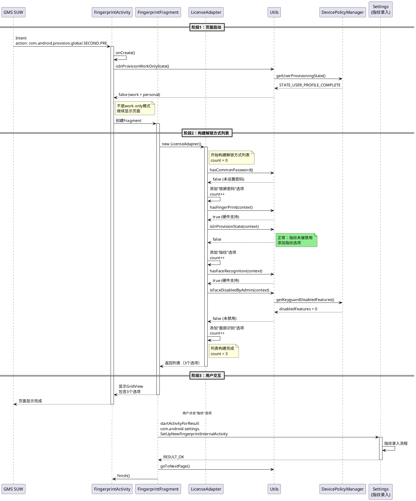
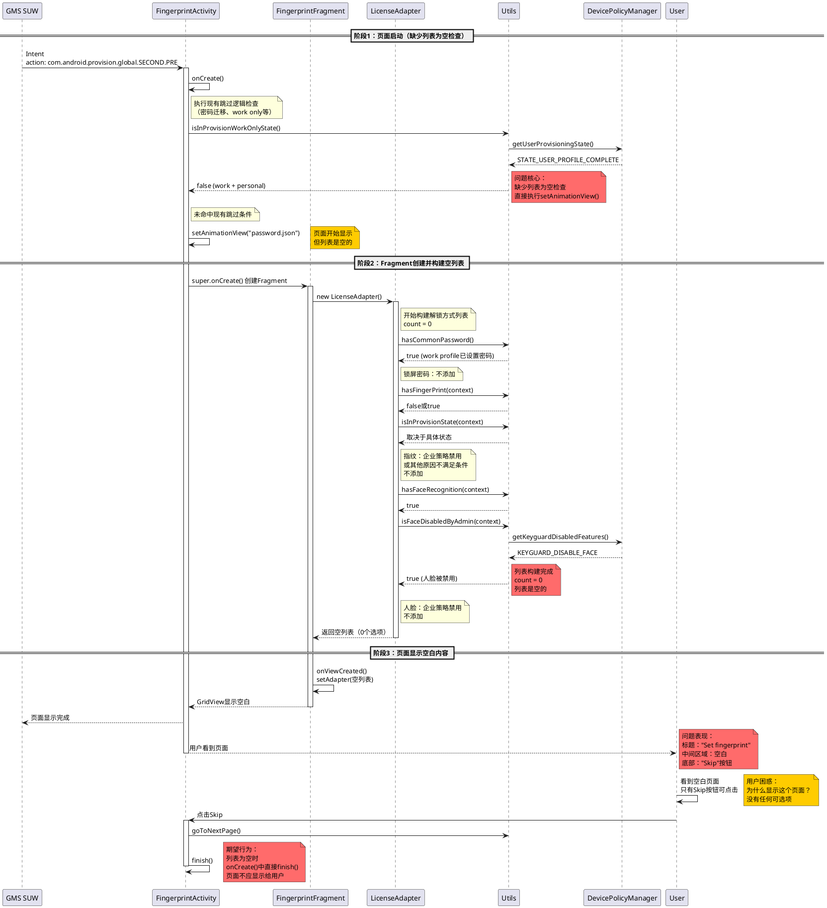
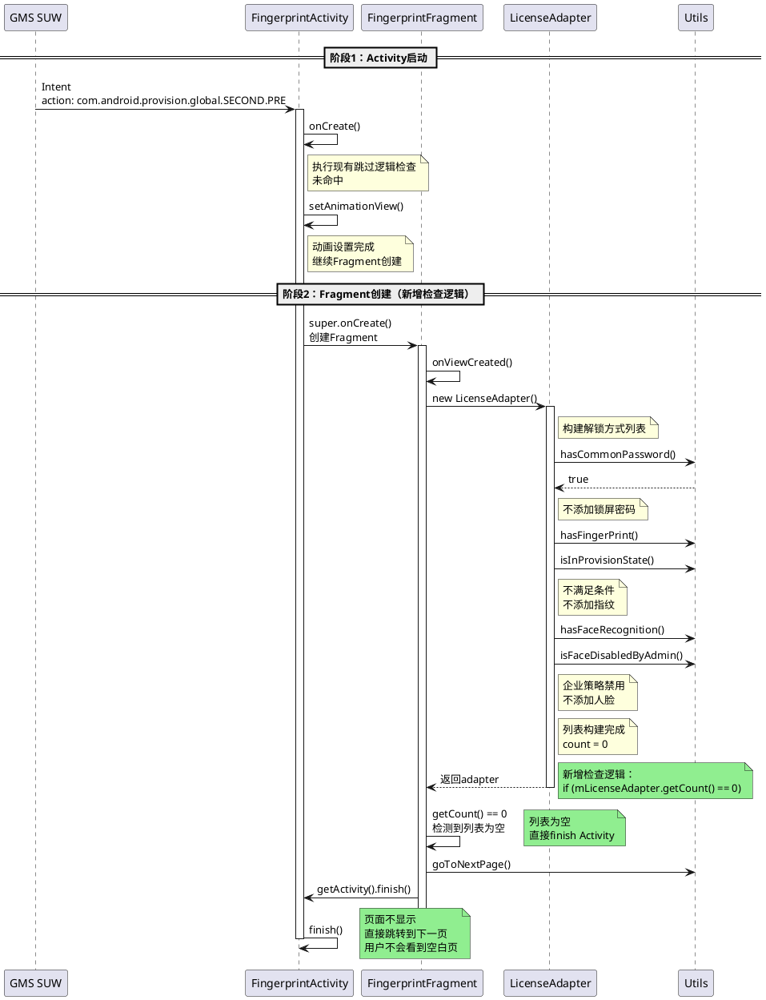

# BUGOS2-710132 SUW指纹页面仅显示跳过按钮问题分析

## 关键结论摘要

### 问题本质（根据截图确认）
FingerprintActivity是一个**解锁方式列表选择页面**，显示可用的解锁方式（锁屏密码、指纹、人脸识别）供用户选择。

**问题场景**（企业设备管理）：
1. 用户已设置密码 → 不需要"锁屏密码"选项
2. 指纹被企业策略禁用 → 不显示"指纹"选项  
3. 人脸被企业策略禁用 → 不显示"人脸"选项

**实际情况**（从截图确认）：
- 列表**确实是空的**（mPassworkTypeMap.size() = 0）✅
- 界面上**没有显示任何选项** ✅
- 但是**页面仍然显示了**（❌ 这是问题）
- 用户只能看到标题"Set fingerprint"和Skip按钮

**期望结果**：
- 当列表为空时，页面**不应该显示**（直接跳过）

**根本问题**：FingerprintActivity缺少"列表为空"的前置检查。即使列表为空（没有可用选项），Activity仍然显示了页面，导致用户看到一个空白页面只有Skip按钮。

### 根本原因

#### Activity层缺少列表为空检查（核心问题）

**FingerprintActivity.onCreate()** 的现有代码（60-92行）：

```java
@Override
protected void onCreate(Bundle savedInstanceState) {
    super.onCreate(savedInstanceState);
    
    // ... 密码迁移逻辑 ...
    
    // 现有的跳过逻辑（81-86行）
    if (Build.IS_INTERNATIONAL_BUILD && (!DefaultPreferenceHelper.isTransferPassword() && MiuiSettings.Secure.hasCommonPassword(this))
            || Utils.isInProvisionWorkOnlyState(this) 
            || (DefaultPreferenceHelper.isTransferPassword() && (Utils.hasEnrolledFace(this) || Utils.hasEnrolledFinger(this)))) {
        Utils.goToNextPage(this, this.getIntent(), -1);
        finish();
        return;
    }
    
    // ❌ 缺失：没有检查列表是否为空
    // 直接执行动画和显示页面
    setAnimationView("password.json");
    if (Build.IS_INTERNATIONAL_BUILD){
        Utils.FINGER_PRINT_POINT = this;
    }
}
```

**问题所在**：
- onCreate()中有密码迁移、work only等场景的跳过逻辑
- **但没有检查解锁方式列表是否为空**
- 当列表为空时（所有选项都不可用），页面仍然正常执行并显示

#### 本问题场景的列表状态（根据截图确认）

在本问题的企业设备管理场景下：

| 解锁方式 | 状态 | 列表中的结果 |
|---------|------|------------|
| 锁屏密码 | work profile已设置密码 | 不需要添加 |
| 指纹 | 企业策略禁用（allowed=false） | 不添加 |
| 人脸 | 企业策略禁用 | 不添加 |

**最终结果**（截图验证）：
- `mPassworkTypeMap.size() = 0` ✅ **列表是空的**
- 界面中间区域空白，没有任何选项 ✅
- 但是**FingerprintActivity页面显示了** ❌

**根本问题**：
1. 列表构建逻辑本身可能是正确的（列表确实为空）
2. **核心缺陷**：FingerprintActivity.onCreate()缺少"列表为空"检查
3. 即使列表为空（0个可用选项），页面仍然显示
4. **期望行为**：当列表为空时，应该直接finish()跳过该页面，不显示给用户

### 技术要点
- **界面性质**: 解锁方式列表选择页面（不是单纯的指纹设置页面）
- **列表内容**: 可能包含锁屏密码、指纹、人脸识别三种选项
- **显示条件**: 列表不为空时才应该显示页面（**当前缺失此检查**）
- **流程**: 新Global OOBE（SDK >= 24）由GMS SUW主导，通过Intent action `com.android.provision.global.SECOND.PRE`调用FingerprintActivity
- **策略状态**: 日志显示`allowed=false`，指纹被企业策略禁用
- **列表状态**: 列表为空（size = 0），没有可用的解锁方式选项

### 解决方案（核心修复）

**方案：在Fragment构建列表时检查，列表为空则finish Activity**

在`FingerprintFragment.java`的`onViewCreated()`中，第72行创建adapter后立即检查：

**修改位置**：`src/com/android/provision/fragment/FingerprintFragment.java` 第72-107行之间

```java
@Override
public void onViewCreated(View view, Bundle savedInstanceState) {
    super.onViewCreated(view, savedInstanceState);

    mLicenseAdapter = new LicenseAdapter();  // 第72行：创建adapter
    if (getActivity() == null) {
        return;
    }
    
    // ========== 新增代码开始 ==========
    // 检查列表是否为空，如果为空直接跳过页面
    if (mLicenseAdapter.getCount() == 0) {
        Log.i(TAG, "No unlock options available, skip FingerprintActivity");
        Utils.goToNextPage(getActivity(), getActivity().getIntent(), -1);
        getActivity().finish();
        return;
    }
    // ========== 新增代码结束 ==========

    Button nextButton = Utils.getNextView(getActivity());
    Button skipButton = Utils.getSkipView(getActivity());
    
    // ... 后续代码保持不变 ...
    
    // 第101-107行：设置adapter
    if (mLicenseAdapter.getCount() == Utils.THREE_LOCKSCREEN_METHOD || mLicenseAdapter.getCount() == Utils.TWO_GRIDVIEW_ITEM) {
        mLockItemGridView.setNumColumns(Utils.ONE_GRIDVIEW_COLUMN);
    } else {
        mLockItemGridView.setNumColumns(mLicenseAdapter.getCount());
    }
    mLockItemGridView.setAdapter(mLicenseAdapter);
}
```

**修改说明**：
1. **位置**：在第72行创建adapter后，第77行`Button nextButton = Utils.getNextView(getActivity())`之前插入检查逻辑
2. **逻辑**：检查`mLicenseAdapter.getCount()`，如果为0则finish
3. **好处**：列表为空时，后续的UI设置代码（77-107行）都不会执行，页面直接跳过

**修改影响**：
- 仅修改`FingerprintFragment.java`一个文件
- 新增5行代码（含注释）
- 不影响列表不为空的正常流程

---

## 第一阶段：信息收集

### 基本信息
- **Jira单号**: BUGOS2-710132
- **问题标题**: 【谷歌试用】【P3_W_Global】SUW - "Set Fingerprint" page's only option is to Skip. SUW - "设置指纹"页面唯一可选的操作是"跳过"
- **问题类型**: 缺陷（故障）
- **优先级**: 严重
- **状态**: 开放
- **创建时间**: 2025-09-26 14:05
- **最后更新**: 2025-10-20 16:20

### 设备信息
- **机型**: P3 (pudding)
- **平台**: PEP_W, Xiaomi16_HTM
- **ROM版本**: OS3.0.0.4.WPCMIXM (影响版本)
- **当前测试版本**: OS3.0.0.12.WPCMIXM (日志版本)
- **Android版本**: 16.0
- **MIUI Model**: P3_global
- **Build指纹**: Xiaomi/pudding_global/pudding:16/BP2A.250605.031.A3/OS3.0.0.12.WPCMIXM:user/release-keys

### 问题信息
- **组件**: 开机引导 Provision
- **复现概率**: 必现 (Every time)
- **测试阶段**: 试用阶段
- **分类类型**: w-stable
- **Bug分类**: 功能 Functionality
- **Device ID**: P2

### 问题描述
**中文描述**：
SUW中出现了"设置指纹"（Set fingerprint）页面，但用户无法添加指纹，页面只显示一个"跳过"（Skip）按钮。既然不允许录入指纹却仍显示该页面，造成用户困惑。

**英文原文**：
"Set fingerprint" page is in SUW, but cannot add fingerprint because the only option is to Skip. This is a confusing page in SUW since it doesn't let the user to enroll fingerprint but it is still added in the SUW.

**界面分析**：
根据代码和界面截图，这个页面实际上是**解锁方式选择页面**，显示可用的解锁方式列表（GridView），可能包含：
- 锁屏密码（Screen lock）
- 指纹（Fingerprint）
- 人脸识别（Face unlock）

问题场景下，指纹被企业策略禁用，但仍然显示在列表中，用户点击后无法实际录入。

### 复现步骤
1. 在欢迎界面连续点击6次，进入工作资料设置流程
2. 按提示完成工作资料配置
3. 添加个人账号，继续进行到设备备份步骤
4. 点击"恢复数据"的下一步后，"设置指纹"页面出现
5. 观察发现页面只有"跳过"选项，用户无法录入指纹

### 预期结果
如果企业设备策略不允许指纹解锁，在SUW期间不应该显示指纹设置页面，应该直接跳过该页面并跳转到下一个页面。

### 实际结果
显示了指纹设置页面，但页面只有"跳过"按钮，用户无法录入指纹，造成用户困惑。

### 相关链接
- **谷歌原单**: https://partnerissuetracker.corp.google.com/issues/447339368
- **提效工具日志**: https://cnbj1-fds.api.xiaomi.net/jira-logs/MUT-460560.zip
- **相关问题**: b/369455027 (之前的dogfood设备上同样的问题)

### 评论摘要
**朱昭颖 (Google测试人员) - 2025-09-26 14:07**:
> Hi Xiaomi team, it's expected that our corp device policy doesn't allow face unlock on this device (same as previous dogfood device: b/369455027), but during setup it shouldn't show this page that only has a "Skip" button, instead it should directly skip this page and jump to next one.

**关键要点**：
- 企业设备策略不允许指纹/面部解锁
- 在此策略下，不应该显示只有"跳过"按钮的页面
- 应该完全跳过该页面

### 日志信息
- **日志文件**: bugreport-pudding_global-BP2A.250605.031.A3-2025-10-21-13-53-40.txt
- **日志时间**: 2025-10-21 13:53:40
- **日志类型**: bugreport (SUW完成后补抓)
- **说明**: 由于SUW期间无法抓取bugreport，此日志为问题复现后补抓，但问题必现，日志应能反映问题状态

---

## 第二阶段：文档声明

本文档是BUGOS2-710132问题的唯一分析文档。
- 文档创建时间：2025-10-21
- 分析人员：李新
- 文档版本：唯一版本（不存在v2、final等多版本）
- 所有后续分析、更新、根因、方案均在本文档中维护

---

## 第三阶段：流程确认

### 3.1 GMS SUW流程确认

根据日志和代码分析，本问题涉及的是**新Global OOBE流程**：

#### 判断条件
```java
public static boolean isNewGlobalOOBE() {
    return miui.os.Build.IS_INTERNATIONAL_BUILD && miui.os.Build.VERSION.SDK_INT >= 24;
}
```

当前设备P3满足条件（国际版、SDK >= 24），使用新流程。

#### 新旧流程差异

**旧流程（SDK < 24）**：
- Provision主导流程控制
- 在DefaultActivity中明确添加fingerprintState到流程链
- 流程：...findDeviceState → fingerprintState → aiButtonState...

**新流程（SDK >= 24）**：
- GMS SUW（Google Setup Wizard）主导流程控制
- Provision不主动添加fingerprintState到流程
- GMS SUW通过Intent Filter调用Provision的FingerprintActivity

#### GMS SUW如何调用FingerprintActivity

**代码证据** - 在`global/AndroidManifest.xml`第184-193行配置：

```xml
<activity android:name=".activities.FingerprintActivity"
          android:excludeFromRecents="true"
          android:exported="true"
          android:screenOrientation="portrait">
    <intent-filter>
        <action android:name="com.android.provision.global.SECOND.PRE" />
        <category android:name="android.intent.category.DEFAULT" />
    </intent-filter>
</activity>
```

**日志证据** - bugreport第499992行，ActivityTaskManager日志：

```
10-21 13:52:22.018 I ActivityTaskManager: START u0 {
  act=com.android.provision.global.SECOND.PRE 
  pkg=com.android.provision 
  cmp=com.android.provision/.activities.FingerprintActivity 
} from uid 10281 
  callingPackage com.google.android.setupwizard
```

**关键点**：
- `android:exported="true"`：允许外部应用调用
- Intent Action：`com.android.provision.global.SECOND.PRE`
- 调用者：`com.google.android.setupwizard` (uid 10281)
- GMS SUW在work profile设置完成后，通过这个action调用FingerprintActivity

### 3.2 日志时间说明

由于本问题发生在SUW（开机引导）期间，系统处于首次配置状态：
1. 设备第一次开机，可能未联网
2. 系统时间未同步，日志时间戳可能不准确（这是开机引导场景的正常现象）
3. 无法实时抓取bugreport（问题描述中说明："Cannot capture bug report during SUW"）

- **问题首次报告时间**: 2025-09-26 14:05
- **当前日志采集时间**: 2025-10-21 13:53:40
- **日志状态**: SUW完成后补抓的bugreport
- **复现概率**: 必现（Every time）

由于问题必现，后续复现日志能够反映相同的问题状态和系统行为。日志中可以看到FingerprintActivity的启动记录和指纹策略状态（`allowed=false`），这足以支持问题分析。

---

## 第四阶段：日志分析

### 4.1 时间验证与说明

由于本问题发生在SUW（开机引导）期间，系统处于首次配置状态：
1. 设备第一次开机，可能未联网
2. 系统时间未同步，日志时间戳可能不准确（这是开机引导场景的正常现象）
3. 无法实时抓取bugreport（问题描述中说明："Cannot capture bug report during SUW"）

- **问题首次报告时间**: 2025-09-26 14:05
- **当前日志采集时间**: 2025-10-21 13:53:40
- **日志状态**: SUW完成后补抓的bugreport
- **复现概率**: 必现（Every time）

由于问题必现，后续复现日志能够反映相同的问题状态和系统行为。日志中可以看到FingerprintActivity的启动记录和指纹策略状态（`allowed=false`），这足以支持问题分析。

### 4.2 GMS SUW调用证据

**关键日志（第499992行）**：
```
10-21 13:52:22.018  1000  3860  3972 I ActivityTaskManager: 
START u0 {
  act=com.android.provision.global.SECOND.PRE 
  flg=0x4000000 xflg=0x4 
  pkg=com.android.provision 
  cmp=com.android.provision/.activities.FingerprintActivity 
  (has extras)
} with LAUNCH_MULTIPLE 
from uid 10281 
from pid 8940 
callingPackage com.google.android.setupwizard 
result code=0
```

证实了：
1. GMS SUW（com.google.android.setupwizard, uid 10281）是调用者
2. 使用Intent action: `com.android.provision.global.SECOND.PRE`
3. 目标是FingerprintActivity

### 4.3 关键发现

基于日志分析，发现以下关键信息：

#### 1. 指纹策略状态
```
Fingerprint state (user=0)
  isFingerprintClass3=true
  areAllFpAuthenticatorsRegistered=true
  allowed=false                           // 企业策略不允许指纹
  mFingerprintLockedOut=false
  mFingerprintLockedOutPermanent=false
```

**关键点**: `allowed=false` 表明企业设备策略不允许使用指纹功能。

#### 2. FingerprintActivity启动记录
```
10-21 13:52:22.009  1000  3860  3972 D WindowManager: Collecting in transition 43: 
  ActivityRecord{120476956 u0 com.android.provision/.activities.FingerprintActivity init 
  visibleRequested:false dc:null
```

**关键点**: 尽管`allowed=false`，FingerprintActivity仍然被启动并显示。

### 4.4 日志时间线分析（聚焦问题核心）

```log
━━━━━━━━━━━━ 阶段1：Activity启动（13:52:22.018）━━━━━━━━━━━━

10-21 13:52:22.018  1000  3860  3972 I ActivityTaskManager: START u0 {
  act=com.android.provision.global.SECOND.PRE 
  cmp=com.android.provision/.activities.FingerprintActivity 
} from uid 10281 
callingPackage com.google.android.setupwizard
        GMS SUW调用FingerprintActivity

10-21 13:52:22.009  1000  3860  3972 D WindowManager: Collecting in transition 43: ActivityRecord{120476956 u0 com.android.provision/.activities.FingerprintActivity init visibleRequested:false
        Activity开始创建

━━━━━━━━━━━━ 阶段2：列表状态（截图验证）━━━━━━━━━━━━

        【截图显示】界面内容：
        - 标题："Set fingerprint"
        - 中间区域：空白（没有任何选项）
        - 底部："Skip"按钮
        
        【代码逻辑推断】
        mPassworkTypeMap.size() = 0
        列表是空的，没有可用的解锁方式选项
        
        （为什么列表为空？可能是：
         - 锁屏密码已设置 → 不添加密码选项
         - 指纹不可用 → 不添加指纹选项
         - 人脸不可用 → 不添加人脸选项）

━━━━━━━━━━━━ 阶段3：页面错误显示（13:52:22.015）【问题所在】━━━━━━━━━━━━

10-21 13:52:22.015  1000  3860  3972 D WindowManager: Collecting in transition 43: ActivityRecord{120476956 u0 com.android.provision/.activities.FingerprintActivity t2} init visibleRequested:true dc:Display{#0 state=ON size=1220x2656 ROTATION_0}
        【问题】visibleRequested变为true，页面开始显示
        
        【代码执行推断】
        FingerprintActivity.onCreate():
          1. 检查现有跳过条件（密码迁移、work only等）
          2. 未命中 → 继续执行
          3. ❌ 缺失：没有检查列表是否为空
          4. 执行setAnimationView("password.json")
          5. 页面正常显示
        
        【问题】即使列表为空，页面仍然显示了

10-21 13:52:30.246  [InputMethodManager] StartInput reason=WINDOW_FOCUS_GAIN
      targetWin=android.os.BinderProxy@10c7fb9 [com.android.provision]
        页面获得焦点，等待用户操作
        
        【期望】
        列表为空时，onCreate()应该检测到并直接finish()
        页面不应该显示给用户
```

### 4.5 关键发现（问题本质）

**核心事实**：
1. **列表确实是空的** - mPassworkTypeMap.size() = 0（截图验证）
2. **页面仍然显示了** - FingerprintActivity正常启动并显示
3. **用户体验差** - 只能看到空白页面和Skip按钮

**代码缺陷**：
- FingerprintActivity.onCreate()缺少"列表为空"的检查
- 即使没有任何可用的解锁方式，页面仍然正常显示流程

**期望行为**：
- onCreate()中应该检查列表是否为空
- 如果为空（size == 0），直接调用finish()跳过该页面
- 用户不会看到这个空白页面

**为什么列表为空？**
- 这不重要！可能是企业策略、硬件不支持、或其他任何原因
- **重点是**：无论什么原因导致列表为空，页面都不应该显示

---

## 第五阶段：问题范围分析

### 归属判断

**问题归属**: 属于Provision模块

**判断依据**:
1. 问题发生在 `com.android.provision/.activities.FingerprintActivity`
2. 该Activity属于Provision应用的SUW流程
3. 问题涉及SUW页面跳转逻辑和企业策略检查
4. 代码路径在本模块：`src/com/android/provision/activities/FingerprintActivity.java`

### 责任范围

- **主要责任**: Provision模块
- **涉及模块**: 
  - BiometricManager (提供指纹可用性查询API)
  - DevicePolicyManager (提供企业策略信息)
- **修复位置**: `FingerprintActivity.java` 或 SUW流程控制类

---

## 第六阶段：根因与解决方案

### 代码分析

#### 1. FingerprintActivity的界面本质

FingerprintActivity是一个**解锁方式列表选择页面**，显示可用的解锁方式供用户选择：

```java
// FingerprintActivity.java
@Override
protected Fragment getFragment() {
    return new FingerprintFragment();  // 包含解锁方式列表GridView
}

@Override
protected int getTitleStringId() {
    // 根据可用功能返回标题
    if (Utils.isFaceDisabledByAdmin(this) && MiuiSettings.Secure.hasCommonPassword(this)) {
        return R.string.title_only_fingerprint;  // "Set fingerprint"
    }
    // ... 其他情况
}
```

页面包含一个GridView列表（mLockItemGridView），显示可用的解锁方式选项。

#### 2. FingerprintActivity的onCreate()缺陷（核心问题）

**FingerprintActivity.java的onCreate()方法**（60-92行）：

```java
@Override
protected void onCreate(Bundle savedInstanceState) {
    super.onCreate(savedInstanceState);
    
    // 密码迁移逻辑标记
    if (!DefaultPreferenceHelper.isExecuteOncePasswordPage()) {
        if (MiuiSettings.Secure.hasCommonPassword(this)) {
            DefaultPreferenceHelper.setFirstEntryPasswordPage(true);
        }
        DefaultPreferenceHelper.setExecuteOncePasswordPage(true);
    }
    
    if (!DefaultPreferenceHelper.isTransferPassword()) {
        if (Build.IS_INTERNATIONAL_BUILD && MiuiSettings.Secure.hasCommonPassword(this) && DefaultPreferenceHelper.isFirstEntryPasswordPage()) {
            DefaultPreferenceHelper.setTransferPassword(true);
        }
    }
    
    // 现有的跳过逻辑（81-86行）
    if (Build.IS_INTERNATIONAL_BUILD && (!DefaultPreferenceHelper.isTransferPassword() && MiuiSettings.Secure.hasCommonPassword(this))
            || Utils.isInProvisionWorkOnlyState(this) 
            || (DefaultPreferenceHelper.isTransferPassword() && (Utils.hasEnrolledFace(this) || Utils.hasEnrolledFinger(this)))) {
        Utils.goToNextPage(this, this.getIntent(), -1);
        finish();
        return;
    }
    
    // ❌ 缺失：没有检查列表是否为空
    
    // 直接执行后续逻辑
    setAnimationView("password.json");
    if (Build.IS_INTERNATIONAL_BUILD){
        Utils.FINGER_PRINT_POINT = this;
    }
}
```

**现有跳过逻辑检查的场景**：
1. 国际版 + 非密码迁移 + 已设置密码 → 跳过
2. work only状态 → 跳过  
3. 密码迁移成功 + 已录入指纹或人脸 → 跳过

**缺失的检查**：
- **没有检查解锁方式列表是否为空**
- 即使所有解锁选项都不可用（列表为空），仍然执行setAnimationView()并显示页面

#### 3. 列表构建逻辑（参考）

在本问题场景下，FingerprintFragment.LicenseAdapter构建的列表为空：

| 解锁方式 | 判断条件 | 本场景结果 |
|---------|---------|-----------|
| 锁屏密码 | `!hasCommonPassword()` | 已设置密码 → 不添加 |
| 指纹 | `hasFinger && !isInProvisionState()` | 企业策略禁用 → 不添加 |
| 人脸 | `hasFace && !isInProvisionState() && !isFaceDisabledByAdmin()` | 企业策略禁用 → 不添加 |

**最终结果**：
- `mPassworkTypeMap.size() = 0`（列表为空）
- 但FingerprintActivity没有检查这一点，仍然显示了页面

### 根本原因总结

**核心原因**：FingerprintActivity.onCreate()缺少对解锁方式列表的前置检查。

#### 问题链路

```
GMS SUW调用FingerprintActivity
    ↓
onCreate()执行
    ↓
检查现有跳过条件（密码迁移、work only等）
    ↓ 未命中
❌ 缺失：没有检查列表是否为空
    ↓
执行setAnimationView("password.json")
    ↓
页面显示
    ↓
Fragment.onViewCreated()
    ↓
LicenseAdapter构建列表 → size = 0
    ↓
GridView显示空列表
    ↓
用户看到：标题 + 空白区域 + Skip按钮
```

**期望行为**：
```
GMS SUW调用FingerprintActivity
    ↓
onCreate()执行
    ↓
检查现有跳过条件
    ↓ 未命中
✅ 新增：检查列表是否为空
    ↓ 列表为空
finish() & goToNextPage()
    ↓
页面不显示，直接跳到下一页
```

### 解决方案

#### 核心问题确认

**截图显示**：列表是空的（没有任何选项），但页面仍然显示。

**根本原因**：FingerprintFragment在列表构建后，没有检查列表是否为空就直接设置了adapter并显示页面。

**解决思路**：在Fragment的`onViewCreated()`中，adapter创建后立即检查`getCount()`，如果为0则直接finish Activity。

### 修改文件列表

**核心方案（必须实施）**：

1. **`src/com/android/provision/fragment/FingerprintFragment.java`**
   - 修改位置：`onViewCreated()`方法，第72行之后
   - 修改内容：adapter创建后检查`getCount()`，为0则finish Activity
   - 影响范围：仅此一个文件，新增5行代码

---

## 第七阶段：PlantUML流程时序图

### 正常流程（指纹未被企业策略禁用）



### 异常流程（列表为空但页面仍显示 - 当前问题）



### 修复后流程（在Fragment中检查列表是否为空）



---

## 第八阶段：测试验证

### 测试环境要求
- 设备：P3 (pudding) 国际版
- 版本：OS3.0.0.12.WPCMIXM 或更高版本
- 测试场景：企业设备管理（EMM）+ Work Profile设置

### 测试步骤

#### 测试用例1：企业策略禁用指纹
1. 工厂重置设备
2. 开机进入GMS SUW流程
3. 连续点击欢迎界面6次，进入Work Profile设置
4. 配置企业设备策略，禁用指纹（KEYGUARD_DISABLE_FINGERPRINT）
5. 继续SUW流程，观察指纹设置页面

**预期结果**：
- **修复前**：可能显示FingerprintActivity页面（取决于列表是否为空）
- **修复后**：如果列表为空，直接跳过；如果列表不为空，正常显示

#### 测试用例2：企业策略允许指纹
1. 工厂重置设备
2. 开机进入GMS SUW流程
3. 连续点击欢迎界面6次，进入Work Profile设置
4. 配置企业设备策略，允许指纹
5. 继续SUW流程，观察指纹设置页面

**预期结果**：
- **修复前后一致**：显示FingerprintActivity页面，列表包含可用的解锁方式选项
- 用户可以正常选择并录入指纹

#### 测试用例3：列表为空场景（核心测试场景）
**条件**：work profile已设置密码，所有解锁方式都不可用

**测试步骤**：
1. 工厂重置设备
2. 开机进入GMS SUW流程
3. 连续点击欢迎界面6次，进入Work Profile设置
4. 设置Work Profile密码
5. 配置企业策略，同时禁用指纹和面部（KEYGUARD_DISABLE_FINGERPRINT | KEYGUARD_DISABLE_FACE）
6. 继续SUW流程，观察FingerprintActivity是否显示

**预期结果**：
- **修复前**：显示FingerprintActivity页面，列表为空（mPassworkTypeMap.size()=0），只显示标题"Set fingerprint"和Skip按钮
- **修复后**：FingerprintActivity检测到列表为空，直接调用finish()跳过，不显示页面

### 验证命令

```bash
# 检查设备是否被企业管理
adb shell dumpsys device_policy | grep -A 5 "Device Owner"

# 检查指纹是否被禁用
adb shell dumpsys device_policy | grep -i keyguard

# 检查provision状态
adb shell settings get global device_provisioned
adb shell settings get secure user_setup_complete
```

---

## 第九阶段：修复效果

(待实际修复后补充)

### 修复后验证点
1. 企业策略禁用指纹时，FingerprintActivity应直接跳过
2. 不再显示只有"跳过"按钮的混淆界面
3. 与Google SUW的预期行为一致
4. 不影响正常场景下的指纹设置流程

---

## 第十阶段：相关文件

### 关键代码文件
- `src/com/android/provision/activities/FingerprintActivity.java`
- `src/com/android/provision/activities/BaseActivity.java`
- SUW流程配置文件（待确认具体文件）

### 相关文档
- `/docs/BUGOS2-710132_SUW指纹页面跳转逻辑详解.md` (之前的分析文档)

---

## 元数据

- **分析人员**: 李新
- **分析时间**: 2025-10-21
- **文档版本**: 1.0 (唯一版本)
- **最后更新**: 2025-10-21
