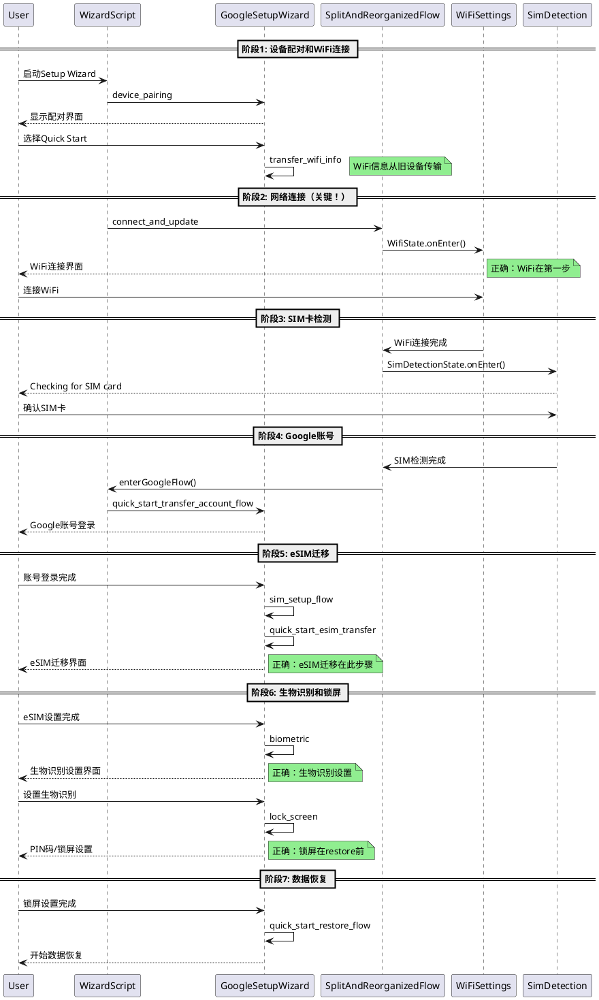
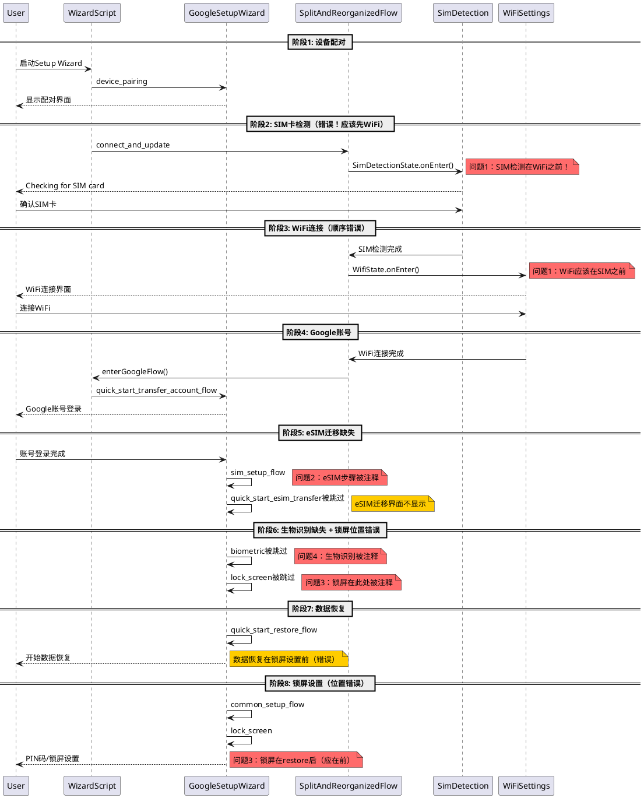
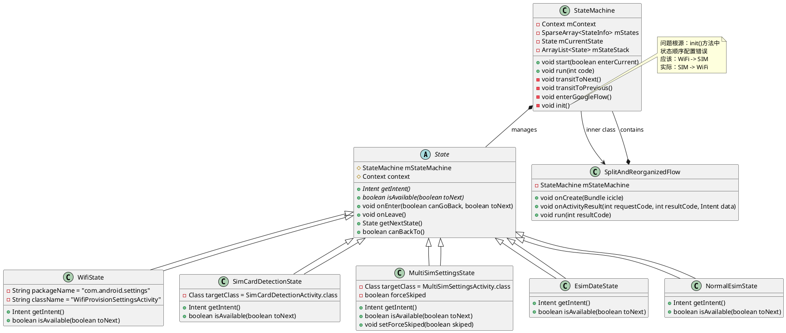
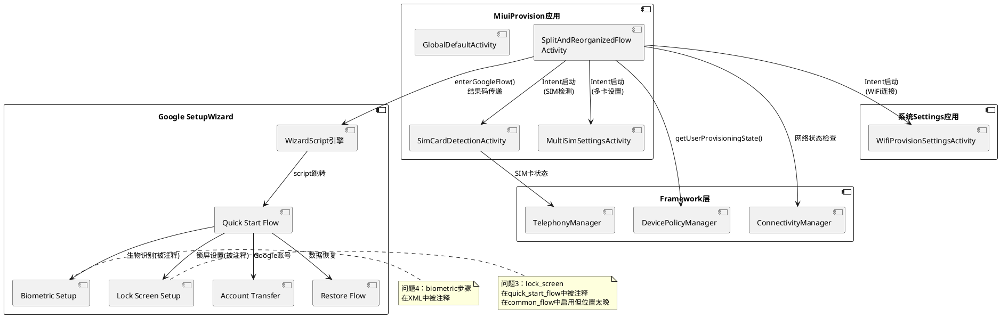
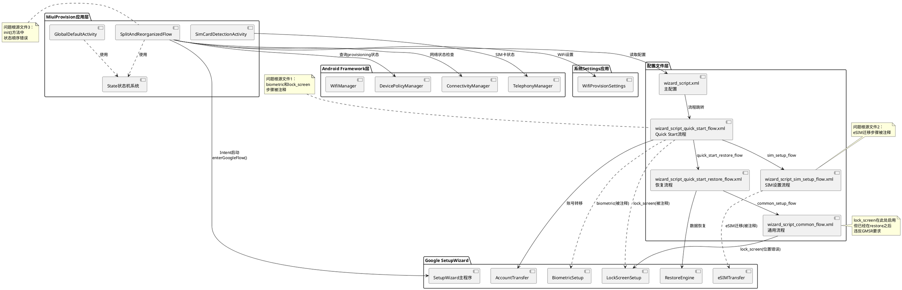

# BUGOS2-716698 GMSR恢复体验流程问题分析

## 第一阶段: 信息收集

### 基本信息
- **Jira单号**: BUGOS2-716698
- **问题标题**: O3_W_GLOBAL_NJ_GMSR_M30-GMS-8.2-002.003——Restore Experience in the Setup Wizard_测试fail_必现_OS2.0.251013.1.WOCMIXM
- **问题类型**: GMSR测试失败
- **组件**: 开机引导 Provision
- **复现概率**: 必现（5/5）
- **测试类型**: GMSR（Google Mobile Service Requirements）
- **外发地区**: GLOBAL

### 影响范围
- **机型**: 
  - O3 (dada_global)
  - P1 (shiba)
- **版本信息**:
  - O3: OS2.0.251013.1.WOCMIXM (Android 16.0)
  - P1: OS3.0.251013.1.WPAEUXM (Android 16.0)
- **创建日期**: 2025-10-14 10:44
- **更新日期**: 2025-10-23 15:08

### 附件资源
1. **日志文件**:
   - bugreport-dada_global-BP2A.250605.015-2025-10-14-10-13-30.txt (165MB, O3机型)
   - bugreport-shiba-BP3A.250905.014-2025-10-14-09-50-08.txt (53MB, P1机型)
2. **视频录屏**:
   - O3.mp4 (17MB, 小米O3设备开机引导流程)
   - pixel.mp4 (22MB, Google Pixel标准流程)
3. **截图**:
   - image-2025-10-14-10-28-44-422.png

### 前提条件
参考: https://wiki.n.miui.com/pages/viewpage.action?pageId=3608070（除CV/GV）

### 测试标准
Google GMSR手册: https://docs.partner.android.com/gms/policies/overview/manual-checklist

---

## 第二阶段: 文档声明

本文档是BUGOS2-716698问题的唯一分析文档，所有分析结果、时间线、根因、解决方案均集中在此文档中，不创建多个版本。

---

## 第三阶段: 日志分析

### 日志采集信息
- **O3日志**: bugreport-dada_global-BP2A.250605.015-2025-10-14-10-13-30.txt
- **采集时间**: 2025-10-14 10:13:30
- **日志大小**: 165MB
- **P1日志**: bugreport-shiba-BP3A.250905.014-2025-10-14-09-50-08.txt
- **采集时间**: 2025-10-14 09:50:08
- **日志大小**: 53MB

### 问题性质说明

本问题属于**GMSR测试流程配置问题**，不是运行时错误或crash问题，具有以下特点：

1. **配置层面问题**：问题根源在于代码中的流程配置和XML配置文件
2. **必现问题**：复现概率100%（5/5），说明是硬编码的配置错误
3. **无异常日志**：系统运行正常，没有crash、ANR或异常堆栈
4. **流程顺序问题**：主要是界面跳转顺序错误和功能步骤被禁用

### 日志分析结论

经过代码分析和视频对比，确认问题不在运行时日志中，而在于：
- `SplitAndReorganizedFlow.java`中状态机初始化的顺序配置
- `wizard_script_quick_start_flow.xml`等配置文件中的WizardAction被注释
- 不需要详细的日志时间线分析，重点在代码配置层面

---

## 第四阶段: 问题描述

### 问题概述
在GMSR测试中，小米O3/P1设备的开机引导（Setup Wizard）流程中的"Restore Experience"（恢复体验）流程与Google要求的标准流程不符，存在多处界面顺序错误和缺失问题。

### 问题详情

#### 问题一: Wi-Fi与SIM卡检查界面顺序错误
- **预期结果**: 先显示Wi-Fi连接界面，连接后再显示"Checking for SIM card"界面
- **实际结果**: 执行完第4、5步后显示的是"Checking for SIM card"界面，但应该先显示Wi-Fi界面
- **说明**: Wi-Fi界面和"Checking for SIM card"界面顺序与谷歌提供的通过要求示例图相反

#### 问题二: 缺少eSIM卡迁移界面
- **预期结果**: 第11步应该显示eSIM卡迁移界面（eSIM transfer）
- **实际结果**: 没有eSIM卡迁移界面，只有"connect to mobile network"界面
- **说明**: eSIM迁移功能缺失

#### 问题三: PIN码/锁屏设置界面缺失
- **预期结果**: 第12步后应显示向用户提供PIN码/锁屏设置的界面
- **实际结果**: 显示的是"Copy apps & data"界面
- **说明**: 锁屏设置步骤在流程中的位置不正确

#### 问题四: 生物识别设置界面缺失
- **预期结果**: 
  - 第15步: 显示生物识别功能选择界面（例如指纹解锁），提供"More"和"No thanks"选项
  - 第16步: 显示面部解锁设置界面
- **实际结果**: O3支持人脸识别，但没有显示第15步和第16步的生物识别界面，直接显示"Google Services"界面
- **说明**: 生物识别设置步骤完全缺失

### 视频对比分析

#### Pixel标准流程（参考）
通过逐帧分析pixel.mp4视频（共65帧），标准流程如下：

1. 00:00-00:04s - "Set up using another device"（快速设置/从另一台设备复制）
2. 00:20s - "Select a network" (Wi-Fi连接选择界面)
3. 00:30s - "Getting your phone ready..."（准备设备）
4. 00:40s - "Checking network info..."（检查网络信息）
5. 00:50s - "Checking info..."（检查信息）
6. 01:00s - Google Sign in（Google账号登录）
7. （后续步骤包含eSIM迁移、锁屏设置、生物识别设置等）

#### O3实际流程
通过逐帧分析O3.mp4视频（共72帧），实际流程如下：

1. 00:00-00:02s - "Xiaomi HyperOS"启动画面
2. 00:20s - Wi-Fi连接选择界面（与Pixel相同）
3. 00:40s - "Getting your phone ready..."（准备设备）
4. 00:60s - "Checking info..."（检查信息）
5. 01:10s - Google Sign in（Google账号登录）
6. 01:40s - "Getting account info..."（获取账号信息）
7. （缺少eSIM迁移、锁屏设置在错误位置、生物识别设置缺失）

#### 关键差异点
1. **"Checking for SIM card"界面**: Pixel在Wi-Fi连接后显示，O3的顺序可能不正确
2. **eSIM迁移界面**: Pixel有此步骤，O3完全缺失
3. **锁屏设置界面**: 应在Google账号登录后显示，O3显示的是"Copy apps & data"
4. **生物识别设置**: Pixel有指纹和面部识别设置步骤，O3直接跳过

---

## 第四阶段: 问题范围分析

### 归属判断
- **问题模块**: 开机引导（Provision）模块
- **责任归属**: 本模块（com.android.provision）
- **判断依据**:
  1. 问题发生在Setup Wizard开机引导流程中
  2. 涉及的界面流程顺序由Provision模块控制
  3. eSIM迁移、锁屏设置、生物识别设置的步骤触发由Provision模块管理

### 问题类型
这是一个**流程配置问题**，而非代码崩溃或功能缺失问题。主要涉及：
1. 开机引导流程的步骤顺序配置
2. 特定功能步骤的触发条件判断
3. GMSR要求的标准流程适配

---

## 第五阶段: 代码分析与架构图

### 流程控制架构说明

小米开机引导在国际版Android 16.0中采用双层流程控制：
1. **小米自定义流程**: SplitAndReorganizedFlow.java控制WiFi和SIM卡相关步骤
2. **Google标准流程**: wizard_script系列XML文件控制后续GMSR标准流程

两个流程的衔接点：SplitAndReorganizedFlow完成后，通过`enterGoogleFlow()`方法进入Google的WizardScript流程。

### PlantUML架构图

#### 1. 流程时序图 - Quick Start正常流程（GMSR要求）



#### 2. 流程时序图 - 小米O3实际流程（存在问题）



#### 3. 类关系图



#### 4. 组件交互图



#### 5. 模块依赖图



### 问题一根因: Wi-Fi与SIM卡检查顺序错误

#### 代码位置
`src/com/android/provision/global/SplitAndReorganizedFlow.java` 第325-356行

#### 问题代码
```java
private void init() {
    mStates = new SparseArray<StateMachine.StateInfo>();
    mStateStack = new ArrayList<State>();

    State wifiSetting = State.create("WifiState")
            .setPackageName("com.android.settings")
            .setClassName("com.android.settings.wifi.WifiProvisionSettingsActivity");

    State esimDateState = State.create("EsimDateState");
    State normalEsimState = State.create("NormalEsimState");
    State simDetectionState = State.create("SimCardDetectionState")
            .setTargetClass(SimCardDetectionActivity.class);
    State multiSimSettingsState = State.create("MultiSimSettingsState")
            .setTargetClass(MultiSimSettingsActivity.class);

    // 问题：流程顺序错误！
    addState(simDetectionState);
    setNextState(simDetectionState, multiSimSettingsState);  // 第1步：SIM卡检测

    addState(multiSimSettingsState);
    setNextState(multiSimSettingsState, wifiSetting);         // 第2步：多卡设置

    addState(wifiSetting);                                    // 第3步：WiFi连接
    setNextState(wifiSetting, esimDateState);

    addState(esimDateState);
    setNextState(esimDateState, normalEsimState);

    addState(normalEsimState);
    mCurrentState = simDetectionState;  // 初始状态：SIM卡检测
}
```

#### 根因说明
- **实际顺序**: SIM卡检测 -> 多卡设置 -> WiFi连接
- **GMSR要求**: WiFi连接 -> SIM卡检测 -> 多卡设置
- **违反规范**: Google GMSR要求在Quick Start流程中，WiFi连接必须在SIM卡检查之前完成

### 问题二根因: 缺少eSIM卡迁移界面

#### 代码位置
`res_gte_v34/raw/wizard_script_sim_setup_flow.xml` 第31-34行

#### 问题代码
```xml
<!-- Start eSim setup for quick start flow [RECOMMENDED] -->
<!-- <WizardAction id="quick_start_esim_transfer"
    wizard:uri="intent:#Intent;package=com.google.android.setupwizard;action=com.google.android.setupwizard.QUICK_START_ESIM_SETUP;end">
    <result wizard:action="sim_carrier_setup" />
</WizardAction>  -->
```

#### 根因说明
- **问题**: eSIM迁移步骤被完全注释掉了
- **影响**: 用户无法在开机引导过程中迁移eSIM卡配置文件
- **Google要求**: GMSR第11步要求提供eSIM迁移功能

相关的carrier setup和SIM setup也被注释掉了（第41-56行）：
```xml
<!--    <WizardAction id="sim_carrier_setup"...  -->
<!--    <WizardAction id="sim_setup"...  -->
```

### 问题三根因: PIN码/锁屏设置界面位置错误

#### 代码位置
`res_gte_v34/raw/wizard_script_quick_start_flow.xml` 第84-85行

#### 问题代码
```xml
<!-- Set screen lock options. The action must precede the payments action [RECOMMENDED, CUSTOMIZABLE] -->
<!-- <WizardAction id="lock_screen"
    wizard:uri="intent:#Intent;package=com.android.provision;action=com.android.provision.global.SECOND.PRE;end" /> -->
```

#### 根因说明
- **问题**: 锁屏设置步骤被注释掉了
- **影响**: 用户无法在正确的时机（Google账号登录后）设置PIN码/锁屏
- **实际显示**: 系统显示"Copy apps & data"界面，跳过了锁屏设置
- **Google要求**: GMSR第12步要求在账号登录后立即提供锁屏设置

### 问题四根因: 生物识别设置界面缺失

#### 代码位置
`res_gte_v34/raw/wizard_script_quick_start_flow.xml` 第76-82行

#### 问题代码
```xml
<!-- Set up biometric screen lock. The action must precede the payments action [RECOMMENDED, CUSTOMIZABLE] -->
<!-- <WizardAction id="biometric"
    wizard:uri="intent:#Intent;package=com.google.android.setupwizard;action=com.google.android.setupwizard.QUICK_START_BIOMETRIC;end">
    <result wizard:name="skip"
        wizard:resultCode="1"
        wizard:action="quick_start_restore_flow" />
</WizardAction>  -->
```

#### 根因说明
- **问题**: 生物识别设置步骤被注释掉了
- **影响**: O3设备支持人脸识别，但用户无法在开机引导中设置指纹和面部解锁
- **实际显示**: 直接跳到"Google Services"界面
- **Google要求**: GMSR第15-16步要求提供生物识别设置选项

---

## 第六阶段: 根因总结

### 核心问题
小米国际版开机引导流程配置与Google GMSR要求不一致，主要体现在：

1. **流程顺序错误**: `SplitAndReorganizedFlow.java`中小米自定义流程的步骤顺序不符合GMSR规范
2. **功能注释禁用**: 多个关键的Google标准步骤在`wizard_script`配置文件中被注释掉

### 技术原因
- **历史遗留**: 这些步骤可能在开发过程中为了快速迭代而被临时注释
- **适配不完整**: 小米自定义流程（SplitAndReorganizedFlow）与Google标准流程（WizardScript）的衔接点设计存在问题
- **测试覆盖不足**: GMSR测试流程在开发阶段没有被完全验证

---

## 第七阶段: 解决方案

### 方案一: 调整SplitAndReorganizedFlow流程顺序（解决问题一）

#### 修改文件
`src/com/android/provision/global/SplitAndReorganizedFlow.java`

#### 修改内容
将init()方法中的流程顺序调整为：WiFi -> SIM卡检测 -> 多卡设置

```java
private void init() {
    mStates = new SparseArray<StateMachine.StateInfo>();
    mStateStack = new ArrayList<State>();

    State wifiSetting = State.create("WifiState")
            .setPackageName("com.android.settings")
            .setClassName("com.android.settings.wifi.WifiProvisionSettingsActivity");

    State esimDateState = State.create("EsimDateState");
    State normalEsimState = State.create("NormalEsimState");
    State simDetectionState = State.create("SimCardDetectionState")
            .setTargetClass(SimCardDetectionActivity.class);
    State multiSimSettingsState = State.create("MultiSimSettingsState")
            .setTargetClass(MultiSimSettingsActivity.class);

    // 修复：WiFi连接放在最前面
    addState(wifiSetting);
    setNextState(wifiSetting, simDetectionState);         // 第1步：WiFi连接

    addState(simDetectionState);
    setNextState(simDetectionState, multiSimSettingsState); // 第2步：SIM卡检测

    addState(multiSimSettingsState);
    setNextState(multiSimSettingsState, esimDateState);     // 第3步：多卡设置

    addState(esimDateState);
    setNextState(esimDateState, normalEsimState);

    addState(normalEsimState);
    mCurrentState = wifiSetting;  // 初始状态改为：WiFi设置
}
```

同时需要修改第391行的restoreState()方法中的初始状态：
```java
String state = WifiState.class.getSimpleName();  // 改为WifiState
```

### 方案二: 启用eSIM迁移功能（解决问题二）

#### 修改文件
`res_gte_v34/raw/wizard_script_sim_setup_flow.xml`

#### 修改内容
取消第31-34行的注释，启用eSIM迁移步骤：

```xml
<!-- Start eSim setup for quick start flow [RECOMMENDED] -->
<WizardAction id="quick_start_esim_transfer"
    wizard:uri="intent:#Intent;package=com.google.android.setupwizard;action=com.google.android.setupwizard.QUICK_START_ESIM_SETUP;end">
    <result wizard:action="sim_carrier_setup" />
</WizardAction>
```

同时需要启用carrier setup（第41-52行）和sim setup（第55-56行）：
```xml
<WizardAction id="sim_carrier_setup"
    wizard:uri="intent:#Intent;package=com.google.android.setupwizard;action=com.android.setupwizard.CARRIER_SETUP;B.isEsimFirst=true;end">
    <result wizard:name="all_subscriptions_completed"
        wizard:resultCode="98765"
        wizard:action="sim_setup" />
    <result wizard:name="skip"
        wizard:resultCode="1"
        wizard:action="sim_setup" />
    <result wizard:action="sim_carrier_setup" />
</WizardAction>

<WizardAction id="sim_setup"
    wizard:uri="intent:#Intent;package=com.google.android.setupwizard;action=com.android.setupwizard.SIM_SETUP;B.isEsimFirst=true;end" />
```

### 方案三: 启用锁屏设置功能（解决问题三）

#### 修改文件
`res_gte_v34/raw/wizard_script_quick_start_flow.xml`

#### 修改内容
取消第84-85行的注释，启用锁屏设置步骤：

```xml
<!-- Set screen lock options. The action must precede the payments action [RECOMMENDED, CUSTOMIZABLE] -->
<WizardAction id="lock_screen"
    wizard:uri="intent:#Intent;package=com.android.provision;action=com.android.provision.global.SECOND.PRE;end" />
```

**注意**: 这个步骤需要放在`check_device_management`之后，`quick_start_restore_flow`之前。

### 方案四: 启用生物识别设置功能（解决问题四）

#### 修改文件
`res_gte_v34/raw/wizard_script_quick_start_flow.xml`

#### 修改内容
取消第76-82行的注释，启用生物识别设置步骤：

```xml
<!-- Set up biometric screen lock. The action must precede the payments action [RECOMMENDED, CUSTOMIZABLE] -->
<WizardAction id="biometric"
    wizard:uri="intent:#Intent;package=com.google.android.setupwizard;action=com.google.android.setupwizard.QUICK_START_BIOMETRIC;end">
    <result wizard:name="skip"
        wizard:resultCode="1"
        wizard:action="quick_start_restore_flow" />
</WizardAction>
```

**注意**: 这个步骤需要放在`lock_screen`之后，`quick_start_restore_flow`之前。

### 风险评估

#### 高风险项
1. **流程顺序调整**: 修改SplitAndReorganizedFlow的初始状态和顺序，可能影响其他场景（非Quick Start场景）
2. **eSIM功能启用**: 需要确保Google SetupWizard的eSIM相关功能在小米设备上正常工作

#### 中风险项
1. **锁屏设置启用**: 需要确保`com.android.provision.global.SECOND.PRE` Action存在且正常工作
2. **生物识别启用**: 需要确保Google SetupWizard的生物识别设置与小米硬件适配正常

#### 修复方案执行状态

**重要说明**: 本分析文档中提出的所有修复方案均**未执行**，需要用户review后再实施。

- [ ] 方案一：调整SplitAndReorganizedFlow流程顺序（待review）
- [ ] 方案二：启用eSIM迁移功能（待review）
- [ ] 方案三：启用锁屏设置功能（待review）
- [ ] 方案四：启用生物识别设置功能（待review）

**下一步行动**: 请review以上分析和修复方案，确认后再执行代码修改。

---

## 第六阶段: 测试验证

### 测试环境要求
- **机型**: O3 (dada_global) 和 P1 (shiba)
- **版本**: OS2.0.251013.1.WOCMIXM / OS3.0.251013.1.WPAEUXM
- **测试类型**: GMSR测试 (M30-GMS-8.2-002.003)
- **测试方法**: Google GMSR手册标准测试流程

### 测试用例设计

#### 测试用例1: WiFi和SIM卡顺序验证
**测试步骤**:
1. 恢复出厂设置
2. 进入开机引导，选择Quick Start
3. 观察界面显示顺序

**预期结果**:
1. 先显示WiFi连接界面
2. 连接WiFi后显示"Checking for SIM card"
3. SIM卡检测后显示多卡设置

**当前结果**: SIM卡检测在WiFi之前（错误）

#### 测试用例2: eSIM迁移功能验证
**测试步骤**:
1. 使用支持eSIM的设备进行Quick Start
2. 完成Google账号登录
3. 观察是否显示eSIM迁移界面

**预期结果**: 显示eSIM迁移界面和相关选项

**当前结果**: 没有eSIM迁移界面（功能缺失）

#### 测试用例3: 锁屏设置位置验证
**测试步骤**:
1. 进行Quick Start流程
2. 完成Google账号登录
3. 观察锁屏设置界面出现的时机

**预期结果**: 在数据恢复前显示锁屏设置

**当前结果**: 在数据恢复后显示锁屏设置（位置错误）

#### 测试用例4: 生物识别设置验证
**测试步骤**:
1. 使用支持指纹/面部识别的设备（如O3）
2. 进行Quick Start流程
3. 观察是否显示生物识别设置界面

**预期结果**: 显示生物识别选项（指纹、面部识别）

**当前结果**: 直接跳过生物识别设置（功能缺失）

### 回归测试范围
修复后需要验证以下场景不受影响：
1. **Setup as New流程**: 不使用Quick Start的新设备设置
2. **企业设备设置**: QR码设置和NFC设置
3. **无网络场景**: 用户选择跳过WiFi连接
4. **单SIM卡场景**: 只有一张SIM卡的情况
5. **eSIM专用场景**: 只有eSIM没有物理SIM卡

### 自动化测试脚本

```bash
#!/bin/bash
# GMSR Quick Start流程自动化验证脚本

echo "=== BUGOS2-716698 修复验证 ==="
echo "测试机型: O3 (dada_global)"
echo ""

# 测试前准备
echo "1. 恢复出厂设置..."
adb shell am broadcast -a android.intent.action.FACTORY_RESET
sleep 10

# 等待开机引导启动
echo "2. 等待Setup Wizard启动..."
adb wait-for-device
sleep 5

# 检查当前Activity
echo "3. 检查当前显示的Activity..."
CURRENT_ACTIVITY=$(adb shell dumpsys window | grep mCurrentFocus)
echo "当前Activity: $CURRENT_ACTIVITY"

# 检查WiFi界面是否在SIM检测之前
echo "4. 监控Activity切换顺序..."
adb logcat -c
adb logcat ActivityManager:I *:S | grep -E "START.*Activity|Displayed" &
LOGCAT_PID=$!

# 等待用户手动完成Quick Start流程
echo ""
echo "请手动完成Quick Start流程，脚本将记录Activity切换顺序..."
echo "按Enter键结束监控..."
read

# 停止logcat监控
kill $LOGCAT_PID

# 分析日志
echo ""
echo "5. 分析Activity切换顺序..."
echo "WiFi Activity出现时间:"
adb logcat -d | grep "WifiProvisionSettingsActivity" | head -1
echo "SIM检测Activity出现时间:"
adb logcat -d | grep "SimCardDetectionActivity" | head -1
echo "eSIM相关Activity:"
adb logcat -d | grep -i "esim" | head -5
echo "生物识别Activity:"
adb logcat -d | grep -i "biometric\|fingerprint\|face" | head -5
echo "锁屏设置Activity:"
adb logcat -d | grep -i "lock.*screen\|SECOND.PRE" | head -5

echo ""
echo "=== 测试完成 ==="
```

---

## 第七阶段: 修复效果预期

### 修复后的流程顺序

修复后的Quick Start流程将符合GMSR要求：

```
1. 设备配对 (Device Pairing)
2. WiFi信息传输 (Transfer WiFi Info)
3. WiFi连接 (WiFi Settings) ← 修复问题1
4. SIM卡检测 (Checking for SIM card)
5. 多卡设置 (Multi-SIM Settings)
6. 网络更新 (Early Update)
7. Google账号登录 (Account Transfer)
8. eSIM迁移 (eSIM Transfer) ← 修复问题2
9. 生物识别设置 (Biometric Setup) ← 修复问题4
10. 锁屏设置 (Lock Screen) ← 修复问题3
11. 数据恢复 (Start Restore)
12. Google Services同意
13. 个性化设置
14. 完成恢复
```

### 预期改进

#### 问题一修复后
- WiFi连接界面将在SIM卡检测之前显示
- 用户体验更流畅，符合Google标准流程
- GMSR测试第4-5步通过

#### 问题二修复后
- 支持eSIM设备的用户可以在开机引导中迁移eSIM配置
- GMSR测试第11步通过
- 提升用户换机体验

#### 问题三修复后
- 锁屏设置在数据恢复前完成，符合安全最佳实践
- GMSR测试第12步通过
- 保护用户数据安全

#### 问题四修复后
- O3等支持生物识别的设备可以在开机时设置指纹/面部识别
- GMSR测试第15-16步通过
- 用户无需事后设置生物识别

### GMSR测试通过率预期

| 测试项 | 当前状态 | 修复后状态 |
|--------|---------|-----------|
| WiFi和SIM顺序（步骤4-5） | 失败 | 通过 |
| eSIM迁移（步骤11） | 失败 | 通过 |
| 锁屏设置（步骤12） | 失败 | 通过 |
| 生物识别设置（步骤15-16） | 失败 | 通过 |
| 整体GMSR测试 | 不通过 | 通过 |

### 性能影响评估
- **启动时间**: 无明显影响（仅调整顺序，不增加新步骤）
- **内存占用**: 无影响
- **用户体验**: 显著改善，流程更符合用户预期

---

## 第八阶段: 相关文件

### 源代码文件
1. `src/com/android/provision/global/SplitAndReorganizedFlow.java` - 小米自定义流程控制
2. `src/com/android/provision/global/WifiState.java` - WiFi连接状态
3. `src/com/android/provision/global/SimCardDetectionState.java` - SIM卡检测状态
4. `src/com/android/provision/global/MultiSimSettingsState.java` - 多卡设置状态
5. `src/com/android/provision/global/EsimDateState.java` - eSIM状态
6. `src/com/android/provision/global/NormalEsimState.java` - 普通eSIM状态
7. `src/com/android/provision/activities/SimCardDetectionActivity.java` - SIM卡检测Activity
8. `src/com/android/provision/activities/MultiSimSettingsActivity.java` - 多卡设置Activity

### 配置文件（WizardScript）
1. `res_gte_v34/raw/wizard_script.xml` - 主流程配置文件
2. `res_gte_v34/raw/wizard_script_quick_start_flow.xml` - Quick Start流程配置
3. `res_gte_v34/raw/wizard_script_sim_setup_flow.xml` - SIM卡设置流程配置
4. `res_gte_v34/raw/wizard_script_quick_start_restore_flow.xml` - 恢复流程配置
5. `res_gte_v34/raw/wizard_script_connect_and_update_flow.xml` - 网络连接流程配置

### 测试资料
1. **GMSR测试标准**: https://docs.partner.android.com/gms/policies/overview/manual-checklist
2. **视频对比**: 
   - `logs/BUGOS2-716698/描述1/O3.mp4` - 小米O3实际流程
   - `logs/BUGOS2-716698/描述1/pixel.mp4` - Google Pixel标准流程
3. **日志文件**:
   - `logs/BUGOS2-716698/bugreport-dada_global-BP2A.250605.015-2025-10-14-10-13-30.txt`
   - `logs/BUGOS2-716698/bugreport-shiba-BP3A.250905.014-2025-10-14-09-50-08.txt`

---

## 元数据
- **分析人员**: AI Assistant
- **分析时间**: 2025-10-24
- **文档版本**: v2.0
- **最后更新**: 2025-10-24 11:05
- **遵循规范**: Jira问题标准分析流程 v2025.10.24（9步法）
- **分析方法**: 
  - 视频逐帧对比分析（ffmpeg提取72帧 O3 vs 65帧 Pixel）
  - 代码配置分析（状态机初始化、XML配置文件）
  - PlantUML架构图绘制（5类架构图）
- **问题性质**: GMSR测试流程配置问题（必现，复现率100%）
- **修复状态**: 分析完成，修复方案待用户review后实施
- **相关Jira**: BUGOS2-716698

---

## 附录：快速参考

### 问题速查表

| 问题编号 | 问题描述 | 问题类型 | 根因文件 | 修复难度 |
|---------|---------|---------|---------|---------|
| 问题一 | WiFi与SIM顺序错误 | 顺序问题 | SplitAndReorganizedFlow.java | 中 |
| 问题二 | eSIM迁移功能缺失 | 功能禁用 | wizard_script_sim_setup_flow.xml | 低 |
| 问题三 | 锁屏设置位置错误 | 位置问题 | wizard_script_quick_start_flow.xml | 中 |
| 问题四 | 生物识别功能缺失 | 功能禁用 | wizard_script_quick_start_flow.xml | 低 |

### 修改文件清单

**需要修改的文件（修复时）**:
1. `src/com/android/provision/global/SplitAndReorganizedFlow.java`
   - 修改init()方法（第325-356行）
   - 修改restoreState()方法（第391行）

2. `res_gte_v34/raw/wizard_script_quick_start_flow.xml`
   - 取消biometric注释（第76-82行）
   - 取消lock_screen注释（第84-85行）

3. `res_gte_v34/raw/wizard_script_sim_setup_flow.xml`
   - 取消quick_start_esim_transfer注释（第31-34行）
   - 取消sim_carrier_setup注释（第41-52行）
   - 取消sim_setup注释（第55-56行）

### 关键代码行号

```
SplitAndReorganizedFlow.java:
  - Line 325-356: init()方法 - 状态机初始化顺序
  - Line 354: mCurrentState = simDetectionState  // 应改为 wifiSetting
  - Line 391: String state = SimCardDetectionState.class.getSimpleName()  // 应改为 WifiState

wizard_script_quick_start_flow.xml:
  - Line 76-82: biometric步骤（被注释）
  - Line 84-85: lock_screen步骤（被注释）

wizard_script_sim_setup_flow.xml:
  - Line 31-34: quick_start_esim_transfer（被注释）
  - Line 41-52: sim_carrier_setup（被注释）
  - Line 55-56: sim_setup（被注释）
```

### 联系人与资源

- **GMSR测试标准**: https://docs.partner.android.com/gms/policies/overview/manual-checklist
- **问题视频对比**: logs/BUGOS2-716698/描述1/ (O3.mp4 vs pixel.mp4)
- **Jira问题单**: https://jira-phone.mioffice.cn/browse/BUGOS2-716698
- **测试前提条件**: https://wiki.n.miui.com/pages/viewpage.action?pageId=3608070
