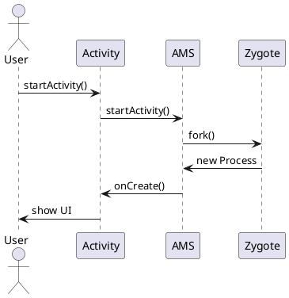
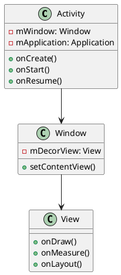
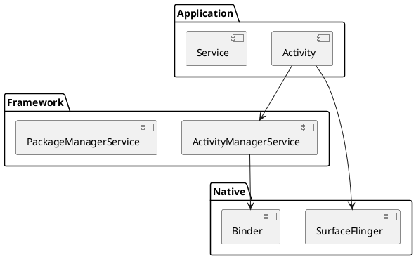
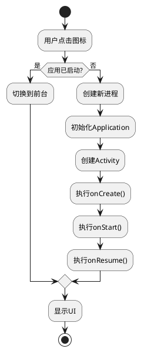
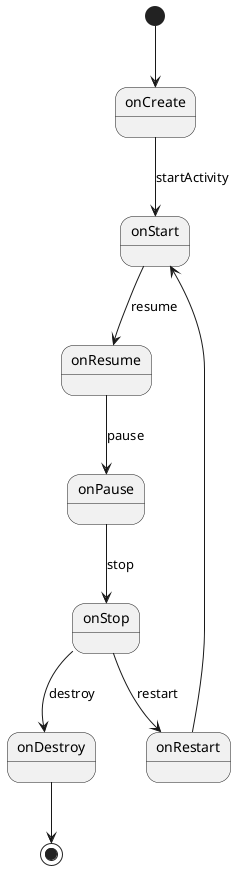
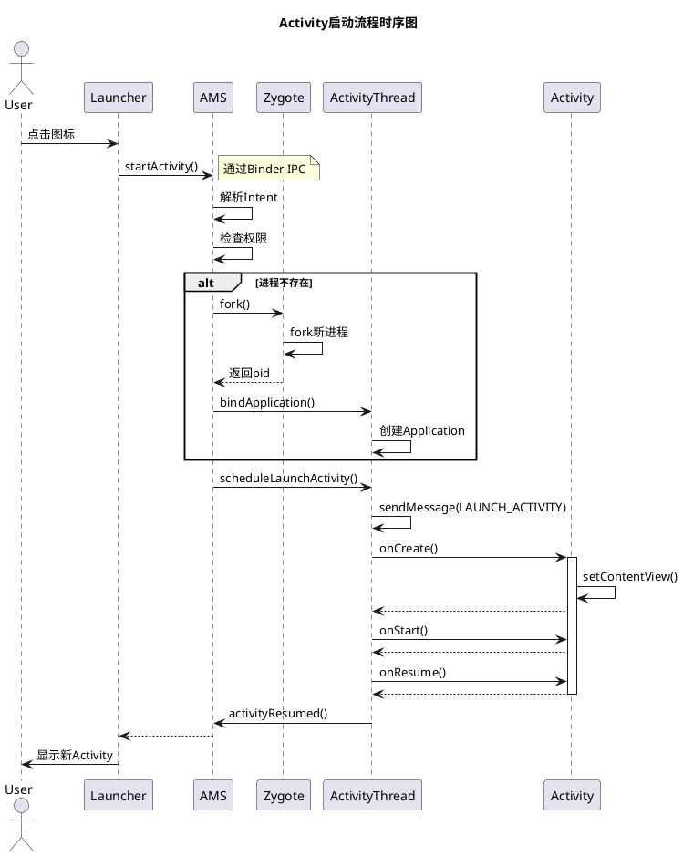

# PlantUML使用指南
{: .no_toc }

本站支持PlantUML图表，可以直接在Markdown中绘制UML图、流程图、时序图等。
{: .fs-6 .fw-300 }

## 目录
{: .no_toc .text-delta }

1. TOC
{:toc}

---

## PlantUML简介

PlantUML是一个开源工具，使用简单的文本描述来绘制UML图表。本站集成了PlantUML在线渲染功能，您只需编写PlantUML代码，图表会自动生成并显示。

---

## 使用方法

### 方法1：使用图片链接（推荐）

直接使用PlantUML在线服务器生成的图片链接：

```markdown

```

### 方法2：嵌入PlantUML代码

在文档中嵌入PlantUML源代码（需要编码）：

```markdown

```

---

## 图表类型示例

### 1. 时序图（Sequence Diagram）

时序图用于展示对象之间的交互顺序。

**PlantUML代码：**


**渲染效果：**


---

### 2. 类图（Class Diagram）

类图用于展示类的结构和类之间的关系。

**PlantUML代码：**


**渲染效果：**


---

### 3. 组件图（Component Diagram）

组件图用于展示系统的组件结构。

**PlantUML代码：**


---

### 4. 流程图（Activity Diagram）

流程图用于展示业务流程或算法逻辑。

**PlantUML代码：**


**渲染效果：**


---

### 5. 状态图（State Diagram）

状态图用于展示对象的状态转换。

**PlantUML代码：**


**渲染效果：**


---

## PlantUML语法速查

### 基本元素

| 元素 | 语法 | 说明 |
|------|------|------|
| 参与者 | `participant "名称" as 别名` | 时序图参与者 |
| 消息 | `A -> B: 消息内容` | 同步消息 |
| 返回 | `B --> A: 返回内容` | 返回消息 |
| 注释 | `note left of A: 注释` | 添加注释 |
| 类 | `class 类名` | 定义类 |
| 关系 | `A <|-- B` | 继承关系 |
| 关联 | `A --> B` | 关联关系 |

### 常用指令

```plantuml
@startuml        ' 开始
title 标题       ' 添加标题
actor 角色       ' 定义角色
participant 参与者  ' 定义参与者
note left: 注释   ' 添加注释
@enduml          ' 结束
```

---

## 在线工具

- **PlantUML在线编辑器**：[http://www.plantuml.com/plantuml/](http://www.plantuml.com/plantuml/)
- **PlantUML官方文档**：[https://plantuml.com/zh/](https://plantuml.com/zh/)
- **语法参考卡**：[https://plantuml.com/zh/guide](https://plantuml.com/zh/guide)

---

## 本地生成PlantUML图片

如果您想在本地生成PlantUML图片，可以使用我们提供的脚本：

```bash
bash /mnt/01_lixin_workspace/scripts/install_plantuml.sh
```

这将安装PlantUML及其依赖，之后可以使用以下命令生成图片：

```bash
plantuml diagram.puml
```

---

## 最佳实践

### 1. 保持简洁
- 避免在一张图中包含过多元素
- 适当使用子图（subgraph）分组

### 2. 统一风格
- 使用一致的命名规范
- 保持图表样式统一

### 3. 添加注释
- 对关键流程添加note说明
- 使用颜色区分重要元素

### 4. 文件管理
- 将复杂的PlantUML代码保存为`.puml`文件
- 使用版本控制管理图表源码

---

## 示例：Activity启动流程完整时序图



---

## 常见问题

### Q: 图片加载失败怎么办？

A: 
1. 检查PlantUML语法是否正确
2. 确认网络可以访问 plantuml.com
3. 使用本地PlantUML工具生成图片

### Q: 如何自定义图表样式？

A: 使用PlantUML的样式指令：
```plantuml
skinparam backgroundColor #EEEBDC
skinparam handwritten true
```

### Q: 支持中文吗？

A: 完全支持，直接在PlantUML代码中使用中文即可。

---

## 参考资源

- [PlantUML官方网站](https://plantuml.com/)
- [PlantUML中文文档](https://plantuml.com/zh/)
- [Real World PlantUML](https://real-world-plantuml.com/) - 真实案例集合
- [PlantUML Cheat Sheet](https://ogom.github.io/draw_uml/plantuml/) - 语法速查表

---

Happy Diagramming! 🎨

